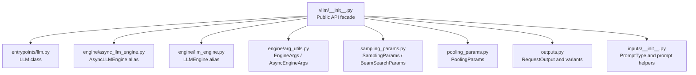
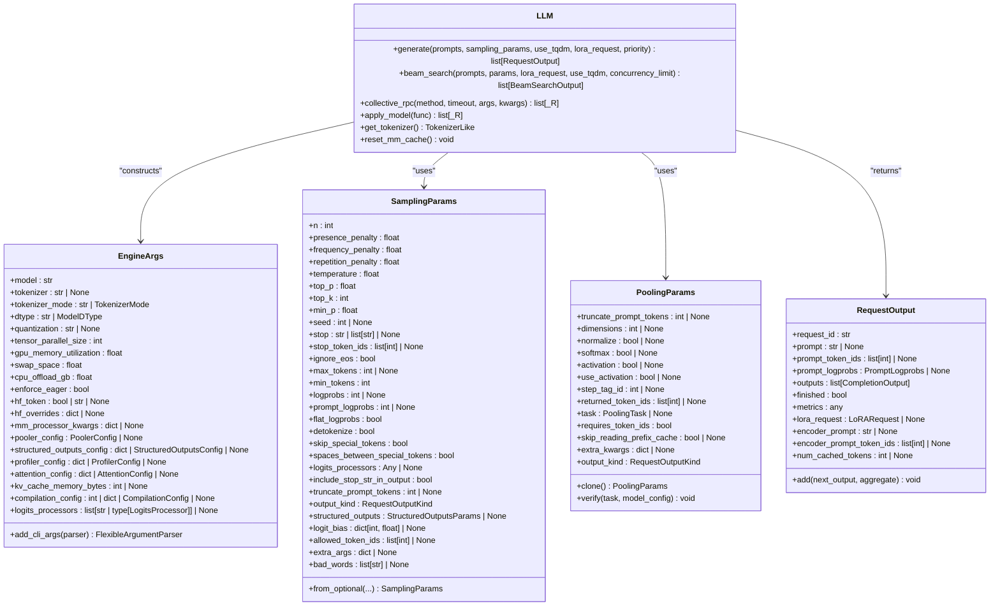
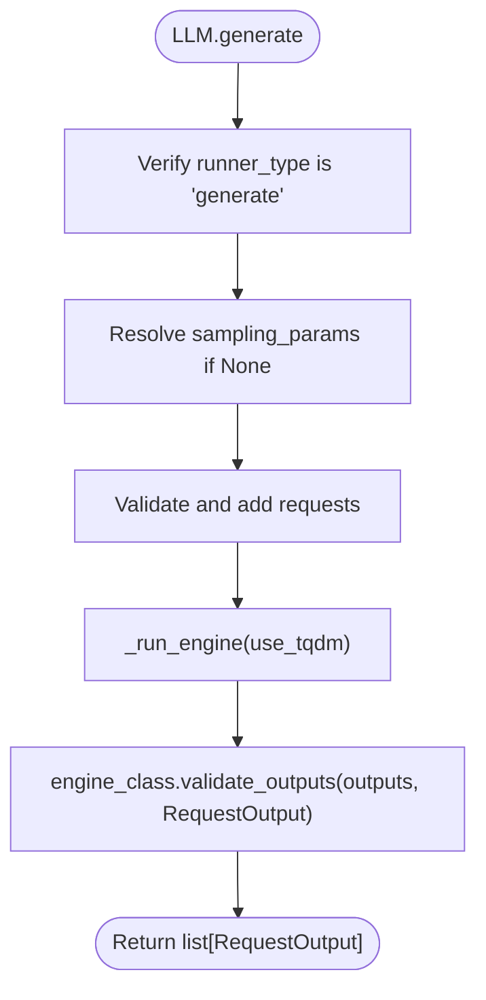
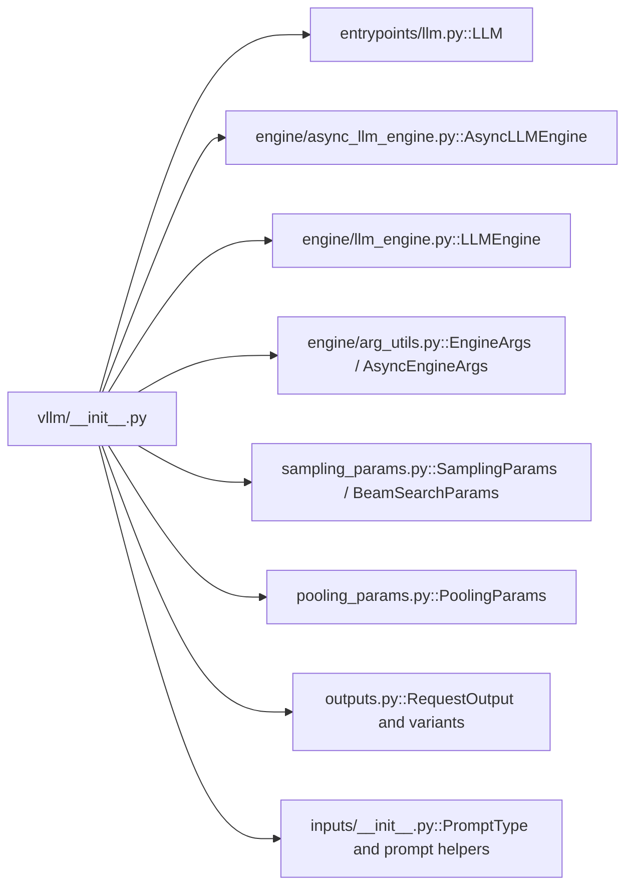

# API Reference

<cite>
**Referenced Files in This Document**
- [__init__.py](file://vllm/__init__.py)
- [version.py](file://vllm/version.py)
- [llm.py](file://vllm/entrypoints/llm.py)
- [async_llm_engine.py](file://vllm/engine/async_llm_engine.py)
- [llm_engine.py](file://vllm/engine/llm_engine.py)
- [arg_utils.py](file://vllm/engine/arg_utils.py)
- [sampling_params.py](file://vllm/sampling_params.py)
- [pooling_params.py](file://vllm/pooling_params.py)
- [outputs.py](file://vllm/outputs.py)
- [__init__.py](file://vllm/inputs/__init__.py)
- [cli/__init__.py](file://vllm/entrypoints/cli/__init__.py)
- [README.md](file://docs/cli/README.md)
- [engine_args.md](file://docs/configuration/engine_args.md)
- [env_vars.md](file://docs/configuration/env_vars.md)
</cite>

## Table of Contents
1. [Introduction](#introduction)
2. [Project Structure](#project-structure)
3. [Core Components](#core-components)
4. [Architecture Overview](#architecture-overview)
5. [Detailed Component Analysis](#detailed-component-analysis)
6. [Dependency Analysis](#dependency-analysis)
7. [Performance Considerations](#performance-considerations)
8. [Troubleshooting Guide](#troubleshooting-guide)
9. [Conclusion](#conclusion)
10. [Appendices](#appendices)

## Introduction
This document provides comprehensive API documentation for vLLM’s Python API, CLI interface, and configuration options. It covers the public classes, methods, functions, parameters, data models, and return values. It also documents the AsyncLLMEngine, LLM class, and related core APIs, along with CLI commands, configuration parameters, environment variables, API versioning, deprecation notices, migration guidance, thread safety, performance considerations, and best practices.

## Project Structure
At a high level, the vLLM package exposes a concise public API surface via the top-level module, which lazily imports and re-exports key classes and data models. The primary runtime entry points are:
- LLM: high-level synchronous inference API for offline inference.
- AsyncLLMEngine: asynchronous engine for streaming and production serving.
- EngineArgs and AsyncEngineArgs: configuration classes for engine initialization.
- SamplingParams and PoolingParams: typed configuration for generation and pooling tasks.
- Outputs: standardized request/response data models.

**Diagram sources**
- [__init__.py](file://vllm/__init__.py#L1-L108)
- [llm.py](file://vllm/entrypoints/llm.py#L93-L120)
- [async_llm_engine.py](file://vllm/engine/async_llm_engine.py#L1-L7)
- [llm_engine.py](file://vllm/engine/llm_engine.py#L1-L7)
- [arg_utils.py](file://vllm/engine/arg_utils.py#L354-L700)
- [sampling_params.py](file://vllm/sampling_params.py#L111-L233)
- [pooling_params.py](file://vllm/pooling_params.py#L15-L63)
- [outputs.py](file://vllm/outputs.py#L84-L191)
- [__init__.py](file://vllm/inputs/__init__.py#L1-L45)

**Section sources**
- [__init__.py](file://vllm/__init__.py#L1-L108)

## Core Components
- LLM: High-level synchronous inference class for offline generation, pooling, and scoring. Supports batching, LoRA, multimodal inputs, structured outputs, and advanced sampling controls.
- AsyncLLMEngine: Asynchronous engine for streaming generation and production serving.
- EngineArgs: Typed configuration for model selection, quantization, memory, parallelism, and observability.
- SamplingParams: Generation controls (temperature, top-p, penalties, stop tokens, logprobs, structured outputs).
- PoolingParams: Pooling/embedding/classification/scoring parameters.
- RequestOutput and related outputs: Standardized response containers for completions, embeddings, classifications, and scoring.

Key public exports and their locations:
- LLM, AsyncLLMEngine, LLMEngine, EngineArgs, AsyncEngineArgs, SamplingParams, PoolingParams, RequestOutput, CompletionOutput, EmbeddingOutput, ClassificationOutput, ScoringOutput, PromptType, TextPrompt, TokensPrompt, ModelRegistry are exported from the top-level module.

**Section sources**
- [__init__.py](file://vllm/__init__.py#L16-L108)
- [llm.py](file://vllm/entrypoints/llm.py#L93-L120)
- [sampling_params.py](file://vllm/sampling_params.py#L111-L233)
- [pooling_params.py](file://vllm/pooling_params.py#L15-L63)
- [outputs.py](file://vllm/outputs.py#L84-L191)
- [__init__.py](file://vllm/inputs/__init__.py#L1-L45)

## Architecture Overview
The vLLM runtime architecture centers around a modern engine abstraction with a clean separation between:
- Public API (LLM, AsyncLLMEngine)
- Engine configuration (EngineArgs)
- Sampling and pooling configuration (SamplingParams, PoolingParams)
- Standardized outputs (RequestOutput and task-specific variants)

**Diagram sources**
- [llm.py](file://vllm/entrypoints/llm.py#L93-L120)
- [arg_utils.py](file://vllm/engine/arg_utils.py#L354-L700)
- [sampling_params.py](file://vllm/sampling_params.py#L111-L233)
- [pooling_params.py](file://vllm/pooling_params.py#L15-L63)
- [outputs.py](file://vllm/outputs.py#L84-L191)

## Detailed Component Analysis

### LLM Class
The LLM class is the primary high-level API for offline inference. It encapsulates a model, tokenizer, and engine, and provides methods for generation, beam search, and pooling-like operations.

- Constructor parameters:
  - Model selection and tokenizer: model, tokenizer, tokenizer_mode, skip_tokenizer_init, trust_remote_code, allowed_local_media_path, allowed_media_domains.
  - Hardware and memory: tensor_parallel_size, dtype, quantization, revision, tokenizer_revision, seed.
  - Memory tuning: gpu_memory_utilization, kv_cache_memory_bytes, swap_space, cpu_offload_gb, enforce_eager, disable_custom_all_reduce.
  - Hugging Face integration: hf_token, hf_overrides.
  - Multimodal: mm_processor_kwargs, pooler_config, structured_outputs_config, profiler_config, attention_config.
  - Compilation and logits processors: compilation_config, logits_processors.
  - Additional engine args via kwargs.

- Methods:
  - generate(prompts, sampling_params, use_tqdm, lora_request, priority) -> list[RequestOutput]: Performs generation with batching and memory-aware scheduling.
  - beam_search(prompts, params, lora_request, use_tqdm, concurrency_limit) -> list[BeamSearchOutput]: Implements beam search with configurable width and length penalty.
  - get_tokenizer(): Returns the tokenizer instance.
  - reset_mm_cache(): Clears multimodal caches.
  - collective_rpc(method, timeout, args, kwargs): Executes a method across workers.
  - apply_model(func): Applies a function to the model on each worker.

- Notes:
  - LLM.generate() is only supported for generative models; otherwise raises a ValueError.
  - Modality-specific LoRA resolution is handled internally for multimodal prompts.

**Section sources**
- [llm.py](file://vllm/entrypoints/llm.py#L93-L120)
- [llm.py](file://vllm/entrypoints/llm.py#L365-L435)
- [llm.py](file://vllm/entrypoints/llm.py#L586-L768)
- [llm.py](file://vllm/entrypoints/llm.py#L351-L357)
- [llm.py](file://vllm/entrypoints/llm.py#L525-L556)

#### LLM.generate Flow

**Diagram sources**
- [llm.py](file://vllm/entrypoints/llm.py#L409-L435)

### AsyncLLMEngine
AsyncLLMEngine is an alias for the underlying AsyncLLM implementation. It is designed for streaming generation and production serving scenarios. It supports asynchronous request submission and streaming of token deltas.

- Alias mapping:
  - AsyncLLMEngine = AsyncLLM (v1 engine).

**Section sources**
- [async_llm_engine.py](file://vllm/engine/async_llm_engine.py#L1-L7)

### EngineArgs and AsyncEngineArgs
EngineArgs defines the complete configuration surface for initializing the engine. It aggregates fields from ModelConfig, LoadConfig, ParallelConfig, CacheConfig, SchedulerConfig, AttentionConfig, StructuredOutputsConfig, ProfilerConfig, and more.

- Key categories:
  - ModelConfig: model, tokenizer, tokenizer_mode, trust_remote_code, dtype, quantization, revision, tokenizer_revision, hf_token, hf_overrides, pooler_config, generation_config, override_generation_config, enable_sleep_mode, model_impl, override_attention_dtype, logits_processors, io_processor_plugin.
  - LoadConfig: load_format, download_dir, safetensors_load_strategy, model_loader_extra_config, ignore_patterns, use_tqdm_on_load, pt_load_map_location.
  - ParallelConfig: distributed_executor_backend, tensor_parallel_size, pipeline_parallel_size, master_addr, master_port, nnodes, node_rank, decode_context_parallel_size, prefill_context_parallel_size, data_parallel_size, data_parallel_rank, data_parallel_start_rank, data_parallel_size_local, data_parallel_address, data_parallel_rpc_port, data_parallel_backend, enable_expert_parallel, all2all_backend, enable_dbo, ubatch_size, dbo_decode_token_threshold, dbo_prefill_token_threshold, disable_nccl_for_dp_synchronization, eplb_config, enable_eplb, expert_placement_strategy, _api_process_count, _api_process_rank, max_parallel_loading_workers, ray_workers_use_nsight, worker_cls, worker_extension_cls.
  - CacheConfig: block_size, enable_prefix_caching, prefix_caching_hash_algo, swap_space, cpu_offload_gb, gpu_memory_utilization, kv_cache_memory_bytes, num_gpu_blocks_override, calculate_kv_scales, mamba_cache_dtype, mamba_ssm_cache_dtype, mamba_block_size, kv_sharing_fast_prefill, kv_offloading_size, kv_offloading_backend.
  - SchedulerConfig: max_num_batched_tokens, max_num_partial_prefills, max_long_partial_prefills, long_prefill_token_threshold, max_num_seqs, async_scheduling, stream_interval, disable_hybrid_kv_cache_manager.
  - AttentionConfig: backend.
  - StructuredOutputsConfig: reasoning_parser, reasoning_parser_plugin.
  - ProfilerConfig: fields for profiling.
  - ObservabilityConfig: show_hidden_metrics_for_version, otlp_traces_endpoint, collect_detailed_traces, kv_cache_metrics, kv_cache_metrics_sample, cudagraph_metrics, enable_layerwise_nvtx_tracing, enable_mfu_metrics.
  - MultiModalConfig: limit_per_prompt, enable_mm_embeds, interleave_mm_strings, media_io_kwargs, mm_processor_kwargs, mm_processor_cache_gb, mm_processor_cache_type, mm_shm_cache_max_object_size_mb, mm_encoder_tp_mode, mm_encoder_attn_backend, skip_mm_profiling, video_pruning_rate.
  - LoRAConfig: enable_lora, max_loras, max_lora_rank, default_mm_loras, fully_sharded_loras, max_cpu_loras, lora_dtype.
  - VllmConfig: structured_outputs_config, compilation_config, additional_config, optimization_level.

- CLI integration:
  - add_cli_args(parser) adds grouped CLI arguments for each config category.

**Section sources**
- [arg_utils.py](file://vllm/engine/arg_utils.py#L354-L700)
- [arg_utils.py](file://vllm/engine/arg_utils.py#L700-L1200)
- [arg_utils.py](file://vllm/engine/arg_utils.py#L1200-L1700)
- [arg_utils.py](file://vllm/engine/arg_utils.py#L1700-L2088)

### SamplingParams
SamplingParams controls generation behavior and includes:
- Diversity and randomness: n, temperature, top_p, top_k, min_p, seed.
- Penalties: presence_penalty, frequency_penalty, repetition_penalty.
- Stopping: stop (string or list), stop_token_ids, ignore_eos, include_stop_str_in_output.
- Length control: max_tokens, min_tokens, truncate_prompt_tokens.
- Logprobs: logprobs, prompt_logprobs, flat_logprobs, detokenize, skip_special_tokens, spaces_between_special_tokens.
- Advanced: logits_processors, structured_outputs, logit_bias, allowed_token_ids, bad_words, extra_args, output_kind.

- Validation:
  - Enforces ranges and mutual exclusivity (e.g., greedy vs. sampling).
  - Normalizes stop strings and token IDs.
  - Converts logprobs booleans to counts.

- Helpers:
  - from_optional(...): convenience builder with defaults.

**Section sources**
- [sampling_params.py](file://vllm/sampling_params.py#L111-L233)
- [sampling_params.py](file://vllm/sampling_params.py#L244-L314)
- [sampling_params.py](file://vllm/sampling_params.py#L315-L448)
- [sampling_params.py](file://vllm/sampling_params.py#L449-L535)

### PoolingParams
PoolingParams configures pooling, embedding, classification, scoring, and token-level pooling:
- truncate_prompt_tokens: truncation control.
- Embedding: dimensions, normalize.
- Classification/Scoring: softmax (deprecated), activation (deprecated), use_activation.
- Step pooling: step_tag_id, returned_token_ids.
- Internal: task, requires_token_ids, skip_reading_prefix_cache, extra_kwargs, output_kind.

- Verification:
  - Validates task-specific parameters and merges defaults from model configuration.
  - Enforces deprecations and step-pooling constraints.

**Section sources**
- [pooling_params.py](file://vllm/pooling_params.py#L15-L63)
- [pooling_params.py](file://vllm/pooling_params.py#L82-L111)
- [pooling_params.py](file://vllm/pooling_params.py#L112-L170)
- [pooling_params.py](file://vllm/pooling_params.py#L171-L211)
- [pooling_params.py](file://vllm/pooling_params.py#L212-L231)

### Outputs and Data Models
Standardized response models:
- RequestOutput: request metadata, prompt info, outputs (list of CompletionOutput), finished flag, metrics, LoRA request, encoder prompt info, cached token count, and multimodal placeholders.
- CompletionOutput: per-output text, token_ids, cumulative logprobs, logprobs, finish_reason, stop_reason, LoRA request.
- PoolingRequestOutput generic: request_id, outputs (PoolingOutput), prompt_token_ids, num_cached_tokens, finished.
- EmbeddingRequestOutput: specialized pooling output for embeddings.
- ClassificationRequestOutput: specialized pooling output for classification probabilities.
- ScoringRequestOutput: specialized pooling output for scalar scores.

- Utilities:
  - RequestOutput.add(next_output, aggregate): merges streaming outputs.

**Section sources**
- [outputs.py](file://vllm/outputs.py#L22-L63)
- [outputs.py](file://vllm/outputs.py#L84-L191)
- [outputs.py](file://vllm/outputs.py#L196-L230)
- [outputs.py](file://vllm/outputs.py#L232-L270)
- [outputs.py](file://vllm/outputs.py#L271-L309)
- [outputs.py](file://vllm/outputs.py#L311-L346)

### CLI Commands and Subcommands
vLLM exposes a CLI with benchmark subcommands under entrypoints/cli. The CLI integrates EngineArgs and supports model resolution, quantization, and parallel configurations.

- Available subcommands:
  - BenchmarkLatencySubcommand
  - BenchmarkServingSubcommand
  - BenchmarkStartupSubcommand
  - BenchmarkSweepSubcommand
  - BenchmarkThroughputSubcommand

- Documentation:
  - CLI overview and usage are documented in docs/cli/README.md.
  - Engine arguments and environment variables are documented in docs/configuration/engine_args.md and docs/configuration/env_vars.md.

**Section sources**
- [cli/__init__.py](file://vllm/entrypoints/cli/__init__.py#L1-L16)
- [README.md](file://docs/cli/README.md)
- [engine_args.md](file://docs/configuration/engine_args.md)
- [env_vars.md](file://docs/configuration/env_vars.md)

## Dependency Analysis
The public API facade in vllm/__init__.py lazily imports and re-exports core components, ensuring minimal import-time overhead and consistent availability.

**Diagram sources**
- [__init__.py](file://vllm/__init__.py#L16-L108)

**Section sources**
- [__init__.py](file://vllm/__init__.py#L16-L108)

## Performance Considerations
- Use appropriate dtype and quantization to balance quality and throughput.
- Tune gpu_memory_utilization and kv_cache_memory_bytes for target workload.
- Prefer batching prompts in a single generate() call for optimal memory utilization.
- Enable prefix caching for repeated prompts to reduce compute.
- Use enforce_eager=False to leverage CUDA graph capture for steady-state throughput.
- For high-throughput serving, prefer AsyncLLMEngine with streaming and proper scheduler configuration.
- Limit LoRA usage to necessary requests to reduce overhead.
- Use structured_outputs for constrained generation to reduce retries.

[No sources needed since this section provides general guidance]

## Troubleshooting Guide
- LLM.generate() raises ValueError for non-generative runners; ensure runner is configured for generation.
- SamplingParams validation errors indicate invalid parameter ranges or incompatible combinations; adjust penalties, top_k, temperature, or logprobs settings accordingly.
- If OOM occurs, reduce max_num_batched_tokens, increase swap_space, or lower gpu_memory_utilization.
- For multimodal inputs, ensure allowed_local_media_path and allowed_media_domains are set appropriately for security and correctness.
- Use collective_rpc and apply_model for diagnostics and lightweight worker-side inspection.

**Section sources**
- [llm.py](file://vllm/entrypoints/llm.py#L409-L417)
- [sampling_params.py](file://vllm/sampling_params.py#L369-L448)

## Conclusion
vLLM provides a cohesive and powerful API for both offline and online inference. The LLM class offers a streamlined interface for generation and pooling, while AsyncLLMEngine enables scalable streaming serving. EngineArgs centralizes configuration, SamplingParams and PoolingParams provide precise control over generation and pooling, and standardized outputs unify response handling. The CLI and configuration docs complement the API for operational workflows.

[No sources needed since this section summarizes without analyzing specific files]

## Appendices

### API Versioning and Deprecations
- Version metadata is exposed via version.py and includes helpers to compare previous minor versions for metrics visibility toggles.
- Deprecations:
  - softmax and activation in PoolingParams are deprecated in favor of use_activation.
  - Legacy prompt parameters via keyword arguments in LLM.generate() are discouraged; use inputs instead.

**Section sources**
- [version.py](file://vllm/version.py#L15-L40)
- [pooling_params.py](file://vllm/pooling_params.py#L46-L51)

### Migration Guide
- Replace direct usage of deprecated softmax/activation with use_activation in PoolingParams.
- Migrate from legacy prompt keyword arguments to the inputs parameter in generation methods.
- When moving from synchronous to asynchronous serving, switch to AsyncLLMEngine and adapt streaming logic using RequestOutputKind and output_kind.

**Section sources**
- [pooling_params.py](file://vllm/pooling_params.py#L46-L51)
- [llm.py](file://vllm/entrypoints/llm.py#L400-L408)

### Thread Safety and Concurrency
- LLM is designed for single-threaded usage per instance; avoid concurrent calls to generate() on the same instance.
- AsyncLLMEngine is intended for asynchronous, concurrent request handling; ensure proper lifecycle management and resource cleanup.
- collective_rpc and apply_model operate across workers; avoid returning large tensors from apply_model to minimize VRAM pressure.

**Section sources**
- [llm.py](file://vllm/entrypoints/llm.py#L525-L556)
- [llm.py](file://vllm/entrypoints/llm.py#L557-L569)

### Practical Usage Patterns
- Offline generation:
  - Instantiate LLM with desired model and engine args.
  - Prepare prompts and SamplingParams; call generate().
  - Inspect RequestOutput and CompletionOutput for results.
- Streaming serving:
  - Use AsyncLLMEngine for concurrent requests and streaming deltas.
  - Configure stream_interval and output_kind for desired streaming behavior.
- Pooling/embedding/classification/scoring:
  - Use PoolingParams with appropriate task and verification.
  - Convert pooling outputs to EmbeddingRequestOutput, ClassificationRequestOutput, or ScoringRequestOutput as needed.

**Section sources**
- [llm.py](file://vllm/entrypoints/llm.py#L365-L435)
- [sampling_params.py](file://vllm/sampling_params.py#L111-L233)
- [pooling_params.py](file://vllm/pooling_params.py#L15-L63)
- [outputs.py](file://vllm/outputs.py#L232-L309)