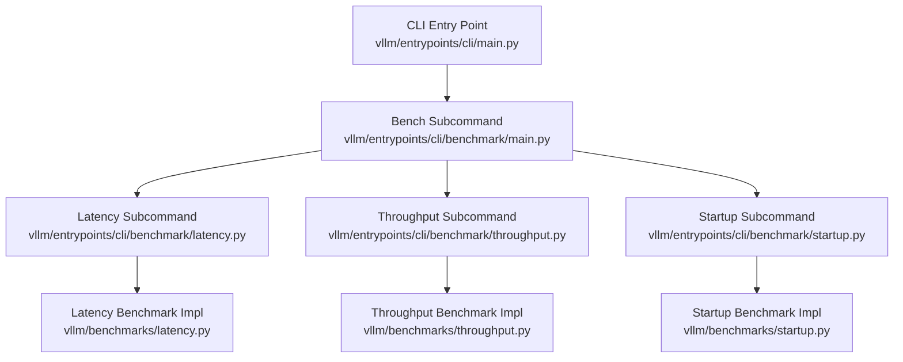
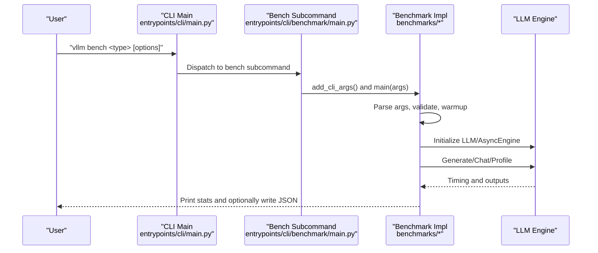
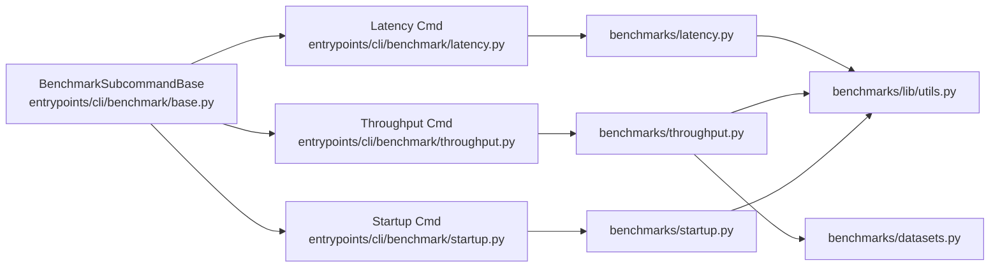

# Benchmark CLI

<cite>
**Referenced Files in This Document**
- [main.py](file://vllm/entrypoints/cli/main.py)
- [benchmark/main.py](file://vllm/entrypoints/cli/benchmark/main.py)
- [benchmark/base.py](file://vllm/entrypoints/cli/benchmark/base.py)
- [benchmark/latency.py](file://vllm/entrypoints/cli/benchmark/latency.py)
- [benchmark/throughput.py](file://vllm/entrypoints/cli/benchmark/throughput.py)
- [benchmark/startup.py](file://vllm/entrypoints/cli/benchmark/startup.py)
- [benchmarks/latency.py](file://vllm/benchmarks/latency.py)
- [benchmarks/throughput.py](file://vllm/benchmarks/throughput.py)
- [benchmarks/startup.py](file://vllm/benchmarks/startup.py)
- [benchmarks/lib/utils.py](file://vllm/benchmarks/lib/utils.py)
- [benchmarks/datasets.py](file://vllm/benchmarks/datasets.py)
</cite>

## Table of Contents
1. [Introduction](#introduction)
2. [Project Structure](#project-structure)
3. [Core Components](#core-components)
4. [Architecture Overview](#architecture-overview)
5. [Detailed Component Analysis](#detailed-component-analysis)
6. [Dependency Analysis](#dependency-analysis)
7. [Performance Considerations](#performance-considerations)
8. [Troubleshooting Guide](#troubleshooting-guide)
9. [Conclusion](#conclusion)
10. [Appendices](#appendices)

## Introduction
This document describes vLLM’s benchmarking CLI commands for measuring latency, throughput, and startup performance. It covers command syntax, benchmark parameters, output interpretation, and performance analysis guidelines. It also provides examples for different model sizes, hardware configurations, and workload patterns, along with methodology advice for statistical significance and result comparisons.

## Project Structure
The benchmarking CLI is organized under the CLI entrypoints and delegates to dedicated benchmark modules. The CLI entrypoint initializes subcommands and dispatches to the appropriate benchmark implementation.

**Diagram sources**
- [main.py](file://vllm/entrypoints/cli/main.py#L1-L80)
- [benchmark/main.py](file://vllm/entrypoints/cli/benchmark/main.py#L1-L57)
- [benchmark/latency.py](file://vllm/entrypoints/cli/benchmark/latency.py#L1-L22)
- [benchmark/throughput.py](file://vllm/entrypoints/cli/benchmark/throughput.py#L1-L22)
- [benchmark/startup.py](file://vllm/entrypoints/cli/benchmark/startup.py#L1-L22)
- [benchmarks/latency.py](file://vllm/benchmarks/latency.py#L1-L173)
- [benchmarks/throughput.py](file://vllm/benchmarks/throughput.py#L1-L812)
- [benchmarks/startup.py](file://vllm/benchmarks/startup.py#L1-L327)

**Section sources**
- [main.py](file://vllm/entrypoints/cli/main.py#L1-L80)
- [benchmark/main.py](file://vllm/entrypoints/cli/benchmark/main.py#L1-L57)

## Core Components
- Latency benchmark: Measures end-to-end latency for a single batch of requests, with warmup, percentile reporting, and optional profiling.
- Throughput benchmark: Measures offline throughput across a dataset of prompts, supporting multiple backends and async modes, with token accounting and percentiles.
- Startup benchmark: Measures cold and warm startup times, isolating compilation and runtime costs, with percentile reporting.

Key shared utilities:
- PyTorch benchmark export format conversion and JSON writer.
- Dataset sampling framework for synthetic and real-world workloads.

**Section sources**
- [benchmark/latency.py](file://vllm/entrypoints/cli/benchmark/latency.py#L1-L22)
- [benchmark/throughput.py](file://vllm/entrypoints/cli/benchmark/throughput.py#L1-L22)
- [benchmark/startup.py](file://vllm/entrypoints/cli/benchmark/startup.py#L1-L22)
- [benchmarks/latency.py](file://vllm/benchmarks/latency.py#L1-L173)
- [benchmarks/throughput.py](file://vllm/benchmarks/throughput.py#L1-L812)
- [benchmarks/startup.py](file://vllm/benchmarks/startup.py#L1-L327)
- [benchmarks/lib/utils.py](file://vllm/benchmarks/lib/utils.py#L1-L80)
- [benchmarks/datasets.py](file://vllm/benchmarks/datasets.py#L1-L200)

## Architecture Overview
The CLI orchestrates subcommands that parse arguments and delegate to benchmark implementations. The implementations construct an LLM engine, prepare prompts, and measure performance with warmup and iteration loops. Results are printed and optionally exported to JSON and PyTorch benchmark formats.

**Diagram sources**
- [main.py](file://vllm/entrypoints/cli/main.py#L1-L80)
- [benchmark/main.py](file://vllm/entrypoints/cli/benchmark/main.py#L1-L57)
- [benchmarks/latency.py](file://vllm/benchmarks/latency.py#L1-L173)
- [benchmarks/throughput.py](file://vllm/benchmarks/throughput.py#L1-L812)
- [benchmarks/startup.py](file://vllm/benchmarks/startup.py#L1-L327)

## Detailed Component Analysis

### vllm bench latency
Purpose: Measure latency for a single batch of requests with configurable warmup and percentile reporting.

Command syntax
- vllm bench latency [--input-len N] [--output-len N] [--batch-size N] [--n K] [--use-beam-search] [--num-iters-warmup N] [--num-iters N] [--profile] [--output-json PATH] [--disable-detokenize] [EngineArgs...]

Key parameters
- input-len: Prompt token length per request.
- output-len: Target generated token length per request.
- batch-size: Number of concurrent prompts in a batch.
- n: Number of sequences to generate per prompt.
- use-beam-search: Use beam search instead of sampling.
- num-iters-warmup: Iterations for warmup before benchmarking.
- num-iters: Benchmark iterations after warmup.
- profile: Enable profiling for a single run.
- output-json: Write JSON results including averages and percentiles.
- disable-detokenize: Exclude detokenization time from latency.

Warmup and batching
- Warmup runs are executed first to stabilize GPU/CPU caches and CUDA graphs.
- The engine may split oversized batches into multiple steps internally.
- Percentiles computed: 10, 25, 50, 75, 90, 99.

Statistical analysis
- Average latency and per-request latency array are reported.
- Optional PyTorch benchmark export is written when enabled.

Example usage
- Small model on CPU: vllm bench latency --model <model> --tensor-parallel-size 1 --input-len 64 --output-len 64 --batch-size 4 --num-iters-warmup 2 --num-iters 10
- Large model on multi-GPU: vllm bench latency --model <model> --tensor-parallel-size 4 --input-len 512 --output-len 128 --batch-size 32 --num-iters-warmup 5 --num-iters 20

Output interpretation
- Avg latency: Mean of measured per-iteration latencies.
- Percentiles: Tail latency characteristics; higher percentiles reveal worst-case stalls.

**Section sources**
- [benchmark/latency.py](file://vllm/entrypoints/cli/benchmark/latency.py#L1-L22)
- [benchmarks/latency.py](file://vllm/benchmarks/latency.py#L1-L173)
- [benchmarks/lib/utils.py](file://vllm/benchmarks/lib/utils.py#L1-L80)

### vllm bench throughput
Purpose: Measure offline throughput across a dataset of prompts, supporting multiple backends and async modes.

Command syntax
- vllm bench throughput --backend {vllm,hf,mii,vllm-chat} [--dataset-name NAME] [--dataset-path PATH] [--input-len N] [--output-len N] [--n K] [--num-prompts N] [--async-engine] [--disable-frontend-multiprocessing] [--disable-detokenize] [--lora-path PATH] [--prefix-len N] [--random-range-ratio R] [--hf-max-batch-size N] [--profile] [--output-json PATH] [EngineArgs/AsyncEngineArgs...]

Key parameters
- backend: vLLM, HuggingFace, MII, or vLLM chat.
- dataset-name: sharegpt, random, sonnet, burstgpt, hf, prefix_repetition.
- dataset-path: Path to dataset; varies by backend and dataset.
- input-len/output-len: Per-request lengths; can override dataset defaults.
- n: Sequences per prompt.
- num-prompts: Total number of prompts to process.
- async-engine: Use async engine client.
- disable-frontend-multiprocessing: Disable decoupled frontend multiprocessing for async engine.
- disable-detokenize: Exclude detokenization time from measurement.
- lora-path: Path to LoRA adapters (vLLM only).
- prefix-len: Fixed prefix tokens for random/sonnet datasets.
- random-range-ratio: Symmetric range ratio for random length sampling.
- hf-max-batch-size: Max batch size for HF backend.
- profile: Enable profiling for a single run.
- output-json: Write JSON results including throughput metrics and totals.

Concurrent request handling
- Synchronous mode: Single-threaded generation loop.
- Async mode: Spawns per-request generators and merges outputs asynchronously.
- Chat mode: Properly formats multimodal prompts and chat templates.

Resource utilization metrics
- Requests per second, total tokens per second, output tokens per second.
- Token accounting considers prompt and output token counts; multimodal token counting depends on backend.

Statistical significance
- Aggregate throughput improves with larger num-prompts.
- For async runs, ensure disable-frontend-multiprocessing aligns with desired concurrency model.

Example usage
- Synthetic random dataset: vllm bench throughput --backend vllm --dataset-name random --input-len 128 --output-len 128 --num-prompts 1000 --n 1 --async-engine
- Realistic conversations: vllm bench throughput --backend vllm --dataset-name sharegpt --dataset-path <path> --num-prompts 2000 --async-engine
- Multimodal chat: vllm bench throughput --backend vllm-chat --dataset-name hf --dataset-path <visionarena> --num-prompts 500

Output interpretation
- Throughput: Requests per second and tokens per second.
- Totals: Sum of prompt and output tokens across all requests.

**Section sources**
- [benchmark/throughput.py](file://vllm/entrypoints/cli/benchmark/throughput.py#L1-L22)
- [benchmarks/throughput.py](file://vllm/benchmarks/throughput.py#L1-L812)
- [benchmarks/datasets.py](file://vllm/benchmarks/datasets.py#L1-L200)
- [benchmarks/lib/utils.py](file://vllm/benchmarks/lib/utils.py#L1-L80)

### vllm bench startup
Purpose: Measure cold and warm startup times, including compilation time, with isolated subprocess execution.

Command syntax
- vllm bench startup [--num-iters-cold N] [--num-iters-warmup N] [--num-iters-warm N] [--output-json PATH] [EngineArgs...]

Key parameters
- num-iters-cold: Number of cold startup iterations.
- num-iters-warmup: Warmup iterations before measuring warm startup.
- num-iters-warm: Number of warm startup iterations.
- output-json: Write JSON results including averages and percentiles.

Methodology
- Cold startup: Uses a temporary cache directory and clears torch compile caches to eliminate artifacts.
- Warm startup: Reuses cached compilation and model metadata.
- Each iteration runs in a separate subprocess for complete isolation.

Statistical analysis
- Averages and percentiles for total startup time and compilation time across cold and warm scenarios.

Example usage
- Small model: vllm bench startup --model <model> --tensor-parallel-size 1 --num-iters-cold 3 --num-iters-warmup 2 --num-iters-warm 3
- Large model: vllm bench startup --model <model> --tensor-parallel-size 4 --num-iters-cold 5 --num-iters-warmup 3 --num-iters-warm 5

Output interpretation
- Cold vs warm averages and percentiles for total startup and compilation times.

**Section sources**
- [benchmark/startup.py](file://vllm/entrypoints/cli/benchmark/startup.py#L1-L22)
- [benchmarks/startup.py](file://vllm/benchmarks/startup.py#L1-L327)
- [benchmarks/lib/utils.py](file://vllm/benchmarks/lib/utils.py#L1-L80)

## Dependency Analysis
The CLI subcommands depend on their respective benchmark implementations, which in turn depend on the LLM engine and dataset utilities. The throughput benchmark integrates multiple dataset classes and supports multiple backends.

**Diagram sources**
- [benchmark/base.py](file://vllm/entrypoints/cli/benchmark/base.py#L1-L26)
- [benchmark/latency.py](file://vllm/entrypoints/cli/benchmark/latency.py#L1-L22)
- [benchmark/throughput.py](file://vllm/entrypoints/cli/benchmark/throughput.py#L1-L22)
- [benchmark/startup.py](file://vllm/entrypoints/cli/benchmark/startup.py#L1-L22)
- [benchmarks/latency.py](file://vllm/benchmarks/latency.py#L1-L173)
- [benchmarks/throughput.py](file://vllm/benchmarks/throughput.py#L1-L812)
- [benchmarks/startup.py](file://vllm/benchmarks/startup.py#L1-L327)
- [benchmarks/datasets.py](file://vllm/benchmarks/datasets.py#L1-L200)
- [benchmarks/lib/utils.py](file://vllm/benchmarks/lib/utils.py#L1-L80)

**Section sources**
- [benchmark/base.py](file://vllm/entrypoints/cli/benchmark/base.py#L1-L26)
- [benchmarks/throughput.py](file://vllm/benchmarks/throughput.py#L1-L812)
- [benchmarks/datasets.py](file://vllm/benchmarks/datasets.py#L1-L200)

## Performance Considerations
- Warmup: Always run sufficient warmup iterations to stabilize CUDA graphs, KV cache, and tokenizer caches.
- Batch sizing: Larger batches improve throughput but increase memory pressure; tune to model capacity and hardware.
- Detokenization: Disabling detokenization excludes text decoding time; choose based on whether you want total generation time or generation-only time.
- Concurrency: Async engine increases concurrency; evaluate trade-offs with frontend multiprocessing and CPU/GPU balance.
- Multimodal: Chat backend is recommended for multimodal inputs to ensure accurate token accounting.
- Statistical significance: Increase num-iters or num-prompts to reduce variance; use percentiles to capture tail behavior.

[No sources needed since this section provides general guidance]

## Troubleshooting Guide
Common issues and resolutions
- Model length constraints: Ensure max_model_len is greater than input_len + output_len; otherwise, the benchmark aborts with a validation error.
- Backend-specific constraints: Some backends impose restrictions (e.g., LoRA only with vLLM, HF requires max batch size).
- Data parallel limitations: Offline throughput with data parallel requires external launcher mode and synchronous engine.
- Profiling: Torch/Triton profilers require proper configuration; only a single profile run is executed in latency and throughput benchmarks.
- Startup isolation: Subprocess isolation is mandatory; errors from subprocesses are propagated with messages.

**Section sources**
- [benchmarks/latency.py](file://vllm/benchmarks/latency.py#L1-L173)
- [benchmarks/throughput.py](file://vllm/benchmarks/throughput.py#L1-L812)
- [benchmarks/startup.py](file://vllm/benchmarks/startup.py#L1-L327)

## Conclusion
The vLLM benchmarking CLI provides three complementary capabilities: latency for single-batch measurements, throughput for offline workloads, and startup for cold/warm boot characterization. By carefully selecting parameters, running adequate warmups, and interpreting percentiles, users can obtain reliable and reproducible performance insights across diverse model sizes and hardware configurations.

[No sources needed since this section summarizes without analyzing specific files]

## Appendices

### Command Reference Tables

- vllm bench latency
  - Purpose: Measure latency for a single batch of requests.
  - Key options: --input-len, --output-len, --batch-size, --n, --use-beam-search, --num-iters-warmup, --num-iters, --profile, --output-json, --disable-detokenize.
  - Outputs: Average latency, percentiles, optional JSON and PyTorch benchmark export.

- vllm bench throughput
  - Purpose: Measure offline throughput across a dataset.
  - Key options: --backend, --dataset-name, --dataset-path, --input-len, --output-len, --n, --num-prompts, --async-engine, --disable-frontend-multiprocessing, --disable-detokenize, --lora-path, --prefix-len, --random-range-ratio, --hf-max-batch-size, --profile, --output-json.
  - Outputs: Requests/sec, tokens/sec, totals, optional JSON and PyTorch benchmark export.

- vllm bench startup
  - Purpose: Measure cold and warm startup times.
  - Key options: --num-iters-cold, --num-iters-warmup, --num-iters-warm, --output-json.
  - Outputs: Averages and percentiles for total startup and compilation times, optional JSON and PyTorch benchmark exports.

**Section sources**
- [benchmarks/latency.py](file://vllm/benchmarks/latency.py#L1-L173)
- [benchmarks/throughput.py](file://vllm/benchmarks/throughput.py#L1-L812)
- [benchmarks/startup.py](file://vllm/benchmarks/startup.py#L1-L327)
- [benchmarks/lib/utils.py](file://vllm/benchmarks/lib/utils.py#L1-L80)