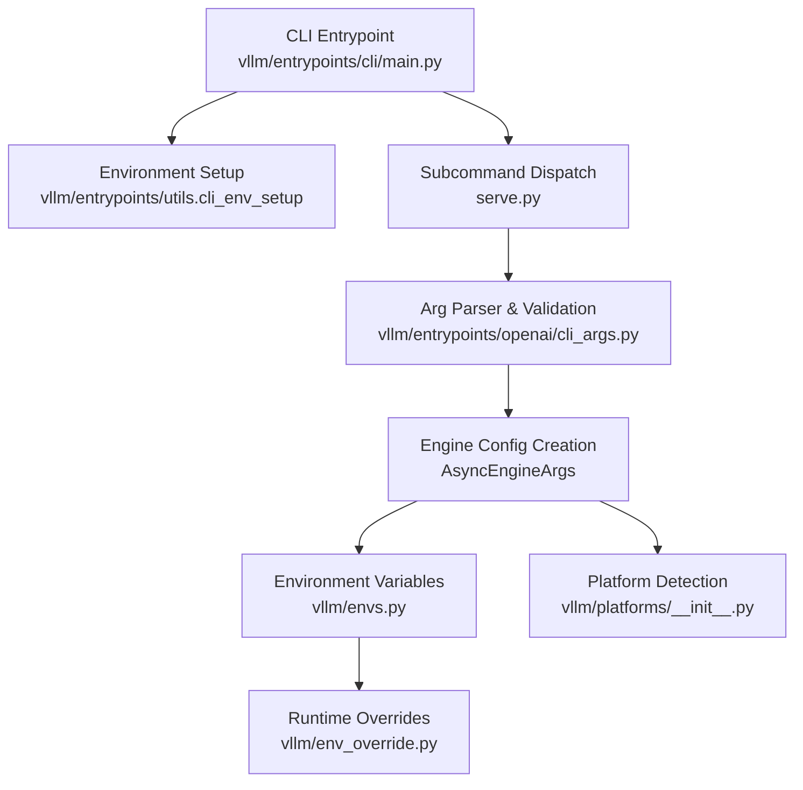
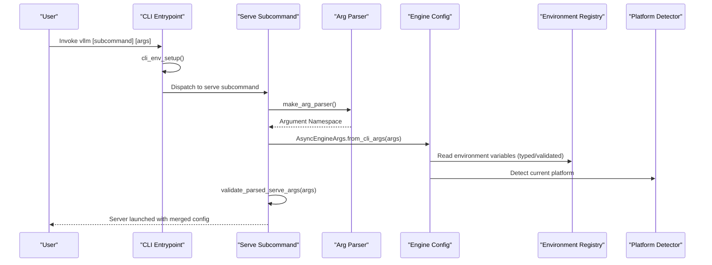
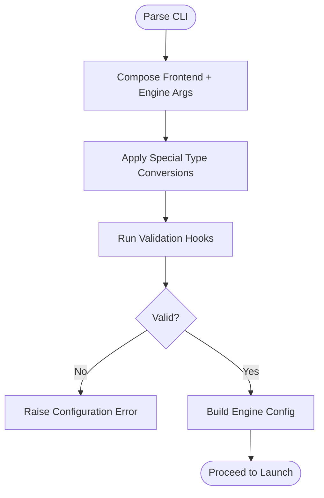
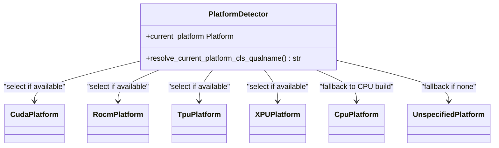
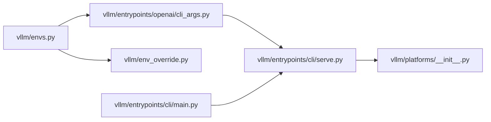

# CLI Configuration and Environment

<cite>
**Referenced Files in This Document**
- [envs.py](file://vllm/envs.py)
- [env_override.py](file://vllm/env_override.py)
- [main.py](file://vllm/entrypoints/cli/main.py)
- [serve.py](file://vllm/entrypoints/cli/serve.py)
- [cli_args.py](file://vllm/entrypoints/openai/cli_args.py)
- [platforms/__init__.py](file://vllm/platforms/__init__.py)
- [env_vars.md](file://docs/configuration/env_vars.md)
</cite>

## Table of Contents
1. [Introduction](#introduction)
2. [Project Structure](#project-structure)
3. [Core Components](#core-components)
4. [Architecture Overview](#architecture-overview)
5. [Detailed Component Analysis](#detailed-component-analysis)
6. [Dependency Analysis](#dependency-analysis)
7. [Performance Considerations](#performance-considerations)
8. [Troubleshooting Guide](#troubleshooting-guide)
9. [Conclusion](#conclusion)
10. [Appendices](#appendices)

## Introduction
This document explains how vLLM’s CLI discovers and applies configuration from environment variables and command-line arguments. It covers:
- How environment variables influence CLI behavior, including platform selection, device allocation, and performance tuning.
- How configuration files and CLI arguments are combined and prioritized.
- Platform-specific settings for CUDA, ROCm, and CPU deployments.
- Argument parsing behavior, type validation, and configuration validation errors.
- Practical examples, troubleshooting tips, and best practices for different deployment environments.

## Project Structure
The CLI entrypoints and configuration pipeline are organized as follows:
- CLI entrypoint initializes subcommands and environment setup.
- The serve subcommand builds engine configuration from CLI arguments and environment variables.
- Platform detection resolves the active platform (CUDA, ROCm, CPU, etc.) based on environment and installed libraries.
- Environment variable definitions and validators are centralized for consistent behavior across the system.

**Diagram sources**
- [main.py](file://vllm/entrypoints/cli/main.py#L16-L80)
- [serve.py](file://vllm/entrypoints/cli/serve.py#L42-L110)
- [cli_args.py](file://vllm/entrypoints/openai/cli_args.py#L244-L303)
- [envs.py](file://vllm/envs.py#L448-L1576)
- [platforms/__init__.py](file://vllm/platforms/__init__.py#L191-L232)
- [env_override.py](file://vllm/env_override.py#L12-L379)

**Section sources**
- [main.py](file://vllm/entrypoints/cli/main.py#L16-L80)
- [serve.py](file://vllm/entrypoints/cli/serve.py#L42-L110)
- [cli_args.py](file://vllm/entrypoints/openai/cli_args.py#L244-L303)
- [envs.py](file://vllm/envs.py#L448-L1576)
- [platforms/__init__.py](file://vllm/platforms/__init__.py#L191-L232)
- [env_override.py](file://vllm/env_override.py#L12-L379)

## Core Components
- Environment variable registry and validators:
  - Centralized mapping of environment variables to typed getters and validators.
  - Includes numeric, boolean, and enumerated choices with case sensitivity controls.
- CLI argument parsing and validation:
  - Aggregates frontend and engine arguments into a single parser.
  - Provides validation hooks for early failure on invalid combinations.
- Platform detection:
  - Automatically selects CUDA, ROCm, CPU, TPU, or XPU based on environment and installed libraries.
  - Ensures a single platform plugin is active and falls back to an unspecified platform when none match.

Key responsibilities:
- Environment variables define runtime behavior, logging, attention backends, device allocation hints, and distributed settings.
- CLI arguments supply model and server configuration; environment variables act as overrides and defaults.
- Platform detection ensures the correct device backend is used, with special handling for benchmarking and unspecified platforms.

**Section sources**
- [envs.py](file://vllm/envs.py#L448-L1576)
- [cli_args.py](file://vllm/entrypoints/openai/cli_args.py#L244-L303)
- [platforms/__init__.py](file://vllm/platforms/__init__.py#L191-L232)

## Architecture Overview
The CLI configuration lifecycle:
1. CLI entrypoint loads subcommands and performs environment setup.
2. The serve subcommand constructs engine arguments from CLI and environment.
3. Validation ensures argument correctness before launching the server.
4. Platform detection chooses the appropriate backend.
5. Environment overrides adjust runtime behavior for stability and performance.

**Diagram sources**
- [main.py](file://vllm/entrypoints/cli/main.py#L16-L80)
- [serve.py](file://vllm/entrypoints/cli/serve.py#L42-L110)
- [cli_args.py](file://vllm/entrypoints/openai/cli_args.py#L244-L303)
- [envs.py](file://vllm/envs.py#L448-L1576)
- [platforms/__init__.py](file://vllm/platforms/__init__.py#L191-L232)

## Detailed Component Analysis

### Environment Variable Registry and Validation
- Typed getters:
  - Integers, floats, booleans, and strings are parsed from environment variables with sensible defaults.
- Choice-based validators:
  - Restrict values to predefined sets (e.g., attention backends, build types).
  - Support case-insensitive validation and lazy evaluation of choices.
- Special validations:
  - Port parsing rejects URIs and enforces integer conversion.
  - Logging and stats intervals enforce positive values.
- Centralized definition:
  - All environment variables are defined in a single registry for discoverability and documentation generation.

Common categories:
- Installation-time and build configuration (e.g., CUDA version, build type).
- Runtime configuration (e.g., cache roots, logging, attention backend).
- Distributed and multiprocess settings (e.g., DP ranks, RPC paths, worker method).
- Platform-specific toggles (e.g., ROCm aiter kernels, XLA settings).
- Performance and tuning flags (e.g., compile cache, CUDA graph GC, fused MoE chunking).

**Section sources**
- [envs.py](file://vllm/envs.py#L448-L1576)

### CLI Argument Parsing and Validation
- Parser composition:
  - Adds frontend arguments (host, port, middleware, SSL, etc.) and engine arguments (model, tensor parallel size, scheduling, etc.).
  - Special handling for lists and JSON-formatted inputs (e.g., CORS origins/methods/headers).
- Validation:
  - Validates chat templates and tool parser combinations before server startup.
  - Raises explicit errors for conflicting or missing options.

**Diagram sources**
- [cli_args.py](file://vllm/entrypoints/openai/cli_args.py#L244-L303)

**Section sources**
- [cli_args.py](file://vllm/entrypoints/openai/cli_args.py#L244-L303)

### Platform Selection and Device Allocation
- Automatic detection:
  - Checks for CUDA (NVML), ROCm (SMI), TPU (libtpu or Pathways), XPU (IPEX), and CPU builds.
  - Ensures only one platform plugin is active; otherwise raises an error.
- Bench command behavior:
  - Switches to CPU platform when the platform is unspecified to avoid inference errors during benchmarking.
- Environment hints:
  - Device visibility and local rank are influenced by environment variables (e.g., CUDA_VISIBLE_DEVICES, LOCAL_RANK).

**Diagram sources**
- [platforms/__init__.py](file://vllm/platforms/__init__.py#L191-L232)

**Section sources**
- [platforms/__init__.py](file://vllm/platforms/__init__.py#L191-L232)
- [main.py](file://vllm/entrypoints/cli/main.py#L33-L50)

### Environment Overrides and Runtime Behavior
- Global environment adjustments:
  - Sets NVML-based CUDA check and limits TorchInductor compile threads for stability.
  - Applies targeted patches to PyTorch Inductor for specific versions to fix partitioning and memory planning issues.
- Impact:
  - Improves reliability and performance across diverse environments and PyTorch versions.

**Section sources**
- [env_override.py](file://vllm/env_override.py#L12-L379)

### Configuration File Formats and Precedence
- Configuration file support:
  - The serve subcommand accepts a YAML configuration file via a dedicated flag.
  - The file format aligns with documented serve arguments.
- Precedence model:
  - CLI arguments override configuration file values.
  - Environment variables override configuration file values when not specified in CLI.
  - Platform-specific environment variables (e.g., CUDA_VISIBLE_DEVICES) influence device selection and allocation.

Note: The configuration file format is defined alongside the CLI arguments and validated consistently.

**Section sources**
- [cli_args.py](file://vllm/entrypoints/openai/cli_args.py#L272-L276)

### Platform-Specific Settings
- CUDA:
  - Device visibility and local rank are controlled via environment variables.
  - Attention backends and performance tuning flags are available for CUDA.
- ROCm:
  - Dedicated environment toggles enable or disable specific aiter kernels and padding behaviors.
  - Quick-reduce quantization and buffer size thresholds are configurable.
- CPU:
  - CPU-only settings include OMP thread binding, reserved CPU count, and CPU SGL kernels.
  - Bench command forces CPU platform when unspecified to avoid device inference errors.

**Section sources**
- [envs.py](file://vllm/envs.py#L598-L706)
- [envs.py](file://vllm/envs.py#L928-L1040)
- [main.py](file://vllm/entrypoints/cli/main.py#L33-L50)

### Argument Parsing Behavior, Type Validation, and Configuration Errors
- Type conversions:
  - Numeric and boolean values are parsed with strict validation; invalid values raise errors.
  - Choice-based arguments enforce allowed values and optionally ignore case.
- Validation errors:
  - Chat template and tool parser combinations are validated early.
  - Conflicting options (e.g., runtime LoRA updating with multiple API servers) trigger explicit errors.
- Port handling:
  - VLLM_PORT is validated to reject URIs and ensure integer conversion.

**Section sources**
- [envs.py](file://vllm/envs.py#L416-L444)
- [cli_args.py](file://vllm/entrypoints/openai/cli_args.py#L283-L297)

## Dependency Analysis
The CLI configuration pipeline depends on:
- Environment variable registry for typed and validated values.
- Platform detector for backend selection.
- Argument parser for combining CLI and configuration file inputs.
- Environment overrides for runtime stability and compatibility.

**Diagram sources**
- [envs.py](file://vllm/envs.py#L448-L1576)
- [cli_args.py](file://vllm/entrypoints/openai/cli_args.py#L244-L303)
- [serve.py](file://vllm/entrypoints/cli/serve.py#L42-L110)
- [platforms/__init__.py](file://vllm/platforms/__init__.py#L191-L232)
- [env_override.py](file://vllm/env_override.py#L12-L379)
- [main.py](file://vllm/entrypoints/cli/main.py#L16-L80)

**Section sources**
- [envs.py](file://vllm/envs.py#L448-L1576)
- [cli_args.py](file://vllm/entrypoints/openai/cli_args.py#L244-L303)
- [serve.py](file://vllm/entrypoints/cli/serve.py#L42-L110)
- [platforms/__init__.py](file://vllm/platforms/__init__.py#L191-L232)
- [env_override.py](file://vllm/env_override.py#L12-L379)
- [main.py](file://vllm/entrypoints/cli/main.py#L16-L80)

## Performance Considerations
- Compile cache and AOT compilation:
  - Toggle AOT compilation and compile cache behavior via environment variables to balance startup time and steady-state performance.
- CUDA graph and attention backends:
  - Choose attention backends and CUDA graph settings to optimize throughput or latency depending on workload.
- Logging and stats intervals:
  - Adjust logging frequency and stats reporting intervals to minimize overhead in production.

[No sources needed since this section provides general guidance]

## Troubleshooting Guide
Common issues and resolutions:
- Port conflicts or invalid port values:
  - Ensure VLLM_PORT is an integer and not a URI; the validator will raise an error for invalid values.
- Platform detection problems:
  - Verify that only one platform plugin is active; multiple detections will cause an error.
  - On systems without GPUs, the platform may default to unspecified; use the bench command behavior or set platform-specific environment variables.
- Configuration file vs CLI precedence:
  - CLI arguments override configuration file values; environment variables override configuration file values unless specified in CLI.
- Distributed and multiprocess settings:
  - For multiple API servers, certain environment flags (e.g., runtime LoRA updating) are not supported and will raise errors.
- Logging and diagnostics:
  - Use logging configuration environment variables to enable detailed logs and inspect configuration.

**Section sources**
- [envs.py](file://vllm/envs.py#L416-L444)
- [cli_args.py](file://vllm/entrypoints/openai/cli_args.py#L283-L297)
- [serve.py](file://vllm/entrypoints/cli/serve.py#L179-L183)
- [env_vars.md](file://docs/configuration/env_vars.md#L1-L13)

## Conclusion
vLLM’s CLI configuration combines environment variables, configuration files, and command-line arguments with clear precedence rules. Platform detection ensures the correct backend is selected, while environment overrides improve runtime stability. By understanding the environment variable registry, argument parsing behavior, and platform-specific settings, users can reliably deploy vLLM across diverse environments.

[No sources needed since this section summarizes without analyzing specific files]

## Appendices

### Appendix A: Environment Variables Overview
- Installation/build:
  - Target device, main CUDA version, build type, and precompiled binaries.
- Runtime:
  - Cache and config roots, host IP/port, RPC base path, logging, attention backend, and stats intervals.
- Distributed and multiprocessing:
  - DP ranks, master IP/port, worker multiprocess method, and Ray-related settings.
- Platform-specific:
  - CUDA_VISIBLE_DEVICES, LOCAL_RANK, ROCm aiter toggles, XLA settings, and CPU SGL kernels.
- Diagnostics and development:
  - Debug flags, function tracing, and development-mode endpoints.

**Section sources**
- [envs.py](file://vllm/envs.py#L448-L1576)
- [env_vars.md](file://docs/configuration/env_vars.md#L1-L13)