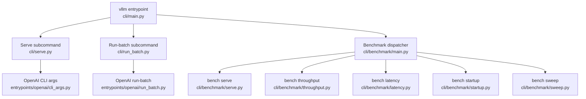
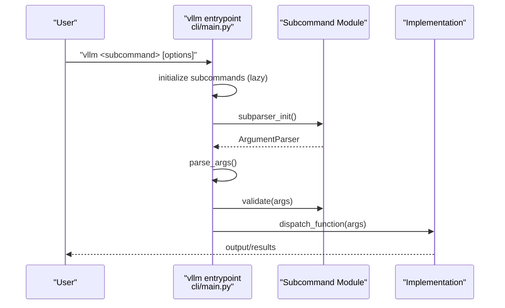
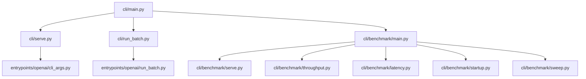

# CLI Reference

<cite>
**Referenced Files in This Document**
- [README.md](file://README.md)
- [scripts.py](file://vllm/scripts.py)
- [cli/main.py](file://vllm/entrypoints/cli/main.py)
- [cli/types.py](file://vllm/entrypoints/cli/types.py)
- [cli/serve.py](file://vllm/entrypoints/cli/serve.py)
- [cli/run_batch.py](file://vllm/entrypoints/cli/run_batch.py)
- [cli/benchmark/main.py](file://vllm/entrypoints/cli/benchmark/main.py)
- [cli/benchmark/serve.py](file://vllm/entrypoints/cli/benchmark/serve.py)
- [cli/benchmark/throughput.py](file://vllm/entrypoints/cli/benchmark/throughput.py)
- [cli/benchmark/latency.py](file://vllm/entrypoints/cli/benchmark/latency.py)
- [cli/benchmark/startup.py](file://vllm/entrypoints/cli/benchmark/startup.py)
- [cli/benchmark/sweep.py](file://vllm/entrypoints/cli/benchmark/sweep.py)
- [openai/cli_args.py](file://vllm/entrypoints/openai/cli_args.py)
- [openai/run_batch.py](file://vllm/entrypoints/openai/run_batch.py)
- [benchmarks/serve.py](file://vllm/benchmarks/serve.py)
- [benchmarks/throughput.py](file://vllm/benchmarks/throughput.py)
- [benchmarks/latency.py](file://vllm/benchmarks/latency.py)
- [benchmarks/startup.py](file://vllm/benchmarks/startup.py)
- [benchmarks/sweep/cli.py](file://vllm/benchmarks/sweep/cli.py)
- [envs.py](file://vllm/envs.py)
- [env_override.py](file://vllm/env_override.py)
- [configuration/README.md](file://docs/configuration/README.md)
- [configuration/serve_args.md](file://docs/configuration/serve_args.md)
- [configuration/env_vars.md](file://docs/configuration/env_vars.md)
- [cli/README.md](file://docs/cli/README.md)
- [cli/serve.md](file://docs/cli/serve.md)
- [cli/chat.md](file://docs/cli/chat.md)
- [cli/complete.md](file://docs/cli/complete.md)
- [cli/run-batch.md](file://docs/cli/run-batch.md)
- [cli/bench/README.md](file://docs/cli/bench/README.md)
- [cli/bench/serve.md](file://docs/cli/bench/serve.md)
- [cli/bench/throughput.md](file://docs/cli/bench/throughput.md)
- [cli/bench/latency.md](file://docs/cli/bench/latency.md)
- [cli/bench/startup.md](file://docs/cli/bench/startup.md)
- [cli/bench/sweep.md](file://docs/cli/bench/sweep.md)
</cite>

## Table of Contents
1. [Introduction](#introduction)
2. [Project Structure](#project-structure)
3. [Core Components](#core-components)
4. [Architecture Overview](#architecture-overview)
5. [Detailed Component Analysis](#detailed-component-analysis)
6. [Dependency Analysis](#dependency-analysis)
7. [Performance Considerations](#performance-considerations)
8. [Troubleshooting Guide](#troubleshooting-guide)
9. [Conclusion](#conclusion)
10. [Appendices](#appendices)

## Introduction
This document provides a comprehensive command-line interface (CLI) reference for vLLM. It covers the primary CLI commands, their syntax, flags, options, and usage patterns. It also documents configuration file formats, environment variable overrides, runtime parameters, completion and automation, and platform-specific considerations.

Key CLI commands:
- vllm serve: Launch an OpenAI-compatible API server for model inference.
- vllm run-batch: Run batch inference jobs using the OpenAI-compatible API.
- vllm bench: Subcommands for benchmarking latency, throughput, startup, and parameter sweeps.

Where to find authoritative documentation:
- The repository’s documentation site includes dedicated CLI pages for serve, run-batch, and benchmarking subcommands.
- The README describes installation and quickstart steps.

**Section sources**
- [README.md](file://README.md#L104-L114)
- [cli/README.md](file://docs/cli/README.md)

## Project Structure
The CLI is organized around a central entrypoint that dynamically registers subcommands. Each subcommand module encapsulates its own argument parsing and execution logic.

**Diagram sources**
- [cli/main.py](file://vllm/entrypoints/cli/main.py#L16-L80)
- [cli/serve.py](file://vllm/entrypoints/cli/serve.py#L42-L75)
- [cli/run_batch.py](file://vllm/entrypoints/cli/run_batch.py#L21-L69)
- [cli/benchmark/main.py](file://vllm/entrypoints/cli/benchmark/main.py#L17-L57)
- [cli/benchmark/serve.py](file://vllm/entrypoints/cli/benchmark/serve.py#L9-L22)
- [cli/benchmark/throughput.py](file://vllm/entrypoints/cli/benchmark/throughput.py#L9-L22)
- [cli/benchmark/latency.py](file://vllm/entrypoints/cli/benchmark/latency.py#L9-L22)
- [cli/benchmark/startup.py](file://vllm/entrypoints/cli/benchmark/startup.py#L9-L22)
- [cli/benchmark/sweep.py](file://vllm/entrypoints/cli/benchmark/sweep.py#L9-L22)
- [openai/cli_args.py](file://vllm/entrypoints/openai/cli_args.py)
- [openai/run_batch.py](file://vllm/entrypoints/openai/run_batch.py)

**Section sources**
- [cli/main.py](file://vllm/entrypoints/cli/main.py#L16-L80)
- [cli/types.py](file://vllm/entrypoints/cli/types.py#L13-L30)

## Core Components
- Central CLI entrypoint initializes subcommands and parses arguments.
- Serve subcommand launches either a single API server or multiple API servers with optional headless engine processes.
- Run-batch subcommand orchestrates batch inference jobs and optionally exposes Prometheus metrics.
- Benchmark dispatcher registers subcommands for latency, throughput, startup, and sweep.

Key behaviors:
- Lazy loading of submodules to avoid eager import issues.
- Bench command defaults to CPU platform when platform is unspecified to prevent device inference errors.
- Version flag prints the installed package version.

**Section sources**
- [cli/main.py](file://vllm/entrypoints/cli/main.py#L16-L80)
- [cli/types.py](file://vllm/entrypoints/cli/types.py#L13-L30)
- [cli/serve.py](file://vllm/entrypoints/cli/serve.py#L42-L75)
- [cli/run_batch.py](file://vllm/entrypoints/cli/run_batch.py#L21-L69)
- [cli/benchmark/main.py](file://vllm/entrypoints/cli/benchmark/main.py#L17-L57)

## Architecture Overview
The CLI architecture follows a modular design: a central parser registers subcommands, each subcommand defines its own argument parser and dispatch function, and the main entrypoint executes the chosen subcommand.

**Diagram sources**
- [cli/main.py](file://vllm/entrypoints/cli/main.py#L16-L80)
- [cli/types.py](file://vllm/entrypoints/cli/types.py#L13-L30)

## Detailed Component Analysis

### vllm serve
Purpose:
- Launch an OpenAI-compatible API server for model inference. Supports single-process, multi-process, and headless deployments.

Command syntax:
- vllm serve [model_tag] [options]

Key flags and options:
- Model specification: positional model_tag or explicit model option.
- API server count: controls number of API server processes.
- Headless mode: runs engines without API servers.
- Logging and metrics: disable stats logs, enable Prometheus metrics.
- Parallelism and distribution: data parallel size, ranks, master address/port, and load balancer modes.
- Network and TLS: host, port, SSL certificate/key, and related settings.
- Engine configuration: quantization, KV cache settings, decoding parameters, and more.

Usage examples:
- Single API server with default model and host/port:
  - vllm serve
- Specify model and listen on a custom port:
  - vllm serve --model <model> --host 0.0.0.0 --port 8080
- Multi-API server deployment:
  - vllm serve --api-server-count 4
- Headless engine deployment:
  - vllm serve --headless
- Disable stats logging:
  - vllm serve --disable-log-stats

Notes:
- Use --help to explore categorized options (e.g., ModelConfig, Frontend).
- Use --help=all to display all flags at once.

**Section sources**
- [cli/serve.py](file://vllm/entrypoints/cli/serve.py#L33-L75)
- [cli/serve.py](file://vllm/entrypoints/cli/serve.py#L81-L160)
- [cli/serve.py](file://vllm/entrypoints/cli/serve.py#L162-L234)
- [cli/serve.py](file://vllm/entrypoints/cli/serve.py#L236-L250)
- [openai/cli_args.py](file://vllm/entrypoints/openai/cli_args.py)

### vllm run-batch
Purpose:
- Execute batch inference jobs using the OpenAI-compatible API. Supports local and HTTP-based input/output.

Command syntax:
- vllm run-batch -i INPUT.jsonl -o OUTPUT.jsonl --model <model> [options]

Key flags and options:
- Input and output sources: -i/--input and -o/--output.
- Metrics exposure: --enable-metrics with --url and --port.
- Model selection and engine arguments inherited from OpenAI CLI args.

Usage examples:
- Local JSONL batch job:
  - vllm run-batch -i prompts.jsonl -o results.jsonl --model <model>
- Enable Prometheus metrics:
  - vllm run-batch -i prompts.jsonl -o results.jsonl --model <model> --enable-metrics --url 0.0.0.0 --port 8000

**Section sources**
- [cli/run_batch.py](file://vllm/entrypoints/cli/run_batch.py#L21-L69)
- [openai/run_batch.py](file://vllm/entrypoints/openai/run_batch.py)

### vllm bench
Purpose:
- Benchmark subcommands for latency, throughput, startup, and parameter sweeps.

Command syntax:
- vllm bench <bench_type> [options]

Available subcommands:
- vllm bench serve
- vllm bench throughput
- vllm bench latency
- vllm bench startup
- vllm bench sweep

Common usage patterns:
- Explore help for each subcommand to see specific flags.
- Use --help to list categories and --help=all for all flags.

**Section sources**
- [cli/benchmark/main.py](file://vllm/entrypoints/cli/benchmark/main.py#L17-L57)
- [cli/benchmark/serve.py](file://vllm/entrypoints/cli/benchmark/serve.py#L9-L22)
- [cli/benchmark/throughput.py](file://vllm/entrypoints/cli/benchmark/throughput.py#L9-L22)
- [cli/benchmark/latency.py](file://vllm/entrypoints/cli/benchmark/latency.py#L9-L22)
- [cli/benchmark/startup.py](file://vllm/entrypoints/cli/benchmark/startup.py#L9-L22)
- [cli/benchmark/sweep.py](file://vllm/entrypoints/cli/benchmark/sweep.py#L9-L22)

#### vllm bench serve
Purpose:
- Benchmark online serving throughput.

Flags and options:
- See the benchmark serve documentation page for the complete list of flags.

**Section sources**
- [cli/benchmark/serve.py](file://vllm/entrypoints/cli/benchmark/serve.py#L9-L22)
- [benchmarks/serve.py](file://vllm/benchmarks/serve.py)

#### vllm bench throughput
Purpose:
- Benchmark offline inference throughput.

Flags and options:
- See the benchmark throughput documentation page for the complete list of flags.

**Section sources**
- [cli/benchmark/throughput.py](file://vllm/entrypoints/cli/benchmark/throughput.py#L9-L22)
- [benchmarks/throughput.py](file://vllm/benchmarks/throughput.py)

#### vllm bench latency
Purpose:
- Benchmark latency for a single batch of requests.

Flags and options:
- See the benchmark latency documentation page for the complete list of flags.

**Section sources**
- [cli/benchmark/latency.py](file://vllm/entrypoints/cli/benchmark/latency.py#L9-L22)
- [benchmarks/latency.py](file://vllm/benchmarks/latency.py)

#### vllm bench startup
Purpose:
- Benchmark model startup time.

Flags and options:
- See the benchmark startup documentation page for the complete list of flags.

**Section sources**
- [cli/benchmark/startup.py](file://vllm/entrypoints/cli/benchmark/startup.py#L9-L22)
- [benchmarks/startup.py](file://vllm/benchmarks/startup.py)

#### vllm bench sweep
Purpose:
- Parameter sweep benchmarking.

Flags and options:
- See the benchmark sweep documentation page for the complete list of flags.

**Section sources**
- [cli/benchmark/sweep.py](file://vllm/entrypoints/cli/benchmark/sweep.py#L9-L22)
- [benchmarks/sweep/cli.py](file://vllm/benchmarks/sweep/cli.py)

## Dependency Analysis
The CLI entrypoint depends on subcommand modules and delegates argument parsing and execution. Serve and run-batch subcommands rely on OpenAI-compatible CLI argument parsers and run-batch implementations. Benchmark subcommands depend on the benchmark modules.

**Diagram sources**
- [cli/main.py](file://vllm/entrypoints/cli/main.py#L16-L80)
- [cli/serve.py](file://vllm/entrypoints/cli/serve.py#L42-L75)
- [cli/run_batch.py](file://vllm/entrypoints/cli/run_batch.py#L21-L69)
- [cli/benchmark/main.py](file://vllm/entrypoints/cli/benchmark/main.py#L17-L57)
- [openai/cli_args.py](file://vllm/entrypoints/openai/cli_args.py)
- [openai/run_batch.py](file://vllm/entrypoints/openai/run_batch.py)

**Section sources**
- [cli/main.py](file://vllm/entrypoints/cli/main.py#L16-L80)
- [cli/serve.py](file://vllm/entrypoints/cli/serve.py#L42-L75)
- [cli/run_batch.py](file://vllm/entrypoints/cli/run_batch.py#L21-L69)
- [cli/benchmark/main.py](file://vllm/entrypoints/cli/benchmark/main.py#L17-L57)

## Performance Considerations
- Use multi-API server deployments for horizontal scaling of the API layer.
- Prefer headless mode for high-throughput engine-only deployments in distributed environments.
- Disable stats logs in production to reduce overhead when not needed.
- Expose Prometheus metrics for observability in run-batch and multi-API server setups.
- Use the appropriate benchmark subcommand to measure latency, throughput, and startup characteristics before production rollout.

[No sources needed since this section provides general guidance]

## Troubleshooting Guide
Common issues and resolutions:
- Device type inference errors during benchmarking: The CLI automatically switches to CPU platform when platform is unspecified to avoid inference errors.
- Graceful shutdown in headless mode: SIGTERM/SIGINT signals trigger a clean shutdown of engines.
- Multi-API server with runtime LoRA updating: Not supported; attempting to combine these raises an error.
- Metrics exposure: Ensure URL and port are reachable and Prometheus client is installed when enabling metrics.

**Section sources**
- [cli/main.py](file://vllm/entrypoints/cli/main.py#L33-L50)
- [cli/serve.py](file://vllm/entrypoints/cli/serve.py#L101-L113)
- [cli/serve.py](file://vllm/entrypoints/cli/serve.py#L179-L183)
- [cli/run_batch.py](file://vllm/entrypoints/cli/run_batch.py#L35-L45)

## Conclusion
The vLLM CLI provides a unified interface for serving, batch processing, and benchmarking. By leveraging subcommands and their documented flags, users can deploy scalable inference systems, automate batch workloads, and optimize performance through targeted benchmarking.

[No sources needed since this section summarizes without analyzing specific files]

## Appendices

### Command Syntax and Options Summary
- vllm serve
  - Syntax: vllm serve [model_tag] [options]
  - Options include model selection, API server count, headless mode, parallelism, network, TLS, and engine configuration.
  - See serve documentation for detailed flags and categories.

- vllm run-batch
  - Syntax: vllm run-batch -i INPUT.jsonl -o OUTPUT.jsonl --model <model> [options]
  - Options include input/output sources, metrics exposure, and engine arguments.

- vllm bench
  - Syntax: vllm bench <bench_type> [options]
  - Subcommands: serve, throughput, latency, startup, sweep.
  - Each subcommand has its own set of flags documented in the benchmark pages.

**Section sources**
- [cli/serve.py](file://vllm/entrypoints/cli/serve.py#L33-L75)
- [cli/run_batch.py](file://vllm/entrypoints/cli/run_batch.py#L21-L69)
- [cli/benchmark/main.py](file://vllm/entrypoints/cli/benchmark/main.py#L17-L57)

### Configuration Files and Environment Variables
- Configuration files: The documentation provides guidance on configuration and environment variables for serving and general usage.
- Environment variables: The environment module and override utilities define runtime parameters that influence CLI behavior.

**Section sources**
- [configuration/README.md](file://docs/configuration/README.md)
- [configuration/serve_args.md](file://docs/configuration/serve_args.md)
- [configuration/env_vars.md](file://docs/configuration/env_vars.md)
- [envs.py](file://vllm/envs.py)
- [env_override.py](file://vllm/env_override.py)

### Installation and Quickstart
- Install vLLM via pip or build from source as described in the README.
- Use the documentation site for quickstart and model lists.

**Section sources**
- [README.md](file://README.md#L104-L114)

### Command Completion and Automation
- Command completion and scripting integration are covered in the CLI documentation pages.

**Section sources**
- [cli/complete.md](file://docs/cli/complete.md)

### Platform-Specific Considerations
- The README highlights broad hardware support and platform diversity.
- The benchmark entrypoint adjusts platform behavior to avoid inference errors.

**Section sources**
- [README.md](file://README.md#L82-L92)
- [cli/main.py](file://vllm/entrypoints/cli/main.py#L33-L50)