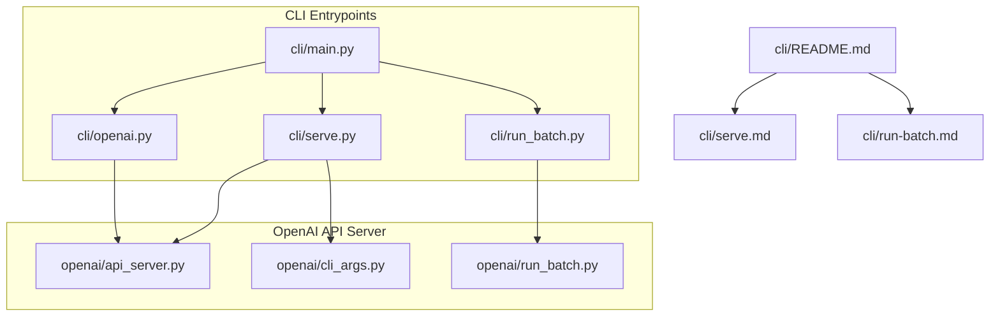
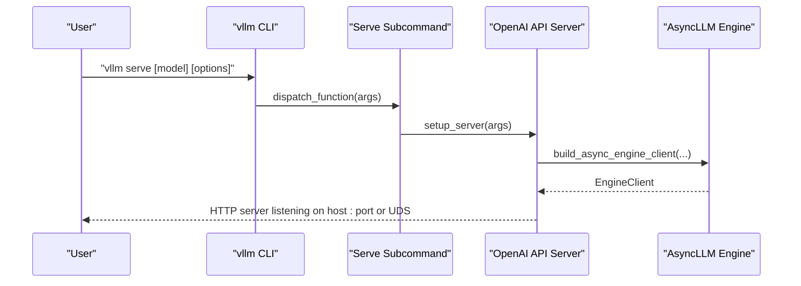
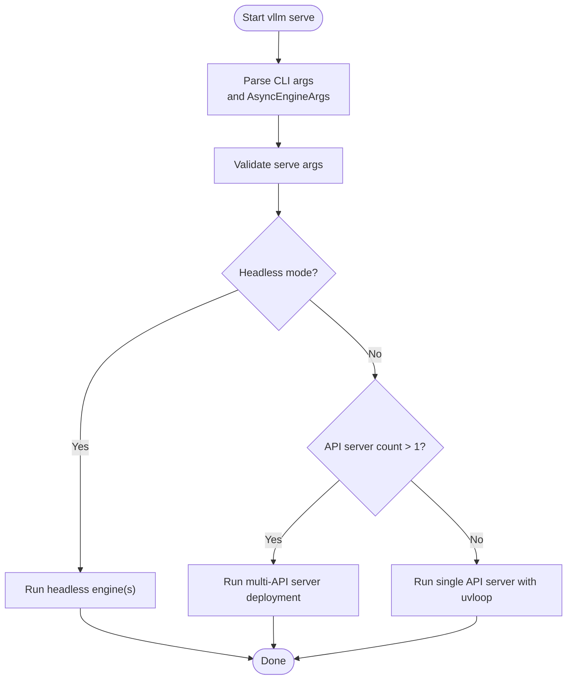
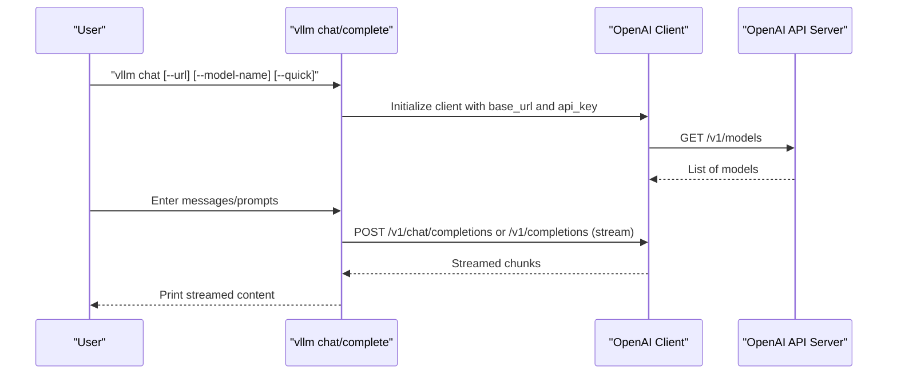
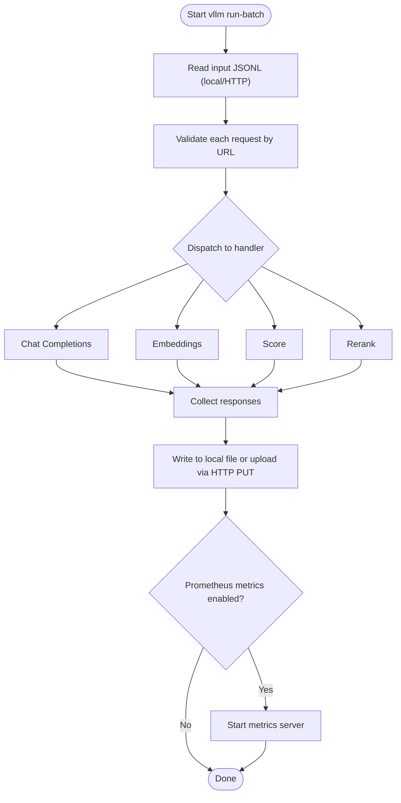
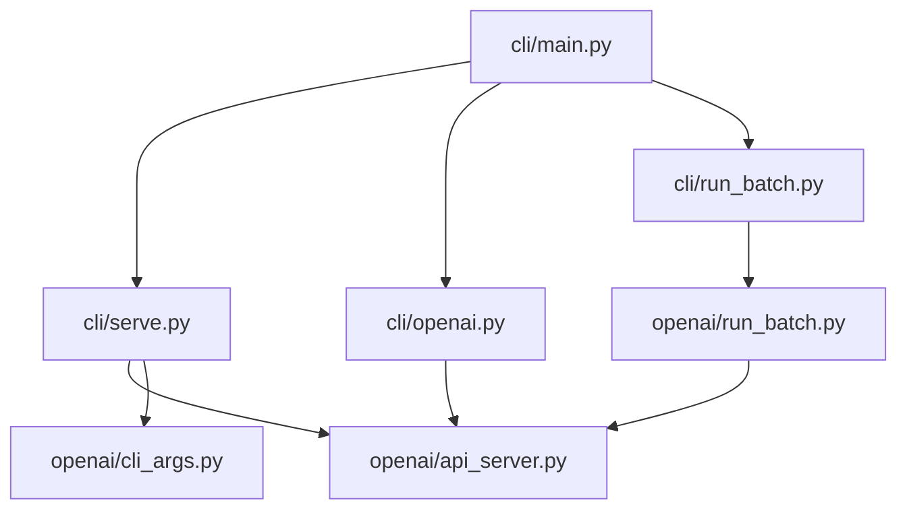

# Main CLI Commands

<cite>
**Referenced Files in This Document**
- [cli/main.py](file://vllm/entrypoints/cli/main.py)
- [cli/serve.py](file://vllm/entrypoints/cli/serve.py)
- [cli/openai.py](file://vllm/entrypoints/cli/openai.py)
- [cli/run_batch.py](file://vllm/entrypoints/cli/run_batch.py)
- [openai/cli_args.py](file://vllm/entrypoints/openai/cli_args.py)
- [openai/api_server.py](file://vllm/entrypoints/openai/api_server.py)
- [openai/run_batch.py](file://vllm/entrypoints/openai/run_batch.py)
- [cli/README.md](file://docs/cli/README.md)
- [cli/serve.md](file://docs/cli/serve.md)
- [cli/run-batch.md](file://docs/cli/run-batch.md)
</cite>

## Table of Contents
1. [Introduction](#introduction)
2. [Project Structure](#project-structure)
3. [Core Components](#core-components)
4. [Architecture Overview](#architecture-overview)
5. [Detailed Component Analysis](#detailed-component-analysis)
6. [Dependency Analysis](#dependency-analysis)
7. [Performance Considerations](#performance-considerations)
8. [Troubleshooting Guide](#troubleshooting-guide)
9. [Conclusion](#conclusion)
10. [Appendices](#appendices)

## Introduction
This document provides comprehensive documentation for vLLM’s main CLI commands focused on serving and interacting with the OpenAI-compatible API. It covers:
- vllm serve: Deploying the OpenAI-compatible API server with configuration, ports, sockets, and deployment parameters.
- vllm chat and vllm complete: Using the CLI to interact with a running server for chat and text completion.
- vllm run-batch: Running batch jobs against the OpenAI-compatible API with input/output handling and metrics.

The guide includes command syntax, required and optional parameters, environment variable overrides, practical usage examples, and troubleshooting guidance for common configuration issues and platform-specific considerations.

## Project Structure
The CLI entrypoints are organized under vllm/entrypoints/cli and integrate with the OpenAI-compatible API server implementation under vllm/entrypoints/openai. Documentation stubs for CLI arguments are maintained in docs/cli.

**Diagram sources**
- [cli/main.py](file://vllm/entrypoints/cli/main.py#L1-L80)
- [cli/serve.py](file://vllm/entrypoints/cli/serve.py#L1-L250)
- [cli/openai.py](file://vllm/entrypoints/cli/openai.py#L1-L261)
- [cli/run_batch.py](file://vllm/entrypoints/cli/run_batch.py#L1-L69)
- [openai/api_server.py](file://vllm/entrypoints/openai/api_server.py#L1-L800)
- [openai/cli_args.py](file://vllm/entrypoints/openai/cli_args.py#L1-L303)
- [openai/run_batch.py](file://vllm/entrypoints/openai/run_batch.py#L1-L632)
- [cli/README.md](file://docs/cli/README.md#L1-L189)
- [cli/serve.md](file://docs/cli/serve.md#L1-L10)
- [cli/run-batch.md](file://docs/cli/run-batch.md#L1-L10)

**Section sources**
- [cli/main.py](file://vllm/entrypoints/cli/main.py#L1-L80)
- [cli/README.md](file://docs/cli/README.md#L1-L189)

## Core Components
- vllm serve: Starts the OpenAI-compatible API server with configurable host/port, Unix domain sockets, CORS, API keys, SSL/TLS, middleware, and advanced features like LoRA modules, tool parsing, and tokenization endpoints. Supports headless mode and multi-API server deployments.
- vllm chat and vllm complete: Interactive clients that connect to a running server to generate chat completions or text completions, supporting streaming responses and optional quick-send modes.
- vllm run-batch: Offline batch runner that reads a JSONL input file (or URL), submits requests to the API, and writes results to a local file or uploads via HTTP PUT.

Key argument sources:
- Serve arguments are defined via AsyncEngineArgs and FrontendArgs, with additional serve-specific flags.
- Chat/Complete arguments include server URL, model name, API key, and quick-send options.
- Run-batch arguments include input/output paths, metrics server configuration, and engine-related flags.

**Section sources**
- [cli/serve.py](file://vllm/entrypoints/cli/serve.py#L1-L250)
- [openai/cli_args.py](file://vllm/entrypoints/openai/cli_args.py#L1-L303)
- [cli/openai.py](file://vllm/entrypoints/cli/openai.py#L1-L261)
- [cli/run_batch.py](file://vllm/entrypoints/cli/run_batch.py#L1-L69)
- [openai/run_batch.py](file://vllm/entrypoints/openai/run_batch.py#L1-L632)

## Architecture Overview
The CLI orchestrates subcommands that delegate to the OpenAI-compatible API server and supporting modules. The server exposes OpenAI-compatible endpoints and integrates with the vLLM engine.

**Diagram sources**
- [cli/main.py](file://vllm/entrypoints/cli/main.py#L51-L80)
- [cli/serve.py](file://vllm/entrypoints/cli/serve.py#L42-L110)
- [openai/api_server.py](file://vllm/entrypoints/openai/api_server.py#L144-L231)

## Detailed Component Analysis

### vllm serve
Purpose:
- Launch an OpenAI-compatible API server locally or in headless mode.
- Configure host, port, Unix domain socket, CORS, API keys, SSL/TLS, middleware, and advanced features.
- Support multi-API server deployments and headless engine-only processes for distributed setups.

Key parameters:
- Model selection and configuration:
  - Positional model tag and model-related engine arguments from AsyncEngineArgs.
- Frontend options (selected highlights):
  - Host and port, Unix domain socket, CORS controls, allowed origins/methods/headers, API key enforcement, SSL/TLS files and refresh, root path, middleware injection, request ID headers, tool parsing options, tokenizer info endpoint, logging controls, and HTTP/1.1 limits.
- Serve-specific flags:
  - Headless mode, API server count, and config file loading.

Behavior:
- Single API server mode initializes the server with uvloop.
- Multi-API server mode launches multiple API server workers and coordinates with core engines.
- Headless mode starts engine processes without the API server, suitable for distributed deployments.

Practical examples:
- Basic serve with a model and custom port.
- Serve over a Unix domain socket.
- Enable CORS and API key enforcement.
- Enable SSL/TLS with certificate refresh.
- Enable middleware and tool parsing.

Environment variable overrides:
- Logging configuration path, server development mode, and platform selection for bench command are referenced in argument processing.

Common pitfalls and validations:
- Headless mode requires a positive local engine count.
- Hybrid load balancing modes are incompatible with headless mode.
- Runtime LoRA updating cannot be combined with multiple API servers.
- Tool parsing requires a valid tool call parser when auto tool choice is enabled.
- Log outputs require enabling request logging.

**Diagram sources**
- [cli/serve.py](file://vllm/entrypoints/cli/serve.py#L42-L110)
- [cli/serve.py](file://vllm/entrypoints/cli/serve.py#L162-L234)
- [openai/cli_args.py](file://vllm/entrypoints/openai/cli_args.py#L283-L303)

**Section sources**
- [cli/serve.py](file://vllm/entrypoints/cli/serve.py#L1-L250)
- [openai/cli_args.py](file://vllm/entrypoints/openai/cli_args.py#L1-L303)
- [cli/README.md](file://docs/cli/README.md#L15-L55)
- [cli/serve.md](file://docs/cli/serve.md#L1-L10)

### vllm chat and vllm complete
Purpose:
- Interact with a running OpenAI-compatible API server via CLI.
- chat: Stream chat completions with optional system prompt and quick-send mode.
- complete: Stream text completions with optional quick-send mode.

Key parameters:
- URL of the running server (default points to localhost:8000/v1).
- Model name (defaults to the first model returned by the server).
- API key override for OpenAI-compatible endpoints.
- Quick-send mode (-q/--quick) to send a single prompt and exit.

Behavior:
- Establishes an OpenAI client pointing to the configured base URL.
- Lists available models if model name is not provided.
- Streams responses and prints deltas to stdout.
- Handles signals for graceful termination.

Practical examples:
- Connect to a local server without arguments.
- Specify a custom server URL.
- Quick chat with a single message.
- Quick completion with a single prompt.

**Diagram sources**
- [cli/openai.py](file://vllm/entrypoints/cli/openai.py#L1-L261)
- [openai/api_server.py](file://vllm/entrypoints/openai/api_server.py#L300-L561)

**Section sources**
- [cli/openai.py](file://vllm/entrypoints/cli/openai.py#L1-L261)
- [cli/README.md](file://docs/cli/README.md#L58-L91)

### vllm run-batch
Purpose:
- Execute batch requests against the OpenAI-compatible API using a JSONL input file.
- Supports local files and HTTP(S) URLs for input and output.
- Writes results to a local file or uploads via HTTP PUT.

Key parameters:
- Input file path or URL.
- Output file path or URL.
- Temporary directory for intermediate output when uploading.
- Response role for chat completions.
- Engine arguments inherited from AsyncEngineArgs.
- Metrics server configuration (address and port) when enabled.

Behavior:
- Reads input JSONL asynchronously (supports HTTP GET).
- Validates each line against the appropriate request model based on URL.
- Dispatches requests to the correct handler (chat completions, embeddings, scoring, reranking).
- Streams responses and aggregates results.
- Writes outputs to a local file or uploads via HTTP PUT with retries and timeouts.
- Optionally starts a Prometheus metrics server for engine metrics.

Practical examples:
- Run batch with a local input file and local output file.
- Use a remote input file and upload results to a remote URL.
- Enable Prometheus metrics for monitoring.

**Diagram sources**
- [cli/run_batch.py](file://vllm/entrypoints/cli/run_batch.py#L1-L69)
- [openai/run_batch.py](file://vllm/entrypoints/openai/run_batch.py#L1-L632)

**Section sources**
- [cli/run_batch.py](file://vllm/entrypoints/cli/run_batch.py#L1-L69)
- [openai/run_batch.py](file://vllm/entrypoints/openai/run_batch.py#L1-L632)
- [cli/README.md](file://docs/cli/README.md#L158-L181)
- [cli/run-batch.md](file://docs/cli/run-batch.md#L1-L10)

## Dependency Analysis
The CLI main entrypoint dynamically loads subcommands and delegates to the OpenAI API server implementation. The server integrates with the vLLM engine and exposes OpenAI-compatible endpoints. Batch processing reuses the server’s engine client and handlers.

**Diagram sources**
- [cli/main.py](file://vllm/entrypoints/cli/main.py#L16-L80)
- [cli/serve.py](file://vllm/entrypoints/cli/serve.py#L1-L80)
- [cli/openai.py](file://vllm/entrypoints/cli/openai.py#L1-L60)
- [cli/run_batch.py](file://vllm/entrypoints/cli/run_batch.py#L1-L40)
- [openai/api_server.py](file://vllm/entrypoints/openai/api_server.py#L1-L120)
- [openai/run_batch.py](file://vllm/entrypoints/openai/run_batch.py#L600-L632)

**Section sources**
- [cli/main.py](file://vllm/entrypoints/cli/main.py#L16-L80)
- [openai/api_server.py](file://vllm/entrypoints/openai/api_server.py#L1-L120)
- [openai/run_batch.py](file://vllm/entrypoints/openai/run_batch.py#L600-L632)

## Performance Considerations
- Use multiple API servers for horizontal scaling when throughput demands exceed a single process.
- Prefer Unix domain sockets for local deployments to reduce TCP overhead.
- Enable Prometheus metrics for monitoring engine and server performance during batch runs.
- Tune engine arguments (e.g., max model length, parallelism) to balance latency and throughput.
- For batch processing, consider using HTTP URLs for input/output to offload storage concerns.

[No sources needed since this section provides general guidance]

## Troubleshooting Guide
Common configuration issues and resolutions:
- Headless mode requires a positive local engine count; otherwise, it raises an error.
- Hybrid data-parallel load balancing is not applicable in headless mode.
- Enabling runtime LoRA updating is incompatible with multiple API servers.
- Enabling auto tool choice requires specifying a valid tool call parser.
- Enabling log outputs requires enabling request logging.
- Multi-API server deployments may require careful coordination of network settings and load balancers.

Platform-specific considerations:
- Bench command forces CPU platform when platform is unspecified to avoid device inference errors.
- Forkserver preload is used for multiprocessing in certain environments to improve startup performance.

Operational tips:
- Verify server endpoints (/v1/models, /v1/chat/completions, /v1/completions) are reachable.
- Confirm API key and CORS settings align with client configuration.
- For SSL/TLS, ensure certificate files and refresh settings are correct.
- When using Unix domain sockets, ensure proper permissions and paths.

**Section sources**
- [cli/serve.py](file://vllm/entrypoints/cli/serve.py#L81-L161)
- [openai/cli_args.py](file://vllm/entrypoints/openai/cli_args.py#L283-L303)
- [openai/api_server.py](file://vllm/entrypoints/openai/api_server.py#L144-L231)
- [cli/main.py](file://vllm/entrypoints/cli/main.py#L33-L50)

## Conclusion
vLLM’s CLI provides a cohesive set of commands for deploying, interacting with, and batch-processing workloads against an OpenAI-compatible API server. By leveraging serve for production deployments, chat/complete for interactive use, and run-batch for offline processing, teams can efficiently operate vLLM across diverse scenarios. Proper configuration of networking, security, and metrics ensures reliable and observable deployments.

[No sources needed since this section summarizes without analyzing specific files]

## Appendices

### Command Syntax and Options Reference
- vllm serve
  - Syntax: vllm serve [model_tag] [options]
  - Options include model selection, host/port/UDS, CORS, API key enforcement, SSL/TLS, middleware, tool parsing, tokenizer info, and engine arguments.
  - See full argument reference in docs/cli/serve.md and the serve subcommand implementation.

- vllm chat
  - Syntax: vllm chat [options]
  - Options include URL, model name, API key, and quick-send mode.

- vllm complete
  - Syntax: vllm complete [options]
  - Options include URL, model name, API key, max tokens, and quick-send mode.

- vllm run-batch
  - Syntax: vllm run-batch -i INPUT.jsonl -o OUTPUT.jsonl [options]
  - Options include input/output paths, temporary directory, response role, engine arguments, and metrics server configuration.

**Section sources**
- [cli/README.md](file://docs/cli/README.md#L1-L189)
- [cli/serve.md](file://docs/cli/serve.md#L1-L10)
- [cli/run-batch.md](file://docs/cli/run-batch.md#L1-L10)