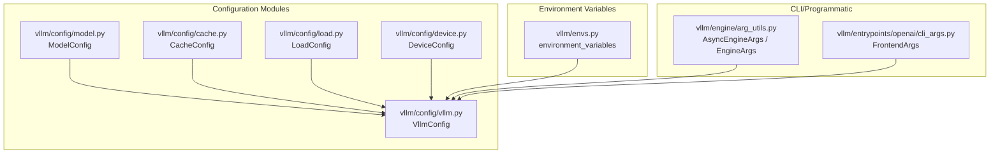
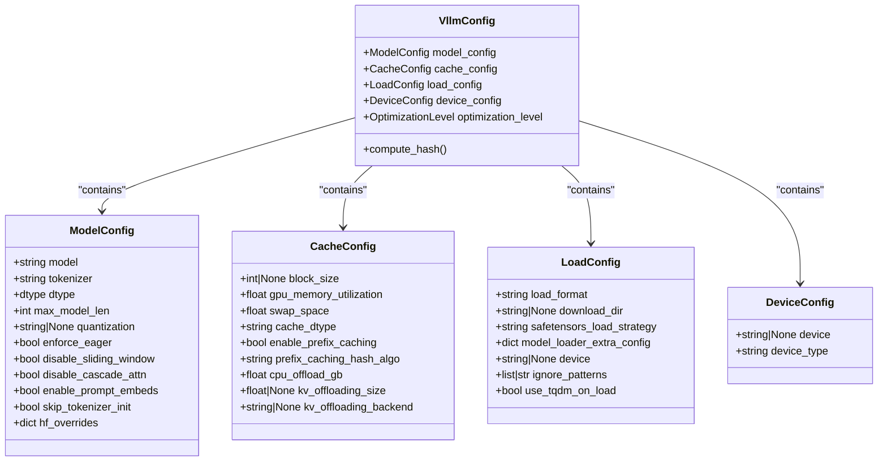
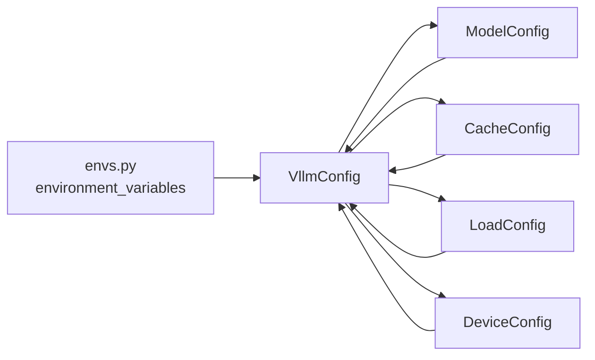

# Configuration Options

<cite>
**Referenced Files in This Document**
- [envs.py](file://vllm/envs.py)
- [arg_utils.py](file://vllm/engine/arg_utils.py)
- [cli_args.py](file://vllm/entrypoints/openai/cli_args.py)
- [__init__.py](file://vllm/config/__init__.py)
- [model.py](file://vllm/config/model.py)
- [device.py](file://vllm/config/device.py)
- [vllm.py](file://vllm/config/vllm.py)
- [cache.py](file://vllm/config/cache.py)
- [load.py](file://vllm/config/load.py)
- [engine_args.md](file://docs/configuration/engine_args.md)
- [env_vars.md](file://docs/configuration/env_vars.md)
- [serve_args.md](file://docs/configuration/serve_args.md)
- [optimization.md](file://docs/configuration/optimization.md)
- [conserving_memory.md](file://docs/configuration/conserving_memory.md)
- [model_resolution.md](file://docs/configuration/model_resolution.md)
</cite>

## Table of Contents
1. [Introduction](#introduction)
2. [Project Structure](#project-structure)
3. [Core Components](#core-components)
4. [Architecture Overview](#architecture-overview)
5. [Detailed Component Analysis](#detailed-component-analysis)
6. [Dependency Analysis](#dependency-analysis)
7. [Performance Considerations](#performance-considerations)
8. [Troubleshooting Guide](#troubleshooting-guide)
9. [Conclusion](#conclusion)
10. [Appendices](#appendices)

## Introduction
This document provides comprehensive configuration documentation for vLLM’s configuration system. It covers configuration classes (ModelConfig, VllmConfig, CacheConfig, LoadConfig, DeviceConfig, and others), environment variables, CLI/programmatic configuration options, and model-specific settings. It also includes parameter descriptions, default values, acceptable ranges, interdependencies, and practical examples for single-node, distributed, and production deployments. Guidance on performance tuning, memory optimization, hardware-specific configurations, validation, error handling, and troubleshooting is provided.

## Project Structure
vLLM organizes configuration into modular dataclasses under vllm/config, with environment variables managed centrally and CLI/programmatic entry points in vllm/engine and vllm/entrypoints. The configuration classes are composed into a top-level VllmConfig that orchestrates model, cache, parallel, scheduler, and compilation settings.

**Diagram sources**
- [model.py](file://vllm/config/model.py#L96-L220)
- [cache.py](file://vllm/config/cache.py#L37-L120)
- [load.py](file://vllm/config/load.py#L23-L90)
- [device.py](file://vllm/config/device.py#L17-L76)
- [vllm.py](file://vllm/config/vllm.py#L174-L240)
- [envs.py](file://vllm/envs.py#L448-L800)
- [arg_utils.py](file://vllm/engine/arg_utils.py#L1-L200)
- [cli_args.py](file://vllm/entrypoints/openai/cli_args.py#L71-L120)

**Section sources**
- [__init__.py](file://vllm/config/__init__.py#L1-L109)
- [envs.py](file://vllm/envs.py#L448-L800)
- [arg_utils.py](file://vllm/engine/arg_utils.py#L1-L200)
- [cli_args.py](file://vllm/entrypoints/openai/cli_args.py#L71-L120)

## Core Components
- ModelConfig: Defines model selection, tokenizer, dtype, max context length, quantization, and multimodal settings.
- CacheConfig: Controls KV cache sizing, dtype, prefix caching, CPU offload, and optional KV offloading backends.
- LoadConfig: Specifies weight loading format, download directory, safetensors loading strategy, and device mapping.
- DeviceConfig: Determines device type and platform-aware device assignment.
- VllmConfig: Aggregates all configuration pieces and applies optimization levels, validation, and platform-specific adjustments.
- Environment variables: Centralized via environment_variables and validated helpers for choices/lists/booleans/integers.

Key defaults and ranges:
- ModelConfig.dtype: "auto" | "half" | "float16" | "bfloat16" | "float" | "float32".
- ModelConfig.max_model_len: positive integer; supports human-readable suffixes.
- CacheConfig.gpu_memory_utilization: 0.0–1.0; default 0.9.
- CacheConfig.swap_space: ≥0 GiB; default 4 GiB.
- CacheConfig.cache_dtype: "auto" | "bfloat16" | "fp8" variants; platform-dependent.
- LoadConfig.load_format: "auto" | "pt" | "safetensors" | "npcache" | "dummy" | "tensorizer" | "runai_streamer" | "runai_streamer_sharded" | "bitsandbytes" | "sharded_state" | "gguf" | "mistral" (plus plugin-defined).
- DeviceConfig.device_type: auto-derived from platform; explicit torch.device supported.

Interdependencies:
- VllmConfig verifies consistency among ModelConfig, CacheConfig, ParallelConfig, and platform capabilities.
- ModelConfig enforces dtype/quantization compatibility and multimodal constraints.
- CacheConfig validates CPU swap space against total CPU memory.

**Section sources**
- [model.py](file://vllm/config/model.py#L96-L220)
- [cache.py](file://vllm/config/cache.py#L37-L120)
- [load.py](file://vllm/config/load.py#L23-L90)
- [device.py](file://vllm/config/device.py#L17-L76)
- [vllm.py](file://vllm/config/vllm.py#L174-L240)

## Architecture Overview
The configuration system composes multiple specialized configs into VllmConfig, which centralizes validation, optimization level defaults, and platform-specific adjustments. Environment variables feed defaults and toggles across components.

**Diagram sources**
- [model.py](file://vllm/config/model.py#L96-L220)
- [cache.py](file://vllm/config/cache.py#L37-L120)
- [load.py](file://vllm/config/load.py#L23-L90)
- [device.py](file://vllm/config/device.py#L17-L76)
- [vllm.py](file://vllm/config/vllm.py#L174-L240)

## Detailed Component Analysis

### ModelConfig
- Purpose: Encapsulates model identity, tokenizer, dtype, context length, quantization, and multimodal behavior.
- Key parameters:
  - model, tokenizer, tokenizer_mode, trust_remote_code, dtype, seed
  - max_model_len (supports k/m/g/K/M/G suffixes)
  - quantization (string or method)
  - enforce_eager (disables CUDA graphs)
  - disable_sliding_window, disable_cascade_attn
  - skip_tokenizer_init, enable_prompt_embeds
  - served_model_name, generation_config, override_generation_config
  - model_impl ("auto" | "vllm" | "transformers" | "terratorch")
  - logits_processors, io_processor_plugin
  - multimodal_config and related init vars (limit_mm_per_prompt, enable_mm_embeds, mm_processor_* settings, interleave_mm_strings, video_pruning_rate)
- Validation:
  - Validates tokenizer as string and max_model_len as positive int.
  - Enforces runner/convert compatibility with model architecture.
  - Warns for unsupported features on current platform (e.g., override_attention_dtype on non-ROCm).
  - Raises errors for incompatible multimodal GGUF configurations.

**Section sources**
- [model.py](file://vllm/config/model.py#L96-L220)
- [model.py](file://vllm/config/model.py#L600-L635)
- [model.py](file://vllm/config/model.py#L588-L599)

### CacheConfig
- Purpose: Controls KV cache allocation, dtype, prefix caching, CPU offload, and optional KV offloading backends.
- Key parameters:
  - block_size (platform-dependent; auto-resolved by platform)
  - gpu_memory_utilization (0–1)
  - swap_space (GiB)
  - cache_dtype ("auto" | "bfloat16" | "fp8" variants)
  - enable_prefix_caching, prefix_caching_hash_algo
  - cpu_offload_gb
  - kv_offloading_size (GiB), kv_offloading_backend ("native" | "lmcache")
  - mamba_* settings for hybrid models
- Validation:
  - Warns when CPU swap space exceeds 40% of total CPU memory; errors if >70%.

**Section sources**
- [cache.py](file://vllm/config/cache.py#L37-L120)
- [cache.py](file://vllm/config/cache.py#L213-L233)

### LoadConfig
- Purpose: Controls model weight loading format, download directory, safetensors loading strategy, and device mapping.
- Key parameters:
  - load_format ("auto" | "pt" | "safetensors" | "npcache" | "dummy" | "tensorizer" | "runai_streamer" | "runai_streamer_sharded" | "bitsandbytes" | "sharded_state" | "gguf" | "mistral")
  - download_dir
  - safetensors_load_strategy ("lazy" | "eager" | "torchao")
  - model_loader_extra_config
  - device
  - ignore_patterns
  - use_tqdm_on_load
  - pt_load_map_location

**Section sources**
- [load.py](file://vllm/config/load.py#L23-L90)

### DeviceConfig
- Purpose: Determines device type and platform-aware device assignment.
- Key parameters:
  - device ("auto" | "cuda" | "cpu" | "tpu" | "xpu") or explicit torch.device
  - device_type resolved automatically from platform
- Validation:
  - Raises runtime error if device type cannot be inferred; sets device appropriately.

**Section sources**
- [device.py](file://vllm/config/device.py#L17-L76)

### VllmConfig
- Purpose: Aggregates all configuration pieces and applies optimization levels, validation, and platform-specific adjustments.
- Key parameters:
  - model_config, cache_config, parallel_config, scheduler_config, device_config, load_config, attention_config, lora_config, speculative_config, structured_outputs_config, observability_config, compilation_config, profiler_config, kv_transfer_config, kv_events_config, ec_transfer_config, additional_config, instance_id, optimization_level
- Behavior:
  - Computes a stable hash for configuration fingerprinting.
  - Applies optimization level defaults recursively.
  - Verifies async scheduling compatibility with pipeline parallel and speculative decoding.
  - Adjusts CUDA graph modes and custom ops based on platform and model characteristics.
  - Updates KV transfer config based on cache offloading settings.

**Section sources**
- [vllm.py](file://vllm/config/vllm.py#L174-L240)
- [vllm.py](file://vllm/config/vllm.py#L471-L513)
- [vllm.py](file://vllm/config/vllm.py#L513-L800)

### Environment Variables
- Centralized in environment_variables with validators for choices/lists/booleans/integers.
- Categories include:
  - Installation-time: VLLM_TARGET_DEVICE, VLLM_MAIN_CUDA_VERSION, VLLM_FLOAT32_MATMUL_PRECISION, MAX_JOBS, NVCC_THREADS, VLLM_USE_PRECOMPILED, VLLM_SKIP_PRECOMPILED_VERSION_SUFFIX, VLLM_DOCKER_BUILD_CONTEXT, CMAKE_BUILD_TYPE, VERBOSE, VLLM_CONFIG_ROOT.
  - Runtime: VLLM_CACHE_ROOT, VLLM_HOST_IP, VLLM_PORT, VLLM_RPC_BASE_PATH, VLLM_USE_MODELSCOPE, VLLM_RINGBUFFER_WARNING_INTERVAL, VLLM_NCCL_SO_PATH, LD_LIBRARY_PATH, VLLM_ROCM_SLEEP_MEM_CHUNK_SIZE, VLLM_V1_USE_PREFILL_DECODE_ATTENTION, VLLM_FLASH_ATTN_VERSION, VLLM_USE_STANDALONE_COMPILE, VLLM_PATTERN_MATCH_DEBUG, VLLM_DEBUG_DUMP_PATH, VLLM_USE_AOT_COMPILE, VLLM_USE_BYTECODE_HOOK, VLLM_FORCE_AOT_LOAD, LOCAL_RANK, CUDA_VISIBLE_DEVICES, VLLM_ENGINE_ITERATION_TIMEOUT_S, VLLM_API_KEY, VLLM_DEBUG_LOG_API_SERVER_RESPONSE, S3_ACCESS_KEY_ID, S3_SECRET_ACCESS_KEY, S3_ENDPOINT_URL, VLLM_USAGE_STATS_SERVER, VLLM_NO_USAGE_STATS, VLLM_DISABLE_FLASHINFER_PREFILL, VLLM_DO_NOT_TRACK, VLLM_USAGE_SOURCE, VLLM_CONFIGURE_LOGGING, VLLM_LOGGING_CONFIG_PATH, VLLM_LOGGING_LEVEL, VLLM_LOGGING_STREAM, VLLM_LOGGING_PREFIX, VLLM_LOGGING_COLOR, NO_COLOR, VLLM_LOG_STATS_INTERVAL, VLLM_TRACE_FUNCTION, VLLM_ATTENTION_BACKEND, VLLM_USE_FLASHINFER_SAMPLER, VLLM_PP_LAYER_PARTITION, VLLM_CPU_KVCACHE_SPACE, VLLM_CPU_OMP_THREADS_BIND, VLLM_CPU_NUM_OF_RESERVED_CPU, VLLM_CPU_SGL_KERNEL, VLLM_USE_RAY_COMPILED_DAG_CHANNEL_TYPE, VLLM_USE_RAY_COMPILED_DAG_OVERLAP_COMM, VLLM_USE_RAY_WRAPPED_PP_COMM, VLLM_WORKER_MULTIPROC_METHOD, VLLM_ASSETS_CACHE, VLLM_ASSETS_CACHE_MODEL_CLEAN, VLLM_IMAGE_FETCH_TIMEOUT, VLLM_VIDEO_FETCH_TIMEOUT, VLLM_AUDIO_FETCH_TIMEOUT, VLLM_MEDIA_URL_ALLOW_REDIRECTS, VLLM_MEDIA_LOADING_THREAD_COUNT, VLLM_MAX_AUDIO_CLIP_FILESIZE_MB, VLLM_VIDEO_LOADER_BACKEND, VLLM_MEDIA_CONNECTOR, VLLM_XLA_CACHE_PATH, VLLM_XLA_CHECK_RECOMPILATION, VLLM_FUSED_MOE_CHUNK_SIZE, VLLM_ENABLE_FUSED_MOE_ACTIVATION_CHUNKING, VLLM_USE_RAY_COMPILED_DAG_CHANNEL_TYPE, VLLM_USE_RAY_COMPILED_DAG_OVERLAP_COMM, VLLM_USE_RAY_WRAPPED_PP_COMM, VLLM_XLA_USE_SPMD, VLLM_WORKER_MULTIPROC_METHOD, VLLM_ASSETS_CACHE, VLLM_ASSETS_CACHE_MODEL_CLEAN, VLLM_IMAGE_FETCH_TIMEOUT, VLLM_VIDEO_FETCH_TIMEOUT, VLLM_AUDIO_FETCH_TIMEOUT, VLLM_MEDIA_URL_ALLOW_REDIRECTS, VLLM_MEDIA_LOADING_THREAD_COUNT, VLLM_MAX_AUDIO_CLIP_FILESIZE_MB, VLLM_VIDEO_LOADER_BACKEND, VLLM_MEDIA_CONNECTOR, VLLM_XLA_CACHE_PATH, VLLM_XLA_CHECK_RECOMPILATION, VLLM_FUSED_MOE_CHUNK_SIZE, VLLM_ENABLE_FUSED_MOE_ACTIVATION_CHUNKING, VLLM_USE_PRECOMPILED, VLLM_SKIP_PRECOMPILED_VERSION_SUFFIX, VLLM_DOCKER_BUILD_CONTEXT, VLLM_USE_STANDALONE_COMPILE, VLLM_PATTERN_MATCH_DEBUG, VLLM_DEBUG_DUMP_PATH, VLLM_USE_AOT_COMPILE, VLLM_USE_BYTECODE_HOOK, VLLM_FORCE_AOT_LOAD, VLLM_ENGINE_ITERATION_TIMEOUT_S, VLLM_API_KEY, VLLM_DEBUG_LOG_API_SERVER_RESPONSE, VLLM_USAGE_STATS_SERVER, VLLM_NO_USAGE_STATS, VLLM_DISABLE_FLASHINFER_PREFILL, VLLM_DO_NOT_TRACK, VLLM_USAGE_SOURCE, VLLM_CONFIGURE_LOGGING, VLLM_LOGGING_CONFIG_PATH, VLLM_LOGGING_LEVEL, VLLM_LOGGING_STREAM, VLLM_LOGGING_PREFIX, VLLM_LOGGING_COLOR, NO_COLOR, VLLM_LOG_STATS_INTERVAL, VLLM_TRACE_FUNCTION, VLLM_ATTENTION_BACKEND, VLLM_USE_FLASHINFER_SAMPLER, VLLM_PP_LAYER_PARTITION, VLLM_CPU_KVCACHE_SPACE, VLLM_CPU_OMP_THREADS_BIND, VLLM_CPU_NUM_OF_RESERVED_CPU, VLLM_CPU_SGL_KERNEL, VLLM_USE_RAY_COMPILED_DAG_CHANNEL_TYPE, VLLM_USE_RAY_COMPILED_DAG_OVERLAP_COMM, VLLM_USE_RAY_WRAPPED_PP_COMM, VLLM_WORKER_MULTIPROC_METHOD, VLLM_ASSETS_CACHE, VLLM_ASSETS_CACHE_MODEL_CLEAN, VLLM_IMAGE_FETCH_TIMEOUT, VLLM_VIDEO_FETCH_TIMEOUT, VLLM_AUDIO_FETCH_TIMEOUT, VLLM_MEDIA_URL_ALLOW_REDIRECTS, VLLM_MEDIA_LOADING_THREAD_COUNT, VLLM_MAX_AUDIO_CLIP_FILESIZE_MB, VLLM_VIDEO_LOADER_BACKEND, VLLM_MEDIA_CONNECTOR, VLLM_XLA_CACHE_PATH, VLLM_XLA_CHECK_RECOMPILATION, VLLM_FUSED_MOE_CHUNK_SIZE, VLLM_ENABLE_FUSED_MOE_ACTIVATION_CHUNKING, VLLM_USE_PRECOMPILED, VLLM_SKIP_PRECOMPILED_VERSION_SUFFIX, VLLM_DOCKER_BUILD_CONTEXT, VLLM_USE_STANDALONE_COMPILE, VLLM_PATTERN_MATCH_DEBUG, VLLM_DEBUG_DUMP_PATH, VLLM_USE_AOT_COMPILE, VLLM_USE_BYTECODE_HOOK, VLLM_FORCE_AOT_LOAD, VLLM_ENGINE_ITERATION_TIMEOUT_S, VLLM_API_KEY, VLLM_DEBUG_LOG_API_SERVER_RESPONSE, VLLM_USAGE_STATS_SERVER, VLLM_NO_USAGE_STATS, VLLM_DISABLE_FLASHINFER_PREFILL, VLLM_DO_NOT_TRACK, VLLM_USAGE_SOURCE, VLLM_CONFIGURE_LOGGING, VLLM_LOGGING_CONFIG_PATH, VLLM_LOGGING_LEVEL, VLLM_LOGGING_STREAM, VLLM_LOGGING_PREFIX, VLLM_LOGGING_COLOR, NO_COLOR, VLLM_LOG_STATS_INTERVAL, VLLM_TRACE_FUNCTION, VLLM_ATTENTION_BACKEND, VLLM_USE_FLASHINFER_SAMPLER, VLLM_PP_LAYER_PARTITION, VLLM_CPU_KVCACHE_SPACE, VLLM_CPU_OMP_THREADS_BIND, VLLM_CPU_NUM_OF_RESERVED_CPU, VLLM_CPU_SGL_KERNEL, VLLM_USE_RAY_COMPILED_DAG_CHANNEL_TYPE, VLLM_USE_RAY_COMPILED_DAG_OVERLAP_COMM, VLLM_USE_RAY_WRAPPED_PP_COMM, VLLM_WORKER_MULTIPROC_METHOD, VLLM_ASSETS_CACHE, VLLM_ASSETS_CACHE_MODEL_CLEAN, VLLM_IMAGE_FETCH_TIMEOUT, VLLM_VIDEO_FETCH_TIMEOUT, VLLM_AUDIO_FETCH_TIMEOUT, VLLM_MEDIA_URL_ALLOW_REDIRECTS, VLLM_MEDIA_LOADING_THREAD_COUNT, VLLM_MAX_AUDIO_CLIP_FILESIZE_MB, VLLM_VIDEO_LOADER_BACKEND, VLLM_MEDIA_CONNECTOR, VLLM_XLA_CACHE_PATH, VLLM_XLA_CHECK_RECOMPILATION, VLLM_FUSED_MOE_CHUNK_SIZE, VLLM_ENABLE_FUSED_MOE_ACTIVATION_CHUNKING.
- Validators:
  - env_with_choices, env_list_with_choices, env_set_with_choices, maybe_convert_int, maybe_convert_bool, get_vllm_port.

**Section sources**
- [envs.py](file://vllm/envs.py#L448-L800)

### Programmatic and CLI Configuration
- AsyncEngineArgs and EngineArgs:
  - Provide programmatic construction of VllmConfig from CLI-like arguments.
  - Support parsing of complex types, unions, and environment overrides.
- FrontendArgs:
  - OpenAI-compatible server arguments (host, port, SSL, middleware, logging, etc.).

**Section sources**
- [arg_utils.py](file://vllm/engine/arg_utils.py#L1-L200)
- [cli_args.py](file://vllm/entrypoints/openai/cli_args.py#L71-L120)
- [engine_args.md](file://docs/configuration/engine_args.md#L20-L23)
- [serve_args.md](file://docs/configuration/serve_args.md)

### Model-Specific Configurations
- Model resolution and format selection:
  - ModelConfig supports hf, mistral, gguf, and plugin-defined formats.
  - Generation config and overrides are configurable.
- Multimodal support:
  - ModelConfig integrates MultiModalConfig via init vars; supports limits, encoder TP modes, attention backends, and interleaving.
- Quantization:
  - ModelConfig.quantization determines dtype compatibility and platform capability checks.
  - VllmConfig resolves quantization config and validates min GPU capability and supported act dtypes.

**Section sources**
- [model.py](file://vllm/config/model.py#L278-L300)
- [model.py](file://vllm/config/model.py#L548-L587)
- [vllm.py](file://vllm/config/vllm.py#L369-L412)

## Dependency Analysis
- Composition:
  - VllmConfig composes ModelConfig, CacheConfig, LoadConfig, DeviceConfig, and others.
- Validation chain:
  - ModelConfig validates dtype/runner/convert compatibility.
  - VllmConfig verifies parallel and scheduler compatibility, adjusts CUDA graph modes, and enforces platform constraints.
  - CacheConfig validates CPU swap space usage.
- Environment-driven defaults:
  - environment_variables supplies validated defaults and toggles for runtime behavior.

**Diagram sources**
- [envs.py](file://vllm/envs.py#L448-L800)
- [vllm.py](file://vllm/config/vllm.py#L174-L240)
- [model.py](file://vllm/config/model.py#L96-L220)
- [cache.py](file://vllm/config/cache.py#L37-L120)
- [load.py](file://vllm/config/load.py#L23-L90)
- [device.py](file://vllm/config/device.py#L17-L76)

**Section sources**
- [envs.py](file://vllm/envs.py#L448-L800)
- [vllm.py](file://vllm/config/vllm.py#L513-L800)
- [cache.py](file://vllm/config/cache.py#L213-L233)

## Performance Considerations
- Optimization levels:
  - OptimizationLevel.O0–O3 trade startup time vs. performance; O2 is default.
  - Impacts compilation mode, CUDA graph modes, and pass config fusion settings.
- CUDA graph modes:
  - FULL_AND_PIECEWISE vs. PIECEWISE vs. NONE; adjusted based on platform and model type.
- Custom ops and fusion:
  - Enables/disables custom ops (e.g., quant_fp8, rms_norm, silu_and_mul) based on platform and quantization.
- Attention backend and flash-attention version:
  - Controlled via environment variables; affects kernel selection and performance.
- Memory optimization:
  - KV cache dtype (fp8 variants), prefix caching, CPU offload, and KV offloading backends reduce GPU memory pressure.
- Chunked prefill and platform specifics:
  - Adjusts precision behavior on Turing devices; warns on incompatible combinations.

**Section sources**
- [vllm.py](file://vllm/config/vllm.py#L63-L171)
- [vllm.py](file://vllm/config/vllm.py#L617-L733)
- [optimization.md](file://docs/configuration/optimization.md)
- [conserving_memory.md](file://docs/configuration/conserving_memory.md)

## Troubleshooting Guide
Common configuration issues and resolutions:
- Invalid environment variable values:
  - Use env_with_choices/env_list_with_choices to validate; errors indicate invalid options.
- Port configuration:
  - get_vllm_port validates integer and warns on URI-like values; ensure numeric port.
- Platform/device inference failures:
  - DeviceConfig raises runtime error if device type cannot be inferred; set debug logging to diagnose.
- CUDA graph and pooling model incompatibility:
  - VllmConfig warns and downgrades to PIECEWISE for pooling models under full CUDA graphs.
- Encoder-decoder model and CUDA graphs:
  - VllmConfig overrides to FULL_DECODE_ONLY for encoder-decoder models.
- KV offloading misconfiguration:
  - VllmConfig requires kv_offloading_size when kv_offloading_backend is set; otherwise raises error.
- KV events and prefix caching:
  - Warnings when enabling KV events without enabling prefix caching or vice versa.
- Whisper and multiprocessing:
  - Warning to use spawn for worker multiprocessing with Whisper models.
- Model/quantization compatibility:
  - VllmConfig validates minimum GPU capability and supported activation dtypes for quantization methods.

**Section sources**
- [envs.py](file://vllm/envs.py#L416-L444)
- [device.py](file://vllm/config/device.py#L51-L76)
- [vllm.py](file://vllm/config/vllm.py#L694-L733)
- [vllm.py](file://vllm/config/vllm.py#L734-L751)
- [vllm.py](file://vllm/config/vllm.py#L765-L785)
- [vllm.py](file://vllm/config/vllm.py#L753-L764)
- [vllm.py](file://vllm/config/vllm.py#L471-L513)
- [model.py](file://vllm/config/model.py#L588-L599)

## Conclusion
vLLM’s configuration system provides a robust, modular, and validated approach to defining model execution behavior. By composing ModelConfig, CacheConfig, LoadConfig, DeviceConfig, and VllmConfig, users can tailor performance, memory usage, and platform-specific features. Environment variables offer flexible runtime control, while validation and warnings guide users toward compatible and optimal configurations. The included documentation pages complement this guide with CLI and environment variable references.

## Appendices

### A. Environment Variables Reference
- Installation-time and runtime categories are defined in environment_variables with validators for choices, lists, sets, booleans, and integers.
- Examples include VLLM_TARGET_DEVICE, VLLM_FLOAT32_MATMUL_PRECISION, VLLM_CACHE_ROOT, VLLM_HOST_IP, VLLM_PORT, VLLM_ATTENTION_BACKEND, VLLM_USE_AOT_COMPILE, VLLM_USE_STANDALONE_COMPILE, VLLM_LOGGING_* and VLLM_LOG_STATS_INTERVAL, VLLM_CPU_* and VLLM_ROCM_* toggles, VLLM_USE_RAY_* and VLLM_WORKER_MULTIPROC_METHOD, VLLM_ASSETS_CACHE, VLLM_MEDIA_* and VLLM_VIDEO_LOADER_BACKEND, VLLM_XLA_* and VLLM_FUSED_MOE_*.

**Section sources**
- [envs.py](file://vllm/envs.py#L448-L800)
- [env_vars.md](file://docs/configuration/env_vars.md)

### B. CLI/Programmatic Configuration References
- AsyncEngineArgs and EngineArgs:
  - Programmatic construction of VllmConfig from CLI-like arguments; supports complex types and environment overrides.
- FrontendArgs:
  - OpenAI-compatible server arguments for host/port/SSL/middleware/logging.

**Section sources**
- [arg_utils.py](file://vllm/engine/arg_utils.py#L1-L200)
- [cli_args.py](file://vllm/entrypoints/openai/cli_args.py#L71-L120)
- [engine_args.md](file://docs/configuration/engine_args.md#L20-L23)
- [serve_args.md](file://docs/configuration/serve_args.md)

### C. Model Resolution and Formats
- ModelConfig supports hf, mistral, gguf, and plugin-defined formats; generation config and overrides are configurable.
- Multimodal models integrate via MultiModalConfig with encoder TP modes and attention backends.

**Section sources**
- [model.py](file://vllm/config/model.py#L278-L300)
- [model.py](file://vllm/config/model.py#L548-L587)
- [model_resolution.md](file://docs/configuration/model_resolution.md)