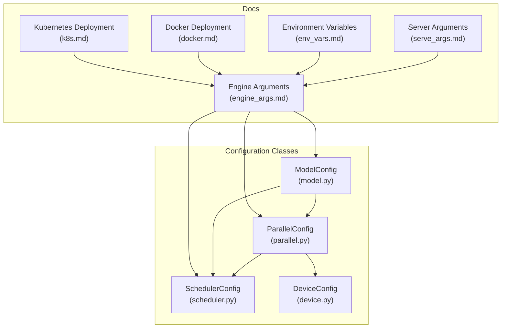
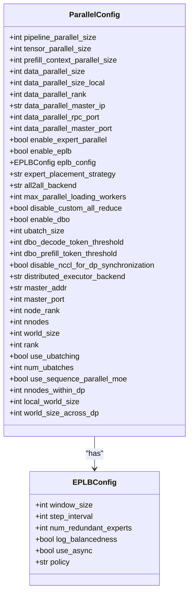
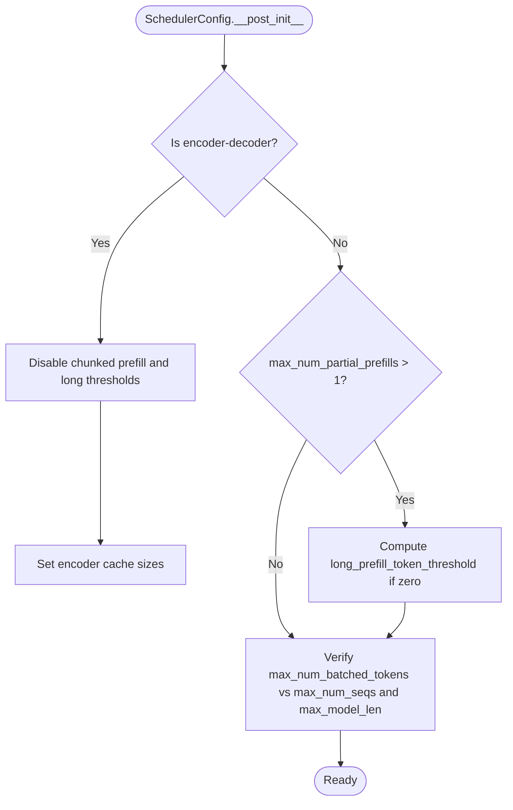
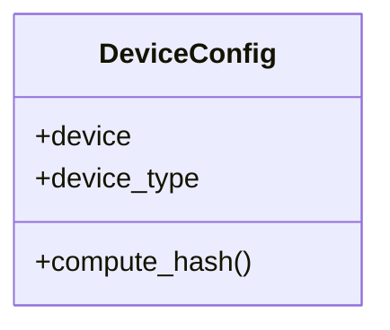
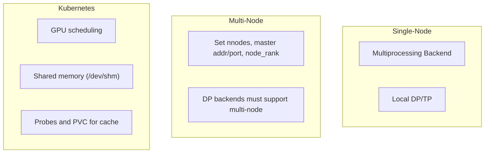
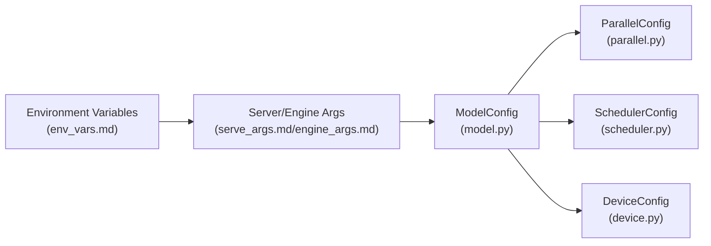

# Deployment Configuration

<cite>
**Referenced Files in This Document**
- [README.md](file://README.md)
- [engine_args.md](file://docs/configuration/engine_args.md)
- [serve_args.md](file://docs/configuration/serve_args.md)
- [env_vars.md](file://docs/configuration/env_vars.md)
- [docker.md](file://docs/deployment/docker.md)
- [k8s.md](file://docs/deployment/k8s.md)
- [parallel.py](file://vllm/config/parallel.py)
- [scheduler.py](file://vllm/config/scheduler.py)
- [device.py](file://vllm/config/device.py)
- [model.py](file://vllm/config/model.py)
</cite>

## Table of Contents
1. [Introduction](#introduction)
2. [Project Structure](#project-structure)
3. [Core Components](#core-components)
4. [Architecture Overview](#architecture-overview)
5. [Detailed Component Analysis](#detailed-component-analysis)
6. [Dependency Analysis](#dependency-analysis)
7. [Performance Considerations](#performance-considerations)
8. [Troubleshooting Guide](#troubleshooting-guide)
9. [Conclusion](#conclusion)
10. [Appendices](#appendices)

## Introduction
This document explains deployment-specific configuration options in vLLM with a focus on:
- Parallel processing configuration: tensor, data, expert, and pipeline parallelism
- Scheduler configuration for batching, priority, and resource allocation
- Device configuration for multi-GPU, mixed precision, and hardware-specific optimizations
- Load balancing, resource limits, and scaling parameters
- Topology configurations for single-node, multi-node, and cloud-native deployments
- Performance tuning, memory management, and distributed coordination

It synthesizes authoritative configuration classes and deployment guides from the repository to provide a practical, code-backed reference for operators and developers.

## Project Structure
The deployment configuration surface spans:
- Configuration classes that define runtime behavior (parallel, scheduler, device, model)
- CLI and server configuration documentation
- Container and Kubernetes deployment guides
- Environment variable documentation



**Diagram sources**
- [parallel.py](file://vllm/config/parallel.py#L81-L170)
- [scheduler.py](file://vllm/config/scheduler.py#L26-L120)
- [device.py](file://vllm/config/device.py#L17-L76)
- [model.py](file://vllm/config/model.py#L96-L170)
- [engine_args.md](file://docs/configuration/engine_args.md#L1-L23)
- [serve_args.md](file://docs/configuration/serve_args.md#L1-L36)
- [env_vars.md](file://docs/configuration/env_vars.md#L1-L13)
- [docker.md](file://docs/deployment/docker.md#L1-L153)
- [k8s.md](file://docs/deployment/k8s.md#L1-L120)

**Section sources**
- [README.md](file://README.md#L70-L92)
- [engine_args.md](file://docs/configuration/engine_args.md#L1-L23)
- [serve_args.md](file://docs/configuration/serve_args.md#L1-L36)
- [env_vars.md](file://docs/configuration/env_vars.md#L1-L13)
- [docker.md](file://docs/deployment/docker.md#L1-L153)
- [k8s.md](file://docs/deployment/k8s.md#L1-L120)

## Core Components
- ParallelConfig: Defines tensor, pipeline, data, and expert parallelism, load balancing, and distributed execution backends.
- SchedulerConfig: Controls request batching, chunked prefill, concurrency limits, scheduling policy, and streaming behavior.
- DeviceConfig: Selects device type and handles platform-specific device assignment.
- ModelConfig: Provides model resolution, dtype selection, quantization, and multimodal configuration.

These components collectively govern how vLLM scales across GPUs, manages memory, schedules requests, and coordinates across nodes.

**Section sources**
- [parallel.py](file://vllm/config/parallel.py#L81-L170)
- [scheduler.py](file://vllm/config/scheduler.py#L26-L120)
- [device.py](file://vllm/config/device.py#L17-L76)
- [model.py](file://vllm/config/model.py#L96-L170)

## Architecture Overview
The deployment configuration architecture connects CLI/server arguments to configuration classes and deployment guides.

```mermaid
sequenceDiagram
participant Operator as "Operator"
participant CLI as "vllm serve<br/>(serve_args.md)"
participant Engine as "EngineArgs<br/>(engine_args.md)"
participant VConf as "VllmConfig<br/>(model.py)"
participant Par as "ParallelConfig<br/>(parallel.py)"
participant Sch as "SchedulerConfig<br/>(scheduler.py)"
participant Dev as "DeviceConfig<br/>(device.py)"
Operator->>CLI : Provide CLI args and/or YAML config
CLI->>Engine : Parse engine args
Engine->>VConf : Construct ModelConfig
VConf->>Par : Configure parallelism
VConf->>Sch : Configure scheduler
VConf->>Dev : Configure device
Par-->>Operator : Distributed backends, DP/TP/PP sizes
Sch-->>Operator : Batching, chunked prefill, policy
Dev-->>Operator : Device type and platform mapping
```

**Diagram sources**
- [serve_args.md](file://docs/configuration/serve_args.md#L1-L36)
- [engine_args.md](file://docs/configuration/engine_args.md#L1-L23)
- [model.py](file://vllm/config/model.py#L96-L170)
- [parallel.py](file://vllm/config/parallel.py#L81-L170)
- [scheduler.py](file://vllm/config/scheduler.py#L26-L120)
- [device.py](file://vllm/config/device.py#L17-L76)

## Detailed Component Analysis

### Parallel Processing Configuration
ParallelConfig defines:
- Tensor, pipeline, prefill/decode context parallel sizes
- Data parallel size, local DP, DP rank, and messaging ports
- Data parallel backends and hybrid/external load balancing modes
- Expert parallelism enablement, placement strategy, and EPLB configuration
- All2All backend selection for MoE communication
- Dual batch overlap (DBO) and micro-batching controls
- Distributed executor backend selection (multiprocessing, Ray, external launcher)
- Multi-node parameters (master address/port, node rank, nnodes)

Key behaviors:
- World size computed as PP × TP × prefill CP
- DP synchronization and port management for robust initialization
- Sequence-parallel enforcement for MoE with certain All2All backends
- Validation of DP/TP/PP combinations and platform support for EPLB



**Diagram sources**
- [parallel.py](file://vllm/config/parallel.py#L81-L170)
- [parallel.py](file://vllm/config/parallel.py#L50-L80)

**Section sources**
- [parallel.py](file://vllm/config/parallel.py#L81-L170)
- [parallel.py](file://vllm/config/parallel.py#L277-L321)
- [parallel.py](file://vllm/config/parallel.py#L391-L414)
- [parallel.py](file://vllm/config/parallel.py#L415-L497)
- [parallel.py](file://vllm/config/parallel.py#L508-L551)
- [parallel.py](file://vllm/config/parallel.py#L552-L666)

### Scheduler Configuration
SchedulerConfig controls:
- Maximum number of batched tokens and concurrent sequences
- Chunked prefill behavior and thresholds for long prompts
- Scheduling policy (FCFS vs priority)
- Async scheduling toggle and streaming interval
- Scheduler class customization and hybrid KV cache manager behavior

Operational guidance:
- Increase max_num_batched_tokens and max_num_seqs to improve throughput
- Enable chunked prefill for long-context models and tune thresholds
- Use priority policy to bias short or high-priority requests
- Async scheduling improves GPU utilization but may be incompatible with speculative decoding and pipeline parallelism



**Diagram sources**
- [scheduler.py](file://vllm/config/scheduler.py#L215-L249)
- [scheduler.py](file://vllm/config/scheduler.py#L248-L300)

**Section sources**
- [scheduler.py](file://vllm/config/scheduler.py#L26-L120)
- [scheduler.py](file://vllm/config/scheduler.py#L146-L178)
- [scheduler.py](file://vllm/config/scheduler.py#L215-L249)
- [scheduler.py](file://vllm/config/scheduler.py#L248-L300)

### Device Configuration
DeviceConfig selects device type and maps it to a torch.device:
- Auto-detection based on platform
- Explicit device type or torch.device
- Special handling for TPU requiring CPU-side input processing
- Hashing for computation graph stability



**Diagram sources**
- [device.py](file://vllm/config/device.py#L17-L76)

**Section sources**
- [device.py](file://vllm/config/device.py#L17-L76)

### Model and Mixed Precision Configuration
ModelConfig governs:
- Model and tokenizer resolution, trust remote code, and revisions
- Data type selection (auto, FP16, BF16, FP32) and attention dtype override
- Quantization method and enforce eager mode
- Multimodal configuration and attention chunk size
- Runner type and pooling configuration

Mixed precision and dtype:
- dtype "auto" chooses FP16/BF16 depending on model type
- override_attention_dtype available on ROCm
- enforce_eager disables CUDA graph for reproducibility

**Section sources**
- [model.py](file://vllm/config/model.py#L96-L170)
- [model.py](file://vllm/config/model.py#L127-L136)
- [model.py](file://vllm/config/model.py#L449-L457)
- [model.py](file://vllm/config/model.py#L532-L542)

### Load Balancing, Resource Limits, and Scaling
- Data parallel external/hybrid load balancing modes for online serving
- EPLBConfig parameters for expert parallel load balancing (window size, step interval, redundant experts)
- Expert placement strategies (linear, round_robin)
- All2All backends for MoE communication
- DBO and micro-batching parameters for throughput/latency trade-offs
- Distributed executor backend selection and multi-node parameters

**Section sources**
- [parallel.py](file://vllm/config/parallel.py#L110-L170)
- [parallel.py](file://vllm/config/parallel.py#L50-L80)
- [parallel.py](file://vllm/config/parallel.py#L137-L146)
- [parallel.py](file://vllm/config/parallel.py#L155-L170)
- [parallel.py](file://vllm/config/parallel.py#L552-L613)

### Deployment Topologies
- Single-node: multiprocessing backend, local DP, TP within node
- Multi-node: set nnodes, master address/port, node rank; DP backends must support multi-node
- Cloud-native (Kubernetes): GPU scheduling, shared memory (/dev/shm), liveness/readiness probes, PVC for model cache



**Diagram sources**
- [parallel.py](file://vllm/config/parallel.py#L552-L613)
- [k8s.md](file://docs/deployment/k8s.md#L130-L250)
- [k8s.md](file://docs/deployment/k8s.md#L250-L359)

**Section sources**
- [parallel.py](file://vllm/config/parallel.py#L552-L613)
- [k8s.md](file://docs/deployment/k8s.md#L130-L250)
- [k8s.md](file://docs/deployment/k8s.md#L250-L359)

## Dependency Analysis
Configuration classes depend on each other as follows:
- ModelConfig drives ParallelConfig and SchedulerConfig construction
- DeviceConfig is platform-derived and influences device assignment
- CLI/server arguments feed into EngineArgs/VllmConfig creation



**Diagram sources**
- [model.py](file://vllm/config/model.py#L96-L170)
- [parallel.py](file://vllm/config/parallel.py#L81-L170)
- [scheduler.py](file://vllm/config/scheduler.py#L26-L120)
- [device.py](file://vllm/config/device.py#L17-L76)
- [serve_args.md](file://docs/configuration/serve_args.md#L1-L36)
- [engine_args.md](file://docs/configuration/engine_args.md#L1-L23)
- [env_vars.md](file://docs/configuration/env_vars.md#L1-L13)

**Section sources**
- [model.py](file://vllm/config/model.py#L96-L170)
- [parallel.py](file://vllm/config/parallel.py#L81-L170)
- [scheduler.py](file://vllm/config/scheduler.py#L26-L120)
- [device.py](file://vllm/config/device.py#L17-L76)
- [serve_args.md](file://docs/configuration/serve_args.md#L1-L36)
- [engine_args.md](file://docs/configuration/engine_args.md#L1-L23)
- [env_vars.md](file://docs/configuration/env_vars.md#L1-L13)

## Performance Considerations
- Throughput vs latency: adjust max_num_batched_tokens, max_num_seqs, and streaming interval
- Chunked prefill: enable for long contexts; tune thresholds for long prompts
- Priority scheduling: use lower numeric priority values for higher urgency
- DBO and micro-batching: tune thresholds to balance decode vs prefill microbatching
- All2All backends: select appropriate backend for MoE communication characteristics
- Mixed precision: choose dtype "auto" or explicit FP16/BF16; override attention dtype on ROCm
- Multi-node: disable custom all-reduce and ensure DP backends support multi-node

[No sources needed since this section provides general guidance]

## Troubleshooting Guide
Common issues and remedies:
- Startup/Readiness Probe failures in Kubernetes: increase failureThreshold to accommodate cold start
- Shared memory constraints for tensor parallel inference: ensure /dev/shm is mounted and sized appropriately
- Port conflicts in DP initialization: rely on auto-opened ports or provide unique ports per process
- Unsupported EPLB on non-CUDA/ROCm devices: EPLB requires CUDA/ROCm support
- Async scheduling limitations: avoid with speculative decoding and pipeline parallelism

**Section sources**
- [k8s.md](file://docs/deployment/k8s.md#L384-L398)
- [docker.md](file://docs/deployment/docker.md#L30-L40)
- [parallel.py](file://vllm/config/parallel.py#L336-L390)
- [parallel.py](file://vllm/config/parallel.py#L297-L321)
- [scheduler.py](file://vllm/config/scheduler.py#L133-L145)

## Conclusion
vLLM’s deployment configuration centers on tightly integrated configuration classes and deployment guides. Correctly sizing tensor/data/pipeline/expert parallelism, tuning the scheduler for batching and priority, selecting appropriate device and dtype, and configuring distributed backends and multi-node parameters are essential for achieving throughput, latency, and reliability targets across single-node, multi-node, and cloud-native environments.

[No sources needed since this section summarizes without analyzing specific files]

## Appendices

### Environment Variables
- VLLM_PORT and VLLM_HOST_IP are for internal usage; do not confuse with API server host/port
- Avoid naming Kubernetes services “vllm” to prevent environment variable collisions

**Section sources**
- [env_vars.md](file://docs/configuration/env_vars.md#L1-L13)

### Container and Kubernetes Notes
- Docker: use host IPC or shm-size; optional dependencies require custom images
- Kubernetes: mount shared memory, configure liveness/readiness probes, and PVC for model cache

**Section sources**
- [docker.md](file://docs/deployment/docker.md#L30-L40)
- [docker.md](file://docs/deployment/docker.md#L140-L153)
- [k8s.md](file://docs/deployment/k8s.md#L200-L249)
- [k8s.md](file://docs/deployment/k8s.md#L332-L359)