# Device Configuration

<cite>
**Referenced Files in This Document**
- [cuda.py](file://vllm/platforms/cuda.py)
- [rocm.py](file://vllm/platforms/rocm.py)
- [cpu.py](file://vllm/platforms/cpu.py)
- [xpu.py](file://vllm/platforms/xpu.py)
- [tpu.py](file://vllm/platforms/tpu.py)
- [__init__.py](file://vllm/platforms/__init__.py)
- [envs.py](file://vllm/envs.py)
- [model.py](file://vllm/config/model.py)
- [config.py](file://vllm/model_executor/layers/fused_moe/config.py)
- [utils.py](file://vllm/model_executor/layers/fla/ops/utils.py)
- [pynccl.py](file://vllm/distributed/device_communicators/pynccl.py)
- [pynccl_wrapper.py](file://vllm/distributed/device_communicators/pynccl_wrapper.py)
- [benchmark_device_communicators.py](file://benchmarks/kernels/benchmark_device_communicators.py)
- [tensor_memory_pool.py](file://vllm/distributed/kv_transfer/kv_connector/v1/p2p/tensor_memory_pool.py)
- [cumem_allocator.cpp](file://csrc/cumem_allocator.cpp)
</cite>

## Table of Contents
1. [Introduction](#introduction)
2. [Project Structure](#project-structure)
3. [Core Components](#core-components)
4. [Architecture Overview](#architecture-overview)
5. [Detailed Component Analysis](#detailed-component-analysis)
6. [Dependency Analysis](#dependency-analysis)
7. [Performance Considerations](#performance-considerations)
8. [Troubleshooting Guide](#troubleshooting-guide)
9. [Conclusion](#conclusion)
10. [Appendices](#appendices)

## Introduction
This document explains device-specific configuration in vLLM, focusing on multi-GPU setups, device allocation strategies, GPU memory management, CUDA context configuration, mixed precision training and inference, dtype selection, and platform-specific optimizations across NVIDIA CUDA, AMD ROCm, Intel CPU/GPU (XPU), and TPU platforms. It also covers device communication settings, NCCL configuration, distributed backends, memory pools, pinned memory usage, and device-to-device transfer optimization. Practical tuning recommendations and troubleshooting guidance are included for each platform.

## Project Structure
The device configuration logic is primarily implemented in platform-specific modules under vllm/platforms, with environment variables and configuration utilities in vllm/envs.py and vllm/config. Distributed communication and device communicators live under vllm/distributed/device_communicators. Memory management and pinned memory facilities are implemented in vllm/distributed/kv_transfer and csrc.

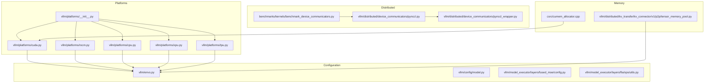

**Diagram sources**
- [cuda.py](file://vllm/platforms/cuda.py#L1-L120)
- [rocm.py](file://vllm/platforms/rocm.py#L1-L120)
- [cpu.py](file://vllm/platforms/cpu.py#L1-L120)
- [xpu.py](file://vllm/platforms/xpu.py#L1-L120)
- [tpu.py](file://vllm/platforms/tpu.py#L1-L120)
- [__init__.py](file://vllm/platforms/__init__.py#L43-L188)
- [envs.py](file://vllm/envs.py#L448-L560)
- [pynccl.py](file://vllm/distributed/device_communicators/pynccl.py#L58-L88)
- [pynccl_wrapper.py](file://vllm/distributed/device_communicators/pynccl_wrapper.py#L131-L200)
- [benchmark_device_communicators.py](file://benchmarks/kernels/benchmark_device_communicators.py#L85-L119)
- [tensor_memory_pool.py](file://vllm/distributed/kv_transfer/kv_connector/v1/p2p/tensor_memory_pool.py#L1-L120)
- [cumem_allocator.cpp](file://csrc/cumem_allocator.cpp#L76-L175)

**Section sources**
- [cuda.py](file://vllm/platforms/cuda.py#L1-L120)
- [rocm.py](file://vllm/platforms/rocm.py#L1-L120)
- [cpu.py](file://vllm/platforms/cpu.py#L1-L120)
- [xpu.py](file://vllm/platforms/xpu.py#L1-L120)
- [tpu.py](file://vllm/platforms/tpu.py#L1-L120)
- [__init__.py](file://vllm/platforms/__init__.py#L43-L188)
- [envs.py](file://vllm/envs.py#L448-L560)

## Core Components
- Platform detection and selection: vllm/platforms/__init__.py detects available platforms (CUDA, ROCm, XPU, CPU, TPU) and returns the appropriate platform module.
- Platform-specific capabilities:
  - CUDA: device capability checks, backend selection, FP8 support, static graph wrapper, memory warnings, and NVLink connectivity detection.
  - ROCm: device capability checks, attention backend selection, FP8 support, custom allreduce gating, and ROCm-specific quantization support.
  - CPU: supported dtypes, block size preferences, distributed backend (gloo), and environment tuning for CPU execution.
  - XPU: attention backend selection, FP8 dtype, device communicators, and memory usage helpers.
  - TPU: attention backend selection (Pallas), compilation mode constraints, and device communicators.
- Environment variables: vllm/envs.py defines device-related environment variables controlling target device, NCCL library path, ROCm sleep chunk size, attention backend selection, and distributed communication settings.
- Mixed precision and dtype selection: vllm/config/model.py and fused MoE config select dtypes based on model config, platform support, and explicit user settings, with warnings for casting and down/upcasting.
- Device communicators: PyNccl communicator and NCCL library wrapper enable NCCL-backed communication and symmetric memory features.
- Memory management: TensorMemoryPool manages pinned host memory for device-to-host transfers; CUDA generic memory allocator supports pinned device memory and GPUDirect RDMA.

**Section sources**
- [__init__.py](file://vllm/platforms/__init__.py#L43-L188)
- [cuda.py](file://vllm/platforms/cuda.py#L96-L180)
- [rocm.py](file://vllm/platforms/rocm.py#L160-L240)
- [cpu.py](file://vllm/platforms/cpu.py#L70-L120)
- [xpu.py](file://vllm/platforms/xpu.py#L25-L70)
- [tpu.py](file://vllm/platforms/tpu.py#L37-L90)
- [envs.py](file://vllm/envs.py#L448-L560)
- [model.py](file://vllm/config/model.py#L1949-L2031)
- [config.py](file://vllm/model_executor/layers/fused_moe/config.py#L39-L66)
- [pynccl.py](file://vllm/distributed/device_communicators/pynccl.py#L58-L88)
- [pynccl_wrapper.py](file://vllm/distributed/device_communicators/pynccl_wrapper.py#L131-L200)
- [tensor_memory_pool.py](file://vllm/distributed/kv_transfer/kv_connector/v1/p2p/tensor_memory_pool.py#L1-L120)
- [cumem_allocator.cpp](file://csrc/cumem_allocator.cpp#L76-L175)

## Architecture Overview
The device configuration architecture integrates platform detection, environment-driven tuning, and platform-specific capabilities. Distributed communication leverages NCCL on CUDA and ROCm, gloo on CPU, and platform-specific communicators on XPU and TPU. Memory management uses pinned host memory pools and CUDA generic memory allocation for efficient device-to-device transfers.

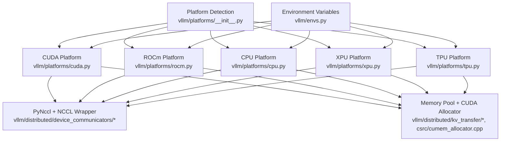

**Diagram sources**
- [__init__.py](file://vllm/platforms/__init__.py#L43-L188)
- [cuda.py](file://vllm/platforms/cuda.py#L96-L180)
- [rocm.py](file://vllm/platforms/rocm.py#L160-L240)
- [cpu.py](file://vllm/platforms/cpu.py#L70-L120)
- [xpu.py](file://vllm/platforms/xpu.py#L25-L70)
- [tpu.py](file://vllm/platforms/tpu.py#L37-L90)
- [envs.py](file://vllm/envs.py#L448-L560)
- [pynccl.py](file://vllm/distributed/device_communicators/pynccl.py#L58-L88)
- [pynccl_wrapper.py](file://vllm/distributed/device_communicators/pynccl_wrapper.py#L131-L200)
- [tensor_memory_pool.py](file://vllm/distributed/kv_transfer/kv_connector/v1/p2p/tensor_memory_pool.py#L1-L120)
- [cumem_allocator.cpp](file://csrc/cumem_allocator.cpp#L76-L175)

## Detailed Component Analysis

### CUDA Device Configuration
- Device capability and backend selection:
  - Determines compute capability and supported dtypes; selects attention backends prioritized by device generation.
  - Enforces block sizes for MLA backends and warns on mixed-precision constraints.
- FP8 support and static graphs:
  - FP8 availability depends on compute capability; static graph wrapper is enabled for CUDA.
- Memory and NVLink:
  - NVML-based device queries and NVLink connectivity checks; warns on device ordering mismatches.
- Environment controls:
  - NCCL library path, attention backend selection, and related toggles influence runtime behavior.

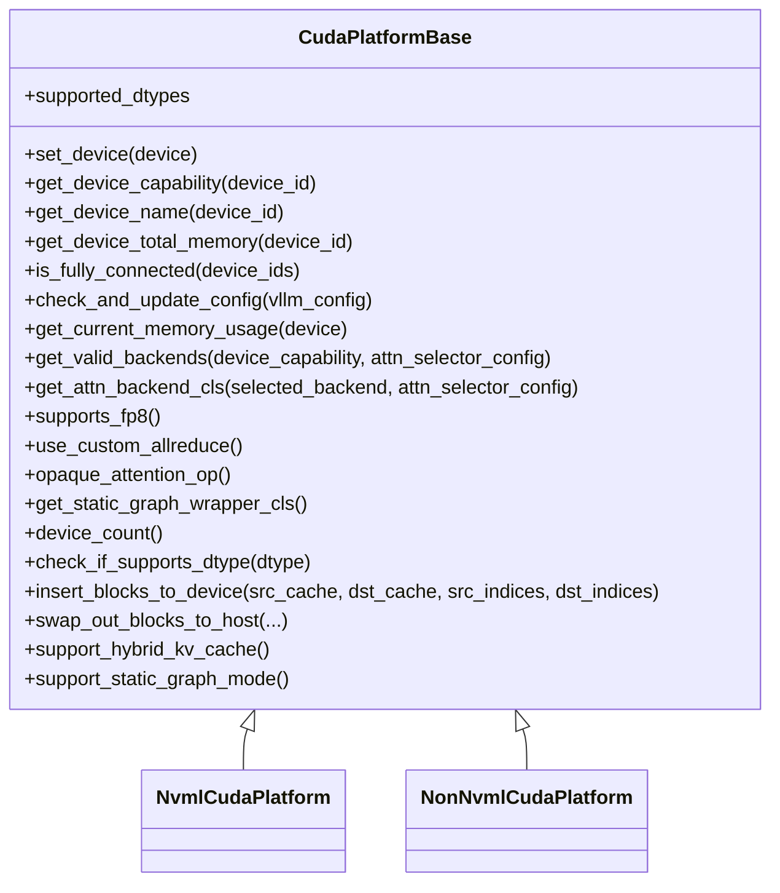

**Diagram sources**
- [cuda.py](file://vllm/platforms/cuda.py#L96-L180)
- [cuda.py](file://vllm/platforms/cuda.py#L480-L619)

**Section sources**
- [cuda.py](file://vllm/platforms/cuda.py#L96-L180)
- [cuda.py](file://vllm/platforms/cuda.py#L480-L619)
- [envs.py](file://vllm/envs.py#L448-L560)

### ROCm Device Configuration
- Device capability and connectivity:
  - Uses AMDSMI to detect device names, architectures, and XGMI connectivity.
- Attention backends:
  - Selects among Triton, AITER, and MLA backends depending on architecture and environment flags.
- Quantization and FP8:
  - Supports FP8 on specific architectures; sets FP8 dtype accordingly.
- Environment controls:
  - ROCm-specific toggles for AITER kernels and custom paged attention.

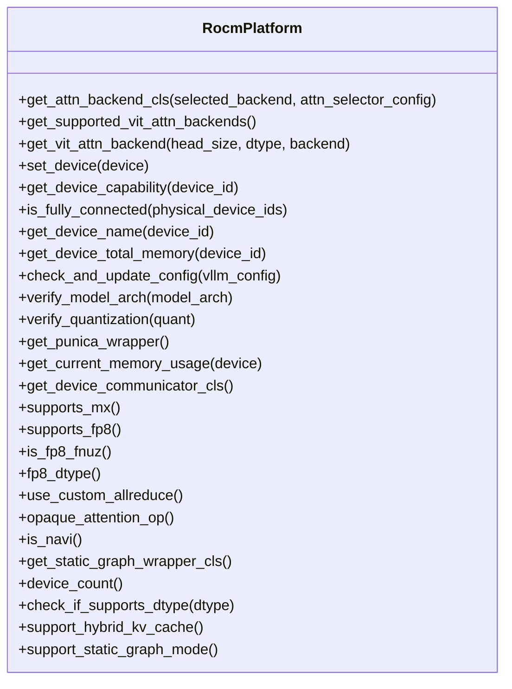

**Diagram sources**
- [rocm.py](file://vllm/platforms/rocm.py#L160-L240)
- [rocm.py](file://vllm/platforms/rocm.py#L480-L562)

**Section sources**
- [rocm.py](file://vllm/platforms/rocm.py#L160-L240)
- [rocm.py](file://vllm/platforms/rocm.py#L480-L562)
- [envs.py](file://vllm/envs.py#L448-L560)

### CPU Device Configuration
- Supported dtypes and attention:
  - Supports BF16/FP16/FP32 depending on architecture; restricts attention backends to CPU-specific ones.
- Memory and block sizing:
  - Computes KV cache space from total memory and enforces block size preferences.
- Distributed and compilation:
  - Forces gloo backend; adjusts compilation modes and disables incompatible features.

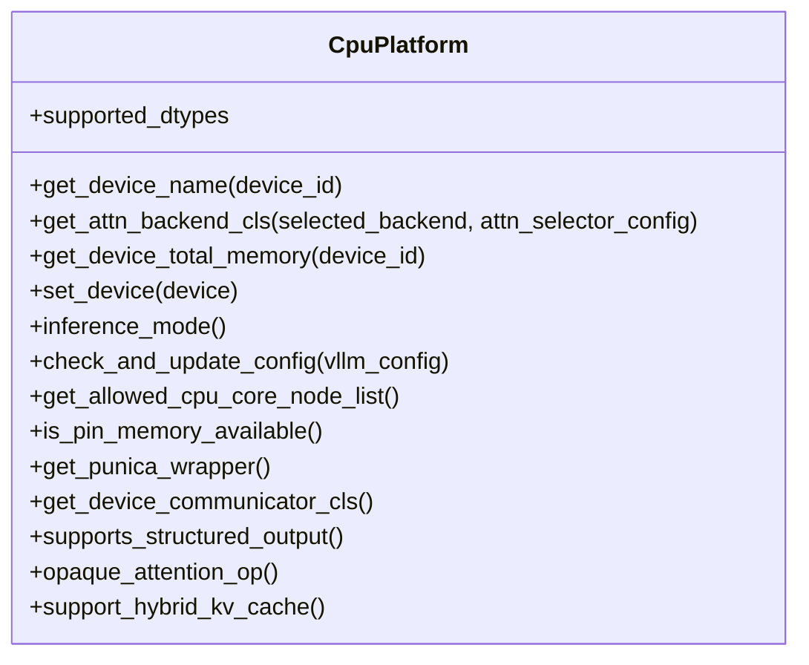

**Diagram sources**
- [cpu.py](file://vllm/platforms/cpu.py#L70-L120)
- [cpu.py](file://vllm/platforms/cpu.py#L354-L422)

**Section sources**
- [cpu.py](file://vllm/platforms/cpu.py#L70-L120)
- [cpu.py](file://vllm/platforms/cpu.py#L354-L422)
- [envs.py](file://vllm/envs.py#L448-L560)

### XPU (Intel) Device Configuration
- Attention and memory:
  - Sets attention backend and enforces NHD KV cache layout; exposes FP8 dtype and pinned memory availability.
- Distributed and compilation:
  - Uses CCL/XCCL backends; restricts compilation modes; sets worker classes and executor backends.
- Device-specific operations:
  - Provides device-specific block insertion and swapping helpers.

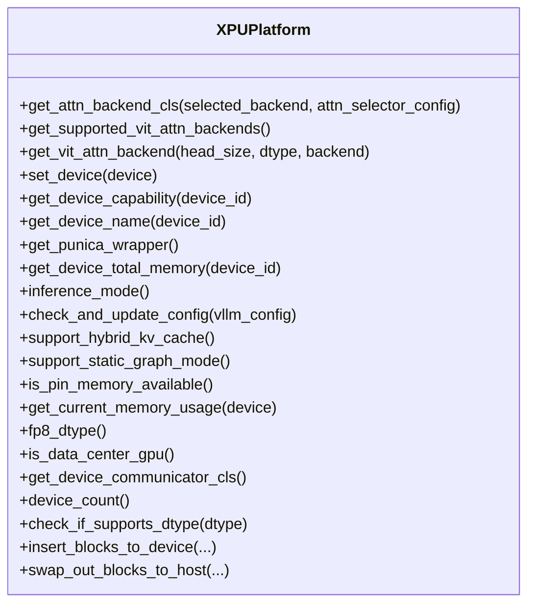

**Diagram sources**
- [xpu.py](file://vllm/platforms/xpu.py#L25-L70)
- [xpu.py](file://vllm/platforms/xpu.py#L200-L281)

**Section sources**
- [xpu.py](file://vllm/platforms/xpu.py#L25-L70)
- [xpu.py](file://vllm/platforms/xpu.py#L200-L281)
- [envs.py](file://vllm/envs.py#L448-L560)

### TPU Device Configuration
- Attention and compilation:
  - Uses Pallas backend; enforces DYNAMO_TRACE_ONCE compilation and disables CUDA graphs.
- Distributed and environment:
  - Uses gloo backend; sets XLA backend and worker class; validates request constraints.
- Device-specific operations:
  - Provides device-specific block insertion and swapping helpers with XLA buffers.

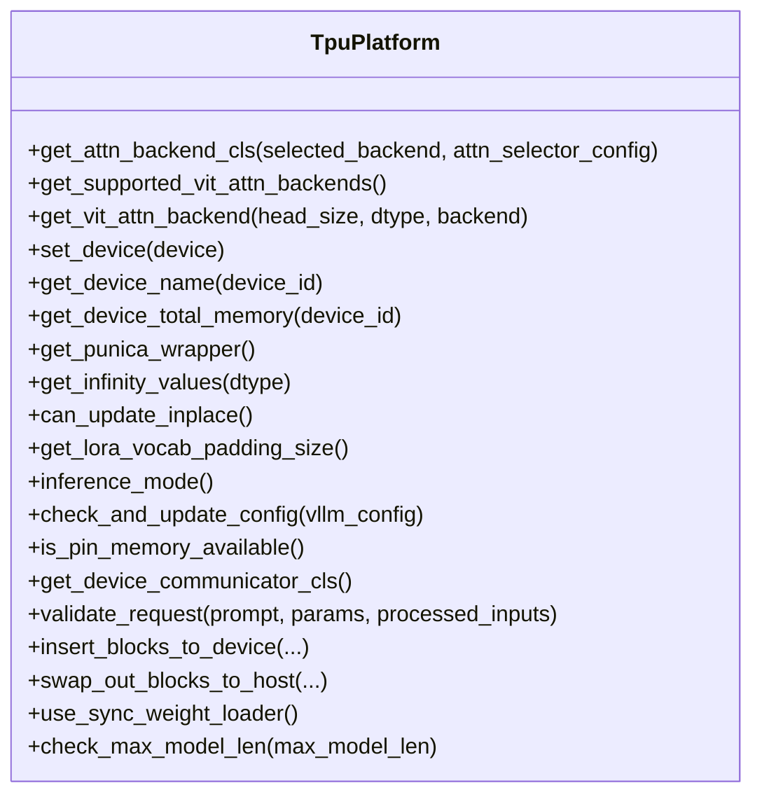

**Diagram sources**
- [tpu.py](file://vllm/platforms/tpu.py#L37-L90)
- [tpu.py](file://vllm/platforms/tpu.py#L200-L296)

**Section sources**
- [tpu.py](file://vllm/platforms/tpu.py#L37-L90)
- [tpu.py](file://vllm/platforms/tpu.py#L200-L296)
- [envs.py](file://vllm/envs.py#L448-L560)

### Device Communication and NCCL Configuration
- PyNccl communicator:
  - Binds to a specific device and a non-NCCL process group; initializes ranks and world size from the group.
- NCCL library wrapper:
  - Loads NCCL symbols dynamically, handles version checks, and exposes broadcast/allreduce/group operations; includes symmetric memory features guarded by environment flags.
- Benchmark initialization:
  - Initializes both CustomAllreduce and PyNcclCommunicator, conditionally enabling/disabling based on environment and availability.

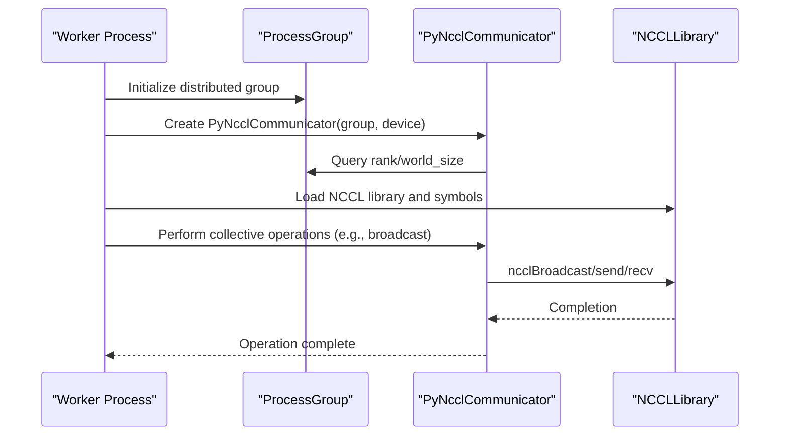

**Diagram sources**
- [pynccl.py](file://vllm/distributed/device_communicators/pynccl.py#L58-L88)
- [pynccl_wrapper.py](file://vllm/distributed/device_communicators/pynccl_wrapper.py#L131-L200)
- [pynccl_wrapper.py](file://vllm/distributed/device_communicators/pynccl_wrapper.py#L330-L360)
- [benchmark_device_communicators.py](file://benchmarks/kernels/benchmark_device_communicators.py#L85-L119)

**Section sources**
- [pynccl.py](file://vllm/distributed/device_communicators/pynccl.py#L58-L88)
- [pynccl_wrapper.py](file://vllm/distributed/device_communicators/pynccl_wrapper.py#L131-L200)
- [pynccl_wrapper.py](file://vllm/distributed/device_communicators/pynccl_wrapper.py#L330-L360)
- [benchmark_device_communicators.py](file://benchmarks/kernels/benchmark_device_communicators.py#L85-L119)

### Memory Management and Pinned Memory
- TensorMemoryPool:
  - Implements a buddy allocator over pinned host memory to store and load tensors efficiently; supports allocation, deallocation, and device transfers.
- CUDA Generic Memory Allocator:
  - Manages pinned device memory, sets access descriptors, and supports GPUDirect RDMA on capable devices; coordinates with Python callbacks for allocation lifecycle.

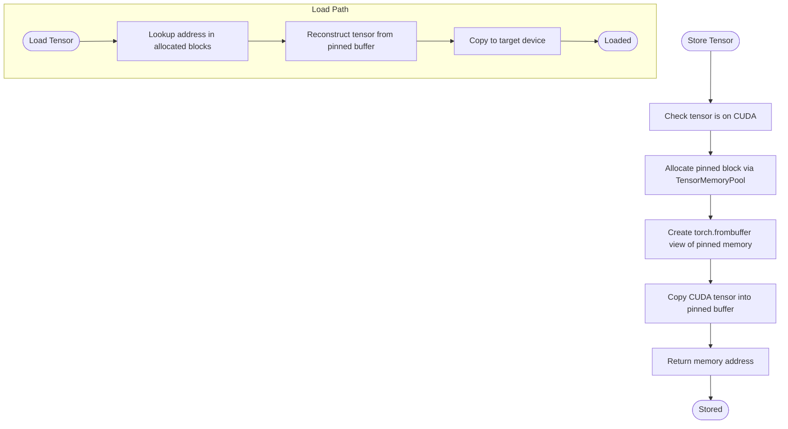

**Diagram sources**
- [tensor_memory_pool.py](file://vllm/distributed/kv_transfer/kv_connector/v1/p2p/tensor_memory_pool.py#L180-L274)
- [cumem_allocator.cpp](file://csrc/cumem_allocator.cpp#L76-L175)
- [cumem_allocator.cpp](file://csrc/cumem_allocator.cpp#L283-L358)

**Section sources**
- [tensor_memory_pool.py](file://vllm/distributed/kv_transfer/kv_connector/v1/p2p/tensor_memory_pool.py#L1-L120)
- [tensor_memory_pool.py](file://vllm/distributed/kv_transfer/kv_connector/v1/p2p/tensor_memory_pool.py#L180-L274)
- [cumem_allocator.cpp](file://csrc/cumem_allocator.cpp#L76-L175)
- [cumem_allocator.cpp](file://csrc/cumem_allocator.cpp#L283-L358)

### Mixed Precision and Dtype Selection
- Automatic dtype resolution:
  - Resolves model-configured dtype to a supported platform dtype, with warnings for casting between float32 and lower precisions.
- Head dtype handling:
  - Adjusts head dtype based on model and runner type, ensuring compatibility with platform-supported dtypes.
- Fused MoE dtype selection:
  - Chooses appropriate dtype strings for MoE kernels based on quantization schemes and dtype.

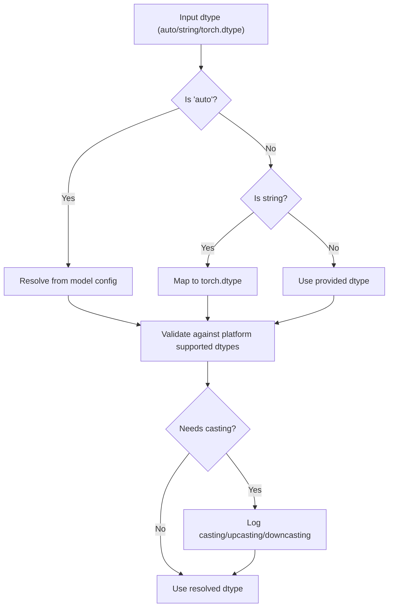

**Diagram sources**
- [model.py](file://vllm/config/model.py#L1949-L2031)
- [config.py](file://vllm/model_executor/layers/fused_moe/config.py#L39-L66)

**Section sources**
- [model.py](file://vllm/config/model.py#L1949-L2031)
- [config.py](file://vllm/model_executor/layers/fused_moe/config.py#L39-L66)

### Hardware-Specific Optimizations and Vendor Checks
- Vendor detection:
  - Detects NVIDIA, AMD, Intel, and MUSA backends via device and Triton backend checks.
- Platform-specific tuning:
  - Enables CUDA graphs for NVIDIA when configured; sets FP8 dtypes for ROCm/MX and XPU; restricts attention backends per platform.

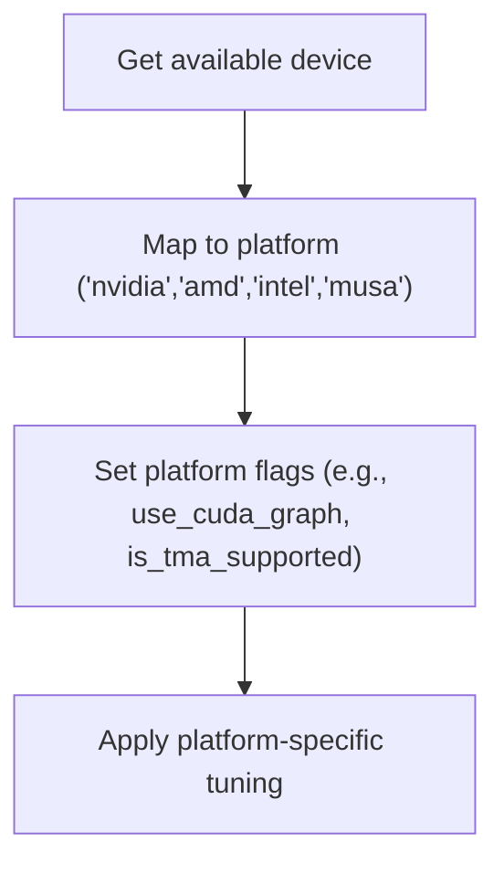

**Diagram sources**
- [utils.py](file://vllm/model_executor/layers/fla/ops/utils.py#L126-L158)

**Section sources**
- [utils.py](file://vllm/model_executor/layers/fla/ops/utils.py#L126-L158)

## Dependency Analysis
- Platform detection depends on environment and installed libraries (NVML, AMDSMI, IPEX).
- CUDA and ROCm platforms depend on attention backend availability and environment flags.
- CPU/XPU/TPU platforms enforce specific backends and compilation modes.
- Device communicators rely on NCCL presence and environment flags for symmetric memory features.

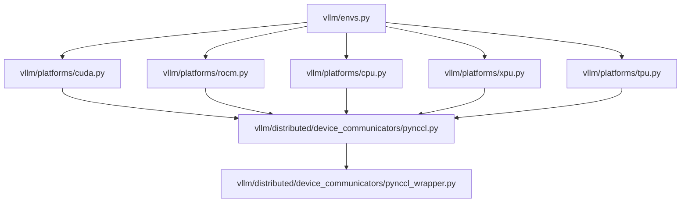

**Diagram sources**
- [envs.py](file://vllm/envs.py#L448-L560)
- [cuda.py](file://vllm/platforms/cuda.py#L96-L180)
- [rocm.py](file://vllm/platforms/rocm.py#L160-L240)
- [cpu.py](file://vllm/platforms/cpu.py#L70-L120)
- [xpu.py](file://vllm/platforms/xpu.py#L25-L70)
- [tpu.py](file://vllm/platforms/tpu.py#L37-L90)
- [pynccl.py](file://vllm/distributed/device_communicators/pynccl.py#L58-L88)
- [pynccl_wrapper.py](file://vllm/distributed/device_communicators/pynccl_wrapper.py#L131-L200)

**Section sources**
- [envs.py](file://vllm/envs.py#L448-L560)
- [cuda.py](file://vllm/platforms/cuda.py#L96-L180)
- [rocm.py](file://vllm/platforms/rocm.py#L160-L240)
- [cpu.py](file://vllm/platforms/cpu.py#L70-L120)
- [xpu.py](file://vllm/platforms/xpu.py#L25-L70)
- [tpu.py](file://vllm/platforms/tpu.py#L37-L90)
- [pynccl.py](file://vllm/distributed/device_communicators/pynccl.py#L58-L88)
- [pynccl_wrapper.py](file://vllm/distributed/device_communicators/pynccl_wrapper.py#L131-L200)

## Performance Considerations
- Multi-GPU and topology:
  - Prefer NVLink/XGMI-connected GPUs for optimal bandwidth; ensure device ordering and visibility are consistent across ranks.
- Attention backends:
  - Choose backends aligned with device capability and model characteristics; adjust block sizes for MLA backends.
- Mixed precision:
  - Use BF16/FP16 when supported; downcast from FP32 only when necessary; avoid unnecessary casting between FP16/BF16.
- Memory:
  - Use pinned host memory pools for frequent device-to-host transfers; leverage symmetric memory features where available.
- NCCL:
  - Ensure correct NCCL library path and version; enable symmetric memory features when supported by the platform.

[No sources needed since this section provides general guidance]

## Troubleshooting Guide
- CUDA device ordering:
  - Set device order to PCI bus ID when mixing heterogeneous GPUs to avoid unexpected device mapping.
- ROCm custom allreduce:
  - Enable only on supported architectures; verify AITER FP8 linear and RMSNorm custom ops are available.
- CPU backend:
  - Block size should be multiples of 32 for optimal performance; avoid FP8 KV cache on CPU.
- XPU backend:
  - Use CCL/XCCL backends; ensure pinned memory is available; avoid static graph mode.
- TPU backend:
  - Enforce DYNAMO_TRACE_ONCE compilation and disable CUDA graphs; avoid speculative decoding.

**Section sources**
- [cuda.py](file://vllm/platforms/cuda.py#L560-L575)
- [rocm.py](file://vllm/platforms/rocm.py#L430-L460)
- [cpu.py](file://vllm/platforms/cpu.py#L180-L210)
- [xpu.py](file://vllm/platforms/xpu.py#L138-L170)
- [tpu.py](file://vllm/platforms/tpu.py#L133-L160)

## Conclusion
vLLM’s device configuration integrates platform-aware capabilities, environment-driven tuning, and robust distributed communication. By leveraging platform-specific backends, dtype selection logic, and memory management utilities, users can optimize performance across NVIDIA CUDA, AMD ROCm, Intel CPU/GPU, and TPU environments. Proper NCCL configuration, attention backend selection, and memory pool usage are essential for achieving high throughput and stability.

[No sources needed since this section summarizes without analyzing specific files]

## Appendices
- Environment variables relevant to device configuration:
  - Target device, NCCL library path, attention backend selection, ROCm AITER toggles, KV cache layout, and distributed communication settings.

**Section sources**
- [envs.py](file://vllm/envs.py#L448-L560)