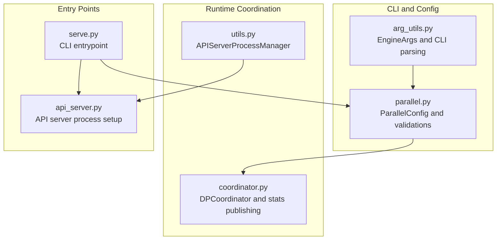
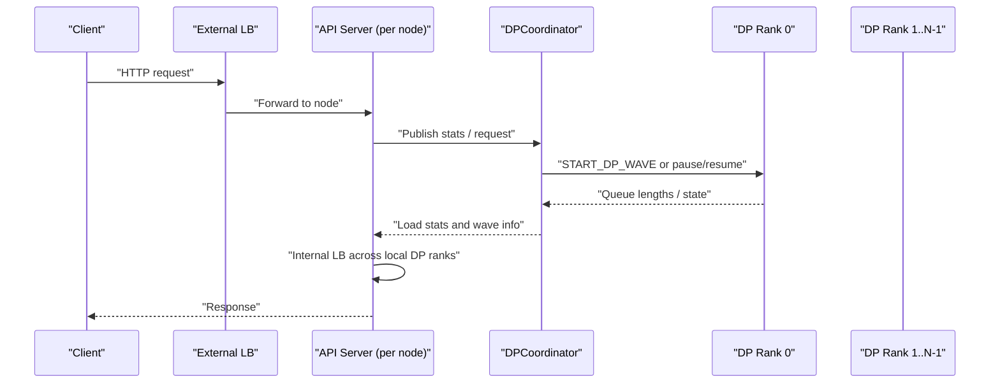
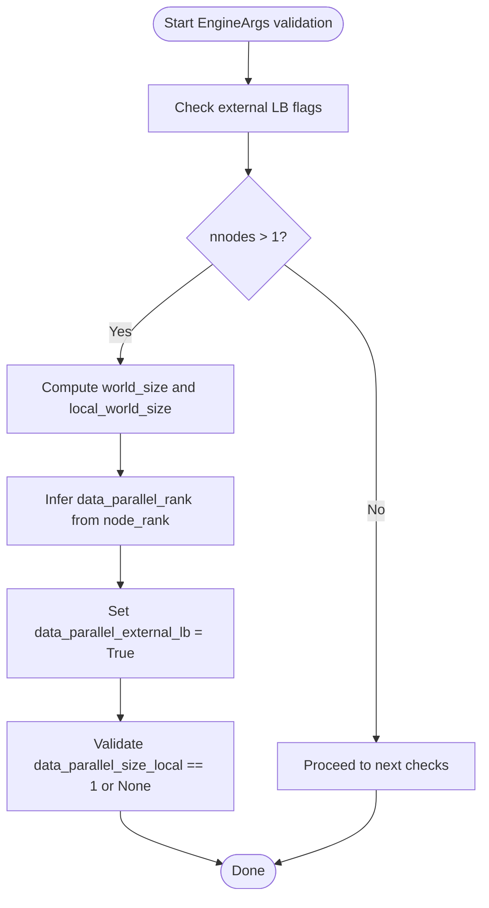
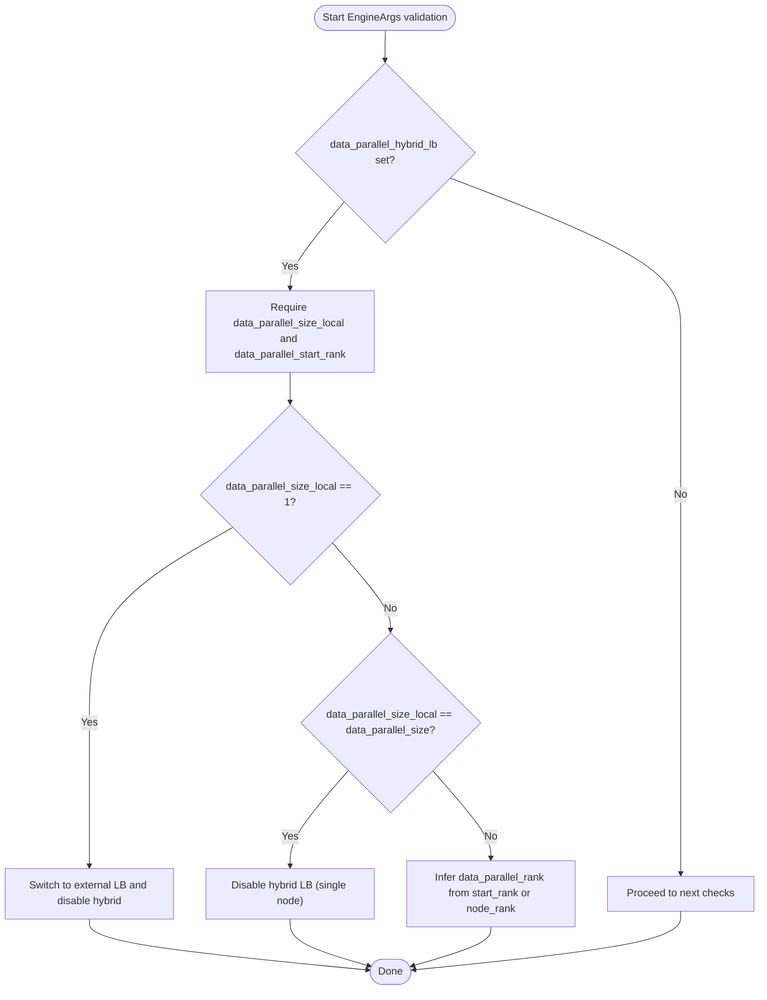
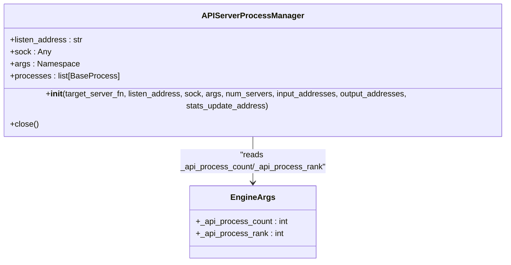
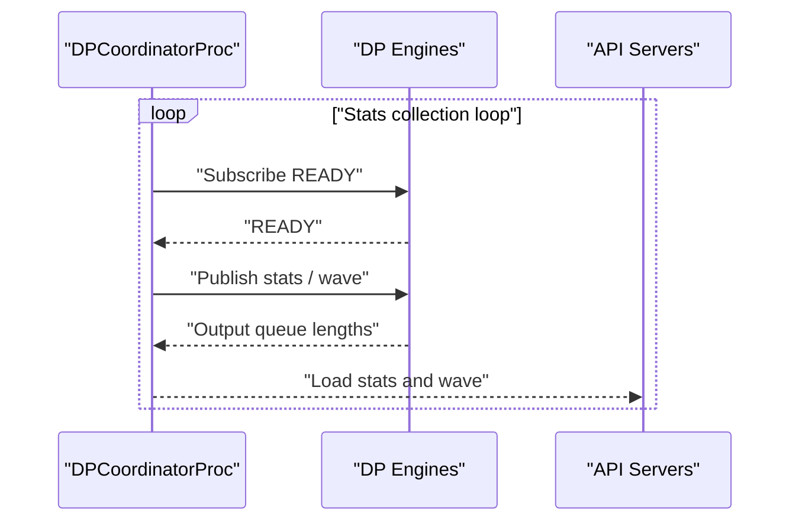
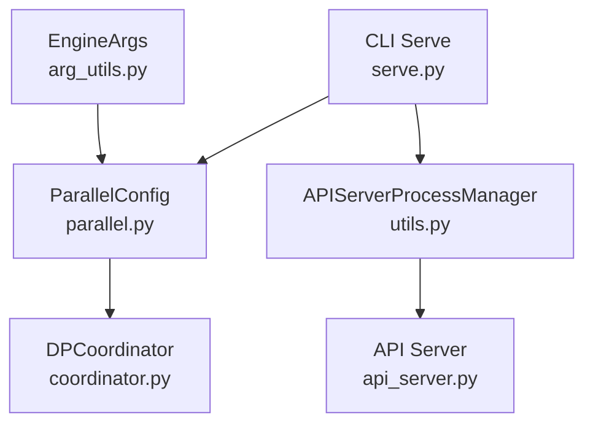

# Load Balancing Configuration

<cite>
**Referenced Files in This Document**
- [arg_utils.py](file://vllm/engine/arg_utils.py)
- [parallel.py](file://vllm/config/parallel.py)
- [coordinator.py](file://vllm/v1/engine/coordinator.py)
- [utils.py](file://vllm/v1/utils.py)
- [test_hybrid_lb_dp.py](file://tests/v1/distributed/test_hybrid_lb_dp.py)
- [k8s.md](file://docs/deployment/k8s.md)
- [nginx.md](file://docs/deployment/nginx.md)
- [serve.py](file://vllm/entrypoints/cli/serve.py)
- [api_server.py](file://vllm/entrypoints/openai/api_server.py)
</cite>

## Table of Contents
1. [Introduction](#introduction)
2. [Project Structure](#project-structure)
3. [Core Components](#core-components)
4. [Architecture Overview](#architecture-overview)
5. [Detailed Component Analysis](#detailed-component-analysis)
6. [Dependency Analysis](#dependency-analysis)
7. [Performance Considerations](#performance-considerations)
8. [Troubleshooting Guide](#troubleshooting-guide)
9. [Conclusion](#conclusion)
10. [Appendices](#appendices)

## Introduction
This document explains load balancing configuration for vLLM distributed deployments. It covers:
- External load balancing for multi-node deployments using the data_parallel_external_lb flag
- Hybrid load balancing modes combining local and external strategies via data_parallel_hybrid_lb
- API server scale-out configuration using _api_process_count and _api_process_rank
- Dynamic scaling parameters and resource allocation policies
- Failure recovery mechanisms
- Monitoring and metrics collection for load balancing effectiveness
- Deployment patterns for cloud-native environments and container orchestration platforms

## Project Structure
The load balancing configuration spans CLI argument parsing, parallel configuration, coordinator processes, and API server process management. The following diagram maps the primary files involved in load balancing:

**Diagram sources**
- [arg_utils.py](file://vllm/engine/arg_utils.py#L1424-L1582)
- [parallel.py](file://vllm/config/parallel.py#L257-L295)
- [coordinator.py](file://vllm/v1/engine/coordinator.py#L22-L105)
- [utils.py](file://vllm/v1/utils.py#L158-L222)
- [serve.py](file://vllm/entrypoints/cli/serve.py#L172-L173)
- [api_server.py](file://vllm/entrypoints/openai/api_server.py#L164-L165)

**Section sources**
- [arg_utils.py](file://vllm/engine/arg_utils.py#L1424-L1582)
- [parallel.py](file://vllm/config/parallel.py#L257-L295)
- [coordinator.py](file://vllm/v1/engine/coordinator.py#L22-L105)
- [utils.py](file://vllm/v1/utils.py#L158-L222)
- [serve.py](file://vllm/entrypoints/cli/serve.py#L172-L173)
- [api_server.py](file://vllm/entrypoints/openai/api_server.py#L164-L165)

## Core Components
- EngineArgs and CLI parsing:
  - Defines flags for data_parallel_external_lb, data_parallel_hybrid_lb, data_parallel_size_local, data_parallel_start_rank, and API server scale-out parameters (_api_process_count, _api_process_rank).
  - Validates mutual exclusivity and compatibility among these flags and enforces constraints for multi-node deployments.
- ParallelConfig:
  - Encapsulates distributed execution configuration, including data_parallel_* settings, and validates API server scale-out parameters.
  - Provides derived properties for node/world sizes and DP-related topology.
- DPCoordinator:
  - Coordinates between API servers and DP engine ranks, publishing stats and orchestrating request waves.
  - Adapts behavior depending on external vs hybrid vs internal LB modes.
- APIServerProcessManager:
  - Manages multiple API server processes for scale-out, wiring input/output addresses and stats update channels.

**Section sources**
- [arg_utils.py](file://vllm/engine/arg_utils.py#L1424-L1582)
- [parallel.py](file://vllm/config/parallel.py#L257-L295)
- [coordinator.py](file://vllm/v1/engine/coordinator.py#L22-L105)
- [utils.py](file://vllm/v1/utils.py#L158-L222)

## Architecture Overview
The load balancing architecture supports three modes:
- Internal LB: vLLM internally balances requests across DP ranks within a node.
- External LB: An external load balancer distributes requests across multiple vLLM nodes or replicas.
- Hybrid LB: A per-node API server balances requests across local DP ranks, while an external LB balances across nodes.

**Diagram sources**
- [coordinator.py](file://vllm/v1/engine/coordinator.py#L22-L105)
- [test_hybrid_lb_dp.py](file://tests/v1/distributed/test_hybrid_lb_dp.py#L60-L92)

**Section sources**
- [coordinator.py](file://vllm/v1/engine/coordinator.py#L22-L105)
- [test_hybrid_lb_dp.py](file://tests/v1/distributed/test_hybrid_lb_dp.py#L60-L92)

## Detailed Component Analysis

### External Load Balancing (data_parallel_external_lb)
- Purpose: Enables one pod/node per DP rank with an external load balancer distributing traffic across nodes.
- Behavior:
  - When data_parallel_external_lb is set or data_parallel_rank is provided, vLLM infers data_parallel_rank from node_rank for multi-node deployments.
  - data_parallel_size_local must be 1 or None when data_parallel_rank is set; otherwise, hybrid LB is disabled.
- Validation:
  - Enforced in EngineArgs validation and ParallelConfig checks to ensure consistency and correctness.

**Diagram sources**
- [arg_utils.py](file://vllm/engine/arg_utils.py#L1424-L1481)

**Section sources**
- [arg_utils.py](file://vllm/engine/arg_utils.py#L1424-L1481)
- [parallel.py](file://vllm/config/parallel.py#L292-L295)

### Hybrid Load Balancing (data_parallel_hybrid_lb)
- Purpose: Run a single logical API server per node that balances requests only to local DP engines, while an external LB balances across nodes.
- Behavior:
  - Requires data_parallel_size_local to be set and data_parallel_start_rank to define the local DP rank range per node.
  - Automatically disables hybrid mode if data_parallel_size_local == 1 or equals data_parallel_size (single-node scenario).
  - Infers data_parallel_rank from data_parallel_start_rank or node_rank.
- Validation:
  - Enforced in EngineArgs validation and ParallelConfig checks.

**Diagram sources**
- [arg_utils.py](file://vllm/engine/arg_utils.py#L1484-L1514)

**Section sources**
- [arg_utils.py](file://vllm/engine/arg_utils.py#L1484-L1514)
- [parallel.py](file://vllm/config/parallel.py#L292-L295)

### API Server Scale-Out (_api_process_count and _api_process_rank)
- Purpose: Configure multiple API server processes per node for horizontal scaling and improved concurrency.
- Behavior:
  - _api_process_count defines the total number of API processes to start.
  - _api_process_rank assigns a rank to each API process; -1 indicates engine core processes.
  - APIServerProcessManager spawns and monitors API processes, wiring input/output addresses and optional stats update channel.
  - CLI entrypoint sets _api_process_count and _api_process_rank based on client configuration.
- Validation:
  - ParallelConfig enforces bounds for _api_process_rank and relationships with _api_process_count.

**Diagram sources**
- [utils.py](file://vllm/v1/utils.py#L158-L222)
- [parallel.py](file://vllm/config/parallel.py#L257-L295)
- [serve.py](file://vllm/entrypoints/cli/serve.py#L172-L173)
- [api_server.py](file://vllm/entrypoints/openai/api_server.py#L164-L165)

**Section sources**
- [utils.py](file://vllm/v1/utils.py#L158-L222)
- [parallel.py](file://vllm/config/parallel.py#L257-L295)
- [serve.py](file://vllm/entrypoints/cli/serve.py#L172-L173)
- [api_server.py](file://vllm/entrypoints/openai/api_server.py#L164-L165)

### Coordinator and Stats Publishing
- Role: In internal and hybrid modes, the DPCoordinator collects per-engine stats (queue lengths) and publishes them to API servers to inform internal LB decisions.
- Behavior:
  - Maintains request wave state and transitions engines between running/paused states.
  - Publishes stats periodically or on changes; in external LB mode, engines do not publish stats, and updates occur only on wave/state changes.

**Diagram sources**
- [coordinator.py](file://vllm/v1/engine/coordinator.py#L112-L200)

**Section sources**
- [coordinator.py](file://vllm/v1/engine/coordinator.py#L22-L105)
- [coordinator.py](file://vllm/v1/engine/coordinator.py#L112-L200)

### Example: Hybrid LB Multi-Node Setup
- The test suite demonstrates configuring hybrid LB across nodes with per-node API servers and local DP ranks.
- It verifies that _api_process_count and _api_process_rank are correctly propagated and that requests are balanced within each node.

**Section sources**
- [test_hybrid_lb_dp.py](file://tests/v1/distributed/test_hybrid_lb_dp.py#L60-L92)
- [test_hybrid_lb_dp.py](file://tests/v1/distributed/test_hybrid_lb_dp.py#L197-L218)
- [test_hybrid_lb_dp.py](file://tests/v1/distributed/test_hybrid_lb_dp.py#L297-L301)

## Dependency Analysis
The following diagram shows key dependencies among load balancing components:

**Diagram sources**
- [arg_utils.py](file://vllm/engine/arg_utils.py#L1424-L1582)
- [parallel.py](file://vllm/config/parallel.py#L257-L295)
- [coordinator.py](file://vllm/v1/engine/coordinator.py#L22-L105)
- [utils.py](file://vllm/v1/utils.py#L158-L222)
- [serve.py](file://vllm/entrypoints/cli/serve.py#L172-L173)
- [api_server.py](file://vllm/entrypoints/openai/api_server.py#L164-L165)

**Section sources**
- [arg_utils.py](file://vllm/engine/arg_utils.py#L1424-L1582)
- [parallel.py](file://vllm/config/parallel.py#L257-L295)
- [coordinator.py](file://vllm/v1/engine/coordinator.py#L22-L105)
- [utils.py](file://vllm/v1/utils.py#L158-L222)
- [serve.py](file://vllm/entrypoints/cli/serve.py#L172-L173)
- [api_server.py](file://vllm/entrypoints/openai/api_server.py#L164-L165)

## Performance Considerations
- Multi-node constraints:
  - nnodes > 1 is only supported with data_parallel_backend=mp.
  - world_size must be divisible by nnodes; node_rank must be less than nnodes.
- Hybrid LB eligibility:
  - Disabled when data_parallel_size_local == 1 or equals data_parallel_size (single-node).
- External LB simplification:
  - When data_parallel_size_local == 1, hybrid LB is automatically disabled and treated as pure external LB.
- API server scale-out:
  - Increasing _api_process_count improves concurrency; ensure adequate CPU/GPU resources and network bandwidth.
- Stats publishing cadence:
  - Coordinator publishes stats periodically or on changes; tuning intervals can affect responsiveness vs overhead.

[No sources needed since this section provides general guidance]

## Troubleshooting Guide
- External LB mode requires data_parallel_rank or node_rank to be specified; otherwise, validation fails.
- data_parallel_size_local must be 1 or None when data_parallel_rank is set.
- Hybrid LB requires data_parallel_size_local and data_parallel_start_rank; otherwise, validation fails.
- In Kubernetes, ensure readiness/startup probes are tuned to allow sufficient warm-up time for model loading.
- In containerized setups, verify that ports and IPC/TCP sockets used by the coordinator and engines are reachable.

**Section sources**
- [arg_utils.py](file://vllm/engine/arg_utils.py#L1424-L1481)
- [arg_utils.py](file://vllm/engine/arg_utils.py#L1484-L1514)
- [parallel.py](file://vllm/config/parallel.py#L292-L295)
- [k8s.md](file://docs/deployment/k8s.md#L384-L398)

## Conclusion
vLLM’s load balancing configuration supports flexible deployment patterns:
- Pure external LB for multi-node with one pod per DP rank
- Hybrid LB for per-node API servers with local DP rank balancing and external node balancing
- API server scale-out for improved concurrency
Robust validation and coordinator-driven stats enable effective internal load balancing in hybrid and internal modes. For production, pair these configurations with appropriate monitoring, resource allocation, and orchestration policies.

[No sources needed since this section summarizes without analyzing specific files]

## Appendices

### Deployment Patterns and Orchestration
- Kubernetes:
  - Use Deployments/Services to expose vLLM endpoints; configure liveness/readiness probes with adequate thresholds to avoid premature restarts during model loading.
  - For multi-node external LB, run one replica per DP rank and front with an external load balancer.
- Nginx:
  - Launch multiple vLLM containers behind an Nginx load balancer using least_conn or similar strategies.
  - Ensure shared caches and model paths are configured consistently across replicas.

**Section sources**
- [k8s.md](file://docs/deployment/k8s.md#L1-L120)
- [k8s.md](file://docs/deployment/k8s.md#L130-L398)
- [nginx.md](file://docs/deployment/nginx.md#L1-L138)