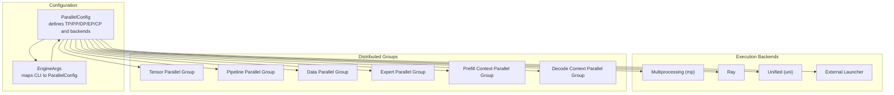
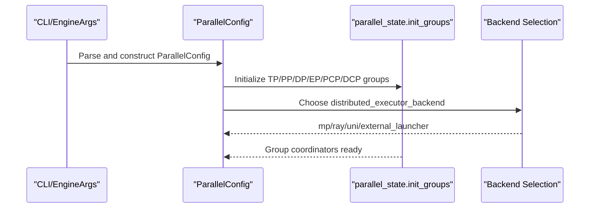
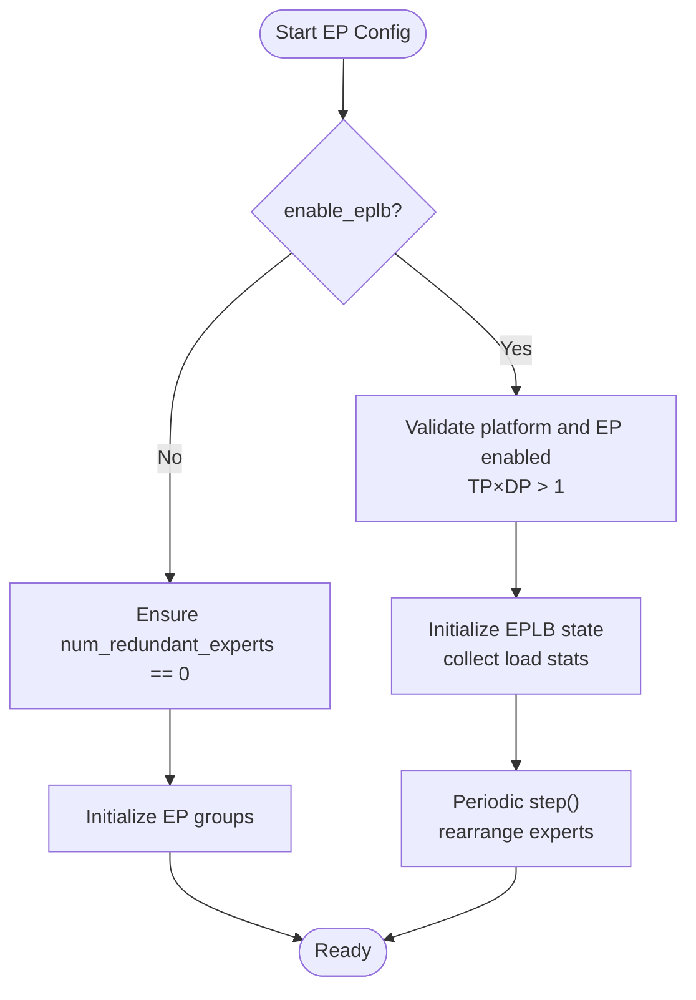
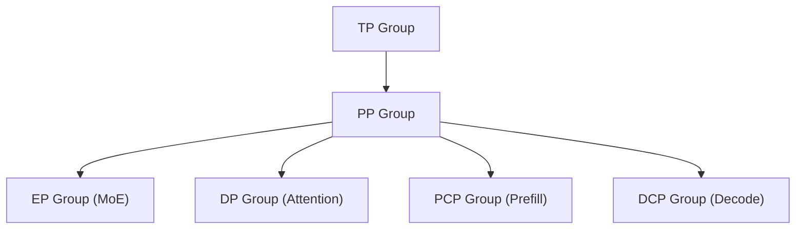
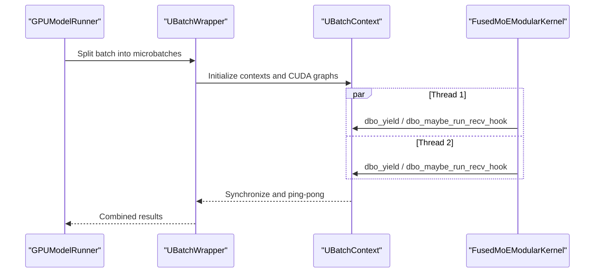
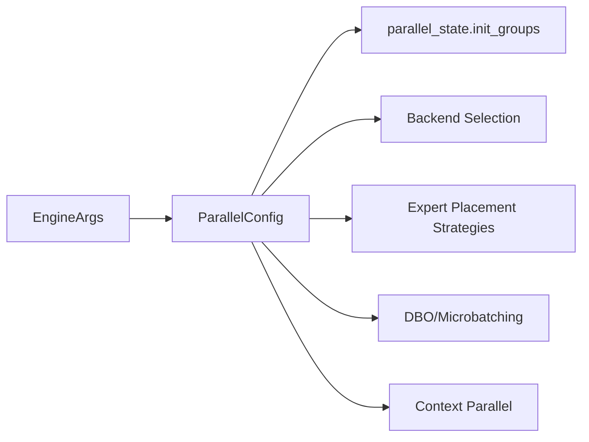

# Parallel Processing Configuration

<cite>
**Referenced Files in This Document**
- [parallel.py](file://vllm/config/parallel.py)
- [parallel_state.py](file://vllm/distributed/parallel_state.py)
- [arg_utils.py](file://vllm/engine/arg_utils.py)
- [layer.py](file://vllm/model_executor/layers/fused_moe/layer.py)
- [fused_moe.py](file://vllm/model_executor/layers/fused_moe/fused_moe.py)
- [eplb_state.py](file://vllm/distributed/eplb/eplb_state.py)
- [dbo.md](file://docs/design/dbo.md)
- [parallelism_scaling.md](file://docs/serving/parallelism_scaling.md)
- [data_parallel_deployment.md](file://docs/serving/data_parallel_deployment.md)
- [context_parallel_deployment.md](file://docs/serving/context_parallel_deployment.md)
- [expert_parallel_deployment.md](file://docs/serving/expert_parallel_deployment.md)
- [multiproc_executor.py](file://vllm/v1/executor/multiproc_executor.py)
- [ubatching.py](file://vllm/v1/worker/ubatching.py)
- [vllm.py](file://vllm/config/vllm.py)
- [xpu.py](file://vllm/platforms/xpu.py)
</cite>

## Table of Contents
1. [Introduction](#introduction)
2. [Project Structure](#project-structure)
3. [Core Components](#core-components)
4. [Architecture Overview](#architecture-overview)
5. [Detailed Component Analysis](#detailed-component-analysis)
6. [Dependency Analysis](#dependency-analysis)
7. [Performance Considerations](#performance-considerations)
8. [Troubleshooting Guide](#troubleshooting-guide)
9. [Conclusion](#conclusion)
10. [Appendices](#appendices)

## Introduction
This document explains how to configure parallel processing in vLLM across tensor parallelism, data parallelism, expert parallelism (including EPLB), pipeline parallelism, and context parallelism. It covers backend selection for expert communication, dual batch overlap (DBO), and microbatching parameters. Practical examples are included for different model sizes and hardware configurations.

## Project Structure
The parallel processing configuration is centered around a configuration model that defines all parallel dimensions and backends, and orchestrates distributed groups and execution backends. Supporting documentation explains deployment strategies and operational guidance.

**Diagram sources**
- [parallel.py](file://vllm/config/parallel.py#L81-L200)
- [arg_utils.py](file://vllm/engine/arg_utils.py#L1558-L1582)
- [parallel_state.py](file://vllm/distributed/parallel_state.py#L1382-L1416)

**Section sources**
- [parallel.py](file://vllm/config/parallel.py#L81-L200)
- [parallel_state.py](file://vllm/distributed/parallel_state.py#L1382-L1416)
- [arg_utils.py](file://vllm/engine/arg_utils.py#L1558-L1582)

## Core Components
- ParallelConfig: Central configuration for tensor_parallel_size, pipeline_parallel_size, prefill_context_parallel_size, data_parallel_size, data_parallel_rank, enable_expert_parallel, expert_placement_strategy, all2all_backend, enable_dbo, ubatch_size, thresholds, enable_eplb, and EPLBConfig.
- DistributedExecutorBackends: mp, ray, uni, external_launcher.
- All2AllBackend options: naive, pplx, deepep_high_throughput, deepep_low_latency, allgather_reducescatter, flashinfer_all2allv.
- Context Parallel: decode_context_parallel_size and cp_kv_cache_interleave_size.
- DBO: enable_dbo, ubatch_size, dbo_decode_token_threshold, dbo_prefill_token_threshold.

Key behaviors:
- World size is TP × PP × prefill context parallel size.
- Data parallel adds DP factor to world size across DP.
- Expert parallelism toggles EP group formation and EP layer behavior.
- EPLB validates platform support and requires EP enabled with TP×DP > 1.
- DBO requires DeepEP backends and disables cascade attention.

**Section sources**
- [parallel.py](file://vllm/config/parallel.py#L81-L200)
- [parallel.py](file://vllm/config/parallel.py#L297-L330)
- [parallel.py](file://vllm/config/parallel.py#L556-L619)
- [vllm.py](file://vllm/config/vllm.py#L873-L891)

## Architecture Overview
The configuration drives initialization of model-parallel groups and selects the distributed executor backend.

**Diagram sources**
- [arg_utils.py](file://vllm/engine/arg_utils.py#L1558-L1582)
- [parallel_state.py](file://vllm/distributed/parallel_state.py#L1382-L1416)
- [parallel.py](file://vllm/config/parallel.py#L556-L619)

## Detailed Component Analysis

### Tensor Parallelism
- tensor_parallel_size controls intra-layer tensor sharding across GPUs.
- World size is computed as TP × PP × prefill context parallel size.
- Pipeline parallel size partitions the model across devices for latency hiding.
- Prefill and decode context parallel sizes control chunking for long context.

Practical guidance:
- Single-node: set tensor_parallel_size to GPUs per node.
- Multi-node: combine tensor_parallel_size with pipeline_parallel_size to span nodes.
- For uneven splits or non-NVLink GPUs, prefer pipeline parallelism.

**Section sources**
- [parallel.py](file://vllm/config/parallel.py#L508-L514)
- [parallelism_scaling.md](file://docs/serving/parallelism_scaling.md#L1-L221)
- [multiproc_executor.py](file://vllm/v1/executor/multiproc_executor.py#L107-L125)

### Data Parallelism
- data_parallel_size replicates model weights across ranks for independent batch processing.
- data_parallel_rank, data_parallel_backend ("mp" or "ray"), and external/hybrid LB modes enable flexible deployment.
- Expert layers form a group sized DP × TP by default; EP can replace TP for expert layers.

Deployment modes:
- Internal LB: single API endpoint with built-in balancing.
- Hybrid LB: per-node API servers with upstream load balancing.
- External LB: per-rank endpoints orchestrated externally.

**Section sources**
- [parallel.py](file://vllm/config/parallel.py#L92-L110)
- [data_parallel_deployment.md](file://docs/serving/data_parallel_deployment.md#L1-L134)

### Expert Parallelism (EP) and EPLB
- enable_expert_parallel switches MoE layers to EP instead of tensor-parallel MoE.
- Expert placement strategies:
  - linear: contiguous expert assignment.
  - round_robin: interleaved assignment across ranks.
- EPLB (Expert Parallel Load Balancer):
  - Requires CUDA-like platform and EP enabled.
  - Validates TP×DP > 1 when enabled.
  - Supports redundant experts and async rearrangement.
  - Tracks load windows and step intervals for rebalancing.

**Diagram sources**
- [parallel.py](file://vllm/config/parallel.py#L297-L330)
- [eplb_state.py](file://vllm/distributed/eplb/eplb_state.py#L493-L615)

**Section sources**
- [parallel.py](file://vllm/config/parallel.py#L122-L137)
- [layer.py](file://vllm/model_executor/layers/fused_moe/layer.py#L145-L166)
- [expert_parallel_deployment.md](file://docs/serving/expert_parallel_deployment.md#L1-L120)
- [eplb_state.py](file://vllm/distributed/eplb/eplb_state.py#L493-L615)

### Pipeline Parallelism and Context Parallelism
- pipeline_parallel_size partitions layers across ranks.
- prefill_context_parallel_size and decode_context_parallel_size control chunking for long context.
- decode context parallel uses interleaving strategy for KV cache across tokens.

**Diagram sources**
- [parallel_state.py](file://vllm/distributed/parallel_state.py#L1382-L1416)
- [parallel_state.py](file://vllm/distributed/parallel_state.py#L1353-L1380)

**Section sources**
- [parallel_state.py](file://vllm/distributed/parallel_state.py#L1353-L1380)
- [context_parallel_deployment.md](file://docs/serving/context_parallel_deployment.md#L1-L48)

### All2All Backend Selection for Expert Communication
- all2all_backend choices:
  - naive, allgather_reducescatter, pplx, deepep_high_throughput, deepep_low_latency, flashinfer_all2allv.
- DBO requires DeepEP backends (deepep_low_latency or deepep_high_throughput).

**Section sources**
- [parallel.py](file://vllm/config/parallel.py#L137-L146)
- [dbo.md](file://docs/design/dbo.md#L1-L89)
- [vllm.py](file://vllm/config/vllm.py#L873-L891)

### Dual Batch Overlap (DBO) and Microbatching
- enable_dbo enables overlapping MoE all-to-all with compute using two UBatch threads.
- ubatch_size sets microbatch count; thresholds control when microbatching is applied for decode/prefill.
- DBO requires DeepEP backends and disables cascade attention.

**Diagram sources**
- [dbo.md](file://docs/design/dbo.md#L1-L89)
- [ubatching.py](file://vllm/v1/worker/ubatching.py#L129-L168)
- [vllm.py](file://vllm/config/vllm.py#L873-L891)

**Section sources**
- [dbo.md](file://docs/design/dbo.md#L1-L89)
- [ubatching.py](file://vllm/v1/worker/ubatching.py#L129-L168)
- [vllm.py](file://vllm/config/vllm.py#L873-L891)

### Distributed Executor Backend Selection
- Defaults:
  - TPU with SPMD: uni.
  - Multi-node with CUDA: mp.
  - Single-node CUDA with insufficient GPUs for world_size: ray.
  - XPU: falls back to ray and enforces spawn method.
- Explicit overrides:
  - data_parallel_backend can force ray for DP.
  - external_launcher disables multiprocessing and sets DP rank from environment.

**Section sources**
- [parallel.py](file://vllm/config/parallel.py#L556-L619)
- [xpu.py](file://vllm/platforms/xpu.py#L169-L193)

## Dependency Analysis

**Diagram sources**
- [parallel.py](file://vllm/config/parallel.py#L81-L200)
- [parallel_state.py](file://vllm/distributed/parallel_state.py#L1382-L1416)
- [layer.py](file://vllm/model_executor/layers/fused_moe/layer.py#L145-L166)
- [dbo.md](file://docs/design/dbo.md#L1-L89)

**Section sources**
- [parallel.py](file://vllm/config/parallel.py#L81-L200)
- [parallel_state.py](file://vllm/distributed/parallel_state.py#L1382-L1416)
- [layer.py](file://vllm/model_executor/layers/fused_moe/layer.py#L145-L166)
- [dbo.md](file://docs/design/dbo.md#L1-L89)

## Performance Considerations
- Prefer pipeline parallelism for uneven splits or non-NVLink GPUs.
- Use decode context parallel (DCP) to reduce KV cache duplication; interleaving strategy helps maintain locality.
- For EP+DP deployments, DBO improves overlap with DeepEP backends; ensure thresholds and backends match workload.
- EPLB can improve balancedness with redundant experts; monitor memory overhead.

[No sources needed since this section provides general guidance]

## Troubleshooting Guide
- EPLB validation errors: ensure enable_expert_parallel is True and TP×DP > 1 when enable_eplb is set.
- DBO backend requirement: use deepep_low_latency or deepep_high_throughput with DeepEP kernels.
- Backend selection pitfalls:
  - Multi-node CUDA requires mp or ray; insufficient local GPUs trigger explicit errors.
  - XPU requires ray and spawn method; warns otherwise.
- Context parallel constraints: DCP size must not exceed TP size; interleaving reduces duplication but increases communication.

**Section sources**
- [parallel.py](file://vllm/config/parallel.py#L297-L330)
- [vllm.py](file://vllm/config/vllm.py#L873-L891)
- [parallel.py](file://vllm/config/parallel.py#L556-L619)
- [xpu.py](file://vllm/platforms/xpu.py#L169-L193)
- [context_parallel_deployment.md](file://docs/serving/context_parallel_deployment.md#L1-L48)

## Conclusion
vLLM’s parallel configuration centers on ParallelConfig, which defines tensor, pipeline, data, expert, and context parallel dimensions, plus backends and DBO/microbatching. Correctly sizing TP/PP/DP and selecting appropriate backends yields strong scaling and performance. EP+EPLB improves load balancing for MoE models, while DBO enhances overlap for EP+DP. Context parallelism mitigates long-context memory and latency trade-offs.

[No sources needed since this section summarizes without analyzing specific files]

## Appendices

### Practical Examples

- Small dense model on a single node:
  - Use tensor_parallel_size equal to GPUs per node.
  - Keep pipeline_parallel_size = 1.
  - Reference: [parallelism_scaling.md](file://docs/serving/parallelism_scaling.md#L1-L221)

- Multi-node dense serving:
  - Set tensor_parallel_size to GPUs per node and pipeline_parallel_size to number of nodes.
  - Use ray backend for multi-node orchestration.
  - Reference: [parallelism_scaling.md](file://docs/serving/parallelism_scaling.md#L116-L132)

- MoE model with EP (single node):
  - Enable expert_parallel and choose all2all-backend among pplx, allgather_reducescatter, or DeepEP variants.
  - Reference: [expert_parallel_deployment.md](file://docs/serving/expert_parallel_deployment.md#L1-L120)

- MoE model with EP + DP (multi-node):
  - Use data_parallel_size and enable_expert_parallel; choose deepep_low_latency for decode-heavy workloads.
  - Reference: [expert_parallel_deployment.md](file://docs/serving/expert_parallel_deployment.md#L121-L206)

- EP + DBO (EP+DP):
  - Enable DBO and set thresholds; use deepep_low_latency or deepep_high_throughput.
  - Reference: [dbo.md](file://docs/design/dbo.md#L1-L89), [vllm.py](file://vllm/config/vllm.py#L873-L891)

- Long context decode:
  - Increase tensor_parallel_size, then add decode_context_parallel_size to reduce KV duplication.
  - Reference: [context_parallel_deployment.md](file://docs/serving/context_parallel_deployment.md#L1-L48)