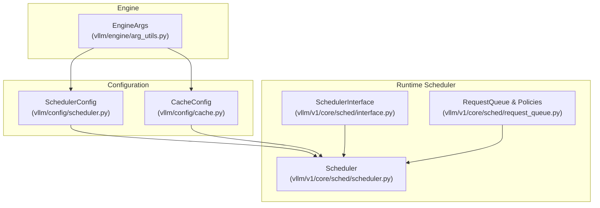
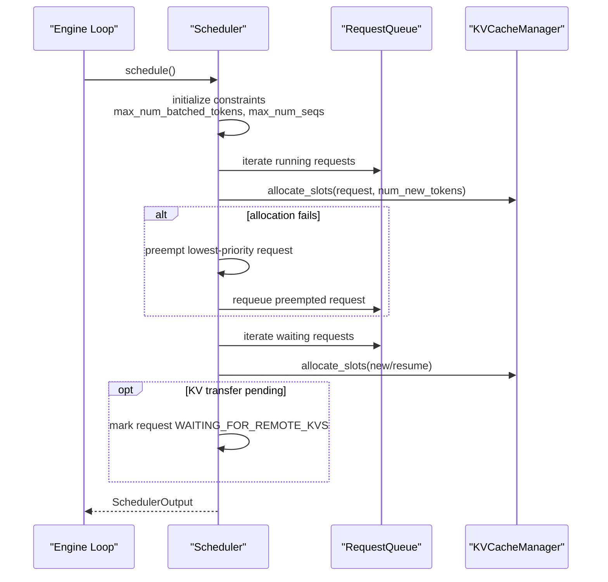
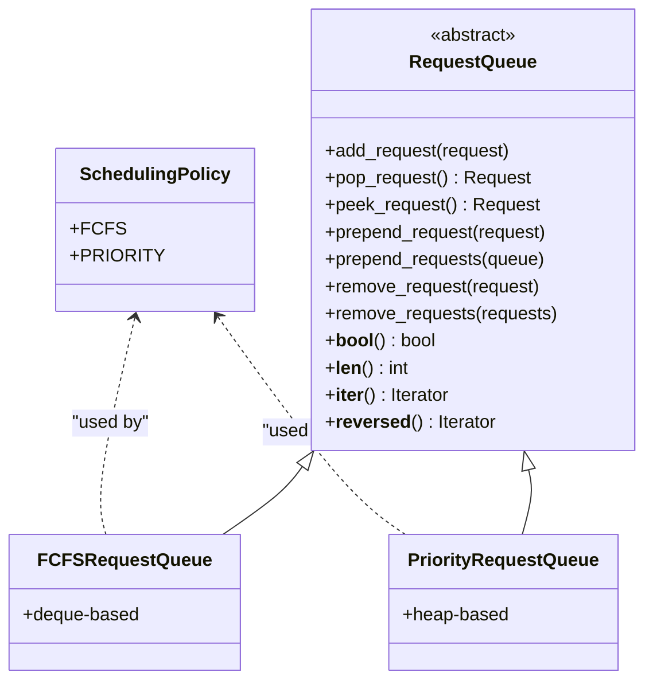
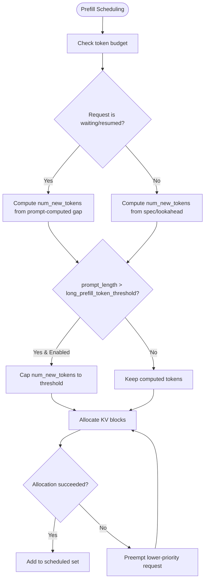
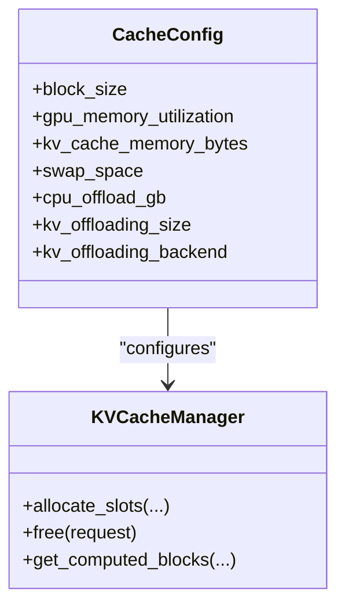
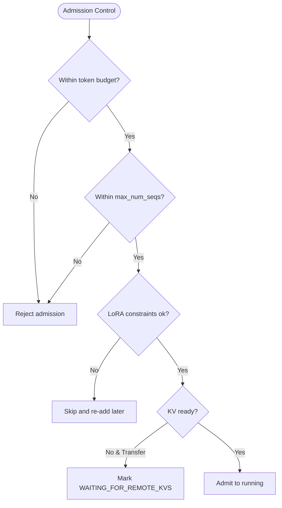
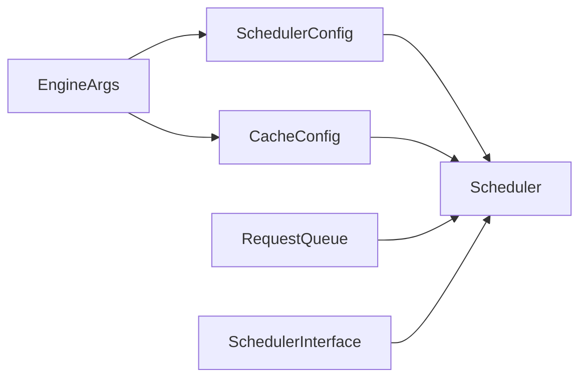

# Scheduler Configuration

<cite>
**Referenced Files in This Document**
- [scheduler.py](file://vllm/config/scheduler.py)
- [arg_utils.py](file://vllm/engine/arg_utils.py)
- [cache.py](file://vllm/config/cache.py)
- [scheduler.py](file://vllm/v1/core/sched/scheduler.py)
- [request_queue.py](file://vllm/v1/core/sched/request_queue.py)
- [interface.py](file://vllm/v1/core/sched/interface.py)
</cite>

## Table of Contents
1. [Introduction](#introduction)
2. [Project Structure](#project-structure)
3. [Core Components](#core-components)
4. [Architecture Overview](#architecture-overview)
5. [Detailed Component Analysis](#detailed-component-analysis)
6. [Dependency Analysis](#dependency-analysis)
7. [Performance Considerations](#performance-considerations)
8. [Troubleshooting Guide](#troubleshooting-guide)
9. [Conclusion](#conclusion)
10. [Appendices](#appendices)

## Introduction
This document explains scheduler configuration options in vLLM with a focus on request batching, scheduling policies, prefill and decode strategies, memory management for KV cache, and admission/backpressure handling. It synthesizes configuration fields, runtime behavior, and tuning guidance for single-user and high-throughput serving environments.

## Project Structure
The scheduler configuration spans three primary areas:
- Configuration dataclasses that define scheduler and cache parameters
- Engine argument parsing that exposes CLI flags for scheduler tuning
- Scheduler implementation that enforces constraints and schedules requests

**Diagram sources**
- [scheduler.py](file://vllm/config/scheduler.py#L1-L300)
- [cache.py](file://vllm/config/cache.py#L1-L233)
- [arg_utils.py](file://vllm/engine/arg_utils.py#L354-L700)
- [interface.py](file://vllm/v1/core/sched/interface.py#L1-L190)
- [scheduler.py](file://vllm/v1/core/sched/scheduler.py#L60-L220)
- [request_queue.py](file://vllm/v1/core/sched/request_queue.py#L1-L218)

**Section sources**
- [scheduler.py](file://vllm/config/scheduler.py#L1-L300)
- [cache.py](file://vllm/config/cache.py#L1-L233)
- [arg_utils.py](file://vllm/engine/arg_utils.py#L354-L700)
- [interface.py](file://vllm/v1/core/sched/interface.py#L1-L190)
- [scheduler.py](file://vllm/v1/core/sched/scheduler.py#L60-L220)
- [request_queue.py](file://vllm/v1/core/sched/request_queue.py#L1-L218)

## Core Components
- SchedulerConfig: Defines request batching and scheduling behavior, including max_num_batched_tokens, max_num_seqs, chunked prefill, long-prompt thresholds, scheduling policy, async scheduling, and streaming interval.
- CacheConfig: Controls KV cache memory sizing, block size, prefix caching, and offloading/backpressure-related parameters.
- EngineArgs: Exposes CLI flags to set scheduler and cache parameters at runtime.
- Scheduler (runtime): Enforces constraints, selects policies, allocates KV cache slots, handles preemption, and constructs SchedulerOutput.

Key configuration fields and their roles:
- max_num_batched_tokens: Maximum tokens processed per scheduling iteration.
- max_num_seqs: Maximum concurrent running requests.
- enable_chunked_prefill, max_num_partial_prefills, max_long_partial_prefills, long_prefill_token_threshold: Control prefill chunking and prioritization of short vs long prompts.
- policy: Scheduling policy ("fcfs" or "priority").
- async_scheduling: Enables asynchronous scheduling to reduce idle GPU time.
- stream_interval: Controls streaming granularity for throughput vs smoothness trade-off.
- block_size: KV cache block size (tokens per block).
- kv_cache_memory_bytes / gpu_memory_utilization: KV cache memory sizing and allocation strategy.
- swap_space / cpu_offload_gb: Backpressure and memory pool sizing for CPU-backed KV cache.

**Section sources**
- [scheduler.py](file://vllm/config/scheduler.py#L44-L178)
- [cache.py](file://vllm/config/cache.py#L42-L162)
- [arg_utils.py](file://vllm/engine/arg_utils.py#L430-L570)
- [scheduler.py](file://vllm/v1/core/sched/scheduler.py#L97-L120)

## Architecture Overview
The scheduler operates as an iterative loop:
- It reads constraints from SchedulerConfig and CacheConfig
- Applies the chosen scheduling policy (FCFS or Priority)
- Allocates KV cache blocks for running and waiting requests
- Handles preemption when memory is insufficient
- Builds SchedulerOutput with scheduled requests and metadata

**Diagram sources**
- [scheduler.py](file://vllm/v1/core/sched/scheduler.py#L227-L763)
- [request_queue.py](file://vllm/v1/core/sched/request_queue.py#L136-L218)
- [interface.py](file://vllm/v1/core/sched/interface.py#L35-L86)

**Section sources**
- [scheduler.py](file://vllm/v1/core/sched/scheduler.py#L227-L763)
- [request_queue.py](file://vllm/v1/core/sched/request_queue.py#L136-L218)
- [interface.py](file://vllm/v1/core/sched/interface.py#L35-L86)

## Detailed Component Analysis

### Request Batching Parameters
- max_num_batched_tokens: Upper bound on tokens scheduled per iteration. The runtime enforces that total scheduled tokens do not exceed this cap.
- max_num_seqs: Upper bound on concurrent running requests. The runtime enforces that number of running requests does not exceed this cap.
- Validation rules:
  - max_num_batched_tokens must be ≥ max_num_seqs
  - If chunked prefill is disabled, max_num_batched_tokens must be ≥ max_model_len
  - If chunked prefill is enabled, long_prefill_token_threshold is auto-derived from max_model_len when needed

These constraints ensure coherent batching and prevent oversized batches that exceed model capacity.

**Section sources**
- [scheduler.py](file://vllm/config/scheduler.py#L248-L300)
- [scheduler.py](file://vllm/v1/core/sched/scheduler.py#L97-L120)

### Scheduling Policies
- Policy selection:
  - fcfs: FIFO queue semantics
  - priority: Heap-based queue ordered by (priority, arrival_time)
- Policy enforcement:
  - Running requests are considered in order; if a request cannot be scheduled due to budget or KV allocation, the scheduler attempts to preempt a lower-priority request (or the last running request under FCFS).
  - Waiting requests are admitted up to max_num_seqs and token budget.

**Diagram sources**
- [request_queue.py](file://vllm/v1/core/sched/request_queue.py#L1-L218)

**Section sources**
- [request_queue.py](file://vllm/v1/core/sched/request_queue.py#L136-L218)
- [scheduler.py](file://vllm/v1/core/sched/scheduler.py#L145-L167)

### Prefill Scheduling Strategies
- Chunked prefill:
  - enable_chunked_prefill: Allows prefill to be split across iterations based on remaining token budget.
  - max_num_partial_prefills: Number of concurrently partially prefilled requests.
  - max_long_partial_prefills: Limit for long prompts (> long_prefill_token_threshold).
  - long_prefill_token_threshold: Threshold to classify long prompts; short prompts can jump ahead when configured.
- Behavior:
  - For running requests, num_new_tokens is capped by long_prefill_token_threshold when applicable.
  - For waiting/resumed requests, num_new_tokens is similarly capped when chunked prefill is enabled.

**Diagram sources**
- [scheduler.py](file://vllm/v1/core/sched/scheduler.py#L277-L388)
- [scheduler.py](file://vllm/v1/core/sched/scheduler.py#L533-L601)

**Section sources**
- [scheduler.py](file://vllm/v1/core/sched/scheduler.py#L277-L388)
- [scheduler.py](file://vllm/v1/core/sched/scheduler.py#L533-L601)
- [scheduler.py](file://vllm/config/scheduler.py#L78-L117)

### Decode Scheduling Optimizations
- Async scheduling:
  - async_scheduling: When enabled, avoids scheduling an extra step when the previous step already reached the request’s termination condition, reducing idle time.
- Speculative decoding:
  - The scheduler accounts for lookahead tokens and trims speculative token lists accordingly during scheduling.
- Streaming:
  - stream_interval controls how frequently outputs are emitted; smaller values improve smoothness, larger values reduce host overhead and can increase throughput.

**Section sources**
- [scheduler.py](file://vllm/v1/core/sched/scheduler.py#L271-L276)
- [scheduler.py](file://vllm/v1/core/sched/scheduler.py#L390-L406)
- [scheduler.py](file://vllm/config/scheduler.py#L133-L145)

### Priority Handling Mechanisms
- Priority queue orders by (priority, arrival_time).
- Preemption logic under PRIORITY selects the lowest-priority request for eviction; under FCFS, the last running request is preempted.
- Encoder inputs and external KV loads are coordinated to respect budgets and states.

**Section sources**
- [request_queue.py](file://vllm/v1/core/sched/request_queue.py#L136-L208)
- [scheduler.py](file://vllm/v1/core/sched/scheduler.py#L341-L377)

### Memory Management Settings (KV Cache)
- KV cache allocation:
  - KVCacheManager allocates slots per request based on num_new_tokens and lookahead tokens.
  - When allocation fails, the scheduler preemptively evicts a request and retries.
- Block size configuration:
  - block_size defines tokens per KV cache block; platform-specific defaults are applied when not specified.
- Memory sizing:
  - kv_cache_memory_bytes: Explicit KV cache size per GPU (bytes); overrides gpu_memory_utilization when set.
  - gpu_memory_utilization: Fraction of GPU memory used for model executor (per instance).
  - swap_space: CPU swap space per GPU (GiB) for backpressure.
  - cpu_offload_gb: Virtual GPU memory expansion via CPU offloading.
  - kv_offloading_size and kv_offloading_backend: Enable CPU offloading for KV cache when TP > 1.

**Diagram sources**
- [cache.py](file://vllm/config/cache.py#L42-L162)
- [scheduler.py](file://vllm/v1/core/sched/scheduler.py#L208-L219)

**Section sources**
- [cache.py](file://vllm/config/cache.py#L42-L162)
- [scheduler.py](file://vllm/v1/core/sched/scheduler.py#L208-L219)

### Request Queuing Strategies and Admission Control
- Admission control:
  - Waiting requests are admitted only if:
    - They fit within token budget (max_num_batched_tokens)
    - They do not exceed max_num_seqs
    - LoRA constraints are respected (if enabled)
    - KV transfer readiness is satisfied (if enabled)
- Backpressure handling:
  - When KV allocation fails, the scheduler preemptively evicts a request.
  - KV transfer can mark requests as WAITING_FOR_REMOTE_KVS and defer scheduling until remote KV is ready.
  - CPU offload and swap space provide overflow capacity to absorb bursts.

**Diagram sources**
- [scheduler.py](file://vllm/v1/core/sched/scheduler.py#L436-L667)

**Section sources**
- [scheduler.py](file://vllm/v1/core/sched/scheduler.py#L436-L667)

## Dependency Analysis
- SchedulerConfig drives runtime scheduling behavior and is resolved into the Scheduler class.
- EngineArgs exposes CLI flags that populate SchedulerConfig and CacheConfig defaults.
- Scheduler depends on:
  - SchedulerConfig for constraints
  - CacheConfig for KV cache sizing and block size
  - RequestQueue for policy-aware queuing
  - KVCacheManager for slot allocation and freeing

**Diagram sources**
- [arg_utils.py](file://vllm/engine/arg_utils.py#L354-L700)
- [scheduler.py](file://vllm/config/scheduler.py#L1-L178)
- [cache.py](file://vllm/config/cache.py#L1-L162)
- [interface.py](file://vllm/v1/core/sched/interface.py#L1-L190)
- [scheduler.py](file://vllm/v1/core/sched/scheduler.py#L60-L120)
- [request_queue.py](file://vllm/v1/core/sched/request_queue.py#L1-L218)

**Section sources**
- [arg_utils.py](file://vllm/engine/arg_utils.py#L354-L700)
- [scheduler.py](file://vllm/config/scheduler.py#L1-L178)
- [cache.py](file://vllm/config/cache.py#L1-L162)
- [interface.py](file://vllm/v1/core/sched/interface.py#L1-L190)
- [scheduler.py](file://vllm/v1/core/sched/scheduler.py#L60-L120)
- [request_queue.py](file://vllm/v1/core/sched/request_queue.py#L1-L218)

## Performance Considerations
- Latency vs throughput trade-offs:
  - Larger max_num_batched_tokens improves throughput but risks longer stalls if allocation fails; tune with async_scheduling to mitigate.
  - Smaller stream_interval improves perceived latency but increases host overhead; larger intervals reduce overhead.
  - Chunked prefill with appropriate long_prefill_token_threshold prioritizes short prompts to reduce tail latency.
- Resource allocation:
  - Prefer kv_cache_memory_bytes for deterministic sizing; otherwise, gpu_memory_utilization sets per-instance budget.
  - Use swap_space and cpu_offload_gb to absorb bursty workloads; monitor CPU memory usage to avoid saturation.
- Concurrency:
  - Increase max_num_seqs cautiously; ensure max_num_batched_tokens ≥ max_num_seqs and sufficient KV cache to avoid frequent preemptions.

[No sources needed since this section provides general guidance]

## Troubleshooting Guide
- Allocation failures and preemption:
  - Symptoms: Requests repeatedly move from running to preempted.
  - Actions: Reduce max_num_seqs or increase KV cache memory; adjust chunked prefill thresholds; enable async_scheduling.
- Too many waiting requests:
  - Symptoms: Long waiting queue.
  - Actions: Increase max_num_batched_tokens or max_num_seqs; review LoRA constraints; ensure KV transfer readiness.
- Excessive CPU offload overhead:
  - Symptoms: High CPU usage and latency spikes.
  - Actions: Reduce cpu_offload_gb or swap_space; increase GPU memory utilization; avoid excessive offloading for small models.

**Section sources**
- [scheduler.py](file://vllm/v1/core/sched/scheduler.py#L341-L377)
- [cache.py](file://vllm/config/cache.py#L142-L162)

## Conclusion
vLLM’s scheduler configuration centers on request batching, scheduling policy, and KV cache memory management. Properly tuning max_num_batched_tokens, max_num_seqs, chunked prefill thresholds, and KV cache sizing yields predictable latency and throughput across workloads. Async scheduling and streaming interval provide additional knobs to balance smoothness and throughput. For robust deployments, combine explicit KV cache sizing with CPU offload/backpressure controls and careful admission control.

[No sources needed since this section summarizes without analyzing specific files]

## Appendices

### Configuration Examples by Deployment Scenario
- Single-user interactive latency:
  - Use small max_num_batched_tokens and max_num_seqs
  - Enable async_scheduling
  - Set stream_interval to 1 for smooth streaming
  - Keep chunked prefill disabled or conservative thresholds
- Balanced latency/throughput:
  - Moderate max_num_batched_tokens and max_num_seqs
  - Enable chunked prefill with long_prefill_token_threshold set to a small fraction of max_model_len
  - Use priority policy for urgent requests
- High-throughput serving:
  - Maximize max_num_batched_tokens and max_num_seqs within memory limits
  - Enable chunked prefill aggressively
  - Increase stream_interval to reduce host overhead
  - Use kv_cache_memory_bytes for deterministic sizing; enable CPU offload/backpressure as needed

[No sources needed since this section provides general guidance]