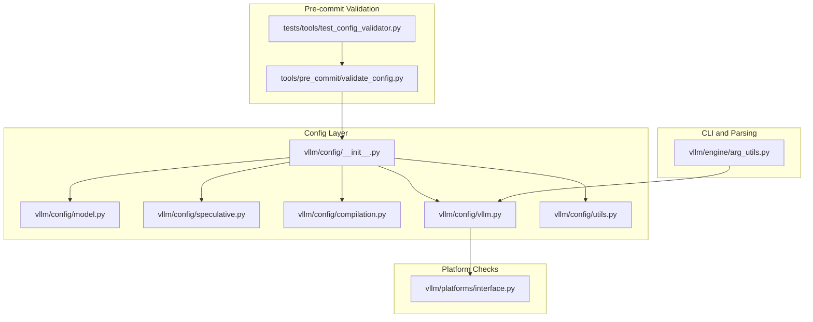
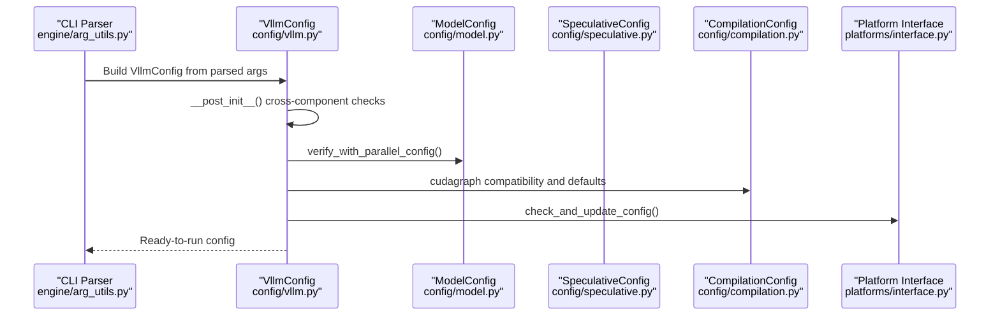
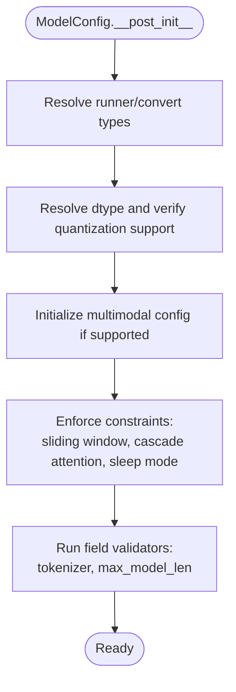
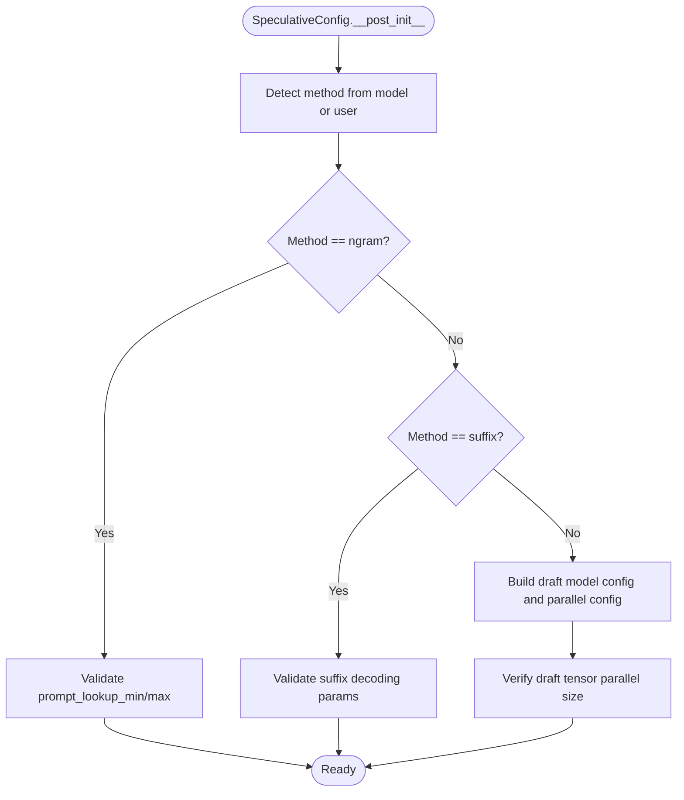
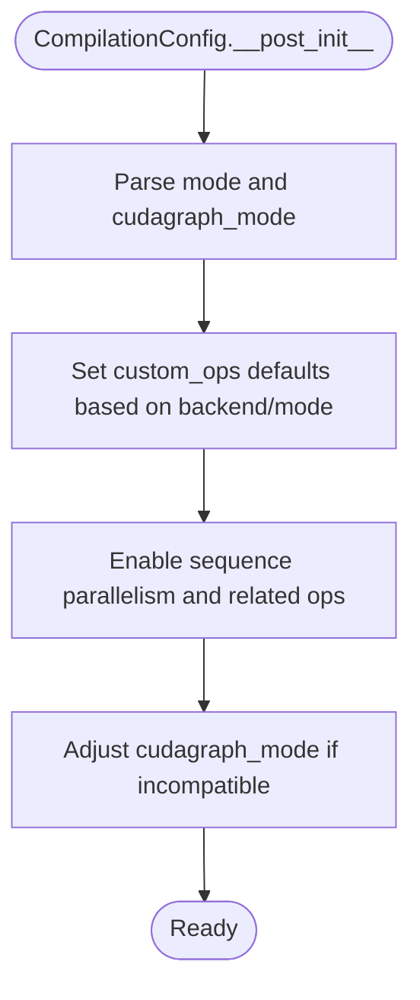
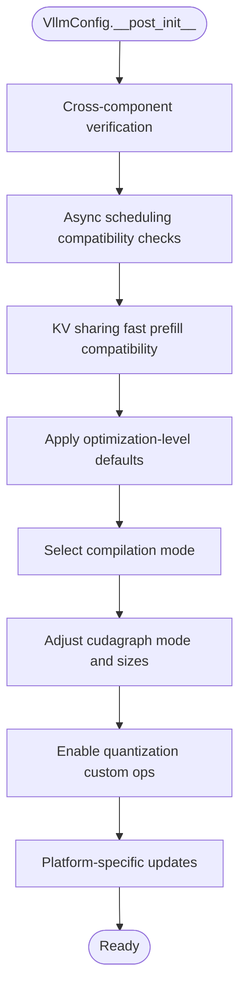
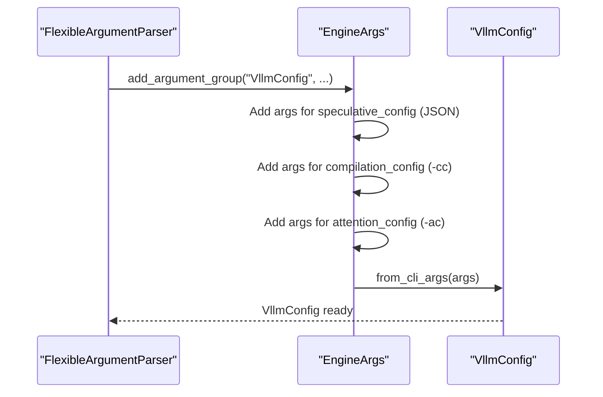
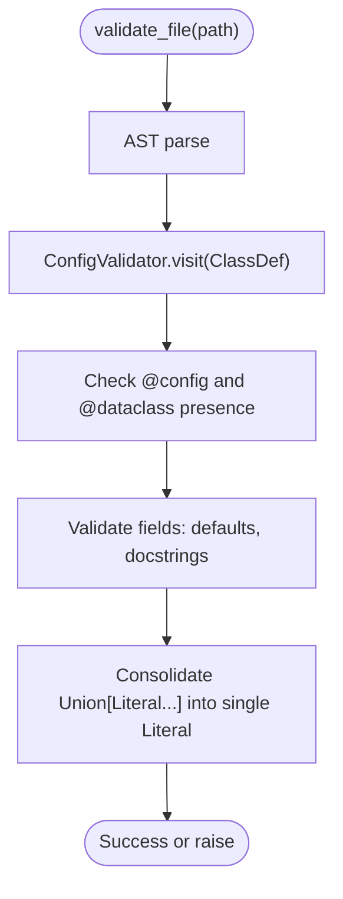
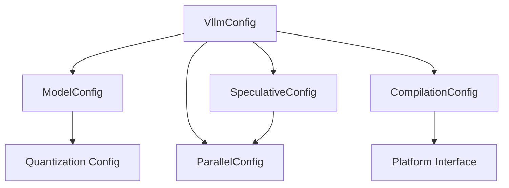

# Configuration Validation Rules

<cite>
**Referenced Files in This Document**
- [vllm/config/__init__.py](file://vllm/config/__init__.py)
- [vllm/config/model.py](file://vllm/config/model.py)
- [vllm/config/speculative.py](file://vllm/config/speculative.py)
- [vllm/config/compilation.py](file://vllm/config/compilation.py)
- [vllm/config/vllm.py](file://vllm/config/vllm.py)
- [vllm/config/utils.py](file://vllm/config/utils.py)
- [vllm/engine/arg_utils.py](file://vllm/engine/arg_utils.py)
- [vllm/platforms/interface.py](file://vllm/platforms/interface.py)
- [tools/pre_commit/validate_config.py](file://tools/pre_commit/validate_config.py)
- [tests/tools/test_config_validator.py](file://tests/tools/test_config_validator.py)
- [tests/engine/test_arg_utils.py](file://tests/engine/test_arg_utils.py)
</cite>

## Table of Contents
1. [Introduction](#introduction)
2. [Project Structure](#project-structure)
3. [Core Components](#core-components)
4. [Architecture Overview](#architecture-overview)
5. [Detailed Component Analysis](#detailed-component-analysis)
6. [Dependency Analysis](#dependency-analysis)
7. [Performance Considerations](#performance-considerations)
8. [Troubleshooting Guide](#troubleshooting-guide)
9. [Conclusion](#conclusion)

## Introduction
This document explains vLLM’s configuration validation and consistency checking system. It covers:
- Parameter validation rules enforced by Pydantic validators and model validators
- Constraint checking across components (quantization, speculative decoding, cudagraph compatibility, hardware capability verification)
- Automatic configuration adjustments during initialization (optimization level defaults, cudagraph compatibility checks, hardware capability verification)
- Cross-component validation (model-parallel compatibility, quantization hardware requirements, speculative decoding constraints)
- Troubleshooting guidance for common configuration errors and validation failures
- Examples of invalid configurations and resolution strategies

## Project Structure
The configuration system is organized into modular config classes under vllm/config, with a central VllmConfig orchestrating validation and defaults. CLI parsing and argument handling live in engine/arg_utils.py. Platform-specific checks are delegated to platform interfaces.

**Diagram sources**
- [vllm/config/__init__.py](file://vllm/config/__init__.py#L1-L109)
- [vllm/config/model.py](file://vllm/config/model.py#L96-L120)
- [vllm/config/speculative.py](file://vllm/config/speculative.py#L52-L70)
- [vllm/config/compilation.py](file://vllm/config/compilation.py#L98-L120)
- [vllm/config/vllm.py](file://vllm/config/vllm.py#L174-L240)
- [vllm/config/utils.py](file://vllm/config/utils.py#L35-L49)
- [vllm/engine/arg_utils.py](file://vllm/engine/arg_utils.py#L111-L176)
- [vllm/platforms/interface.py](file://vllm/platforms/interface.py#L398-L436)
- [tools/pre_commit/validate_config.py](file://tools/pre_commit/validate_config.py#L53-L77)
- [tests/tools/test_config_validator.py](file://tests/tools/test_config_validator.py#L1-L52)

**Section sources**
- [vllm/config/__init__.py](file://vllm/config/__init__.py#L1-L109)
- [vllm/engine/arg_utils.py](file://vllm/engine/arg_utils.py#L111-L176)

## Core Components
- ModelConfig: Validates and normalizes model parameters, enforces dtype and runner compatibility, and performs multimodal and quantization-related checks.
- SpeculativeConfig: Validates speculative decoding parameters, detects method automatically, enforces draft model compatibility, and validates constraints for specific methods (e.g., Eagle, suffix decoding).
- CompilationConfig: Defines compilation modes, cudagraph modes, and pass configurations; includes field validators and post-initialization adjustments.
- VllmConfig: Central coordinator that verifies cross-component consistency, applies optimization-level defaults, enforces cudagraph compatibility, and performs platform-specific checks.
- Config utilities: Provide decorators and helpers for validation, hashing, and normalization.
- CLI argument parsing: Adds CLI groups for VllmConfig fields and parses complex nested structures like CompilationConfig and SpeculativeConfig.

Key validation highlights:
- Pydantic validators and model validators enforce constraints (e.g., positive integers, enums, method-specific ranges).
- Post-init checks validate cross-component compatibility (e.g., speculative decoding with async scheduling, cudagraph compatibility).
- Automatic adjustments align settings to platform capabilities and defaults.

**Section sources**
- [vllm/config/model.py](file://vllm/config/model.py#L600-L635)
- [vllm/config/speculative.py](file://vllm/config/speculative.py#L594-L645)
- [vllm/config/compilation.py](file://vllm/config/compilation.py#L676-L736)
- [vllm/config/vllm.py](file://vllm/config/vllm.py#L513-L800)
- [vllm/config/utils.py](file://vllm/config/utils.py#L35-L49)

## Architecture Overview
The validation lifecycle:
1. CLI parsing constructs EngineArgs and converts to VllmConfig.
2. VllmConfig.__post_init__ triggers cross-component verification and automatic adjustments.
3. ModelConfig and SpeculativeConfig validators run during construction and post-init.
4. Platform interface checks finalize compatibility.

**Diagram sources**
- [vllm/engine/arg_utils.py](file://vllm/engine/arg_utils.py#L1125-L1175)
- [vllm/config/vllm.py](file://vllm/config/vllm.py#L513-L800)
- [vllm/platforms/interface.py](file://vllm/platforms/interface.py#L404-L415)

## Detailed Component Analysis

### ModelConfig Validation and Constraints
- Field-level validators:
  - Tokenizer mode normalization and quantization normalization.
  - max_model_len must be a positive integer; tokenizer must be a string.
- Post-init validations:
  - Runner type and convert type compatibility with model architecture.
  - Multimodal constraints (e.g., GGUF tokenizer requirement).
  - Sliding window and cascade attention toggles.
  - Sleep mode availability per platform.
- Hardware capability checks:
  - Quantization dtype and capability verification via platform interface.
- Automatic adjustments:
  - Resolving runner and convert types based on architecture defaults.
  - Applying multimodal config defaults and constraints.

**Diagram sources**
- [vllm/config/model.py](file://vllm/config/model.py#L494-L508)
- [vllm/config/model.py](file://vllm/config/model.py#L588-L596)
- [vllm/config/model.py](file://vllm/config/model.py#L600-L635)

**Section sources**
- [vllm/config/model.py](file://vllm/config/model.py#L494-L508)
- [vllm/config/model.py](file://vllm/config/model.py#L588-L596)
- [vllm/config/model.py](file://vllm/config/model.py#L600-L635)

### SpeculativeConfig Validation and Constraints
- Automatic method detection:
  - If model is provided without method, method inferred from draft model config (e.g., Eagle, Medusa, MLP Speculator, MTP variants).
- Method-specific constraints:
  - Ngram: requires prompt_lookup_min/max; validates ordering and defaults.
  - Suffix decoding: requires Arctic Inference; validates tree depth, cache size, and probability thresholds.
  - Eagle/MTP: enforces draft tensor parallel size compatibility; may enforce eager for specific model types.
- Cross-component checks:
  - Draft model config and parallel config verified against target model.
  - Batch-size threshold validation and disable flags.

**Diagram sources**
- [vllm/config/speculative.py](file://vllm/config/speculative.py#L235-L463)
- [vllm/config/speculative.py](file://vllm/config/speculative.py#L464-L499)
- [vllm/config/speculative.py](file://vllm/config/speculative.py#L538-L572)

**Section sources**
- [vllm/config/speculative.py](file://vllm/config/speculative.py#L235-L463)
- [vllm/config/speculative.py](file://vllm/config/speculative.py#L464-L499)
- [vllm/config/speculative.py](file://vllm/config/speculative.py#L538-L572)
- [vllm/config/speculative.py](file://vllm/config/speculative.py#L594-L645)

### CompilationConfig Validation and Compatibility
- Enum parsing for mode and cudagraph_mode from strings.
- Field validators for pass_config, compile_cache_save_format, and dynamic shapes.
- Post-init adjustments:
  - Custom ops defaults based on backend and mode.
  - Enabling sequence parallelism and related custom ops.
  - Overriding cudagraph_mode to NONE when incompatible with compilation mode.

**Diagram sources**
- [vllm/config/compilation.py](file://vllm/config/compilation.py#L676-L736)
- [vllm/config/compilation.py](file://vllm/config/compilation.py#L737-L800)

**Section sources**
- [vllm/config/compilation.py](file://vllm/config/compilation.py#L676-L736)
- [vllm/config/compilation.py](file://vllm/config/compilation.py#L737-L800)

### VllmConfig Cross-Component Validation and Automatic Adjustments
- Cross-component checks:
  - ModelConfig and ParallelConfig verification.
  - LoRA verification against ModelConfig.
  - Async scheduling compatibility with pipeline parallel size, speculative decoding method, and distributed executor backend.
  - KV sharing fast prefill compatibility with speculative decoding.
- Automatic adjustments:
  - Optimization level defaults applied recursively.
  - Compilation mode selection based on optimization level and enforce_eager.
  - Cudagraph sizing and warmup defaults; mode override to NONE when platform/static graph mode not supported.
  - Quantization custom ops enabled for blocked-weight schemes.
  - Platform-specific updates via platform interface.

**Diagram sources**
- [vllm/config/vllm.py](file://vllm/config/vllm.py#L513-L800)

**Section sources**
- [vllm/config/vllm.py](file://vllm/config/vllm.py#L513-L800)

### CLI Argument Parsing and Nested Config Handling
- Adds CLI groups for VllmConfig fields, including speculative_config, kv_transfer_config, kv_events_config, ec_transfer_config, compilation_config, attention_config, additional_config, structured_outputs_config, profiler_config, and optimization_level.
- SpeculativeConfig uses JSON string type to defer Pydantic validation until constructed.
- CompilationConfig supports both short and long forms for mode and cudagraph_mode.

**Diagram sources**
- [vllm/engine/arg_utils.py](file://vllm/engine/arg_utils.py#L1125-L1175)
- [vllm/engine/arg_utils.py](file://vllm/engine/arg_utils.py#L1177-L1186)

**Section sources**
- [vllm/engine/arg_utils.py](file://vllm/engine/arg_utils.py#L1125-L1175)
- [vllm/engine/arg_utils.py](file://vllm/engine/arg_utils.py#L1177-L1186)
- [tests/engine/test_arg_utils.py](file://tests/engine/test_arg_utils.py#L248-L324)

### Pre-commit Configuration Validation
- AST-based validator enforces:
  - @config-decorated classes must also be @dataclass.
  - Fields must have defaults and docstrings.
  - Union[Literal[...]] must be consolidated into a single Literal type.
- Tests demonstrate expected failures for missing defaults, missing docstrings, and improper Union/Literal usage.

**Diagram sources**
- [tools/pre_commit/validate_config.py](file://tools/pre_commit/validate_config.py#L53-L77)
- [tools/pre_commit/validate_config.py](file://tools/pre_commit/validate_config.py#L79-L135)
- [tools/pre_commit/validate_config.py](file://tools/pre_commit/validate_config.py#L136-L140)

**Section sources**
- [tools/pre_commit/validate_config.py](file://tools/pre_commit/validate_config.py#L53-L77)
- [tools/pre_commit/validate_config.py](file://tools/pre_commit/validate_config.py#L79-L135)
- [tests/tools/test_config_validator.py](file://tests/tools/test_config_validator.py#L1-L52)

## Dependency Analysis
- Cohesion:
  - Each config module encapsulates its own validation rules and defaults.
- Coupling:
  - VllmConfig orchestrates cross-component checks and adjustments.
  - ModelConfig and SpeculativeConfig depend on ParallelConfig and ModelConfig for compatibility.
  - CompilationConfig interacts with platform capabilities and quantization schemes.
- External dependencies:
  - Platform interface for capability checks and updates.
  - Pydantic validators and model validators for type and constraint enforcement.

**Diagram sources**
- [vllm/config/vllm.py](file://vllm/config/vllm.py#L513-L800)
- [vllm/config/model.py](file://vllm/config/model.py#L596-L635)
- [vllm/config/speculative.py](file://vllm/config/speculative.py#L538-L572)
- [vllm/config/compilation.py](file://vllm/config/compilation.py#L676-L736)
- [vllm/platforms/interface.py](file://vllm/platforms/interface.py#L404-L415)

**Section sources**
- [vllm/config/vllm.py](file://vllm/config/vllm.py#L513-L800)
- [vllm/config/model.py](file://vllm/config/model.py#L596-L635)
- [vllm/config/speculative.py](file://vllm/config/speculative.py#L538-L572)
- [vllm/config/compilation.py](file://vllm/config/compilation.py#L676-L736)
- [vllm/platforms/interface.py](file://vllm/platforms/interface.py#L404-L415)

## Performance Considerations
- Optimization levels trade startup time for performance; O0 disables compilation/cudagraphs, O1 enables piecewise cudagraphs, O2/O3 enable full and piecewise cudagraphs.
- Cudagraph sizing and warmup defaults reduce startup overhead while avoiding excessive memory usage.
- Sequence parallelism and related custom ops are enabled conditionally to maintain correctness and performance.

[No sources needed since this section provides general guidance]

## Troubleshooting Guide
Common configuration errors and resolutions:
- Invalid compilation mode or cudagraph mode:
  - Symptom: ValueError for invalid enum names.
  - Resolution: Use supported enum names or integers; ensure cudagraph_mode is compatible with compilation mode.
  - Section sources
    - [vllm/config/compilation.py](file://vllm/config/compilation.py#L676-L736)

- Speculative decoding misconfiguration:
  - Symptom: ValueError for missing num_speculative_tokens or invalid method constraints.
  - Resolution: Provide num_speculative_tokens or rely on draft model n_predict; ensure method-specific parameters are valid (e.g., ngram windows, suffix decoding requirements).
  - Section sources
    - [vllm/config/speculative.py](file://vllm/config/speculative.py#L594-L645)
    - [vllm/config/speculative.py](file://vllm/config/speculative.py#L464-L499)

- Quantization hardware mismatch:
  - Symptom: ValueError indicating minimum GPU capability or unsupported dtype for quantization method.
  - Resolution: Upgrade GPU capability or choose a supported dtype; verify quantization method support on current platform.
  - Section sources
    - [vllm/config/vllm.py](file://vllm/config/vllm.py#L378-L400)
    - [vllm/platforms/interface.py](file://vllm/platforms/interface.py#L428-L436)

- Async scheduling incompatibility:
  - Symptom: ValueError for pipeline parallel size > 1 or unsupported speculative method/backend.
  - Resolution: Disable async scheduling or adjust speculative method and executor backend.
  - Section sources
    - [vllm/config/vllm.py](file://vllm/config/vllm.py#L542-L593)

- KV sharing fast prefill incompatibility:
  - Symptom: ValueError when fast prefill conflicts with EAGLE speculative decoding.
  - Resolution: Disable fast prefill or avoid EAGLE speculative decoding.
  - Section sources
    - [vllm/config/vllm.py](file://vllm/config/vllm.py#L734-L750)

- Pre-commit config validation failures:
  - Symptom: Validation errors for missing defaults, missing docstrings, or improper Union/Literal usage.
  - Resolution: Add defaults and docstrings; consolidate Union[Literal...] into a single Literal.
  - Section sources
    - [tools/pre_commit/validate_config.py](file://tools/pre_commit/validate_config.py#L79-L135)
    - [tests/tools/test_config_validator.py](file://tests/tools/test_config_validator.py#L1-L52)

## Conclusion
vLLM’s configuration system enforces robust validation and consistency checks across model, speculative decoding, compilation, and platform boundaries. It leverages Pydantic validators, post-init checks, and platform interfaces to ensure correctness and performance. Automatic adjustments align configurations to hardware capabilities and optimization levels, while CLI parsing supports flexible nested configuration inputs. When validation fails, the system raises clear errors with actionable guidance for resolution.