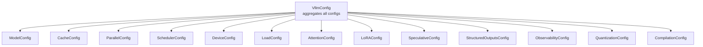
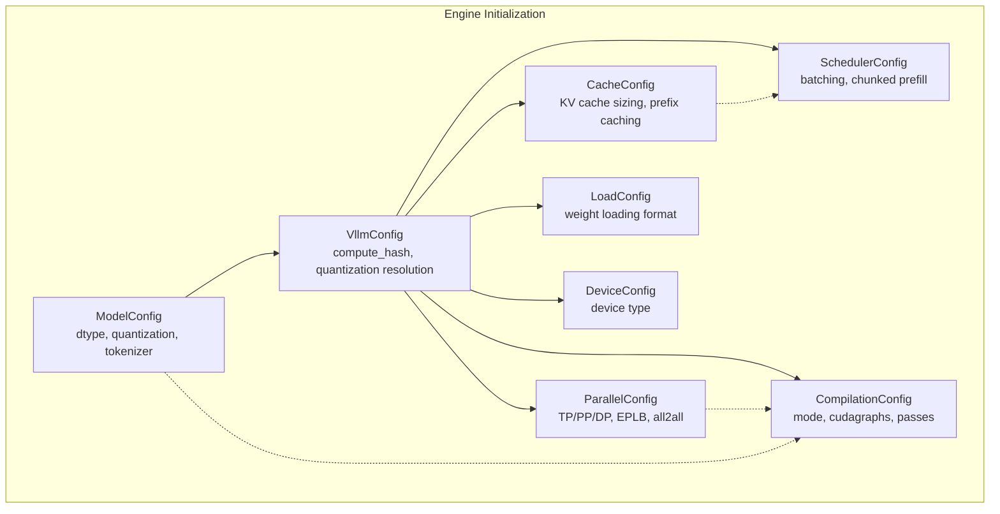
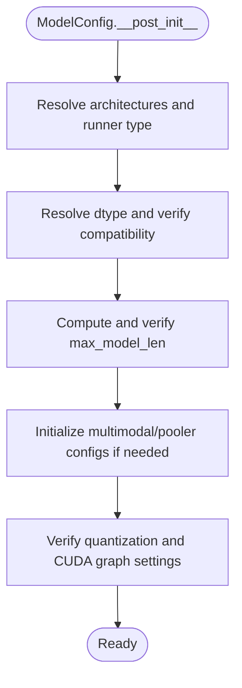
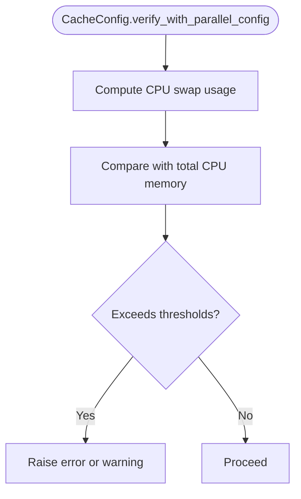
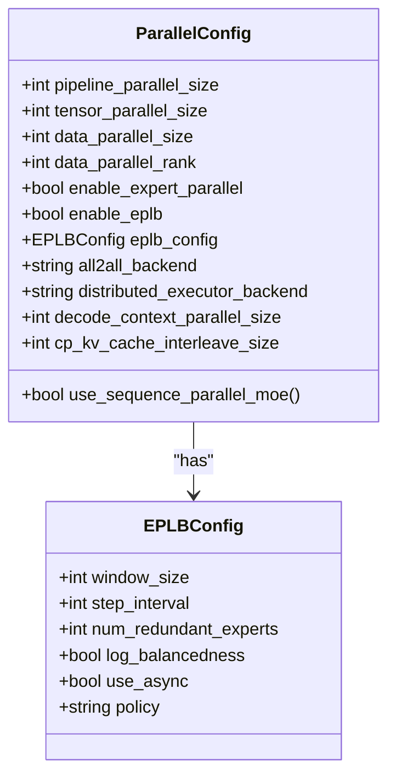
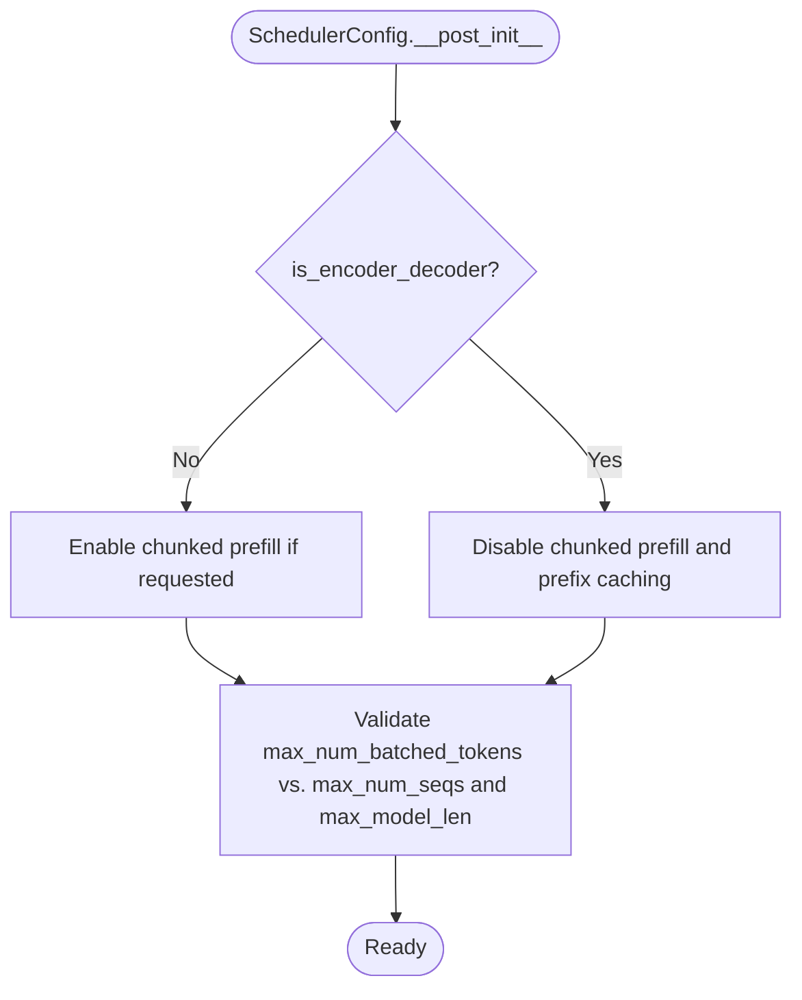
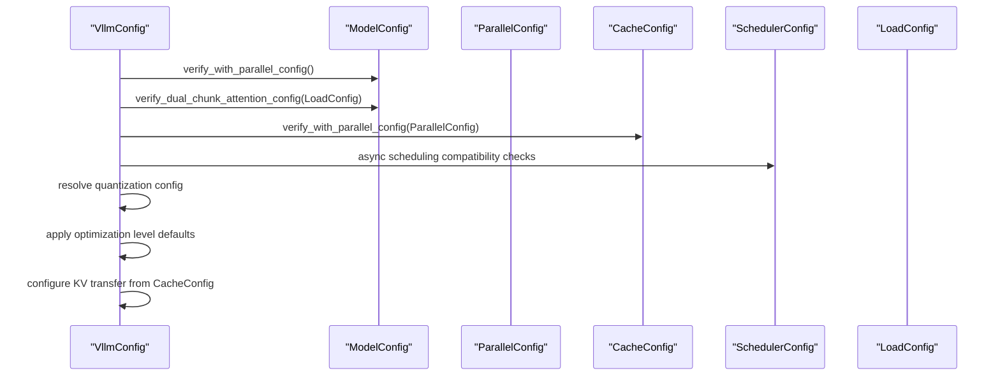
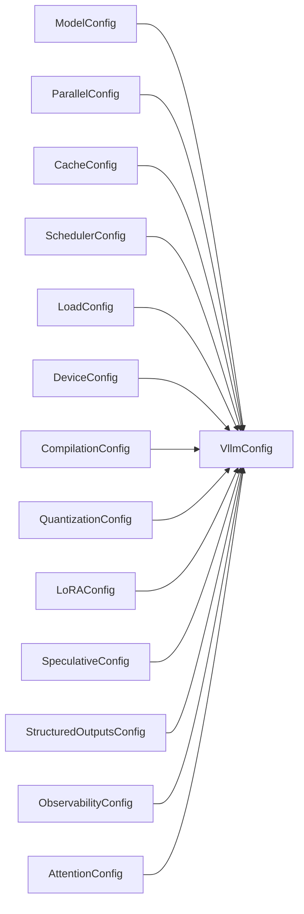

# Core Engine Parameters

<cite>
**Referenced Files in This Document**
- [vllm/config/__init__.py](file://vllm/config/__init__.py)
- [vllm/config/model.py](file://vllm/config/model.py)
- [vllm/config/cache.py](file://vllm/config/cache.py)
- [vllm/config/parallel.py](file://vllm/config/parallel.py)
- [vllm/config/scheduler.py](file://vllm/config/scheduler.py)
- [vllm/config/device.py](file://vllm/config/device.py)
- [vllm/config/vllm.py](file://vllm/config/vllm.py)
- [vllm/config/compilation.py](file://vllm/config/compilation.py)
- [vllm/config/load.py](file://vllm/config/load.py)
- [vllm/config/utils.py](file://vllm/config/utils.py)
- [vllm/engine/arg_utils.py](file://vllm/engine/arg_utils.py)
</cite>

## Table of Contents
1. [Introduction](#introduction)
2. [Project Structure](#project-structure)
3. [Core Components](#core-components)
4. [Architecture Overview](#architecture-overview)
5. [Detailed Component Analysis](#detailed-component-analysis)
6. [Dependency Analysis](#dependency-analysis)
7. [Performance Considerations](#performance-considerations)
8. [Troubleshooting Guide](#troubleshooting-guide)
9. [Conclusion](#conclusion)
10. [Appendices](#appendices)

## Introduction
This document explains vLLM’s core engine configuration parameters and how they interact. It focuses on:
- ModelConfig: model architecture selection, quantization, dtype, and tokenizer settings
- CacheConfig: KV cache management including block size, sliding window, prefix caching, and offloading
- ParallelConfig: tensor, data, expert, and pipeline parallelism, plus device allocation and communication strategies
- SchedulerConfig: request scheduling, batch sizing, and memory management
- DeviceConfig: hardware selection and resource allocation
- VllmConfig: the central container aggregating all configurations and enforcing interdependencies
It also covers parameter validation rules, defaults, interdependencies, and practical deployment scenarios.

## Project Structure
The configuration system is organized into focused modules under vllm/config. The VllmConfig class aggregates all sub-configurations and performs cross-checks and defaults resolution.

**Diagram sources**
- [vllm/config/vllm.py](file://vllm/config/vllm.py#L174-L240)
- [vllm/config/__init__.py](file://vllm/config/__init__.py#L48-L108)

**Section sources**
- [vllm/config/__init__.py](file://vllm/config/__init__.py#L48-L108)
- [vllm/config/vllm.py](file://vllm/config/vllm.py#L174-L240)

## Core Components
This section summarizes each configuration object, its primary parameters, defaults, and validation rules.

- ModelConfig
  - Purpose: Select model, tokenizer, dtype, quantization, and related behaviors.
  - Key parameters:
    - model, tokenizer, tokenizer_mode, trust_remote_code, dtype, seed
    - max_model_len, spec_target_max_model_len
    - quantization, enforce_eager
    - max_logprobs, logprobs_mode
    - disable_sliding_window, disable_cascade_attn
    - skip_tokenizer_init, enable_prompt_embeds, served_model_name
    - config_format, hf_token, hf_overrides, logits_processor_pattern
    - generation_config, override_generation_config
    - enable_sleep_mode, model_impl, override_attention_dtype
    - logits_processors, io_processor_plugin
    - pooler_config, multimodal_config, and multimodal init vars
  - Validation and defaults:
    - Validates tokenizer and max_model_len types/values
    - Normalizes tokenizer_mode and quantization to lowercase
    - Resolves runner type and convert type based on architecture
    - Infers dtype and max_model_len, and validates platform support
    - Enforces quantization and CUDA graph compatibility
  - Interdependencies:
    - dtype and quantization must be compatible
    - disable_sliding_window propagates to HF config
    - multimodal config depends on model architecture support

- CacheConfig
  - Purpose: Configure KV cache storage, memory, and offloading.
  - Key parameters:
    - block_size, gpu_memory_utilization, swap_space, cache_dtype
    - is_attention_free, num_gpu_blocks_override, sliding_window
    - enable_prefix_caching, prefix_caching_hash_algo
    - cpu_offload_gb, calculate_kv_scales
    - cpu_kvcache_space_bytes, mamba_page_size_padded, mamba_block_size, mamba_cache_dtype, mamba_ssm_cache_dtype
    - kv_sharing_fast_prefill, kv_cache_memory_bytes
    - kv_offloading_size, kv_offloading_backend
  - Validation and defaults:
    - Validates cache_dtype usage and logs informational warnings
    - Verifies swap space vs. total CPU memory constraints
  - Interdependencies:
    - kv_offloading_size requires kv_offloading_backend
    - mamba_* settings apply when Mamba models are used

- ParallelConfig
  - Purpose: Configure distributed execution across tensor, pipeline, and data parallelism.
  - Key parameters:
    - pipeline_parallel_size, tensor_parallel_size, prefill_context_parallel_size
    - data_parallel_size, data_parallel_size_local, data_parallel_rank, data_parallel_rank_local
    - data_parallel_master_ip, data_parallel_rpc_port, data_parallel_master_port
    - data_parallel_backend, data_parallel_external_lb, data_parallel_hybrid_lb
    - enable_expert_parallel, enable_eplb, eplb_config, expert_placement_strategy
    - all2all_backend, max_parallel_loading_workers
    - disable_custom_all_reduce, enable_dbo, ubatch_size
    - dbo_decode_token_threshold, dbo_prefill_token_threshold
    - disable_nccl_for_dp_synchronization, ray_workers_use_nsight
    - ray_runtime_env, placement_group, distributed_executor_backend
    - worker_cls, sd_worker_cls, worker_extension_cls, master_addr, master_port, node_rank, nnodes
    - decode_context_parallel_size, cp_kv_cache_interleave_size
  - Validation and defaults:
    - Validates DP rank ranges and external/hybrid LB constraints
    - Enforces EPLB prerequisites (platform, TP/DP > 1)
    - Determines world_size and executor backend defaults
    - Port management and DP group initialization helpers
  - Interdependencies:
    - EPLB requires expert parallelism and sufficient TP/DP
    - Sequence parallelism for MoE depends on all2all backend and TP/DP

- SchedulerConfig
  - Purpose: Control request scheduling, batching, and memory budgets.
  - Key parameters:
    - max_model_len (InitVar), is_encoder_decoder (InitVar)
    - max_num_batched_tokens, max_num_seqs
    - max_num_partial_prefills, max_long_partial_prefills, long_prefill_token_threshold
    - enable_chunked_prefill, is_multimodal_model
    - policy ("fcfs" or "priority"), disable_chunked_mm_input
    - scheduler_cls, disable_hybrid_kv_cache_manager
    - async_scheduling, stream_interval
  - Validation and defaults:
    - Disables chunked prefill and prefix caching for encoder-decoder models
    - Validates max_num_batched_tokens vs. max_num_seqs and max_model_len
    - Computes thresholds and logs configuration
  - Interdependencies:
    - Async scheduling is constrained by pipeline parallelism and speculative decoding

- DeviceConfig
  - Purpose: Select device type and ensure platform compatibility.
  - Key parameters:
    - device (deprecated alias), device_type (resolved)
  - Validation and defaults:
    - Auto-detects device_type from platform
    - Sets torch.device for non-TPU backends

- VllmConfig
  - Purpose: Central aggregation of all configurations and enforcement of cross-config rules.
  - Responsibilities:
    - Compute hashes for configs
    - Resolve quantization config from ModelConfig and LoadConfig
    - Verify ModelConfig vs ParallelConfig and LoadConfig
    - Apply optimization level defaults and adjust compilation/cudagraph modes
    - Configure KV transfer based on CacheConfig
    - Enforce async scheduling compatibility and platform constraints

- CompilationConfig
  - Purpose: Control torch.compile and cudagraph capture behavior.
  - Key parameters:
    - mode (CompilationMode), cudagraph_mode (CUDAGraphMode)
    - cudagraph_capture_sizes, max_cudagraph_capture_size, cudagraph_num_of_warmups
    - cudagraph_copy_inputs, cudagraph_specialize_lora
    - use_inductor_graph_partition, pass_config (PassConfig)
    - compile_sizes, compile_ranges_split_points, inductor_compile_config, inductor_passes
    - custom_ops, splitting_ops, compile_mm_encoder
    - dynamic_shapes_config
  - Interdependencies:
    - Mode selection influences cudagraph_mode compatibility
    - PassConfig flags affect fusion and sequence parallelism

- LoadConfig
  - Purpose: Control model weight loading format and device mapping.
  - Key parameters:
    - load_format, download_dir, safetensors_load_strategy
    - model_loader_extra_config, device
    - ignore_patterns, use_tqdm_on_load, pt_load_map_location
  - Validation and defaults:
    - Normalizes load_format to lowercase
    - Logs ignored patterns

**Section sources**
- [vllm/config/model.py](file://vllm/config/model.py#L96-L220)
- [vllm/config/model.py](file://vllm/config/model.py#L600-L634)
- [vllm/config/cache.py](file://vllm/config/cache.py#L22-L121)
- [vllm/config/cache.py](file://vllm/config/cache.py#L213-L233)
- [vllm/config/parallel.py](file://vllm/config/parallel.py#L81-L170)
- [vllm/config/parallel.py](file://vllm/config/parallel.py#L277-L321)
- [vllm/config/scheduler.py](file://vllm/config/scheduler.py#L26-L117)
- [vllm/config/scheduler.py](file://vllm/config/scheduler.py#L215-L300)
- [vllm/config/device.py](file://vllm/config/device.py#L17-L76)
- [vllm/config/vllm.py](file://vllm/config/vllm.py#L174-L240)
- [vllm/config/vllm.py](file://vllm/config/vllm.py#L368-L412)
- [vllm/config/vllm.py](file://vllm/config/vllm.py#L513-L800)
- [vllm/config/compilation.py](file://vllm/config/compilation.py#L36-L110)
- [vllm/config/compilation.py](file://vllm/config/compilation.py#L292-L675)
- [vllm/config/load.py](file://vllm/config/load.py#L23-L125)

## Architecture Overview
The configuration system enforces correctness and performance by validating and adjusting parameters across subsystems.

**Diagram sources**
- [vllm/config/vllm.py](file://vllm/config/vllm.py#L368-L412)
- [vllm/config/vllm.py](file://vllm/config/vllm.py#L513-L800)
- [vllm/config/model.py](file://vllm/config/model.py#L596-L600)
- [vllm/config/cache.py](file://vllm/config/cache.py#L213-L233)
- [vllm/config/parallel.py](file://vllm/config/parallel.py#L277-L321)
- [vllm/config/scheduler.py](file://vllm/config/scheduler.py#L215-L300)
- [vllm/config/compilation.py](file://vllm/config/compilation.py#L292-L675)
- [vllm/config/load.py](file://vllm/config/load.py#L23-L125)
- [vllm/config/device.py](file://vllm/config/device.py#L17-L76)

## Detailed Component Analysis

### ModelConfig Analysis
- Architecture selection and runner type
  - Resolved from model architectures; supports “generate” and “pooling” runners with adapters
  - Converts user-specified runner to a concrete type if not “auto”
- Quantization and dtype
  - dtype normalization and platform-specific defaults
  - Quantization method resolution and compatibility checks with device capability and supported act dtypes
- Tokenizer and model resolution
  - Tokenizer defaults to model path; supports revision and tokenizer revision
  - Redirects model/tokenizer URIs for RUNAI object storage
- Multimodal and pooling
  - Initializes MultiModalConfig and PoolerConfig when applicable
  - Validates encoder-decoder models and disables certain cache features
- Validation and defaults
  - Validates tokenizer path and max_model_len
  - Normalizes tokenizer_mode and quantization to lowercase
  - Enforces platform-specific constraints (e.g., sleep mode availability)

**Diagram sources**
- [vllm/config/model.py](file://vllm/config/model.py#L484-L599)
- [vllm/config/model.py](file://vllm/config/model.py#L600-L634)
- [vllm/config/model.py](file://vllm/config/model.py#L636-L668)

**Section sources**
- [vllm/config/model.py](file://vllm/config/model.py#L96-L220)
- [vllm/config/model.py](file://vllm/config/model.py#L484-L599)
- [vllm/config/model.py](file://vllm/config/model.py#L600-L634)
- [vllm/config/model.py](file://vllm/config/model.py#L636-L668)

### CacheConfig Analysis
- KV cache sizing and memory
  - gpu_memory_utilization and kv_cache_memory_bytes control memory footprint
  - num_gpu_blocks and num_cpu_blocks are derived post-initialization
- Prefix caching and hashing
  - enable_prefix_caching and prefix_caching_hash_algo choices
- Offloading and swapping
  - cpu_offload_gb and kv_offloading_size/backend for CPU offloading
  - swap_space validated against total CPU memory
- Mamba-specific cache settings
  - mamba_block_size, mamba_cache_dtype, mamba_ssm_cache_dtype

**Diagram sources**
- [vllm/config/cache.py](file://vllm/config/cache.py#L213-L233)

**Section sources**
- [vllm/config/cache.py](file://vllm/config/cache.py#L22-L121)
- [vllm/config/cache.py](file://vllm/config/cache.py#L162-L195)
- [vllm/config/cache.py](file://vllm/config/cache.py#L213-L233)

### ParallelConfig Analysis
- Parallelism dimensions
  - pipeline_parallel_size, tensor_parallel_size, prefill_context_parallel_size
  - data_parallel_size, data_parallel_size_local, data_parallel_rank, data_parallel_rank_local
- Expert parallelism and load balancing
  - enable_expert_parallel, enable_eplb, eplb_config, expert_placement_strategy
  - all2all_backend selection and constraints
- Communication and device allocation
  - disable_custom_all_reduce, disable_nccl_for_dp_synchronization
  - distributed_executor_backend selection and validation
- Validation and defaults
  - Validates DP rank ranges and external/hybrid LB constraints
  - Enforces EPLB prerequisites and platform support

**Diagram sources**
- [vllm/config/parallel.py](file://vllm/config/parallel.py#L50-L170)
- [vllm/config/parallel.py](file://vllm/config/parallel.py#L277-L321)
- [vllm/config/parallel.py](file://vllm/config/parallel.py#L401-L414)

**Section sources**
- [vllm/config/parallel.py](file://vllm/config/parallel.py#L81-L170)
- [vllm/config/parallel.py](file://vllm/config/parallel.py#L277-L321)
- [vllm/config/parallel.py](file://vllm/config/parallel.py#L401-L414)

### SchedulerConfig Analysis
- Batching and chunked prefill
  - max_num_batched_tokens, max_num_seqs, enable_chunked_prefill
  - max_num_partial_prefills, max_long_partial_prefills, long_prefill_token_threshold
- Policies and streaming
  - policy ("fcfs" or "priority"), stream_interval
- Encoder-decoder constraints
  - Disables chunked prefill and prefix caching for encoder-decoder models
- Validation
  - Ensures max_num_batched_tokens ≥ max_num_seqs and respects max_model_len

**Diagram sources**
- [vllm/config/scheduler.py](file://vllm/config/scheduler.py#L215-L300)

**Section sources**
- [vllm/config/scheduler.py](file://vllm/config/scheduler.py#L26-L117)
- [vllm/config/scheduler.py](file://vllm/config/scheduler.py#L215-L300)

### DeviceConfig Analysis
- Device selection
  - device (deprecated) resolved to device_type via platform detection
  - torch.device set for non-TPU platforms

**Section sources**
- [vllm/config/device.py](file://vllm/config/device.py#L17-L76)

### VllmConfig Analysis
- Aggregation and verification
  - Aggregates Model, Cache, Parallel, Scheduler, Device, Load, Attention, LoRA, Speculative, StructuredOutputs, Observability, Quantization, and Compilation configs
  - Performs cross-config validations and adjustments
- Quantization resolution
  - Builds QuantizationConfig from ModelConfig and LoadConfig, checking device capability and supported act dtypes
- Optimization level defaults
  - Applies optimization level presets to CompilationConfig and adjusts cudagraph modes
- KV transfer configuration
  - Updates KVTransferConfig based on CacheConfig offloading settings
- Async scheduling compatibility
  - Validates async scheduling constraints with pipeline parallelism and speculative decoding

**Diagram sources**
- [vllm/config/vllm.py](file://vllm/config/vllm.py#L513-L800)

**Section sources**
- [vllm/config/vllm.py](file://vllm/config/vllm.py#L174-L240)
- [vllm/config/vllm.py](file://vllm/config/vllm.py#L368-L412)
- [vllm/config/vllm.py](file://vllm/config/vllm.py#L513-L800)

### CompilationConfig Analysis
- Compilation modes and cudagraphs
  - CompilationMode and CUDAGraphMode selection and compatibility
  - cudagraph_capture_sizes and max_cudagraph_capture_size defaults and padding
- Pass configuration
  - PassConfig flags for fusion, sequence parallelism, and allreduce fusion
- Dynamic shapes and graph partitioning
  - DynamicShapesConfig and use_inductor_graph_partition
- Custom ops and splitting
  - custom_ops and splitting_ops for piecewise compilation

**Section sources**
- [vllm/config/compilation.py](file://vllm/config/compilation.py#L36-L110)
- [vllm/config/compilation.py](file://vllm/config/compilation.py#L292-L675)

### LoadConfig Analysis
- Weight loading formats and strategies
  - load_format, safetensors_load_strategy, model_loader_extra_config
- Device mapping and ignore patterns
  - device, pt_load_map_location, ignore_patterns, use_tqdm_on_load

**Section sources**
- [vllm/config/load.py](file://vllm/config/load.py#L23-L125)

## Dependency Analysis
The following diagram shows key dependencies among configuration objects and how they influence each other.

**Diagram sources**
- [vllm/config/vllm.py](file://vllm/config/vllm.py#L174-L240)

**Section sources**
- [vllm/config/vllm.py](file://vllm/config/vllm.py#L174-L240)

## Performance Considerations
- ModelConfig
  - dtype and quantization directly affect memory bandwidth and compute throughput; choose dtype aligned with model and hardware capabilities
  - enforce_eager disables cudagraphs and may reduce startup latency but harms sustained throughput
- CacheConfig
  - gpu_memory_utilization and kv_cache_memory_bytes control memory footprint; too low reduces throughput, too high risks OOM
  - enable_prefix_caching improves throughput for repetitive prompts; prefix_caching_hash_algo affects collision risk
  - cpu_offload_gb and kv_offloading_size enable larger models at the cost of CPU-GPU bandwidth
- ParallelConfig
  - tensor_parallel_size and data_parallel_size scale compute; ensure adequate interconnect bandwidth
  - enable_expert_parallel and EPLB can improve load balancing for MoE models
  - disable_custom_all_reduce may be required on multi-node or unsupported platforms
- SchedulerConfig
  - max_num_batched_tokens and max_num_seqs balance memory and throughput; tune based on workload
  - enable_chunked_prefill improves memory efficiency for long prompts; long_prefill_token_threshold controls fairness
  - async_scheduling can improve latency but has constraints with pipeline parallelism and speculative decoding
- CompilationConfig
  - CompilationMode and cudagraph_mode selection impacts warmup time vs. steady-state performance
  - pass_config flags enable targeted fusions; sequence parallelism requires specific custom ops
- LoadConfig
  - safetensors_load_strategy affects initialization time and memory usage; “eager” may be needed for network filesystems

[No sources needed since this section provides general guidance]

## Troubleshooting Guide
- ModelConfig
  - Ensure tokenizer is a string path or Hugging Face ID; max_model_len must be a positive integer
  - If quantization is set, verify dtype compatibility and device capability
- CacheConfig
  - If swap_space is too large relative to total CPU memory, a warning or error is raised
  - For encoder-decoder models, chunked prefill and prefix caching are disabled automatically
- ParallelConfig
  - data_parallel_rank must be within valid range; external/hybrid LB requires DP size > 1
  - EPLB requires expert parallelism and platform support; TP/DP must be > 1
- SchedulerConfig
  - max_num_batched_tokens must be ≥ max_num_seqs and ≥ max_model_len when not using chunked prefill
  - Async scheduling is incompatible with pipeline_parallel_size > 1 and certain speculative decoding setups
- VllmConfig
  - Quantization resolution checks device capability and supported act dtypes; mismatches raise errors
  - KV transfer configuration requires kv_offloading_size when kv_offloading_backend is set

**Section sources**
- [vllm/config/model.py](file://vllm/config/model.py#L600-L634)
- [vllm/config/cache.py](file://vllm/config/cache.py#L213-L233)
- [vllm/config/parallel.py](file://vllm/config/parallel.py#L277-L321)
- [vllm/config/scheduler.py](file://vllm/config/scheduler.py#L248-L300)
- [vllm/config/vllm.py](file://vllm/config/vllm.py#L513-L800)

## Conclusion
vLLM’s configuration system provides a cohesive framework for selecting model architectures, managing memory and parallelism, and tuning performance. Correctly setting ModelConfig, CacheConfig, ParallelConfig, SchedulerConfig, and CompilationConfig ensures optimal throughput, memory efficiency, and compatibility across diverse hardware and deployment scenarios. VllmConfig centralizes validation and defaults, reducing misconfiguration risks and enabling predictable behavior.

[No sources needed since this section summarizes without analyzing specific files]

## Appendices

### Parameter Validation Rules and Defaults (Selected)
- ModelConfig
  - tokenizer must be a string; max_model_len must be a positive integer
  - dtype normalization and quantization compatibility checks
- CacheConfig
  - cache_dtype informational logging; swap_space validated against total CPU memory
- ParallelConfig
  - DP rank range validation; EPLB prerequisites enforced
- SchedulerConfig
  - max_num_batched_tokens ≥ max_num_seqs; long_prefill_token_threshold ≤ max_model_len
- CompilationConfig
  - mode and cudagraph_mode enums parsed from strings; pass_config flags validated
- LoadConfig
  - load_format normalized to lowercase; ignore_patterns logged

**Section sources**
- [vllm/config/model.py](file://vllm/config/model.py#L600-L634)
- [vllm/config/cache.py](file://vllm/config/cache.py#L201-L212)
- [vllm/config/cache.py](file://vllm/config/cache.py#L213-L233)
- [vllm/config/parallel.py](file://vllm/config/parallel.py#L277-L321)
- [vllm/config/scheduler.py](file://vllm/config/scheduler.py#L248-L300)
- [vllm/config/compilation.py](file://vllm/config/compilation.py#L676-L736)
- [vllm/config/load.py](file://vllm/config/load.py#L110-L125)

### Example Deployment Scenarios
- Single GPU inference
  - ModelConfig: dtype=bfloat16 or float16; enforce_eager=False
  - CacheConfig: gpu_memory_utilization≈0.9; enable_prefix_caching=True
  - ParallelConfig: tensor_parallel_size=1; pipeline_parallel_size=1
  - SchedulerConfig: max_num_batched_tokens≈2048; enable_chunked_prefill=True
  - CompilationConfig: mode=VLLM_COMPILE; cudagraph_mode=FULL_AND_PIECEWISE
- Multi-GPU tensor parallel
  - ModelConfig: dtype aligned with quantization; max_model_len set appropriately
  - ParallelConfig: tensor_parallel_size>1; distributed_executor_backend="mp" or "ray"
  - SchedulerConfig: tune max_num_batched_tokens and stream_interval
  - CompilationConfig: enable sequence parallelism via pass_config.enable_sp
- CPU offloading for large models
  - CacheConfig: cpu_offload_gb>0; kv_offloading_size and kv_offloading_backend set
  - ParallelConfig: ensure interconnect bandwidth for CPU-GPU transfers
- Encoder-decoder models
  - SchedulerConfig: chunked prefill and prefix caching disabled automatically
  - ModelConfig: disable_sliding_window if needed

**Section sources**
- [vllm/config/cache.py](file://vllm/config/cache.py#L22-L121)
- [vllm/config/parallel.py](file://vllm/config/parallel.py#L552-L613)
- [vllm/config/scheduler.py](file://vllm/config/scheduler.py#L215-L247)
- [vllm/config/compilation.py](file://vllm/config/compilation.py#L465-L526)

### How Configuration Parameters Affect Performance
- Memory footprint
  - gpu_memory_utilization, kv_cache_memory_bytes, cache_dtype, cpu_offload_gb
- Throughput and latency
  - max_num_batched_tokens, max_num_seqs, enable_chunked_prefill, async_scheduling
  - cudagraph_mode, CompilationMode, pass_config fusion flags
- Parallel scaling
  - tensor_parallel_size, data_parallel_size, pipeline_parallel_size
  - all2all_backend, disable_custom_all_reduce, disable_nccl_for_dp_synchronization

**Section sources**
- [vllm/config/cache.py](file://vllm/config/cache.py#L22-L121)
- [vllm/config/scheduler.py](file://vllm/config/scheduler.py#L26-L117)
- [vllm/config/compilation.py](file://vllm/config/compilation.py#L292-L675)
- [vllm/config/parallel.py](file://vllm/config/parallel.py#L277-L321)