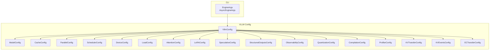
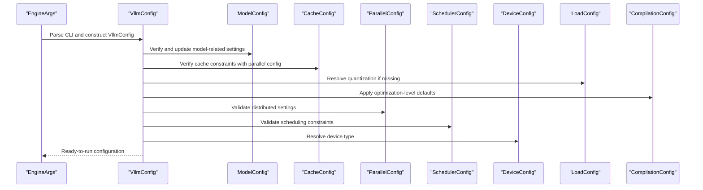
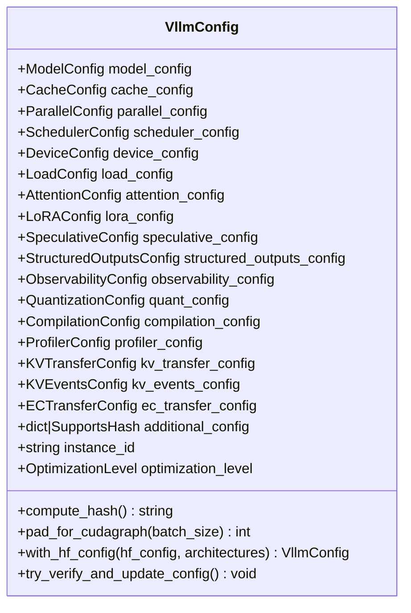
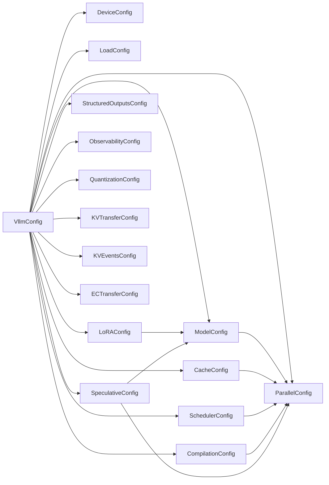

# Engine Configuration

<cite>
**Referenced Files in This Document**
- [vllm/config/vllm.py](file://vllm/config/vllm.py)
- [vllm/config/model.py](file://vllm/config/model.py)
- [vllm/config/cache.py](file://vllm/config/cache.py)
- [vllm/config/parallel.py](file://vllm/config/parallel.py)
- [vllm/config/scheduler.py](file://vllm/config/scheduler.py)
- [vllm/config/device.py](file://vllm/config/device.py)
- [vllm/config/load.py](file://vllm/config/load.py)
- [vllm/config/compilation.py](file://vllm/config/compilation.py)
- [vllm/config/lora.py](file://vllm/config/lora.py)
- [vllm/config/speculative.py](file://vllm/config/speculative.py)
- [vllm/config/structured_outputs.py](file://vllm/config/structured_outputs.py)
- [vllm/config/observability.py](file://vllm/config/observability.py)
- [vllm/config/kv_transfer.py](file://vllm/config/kv_transfer.py)
- [vllm/config/kv_events.py](file://vllm/config/kv_events.py)
- [vllm/config/ec_transfer.py](file://vllm/config/ec_transfer.py)
- [vllm/config/profiler.py](file://vllm/config/profiler.py)
- [vllm/engine/arg_utils.py](file://vllm/engine/arg_utils.py)
</cite>

## Table of Contents
1. [Introduction](#introduction)
2. [Project Structure](#project-structure)
3. [Core Components](#core-components)
4. [Architecture Overview](#architecture-overview)
5. [Detailed Component Analysis](#detailed-component-analysis)
6. [Dependency Analysis](#dependency-analysis)
7. [Performance Considerations](#performance-considerations)
8. [Troubleshooting Guide](#troubleshooting-guide)
9. [Conclusion](#conclusion)
10. [Appendices](#appendices)

## Introduction
This document explains the vLLM engine configuration system with a focus on the VllmConfig class as the central configuration container. It covers all configuration parameters (model_config, cache_config, parallel_config, scheduler_config, device_config, load_config, attention_config, lora_config, speculative_config, structured_outputs_config, observability_config, quant_config, compilation_config, profiler_config, kv_transfer_config, kv_events_config, ec_transfer_config, additional_config, instance_id, optimization_level), their relationships, validation rules, defaults, and how they interact during engine initialization. It also documents optimization levels O0–O3 and their impact on startup time versus performance, plus configuration inheritance and merging strategies.

## Project Structure
The configuration system is organized into modular config classes under vllm/config/, with VllmConfig aggregating them into a single engine-wide configuration object. CLI arguments are parsed and mapped into VllmConfig fields via EngineArgs/AsyncEngineArgs.

**Diagram sources**
- [vllm/engine/arg_utils.py](file://vllm/engine/arg_utils.py#L1125-L1160)
- [vllm/config/vllm.py](file://vllm/config/vllm.py#L174-L244)

**Section sources**
- [vllm/engine/arg_utils.py](file://vllm/engine/arg_utils.py#L1125-L1160)
- [vllm/config/vllm.py](file://vllm/config/vllm.py#L174-L244)

## Core Components
- VllmConfig: Central aggregation of all engine configuration objects. Provides validation, defaults propagation, optimization-level-driven tuning, and runtime adjustments.
- ModelConfig: Model identity, dtype, tokenizer, multimodal settings, quantization hints, and model-specific constraints.
- CacheConfig: KV cache sizing, dtype, prefix caching, offloading, and related knobs.
- ParallelConfig: Data, tensor, pipeline, context parallel sizes, all2all backend, DP LB modes, and distributed executor backend.
- SchedulerConfig: Batch limits, chunked prefill, async scheduling, streaming interval, and hybrid KV cache manager control.
- DeviceConfig: Device selection and platform-aware device type resolution.
- LoadConfig: Weight loading format, cache directory, safetensors loading strategy, and device mapping.
- AttentionConfig: Attention backend and dtype overrides.
- LoRAConfig: LoRA adapter limits, dtype, and CPU offload.
- SpeculativeConfig: Draft model, method, token counts, and advanced controls.
- StructuredOutputsConfig: Schema-driven output formatting configuration.
- ObservabilityConfig: Metrics and telemetry settings.
- QuantizationConfig: Quantization method and capabilities; resolved from ModelConfig and LoadConfig.
- CompilationConfig: torch.compile mode, cudagraph capture, inductor passes, dynamic shapes, and custom ops.
- ProfilerConfig: Debug dump paths and profiling toggles.
- KVTransferConfig: Distributed KV cache transfer settings.
- KVEventsConfig: KV cache event publishing configuration.
- ECTransferConfig: Distributed EC cache transfer settings.

**Section sources**
- [vllm/config/vllm.py](file://vllm/config/vllm.py#L174-L244)
- [vllm/config/model.py](file://vllm/config/model.py#L96-L210)
- [vllm/config/cache.py](file://vllm/config/cache.py#L37-L121)
- [vllm/config/parallel.py](file://vllm/config/parallel.py#L81-L160)
- [vllm/config/scheduler.py](file://vllm/config/scheduler.py#L26-L120)
- [vllm/config/device.py](file://vllm/config/device.py#L17-L76)
- [vllm/config/load.py](file://vllm/config/load.py#L23-L90)
- [vllm/config/compilation.py](file://vllm/config/compilation.py#L292-L490)
- [vllm/config/lora.py](file://vllm/config/lora.py#L29-L70)
- [vllm/config/speculative.py](file://vllm/config/speculative.py#L52-L120)
- [vllm/config/structured_outputs.py](file://vllm/config/structured_outputs.py#L1-L200)
- [vllm/config/observability.py](file://vllm/config/observability.py#L1-L200)
- [vllm/config/kv_transfer.py](file://vllm/config/kv_transfer.py#L1-L200)
- [vllm/config/kv_events.py](file://vllm/config/kv_events.py#L1-L200)
- [vllm/config/ec_transfer.py](file://vllm/config/ec_transfer.py#L1-L200)
- [vllm/config/profiler.py](file://vllm/config/profiler.py#L1-L200)

## Architecture Overview
VllmConfig orchestrates configuration initialization and validation. It computes a stable hash for the engine graph, resolves quantization, applies optimization-level defaults, validates compatibility across components, and performs platform-specific updates.

**Diagram sources**
- [vllm/config/vllm.py](file://vllm/config/vllm.py#L513-L800)
- [vllm/config/vllm.py](file://vllm/config/vllm.py#L800-L1173)
- [vllm/engine/arg_utils.py](file://vllm/engine/arg_utils.py#L1125-L1160)

## Detailed Component Analysis

### VllmConfig: Central Configuration Container
- Purpose: Aggregates all engine configuration objects and provides validation, defaults, and runtime adjustments.
- Key responsibilities:
  - Compute a deterministic hash for the engine graph.
  - Resolve quantization configuration from model and load settings.
  - Apply optimization-level defaults recursively into nested configs.
  - Validate cross-component constraints (e.g., async scheduling, cudagraph compatibility).
  - Perform platform-specific updates and feature toggles.
  - Manage KV transfer configuration based on cache offloading settings.
  - Support environment-based debug dump path override.

**Diagram sources**
- [vllm/config/vllm.py](file://vllm/config/vllm.py#L174-L244)
- [vllm/config/vllm.py](file://vllm/config/vllm.py#L245-L338)
- [vllm/config/vllm.py](file://vllm/config/vllm.py#L368-L441)
- [vllm/config/vllm.py](file://vllm/config/vllm.py#L442-L512)
- [vllm/config/vllm.py](file://vllm/config/vllm.py#L513-L800)
- [vllm/config/vllm.py](file://vllm/config/vllm.py#L800-L1173)

**Section sources**
- [vllm/config/vllm.py](file://vllm/config/vllm.py#L174-L244)
- [vllm/config/vllm.py](file://vllm/config/vllm.py#L245-L338)
- [vllm/config/vllm.py](file://vllm/config/vllm.py#L368-L441)
- [vllm/config/vllm.py](file://vllm/config/vllm.py#L442-L512)
- [vllm/config/vllm.py](file://vllm/config/vllm.py#L513-L800)
- [vllm/config/vllm.py](file://vllm/config/vllm.py#L800-L1173)

### ModelConfig
- Purpose: Defines model identity, dtype, tokenizer, multimodal settings, and model-specific constraints.
- Important fields:
  - model, tokenizer, tokenizer_mode, trust_remote_code, dtype, seed
  - hf_config, hf_text_config, hf_config_path, revision, code_revision, tokenizer_revision
  - max_model_len, spec_target_max_model_len, quantization, enforce_eager
  - logprobs_mode, disable_sliding_window, disable_cascade_attn, skip_tokenizer_init
  - enable_prompt_embeds, served_model_name, config_format, hf_token, hf_overrides
  - logits_processor_pattern, generation_config, override_generation_config
  - enable_sleep_mode, model_impl, override_attention_dtype, logits_processors
  - io_processor_plugin, pooler_config, multimodal_config, and various multimodal init vars.

Validation highlights:
- Validates tokenizer path and max_model_len.
- Resolves runner and convert types based on architecture and defaults.
- Supports GGUF and RUNAI object URIs with appropriate restrictions.

**Section sources**
- [vllm/config/model.py](file://vllm/config/model.py#L96-L210)
- [vllm/config/model.py](file://vllm/config/model.py#L398-L635)
- [vllm/config/model.py](file://vllm/config/model.py#L636-L800)

### CacheConfig
- Purpose: Controls KV cache allocation, dtype, prefix caching, offloading, and related knobs.
- Key fields:
  - block_size, gpu_memory_utilization, swap_space, cache_dtype, is_attention_free
  - num_gpu_blocks_override, sliding_window, enable_prefix_caching, prefix_caching_hash_algo
  - cpu_offload_gb, calculate_kv_scales, cpu_kvcache_space_bytes, mamba_page_size_padded
  - mamba_block_size, mamba_cache_dtype, mamba_ssm_cache_dtype
  - kv_sharing_fast_prefill, kv_cache_memory_bytes, kv_offloading_size, kv_offloading_backend

Validation highlights:
- Validates swap space against total CPU memory.
- Enforces constraints for Mamba cache and prefix caching.

**Section sources**
- [vllm/config/cache.py](file://vllm/config/cache.py#L22-L121)
- [vllm/config/cache.py](file://vllm/config/cache.py#L126-L195)
- [vllm/config/cache.py](file://vllm/config/cache.py#L213-L233)

### ParallelConfig
- Purpose: Defines distributed execution topology and backends.
- Key fields:
  - pipeline_parallel_size, tensor_parallel_size, prefill_context_parallel_size
  - data_parallel_size, data_parallel_size_local, data_parallel_rank, data_parallel_rank_local
  - data_parallel_master_ip, data_parallel_rpc_port, data_parallel_master_port
  - data_parallel_backend, data_parallel_external_lb, data_parallel_hybrid_lb
  - enable_expert_parallel, enable_eplb, eplb_config, expert_placement_strategy
  - all2all_backend, max_parallel_loading_workers, disable_custom_all_reduce
  - enable_dbo, ubatch_size, dbo_decode_token_threshold, dbo_prefill_token_threshold
  - disable_nccl_for_dp_synchronization, ray_workers_use_nsight, ray_runtime_env
  - placement_group, distributed_executor_backend, worker_cls, sd_worker_cls
  - worker_extension_cls, master_addr, master_port, node_rank, nnodes
  - decode_context_parallel_size, cp_kv_cache_interleave_size

Validation highlights:
- Validates DP LB flags and expert parallelism constraints.
- Selects distributed executor backend based on platform and world size.

**Section sources**
- [vllm/config/parallel.py](file://vllm/config/parallel.py#L81-L160)
- [vllm/config/parallel.py](file://vllm/config/parallel.py#L277-L321)
- [vllm/config/parallel.py](file://vllm/config/parallel.py#L498-L666)

### SchedulerConfig
- Purpose: Controls batching, chunked prefill, scheduling policy, and async scheduling.
- Key fields:
  - max_model_len (InitVar), is_encoder_decoder (InitVar)
  - max_num_batched_tokens, max_num_seqs, max_num_partial_prefills, max_long_partial_prefills
  - long_prefill_token_threshold, enable_chunked_prefill, is_multimodal_model
  - policy ("fcfs" or "priority"), disable_chunked_mm_input, scheduler_cls
  - disable_hybrid_kv_cache_manager, async_scheduling, stream_interval

Validation highlights:
- Disables chunked prefill and prefix caching for encoder-decoder models.
- Validates max_num_batched_tokens vs max_num_seqs and max_model_len.

**Section sources**
- [vllm/config/scheduler.py](file://vllm/config/scheduler.py#L26-L120)
- [vllm/config/scheduler.py](file://vllm/config/scheduler.py#L146-L178)
- [vllm/config/scheduler.py](file://vllm/config/scheduler.py#L215-L300)

### DeviceConfig
- Purpose: Determines device type and torch device for execution.
- Key fields:
  - device (deprecated), device_type (resolved)

Behavior:
- Auto-detects device type from platform and sets torch.device accordingly.
- Special handling for TPU requiring CPU-side inputs.

**Section sources**
- [vllm/config/device.py](file://vllm/config/device.py#L17-L76)

### LoadConfig
- Purpose: Controls model weight loading format, cache directory, and device mapping.
- Key fields:
  - load_format, download_dir, safetensors_load_strategy, model_loader_extra_config
  - device, ignore_patterns, use_tqdm_on_load, pt_load_map_location

Validation highlights:
- Normalizes load_format and warns on non-default ignore patterns.

**Section sources**
- [vllm/config/load.py](file://vllm/config/load.py#L23-L90)
- [vllm/config/load.py](file://vllm/config/load.py#L110-L125)

### CompilationConfig
- Purpose: Controls torch.compile mode, cudagraph capture, inductor passes, and dynamic shapes.
- Key fields:
  - mode (CompilationMode), debug_dump_path, cache_dir, compile_cache_save_format, backend
  - custom_ops, splitting_ops, compile_mm_encoder
  - compile_sizes, compile_ranges_split_points, inductor_compile_config, inductor_passes
  - cudagraph_mode (CUDAGraphMode), cudagraph_num_of_warmups, cudagraph_capture_sizes
  - cudagraph_copy_inputs, cudagraph_specialize_lora, use_inductor_graph_partition
  - pass_config (PassConfig), max_cudagraph_capture_size, dynamic_shapes_config

Validation highlights:
- Parses mode and cudagraph_mode from strings.
- Ensures compile cache save format is valid.

**Section sources**
- [vllm/config/compilation.py](file://vllm/config/compilation.py#L36-L110)
- [vllm/config/compilation.py](file://vllm/config/compilation.py#L292-L490)
- [vllm/config/compilation.py](file://vllm/config/compilation.py#L676-L736)
- [vllm/config/compilation.py](file://vllm/config/compilation.py#L737-L800)

### LoRAConfig
- Purpose: Controls LoRA adapter limits, dtype, and CPU offload.
- Key fields:
  - max_lora_rank, max_loras, fully_sharded_loras, max_cpu_loras, lora_dtype
  - default_mm_loras

Validation highlights:
- Ensures max_cpu_loras >= max_loras.

**Section sources**
- [vllm/config/lora.py](file://vllm/config/lora.py#L29-L70)
- [vllm/config/lora.py](file://vllm/config/lora.py#L80-L91)

### SpeculativeConfig
- Purpose: Configures speculative decoding with draft models and methods.
- Key fields:
  - enforce_eager, num_speculative_tokens, model, method, draft_tensor_parallel_size
  - quantization, max_model_len, revision, code_revision
  - disable_by_batch_size, disable_padded_drafter_batch
  - prompt_lookup_max/min for ngram
  - speculative_token_tree, suffix decoding parameters
  - target_model_config, target_parallel_config, draft_model_config, draft_parallel_config

Validation highlights:
- Validates ngram window bounds and suffix decoding prerequisites.
- Creates draft model and parallel configs when applicable.

**Section sources**
- [vllm/config/speculative.py](file://vllm/config/speculative.py#L52-L120)
- [vllm/config/speculative.py](file://vllm/config/speculative.py#L235-L463)
- [vllm/config/speculative.py](file://vllm/config/speculative.py#L464-L645)

### StructuredOutputsConfig, ObservabilityConfig, ProfilerConfig
- Purpose: Configure schema-driven outputs, observability metrics, and profiling.
- Notes: These are thin containers with fields documented in their respective modules.

**Section sources**
- [vllm/config/structured_outputs.py](file://vllm/config/structured_outputs.py#L1-L200)
- [vllm/config/observability.py](file://vllm/config/observability.py#L1-L200)
- [vllm/config/profiler.py](file://vllm/config/profiler.py#L1-L200)

### KVTransferConfig, KVEventsConfig, ECTransferConfig
- Purpose: Configure distributed KV cache transfer, KV event publishing, and EC cache transfer.
- Notes: These are thin containers with fields documented in their respective modules.

**Section sources**
- [vllm/config/kv_transfer.py](file://vllm/config/kv_transfer.py#L1-L200)
- [vllm/config/kv_events.py](file://vllm/config/kv_events.py#L1-L200)
- [vllm/config/ec_transfer.py](file://vllm/config/ec_transfer.py#L1-L200)

## Dependency Analysis
VllmConfig orchestrates cross-component validation and defaults. The following diagram shows key dependencies and interactions:

**Diagram sources**
- [vllm/config/vllm.py](file://vllm/config/vllm.py#L513-L800)
- [vllm/config/vllm.py](file://vllm/config/vllm.py#L800-L1173)
- [vllm/config/model.py](file://vllm/config/model.py#L596-L635)
- [vllm/config/cache.py](file://vllm/config/cache.py#L213-L233)
- [vllm/config/parallel.py](file://vllm/config/parallel.py#L498-L666)
- [vllm/config/scheduler.py](file://vllm/config/scheduler.py#L215-L300)
- [vllm/config/compilation.py](file://vllm/config/compilation.py#L737-L800)
- [vllm/config/lora.py](file://vllm/config/lora.py#L80-L91)
- [vllm/config/speculative.py](file://vllm/config/speculative.py#L464-L645)

**Section sources**
- [vllm/config/vllm.py](file://vllm/config/vllm.py#L513-L800)
- [vllm/config/vllm.py](file://vllm/config/vllm.py#L800-L1173)

## Performance Considerations
- Optimization levels (O0–O3):
  - O0: No compilation, no cudagraphs; fastest startup.
  - O1: Quick optimizations with Dynamo+Inductor and piecewise cudagraphs.
  - O2: Full optimizations; full and piecewise cudagraphs.
  - O3: Same as O2 currently.
- Impact:
  - Startup time: O0 < O1 < O2/O3.
  - Throughput and latency: O2/O3 typically better than O0.
- Influences:
  - Compilation mode and cudagraph mode are set based on optimization level and platform support.
  - enforce_eager overrides optimization level to O0.
  - Inductor compilation disabled warnings when user settings conflict with optimizations.

**Section sources**
- [vllm/config/vllm.py](file://vllm/config/vllm.py#L63-L113)
- [vllm/config/vllm.py](file://vllm/config/vllm.py#L617-L686)
- [vllm/config/vllm.py](file://vllm/config/vllm.py#L686-L733)

## Troubleshooting Guide
Common validation and compatibility issues:
- Async scheduling:
  - Incompatible with pipeline_parallel_size > 1 or speculative decoding.
  - Only EAGLE/MTP speculative decoding is supported for async scheduling.
- CUDA graph constraints:
  - Full cudagraphs not supported for encoder-decoder models; overridden to decode-only/full decode-only depending on model type.
  - Piecewise cudagraphs require VLLM_COMPILE mode.
- Chunked prefill and Turing FP32:
  - IEEE precision workaround for chunked prefill on Turing devices.
- KV cache events and prefix caching:
  - Events enabled without prefix caching produce warnings.
- KV sharing fast prefill:
  - Incompatible with EAGLE speculative decoding.
- Hybrid KV cache manager:
  - Disabled when KV events are enabled or when KV connectors are used.
- Expert parallelism and EPLB:
  - Requires CUDA/ROCm and TP/DP > 1; otherwise raises errors.
- Load format and Run:ai:
  - Run:ai requires specific load formats; otherwise raises errors.

**Section sources**
- [vllm/config/vllm.py](file://vllm/config/vllm.py#L542-L602)
- [vllm/config/vllm.py](file://vllm/config/vllm.py#L694-L733)
- [vllm/config/vllm.py](file://vllm/config/vllm.py#L734-L764)
- [vllm/config/vllm.py](file://vllm/config/vllm.py#L765-L785)
- [vllm/config/vllm.py](file://vllm/config/vllm.py#L930-L958)
- [vllm/config/parallel.py](file://vllm/config/parallel.py#L277-L321)

## Conclusion
VllmConfig serves as the single source of truth for engine configuration, enforcing consistency across model, cache, parallelism, scheduling, compilation, and distributed settings. Its validation and optimization-level logic ensure predictable performance and compatibility across diverse deployment scenarios. Use the provided sections to tailor configurations for single-node inference, distributed serving, and production environments.

## Appendices

### Configuration Inheritance and Merging Strategies
- Nested defaults:
  - VllmConfig._apply_optimization_level_defaults recursively applies defaults from OptimizationLevel mappings into nested config objects only when user has not specified those fields.
- Quantization resolution:
  - VllmConfig._get_quantization_config derives quantization from ModelConfig and LoadConfig, validates GPU capability and supported act dtypes, and updates config accordingly.
- KV transfer configuration:
  - VllmConfig._post_init_kv_transfer_config auto-configures KVTransferConfig based on CacheConfig’s kv_offloading_backend and size, and parallel world size.

**Section sources**
- [vllm/config/vllm.py](file://vllm/config/vllm.py#L442-L470)
- [vllm/config/vllm.py](file://vllm/config/vllm.py#L368-L412)
- [vllm/config/vllm.py](file://vllm/config/vllm.py#L471-L512)

### CLI Mapping to VllmConfig
- EngineArgs/AsyncEngineArgs expose VllmConfig fields as CLI arguments, including speculative-config, kv-transfer-config, kv-events-config, ec-transfer-config, compilation-config, attention-config, structured-outputs-config, profiler-config, and optimization-level.

**Section sources**
- [vllm/engine/arg_utils.py](file://vllm/engine/arg_utils.py#L1125-L1160)