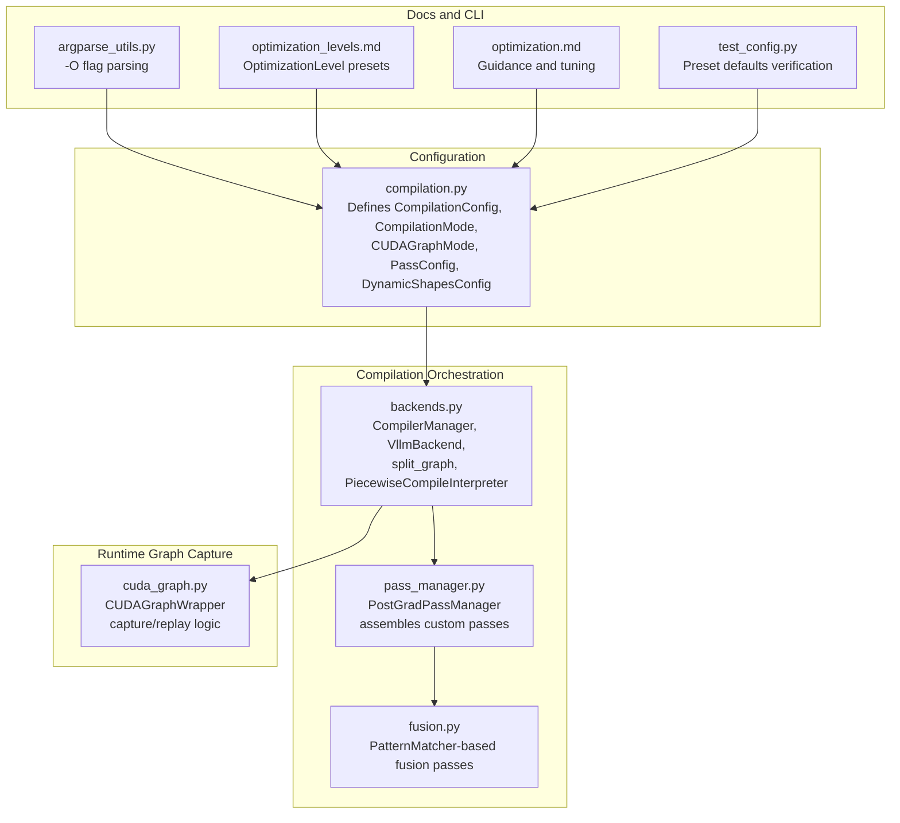
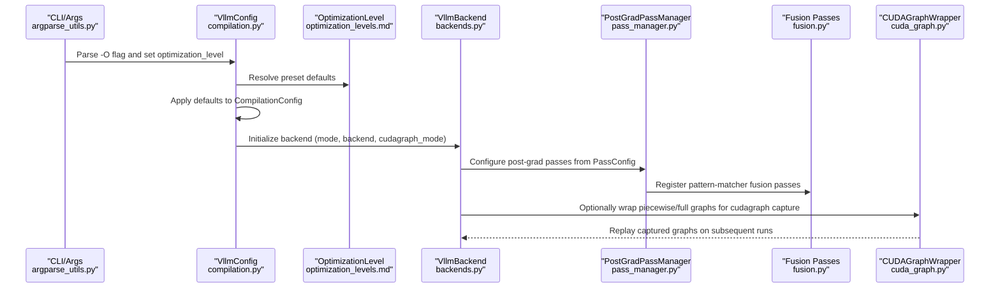
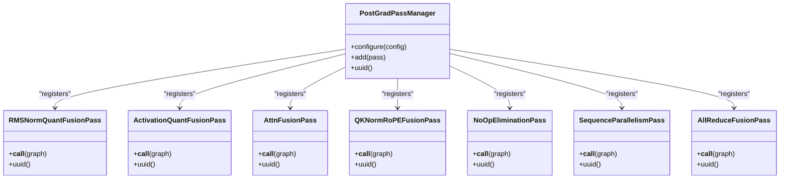
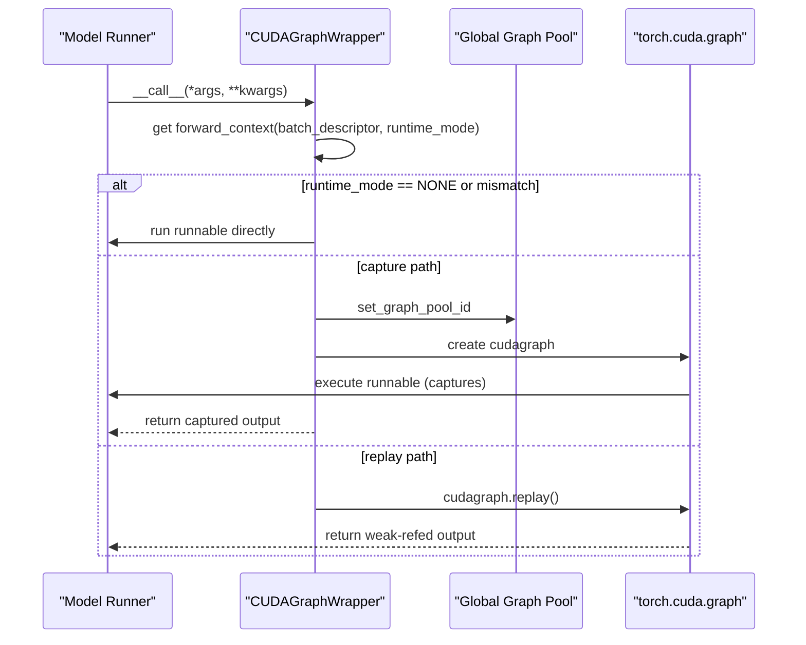
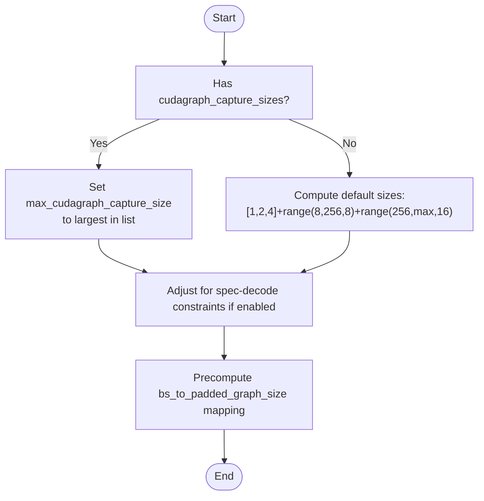
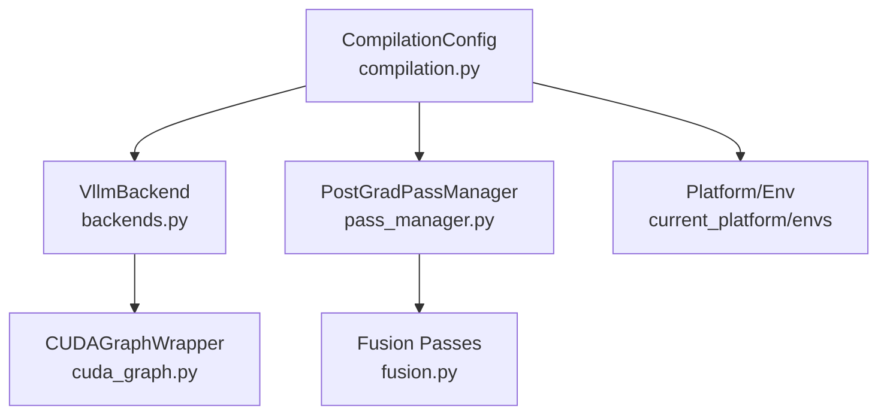

# Optimization Settings

<cite>
**Referenced Files in This Document**
- [compilation.py](file://vllm/config/compilation.py)
- [pass_manager.py](file://vllm/compilation/pass_manager.py)
- [cuda_graph.py](file://vllm/compilation/cuda_graph.py)
- [backends.py](file://vllm/compilation/backends.py)
- [fusion.py](file://vllm/compilation/fusion.py)
- [optimization_levels.md](file://docs/design/optimization_levels.md)
- [optimization.md](file://docs/configuration/optimization.md)
- [argparse_utils.py](file://vllm/utils/argparse_utils.py)
- [test_config.py](file://tests/test_config.py)
</cite>

## Table of Contents
1. [Introduction](#introduction)
2. [Project Structure](#project-structure)
3. [Core Components](#core-components)
4. [Architecture Overview](#architecture-overview)
5. [Detailed Component Analysis](#detailed-component-analysis)
6. [Dependency Analysis](#dependency-analysis)
7. [Performance Considerations](#performance-considerations)
8. [Troubleshooting Guide](#troubleshooting-guide)
9. [Conclusion](#conclusion)
10. [Appendices](#appendices)

## Introduction
This document explains vLLM’s optimization configuration system with a focus on:
- OptimizationLevel presets (-O0 to -O3) and their trade-offs between startup time and runtime performance
- Compilation configuration (CompilationMode, cudagraph modes, dynamic shapes, and inductor settings)
- How presets automatically configure compilation passes, fusion strategies, and graph capture settings
- Hardware compatibility and selection guidance for development, staging, and production
- Performance implications and tuning recommendations aligned with workload characteristics

## Project Structure
The optimization system spans configuration definitions, pass managers, cudagraph wrappers, and backend orchestration. The following diagram maps the key modules involved in optimization configuration and runtime execution.

**Diagram sources**
- [compilation.py](file://vllm/config/compilation.py#L36-L1139)
- [backends.py](file://vllm/compilation/backends.py#L1-L841)
- [pass_manager.py](file://vllm/compilation/pass_manager.py#L1-L156)
- [fusion.py](file://vllm/compilation/fusion.py#L1-L551)
- [cuda_graph.py](file://vllm/compilation/cuda_graph.py#L1-L303)
- [optimization_levels.md](file://docs/design/optimization_levels.md#L1-L69)
- [optimization.md](file://docs/configuration/optimization.md#L1-L289)
- [argparse_utils.py](file://vllm/utils/argparse_utils.py#L230-L260)
- [test_config.py](file://tests/test_config.py#L874-L907)

**Section sources**
- [compilation.py](file://vllm/config/compilation.py#L36-L1139)
- [backends.py](file://vllm/compilation/backends.py#L1-L841)
- [pass_manager.py](file://vllm/compilation/pass_manager.py#L1-L156)
- [fusion.py](file://vllm/compilation/fusion.py#L1-L551)
- [cuda_graph.py](file://vllm/compilation/cuda_graph.py#L1-L303)
- [optimization_levels.md](file://docs/design/optimization_levels.md#L1-L69)
- [optimization.md](file://docs/configuration/optimization.md#L1-L289)
- [argparse_utils.py](file://vllm/utils/argparse_utils.py#L230-L260)
- [test_config.py](file://tests/test_config.py#L874-L907)

## Core Components
- OptimizationLevel presets (-O0 to -O3) define sensible defaults for compilation and cudagraph behavior, prioritizing startup speed vs. runtime performance.
- CompilationMode controls torch.compile behavior: eager, stock torch.compile, single-trace, or vLLM’s custom Inductor-based backend.
- CUDAGraphMode governs CUDA graph capture strategies: NONE, PIECEWISE, FULL, FULL_DECODE_ONLY, FULL_AND_PIECEWISE.
- PassConfig enables or disables targeted fusion and communication passes (e.g., RMSNorm+quant, SiluMul+quant, attention+quant, sequence parallelism, allreduce fusion).
- DynamicShapesConfig controls how dynamic shapes are handled in torch.compile.
- CompilationConfig ties everything together, including cudagraph sizing, inductor compile ranges, and backend selection.

**Section sources**
- [compilation.py](file://vllm/config/compilation.py#L36-L1139)
- [optimization_levels.md](file://docs/design/optimization_levels.md#L1-L69)

## Architecture Overview
The optimization pipeline integrates preset-driven defaults with runtime graph compilation and cudagraph capture.

**Diagram sources**
- [argparse_utils.py](file://vllm/utils/argparse_utils.py#L230-L260)
- [compilation.py](file://vllm/config/compilation.py#L341-L571)
- [optimization_levels.md](file://docs/design/optimization_levels.md#L1-L69)
- [backends.py](file://vllm/compilation/backends.py#L490-L800)
- [pass_manager.py](file://vllm/compilation/pass_manager.py#L62-L156)
- [fusion.py](file://vllm/compilation/fusion.py#L477-L551)
- [cuda_graph.py](file://vllm/compilation/cuda_graph.py#L137-L303)

## Detailed Component Analysis

### OptimizationLevel Presets and Trade-offs
- -O0: Minimal compilation; likely eager or minimal torch.compile; fastest startup, lowest runtime performance.
- -O1: Enables Inductor compilation and PIECEWISE cudagraphs; balanced startup/runtime for development.
- -O2: Full optimizations; defaults to FULL_AND_PIECEWISE cudagraphs and enables fusion/noop passes; recommended for production.
- -O3: Infrastructure placeholder; currently mirrors -O2.

These presets are resolved via CLI flags and applied to CompilationConfig defaults. Explicit user settings are preserved and not overwritten.

**Section sources**
- [optimization_levels.md](file://docs/design/optimization_levels.md#L1-L69)
- [argparse_utils.py](file://vllm/utils/argparse_utils.py#L230-L260)
- [test_config.py](file://tests/test_config.py#L874-L907)

### CompilationMode and Backend Selection
- CompilationMode.NONE: Eager execution; no torch.compile.
- CompilationMode.STOCK_TORCH_COMPILE: Standard torch.compile pipeline.
- CompilationMode.DYNAMO_TRACE_ONCE: Single Dynamo trace to avoid recompilation.
- CompilationMode.VLLM_COMPILE: Custom vLLM backend with caching, piecewise compilation, shape specialization, and custom passes.

Backend selection logic:
- For stock modes, resolves registered torch backends or custom backend by qualified name.
- For VLLM_COMPILE, constructs VllmBackend and initializes cache directories and compile ranges.

**Section sources**
- [compilation.py](file://vllm/config/compilation.py#L36-L113)
- [compilation.py](file://vllm/config/compilation.py#L832-L869)
- [backends.py](file://vllm/compilation/backends.py#L52-L76)
- [backends.py](file://vllm/compilation/backends.py#L78-L115)

### CUDAGraph Modes and Runtime Dispatch
- NONE: No CUDA graph capture.
- PIECEWISE: Captures subgraphs piecewise; keeps attention and other cudagraph-unsafe ops outside cudagraphs.
- FULL: Captures full graph for all batches; may not be supported by all backends.
- FULL_DECODE_ONLY: Full capture for decode-only batches; mixed prefill/decode run without cudagraphs.
- FULL_AND_PIECEWISE: Full capture for decode batches and piecewise for prefill/mixed; default for v1.

Runtime dispatch:
- CUDAGraphWrapper selects capture/replay based on runtime_mode and batch_descriptor.
- Supports weak-ref output and optional input copying for safety/performance.

**Section sources**
- [compilation.py](file://vllm/config/compilation.py#L52-L113)
- [compilation.py](file://vllm/config/compilation.py#L465-L526)
- [cuda_graph.py](file://vllm/compilation/cuda_graph.py#L137-L303)

### PassConfig and Fusion Strategies
PassConfig toggles:
- fuse_norm_quant, fuse_act_quant, fuse_attn_quant: Fuse RMSNorm+quant, SiluMul+quant, and attention+quant.
- eliminate_noops: Enables noop elimination; warnings if fusion enabled without it.
- enable_sp, fuse_gemm_comms, fuse_allreduce_rms: Sequence parallelism and allreduce fusion.
- enable_qk_norm_rope_fusion: QK-Norm+RoPE fusion; platform-aware disabling.

PostGradPassManager assembles passes conditionally based on PassConfig and platform:
- NoOp elimination
- Sequence parallelism and async TP fusion
- Allreduce fusion
- RMSNorm+quant, SiluMul+quant, attention+quant fusions
- QK-Norm+RoPE fusion
- Post cleanup and functionalization fixes

Pattern matcher-based fusions (e.g., RMSNorm+quant) are registered and applied during post-grad pass phase.

**Section sources**
- [compilation.py](file://vllm/config/compilation.py#L100-L188)
- [pass_manager.py](file://vllm/compilation/pass_manager.py#L62-L156)
- [fusion.py](file://vllm/compilation/fusion.py#L477-L551)

### Dynamic Shapes Control
DynamicShapesConfig offers:
- BACKED: Default guarded specialization
- UNBACKED: No guards (soundness-focused)
- BACKED_SIZE_OBLIVIOUS: Experimental safer alternative

Evaluate-guards mode can be used to detect and fail on dynamic shape guards, with constraints on AOT compile and bytecode hook usage.

**Section sources**
- [compilation.py](file://vllm/config/compilation.py#L233-L290)

### Compilation Ranges and Inductor Configuration
- compile_ranges_split_points defines compile ranges for inductor; overlapping ranges prioritize compile sizes.
- inductor_compile_config and inductor_passes allow injecting additional Inductor passes and configuration.
- compile_sizes and cudagraph_capture_sizes are reconciled; defaults are auto-computed to balance startup and memory.

**Section sources**
- [compilation.py](file://vllm/config/compilation.py#L432-L511)
- [compilation.py](file://vllm/config/compilation.py#L1115-L1139)
- [backends.py](file://vllm/compilation/backends.py#L198-L286)

### Piecewise Compilation and Graph Partitioning
- split_graph partitions FX graphs at specified ops for cudagraph-safe regions.
- PiecewiseCompileInterpreter replaces submodules with piecewise backends and optionally wraps them with CUDAGraphWrapper for PIECEWISE mode.
- use_inductor_graph_partition defers partitioning to Inductor codegen time when supported.

**Section sources**
- [backends.py](file://vllm/compilation/backends.py#L296-L354)
- [backends.py](file://vllm/compilation/backends.py#L358-L461)
- [backends.py](file://vllm/compilation/backends.py#L501-L581)

### Class Relationships for Passes and Fusion

**Diagram sources**
- [pass_manager.py](file://vllm/compilation/pass_manager.py#L62-L156)
- [fusion.py](file://vllm/compilation/fusion.py#L477-L551)

### Sequence of CUDAGraph Capture and Replay

**Diagram sources**
- [cuda_graph.py](file://vllm/compilation/cuda_graph.py#L205-L303)

### Algorithm for CUDAGraph Size Selection

**Diagram sources**
- [compilation.py](file://vllm/config/compilation.py#L550-L600)
- [compilation.py](file://vllm/config/compilation.py#L1115-L1139)

## Dependency Analysis
- CompilationConfig depends on platform detection and environment variables to choose defaults and backends.
- VllmBackend orchestrates split_graph, pass_manager configuration, and cudagraph wrapping.
- PassManager composes platform-specific passes and fusion patterns.
- CUDAGraphWrapper is platform-agnostic but relies on platform-provided static graph wrapper classes.

**Diagram sources**
- [compilation.py](file://vllm/config/compilation.py#L341-L571)
- [backends.py](file://vllm/compilation/backends.py#L490-L800)
- [pass_manager.py](file://vllm/compilation/pass_manager.py#L62-L156)
- [fusion.py](file://vllm/compilation/fusion.py#L477-L551)
- [cuda_graph.py](file://vllm/compilation/cuda_graph.py#L137-L303)

**Section sources**
- [compilation.py](file://vllm/config/compilation.py#L341-L571)
- [backends.py](file://vllm/compilation/backends.py#L490-L800)
- [pass_manager.py](file://vllm/compilation/pass_manager.py#L62-L156)
- [fusion.py](file://vllm/compilation/fusion.py#L477-L551)
- [cuda_graph.py](file://vllm/compilation/cuda_graph.py#L137-L303)

## Performance Considerations
- Startup time vs. runtime performance: Lower optimization levels (-O0, -O1) reduce startup by minimizing compilation and cudagraph capture; higher levels (-O2, -O3) invest more in compilation and fusion for throughput.
- CUDAGraphMode.FULL_AND_PIECEWISE typically yields the best runtime performance for most models; however, it increases startup time due to capturing many subgraphs.
- Fusion passes reduce kernel launches and memory traffic but require careful coordination with noop elimination and platform-specific ops.
- Dynamic shapes: UNBACKED mode avoids guards but may introduce data-dependent errors; BACKED mode is default; BACKED_SIZE_OBLIVIOUS is experimental.
- Inductor compile ranges: Narrow ranges can improve specialization; overlapping ranges prioritize compile sizes.

[No sources needed since this section provides general guidance]

## Troubleshooting Guide
Common issues and remedies:
- Startup time too long: Use -O0 or -O1 to reduce compilation and cudagraph capture overhead.
- Compilation errors: Enable debug dumping via debug_dump_path and review artifacts.
- Performance issues: Ensure -O2 for production; verify cudagraph_mode and fusion flags are enabled appropriately.
- Dynamic shape guard failures: Switch to evaluate_guards mode for debugging guarded specializations.

**Section sources**
- [optimization_levels.md](file://docs/design/optimization_levels.md#L63-L69)
- [compilation.py](file://vllm/config/compilation.py#L341-L571)

## Conclusion
vLLM’s optimization system provides a layered approach to trading startup time for runtime performance. OptimizationLevel presets encode sensible defaults for common scenarios, while CompilationConfig exposes granular controls over compilation modes, cudagraph capture, dynamic shapes, and fusion passes. By aligning these settings with workload characteristics and hardware capabilities, users can achieve strong performance across development, staging, and production environments.

[No sources needed since this section summarizes without analyzing specific files]

## Appendices

### Appendix A: OptimizationLevel Preset Defaults Mapping
- -O0: Eager or minimal compilation; minimal cudagraph capture.
- -O1: Inductor compilation + PIECEWISE cudagraphs; balanced startup/runtime.
- -O2: Full optimizations; FULL_AND_PIECEWISE cudagraphs; enables fusion/noop passes.
- -O3: Placeholder mirroring -O2.

Verification of preset defaults is performed in tests to ensure pass_config and compilation_config fields are correctly populated.

**Section sources**
- [optimization_levels.md](file://docs/design/optimization_levels.md#L1-L69)
- [test_config.py](file://tests/test_config.py#L874-L907)