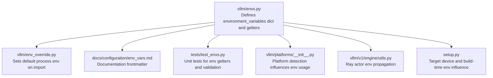
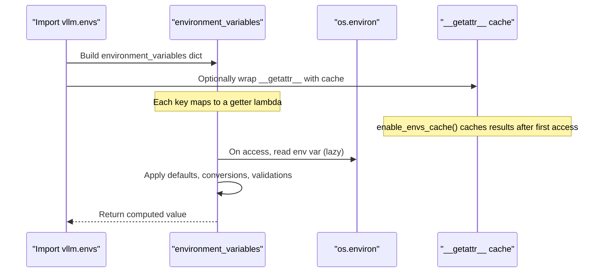
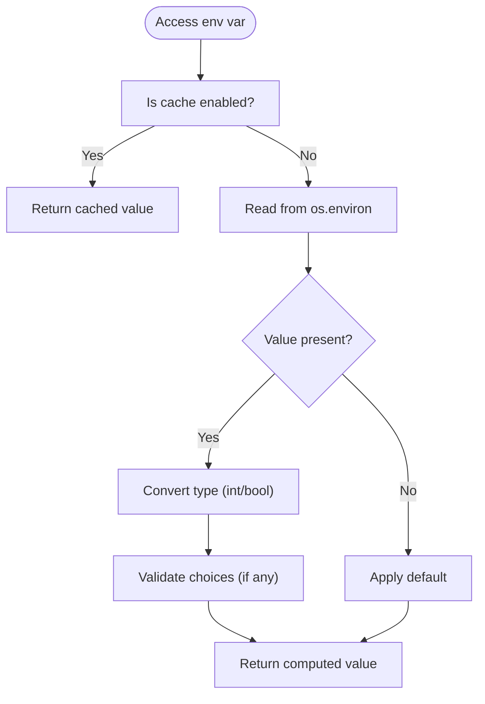
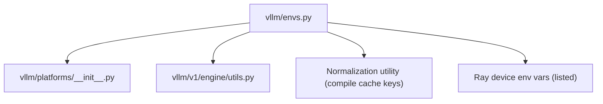

# Environment Variables

<cite>
**Referenced Files in This Document**
- [envs.py](file://vllm/envs.py)
- [env_override.py](file://vllm/env_override.py)
- [env_vars.md](file://docs/configuration/env_vars.md)
- [test_envs.py](file://tests/test_envs.py)
- [platforms/__init__.py](file://vllm/platforms/__init__.py)
- [v1/engine/utils.py](file://vllm/v1/engine/utils.py)
- [setup.py](file://setup.py)
</cite>

## Table of Contents
1. [Introduction](#introduction)
2. [Project Structure](#project-structure)
3. [Core Components](#core-components)
4. [Architecture Overview](#architecture-overview)
5. [Detailed Component Analysis](#detailed-component-analysis)
6. [Dependency Analysis](#dependency-analysis)
7. [Performance Considerations](#performance-considerations)
8. [Troubleshooting Guide](#troubleshooting-guide)
9. [Conclusion](#conclusion)
10. [Appendices](#appendices)

## Introduction
This document explains vLLM’s environment variables and how they are evaluated, validated, and applied. It focuses on the variables documented in the repository, including VLLM_HOST, VLLM_PORT, VLLM_TORCH_EXTENSIONS_DIR, VLLM_CONFIGURE_LOGGING, VLLM_TRACE_FUNCTION, and hardware-specific variables. It also covers variable precedence, override mechanisms, validation rules, and practical deployment scenarios. Security considerations and best practices for managing environment variables are included.

## Project Structure
The environment variable system is centralized in a single module that defines defaults, validation helpers, and lazy evaluation. Supporting files include documentation, tests, and platform detection logic.

**Diagram sources**
- [envs.py](file://vllm/envs.py#L448-L1576)
- [env_override.py](file://vllm/env_override.py#L1-L30)
- [env_vars.md](file://docs/configuration/env_vars.md#L1-L13)
- [test_envs.py](file://tests/test_envs.py#L1-L120)
- [platforms/__init__.py](file://vllm/platforms/__init__.py#L101-L143)
- [v1/engine/utils.py](file://vllm/v1/engine/utils.py#L303-L314)
- [setup.py](file://setup.py#L592-L633)

**Section sources**
- [envs.py](file://vllm/envs.py#L448-L1576)
- [env_override.py](file://vllm/env_override.py#L1-L30)
- [env_vars.md](file://docs/configuration/env_vars.md#L1-L13)
- [test_envs.py](file://tests/test_envs.py#L1-L120)
- [platforms/__init__.py](file://vllm/platforms/__init__.py#L101-L143)
- [v1/engine/utils.py](file://vllm/v1/engine/utils.py#L303-L314)
- [setup.py](file://setup.py#L592-L633)

## Core Components
- Centralized environment variable registry: A dictionary maps each variable name to a getter that reads from the process environment, applies defaults, and performs validation.
- Validation helpers:
  - env_with_choices: Validates a single string against a fixed or dynamic set of allowed values.
  - env_list_with_choices: Parses comma-separated values and validates each element.
  - env_set_with_choices: Same as above but returns a set.
- Lazy evaluation and caching: Access to environment variables is lazy and can be cached to reduce repeated reads.
- Override behavior: The module reads from os.environ at access time; there is no explicit “higher/lower” precedence layer beyond the presence of the environment variable itself.

Key behaviors:
- Numeric variables are converted to int when applicable.
- Boolean variables are evaluated using integer truthiness.
- Some variables accept only specific string choices; invalid values raise errors.
- Certain variables are used for platform/device selection and distributed setups.

**Section sources**
- [envs.py](file://vllm/envs.py#L298-L414)
- [envs.py](file://vllm/envs.py#L1579-L1632)
- [test_envs.py](file://tests/test_envs.py#L98-L193)
- [test_envs.py](file://tests/test_envs.py#L194-L300)
- [test_envs.py](file://tests/test_envs.py#L301-L406)

## Architecture Overview
The environment variable system is a thin abstraction layer over os.environ. It centralizes defaults, validation, and conversion, and exposes attributes via a lazy accessor. Platform detection and Ray integration influence how environment variables are propagated and interpreted.

**Diagram sources**
- [envs.py](file://vllm/envs.py#L448-L1576)
- [envs.py](file://vllm/envs.py#L1579-L1632)

## Detailed Component Analysis

### Variable Registry and Evaluation
- The registry defines getters for each variable. Each getter:
  - Reads from os.environ.
  - Applies defaults if not present.
  - Converts types (int, bool) when applicable.
  - Validates choices via helper functions.
- Access to variables is lazy; values are recomputed unless caching is enabled.
- Caching can be enabled globally to improve performance after service initialization.

Validation helpers:
- env_with_choices: Single value validation with case sensitivity option.
- env_list_with_choices: Comma-separated list validation with trimming and filtering.
- env_set_with_choices: Same as list but returns a set.

**Section sources**
- [envs.py](file://vllm/envs.py#L448-L1576)
- [envs.py](file://vllm/envs.py#L298-L414)
- [envs.py](file://vllm/envs.py#L1579-L1632)

### Variable Precedence and Override Mechanisms
- There is no explicit precedence layer beyond the presence of the environment variable. The module reads from os.environ at access time.
- Tests demonstrate:
  - Values set before enabling cache remain frozen after cache is enabled.
  - Disabling cache syncs values with the current os.environ.
- Platform and Ray integration:
  - Platform detection selects platform plugins based on device availability.
  - Ray actor creation injects device-related environment variables into the runtime environment.

**Section sources**
- [test_envs.py](file://tests/test_envs.py#L20-L79)
- [test_envs.py](file://tests/test_envs.py#L60-L79)
- [platforms/__init__.py](file://vllm/platforms/__init__.py#L101-L143)
- [v1/engine/utils.py](file://vllm/v1/engine/utils.py#L303-L314)

### Validation Rules
- env_with_choices:
  - Accepts default=None or a provided default.
  - Validates against a static or dynamic list of choices.
  - Case-sensitive by default; can be configured otherwise.
- env_list_with_choices and env_set_with_choices:
  - Parse comma-separated values, trim whitespace, filter empty values.
  - Validate each element against allowed choices.
  - Sets deduplicate values; lists preserve duplicates.

**Section sources**
- [envs.py](file://vllm/envs.py#L298-L414)
- [test_envs.py](file://tests/test_envs.py#L194-L300)
- [test_envs.py](file://tests/test_envs.py#L301-L406)

### Variable Reference and Examples

#### Host and Networking
- VLLM_HOST_IP: Host IP for distributed use when multiple interfaces exist. Defaults to empty string.
- VLLM_PORT: Port for internal usage. Accepts integer; invalid values raise errors. When set to a URI, a specific error is raised to help diagnose Kubernetes service discovery issues.

Practical notes:
- The documentation warns that VLLM_PORT/VLLM_HOST_IP are for internal usage, not the API server host/port.

**Section sources**
- [envs.py](file://vllm/envs.py#L521-L535)
- [envs.py](file://vllm/envs.py#L416-L444)
- [env_vars.md](file://docs/configuration/env_vars.md#L1-L13)

#### Logging and Tracing
- VLLM_CONFIGURE_LOGGING: Controls whether logging is configured. Defaults to enabled.
- VLLM_LOGGING_LEVEL: Default logging level string.
- VLLM_LOGGING_STREAM: Default logging stream target.
- VLLM_LOGGING_PREFIX: Optional prefix for log messages.
- VLLM_LOGGING_CONFIG_PATH: Optional path to a logging configuration file.
- VLLM_LOGGING_COLOR: Controls colored output; accepts “auto”, “1”, or “0”.
- NO_COLOR: Unix-style flag to disable ANSI colors.
- VLLM_LOG_STATS_INTERVAL: Stats logging interval in seconds; must be positive.
- VLLM_TRACE_FUNCTION: Integer flag to enable function tracing.

**Section sources**
- [envs.py](file://vllm/envs.py#L635-L662)

#### Hardware and Device Selection
- VLLM_TARGET_DEVICE: Target device for vLLM. Supported values include “cuda”, “rocm”, “cpu”. Defaults to “cuda”.
- VLLM_MAIN_CUDA_VERSION: Main CUDA version string used by vLLM. Defaults to a specific value if not set.
- LOCAL_RANK: Local rank in distributed settings; used to select GPU device ID.
- CUDA_VISIBLE_DEVICES: Controls which devices are visible to the process.
- Platform detection:
  - CUDA: Detected via platform plugin.
  - ROCm: Detected via AMD SMI initialization.
  - XPU: Detected via Intel extensions and XCCL/CCL support.

Build-time influence:
- setup.py detects target device and build flags that affect custom ops and version checks.

**Section sources**
- [envs.py](file://vllm/envs.py#L454-L460)
- [envs.py](file://vllm/envs.py#L598-L603)
- [platforms/__init__.py](file://vllm/platforms/__init__.py#L101-L143)
- [setup.py](file://setup.py#L592-L633)

#### ROCm-Specific Variables
- VLLM_ROCM_USE_AITER_* and related toggles: Enable/disable specific ROCm aiter kernels and optimizations.
- VLLM_ROCM_QUICK_REDUCE_*: Configure quick allreduce behavior and thresholds for ROCm.
- VLLM_ROCM_SLEEP_MEM_CHUNK_SIZE: Chunk size for sleeping memory allocations under ROCm.

**Section sources**
- [envs.py](file://vllm/envs.py#L928-L1031)

#### Logging and Debugging Flags
- VLLM_DEBUG_DUMP_PATH: Overrides compilation debug dump path.
- VLLM_PATTERN_MATCH_DEBUG: Enables debug pattern matching for custom passes.
- VLLM_DEBUG_WORKSPACE: Logs workspace resize operations.
- VLLM_GC_DEBUG: Controls garbage collection debugging verbosity.
- VLLM_DEBUG_MFU_METRICS: Debug logging for MFU metrics.

**Section sources**
- [envs.py](file://vllm/envs.py#L577-L585)
- [envs.py](file://vllm/envs.py#L1537-L1573)

#### Performance Tuning and Backend Selection
- VLLM_ATTENTION_BACKEND: Chooses attention backend from an enumerated set.
- VLLM_FLASH_ATTN_VERSION: Forces a specific FlashAttention version when using the flash-attention backend.
- VLLM_USE_FLASHINFER_SAMPLER: Enables FlashInfer sampler when set.
- VLLM_USE_CUDNN_PREFILL: Enables cudnn prefill.
- VLLM_USE_TRTLLM_ATTENTION: Enables TRTLLM attention in FlashInfer when set.
- VLLM_FLASHINFER_WORKSPACE_BUFFER_SIZE: Workspace buffer size for FlashInfer.
- VLLM_NVFP4_GEMM_BACKEND: Selects GEMM backend for NVFP4.

**Section sources**
- [envs.py](file://vllm/envs.py#L662-L687)
- [envs.py](file://vllm/envs.py#L565-L570)
- [envs.py](file://vllm/envs.py#L1380-L1414)

#### Distributed and Multiprocessing
- VLLM_DP_RANK, VLLM_DP_RANK_LOCAL, VLLM_DP_SIZE, VLLM_DP_MASTER_IP, VLLM_DP_MASTER_PORT: Data parallel configuration.
- VLLM_MOE_DP_CHUNK_SIZE, VLLM_ENABLE_MOE_DP_CHUNK: MoE data parallel chunking controls.
- VLLM_USE_RAY_COMPILED_DAG_CHANNEL_TYPE, VLLM_USE_RAY_COMPILED_DAG_OVERLAP_COMM, VLLM_USE_RAY_WRAPPED_PP_COMM: Ray Compiled DAG settings.
- VLLM_WORKER_MULTIPROC_METHOD: Multiprocessing start method (“fork” or “spawn”).
- VLLM_ENABLE_V1_MULTIPROCESSING: Enables multiprocessing in V1 code path.

**Section sources**
- [envs.py](file://vllm/envs.py#L1076-L1106)
- [envs.py](file://vllm/envs.py#L1117-L1136)
- [envs.py](file://vllm/envs.py#L706-L731)
- [envs.py](file://vllm/envs.py#L1037-L1041)

#### Model and Cache Locations
- VLLM_CACHE_ROOT: Root directory for vLLM cache files. Defaults to ~/.cache/vllm unless XDG_CACHE_HOME is set.
- VLLM_CONFIG_ROOT: Root directory for vLLM configuration files. Defaults to ~/.config/vllm unless XDG_CONFIG_HOME is set.
- VLLM_ASSETS_CACHE: Path to the cache for downloaded assets.
- VLLM_XLA_CACHE_PATH: Path to the XLA persistent cache directory (TPU/XPU).

**Section sources**
- [envs.py](file://vllm/envs.py#L512-L520)
- [envs.py](file://vllm/envs.py#L502-L511)
- [envs.py](file://vllm/envs.py#L732-L743)
- [envs.py](file://vllm/envs.py#L792-L800)

#### Security and Privacy
- VLLM_API_KEY: API key for the API server.
- VLLM_DO_NOT_TRACK, VLLM_NO_USAGE_STATS, VLLM_USAGE_STATS_SERVER: Privacy and telemetry controls.
- VLLM_ALLOW_INSECURE_SERIALIZATION: Enables insecure pickle-based serialization when needed.

**Section sources**
- [envs.py](file://vllm/envs.py#L607-L618)
- [envs.py](file://vllm/envs.py#L618-L634)
- [envs.py](file://vllm/envs.py#L1248-L1253)

#### Deployment Scenarios

- Containerized deployments:
  - Set VLLM_TARGET_DEVICE to the desired backend (e.g., “cuda”).
  - Configure VLLM_CACHE_ROOT and VLLM_CONFIG_ROOT to writable paths inside the container.
  - Use VLLM_PORT and VLLM_HOST_IP for internal networking; ensure container ports are mapped appropriately.
  - For ROCm containers, enable ROCm-specific variables as needed.

- Cloud environments:
  - Use VLLM_TARGET_DEVICE and platform detection to select the correct backend.
  - Set CUDA_VISIBLE_DEVICES or platform-specific device selectors if needed.
  - Configure VLLM_ATTENTION_BACKEND and related performance variables to match accelerator capabilities.

- Local development:
  - Enable VLLM_CONFIGURE_LOGGING and adjust VLLM_LOGGING_LEVEL for visibility.
  - Use VLLM_TRACE_FUNCTION for targeted debugging.
  - For ROCm development, tune VLLM_ROCM_USE_AITER_* and VLLM_ROCM_QUICK_REDUCE_* variables.

[No sources needed since this subsection synthesizes previously cited sections]

### Conceptual Overview
The environment variable system is a thin wrapper over os.environ with validation and defaults. Platform detection and Ray integration influence runtime behavior. Tests confirm caching semantics and validation behavior.

[No sources needed since this diagram shows conceptual workflow, not actual code structure]

## Dependency Analysis
- Internal dependencies:
  - envs.py imports platform detection and Ray runtime utilities to propagate device-related environment variables.
  - envs.py uses a normalization utility for compile cache keys and integrates with Ray’s device visibility environment variables.
- External dependencies:
  - Platform detection relies on vendor libraries (e.g., AMD SMI) and device backends (CUDA, ROCm, XPU).
  - Ray runtime environment variables are considered when computing compile cache keys.

**Diagram sources**
- [envs.py](file://vllm/envs.py#L1641-L1751)
- [platforms/__init__.py](file://vllm/platforms/__init__.py#L101-L143)
- [v1/engine/utils.py](file://vllm/v1/engine/utils.py#L303-L314)

**Section sources**
- [envs.py](file://vllm/envs.py#L1641-L1751)

## Performance Considerations
- Enable caching after service initialization to avoid repeated environment reads.
- Choose attention backends and related variables appropriate for the accelerator to maximize throughput.
- Tune workspace and buffer sizes for FlashInfer and related backends.
- Use multiprocessing settings judiciously; enabling multiprocessing can improve throughput but may increase memory footprint.

[No sources needed since this section provides general guidance]

## Troubleshooting Guide
Common issues and remedies:
- VLLM_PORT set to a URI:
  - Symptom: Error indicating VLLM_PORT looks like a URI.
  - Cause: Misconfiguration with Kubernetes service discovery.
  - Fix: Set VLLM_PORT to a plain integer port number.

- Invalid attention backend or other choice-based variables:
  - Symptom: ValueError indicating invalid value for the environment variable.
  - Cause: Value not in the allowed set.
  - Fix: Use one of the documented choices.

- Logging not configured:
  - Symptom: No logs or unexpected log behavior.
  - Cause: VLLM_CONFIGURE_LOGGING disabled or misconfigured logging level/stream.
  - Fix: Enable VLLM_CONFIGURE_LOGGING and adjust VLLM_LOGGING_LEVEL/VLLM_LOGGING_STREAM.

- Device selection issues:
  - Symptom: Wrong device selected or Ray actor device mismatch.
  - Cause: Missing or incorrect device visibility environment variables.
  - Fix: Ensure platform detection succeeds and device env vars are propagated to Ray actors.

**Section sources**
- [envs.py](file://vllm/envs.py#L416-L444)
- [envs.py](file://vllm/envs.py#L635-L662)
- [test_envs.py](file://tests/test_envs.py#L408-L457)
- [platforms/__init__.py](file://vllm/platforms/__init__.py#L101-L143)
- [v1/engine/utils.py](file://vllm/v1/engine/utils.py#L303-L314)

## Conclusion
vLLM’s environment variable system centralizes configuration with defaults, validation, and lazy evaluation. Platform detection and Ray integration influence runtime behavior. For robust deployments, validate inputs, enable caching after initialization, and tailor device and performance variables to your hardware and workload.

[No sources needed since this section summarizes without analyzing specific files]

## Appendices

### Appendix A: Variable Precedence and Override Mechanisms
- Precedence: Presence of the environment variable overrides defaults. There is no explicit “higher/lower” precedence layer.
- Override behavior:
  - Without caching: Values reflect the current os.environ at access time.
  - With caching: Values are frozen after cache enablement; disable cache to sync with current environment.

**Section sources**
- [test_envs.py](file://tests/test_envs.py#L20-L79)
- [test_envs.py](file://tests/test_envs.py#L60-L79)

### Appendix B: Security Best Practices
- Protect sensitive variables (e.g., VLLM_API_KEY) with secrets management.
- Prefer least privilege for cache/config directories (VLLM_CACHE_ROOT, VLLM_CONFIG_ROOT).
- Avoid enabling VLLM_ALLOW_INSECURE_SERIALIZATION outside trusted environments.
- Review privacy flags (VLLM_DO_NOT_TRACK, VLLM_NO_USAGE_STATS) according to policy.

**Section sources**
- [envs.py](file://vllm/envs.py#L607-L618)
- [envs.py](file://vllm/envs.py#L1248-L1253)