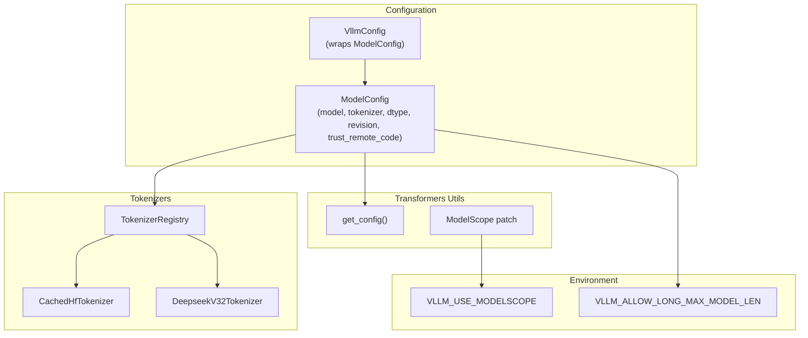
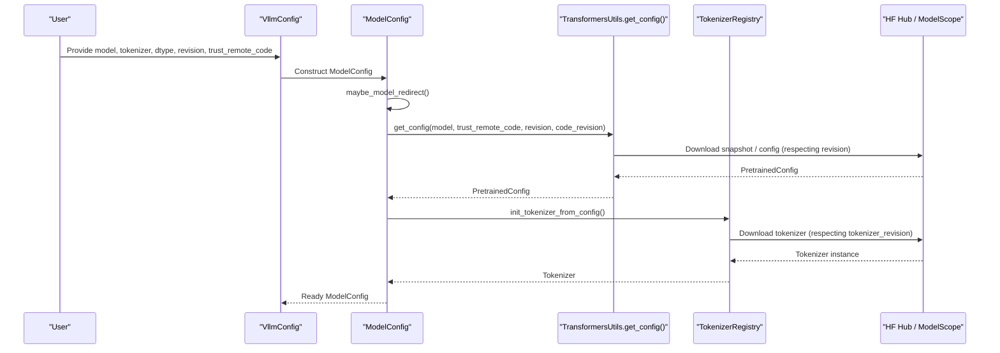
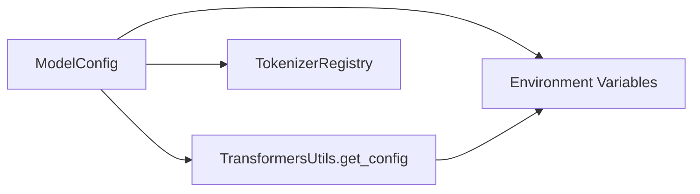

# Basic Model Parameters

<cite>
**Referenced Files in This Document**
- [model.py](file://vllm/config/model.py)
- [envs.py](file://vllm/envs.py)
- [__init__.py](file://vllm/transformers_utils/__init__.py)
- [config.py](file://vllm/transformers_utils/config.py)
- [model_resolution.md](file://docs/configuration/model_resolution.md)
- [serving_engine.py](file://vllm/entrypoints/openai/serving_engine.py)
- [deepseek_v32.py](file://vllm/tokenizers/deepseek_v32.py)
- [vllm.py](file://vllm/config/vllm.py)
</cite>

## Table of Contents
1. [Introduction](#introduction)
2. [Project Structure](#project-structure)
3. [Core Components](#core-components)
4. [Architecture Overview](#architecture-overview)
5. [Detailed Component Analysis](#detailed-component-analysis)
6. [Dependency Analysis](#dependency-analysis)
7. [Performance Considerations](#performance-considerations)
8. [Troubleshooting Guide](#troubleshooting-guide)
9. [Conclusion](#conclusion)
10. [Appendices](#appendices)

## Introduction
This document explains the basic model configuration parameters in vLLM with a focus on:
- How to specify the model path or Hugging Face model ID
- How to configure the tokenizer and tokenizer modes
- How dtype selection works and its performance implications
- How model loading strategies, revisions, and trust_remote_code operate
- Practical examples and troubleshooting guidance for model resolution issues

The goal is to help both new and experienced users configure models reliably and efficiently.

## Project Structure
The relevant configuration and runtime logic for basic model parameters resides primarily in:
- Model configuration class and dtype resolution
- Environment variables affecting model loading behavior
- Transformers utilities for config loading and remote repositories
- Tokenizer-specific implementations and selection logic
- Serving integration for tokenizer modes

**Diagram sources**
- [model.py](file://vllm/config/model.py#L96-L277)
- [vllm.py](file://vllm/config/vllm.py#L1294-L1315)
- [config.py](file://vllm/transformers_utils/config.py#L538-L561)
- [__init__.py](file://vllm/transformers_utils/__init__.py#L6-L27)
- [envs.py](file://vllm/envs.py#L512-L541)

**Section sources**
- [model.py](file://vllm/config/model.py#L96-L277)
- [vllm.py](file://vllm/config/vllm.py#L1294-L1315)
- [config.py](file://vllm/transformers_utils/config.py#L538-L561)
- [__init__.py](file://vllm/transformers_utils/__init__.py#L6-L27)
- [envs.py](file://vllm/envs.py#L512-L541)

## Core Components
- Model path specification
  - The model field accepts either a Hugging Face model ID (e.g., an org/name string) or a local path. The tokenizer defaults to the same value as the model if not explicitly set.
- Tokenizer configuration and modes
  - tokenizer_mode supports multiple modes: auto, hf, slow, mistral, deepseek_v32, and custom via plugins. The default is auto.
- dtype selection
  - dtype supports auto, half, float16, bfloat16, float, float32. auto chooses a suitable precision based on model config and platform capabilities.
- Model loading strategies, revision handling, and trust_remote_code
  - Model and tokenizer can be pinned to a specific revision. trust_remote_code controls whether to execute remote code during config loading.
- Additional model resolution options
  - hf_overrides allows overriding config fields (e.g., architectures) to resolve ambiguous or unofficial repos.

**Section sources**
- [model.py](file://vllm/config/model.py#L101-L167)
- [model.py](file://vllm/config/model.py#L112-L127)
- [model.py](file://vllm/config/model.py#L127-L136)
- [model.py](file://vllm/config/model.py#L156-L167)
- [model.py](file://vllm/config/model.py#L239-L242)

## Architecture Overview
The model configuration orchestrates how vLLM resolves and loads models and tokenizers, including revision-aware downloads, optional ModelScope integration, and tokenizer mode selection.

**Diagram sources**
- [vllm.py](file://vllm/config/vllm.py#L1294-L1315)
- [model.py](file://vllm/config/model.py#L418-L467)
- [config.py](file://vllm/transformers_utils/config.py#L538-L561)
- [__init__.py](file://vllm/transformers_utils/__init__.py#L6-L27)

## Detailed Component Analysis

### Model Path Specification and Resolution
- Accepts Hugging Face model IDs (e.g., org/model-name) or local paths.
- Tokenizer defaults to the same path/ID as the model if not explicitly provided.
- Redirects can be applied to the model and tokenizer using internal redirect logic.
- Revision and code_revision allow pinning to specific commits/tags/branches for both model and tokenizer.

Practical guidance:
- Prefer explicit local paths when working offline or with custom artifacts.
- Use Hugging Face model IDs for latest compatible releases.
- Pin revisions when stability is required.

**Section sources**
- [model.py](file://vllm/config/model.py#L101-L115)
- [model.py](file://vllm/config/model.py#L112-L115)
- [model.py](file://vllm/config/model.py#L156-L167)
- [model.py](file://vllm/config/model.py#L418-L424)

### Tokenizer Modes and Use Cases
- auto: Uses mistral_common for Mistral models if available; otherwise falls back to hf.
- hf: Fast tokenizer if available; otherwise falls back to slow.
- slow: Forces the slow tokenizer.
- mistral: Forces the tokenizer from mistral_common.
- deepseek_v32: Forces the tokenizer from the DeepseekV32 implementation.
- Plugins: Custom modes are supported via tokenizer registry plugins.

Integration highlights:
- Serving logic selects tokenizer implementations depending on the chosen mode and model type.

**Section sources**
- [model.py](file://vllm/config/model.py#L112-L123)
- [serving_engine.py](file://vllm/entrypoints/openai/serving_engine.py#L1132-L1166)
- [deepseek_v32.py](file://vllm/tokenizers/deepseek_v32.py#L16-L36)

### Dtype Selection and Performance Implications
- Supported values: auto, half, float16, bfloat16, float, float32.
- auto chooses a default dtype based on model type and platform support.
- Casting rules:
  - Upcasting to float32 is allowed (e.g., from float16/bfloat16).
  - Downcasting from float32 is allowed (e.g., to float16/bfloat16).
  - Casting between float16 and bfloat16 is allowed with a warning.
- Head dtype can be configured per model; pooling runners may default to float32 for head layers.

Performance considerations:
- Lower precision (float16/bfloat16) typically reduces memory footprint and can improve throughput.
- float32 increases accuracy at the cost of higher memory and compute usage.
- Platform support varies; unsupported dtypes fall back to supported alternatives.

**Section sources**
- [model.py](file://vllm/config/model.py#L127-L136)
- [model.py](file://vllm/config/model.py#L1965-L2007)
- [model.py](file://vllm/config/model.py#L2010-L2032)

### Model Loading Strategies, Revisions, and trust_remote_code
- Model and tokenizer loading:
  - get_config loads the model’s PretrainedConfig respecting trust_remote_code, revision, and code_revision.
  - Tokenizer loading respects tokenizer_revision.
- Remote repositories:
  - ModelScope integration can be enabled via environment variable to accelerate downloads.
- Revision handling:
  - revision pins the model version.
  - code_revision pins the model code version.
  - tokenizer_revision pins the tokenizer version independently.

**Section sources**
- [config.py](file://vllm/transformers_utils/config.py#L538-L561)
- [model.py](file://vllm/config/model.py#L156-L167)
- [__init__.py](file://vllm/transformers_utils/__init__.py#L6-L27)
- [envs.py](file://vllm/envs.py#L536-L541)

### Model Resolution Options and Overrides
- If the model’s config.json lacks architectures or the architecture is ambiguous/unofficial, resolution may fail.
- Use hf_overrides to explicitly set architecture or other config fields to guide resolution.
- The supported models list enumerates recognized architectures.

**Section sources**
- [model_resolution.md](file://docs/configuration/model_resolution.md#L1-L24)
- [model.py](file://vllm/config/model.py#L239-L242)

### Common Model Types and Examples
Below are typical scenarios described conceptually. Replace placeholders with your actual model identifiers or paths.

- Hugging Face model ID (latest compatible):
  - Set model to an org/name string (e.g., org/model-name).
  - Leave tokenizer unset to inherit from model.
- Local path:
  - Set model to a local directory containing model files.
  - Optionally set tokenizer to a local tokenizer directory.
- Revisioned model:
  - Set revision to a branch/tag/commit to pin the model version.
  - Set tokenizer_revision to pin the tokenizer version.
- Trust remote code:
  - Set trust_remote_code to True when the model requires executing remote code during config loading.
- Tokenizer mode:
  - Use tokenizer_mode=mistral for Mistral models requiring mistral_common.
  - Use tokenizer_mode=deepseek_v32 for Deepseek V3.2 models.
- Dtype:
  - Use dtype=auto for platform-appropriate defaults.
  - Use dtype=float16 or bfloat16 for memory/performance gains.
  - Use dtype=float32 for maximum precision.

[No sources needed since this section provides conceptual usage guidance]

## Dependency Analysis
The following diagram shows how ModelConfig depends on Transformers utilities and environment variables for model loading and tokenizer selection.

**Diagram sources**
- [model.py](file://vllm/config/model.py#L458-L467)
- [config.py](file://vllm/transformers_utils/config.py#L538-L561)
- [envs.py](file://vllm/envs.py#L536-L541)

**Section sources**
- [model.py](file://vllm/config/model.py#L458-L467)
- [config.py](file://vllm/transformers_utils/config.py#L538-L561)
- [envs.py](file://vllm/envs.py#L536-L541)

## Performance Considerations
- Precision trade-offs:
  - float16 and bfloat16 reduce memory bandwidth and increase throughput on compatible hardware.
  - float32 improves numerical stability and accuracy at higher memory cost.
- Sliding window and max_model_len:
  - Enabling or disabling sliding window affects memory and sequence length limits.
  - Exceeding derived max_model_len can cause instability or out-of-bounds errors unless explicitly allowed.
- Attention backends and platform support:
  - Platform capabilities influence dtype support and kernel availability.

[No sources needed since this section provides general guidance]

## Troubleshooting Guide
- Model resolution fails:
  - Symptom: Cannot load model due to missing architectures or ambiguous architecture names.
  - Fix: Provide hf_overrides to explicitly set architectures or other fields.
- Remote code requirement:
  - Symptom: Error indicating the config requires executing remote code.
  - Fix: Set trust_remote_code to True or use the CLI flag equivalent.
- ModelScope download issues:
  - Symptom: Slow or failing downloads from Hugging Face.
  - Fix: Enable VLLM_USE_MODELSCOPE to leverage ModelScope mirrors.
- Long max_model_len:
  - Symptom: Requests with long sequences fail or produce NaNs.
  - Fix: Either reduce max_model_len or set VLLM_ALLOW_LONG_MAX_MODEL_LEN with caution.

**Section sources**
- [model_resolution.md](file://docs/configuration/model_resolution.md#L1-L24)
- [config.py](file://vllm/transformers_utils/config.py#L136-L171)
- [__init__.py](file://vllm/transformers_utils/__init__.py#L6-L27)
- [envs.py](file://vllm/envs.py#L512-L541)
- [model.py](file://vllm/config/model.py#L2161-L2190)

## Conclusion
vLLM’s basic model parameters provide flexible control over model path resolution, tokenizer selection, dtype behavior, and revision handling. By understanding these parameters and leveraging hf_overrides and environment variables, you can reliably configure models for diverse deployment scenarios while balancing performance and accuracy.

[No sources needed since this section summarizes without analyzing specific files]

## Appendices

### Appendix A: Parameter Reference
- model: Hugging Face model ID or local path
- tokenizer: Optional tokenizer ID or path; defaults to model
- tokenizer_mode: auto | hf | slow | mistral | deepseek_v32 | plugin
- trust_remote_code: Allow executing remote code during config loading
- dtype: auto | half | float16 | bfloat16 | float | float32
- revision: Model version pin (branch/tag/commit)
- code_revision: Model code version pin
- tokenizer_revision: Tokenizer version pin
- hf_overrides: Dict or callable to override config fields

**Section sources**
- [model.py](file://vllm/config/model.py#L101-L167)
- [model.py](file://vllm/config/model.py#L112-L123)
- [model.py](file://vllm/config/model.py#L127-L136)
- [model.py](file://vllm/config/model.py#L156-L167)
- [model.py](file://vllm/config/model.py#L239-L242)