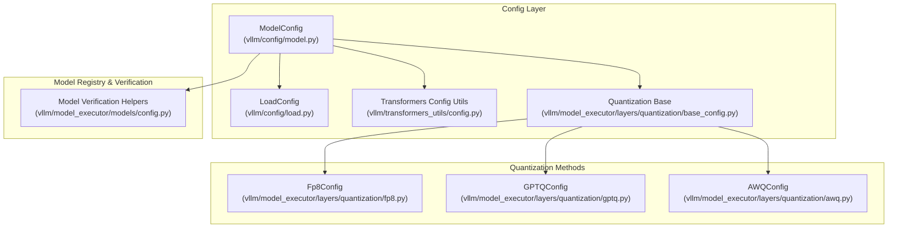
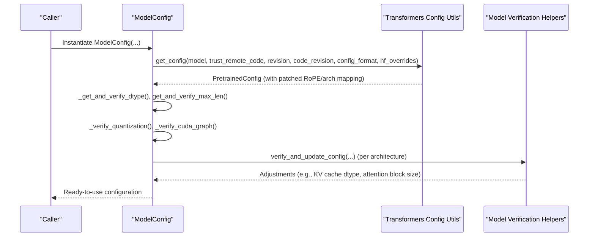
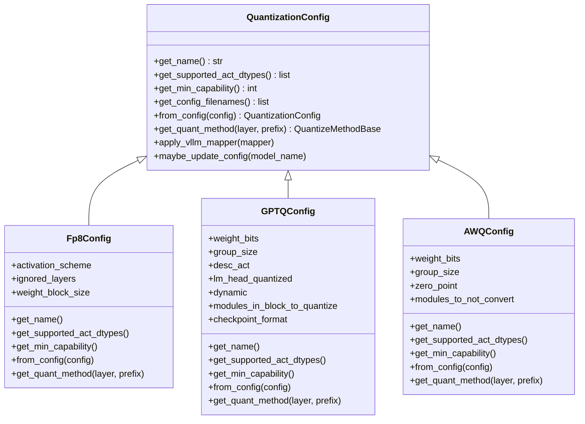
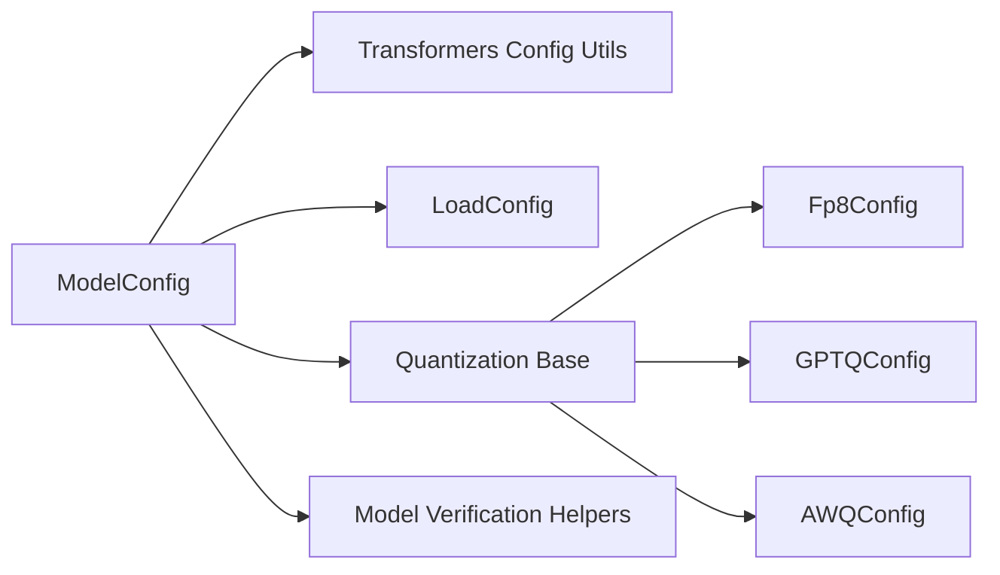

# Model Configuration

<cite>
**Referenced Files in This Document**
- [vllm/config/model.py](file://vllm/config/model.py)
- [vllm/config/load.py](file://vllm/config/load.py)
- [vllm/config/utils.py](file://vllm/config/utils.py)
- [vllm/model_executor/models/config.py](file://vllm/model_executor/models/config.py)
- [vllm/model_executor/layers/quantization/base_config.py](file://vllm/model_executor/layers/quantization/base_config.py)
- [vllm/model_executor/layers/quantization/fp8.py](file://vllm/model_executor/layers/quantization/fp8.py)
- [vllm/model_executor/layers/quantization/gptq.py](file://vllm/model_executor/layers/quantization/gptq.py)
- [vllm/model_executor/layers/quantization/awq.py](file://vllm/model_executor/layers/quantization/awq.py)
- [vllm/transformers_utils/config.py](file://vllm/transformers_utils/config.py)
</cite>

## Table of Contents
1. [Introduction](#introduction)
2. [Project Structure](#project-structure)
3. [Core Components](#core-components)
4. [Architecture Overview](#architecture-overview)
5. [Detailed Component Analysis](#detailed-component-analysis)
6. [Dependency Analysis](#dependency-analysis)
7. [Performance Considerations](#performance-considerations)
8. [Troubleshooting Guide](#troubleshooting-guide)
9. [Conclusion](#conclusion)
10. [Appendices](#appendices)

## Introduction
This document explains model-specific configuration in vLLM with a focus on the ModelConfig class and related configuration subsystems. It covers model path resolution, tokenizer settings, dtype selection, quantization configuration, model architecture parameters, model loading strategies, checkpoint formats, compatibility requirements, and validation. It also provides guidance for multimodal and vision-language models, along with optimization settings and hardware compatibility checks.

## Project Structure
The model configuration system spans several modules:
- ModelConfig encapsulates model identity, tokenizer, dtype, quantization, and multimodal settings.
- LoadConfig controls how model weights are loaded (formats, device, progress).
- Transformers config utilities resolve and patch model configs, including GGUF and architecture mapping.
- Quantization configs define method-specific parameters and compatibility constraints.
- Model registry and verification helpers adjust configuration for specific architectures.

**Diagram sources**
- [vllm/config/model.py](file://vllm/config/model.py#L96-L210)
- [vllm/config/load.py](file://vllm/config/load.py#L23-L125)
- [vllm/transformers_utils/config.py](file://vllm/transformers_utils/config.py#L538-L720)
- [vllm/model_executor/layers/quantization/base_config.py](file://vllm/model_executor/layers/quantization/base_config.py#L64-L171)
- [vllm/model_executor/layers/quantization/fp8.py](file://vllm/model_executor/layers/quantization/fp8.py#L210-L365)
- [vllm/model_executor/layers/quantization/gptq.py](file://vllm/model_executor/layers/quantization/gptq.py#L43-L218)
- [vllm/model_executor/layers/quantization/awq.py](file://vllm/model_executor/layers/quantization/awq.py#L32-L163)
- [vllm/model_executor/models/config.py](file://vllm/model_executor/models/config.py#L507-L526)

**Section sources**
- [vllm/config/model.py](file://vllm/config/model.py#L96-L210)
- [vllm/config/load.py](file://vllm/config/load.py#L23-L125)
- [vllm/transformers_utils/config.py](file://vllm/transformers_utils/config.py#L538-L720)
- [vllm/model_executor/layers/quantization/base_config.py](file://vllm/model_executor/layers/quantization/base_config.py#L64-L171)
- [vllm/model_executor/layers/quantization/fp8.py](file://vllm/model_executor/layers/quantization/fp8.py#L210-L365)
- [vllm/model_executor/layers/quantization/gptq.py](file://vllm/model_executor/layers/quantization/gptq.py#L43-L218)
- [vllm/model_executor/layers/quantization/awq.py](file://vllm/model_executor/layers/quantization/awq.py#L32-L163)
- [vllm/model_executor/models/config.py](file://vllm/model_executor/models/config.py#L507-L526)

## Core Components
- ModelConfig: Central configuration for model identity, tokenizer, dtype, quantization, runner type, multimodal settings, and validation.
- LoadConfig: Controls weight loading format, device, and strategies (e.g., safetensors lazy/eager, torchao).
- Transformers config utilities: Resolve HF/Mistral/GGUF configs, patch RoPE, and map architectures.
- Quantization configs: Define method-specific parameters and capabilities (FP8, GPTQ, AWQ).
- Model verification helpers: Adjust KV cache dtypes, attention block sizing, and architecture-specific defaults.

Key responsibilities:
- Model path and tokenizer: Accept Hugging Face model/tokenizer IDs or local paths; support revisions and remote GGUF.
- dtype selection: Auto-resolution based on model config and runner type; override attention dtype when needed.
- Quantization: Detect and validate quantization method; map to appropriate quantization config classes.
- Multimodal: Enable multimodal processing with limits, caches, and encoder modes.
- Validation: Enforce constraints (e.g., max length, sliding window, CUDA graph compatibility).

**Section sources**
- [vllm/config/model.py](file://vllm/config/model.py#L96-L210)
- [vllm/config/load.py](file://vllm/config/load.py#L23-L125)
- [vllm/transformers_utils/config.py](file://vllm/transformers_utils/config.py#L538-L720)
- [vllm/model_executor/layers/quantization/base_config.py](file://vllm/model_executor/layers/quantization/base_config.py#L64-L171)
- [vllm/model_executor/models/config.py](file://vllm/model_executor/models/config.py#L276-L464)

## Architecture Overview
The configuration pipeline resolves model identity, loads and patches the Hugging Face config, selects dtype and quantization, initializes multimodal settings, and validates compatibility.

**Diagram sources**
- [vllm/config/model.py](file://vllm/config/model.py#L458-L600)
- [vllm/transformers_utils/config.py](file://vllm/transformers_utils/config.py#L538-L720)
- [vllm/model_executor/models/config.py](file://vllm/model_executor/models/config.py#L276-L464)

## Detailed Component Analysis

### ModelConfig: Parameters and Behaviors
ModelConfig centralizes model identity, tokenizer, dtype, quantization, and multimodal settings. Highlights:
- model, tokenizer, tokenizer_mode, trust_remote_code: Control model/tokenizer identity and tokenizer backend.
- dtype: Supports auto-selection and explicit FP16/BF16/FP32; attention dtype override supported on ROCm.
- max_model_len: Context length with human-readable suffix support; validated post-init.
- quantization: Method selection; falls back to dtype when no quantization config is present.
- enforce_eager: Disables CUDA graph for deterministic eager execution.
- logprobs_mode and max_logprobs: Control logprob computation scope.
- disable_sliding_window and disable_cascade_attn: Toggle advanced attention features.
- generation_config and override_generation_config: Control generation defaults and overrides.
- model_impl: Choose vLLM, Transformers, or TerraTorch implementations.
- io_processor_plugin and logits_processors: Extend processing and scoring.
- pooler_config: Configure pooling runners.
- multimodal_config: Enable and tune multimodal processing (limits, caches, encoder modes).

Validation and post-initialization:
- Redirects model/tokenizer via maybe_model_redirect.
- Resolves runner type and convert type based on architecture registry.
- Validates dtype, max length, quantization, CUDA graph, and BNB config.
- Initializes multimodal config and enforces constraints (e.g., GGUF tokenizer restriction).

**Section sources**
- [vllm/config/model.py](file://vllm/config/model.py#L96-L210)
- [vllm/config/model.py](file://vllm/config/model.py#L398-L635)
- [vllm/config/model.py](file://vllm/config/model.py#L636-L800)

### LoadConfig: Weight Loading Strategies and Formats
LoadConfig defines how model weights are loaded:
- load_format: auto, safetensors, pt, npcache, dummy, tensorizer, runai_streamer, runai_streamer_sharded, bitsandbytes, sharded_state, gguf, mistral.
- download_dir: Cache location for downloads.
- safetensors_load_strategy: lazy (memory-map), eager (preload), torchao (reconstruct torchao tensors).
- model_loader_extra_config: Extra config passed to selected loader.
- device: Target device for weight loading.
- ignore_patterns: Glob patterns to ignore during download.
- use_tqdm_on_load: Progress bar toggle.
- pt_load_map_location: Map locations for PyTorch checkpoint loading.

Hashing and validation:
- compute_hash: Stable hashing for loader config.
- field validators: Lowercase load_format and normalize ignore patterns.

**Section sources**
- [vllm/config/load.py](file://vllm/config/load.py#L23-L125)

### Transformers Config Utilities: Resolution, Patching, and Compatibility
Utilities for resolving and patching model configs:
- get_config: Detects HF/Mistral/GGUF formats; supports remote GGUF; merges quantization_config; patches RoPE parameters; maps architectures.
- maybe_patch_hf_config_from_gguf: Applies GGUF-specific defaults and architecture mapping.
- patch_rope_parameters and related helpers: Ensures RoPE compatibility across Transformers versions.
- is_encoder_decoder and is_interleaved: Detect encoder-decoder and interleaved attention models.
- get_pooling_config: Extracts pooling and normalization settings for sentence-transformers.

**Section sources**
- [vllm/transformers_utils/config.py](file://vllm/transformers_utils/config.py#L538-L720)
- [vllm/transformers_utils/config.py](file://vllm/transformers_utils/config.py#L297-L435)

### Quantization Configuration: FP8, GPTQ, AWQ
Quantization base and method-specific configs define capabilities and parameters:

- QuantizationConfig base:
  - get_name, get_supported_act_dtypes, get_min_capability, get_config_filenames, from_config, get_quant_method, apply_vllm_mapper, maybe_update_config.
  - Provides shared interface for all quantization methods.

- FP8Config:
  - Activation schemes: static/dynamic.
  - Block-wise quantization support for weights; dynamic activation required for block quantization.
  - Ignored layers and mapper support.
  - KV cache method and MoE backends selection (FlashInfer, CUTLASS, DeepGEMM, Marlin, Triton).
  - Min capability: 75; ROCm disables Marlin; batch-invariant mode uses specialized paths.

- GPTQConfig:
  - Weight bits: 2/3/4/8; warns on 4-bit gptq_gemm bugs; recommends gptq_marlin or gptq_bitblas.
  - Group size, desc_act ordering, lm_head quantization, autoround version, dynamic per-module config, checkpoint format (gptq_v1/v2).
  - Modules in block to quantize; auto-detect from safetensors metadata.
  - Linear method packs weights and scales; handles ExLLama state and weight shuffling.

- AWQConfig:
  - 4-bit weight quantization; group size and zero point; modules_to_not_convert.
  - Pack factor 32/4 = 8; validates alignment with tensor parallel sizes.
  - MoE fallback to MoeWNA16 or AWQMarlin-compatible MoE depending on support.

**Diagram sources**
- [vllm/model_executor/layers/quantization/base_config.py](file://vllm/model_executor/layers/quantization/base_config.py#L64-L171)
- [vllm/model_executor/layers/quantization/fp8.py](file://vllm/model_executor/layers/quantization/fp8.py#L210-L365)
- [vllm/model_executor/layers/quantization/gptq.py](file://vllm/model_executor/layers/quantization/gptq.py#L43-L218)
- [vllm/model_executor/layers/quantization/awq.py](file://vllm/model_executor/layers/quantization/awq.py#L32-L163)

**Section sources**
- [vllm/model_executor/layers/quantization/base_config.py](file://vllm/model_executor/layers/quantization/base_config.py#L64-L171)
- [vllm/model_executor/layers/quantization/fp8.py](file://vllm/model_executor/layers/quantization/fp8.py#L210-L365)
- [vllm/model_executor/layers/quantization/gptq.py](file://vllm/model_executor/layers/quantization/gptq.py#L43-L218)
- [vllm/model_executor/layers/quantization/awq.py](file://vllm/model_executor/layers/quantization/awq.py#L32-L163)

### Model Verification and Architecture-Specific Adjustments
Model verification helpers adjust configuration for specific architectures:
- MambaModelConfig and HybridAttentionMambaModelConfig: Align attention and Mamba block sizes, enable/disable prefix caching, set KV cache dtype.
- DeepseekV32ForCausalLM: Switch KV cache dtype to a custom fp8 format and adjust defaults.
- NemotronHForCausalLM: Update mamba_ssm_cache_dtype when set to auto.
- MODELS_CONFIG_MAP: Registry mapping model families to verification/update handlers.

These adjustments ensure optimal performance and compatibility for specialized architectures.

**Section sources**
- [vllm/model_executor/models/config.py](file://vllm/model_executor/models/config.py#L276-L464)
- [vllm/model_executor/models/config.py](file://vllm/model_executor/models/config.py#L465-L526)

### Model Loading Strategies and Checkpoint Formats
- Auto detection: safetensors preferred; falls back to pt; supports gguf, mistral, sharded_state, tensorizer, bitsandbytes, and Run:ai streamer variants.
- safetensors_load_strategy: lazy (default), eager (CPU RAM trade-off), torchao (reconstruct torchao tensors).
- GGUF: Requires config.json for remote repos; architecture mapped to HF equivalents; tokenizer must be unquantized for multimodal GGUF.
- Sharded states: Efficient loading for tensor-parallel models.
- Bitsandbytes: Direct integration for quantized loading.

**Section sources**
- [vllm/config/load.py](file://vllm/config/load.py#L23-L125)
- [vllm/transformers_utils/config.py](file://vllm/transformers_utils/config.py#L538-L720)

### Multimodal and Vision-Language Models
- MultimodalConfig is initialized when the model supports multimodal inputs.
- Constraints:
  - Multimodal GGUF models must use the original tokenizer (unquantized HF repo).
  - Encoder-decoder models disable multimodal processor cache.
- Options include:
  - limit_per_prompt, enable_mm_embeds, media_io_kwargs, mm_processor_kwargs, mm_processor_cache_gb/type, mm_shm_cache_max_object_size_mb, mm_encoder_tp_mode, mm_encoder_attn_backend, interleave_mm_strings, skip_mm_profiling, video_pruning_rate.

**Section sources**
- [vllm/config/model.py](file://vllm/config/model.py#L548-L587)
- [vllm/transformers_utils/config.py](file://vllm/transformers_utils/config.py#L538-L720)

### Validation, Size Estimation, and Memory Requirements
- Validation:
  - Post-init validations for tokenizer path and max_model_len.
  - Quantization verification and CUDA graph checks.
  - BNB config verification.
- Size estimation and memory:
  - KV cache size depends on dtype and block sizing; Mamba and hybrid attention require careful alignment of attention and Mamba pages.
  - FP8 and GPTQ configs influence memory footprint and kernel selection.
- Hashing:
  - Stable hashing of configs for caching and graph consistency.

**Section sources**
- [vllm/config/model.py](file://vllm/config/model.py#L398-L635)
- [vllm/config/utils.py](file://vllm/config/utils.py#L290-L371)
- [vllm/model_executor/models/config.py](file://vllm/model_executor/models/config.py#L312-L464)

### Hardware Compatibility Checks
- Minimum GPU capability:
  - FP8Config: min capability 75.
  - GPTQConfig: min capability 60.
  - AWQConfig: min capability 75 (Turing or newer).
- ROCm-specific:
  - override_attention_dtype warning when not on ROCm.
  - FP8 Marlin disabled on ROCm.
- Platform-aware backends:
  - FP8 MoE backends selected based on device family and env flags.
  - Mamba and hybrid attention block sizing adapts to device capabilities.

**Section sources**
- [vllm/model_executor/layers/quantization/fp8.py](file://vllm/model_executor/layers/quantization/fp8.py#L210-L365)
- [vllm/model_executor/layers/quantization/gptq.py](file://vllm/model_executor/layers/quantization/gptq.py#L133-L141)
- [vllm/model_executor/layers/quantization/awq.py](file://vllm/model_executor/layers/quantization/awq.py#L72-L76)
- [vllm/config/model.py](file://vllm/config/model.py#L449-L457)

## Dependency Analysis

**Diagram sources**
- [vllm/config/model.py](file://vllm/config/model.py#L458-L600)
- [vllm/transformers_utils/config.py](file://vllm/transformers_utils/config.py#L538-L720)
- [vllm/config/load.py](file://vllm/config/load.py#L23-L125)
- [vllm/model_executor/layers/quantization/base_config.py](file://vllm/model_executor/layers/quantization/base_config.py#L64-L171)
- [vllm/model_executor/models/config.py](file://vllm/model_executor/models/config.py#L507-L526)

**Section sources**
- [vllm/config/model.py](file://vllm/config/model.py#L458-L600)
- [vllm/transformers_utils/config.py](file://vllm/transformers_utils/config.py#L538-L720)
- [vllm/config/load.py](file://vllm/config/load.py#L23-L125)
- [vllm/model_executor/layers/quantization/base_config.py](file://vllm/model_executor/layers/quantization/base_config.py#L64-L171)
- [vllm/model_executor/models/config.py](file://vllm/model_executor/models/config.py#L507-L526)

## Performance Considerations
- Prefer safetensors for local storage (lazy loading); use eager loading for network filesystems.
- FP8 dynamic activation with per-token grouping improves throughput on supported GPUs.
- GPTQ v2 format and Marlin/bitblas backends can improve performance; 4-bit GPTQ gemm is flagged as buggy; use recommended backends.
- KV cache dtype and block sizing tuned per architecture (Mamba/hybrid attention) to reduce padding and improve memory bandwidth.
- Disable CUDA graphs only when deterministic eager execution is required.

[No sources needed since this section provides general guidance]

## Troubleshooting Guide
Common issues and resolutions:
- Remote GGUF without config.json: Ensure the GGUF repo includes config.json or specify --hf-config-path to a compatible HF repo.
- Multimodal GGUF tokenizer mismatch: Use the original tokenizer from the unquantized HF model.
- Encoder-decoder models and multimodal cache: MM processor cache is disabled for encoder-decoder models.
- Quantization method mismatch: Verify min capability and backend support; choose compatible kernels (e.g., Marlin, FlashInfer, CUTLASS).
- Sliding window and max length: Disable sliding window or cap max_model_len to sliding window size as needed.
- CUDA graph and eager mode: Set enforce_eager to True to disable CUDA graphs for debugging.

**Section sources**
- [vllm/transformers_utils/config.py](file://vllm/transformers_utils/config.py#L538-L720)
- [vllm/config/model.py](file://vllm/config/model.py#L543-L595)
- [vllm/model_executor/layers/quantization/fp8.py](file://vllm/model_executor/layers/quantization/fp8.py#L210-L365)
- [vllm/model_executor/layers/quantization/gptq.py](file://vllm/model_executor/layers/quantization/gptq.py#L96-L103)

## Conclusion
vLLM’s model configuration system provides a robust, extensible framework for specifying model identity, tokenizer, dtype, quantization, and multimodal settings. Transformers config utilities ensure compatibility across formats and architectures, while quantization configs and verification helpers tailor performance and correctness for specialized models. By leveraging the documented parameters and compatibility checks, users can configure models effectively for diverse workloads and hardware platforms.

[No sources needed since this section summarizes without analyzing specific files]

## Appendices

### Example Scenarios and Guidance
- Large LLMs (FP8):
  - Use FP8Config with dynamic activation and per-token grouping for throughput.
  - Ensure GPU capability meets min requirement; avoid Marlin on ROCm.
- Quantized LLMs (GPTQ/AWQ):
  - Select appropriate backends (Marlin/bitblas) and formats (gptq_v2).
  - Validate group size and pack factor alignment with tensor parallel world size.
- Vision-language models:
  - Disable multimodal processor cache for encoder-decoder models.
  - For multimodal GGUF, use the original tokenizer from the HF repo.
- Optimization:
  - Tune KV cache dtype and attention block sizing for hybrid Mamba models.
  - Consider enforce_eager for debugging; otherwise rely on CUDA graphs for performance.

[No sources needed since this section provides general guidance]