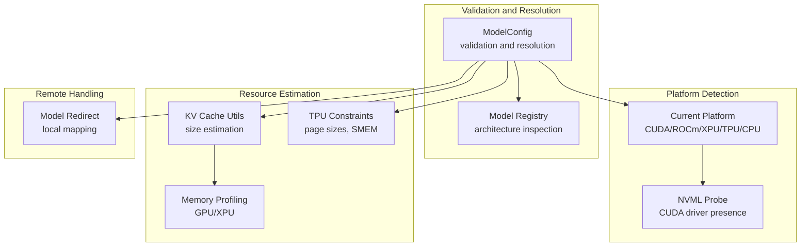
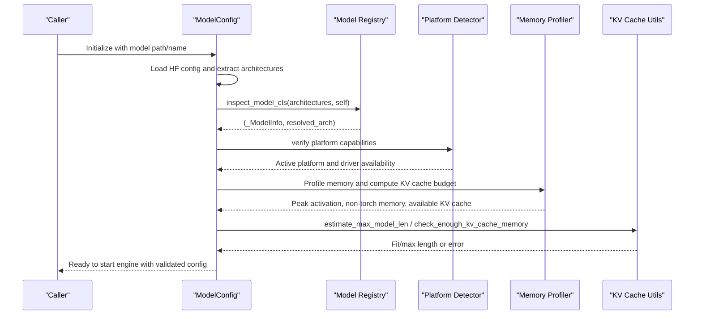
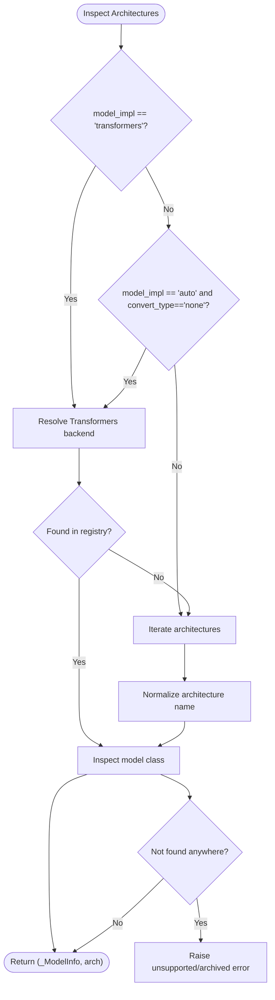
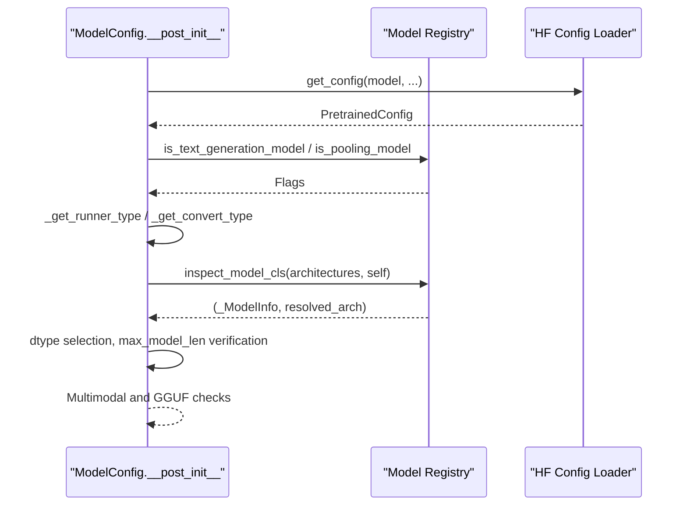
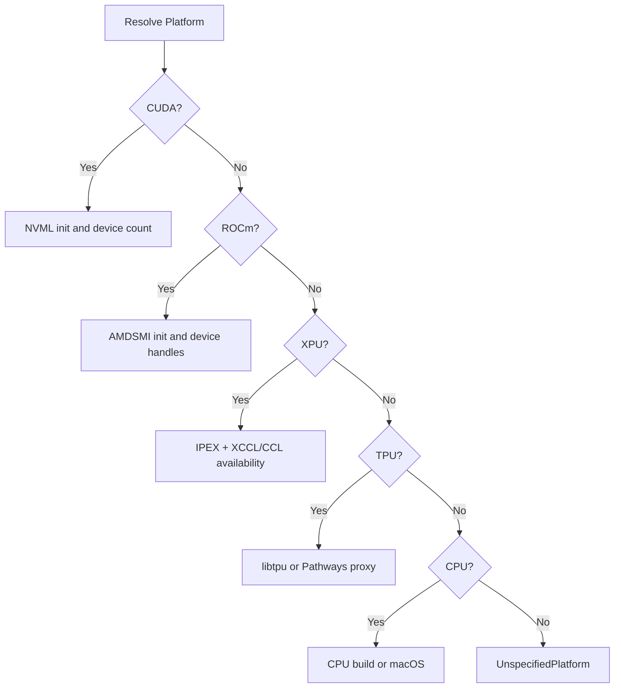
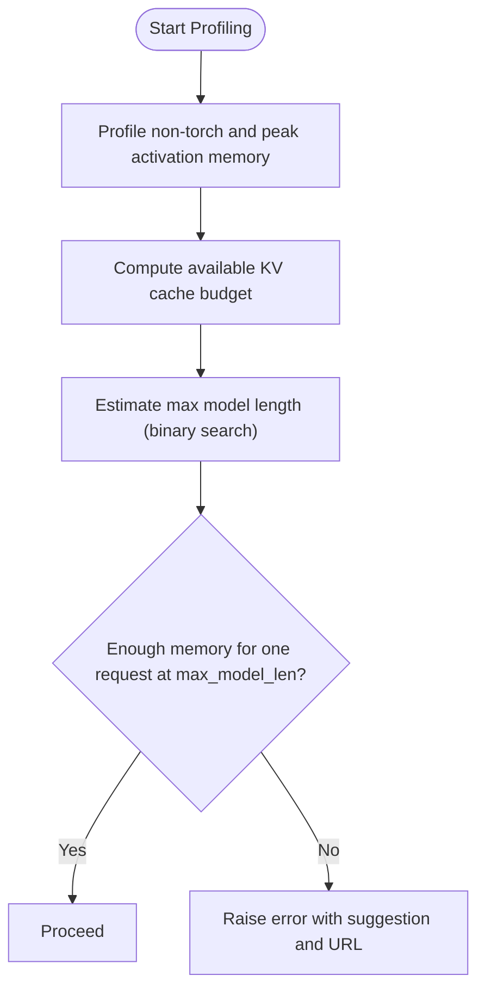
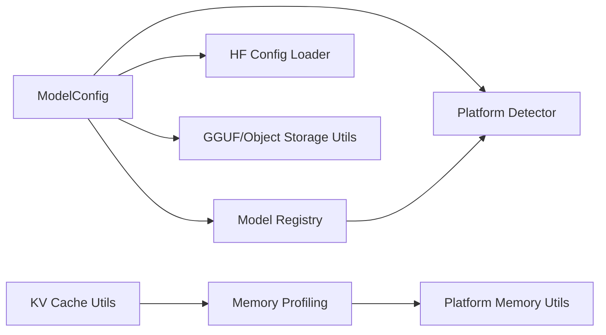

# Model Validation and Compatibility

<cite>
**Referenced Files in This Document**
- [registry.py](file://vllm/model_executor/models/registry.py)
- [model.py](file://vllm/config/model.py)
- [platforms/__init__.py](file://vllm/platforms/__init__.py)
- [utils.py](file://vllm/transformers_utils/utils.py)
- [kv_cache_utils.py](file://vllm/v1/core/kv_cache_utils.py)
- [gpu_worker.py](file://vllm/v1/worker/gpu_worker.py)
- [mem_utils.py](file://vllm/utils/mem_utils.py)
- [pallas.py](file://vllm/v1/attention/backends/pallas.py)
- [tpu_model_runner.py](file://vllm/v1/worker/tpu_model_runner.py)
- [tpu_input_batch.py](file://vllm/v1/worker/tpu_input_batch.py)
- [pynvml.py](file://vllm/third_party/pynvml.py)
</cite>

## Table of Contents
1. [Introduction](#introduction)
2. [Project Structure](#project-structure)
3. [Core Components](#core-components)
4. [Architecture Overview](#architecture-overview)
5. [Detailed Component Analysis](#detailed-component-analysis)
6. [Dependency Analysis](#dependency-analysis)
7. [Performance Considerations](#performance-considerations)
8. [Troubleshooting Guide](#troubleshooting-guide)
9. [Conclusion](#conclusion)

## Introduction
This document explains how vLLM validates models, detects architectures, verifies compatibility, and manages resources. It covers:
- Automatic model detection and architecture validation
- Model registry and supported architectures
- Fallback mechanisms for model implementations
- Hardware-specific compatibility checks and platform requirements
- Driver dependencies and environment probing
- Model size estimation, memory requirements, and resource allocation strategies
- Validation error messages, common compatibility issues, and resolution strategies
- Model redirection and remote model handling

## Project Structure
The model validation and compatibility pipeline spans several modules:
- Model configuration and validation: [model.py](file://vllm/config/model.py)
- Model registry and architecture inspection: [registry.py](file://vllm/model_executor/models/registry.py)
- Platform detection and hardware compatibility: [platforms/__init__.py](file://vllm/platforms/__init__.py)
- Remote model handling and redirection: [utils.py](file://vllm/transformers_utils/utils.py)
- Memory profiling and KV cache sizing: [gpu_worker.py](file://vllm/v1/worker/gpu_worker.py), [kv_cache_utils.py](file://vllm/v1/core/kv_cache_utils.py), [mem_utils.py](file://vllm/utils/mem_utils.py)
- Hardware-specific constraints (TPU, GPU): [pallas.py](file://vllm/v1/attention/backends/pallas.py), [tpu_model_runner.py](file://vllm/v1/worker/tpu_model_runner.py), [tpu_input_batch.py](file://vllm/v1/worker/tpu_input_batch.py)
- Driver probing (CUDA): [pynvml.py](file://vllm/third_party/pynvml.py)

**Diagram sources**
- [model.py](file://vllm/config/model.py#L484-L541)
- [registry.py](file://vllm/model_executor/models/registry.py#L928-L1032)
- [platforms/__init__.py](file://vllm/platforms/__init__.py#L59-L107)
- [pynvml.py](file://vllm/third_party/pynvml.py#L2401-L2427)
- [gpu_worker.py](file://vllm/v1/worker/gpu_worker.py#L449-L505)
- [kv_cache_utils.py](file://vllm/v1/core/kv_cache_utils.py#L618-L721)
- [pallas.py](file://vllm/v1/attention/backends/pallas.py#L132-L150)
- [tpu_model_runner.py](file://vllm/v1/worker/tpu_model_runner.py#L1560-L1577)
- [tpu_input_batch.py](file://vllm/v1/worker/tpu_input_batch.py#L40-L73)
- [utils.py](file://vllm/transformers_utils/utils.py#L71-L96)

**Section sources**
- [model.py](file://vllm/config/model.py#L484-L541)
- [registry.py](file://vllm/model_executor/models/registry.py#L928-L1032)
- [platforms/__init__.py](file://vllm/platforms/__init__.py#L59-L107)
- [utils.py](file://vllm/transformers_utils/utils.py#L71-L96)
- [kv_cache_utils.py](file://vllm/v1/core/kv_cache_utils.py#L618-L721)
- [gpu_worker.py](file://vllm/v1/worker/gpu_worker.py#L449-L505)
- [pallas.py](file://vllm/v1/attention/backends/pallas.py#L132-L150)
- [tpu_model_runner.py](file://vllm/v1/worker/tpu_model_runner.py#L1560-L1577)
- [tpu_input_batch.py](file://vllm/v1/worker/tpu_input_batch.py#L40-L73)
- [pynvml.py](file://vllm/third_party/pynvml.py#L2401-L2427)

## Core Components
- ModelConfig: Loads and validates model configuration, resolves runner and convert types, inspects architectures, and enforces platform and model compatibility constraints.
- Model Registry: Maintains supported architectures, normalizes architecture names, resolves model classes, and raises explicit errors for unsupported or previously supported architectures.
- Platform Detection: Automatically selects the active platform (CUDA, ROCm, XPU, TPU, CPU) and probes driver/runtime availability.
- Resource Estimation: Computes KV cache memory needs, estimates maximum model length under memory constraints, and suggests KV cache sizes based on profiling.
- Remote Handling: Applies model name redirects and handles remote GGUF and object storage scenarios.

**Section sources**
- [model.py](file://vllm/config/model.py#L484-L541)
- [registry.py](file://vllm/model_executor/models/registry.py#L928-L1032)
- [platforms/__init__.py](file://vllm/platforms/__init__.py#L182-L231)
- [kv_cache_utils.py](file://vllm/v1/core/kv_cache_utils.py#L618-L721)
- [utils.py](file://vllm/transformers_utils/utils.py#L71-L96)

## Architecture Overview
The validation and compatibility flow:
1. ModelConfig initializes, loads HF config, and determines architectures.
2. Registry inspects architectures and resolves a compatible model class, with fallbacks.
3. Platform detection ensures the selected platform supports the chosen architecture and implementation.
4. Memory profiling and KV cache utilities estimate and validate memory usage.
5. Remote handling applies model redirects and adjusts tokenizer/model paths.

**Diagram sources**
- [model.py](file://vllm/config/model.py#L484-L541)
- [registry.py](file://vllm/model_executor/models/registry.py#L928-L1032)
- [platforms/__init__.py](file://vllm/platforms/__init__.py#L182-L231)
- [gpu_worker.py](file://vllm/v1/worker/gpu_worker.py#L449-L505)
- [kv_cache_utils.py](file://vllm/v1/core/kv_cache_utils.py#L618-L721)

## Detailed Component Analysis

### Model Registry and Architecture Validation
- Supported architectures are maintained centrally and include text-generation, embedding, cross-encoder, multimodal, and speculative decoding families.
- Normalization and fallback:
  - Normalize architecture names using defaults and convert_type/runner hints.
  - Try Transformers backend resolution when configured or auto-detected.
  - Fall back to Transformers implementation if needed.
  - Raise explicit errors for unsupported or previously supported architectures with actionable messages.
- Lazy vs eager model registration:
  - Supports registering external models either by direct class or by module:class string for safe lazy import.

**Diagram sources**
- [registry.py](file://vllm/model_executor/models/registry.py#L928-L1032)
- [registry.py](file://vllm/model_executor/models/registry.py#L787-L822)

**Section sources**
- [registry.py](file://vllm/model_executor/models/registry.py#L450-L503)
- [registry.py](file://vllm/model_executor/models/registry.py#L787-L822)
- [registry.py](file://vllm/model_executor/models/registry.py#L900-L979)
- [registry.py](file://vllm/model_executor/models/registry.py#L980-L1032)

### ModelConfig Validation and Resolution
- Determines runner type and convert type based on architectures and defaults.
- Enforces runner/convert compatibility with the model’s capabilities.
- Resolves model architecture and logs the resolved architecture.
- Handles multimodal constraints, GGUF tokenizer restrictions, and sliding window overrides.
- Pulls remote models/tokenizers when needed (object storage and GGUF).

**Diagram sources**
- [model.py](file://vllm/config/model.py#L484-L541)
- [model.py](file://vllm/config/model.py#L541-L600)
- [model.py](file://vllm/config/model.py#L663-L681)

**Section sources**
- [model.py](file://vllm/config/model.py#L484-L541)
- [model.py](file://vllm/config/model.py#L541-L600)
- [model.py](file://vllm/config/model.py#L663-L681)

### Platform Detection and Hardware Compatibility
- Automatically detects one of the built-in platforms (CUDA, ROCm, XPU, TPU, CPU) and activates the corresponding plugin.
- CUDA detection probes NVML and handles edge cases (e.g., CPU builds, Jetson).
- ROCm detection uses AMD SMI; XPU detection checks IPEX and XCCL/CCL availability.
- TPU detection checks for libtpu or Pathways proxy.
- CPU detection considers CPU builds and macOS.

**Diagram sources**
- [platforms/__init__.py](file://vllm/platforms/__init__.py#L59-L107)
- [platforms/__init__.py](file://vllm/platforms/__init__.py#L110-L129)
- [platforms/__init__.py](file://vllm/platforms/__init__.py#L131-L156)
- [platforms/__init__.py](file://vllm/platforms/__init__.py#L182-L231)

**Section sources**
- [platforms/__init__.py](file://vllm/platforms/__init__.py#L59-L107)
- [platforms/__init__.py](file://vllm/platforms/__init__.py#L110-L129)
- [platforms/__init__.py](file://vllm/platforms/__init__.py#L131-L156)
- [platforms/__init__.py](file://vllm/platforms/__init__.py#L182-L231)

### Driver Dependencies and Environment Probing
- CUDA NVML probing is used to detect GPUs and driver presence; CPU builds are excluded from CUDA activation.
- Jetson systems are supported via a special check when NVML is unavailable.
- ROCm uses AMD SMI APIs; XPU relies on Intel extensions and distributed backends.

**Section sources**
- [platforms/__init__.py](file://vllm/platforms/__init__.py#L59-L107)
- [pynvml.py](file://vllm/third_party/pynvml.py#L2401-L2427)

### Model Redirection and Remote Model Handling
- Model name redirection: Reads a mapping file or space-separated pairs to redirect model names to local folders.
- Remote GGUF and object storage: Adjusts tokenizer/model paths and pulls files when needed.

**Section sources**
- [utils.py](file://vllm/transformers_utils/utils.py#L71-L96)
- [model.py](file://vllm/config/model.py#L682-L725)

### Memory Requirements, Size Estimation, and Resource Allocation
- Memory profiling:
  - Captures non-Torch and peak activation memory; computes available KV cache budget.
  - Provides suggestions for KV cache memory based on requested utilization and measured overhead.
- KV cache sizing:
  - Estimates maximum model length that fits available memory using binary search.
  - Validates that available memory suffices for at least one request at max_model_len.
- TPU constraints:
  - Computes minimum page size and maximum sequences based on SMEM limits and block tables.
- GPU/XPU specifics:
  - Adjusts memory accounting for integrated memory systems and UMA platforms.
  - Uses platform-specific memory stats and empties caches to measure allocations accurately.

**Diagram sources**
- [gpu_worker.py](file://vllm/v1/worker/gpu_worker.py#L449-L505)
- [kv_cache_utils.py](file://vllm/v1/core/kv_cache_utils.py#L618-L721)
- [mem_utils.py](file://vllm/utils/mem_utils.py#L100-L125)
- [pallas.py](file://vllm/v1/attention/backends/pallas.py#L132-L150)
- [tpu_input_batch.py](file://vllm/v1/worker/tpu_input_batch.py#L40-L73)

**Section sources**
- [gpu_worker.py](file://vllm/v1/worker/gpu_worker.py#L449-L505)
- [kv_cache_utils.py](file://vllm/v1/core/kv_cache_utils.py#L618-L721)
- [mem_utils.py](file://vllm/utils/mem_utils.py#L100-L125)
- [pallas.py](file://vllm/v1/attention/backends/pallas.py#L132-L150)
- [tpu_input_batch.py](file://vllm/v1/worker/tpu_input_batch.py#L40-L73)

## Dependency Analysis
- ModelConfig depends on:
  - Registry for architecture inspection and capability checks
  - Platform detector for runtime compatibility
  - Transformers config loader for HF config parsing
  - GGUF/object storage utilities for remote model handling
- Registry depends on:
  - Platform verification to ensure model_arch is supported on current platform
  - Dynamic module loading and subprocess-based inspection for lazy models
- Memory utilities depend on:
  - Platform capabilities to adjust memory accounting (e.g., UMA)
  - Platform-specific memory stats and NVML/AMD SMI bindings

**Diagram sources**
- [model.py](file://vllm/config/model.py#L484-L541)
- [registry.py](file://vllm/model_executor/models/registry.py#L718-L743)
- [kv_cache_utils.py](file://vllm/v1/core/kv_cache_utils.py#L618-L721)
- [mem_utils.py](file://vllm/utils/mem_utils.py#L100-L125)

**Section sources**
- [model.py](file://vllm/config/model.py#L484-L541)
- [registry.py](file://vllm/model_executor/models/registry.py#L718-L743)
- [kv_cache_utils.py](file://vllm/v1/core/kv_cache_utils.py#L618-L721)
- [mem_utils.py](file://vllm/utils/mem_utils.py#L100-L125)

## Performance Considerations
- Prefer platform-specific backends (CUDA kernels, ROCm, XPU) for optimal throughput.
- Use memory profiling to size KV cache appropriately and avoid OOM; leverage suggested KV cache sizes.
- Tune gpu_memory_utilization and max_model_len to balance throughput and memory footprint.
- On TPU, ensure page sizes and SMEM constraints are respected to avoid excessive fragmentation.

[No sources needed since this section provides general guidance]

## Troubleshooting Guide
Common validation and compatibility issues:
- Unsupported or archived architectures:
  - Symptom: Explicit error indicating architecture not supported or previously supported until a specific version.
  - Resolution: Use a supported architecture or an older vLLM version if necessary.
- Runner/convert mismatch:
  - Symptom: Error stating the model does not support the selected runner or convert option.
  - Resolution: Choose a compatible runner/convert type or adapter.
- Multimodal GGUF tokenizer restriction:
  - Symptom: Error requiring an unquantized HF tokenizer for multimodal GGUF models.
  - Resolution: Specify the tokenizer explicitly to use the original tokenizer.
- Insufficient KV cache memory:
  - Symptom: Error indicating insufficient memory for KV cache at max_model_len with suggestions.
  - Resolution: Increase gpu_memory_utilization, decrease max_model_len, or adjust KV cache memory.
- Platform incompatibility:
  - Symptom: Errors when enabling unsupported features (e.g., sleep mode) on incompatible platforms.
  - Resolution: Disable unsupported features or switch to a compatible platform/build.

**Section sources**
- [registry.py](file://vllm/model_executor/models/registry.py#L799-L822)
- [model.py](file://vllm/config/model.py#L494-L508)
- [model.py](file://vllm/config/model.py#L581-L587)
- [kv_cache_utils.py](file://vllm/v1/core/kv_cache_utils.py#L664-L721)
- [model.py](file://vllm/config/model.py#L449-L457)

## Conclusion
vLLM’s model validation and compatibility system combines robust architecture detection, platform-aware runtime checks, and precise memory estimation to ensure reliable deployments across diverse hardware and model types. By leveraging the model registry, platform detectors, and KV cache utilities, users can confidently select compatible architectures, resolve remote models, and allocate resources efficiently.