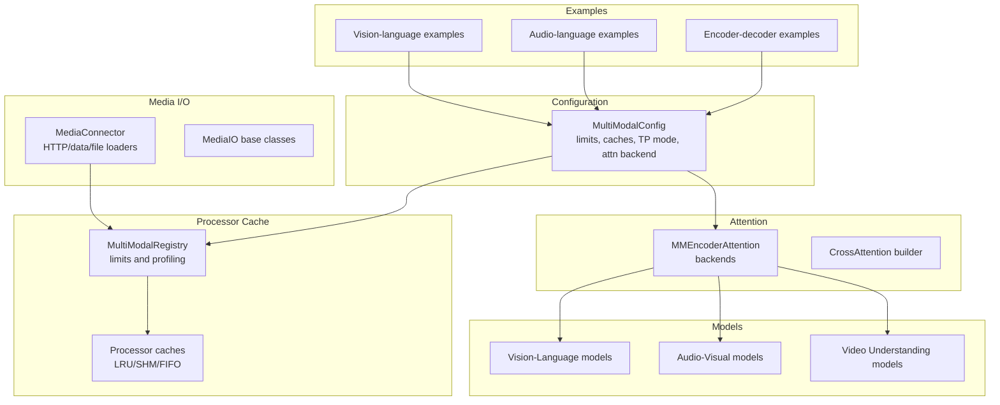
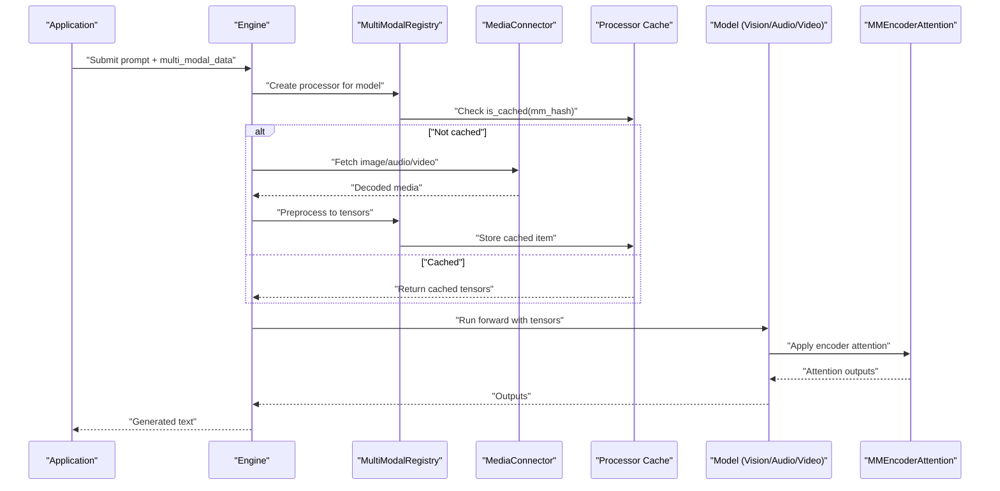
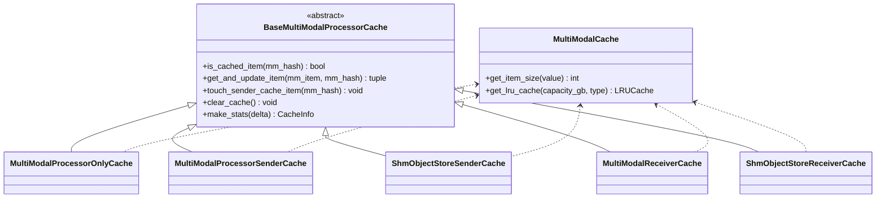
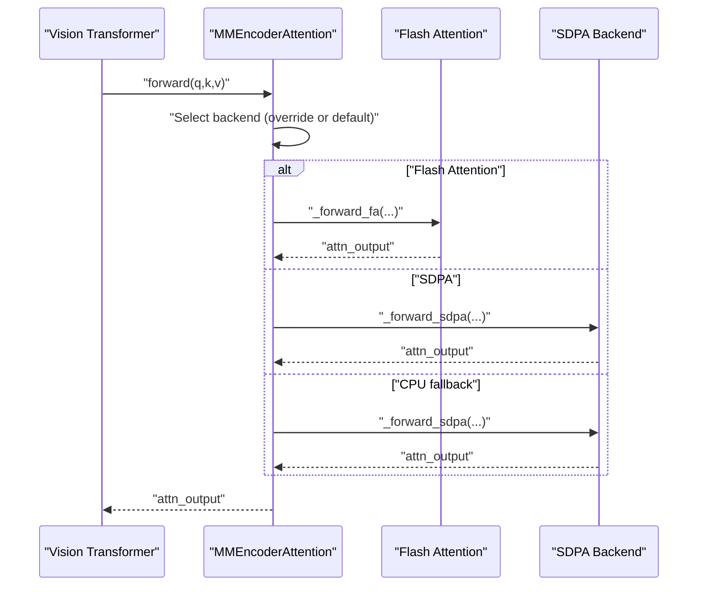
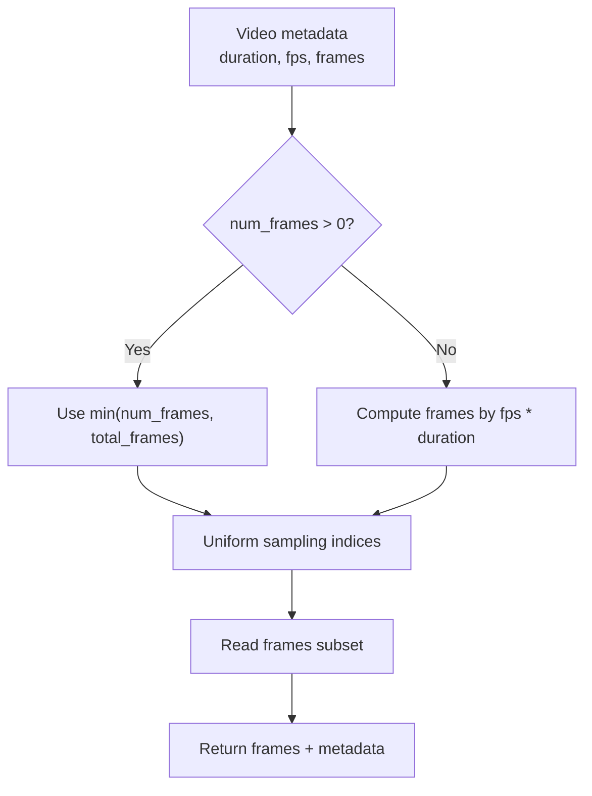
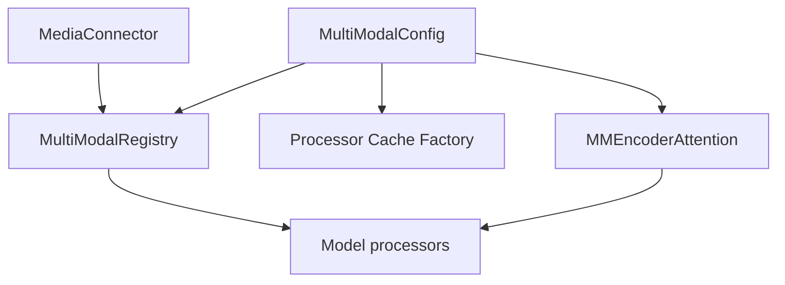

# Multimodal Model Configuration

<cite>
**Referenced Files in This Document**
- [multimodal.py](file://vllm/config/multimodal.py)
- [utils.py](file://vllm/multimodal/utils.py)
- [base.py](file://vllm/multimodal/base.py)
- [cache.py](file://vllm/multimodal/cache.py)
- [registry.py](file://vllm/multimodal/registry.py)
- [mm_encoder_attention.py](file://vllm/attention/layers/mm_encoder_attention.py)
- [cross_attention.py](file://vllm/attention/layers/cross_attention.py)
- [siglip2navit.py](file://vllm/model_executor/models/siglip2navit.py)
- [step3_vl.py](file://vllm/model_executor/models/step3_vl.py)
- [ultravox.py](file://vllm/model_executor/models/ultravox.py)
- [phi4mm.py](file://vllm/model_executor/models/phi4mm.py)
- [video.py](file://vllm/multimodal/video.py)
- [test_multimodal_config.py](file://tests/config/test_multimodal_config.py)
- [test_process_multi_modal_uuids.py](file://tests/v1/engine/test_process_multi_modal_uuids.py)
- [vision_language.py](file://examples/offline_inference/vision_language.py)
- [audio_language.py](file://examples/offline_inference/audio_language.py)
- [encoder_decoder_multimodal.py](file://examples/offline_inference/encoder_decoder_multimodal.py)
- [only_thinker.py](file://examples/offline_inference/qwen3_omni/only_thinker.py)
- [README.md](file://examples/online_serving/disaggregated_encoder/README.md)
- [registry.py](file://vllm/tokenizers/registry.py)
</cite>

## Table of Contents
1. [Introduction](#introduction)
2. [Project Structure](#project-structure)
3. [Core Components](#core-components)
4. [Architecture Overview](#architecture-overview)
5. [Detailed Component Analysis](#detailed-component-analysis)
6. [Dependency Analysis](#dependency-analysis)
7. [Performance Considerations](#performance-considerations)
8. [Troubleshooting Guide](#troubleshooting-guide)
9. [Conclusion](#conclusion)
10. [Appendices](#appendices)

## Introduction
This document explains how to configure and operate multimodal models in vLLM. It focuses on multimodal-specific parameters for media processing, encoder settings, and modality handling across images, videos, and audio. It also covers encoder tensor parallel modes, attention backends, processor caching strategies, input validation and size limits, performance tuning, and examples for vision-language, audio, and video understanding models. Finally, it documents known limitations for GGUF models and tokenizer compatibility requirements.

## Project Structure
The multimodal configuration and runtime spans several subsystems:
- Configuration: multimodal configuration schema and validation
- Media I/O: fetching and decoding images, audio, and video
- Processor cache: caching of preprocessed multimodal inputs
- Registry: model-specific multimodal processors and limits
- Attention: encoder attention backends and cross-attention integration
- Examples: end-to-end usage for vision-language, audio-language, and encoder-decoder workflows



**Diagram sources**
- [multimodal.py](file://vllm/config/multimodal.py#L53-L248)
- [utils.py](file://vllm/multimodal/utils.py#L52-L211)
- [base.py](file://vllm/multimodal/base.py#L41-L57)
- [cache.py](file://vllm/multimodal/cache.py#L563-L622)
- [registry.py](file://vllm/multimodal/registry.py#L91-L170)
- [mm_encoder_attention.py](file://vllm/attention/layers/mm_encoder_attention.py#L190-L216)
- [cross_attention.py](file://vllm/attention/layers/cross_attention.py#L71-L76)
- [vision_language.py](file://examples/offline_inference/vision_language.py#L1-L120)
- [audio_language.py](file://examples/offline_inference/audio_language.py#L1-L120)
- [encoder_decoder_multimodal.py](file://examples/offline_inference/encoder_decoder_multimodal.py#L1-L60)

**Section sources**
- [multimodal.py](file://vllm/config/multimodal.py#L53-L248)
- [utils.py](file://vllm/multimodal/utils.py#L52-L211)
- [cache.py](file://vllm/multimodal/cache.py#L563-L622)
- [registry.py](file://vllm/multimodal/registry.py#L91-L170)

## Core Components
- MultiModalConfig: central configuration for multimodal behavior, including:
  - Per-modality limits and dummy options
  - Processor cache size/type and SHM object size limits
  - Encoder tensor-parallel mode and attention backend override
  - Interleaving support, pruning rate, and profiling toggle
- MediaConnector: robust loader for images, audio, and video from HTTP, data URLs, and local files with domain restrictions and timeouts
- Processor caches: LRU and shared-memory caches for preprocessed multimodal inputs, with mirrored eviction semantics
- Registry: computes per-item token budgets, enforces limits, and constructs model-specific processors
- Attention: unified MMEncoderAttention with backend selection and cross-attention builder for encoder-decoder scenarios

**Section sources**
- [multimodal.py](file://vllm/config/multimodal.py#L53-L248)
- [utils.py](file://vllm/multimodal/utils.py#L52-L211)
- [cache.py](file://vllm/multimodal/cache.py#L171-L260)
- [registry.py](file://vllm/multimodal/registry.py#L130-L170)
- [mm_encoder_attention.py](file://vllm/attention/layers/mm_encoder_attention.py#L190-L216)

## Architecture Overview
The multimodal pipeline integrates configuration, media loading, preprocessing, caching, and attention computation.



**Diagram sources**
- [registry.py](file://vllm/multimodal/registry.py#L252-L271)
- [utils.py](file://vllm/multimodal/utils.py#L146-L211)
- [cache.py](file://vllm/multimodal/cache.py#L322-L431)
- [mm_encoder_attention.py](file://vllm/attention/layers/mm_encoder_attention.py#L190-L216)

## Detailed Component Analysis

### MultiModalConfig: Parameters and Semantics
- limit_per_prompt: per-modality maximums with flexible legacy/count-only and advanced options (image/video/audio)
- enable_mm_embeds: allow passing raw embedding tensors (advanced users)
- media_io_kwargs: per-modality arguments forwarded to media loaders (e.g., video frame count)
- mm_processor_kwargs: arguments forwarded to model processors (e.g., cropping/resizing)
- mm_processor_cache_gb: cache size in GiB; duplicated per API and engine process
- mm_processor_cache_type: "lru" or "shm"; SHM requires mm_shm_cache_max_object_size_mb
- mm_shm_cache_max_object_size_mb: per-object size limit for SHM cache
- mm_encoder_tp_mode: "weights" (default TP) or "data" (batch-level data parallel for encoders)
- mm_encoder_attn_backend: override attention backend for vision transformer encoders
- interleave_mm_strings: enable fully interleaved multimodal prompts
- skip_mm_profiling: skip multimodal memory profiling at startup
- video_pruning_rate: efficient video sampling pruning fraction

Validation and hashing:
- Validates cache type vs. SHM object size
- Converts string attention backend names to enum
- Computes a hash reflecting attention backend for graph stability

**Section sources**
- [multimodal.py](file://vllm/config/multimodal.py#L53-L248)
- [test_multimodal_config.py](file://tests/config/test_multimodal_config.py#L1-L25)

### Media Input Validation and Fetching
- Allowed domains: restrict HTTP URLs to specified hosts
- Allowed local media path: restrict file:// access to a subtree
- Supported schemes: http(s), data, file
- Image/audio/video fetchers accept timeouts and mode/format options
- Base64 data URLs currently require "data" scheme with base64 encoding
- Async fetchers offload heavy I/O to thread pool

```mermaid
flowchart TD
Start(["Load media URL"]) --> Scheme{"Scheme?"}
Scheme --> |http(s)| Domain["Check allowed domains"]
Scheme --> |data| Decode["Decode base64 payload"]
Scheme --> |file| Local["Validate allowed-local-media-path"]
Domain --> Download["Download bytes"]
Decode --> Parse["Parse media type and data"]
Local --> LoadFile["Load from filesystem"]
Download --> Bytes["Bytes loaded"]
LoadFile --> Bytes
Bytes --> IO["MediaIO.load_*"]
IO --> Out(["Decoded media object"])
```

**Diagram sources**
- [utils.py](file://vllm/multimodal/utils.py#L146-L211)
- [base.py](file://vllm/multimodal/base.py#L41-L57)

**Section sources**
- [utils.py](file://vllm/multimodal/utils.py#L52-L211)
- [base.py](file://vllm/multimodal/base.py#L41-L57)

### Processor Caching Strategies
- LRU cache: size-based eviction for preprocessed items
- Shared memory (SHM) cache: object storage with ring buffer and reader/writer synchronization
- Sender/receiver cache pairs mirror eviction semantics across processes
- Stats collection and delta reporting for monitoring hit rates



**Diagram sources**
- [cache.py](file://vllm/multimodal/cache.py#L171-L260)
- [cache.py](file://vllm/multimodal/cache.py#L322-L431)
- [cache.py](file://vllm/multimodal/cache.py#L433-L562)
- [cache.py](file://vllm/multimodal/cache.py#L624-L800)

**Section sources**
- [cache.py](file://vllm/multimodal/cache.py#L171-L260)
- [cache.py](file://vllm/multimodal/cache.py#L322-L431)
- [cache.py](file://vllm/multimodal/cache.py#L433-L562)
- [cache.py](file://vllm/multimodal/cache.py#L624-L800)

### Encoder Tensor Parallel Modes and Attention Backends
- mm_encoder_tp_mode:
  - "weights": default tensor-parallel weight partitioning
  - "data": data-parallel batching across TP ranks with replicated weights (per-model support)
- mm_encoder_attn_backend: override attention backend for vision encoders; validated against supported enum
- Unified MMEncoderAttention selects backend automatically and routes to Flash Attention or SDPA



**Diagram sources**
- [multimodal.py](file://vllm/config/multimodal.py#L111-L127)
- [mm_encoder_attention.py](file://vllm/attention/layers/mm_encoder_attention.py#L190-L216)
- [siglip2navit.py](file://vllm/model_executor/models/siglip2navit.py#L204-L244)
- [step3_vl.py](file://vllm/model_executor/models/step3_vl.py#L736-L775)

**Section sources**
- [multimodal.py](file://vllm/config/multimodal.py#L111-L127)
- [mm_encoder_attention.py](file://vllm/attention/layers/mm_encoder_attention.py#L190-L216)
- [siglip2navit.py](file://vllm/model_executor/models/siglip2navit.py#L204-L244)
- [step3_vl.py](file://vllm/model_executor/models/step3_vl.py#L736-L775)

### Modality Handling: Images, Videos, and Audio
- Images: fetch via HTTP/data/file; optional conversion mode; validation for invalid/unreadable images
- Audio: fetch waveforms and sample rates; encode/decode helpers; Ultravox supports features or embeddings
- Video: uniform sampling by frame count and fps; configurable via media_io_kwargs; supports metadata-driven sampling



**Diagram sources**
- [video.py](file://vllm/multimodal/video.py#L158-L179)

**Section sources**
- [utils.py](file://vllm/multimodal/utils.py#L292-L332)
- [ultravox.py](file://vllm/model_executor/models/ultravox.py#L91-L110)
- [ultravox.py](file://vllm/model_executor/models/ultravox.py#L613-L644)
- [video.py](file://vllm/multimodal/video.py#L158-L179)

### Media Input Validation, Size Limits, and Pruning
- Allowed domains and local media path enforcement
- SHM cache object size limit applies only when cache type is "shm"
- Video pruning via efficient sampling with configurable rate
- Per-request and per-prompt limits enforced by registry and model config

**Section sources**
- [utils.py](file://vllm/multimodal/utils.py#L80-L153)
- [multimodal.py](file://vllm/config/multimodal.py#L183-L193)
- [multimodal.py](file://vllm/config/multimodal.py#L138-L142)
- [registry.py](file://vllm/multimodal/registry.py#L130-L170)

### Performance Optimization Settings
- Reduce multimodal memory profiling overhead with skip_mm_profiling
- Tune processor cache size and type for throughput vs. memory trade-offs
- Prefer SHM cache for IPC scenarios when supported
- Adjust video sampling to reduce token counts for long videos

**Section sources**
- [multimodal.py](file://vllm/config/multimodal.py#L129-L142)
- [cache.py](file://vllm/multimodal/cache.py#L563-L622)
- [video.py](file://vllm/multimodal/video.py#L158-L179)

### Examples: Vision-Language, Audio, and Video Understanding
- Vision-language examples demonstrate prompt templates, mm_processor_kwargs, and per-modality limits
- Audio-language examples show audio placeholders, LoRA usage, and encoder-decoder transcription
- Video understanding example demonstrates deriving audio placeholders from video and vice versa

**Section sources**
- [vision_language.py](file://examples/offline_inference/vision_language.py#L360-L420)
- [audio_language.py](file://examples/offline_inference/audio_language.py#L247-L332)
- [encoder_decoder_multimodal.py](file://examples/offline_inference/encoder_decoder_multimodal.py#L1-L60)
- [only_thinker.py](file://examples/offline_inference/qwen3_omni/only_thinker.py#L62-L87)

### Cross-Attention for Encoder-Decoder Scenarios
- Cross-attention backend builder wraps underlying attention backend for encoder-decoder use
- Slot mapping computed from block tables and block sizes

**Section sources**
- [cross_attention.py](file://vllm/attention/layers/cross_attention.py#L47-L76)
- [cross_attention.py](file://vllm/attention/layers/cross_attention.py#L71-L76)

## Dependency Analysis
- MultiModalConfig drives registry computations and cache creation
- MediaConnector depends on MediaIO implementations and environment timeouts
- Attention backends are selected by model configuration and validated by config
- Examples depend on EngineArgs and multimodal configuration to construct prompts and inputs



**Diagram sources**
- [multimodal.py](file://vllm/config/multimodal.py#L53-L248)
- [registry.py](file://vllm/multimodal/registry.py#L252-L338)
- [cache.py](file://vllm/multimodal/cache.py#L595-L622)
- [mm_encoder_attention.py](file://vllm/attention/layers/mm_encoder_attention.py#L190-L216)
- [utils.py](file://vllm/multimodal/utils.py#L146-L211)

**Section sources**
- [multimodal.py](file://vllm/config/multimodal.py#L53-L248)
- [registry.py](file://vllm/multimodal/registry.py#L252-L338)
- [cache.py](file://vllm/multimodal/cache.py#L595-L622)
- [mm_encoder_attention.py](file://vllm/attention/layers/mm_encoder_attention.py#L190-L216)
- [utils.py](file://vllm/multimodal/utils.py#L146-L211)

## Performance Considerations
- Use SHM cache for IPC scenarios to minimize memory duplication and improve throughput
- Tune mm_processor_cache_gb to balance memory footprint and reuse rate
- Limit video frames and fps to reduce token counts and memory pressure
- Enable skip_mm_profiling to shorten cold-start latency at the cost of manual memory estimation
- Choose mm_encoder_attn_backend aligned with hardware capabilities (Flash Attention preferred when available)

[No sources needed since this section provides general guidance]

## Troubleshooting Guide
- Allowed domains/local path errors: ensure allowed domains include the host or set allowed-local-media-path to a valid subdirectory
- SHM cache misconfiguration: mm_shm_cache_max_object_size_mb only applies when mm_processor_cache_type is "shm"
- Encoder-only instances: when using disaggregated encoder, follow guidance for flags and local media path
- Processor cache UUID behavior: when cache disabled or prefix caching off, UUIDs are ignored and request IDs are used instead

**Section sources**
- [utils.py](file://vllm/multimodal/utils.py#L80-L153)
- [multimodal.py](file://vllm/config/multimodal.py#L183-L193)
- [README.md](file://examples/online_serving/disaggregated_encoder/README.md#L31-L49)
- [test_process_multi_modal_uuids.py](file://tests/v1/engine/test_process_multi_modal_uuids.py#L159-L202)

## Conclusion
vLLM’s multimodal configuration offers precise control over media processing, caching, and encoder execution. By tuning per-modality limits, attention backends, and cache strategies, users can achieve high throughput and predictable memory usage across images, audio, and video. The examples demonstrate practical configurations for real-world models, while the validation and caching layers ensure robust operation in production deployments.

[No sources needed since this section summarizes without analyzing specific files]

## Appendices

### GGUF Model Limitations and Tokenizer Compatibility
- GGUF tokenizer resolution splits model path and GGUF file; tokenizer mode and truncation sides are handled by the tokenizer registry
- GGUF-specific tokenizer artifacts are supported via dedicated paths and remote GGUF resolution

**Section sources**
- [registry.py](file://vllm/tokenizers/registry.py#L113-L141)