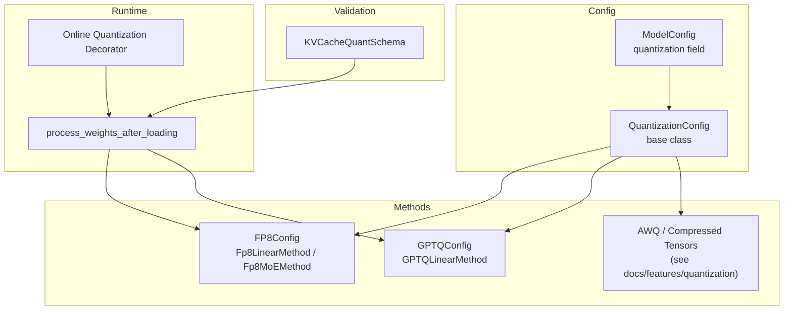
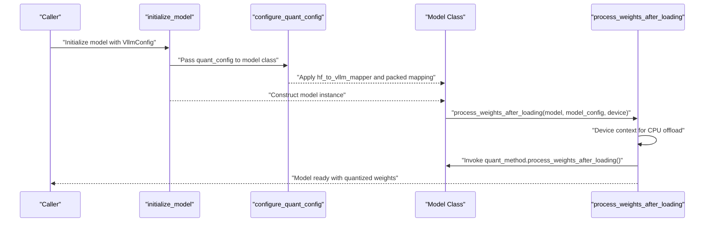
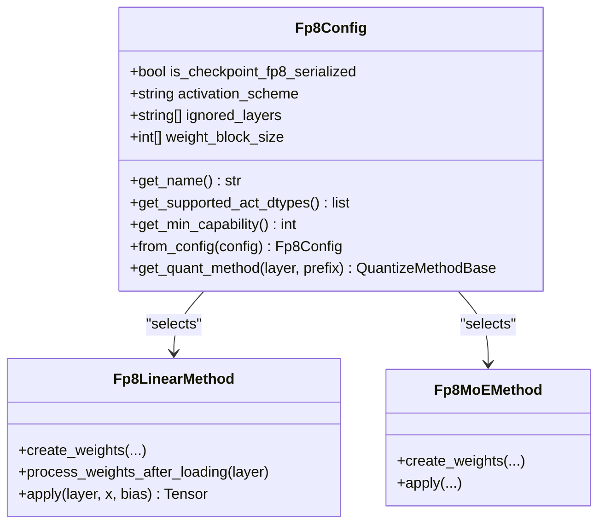
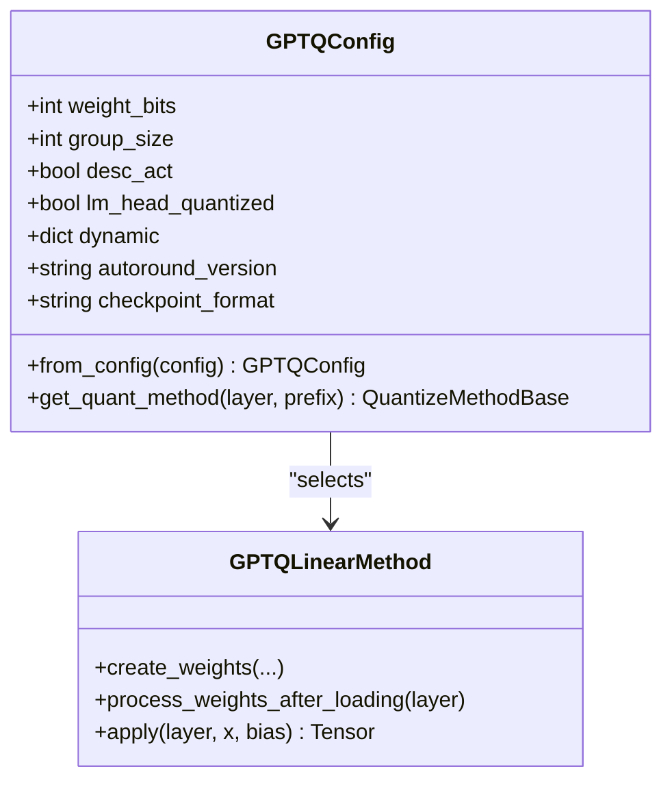
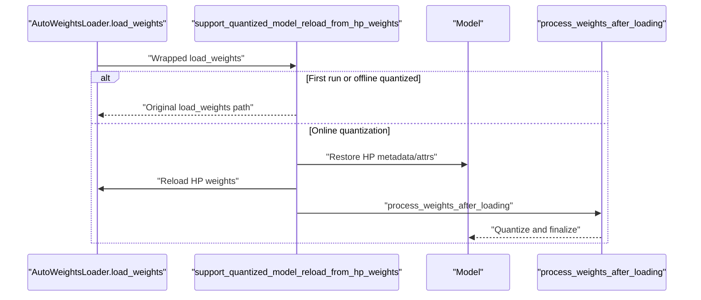
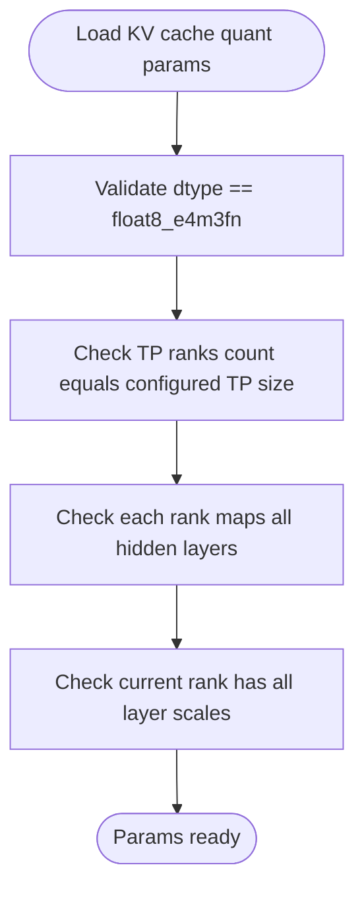
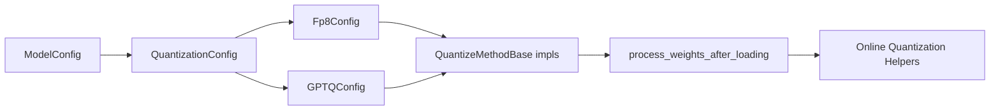

# Quantization Configuration

<cite>
**Referenced Files in This Document**
- [README.md](file://README.md)
- [model.py](file://vllm/config/model.py)
- [base_config.py](file://vllm/model_executor/layers/quantization/base_config.py)
- [schema.py](file://vllm/model_executor/layers/quantization/schema.py)
- [fp8.py](file://vllm/model_executor/layers/quantization/fp8.py)
- [gptq.py](file://vllm/model_executor/layers/quantization/gptq.py)
- [online_quantization.py](file://vllm/model_executor/model_loader/online_quantization.py)
- [utils.py](file://vllm/model_executor/model_loader/utils.py)
- [test_fp8.py](file://tests/kernels/quantization/test_fp8_quant.py)
- [test_gptq_v2.py](file://tests/quantization/test_gptq_v2.py)
- [test_register_quantization_config.py](file://tests/quantization/test_register_quantization_config.py)
- [test_quant_model.py](file://tests/lora/test_quant_model.py)
- [bench_fp8.py](file://benchmarks/kernels/bench_fp8.py)
- [bench_gptq.py](file://benchmarks/kernels/bench_gptq.py)
</cite>

## Table of Contents
1. [Introduction](#introduction)
2. [Project Structure](#project-structure)
3. [Core Components](#core-components)
4. [Architecture Overview](#architecture-overview)
5. [Detailed Component Analysis](#detailed-component-analysis)
6. [Dependency Analysis](#dependency-analysis)
7. [Performance Considerations](#performance-considerations)
8. [Troubleshooting Guide](#troubleshooting-guide)
9. [Conclusion](#conclusion)
10. [Appendices](#appendices)

## Introduction
This document explains quantization-specific model configuration in vLLM, covering supported methods (FP8, INT4/8, GPTQ, AWQ, and compressed tensors), selection criteria, hardware compatibility, performance trade-offs, and practical configuration guidance. It synthesizes implementation details from the repository’s quantization subsystem and provides actionable guidance for choosing and tuning quantization for different workloads.

## Project Structure
The quantization system spans configuration parsing, quantization method selection, weight loading, and runtime execution. Key areas:
- Configuration parsing and validation for quantization method and dtype
- Quantization method classes and parameter schemas
- Weight loading and post-processing for online quantization
- Backends and kernels for FP8 and GPTQ
- Tests and benchmarks validating behavior and performance

**Diagram sources**
- [model.py](file://vllm/config/model.py#L176-L200)
- [base_config.py](file://vllm/model_executor/layers/quantization/base_config.py#L64-L171)
- [fp8.py](file://vllm/model_executor/layers/quantization/fp8.py#L210-L365)
- [gptq.py](file://vllm/model_executor/layers/quantization/gptq.py#L43-L124)
- [schema.py](file://vllm/model_executor/layers/quantization/schema.py#L19-L91)
- [utils.py](file://vllm/model_executor/model_loader/utils.py#L81-L120)
- [online_quantization.py](file://vllm/model_executor/model_loader/online_quantization.py#L147-L276)

**Section sources**
- [model.py](file://vllm/config/model.py#L176-L200)
- [base_config.py](file://vllm/model_executor/layers/quantization/base_config.py#L64-L171)
- [fp8.py](file://vllm/model_executor/layers/quantization/fp8.py#L210-L365)
- [gptq.py](file://vllm/model_executor/layers/quantization/gptq.py#L43-L124)
- [schema.py](file://vllm/model_executor/layers/quantization/schema.py#L19-L91)
- [utils.py](file://vllm/model_executor/model_loader/utils.py#L81-L120)
- [online_quantization.py](file://vllm/model_executor/model_loader/online_quantization.py#L147-L276)

## Core Components
- ModelConfig quantization field: Accepts quantization method identifiers and influences dtype and backend selection.
- QuantizationConfig base class: Defines method name, supported activation dtypes, minimum GPU capability, config filename discovery, construction from model config, and method selection for layers.
- Method-specific configs:
  - FP8Config: Activation schemes, ignored layers, block-wise weight quantization, and cache scale mapping.
  - GPTQConfig: Bits, group size, activation ordering, lm-head quantization, dynamic per-module configuration, autoround version, and checkpoint format.
- Runtime weight processing: process_weights_after_loading orchestrates post-loading transformations and attention weight initialization.
- Online quantization: Decorator and helpers enable re-loading high-precision weights into an already-quantized model and re-quantizing on the fly (e.g., torchao).

Key responsibilities:
- QuantizationConfig.get_quant_method selects the appropriate QuantizeMethodBase for Linear/FusedMoE/Attention.
- process_weights_after_loading ensures weights are moved to the target device and processed by each quant method.
- Online quantization utilities preserve metadata/attributes to restore HP weights and re-quantize safely.

**Section sources**
- [model.py](file://vllm/config/model.py#L176-L200)
- [base_config.py](file://vllm/model_executor/layers/quantization/base_config.py#L64-L171)
- [fp8.py](file://vllm/model_executor/layers/quantization/fp8.py#L210-L365)
- [gptq.py](file://vllm/model_executor/layers/quantization/gptq.py#L43-L124)
- [utils.py](file://vllm/model_executor/model_loader/utils.py#L81-L120)
- [online_quantization.py](file://vllm/model_executor/model_loader/online_quantization.py#L67-L137)

## Architecture Overview
The quantization pipeline integrates configuration parsing, method selection, weight creation/loading, and runtime application.

**Diagram sources**
- [utils.py](file://vllm/model_executor/model_loader/utils.py#L27-L79)
- [utils.py](file://vllm/model_executor/model_loader/utils.py#L271-L293)
- [utils.py](file://vllm/model_executor/model_loader/utils.py#L81-L120)

**Section sources**
- [utils.py](file://vllm/model_executor/model_loader/utils.py#L27-L79)
- [utils.py](file://vllm/model_executor/model_loader/utils.py#L81-L120)
- [utils.py](file://vllm/model_executor/model_loader/utils.py#L271-L293)

## Detailed Component Analysis

### FP8 Quantization
FP8 supports dynamic/static activation schemes, optional block-wise weight quantization, and multiple backends (Marlin, FlashInfer, DeepGEMM, CUTLASS, Triton). It can load pre-serialized FP8 checkpoints or quantize weights after loading.

Key parameters and behaviors:
- Activation schemes: dynamic or static
- Ignored layers: skip quantization for specified modules
- Block-wise quantization: weight_block_size enforced for serialized checkpoints; dynamic activation required
- Backends: selected based on platform capabilities and environment flags
- Post-loading: per-tensor or block-wise scaling, optional Marlin preparation, and attention KV-cache scaling

**Diagram sources**
- [fp8.py](file://vllm/model_executor/layers/quantization/fp8.py#L210-L365)
- [fp8.py](file://vllm/model_executor/layers/quantization/fp8.py#L387-L711)
- [fp8.py](file://vllm/model_executor/layers/quantization/fp8.py#L713-L870)

Practical guidance:
- Choose dynamic activation for best accuracy; static activation reduces overhead.
- Use block-wise quantization for larger models and when serialized checkpoints are available.
- On supported GPUs, prefer FlashInfer backends; otherwise, Marlin or Triton are used.
- For attention KV cache quantization, ensure scaling factors are present and correctly mapped.

**Section sources**
- [fp8.py](file://vllm/model_executor/layers/quantization/fp8.py#L210-L365)
- [fp8.py](file://vllm/model_executor/layers/quantization/fp8.py#L387-L711)
- [fp8.py](file://vllm/model_executor/layers/quantization/fp8.py#L713-L870)

### GPTQ Quantization
GPTQ supports 2/3/4/8-bit weights with configurable group size and activation ordering. It can load v1 and v2 checkpoint formats and integrates with fused MoE via fallback to WNA16.

Key parameters and behaviors:
- Bits: 2/3/4/8
- Group size: -1 for per-channel or a positive integer
- Desc_act: activation ordering flag
- Dynamic per-module configuration: regex-based inclusion/exclusion
- Checkpoint format: gptq or gptq_v2
- Weight packing: determined by pack factor (32/weight_bits)

**Diagram sources**
- [gptq.py](file://vllm/model_executor/layers/quantization/gptq.py#L43-L124)
- [gptq.py](file://vllm/model_executor/layers/quantization/gptq.py#L225-L394)

Practical guidance:
- For 4-bit GPTQ, prefer Marlin or BitBLAS backends due to known issues with the legacy GEMM kernel.
- Activation ordering (desc_act) impacts ExLLAMAv2 compatibility; disable for row-parallel layers without act-order.
- Use gptq_v2 format when working with newer checkpoints that handle zero points differently.

**Section sources**
- [gptq.py](file://vllm/model_executor/layers/quantization/gptq.py#L43-L124)
- [gptq.py](file://vllm/model_executor/layers/quantization/gptq.py#L225-L394)

### AWQ and Compressed Tensors
vLLM integrates AWQ and compressed tensors through dedicated modules and schemes. These methods typically offer high compression ratios and specialized kernels.

- AWQ: Advanced Weight Quantization with kernel support and model-specific handling.
- Compressed tensors: Multiple schemes for W4A16/W8A8/WNa16 with FP8/INT8 activation pathways and MOE support.

Refer to the quantization features documentation for scheme-specific options and usage.

**Section sources**
- [README.md](file://README.md#L71-L81)

### Online Quantization and Weight Reloading
vLLM supports reloading high-precision weights into an already-quantized model and re-quantizing on the fly. This is primarily enabled for torchao and involves:
- Recording weight metadata and attributes during first load
- Restoring HP weights on subsequent runs
- Re-applying quantization and ensuring compatibility with CUDA Graphs

**Diagram sources**
- [online_quantization.py](file://vllm/model_executor/model_loader/online_quantization.py#L147-L276)
- [utils.py](file://vllm/model_executor/model_loader/utils.py#L81-L120)

**Section sources**
- [online_quantization.py](file://vllm/model_executor/model_loader/online_quantization.py#L67-L137)
- [online_quantization.py](file://vllm/model_executor/model_loader/online_quantization.py#L147-L276)
- [utils.py](file://vllm/model_executor/model_loader/utils.py#L81-L120)

### KV Cache Quantization Scaling
KV cache quantization can be augmented with scaling factors. The schema enforces correct dtype and distribution across TP ranks and layers.

**Diagram sources**
- [schema.py](file://vllm/model_executor/layers/quantization/schema.py#L19-L91)

**Section sources**
- [schema.py](file://vllm/model_executor/layers/quantization/schema.py#L19-L91)

## Dependency Analysis
Quantization configuration depends on:
- ModelConfig for method selection and dtype
- QuantizationConfig subclasses for method-specific parameters
- Layer selection logic to attach quant methods to Linear/FusedMoE/Attention
- Platform detection to choose backends and capabilities
- Weight loading utilities to process weights after loading

**Diagram sources**
- [model.py](file://vllm/config/model.py#L176-L200)
- [base_config.py](file://vllm/model_executor/layers/quantization/base_config.py#L64-L171)
- [fp8.py](file://vllm/model_executor/layers/quantization/fp8.py#L210-L365)
- [gptq.py](file://vllm/model_executor/layers/quantization/gptq.py#L43-L124)
- [utils.py](file://vllm/model_executor/model_loader/utils.py#L81-L120)
- [online_quantization.py](file://vllm/model_executor/model_loader/online_quantization.py#L147-L276)

**Section sources**
- [model.py](file://vllm/config/model.py#L176-L200)
- [base_config.py](file://vllm/model_executor/layers/quantization/base_config.py#L64-L171)
- [fp8.py](file://vllm/model_executor/layers/quantization/fp8.py#L210-L365)
- [gptq.py](file://vllm/model_executor/layers/quantization/gptq.py#L43-L124)
- [utils.py](file://vllm/model_executor/model_loader/utils.py#L81-L120)
- [online_quantization.py](file://vllm/model_executor/model_loader/online_quantization.py#L147-L276)

## Performance Considerations
- FP8 backends:
  - Prefer FlashInfer on supported SM90/SM100 GPUs; otherwise Marlin or Triton.
  - Block-wise quantization reduces memory bandwidth but restricts activation schemes.
  - Static activation reduces scaling overhead; dynamic improves accuracy.
- GPTQ:
  - 4-bit GPTQ has known kernel issues; prefer Marlin or BitBLAS backends.
  - Activation ordering impacts kernel compatibility; disable for row-parallel layers without act-order.
  - Group size affects alignment and memory footprint; ensure divisibility with TP partitions.
- Online quantization:
  - Adds overhead for restoring HP weights and re-quantizing; use judiciously in RL loops.
  - Ensure device context handling for CPU offload to avoid repeated transfers.

[No sources needed since this section provides general guidance]

## Troubleshooting Guide
Common issues and resolutions:
- Incorrect group size or tensor parallel mismatch for GPTQ:
  - Ensure group_size divides input_size and output sizes appropriately; adjust TP size or group_size.
- 4-bit GPTQ kernel errors:
  - Switch to gptq_marlin or gptq_bitblas backends.
- FP8 block-wise quantization misalignment:
  - Verify weight_block_size divisibility for intermediate sizes and TP partitions.
- Online quantization reload failures:
  - Confirm torchao serialization and metadata/attribute preservation; ensure device consistency.
- KV cache scaling mismatches:
  - Validate dtype and ensure scaling factors exist for all TP ranks and layers.

**Section sources**
- [gptq.py](file://vllm/model_executor/layers/quantization/gptq.py#L248-L262)
- [gptq.py](file://vllm/model_executor/layers/quantization/gptq.py#L351-L394)
- [fp8.py](file://vllm/model_executor/layers/quantization/fp8.py#L774-L800)
- [schema.py](file://vllm/model_executor/layers/quantization/schema.py#L19-L91)
- [online_quantization.py](file://vllm/model_executor/model_loader/online_quantization.py#L170-L210)

## Conclusion
vLLM’s quantization system provides flexible, method-specific configuration with robust runtime processing and platform-aware backends. FP8 offers strong performance with dynamic/static activation and block-wise quantization; GPTQ delivers high compression with careful parameter selection. AWQ and compressed tensors complement these approaches for specialized scenarios. Use the provided parameters and validations to select the best method for your hardware and workload.

[No sources needed since this section summarizes without analyzing specific files]

## Appendices

### Quantization Method Selection Criteria
- Hardware capability: Minimum GPU compute capability required by each method
- Accuracy/performance trade-offs: Static vs dynamic activation, block-wise quantization, and backend choice
- Model characteristics: Group size alignment, fused MoE support, and checkpoint format

**Section sources**
- [base_config.py](file://vllm/model_executor/layers/quantization/base_config.py#L82-L116)
- [fp8.py](file://vllm/model_executor/layers/quantization/fp8.py#L256-L258)
- [gptq.py](file://vllm/model_executor/layers/quantization/gptq.py#L133-L137)

### Practical Examples and References
- FP8 configuration and usage:
  - See kernel tests and benchmarks for FP8 behavior and performance.
  - References: [test_fp8.py](file://tests/kernels/quantization/test_fp8_quant.py), [bench_fp8.py](file://benchmarks/kernels/bench_fp8.py)
- GPTQ configuration and usage:
  - See GPTQ tests and benchmarks for v2 format and kernel behavior.
  - References: [test_gptq_v2.py](file://tests/quantization/test_gptq_v2.py), [bench_gptq.py](file://benchmarks/kernels/bench_gptq.py)
- Quantization config registration and validation:
  - References: [test_register_quantization_config.py](file://tests/quantization/test_register_quantization_config.py)
- Quantized LoRA model tests:
  - References: [test_quant_model.py](file://tests/lora/test_quant_model.py)

**Section sources**
- [test_fp8.py](file://tests/kernels/quantization/test_fp8_quant.py)
- [bench_fp8.py](file://benchmarks/kernels/bench_fp8.py)
- [test_gptq_v2.py](file://tests/quantization/test_gptq_v2.py)
- [bench_gptq.py](file://benchmarks/kernels/bench_gptq.py)
- [test_register_quantization_config.py](file://tests/quantization/test_register_quantization_config.py)
- [test_quant_model.py](file://tests/lora/test_quant_model.py)