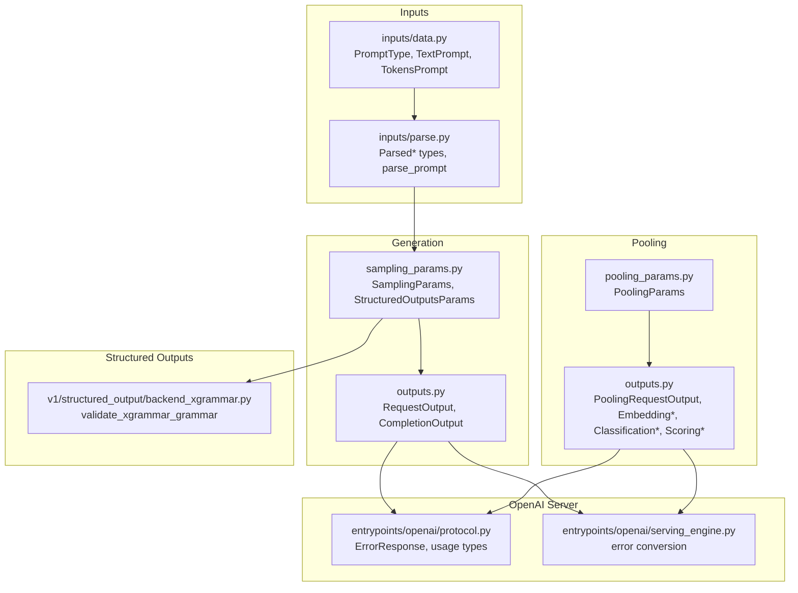
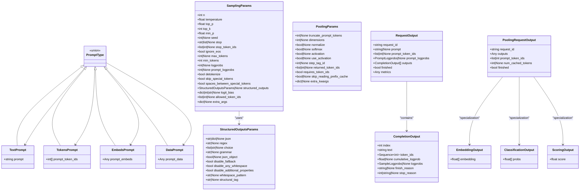
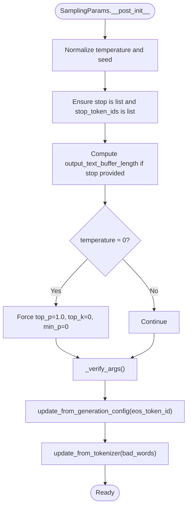
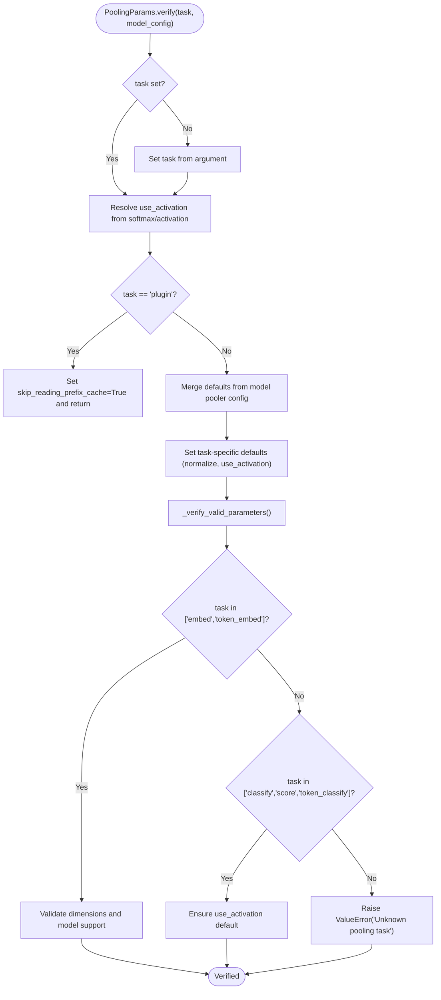
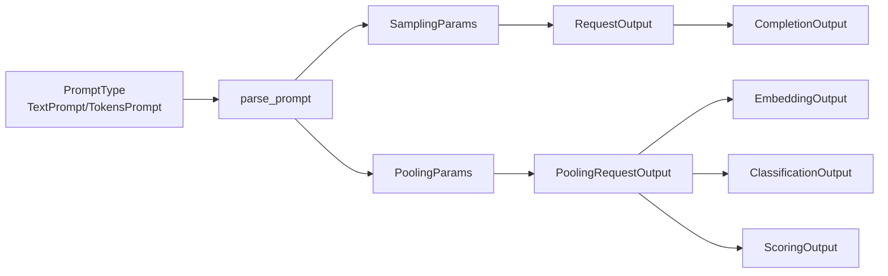

# Data Models and Types

<cite>
**Referenced Files in This Document**
- [sampling_params.py](file://vllm/sampling_params.py)
- [pooling_params.py](file://vllm/pooling_params.py)
- [outputs.py](file://vllm/outputs.py)
- [scalar_type.py](file://vllm/scalar_type.py)
- [inputs/data.py](file://vllm/inputs/data.py)
- [inputs/parse.py](file://vllm/inputs/parse.py)
- [entrypoints/openai/protocol.py](file://vllm/entrypoints/openai/protocol.py)
- [entrypoints/openai/serving_engine.py](file://vllm/entrypoints/openai/serving_engine.py)
- [v1/structured_output/backend_xgrammar.py](file://vllm/v1/structured_output/backend_xgrammar.py)
- [tests/test_pooling_params.py](file://tests/test_pooling_params.py)
- [tests/test_outputs.py](file://tests/test_outputs.py)
- [tests/v1/test_outputs.py](file://tests/v1/test_outputs.py)
</cite>

## Table of Contents
1. [Introduction](#introduction)
2. [Project Structure](#project-structure)
3. [Core Components](#core-components)
4. [Architecture Overview](#architecture-overview)
5. [Detailed Component Analysis](#detailed-component-analysis)
6. [Dependency Analysis](#dependency-analysis)
7. [Performance Considerations](#performance-considerations)
8. [Troubleshooting Guide](#troubleshooting-guide)
9. [Conclusion](#conclusion)
10. [Appendices](#appendices)

## Introduction
This document describes vLLM’s data models and type definitions used across text generation, embeddings, and pooling tasks. It covers:
- Input schemas: PromptType, TextPrompt, TokensPrompt, and related prompt parsing structures
- Output schemas: RequestOutput and specialized pooling outputs
- SamplingParams and PoolingParams configuration and validation
- Structured outputs constraints and validation
- Serialization formats and schema evolution considerations
- Examples of usage across generation, embeddings, and classification

## Project Structure
The relevant data model files are organized by domain:
- Inputs: prompt schemas and parsing utilities
- Generation: sampling parameters and output containers
- Pooling: pooling parameters and output containers
- Structured outputs: constraints and validation helpers
- OpenAI server protocol and error handling

**Diagram sources**
- [inputs/data.py](file://vllm/inputs/data.py#L1-L200)
- [inputs/parse.py](file://vllm/inputs/parse.py#L46-L91)
- [sampling_params.py](file://vllm/sampling_params.py#L111-L598)
- [outputs.py](file://vllm/outputs.py#L1-L346)
- [pooling_params.py](file://vllm/pooling_params.py#L1-L231)
- [v1/structured_output/backend_xgrammar.py](file://vllm/v1/structured_output/backend_xgrammar.py#L250-L291)
- [entrypoints/openai/protocol.py](file://vllm/entrypoints/openai/protocol.py#L164-L200)
- [entrypoints/openai/serving_engine.py](file://vllm/entrypoints/openai/serving_engine.py#L772-L805)

**Section sources**
- [inputs/data.py](file://vllm/inputs/data.py#L1-L200)
- [inputs/parse.py](file://vllm/inputs/parse.py#L46-L91)
- [sampling_params.py](file://vllm/sampling_params.py#L111-L598)
- [outputs.py](file://vllm/outputs.py#L1-L346)
- [pooling_params.py](file://vllm/pooling_params.py#L1-L231)
- [v1/structured_output/backend_xgrammar.py](file://vllm/v1/structured_output/backend_xgrammar.py#L250-L291)
- [entrypoints/openai/protocol.py](file://vllm/entrypoints/openai/protocol.py#L164-L200)
- [entrypoints/openai/serving_engine.py](file://vllm/entrypoints/openai/serving_engine.py#L772-L805)

## Core Components
This section documents the primary data models and their roles.

- PromptType and prompt payload types
  - TextPrompt: a typed dictionary for raw text prompts
  - TokensPrompt: a typed dictionary for token ID arrays
  - EmbedsPrompt/DataPrompt: placeholders for embedding-like inputs
  - PromptType: union of supported prompt forms used across APIs and engines

- SamplingParams
  - Configuration for text generation including sampling controls, stopping criteria, logprobs, structured outputs, and advanced options
  - Validation and normalization logic for safe defaults and constraints

- PoolingParams
  - Configuration for pooling tasks (embeddings, classification, scoring, token-level variants)
  - Parameter merging with model configs, deprecation handling, and step-pooling validation

- Output classes
  - RequestOutput: container for generation outputs and metrics
  - CompletionOutput: per-sequence generation result
  - PoolingRequestOutput and specialized outputs: EmbeddingOutput, ClassificationOutput, ScoringOutput

- StructuredOutputsParams and constraints
  - JSON/regex/choice/grammar/json_object/structural_tag constraints
  - Mutual exclusivity validation and backend hints

- ScalarType
  - Representation of floating-point and integer types for quantization and low-precision storage

**Section sources**
- [inputs/data.py](file://vllm/inputs/data.py#L1-L200)
- [sampling_params.py](file://vllm/sampling_params.py#L111-L598)
- [pooling_params.py](file://vllm/pooling_params.py#L1-L231)
- [outputs.py](file://vllm/outputs.py#L1-L346)
- [scalar_type.py](file://vllm/scalar_type.py#L1-L356)

## Architecture Overview
The data model architecture separates concerns across input parsing, generation configuration, pooling configuration, and output emission. Structured outputs integrate with sampling configuration and backend validation.

**Diagram sources**
- [inputs/data.py](file://vllm/inputs/data.py#L1-L200)
- [sampling_params.py](file://vllm/sampling_params.py#L111-L598)
- [outputs.py](file://vllm/outputs.py#L1-L346)
- [pooling_params.py](file://vllm/pooling_params.py#L1-L231)

## Detailed Component Analysis

### PromptType and Prompt Payloads
- TextPrompt
  - Field: prompt (string)
  - Purpose: raw text input for tokenization
- TokensPrompt
  - Field: prompt_token_ids (list of integers)
  - Purpose: direct token ID input for pre-tokenized prompts
- EmbedsPrompt/DataPrompt
  - Fields: prompt_embeds or prompt_data (arbitrary payload)
  - Purpose: embedding-like or structured prompt data for specialized models
- PromptType
  - Union of TextPrompt, TokensPrompt, EmbedsPrompt, DataPrompt
  - Used across APIs and engines to accept multiple input forms

Validation and parsing:
- parse_prompt validates inputs and returns a list of TokensPrompt or TextPrompt depending on input form
- Accepts string, list of strings, list of ints, or list of lists of ints

Serialization:
- TypedDict-based schemas enable straightforward JSON serialization/deserialization

**Section sources**
- [inputs/data.py](file://vllm/inputs/data.py#L1-L200)
- [inputs/parse.py](file://vllm/inputs/parse.py#L46-L91)

### SamplingParams
- Purpose: configuration for text generation including sampling, stopping, logprobs, structured outputs, and advanced controls
- Key fields and constraints:
  - n: must be integer ≥ 1
  - temperature: non-negative; enforced ≥ threshold in post-init
  - top_p: in (0, 1]; zero temperature forces top_p = 1.0
  - top_k: integer ≥ 0 (allow -1 as disabled); zero temperature forces top_k = 0
  - min_p: in [0, 1]
  - repetition_penalty: > 0
  - presence_penalty, frequency_penalty: in [-2, 2]
  - stop: string or list of strings; empty string disallowed
  - stop_token_ids: list of integers
  - max_tokens, min_tokens: min_tokens ≤ max_tokens when both set
  - logprobs, prompt_logprobs: non-negative or -1
  - truncate_prompt_tokens: ≥ 1 or -1; -1 uses model-supported truncation
  - detokenize: stop requires detokenize=True
  - structured_outputs: StructuredOutputsParams for constrained generation
  - logit_bias: dict of token_id → bias; clamped to [-100, 100]
  - allowed_token_ids: restricts sampling to allowed tokens
  - extra_args: extensibility for custom implementations
- Post-initialization:
  - Normalizes temperature and seeds
  - Converts stop to list and normalizes stop_token_ids
  - Computes buffer length for stop string evaluation
  - Enforces greedy mode constraints when temperature ≈ 0
  - Merges EOS token IDs from generation config
  - Tokenizes bad words into token IDs and validates ranges
- StructuredOutputsParams:
  - Mutually exclusive constraints: json, regex, choice, grammar, json_object, structural_tag
  - Backend hints via internal fields
- Serialization:
  - Uses msgspec.Struct with omit_defaults and dict=True for compact serialization
  - Mixin adds Pydantic-style validation and conversion utilities

**Diagram sources**
- [sampling_params.py](file://vllm/sampling_params.py#L315-L518)

**Section sources**
- [sampling_params.py](file://vllm/sampling_params.py#L111-L598)
- [v1/structured_output/backend_xgrammar.py](file://vllm/v1/structured_output/backend_xgrammar.py#L250-L291)

### StructuredOutputsParams
- Constraints:
  - Exactly one of json, regex, choice, grammar, json_object, structural_tag may be set
- Options:
  - disable_fallback, disable_any_whitespace, disable_additional_properties
  - whitespace_pattern, structural_tag
- Backend hints:
  - Internal _backend and _backend_was_auto for downstream processors

Validation:
- Mutual exclusivity enforced in __post_init__
- Additional backend-specific validation in processors

**Section sources**
- [sampling_params.py](file://vllm/sampling_params.py#L31-L100)

### PoolingParams
- Purpose: configuration for pooling tasks (embeddings, classification, scoring, token-level variants)
- Fields:
  - truncate_prompt_tokens: -1 (model default), k (left-truncate), None (disabled)
  - dimensions, normalize: embedding dimensions and normalization
  - softmax, activation, use_activation: classification activation behavior (softmax and activation deprecated in favor of use_activation)
  - step_tag_id, returned_token_ids: step pooling parameters
  - Internal: task, requires_token_ids, skip_reading_prefix_cache, extra_kwargs, output_kind (FINAL_ONLY)
- Verification:
  - Validates task consistency and merges defaults from model pooler config
  - Enforces valid parameters per task
  - Matryoshka dimension validation for embedding tasks
  - Step pooling parameter validation and defaults

**Diagram sources**
- [pooling_params.py](file://vllm/pooling_params.py#L82-L231)

**Section sources**
- [pooling_params.py](file://vllm/pooling_params.py#L1-L231)

### Output Classes
- RequestOutput
  - Fields: request_id, prompt, prompt_token_ids, prompt_logprobs, outputs (list of CompletionOutput), finished, metrics, lora_request, encoder_prompt, encoder_prompt_token_ids, num_cached_tokens, kv_transfer_params, multi_modal_placeholders
  - Methods: add() merges subsequent outputs; ignores unknown kwargs with a warning
- CompletionOutput
  - Fields: index, text, token_ids, cumulative_logprob, logprobs, finish_reason, stop_reason, lora_request
- PoolingRequestOutput[O]
  - Fields: request_id, outputs (of type O), prompt_token_ids, num_cached_tokens, finished
- Specialized pooling outputs:
  - EmbeddingOutput: embedding as list[float]
  - ClassificationOutput: probs as list[float]
  - ScoringOutput: score as float

Serialization:
- msgspec.Struct used for SamplingParams and PoolingParams for efficient serialization
- dataclass-based outputs for Python-native serialization

**Section sources**
- [outputs.py](file://vllm/outputs.py#L1-L346)

### Structured Outputs Validation
- validate_xgrammar_grammar checks JSON schema compatibility for xgrammar backend
- Flags unsupported keywords and recursively validates nested structures

**Section sources**
- [v1/structured_output/backend_xgrammar.py](file://vllm/v1/structured_output/backend_xgrammar.py#L250-L291)

### OpenAI Server Protocol and Error Handling
- ErrorResponse and related usage types define standardized error responses
- Serving engine converts internal errors to ErrorResponse with appropriate status codes

**Section sources**
- [entrypoints/openai/protocol.py](file://vllm/entrypoints/openai/protocol.py#L164-L200)
- [entrypoints/openai/serving_engine.py](file://vllm/entrypoints/openai/serving_engine.py#L772-L805)

## Dependency Analysis
Key dependencies and relationships:
- PromptType and prompt payloads feed into parse_prompt, which returns TokensPrompt or TextPrompt for downstream processing
- SamplingParams drives generation and integrates with structured outputs constraints
- PoolingParams governs pooling behavior and interacts with model pooler configuration
- Output classes encapsulate results for both generation and pooling tasks
- Structured outputs validation ensures backend compatibility

**Diagram sources**
- [inputs/data.py](file://vllm/inputs/data.py#L1-L200)
- [inputs/parse.py](file://vllm/inputs/parse.py#L46-L91)
- [sampling_params.py](file://vllm/sampling_params.py#L111-L598)
- [outputs.py](file://vllm/outputs.py#L1-L346)
- [pooling_params.py](file://vllm/pooling_params.py#L1-L231)

**Section sources**
- [inputs/data.py](file://vllm/inputs/data.py#L1-L200)
- [inputs/parse.py](file://vllm/inputs/parse.py#L46-L91)
- [sampling_params.py](file://vllm/sampling_params.py#L111-L598)
- [outputs.py](file://vllm/outputs.py#L1-L346)
- [pooling_params.py](file://vllm/pooling_params.py#L1-L231)

## Performance Considerations
- SamplingParams serialization uses msgspec.Struct with omit_defaults to minimize payload sizes
- PoolingParams uses array_like=True for efficient serialization when applicable
- RequestOutput.add() supports aggregation vs replacement modes to balance memory and correctness
- Truncation options (truncate_prompt_tokens) help manage long prompts efficiently

[No sources needed since this section provides general guidance]

## Troubleshooting Guide
Common validation and runtime issues:
- SamplingParams
  - n must be ≥ 1; temperature must be non-negative; enforce minimum threshold to avoid numerical instability
  - top_p must be in (0, 1]; top_k must be 0 or ≥ 1; min_p in [0, 1]
  - max_tokens ≥ 1; min_tokens ≥ 0; min_tokens ≤ max_tokens
  - logprobs and prompt_logprobs must be non-negative or -1
  - stop cannot contain empty strings; detokenize must be True when stop is used
  - stop_token_ids must be integers; bad_words must tokenize to valid ranges
  - Greedy mode requires n = 1
- PoolingParams
  - Unknown task raises ValueError
  - Matryoshka embedding dimensions must be supported by the model
  - Step pooling parameters are only valid for STEP pooling type
  - softmax and activation are deprecated; use use_activation
- Structured outputs
  - Exactly one constraint type must be set
  - Backend-specific validation may reject unsupported JSON schema keywords

Error handling in server:
- Generation errors mapped to ErrorResponse with status codes
- Streaming error responses formatted consistently

**Section sources**
- [sampling_params.py](file://vllm/sampling_params.py#L369-L518)
- [pooling_params.py](file://vllm/pooling_params.py#L188-L231)
- [entrypoints/openai/serving_engine.py](file://vllm/entrypoints/openai/serving_engine.py#L772-L805)

## Conclusion
vLLM’s data models provide a robust, validated, and serializable foundation for text generation and pooling tasks. Prompt schemas unify raw text and token inputs, SamplingParams centralizes generation configuration with strong validation, PoolingParams adapts to model capabilities, and output classes standardize result formats. Structured outputs integrate cleanly with sampling configuration and backend validation. Together, these models enable consistent behavior across APIs and engines while supporting schema evolution and backward compatibility.

[No sources needed since this section summarizes without analyzing specific files]

## Appendices

### Appendix A: Field Definitions and Validation Rules
- SamplingParams
  - n: integer ≥ 1
  - temperature: float ≥ 0; internally clamped to a small positive threshold
  - top_p: float ∈ (0, 1]; forced to 1.0 under greedy
  - top_k: int ≥ 0; -1 accepted as disabled; forced to 0 under greedy
  - min_p: float ∈ [0, 1]
  - repetition_penalty: float > 0
  - presence_penalty, frequency_penalty: float ∈ [-2, 2]
  - stop: str or list[str]; empty string disallowed; detokenize must be True when stop is used
  - stop_token_ids: list[int]
  - max_tokens, min_tokens: min_tokens ≤ max_tokens when both set
  - logprobs, prompt_logprobs: non-negative or -1
  - truncate_prompt_tokens: ≥ 1 or -1
  - structured_outputs: exactly one of json/regex/choice/grammar/json_object/structural_tag
- PoolingParams
  - truncate_prompt_tokens: -1, ≥ 1, or None
  - dimensions: > 0 when set; must match model-supported Matryoshka dimensions
  - normalize: bool when applicable
  - use_activation: bool; default True for classification tasks
  - step_tag_id, returned_token_ids: only valid for STEP pooling type

**Section sources**
- [sampling_params.py](file://vllm/sampling_params.py#L369-L518)
- [pooling_params.py](file://vllm/pooling_params.py#L163-L231)

### Appendix B: Serialization Formats
- SamplingParams: msgspec.Struct with omit_defaults=True and dict=True
- PoolingParams: msgspec.Struct with omit_defaults=True and array_like=True
- Outputs: dataclass-based for Python-native serialization; msgspec-compatible when used in engine contexts

**Section sources**
- [sampling_params.py](file://vllm/sampling_params.py#L111-L120)
- [pooling_params.py](file://vllm/pooling_params.py#L15-L20)
- [outputs.py](file://vllm/outputs.py#L1-L30)

### Appendix C: Schema Evolution and Backward Compatibility
- RequestOutput supports **kwargs with a warning to maintain forward compatibility
- PoolingParams enforces strict parameter sets per task; deprecated fields (softmax, activation) are resolved to use_activation
- Tests validate pooling parameter behavior and error conditions

**Section sources**
- [outputs.py](file://vllm/outputs.py#L120-L145)
- [pooling_params.py](file://vllm/pooling_params.py#L91-L100)
- [tests/test_pooling_params.py](file://tests/test_pooling_params.py)
- [tests/test_outputs.py](file://tests/test_outputs.py)
- [tests/v1/test_outputs.py](file://tests/v1/test_outputs.py)