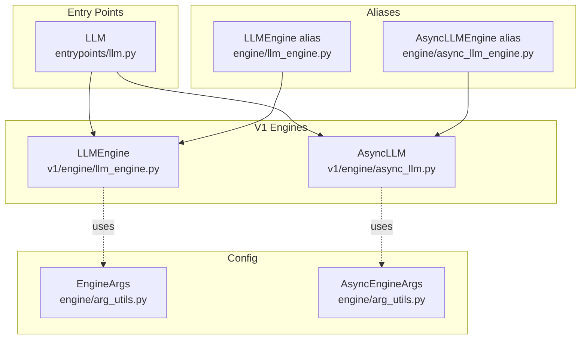
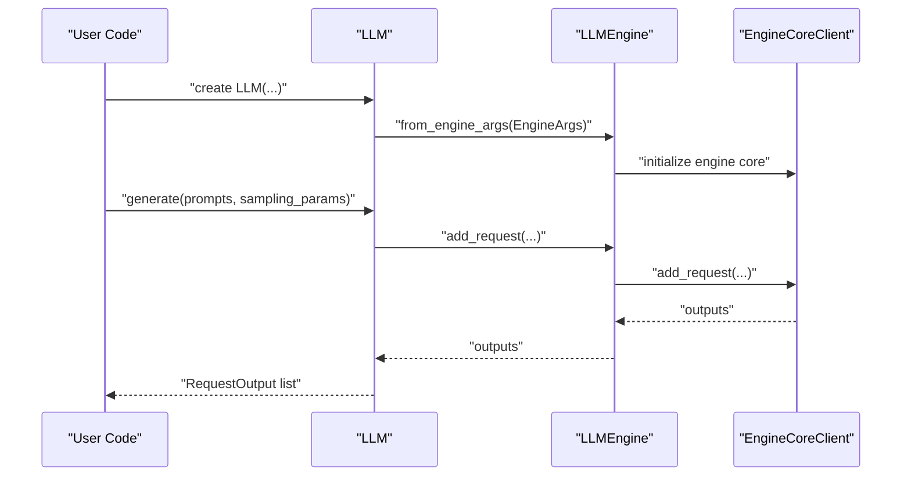
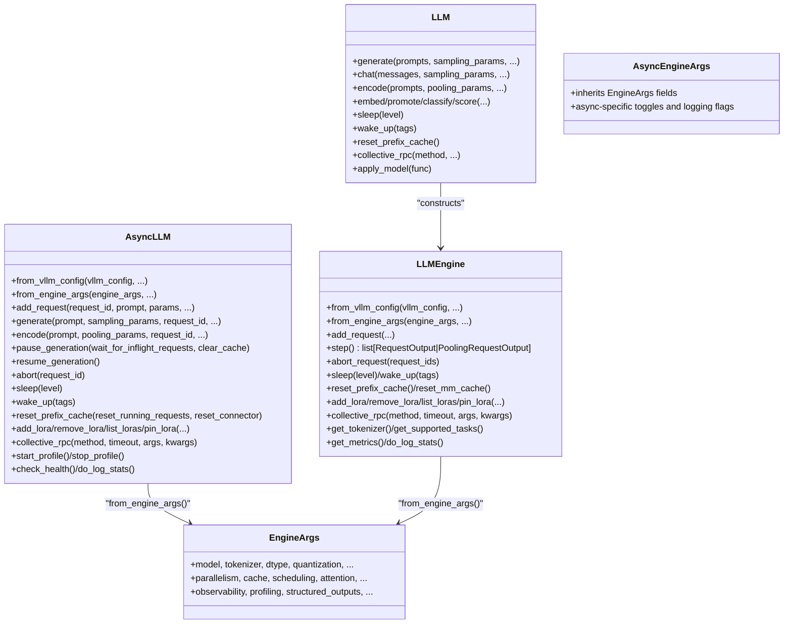
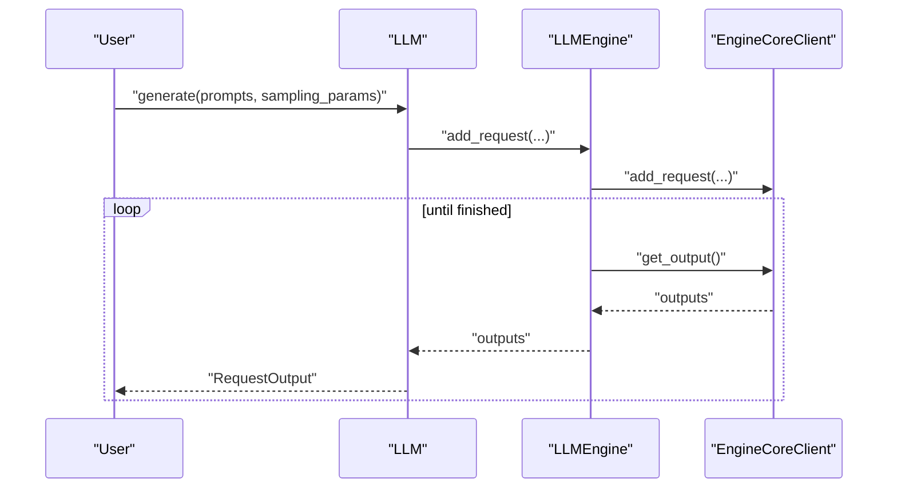
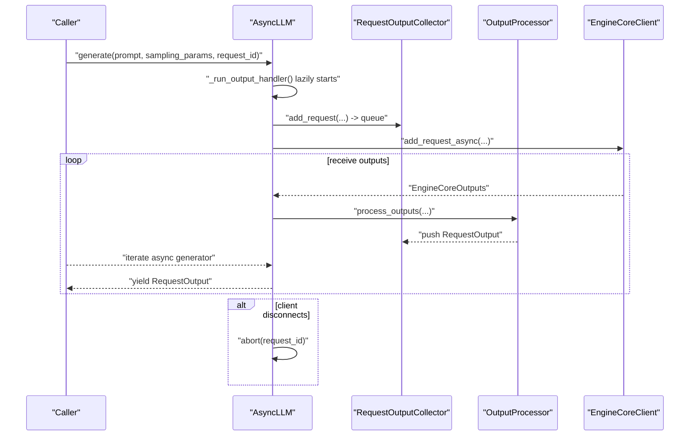
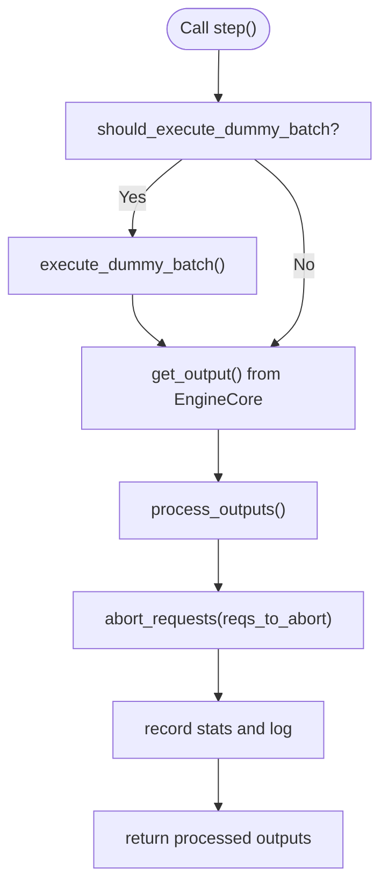
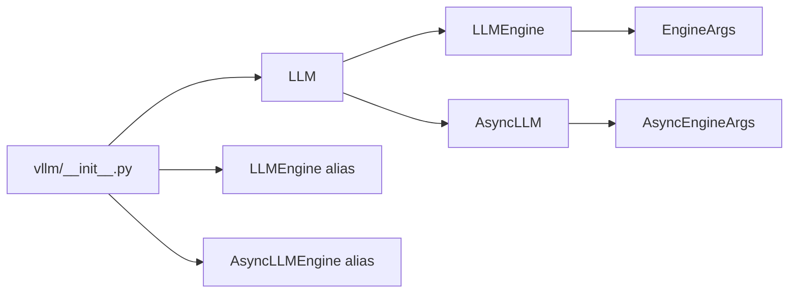

# Core Classes

<cite>
**Referenced Files in This Document**
- [__init__.py](file://vllm/__init__.py)
- [llm.py](file://vllm/entrypoints/llm.py)
- [llm_engine.py](file://vllm/v1/engine/llm_engine.py)
- [async_llm.py](file://vllm/v1/engine/async_llm.py)
- [arg_utils.py](file://vllm/engine/arg_utils.py)
- [llm_engine_alias.py](file://vllm/engine/llm_engine.py)
- [async_llm_engine_alias.py](file://vllm/engine/async_llm_engine.py)
- [protocol.py](file://vllm/engine/protocol.py)
</cite>

## Table of Contents
1. [Introduction](#introduction)
2. [Project Structure](#project-structure)
3. [Core Components](#core-components)
4. [Architecture Overview](#architecture-overview)
5. [Detailed Component Analysis](#detailed-component-analysis)
6. [Dependency Analysis](#dependency-analysis)
7. [Performance Considerations](#performance-considerations)
8. [Troubleshooting Guide](#troubleshooting-guide)
9. [Conclusion](#conclusion)

## Introduction
This document explains vLLM’s core classes for inference and engine configuration:
- LLM: a high-level synchronous class for offline text generation and embeddings.
- AsyncLLMEngine: the asynchronous engine used for streaming and concurrent request handling.
- LLMEngine: the synchronous engine for batch-style, step-by-step processing.

It covers constructor parameters, initialization options, usage patterns, configuration via EngineArgs/AsyncEngineArgs, hardware and memory controls, and practical examples for different deployment scenarios.

## Project Structure
At a high level:
- vllm/entrypoints/llm.py defines the LLM class for simple inference.
- vllm/v1/engine/llm_engine.py and vllm/v1/engine/async_llm.py define the synchronous and asynchronous engines respectively.
- vllm/engine/arg_utils.py defines EngineArgs and AsyncEngineArgs for configuration.
- vllm/engine/llm_engine.py and vllm/engine/async_llm_engine.py are aliases that delegate to v1 implementations.

**Diagram sources**
- [llm.py](file://vllm/entrypoints/llm.py#L190-L350)
- [llm_engine.py](file://vllm/v1/engine/llm_engine.py#L46-L120)
- [async_llm.py](file://vllm/v1/engine/async_llm.py#L54-L120)
- [arg_utils.py](file://vllm/engine/arg_utils.py#L354-L700)
- [llm_engine_alias.py](file://vllm/engine/llm_engine.py#L1-L7)
- [async_llm_engine_alias.py](file://vllm/engine/async_llm_engine.py#L1-L7)

**Section sources**
- [llm.py](file://vllm/entrypoints/llm.py#L190-L350)
- [llm_engine.py](file://vllm/v1/engine/llm_engine.py#L46-L120)
- [async_llm.py](file://vllm/v1/engine/async_llm.py#L54-L120)
- [arg_utils.py](file://vllm/engine/arg_utils.py#L354-L700)
- [llm_engine_alias.py](file://vllm/engine/llm_engine.py#L1-L7)
- [async_llm_engine_alias.py](file://vllm/engine/async_llm_engine.py#L1-L7)

## Core Components
- LLM: Initializes an engine (via LLMEngine) and exposes generate(), chat(), encode(), embed(), classify(), score(), and other convenience APIs. It supports batching, LoRA, multimodal inputs, and structured outputs.
- AsyncLLM: Provides async add_request(), generate(), encode(), and lifecycle controls (pause/resume, sleep/wake, abort, RPC helpers).
- LLMEngine: Legacy synchronous engine wrapper around the v1 engine core; supports add_request(), step(), abort_request(), and metrics/logging.
- EngineArgs/AsyncEngineArgs: Configuration dataclasses for model, parallelism, caching, quantization, attention, observability, and more.

Key responsibilities:
- LLM: user-friendly API for offline inference and embeddings.
- AsyncLLM: streaming, concurrent request handling, pause/resume, and robust error propagation.
- LLMEngine: synchronous orchestration and step-wise execution.
- EngineArgs/AsyncEngineArgs: unified configuration surface for all engine features.

**Section sources**
- [llm.py](file://vllm/entrypoints/llm.py#L190-L350)
- [async_llm.py](file://vllm/v1/engine/async_llm.py#L230-L337)
- [llm_engine.py](file://vllm/v1/engine/llm_engine.py#L148-L191)
- [arg_utils.py](file://vllm/engine/arg_utils.py#L354-L700)

## Architecture Overview
The LLM class constructs an LLMEngine from EngineArgs and delegates to it for generation. AsyncLLM wraps the v1 engine core and manages an output handler loop and request queues. Both rely on shared configuration via EngineArgs/AsyncEngineArgs.

**Diagram sources**
- [llm.py](file://vllm/entrypoints/llm.py#L333-L350)
- [llm_engine.py](file://vllm/v1/engine/llm_engine.py#L222-L284)
- [protocol.py](file://vllm/engine/protocol.py#L1-L200)

## Detailed Component Analysis

### LLM (Offline Inference)
- Constructor parameters include model, tokenizer, dtype, quantization, tensor_parallel_size, gpu_memory_utilization, swap_space, cpu_offload_gb, enforce_eager, hf overrides, multimodal processor kwargs, pooling config, attention/compilation/structured outputs/profiler configs, and arbitrary EngineArgs fields.
- Initialization builds EngineArgs and creates LLMEngine.
- Key methods:
  - generate(): batch text generation with optional LoRA and priorities.
  - chat(): converts chat messages to prompts and calls generate().
  - encode()/embed()/classify()/score(): pooling and scoring APIs.
  - sleep()/wake_up(): power-saving modes.
  - reset_prefix_cache()/reset_mm_cache(): cache management.
  - collective_rpc()/apply_model(): low-level worker RPC/model apply.

Usage patterns:
- Single prompt or batch prompts.
- Streaming not exposed by LLM.generate(); use AsyncLLM for streaming.
- LoRA support via LoRARequest; multimodal prompts supported.

Practical example references:
- Offline inference examples demonstrate LLM usage in [examples/offline_inference](file://examples/offline_inference/README.md).

**Section sources**
- [llm.py](file://vllm/entrypoints/llm.py#L190-L350)
- [llm.py](file://vllm/entrypoints/llm.py#L365-L435)
- [llm.py](file://vllm/entrypoints/llm.py#L865-L948)
- [llm.py](file://vllm/entrypoints/llm.py#L949-L1599)

### AsyncLLM (Asynchronous Engine)
- Constructor accepts vllm_config, executor class, logging flags, usage context, and optional stat loggers.
- Methods:
  - from_vllm_config()/from_engine_args(): construct from configs or EngineArgs.
  - add_request(): enqueues a request; supports n>1 fan-out.
  - generate(): returns an async generator of RequestOutput; handles pause/resume, abort on disconnect, and error propagation.
  - encode(): async pooling generator.
  - pause_generation()/resume_generation(): pause/resume with cache control.
  - abort(): cancels one or multiple requests.
  - sleep()/wake_up(): engine sleep/wake with tags.
  - reset_prefix_cache()/reset_mm_cache(): cache resets.
  - add_lora()/remove_lora()/list_loras()/pin_lora(): LoRA management.
  - collective_rpc(): RPC to workers.
  - start_profile()/stop_profile(): profiling control.
  - check_health()/do_log_stats(): health and logging helpers.

Concurrency and streaming:
- Uses an output handler background task to pull outputs from the engine core and push into per-request queues.
- Respects pause condition; clients iterate the async generator to receive streamed outputs.

**Section sources**
- [async_llm.py](file://vllm/v1/engine/async_llm.py#L54-L120)
- [async_llm.py](file://vllm/v1/engine/async_llm.py#L230-L337)
- [async_llm.py](file://vllm/v1/engine/async_llm.py#L338-L472)
- [async_llm.py](file://vllm/v1/engine/async_llm.py#L472-L607)
- [async_llm.py](file://vllm/v1/engine/async_llm.py#L607-L760)
- [async_llm.py](file://vllm/v1/engine/async_llm.py#L760-L800)

### LLMEngine (Synchronous Engine)
- Legacy wrapper around the v1 engine core.
- Methods:
  - from_vllm_config()/from_engine_args(): construct from configs.
  - add_request(): single or fan-out child requests.
  - step(): fetches outputs, processes them, aborts finished requests, records stats.
  - abort_request(): cancels requests.
  - sleep()/wake_up()/reset_prefix_cache()/reset_mm_cache(): lifecycle and cache controls.
  - get_tokenizer()/get_supported_tasks(): metadata access.
  - add_lora()/remove_lora()/list_loras()/pin_lora(): LoRA management.
  - collective_rpc()/apply_model(): RPC/model apply.
  - get_metrics()/do_log_stats(): metrics and logging.

Blocking behavior:
- step() blocks until outputs are ready from the engine core.
- Useful for batch-style control loops and deterministic stepping.

**Section sources**
- [llm_engine.py](file://vllm/v1/engine/llm_engine.py#L46-L120)
- [llm_engine.py](file://vllm/v1/engine/llm_engine.py#L148-L191)
- [llm_engine.py](file://vllm/v1/engine/llm_engine.py#L222-L320)
- [llm_engine.py](file://vllm/v1/engine/llm_engine.py#L321-L415)

### EngineArgs and AsyncEngineArgs (Configuration)
- EngineArgs fields cover model, tokenizer, dtype, quantization, revision, seed, memory and cache sizing, parallelism (tensor/pipeline/data/context parallel), chunked prefill, prefix caching, LoRA, multimodal, observability, compilation, attention, structured outputs, profiling, KV transfer/events, and more.
- AsyncEngineArgs mirrors EngineArgs plus async-specific toggles and logging flags.

Common categories:
- Model and tokenizer: model, tokenizer, tokenizer_mode, trust_remote_code, revisions, tokenizer_revision, skip_tokenizer_init, enable_prompt_embeds.
- Hardware and memory: dtype, quantization, tensor_parallel_size, pipeline_parallel_size, gpu_memory_utilization, kv_cache_memory_bytes, swap_space, cpu_offload_gb, enforce_eager, block_size, num_gpu_blocks_override, sliding window toggles.
- Parallelism: data_parallel_size, data_parallel_rank/start_rank/size_local/address/rpc_port, distributed_executor_backend, all2all_backend, enable_expert_parallel, expert_placement_strategy, enable_dbo, ubatch_size, disable_nccl_for_dp_synchronization, ray workers flags.
- Scheduling and batching: max_num_batched_tokens, max_num_seqs, max_num_partial_prefills, max_long_partial_prefills, long_prefill_token_threshold, scheduling_policy, scheduler_cls, async_scheduling, stream_interval, disable_hybrid_kv_cache_manager, enable_chunked_prefill, disable_chunked_mm_input.
- Attention and compilation: attention_backend, cudagraph capture sizes, max_cudagraph_capture_size, optimization_level.
- Observability and profiling: otlp_traces_endpoint, collect_detailed_traces, kv_cache_metrics/sample, cudagraph_metrics, enable_layerwise_nvtx_tracing, enable_mfu_metrics, profiler_config, show_hidden_metrics_for_version.
- Structured outputs and logits processors: structured_outputs_config, reasoning_parser, reasoning_parser_plugin, logits_processors.
- KV transfer and events: kv_transfer_config, kv_events_config.
- Additional: additional_config, model_loader_extra_config, ignore_patterns, use_tqdm_on_load, pt_load_map_location, tokens_only, io_processor_plugin, generation_config, override_generation_config, enable_sleep_mode, model_impl, override_attention_dtype, logprobs_mode, max_logprobs, disable_sliding_window, disable_cascade_attn, pooler_config, logits_processor_pattern.

CLI generation:
- EngineArgs.add_cli_args() registers all configuration flags for CLI usage.

**Section sources**
- [arg_utils.py](file://vllm/engine/arg_utils.py#L354-L700)
- [arg_utils.py](file://vllm/engine/arg_utils.py#L700-L1176)
- [arg_utils.py](file://vllm/engine/arg_utils.py#L1177-L1318)
- [arg_utils.py](file://vllm/engine/arg_utils.py#L1314-L1599)

## Architecture Overview

**Diagram sources**
- [llm.py](file://vllm/entrypoints/llm.py#L190-L350)
- [async_llm.py](file://vllm/v1/engine/async_llm.py#L230-L337)
- [llm_engine.py](file://vllm/v1/engine/llm_engine.py#L148-L191)
- [arg_utils.py](file://vllm/engine/arg_utils.py#L354-L700)

## Detailed Component Analysis

### LLM.generate() flow

**Diagram sources**
- [llm.py](file://vllm/entrypoints/llm.py#L365-L435)
- [llm_engine.py](file://vllm/v1/engine/llm_engine.py#L222-L320)

**Section sources**
- [llm.py](file://vllm/entrypoints/llm.py#L365-L435)
- [llm_engine.py](file://vllm/v1/engine/llm_engine.py#L222-L320)

### AsyncLLM.generate() streaming flow

**Diagram sources**
- [async_llm.py](file://vllm/v1/engine/async_llm.py#L338-L472)
- [async_llm.py](file://vllm/v1/engine/async_llm.py#L472-L542)

**Section sources**
- [async_llm.py](file://vllm/v1/engine/async_llm.py#L338-L472)
- [async_llm.py](file://vllm/v1/engine/async_llm.py#L472-L542)

### LLMEngine.step() processing loop

**Diagram sources**
- [llm_engine.py](file://vllm/v1/engine/llm_engine.py#L285-L320)

**Section sources**
- [llm_engine.py](file://vllm/v1/engine/llm_engine.py#L285-L320)

## Dependency Analysis
- LLM depends on LLMEngine (constructed from EngineArgs).
- AsyncLLM depends on EngineArgs/AsyncEngineArgs and the v1 engine core.
- LLMEngine and AsyncLLM both depend on the same underlying engine core and share configuration via EngineArgs/AsyncEngineArgs.
- Aliases in vllm/engine/* redirect to v1 implementations.

**Diagram sources**
- [__init__.py](file://vllm/__init__.py#L16-L41)
- [llm_engine_alias.py](file://vllm/engine/llm_engine.py#L1-L7)
- [async_llm_engine_alias.py](file://vllm/engine/async_llm_engine.py#L1-L7)
- [llm.py](file://vllm/entrypoints/llm.py#L333-L350)
- [llm_engine.py](file://vllm/v1/engine/llm_engine.py#L148-L191)
- [async_llm.py](file://vllm/v1/engine/async_llm.py#L230-L337)

**Section sources**
- [__init__.py](file://vllm/__init__.py#L16-L41)
- [llm_engine_alias.py](file://vllm/engine/llm_engine.py#L1-L7)
- [async_llm_engine_alias.py](file://vllm/engine/async_llm_engine.py#L1-L7)
- [llm.py](file://vllm/entrypoints/llm.py#L333-L350)
- [llm_engine.py](file://vllm/v1/engine/llm_engine.py#L148-L191)
- [async_llm.py](file://vllm/v1/engine/async_llm.py#L230-L337)

## Performance Considerations
- Memory management:
  - Adjust gpu_memory_utilization and kv_cache_memory_bytes to fit model size and context length.
  - Use swap_space and cpu_offload_gb judiciously; higher values trade compute speed for capacity.
- Parallelism:
  - Tune tensor_parallel_size, pipeline_parallel_size, data_parallel_size according to hardware.
  - Context parallelism (prefill/decode) can improve decode throughput; ensure tp % dcp == 0.
- Scheduling and batching:
  - max_num_batched_tokens and max_num_seqs control throughput vs latency.
  - async_scheduling and stream_interval influence responsiveness.
- Compilation and graphs:
  - enforce_eager disables CUDA graphs; hybrid mode often optimal.
  - cudagraph_capture_sizes and max_cudagraph_capture_size can improve latency for fixed shapes.
- Attention and quantization:
  - attention_backend selection and quantization methods affect throughput and memory footprint.
- Observability:
  - Enable profiling and metrics selectively to avoid overhead.

[No sources needed since this section provides general guidance]

## Troubleshooting Guide
- Out-of-memory (OOM):
  - Reduce gpu_memory_utilization, kv_cache_memory_bytes, max_num_batched_tokens, or enable CPU offload.
- Hanging or deadlocks:
  - Ensure proper shutdown of AsyncLLM (shutdown()) and LLMEngine to release background tasks and IPC.
- Streaming issues:
  - Verify pause/resume state and that output_handler is running.
- Validation errors:
  - AsyncLLM.generate() raises EngineGenerateError on unexpected failures; inspect logs and request validation.
- Data parallel misuse:
  - LLM(data_parallel_size > 1) requires multi-process usage; otherwise it may hang.

**Section sources**
- [async_llm.py](file://vllm/v1/engine/async_llm.py#L254-L268)
- [llm_engine.py](file://vllm/v1/engine/llm_engine.py#L411-L415)

## Conclusion
vLLM provides three complementary interfaces:
- LLM for simple, synchronous offline inference and embeddings.
- AsyncLLM for streaming, concurrent request handling, and pause/resume workflows.
- LLMEngine for synchronous orchestration and deterministic stepping.

Configuration is centralized in EngineArgs/AsyncEngineArgs, enabling precise control over hardware, memory, scheduling, and performance. Use AsyncLLM for online serving and streaming, and LLM for offline jobs. For production deployments, combine appropriate parallelism, memory settings, and observability to achieve desired throughput and latency.