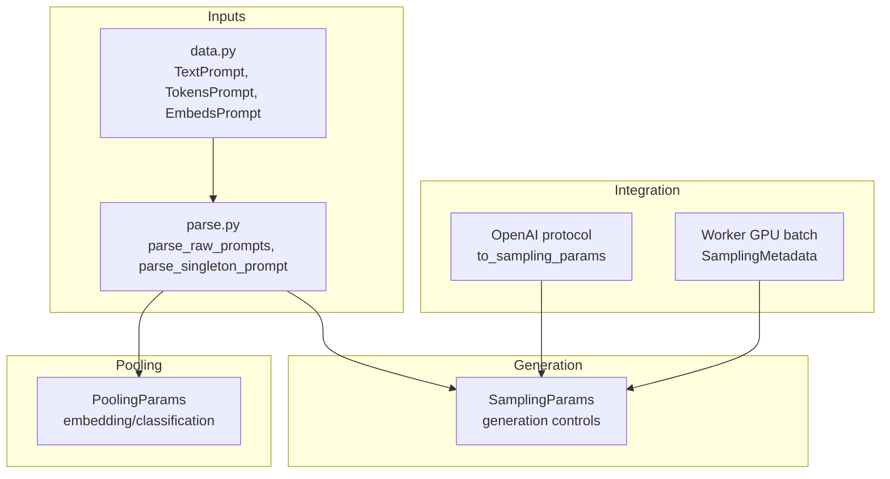
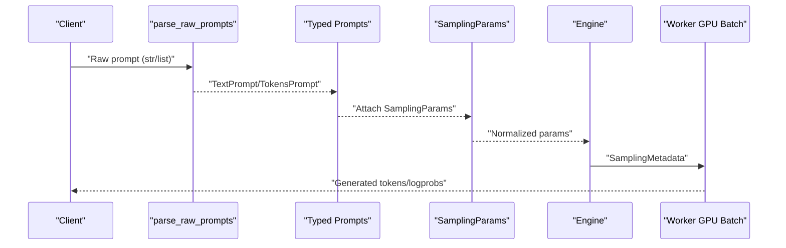
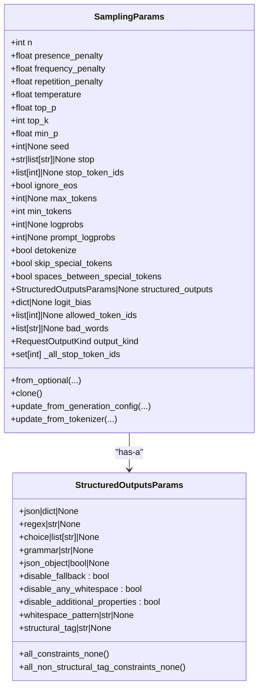
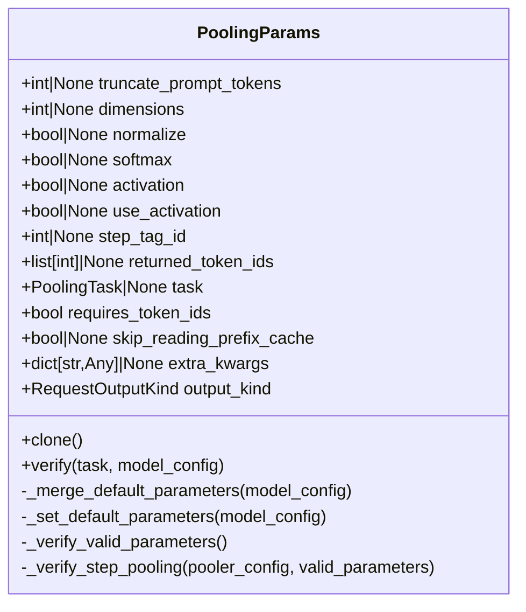
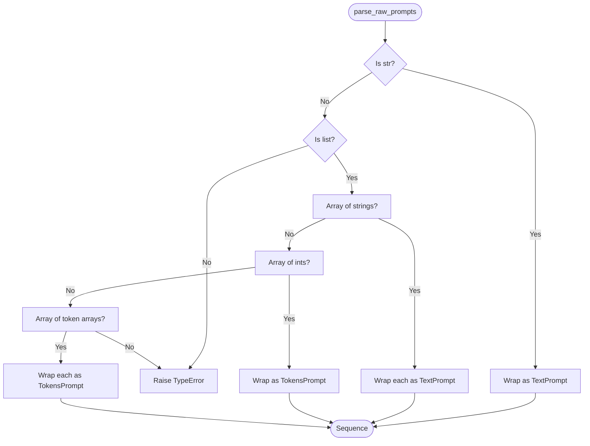
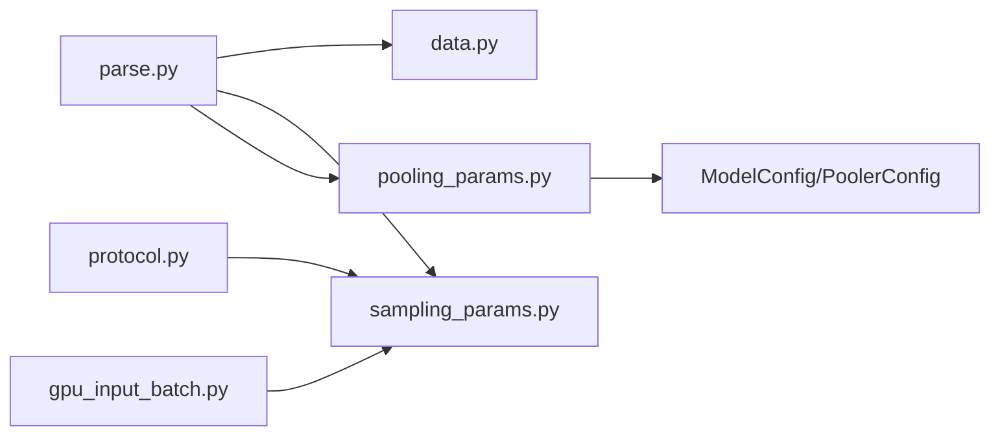

# Data Models and Parameters

<cite>
**Referenced Files in This Document**
- [sampling_params.py](file://vllm/sampling_params.py)
- [pooling_params.py](file://vllm/pooling_params.py)
- [data.py](file://vllm/inputs/data.py)
- [parse.py](file://vllm/inputs/parse.py)
- [protocol.py](file://vllm/entrypoints/openai/protocol.py)
- [test_inputs.py](file://tests/test_inputs.py)
- [gpu_input_batch.py](file://vllm/v1/worker/gpu_input_batch.py)
</cite>

## Table of Contents
1. [Introduction](#introduction)
2. [Project Structure](#project-structure)
3. [Core Components](#core-components)
4. [Architecture Overview](#architecture-overview)
5. [Detailed Component Analysis](#detailed-component-analysis)
6. [Dependency Analysis](#dependency-analysis)
7. [Performance Considerations](#performance-considerations)
8. [Troubleshooting Guide](#troubleshooting-guide)
9. [Conclusion](#conclusion)
10. [Appendices](#appendices)

## Introduction
This document explains vLLM’s data models and parameter classes that control generation and embedding operations. It focuses on:
- SamplingParams for generation control (including temperature, top_p, top_k, max_tokens, repetition_penalty, stop, and related behaviors)
- PoolingParams for embedding and classification operations
- Input data structures (PromptType, TextPrompt, TokensPrompt, EmbedsPrompt) and how they are parsed and validated
- Parameter validation rules, defaults, and recommended configurations
- Practical examples of parameter combinations and integration with core classes

## Project Structure
The relevant modules are organized by responsibility:
- Generation parameters: vllm/sampling_params.py
- Pooling parameters: vllm/pooling_params.py
- Input schemas and parsing: vllm/inputs/data.py and vllm/inputs/parse.py
- OpenAI-compatible conversion: vllm/entrypoints/openai/protocol.py
- Tests validating parsing and usage: tests/test_inputs.py
- Integration in worker batching: vllm/v1/worker/gpu_input_batch.py

**Diagram sources**
- [sampling_params.py](file://vllm/sampling_params.py#L111-L598)
- [pooling_params.py](file://vllm/pooling_params.py#L15-L231)
- [data.py](file://vllm/inputs/data.py#L21-L208)
- [parse.py](file://vllm/inputs/parse.py#L25-L148)
- [protocol.py](file://vllm/entrypoints/openai/protocol.py#L752-L1211)
- [gpu_input_batch.py](file://vllm/v1/worker/gpu_input_batch.py#L819-L845)

**Section sources**
- [sampling_params.py](file://vllm/sampling_params.py#L111-L598)
- [pooling_params.py](file://vllm/pooling_params.py#L15-L231)
- [data.py](file://vllm/inputs/data.py#L21-L208)
- [parse.py](file://vllm/inputs/parse.py#L25-L148)
- [protocol.py](file://vllm/entrypoints/openai/protocol.py#L752-L1211)
- [test_inputs.py](file://tests/test_inputs.py#L1-L126)
- [gpu_input_batch.py](file://vllm/v1/worker/gpu_input_batch.py#L819-L845)

## Core Components
- SamplingParams: Encapsulates all generation controls and validation rules. Includes penalties, nucleus/top-k sampling, stopping criteria, logprobs, truncation, structured outputs, and more.
- PoolingParams: Encapsulates pooling operation parameters for embeddings, classification, scoring, and step-wise pooling. Validates against task type and model capabilities.
- Input schemas: TextPrompt, TokensPrompt, EmbedsPrompt define the supported input forms. parse_raw_prompts and parse_singleton_prompt convert raw inputs into typed prompts.

Key defaults and behaviors:
- SamplingParams defaults are applied in a factory-like constructor and post-initialization normalization.
- PoolingParams defaults depend on task type and model configuration; validation ensures only supported parameters are used.

**Section sources**
- [sampling_params.py](file://vllm/sampling_params.py#L111-L598)
- [pooling_params.py](file://vllm/pooling_params.py#L15-L231)
- [data.py](file://vllm/inputs/data.py#L21-L208)
- [parse.py](file://vllm/inputs/parse.py#L25-L148)

## Architecture Overview
The following diagram shows how inputs and parameters flow through the system during generation and pooling.

**Diagram sources**
- [parse.py](file://vllm/inputs/parse.py#L25-L148)
- [sampling_params.py](file://vllm/sampling_params.py#L244-L314)
- [gpu_input_batch.py](file://vllm/v1/worker/gpu_input_batch.py#L819-L845)

## Detailed Component Analysis

### SamplingParams: Generation Controls
SamplingParams defines the complete set of generation controls and validation rules. Highlights:
- Penalties and repetition control:
  - presence_penalty, frequency_penalty, repetition_penalty
- Sampling strategies:
  - temperature, top_p, top_k, min_p
- Stopping and truncation:
  - stop, stop_token_ids, ignore_eos, include_stop_str_in_output, truncate_prompt_tokens
- Length bounds:
  - max_tokens, min_tokens
- Log probabilities:
  - logprobs, prompt_logprobs, flat_logprobs
- Detokenization and special tokens:
  - detokenize, skip_special_tokens, spaces_between_special_tokens
- Structured outputs and logits processors:
  - structured_outputs, logit_bias, allowed_token_ids, logits_processors
- Bad words and seed:
  - bad_words, seed
- Output kind and internal fields:
  - output_kind, output_text_buffer_length, _all_stop_token_ids

Validation and normalization:
- Defaults are filled in a dedicated constructor.
- Post-init normalizes small temperature, handles stop strings, validates ranges, and sets derived fields.
- Greedy mode (zero temperature) forces top_p/top_k/min_p to deterministic values.

Recommended configurations:
- Creative writing: lower temperature, moderate top_p/top_k; consider repetition_penalty slightly > 1.
- Deterministic outputs: temperature near zero (greedy), ensure n == 1.
- Controlled repetition: increase repetition_penalty; optionally use presence/frequency penalties.
- Stop behavior: use stop_token_ids for precise termination; avoid stop with detokenize=False.

Integration points:
- OpenAI-compatible conversion maps API fields to SamplingParams.
- Worker batching extracts SamplingMetadata for efficient GPU execution.

**Diagram sources**
- [sampling_params.py](file://vllm/sampling_params.py#L111-L598)

**Section sources**
- [sampling_params.py](file://vllm/sampling_params.py#L111-L598)
- [protocol.py](file://vllm/entrypoints/openai/protocol.py#L752-L1211)
- [gpu_input_batch.py](file://vllm/v1/worker/gpu_input_batch.py#L819-L845)

### PoolingParams: Embedding and Classification Controls
PoolingParams governs pooling operations for embeddings and classification:
- Common parameters:
  - truncate_prompt_tokens
- Embeddings:
  - dimensions, normalize
- Classification/scoring:
  - use_activation (with deprecation aliases softmax, activation)
- Step pooling:
  - step_tag_id, returned_token_ids
- Internal:
  - task, requires_token_ids, skip_reading_prefix_cache, extra_kwargs, output_kind

Verification and defaults:
- verify(task, model_config) enforces task-specific parameters and merges model defaults.
- For embed/token_embed tasks, normalize defaults to True; dimensions must align with model’s supported Matryoshka dimensions.
- For classify/score/token_classify, use_activation defaults to True.
- Step pooling parameters are validated against model configuration.

**Diagram sources**
- [pooling_params.py](file://vllm/pooling_params.py#L15-L231)

**Section sources**
- [pooling_params.py](file://vllm/pooling_params.py#L15-L231)

### Input Data Structures and Parsing
Supported input schemas:
- TextPrompt: text prompt with optional multimodal attachments and metadata.
- TokensPrompt: tokenized prompt with optional text and token type IDs.
- EmbedsPrompt: prompt provided as embeddings tensor.
- PromptType: union of singleton and explicit encoder/decoder prompts.

Parsing rules:
- parse_raw_prompts accepts:
  - str → TextPrompt
  - list[str] → Sequence[TextPrompt]
  - list[int] → TokensPrompt
  - list[list[int]] → Sequence[TokensPrompt]
- parse_singleton_prompt converts a single prompt to a typed structure for downstream processing.
- get_prompt_components extracts text, token_ids, or embeds from a PromptType.

Usage patterns:
- Single or batched prompts are normalized into typed prompts.
- Explicit encoder/decoder prompts are supported for encoder-decoder models.

**Diagram sources**
- [parse.py](file://vllm/inputs/parse.py#L25-L148)

**Section sources**
- [data.py](file://vllm/inputs/data.py#L21-L208)
- [parse.py](file://vllm/inputs/parse.py#L25-L148)
- [test_inputs.py](file://tests/test_inputs.py#L1-L126)

## Dependency Analysis
- SamplingParams depends on:
  - Tokenizer-like utilities for bad words tokenization
  - Model generation config for EOS handling
  - StructuredOutputsParams for constrained generation
- PoolingParams depends on:
  - ModelConfig and PoolerConfig for task-aware defaults and validations
  - RequestOutputKind for output semantics
- Input parsing depends on:
  - data.py schemas and parse.py conversion helpers
- OpenAI protocol maps API fields to SamplingParams
- Worker GPU batch consumes SamplingParams to build SamplingMetadata

**Diagram sources**
- [parse.py](file://vllm/inputs/parse.py#L25-L148)
- [data.py](file://vllm/inputs/data.py#L21-L208)
- [sampling_params.py](file://vllm/sampling_params.py#L111-L598)
- [pooling_params.py](file://vllm/pooling_params.py#L15-L231)
- [protocol.py](file://vllm/entrypoints/openai/protocol.py#L752-L1211)
- [gpu_input_batch.py](file://vllm/v1/worker/gpu_input_batch.py#L819-L845)

**Section sources**
- [parse.py](file://vllm/inputs/parse.py#L25-L148)
- [sampling_params.py](file://vllm/sampling_params.py#L111-L598)
- [pooling_params.py](file://vllm/pooling_params.py#L15-L231)
- [protocol.py](file://vllm/entrypoints/openai/protocol.py#L752-L1211)
- [gpu_input_batch.py](file://vllm/v1/worker/gpu_input_batch.py#L819-L845)

## Performance Considerations
- Temperature threshold: Very small temperature values are clamped upward to prevent numerical instability.
- Greedy mode: Zero temperature forces top_p/top_k/min_p to deterministic values and restricts n to 1.
- Stop string buffering: When stop strings are used without detokenization, a buffer length is computed to safely evaluate stops.
- Logprobs flattening: Using flat_logprobs reduces memory pressure for logprob structures.
- Prefix caching: SamplingParams and PoolingParams set skip_reading_prefix_cache based on prompt logprobs and task characteristics.

[No sources needed since this section provides general guidance]

## Troubleshooting Guide
Common validation errors and remedies:
- SamplingParams:
  - n must be at least 1; temperature must be non-negative; top_p in (0, 1]; top_k >= 0 or -1; min_p in [0, 1]; max_tokens >= 1; min_tokens >= 0 and <= max_tokens; logprobs/prompt_logprobs non-negative or -1; truncate_prompt_tokens >= 1 or -1; stop_token_ids must be integers; stop cannot contain empty strings; detokenize must be True when stop strings are used.
  - Greedy mode forbids n > 1.
- PoolingParams:
  - task must be set and match the intended operation; only supported parameters are allowed per task; Matryoshka embedding dimensions must be valid for the model; step pooling parameters require a step-enabled model configuration.

Tests and examples:
- Unit tests validate parsing of raw prompts and batching behavior.
- Worker batch integration demonstrates how SamplingParams fields are extracted into SamplingMetadata.

**Section sources**
- [sampling_params.py](file://vllm/sampling_params.py#L369-L448)
- [sampling_params.py](file://vllm/sampling_params.py#L449-L453)
- [pooling_params.py](file://vllm/pooling_params.py#L163-L211)
- [test_inputs.py](file://tests/test_inputs.py#L1-L126)
- [gpu_input_batch.py](file://vllm/v1/worker/gpu_input_batch.py#L819-L845)

## Conclusion
SamplingParams and PoolingParams provide a robust, validated interface for controlling generation and pooling in vLLM. Input schemas and parsers ensure flexible, type-safe handling of prompts across text, tokens, and embeddings. Validation rules and defaults help maintain correctness and performance, while integration points enable seamless usage in both local engines and OpenAI-compatible APIs.

[No sources needed since this section summarizes without analyzing specific files]

## Appendices

### Practical Examples and Recommended Configurations
- Generation (SamplingParams):
  - Creative, diverse outputs: temperature around default; top_p ~ 0.9–1.0; top_k ~ 40–100; repetition_penalty ~ 1.05–1.2.
  - Deterministic, factual outputs: temperature near zero (greedy); n == 1; top_p forced to 1.0; top_k forced to 0.
  - Controlled repetition: repetition_penalty > 1; optionally tune presence/frequency penalties.
  - Stopping: prefer stop_token_ids for reliable termination; avoid stop with detokenize=False.
  - Logprobs: set logprobs/prompt_logprobs to desired values; use flat_logprobs for performance.
- Pooling (PoolingParams):
  - Embeddings: set normalize=True; choose dimensions compatible with model’s Matryoshka support.
  - Classification/Scoring: use_activation=True; ensure model supports activation-based pooling.
  - Step pooling: configure step_tag_id and returned_token_ids when the model is configured for step pooling.

Integration tips:
- Use OpenAI-compatible conversion to map API fields to SamplingParams.
- Ensure prompt truncation aligns with model context window; use truncate_prompt_tokens thoughtfully.
- For encoder-decoder workflows, construct explicit encoder/decoder prompts and zip them with optional processor kwargs.

[No sources needed since this section provides general guidance]