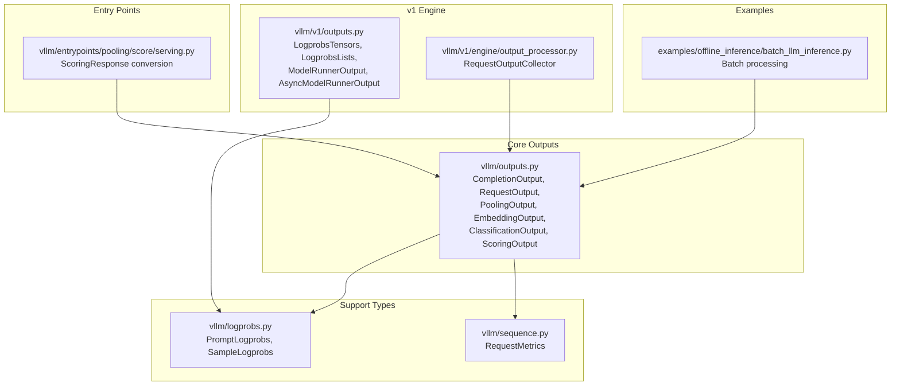
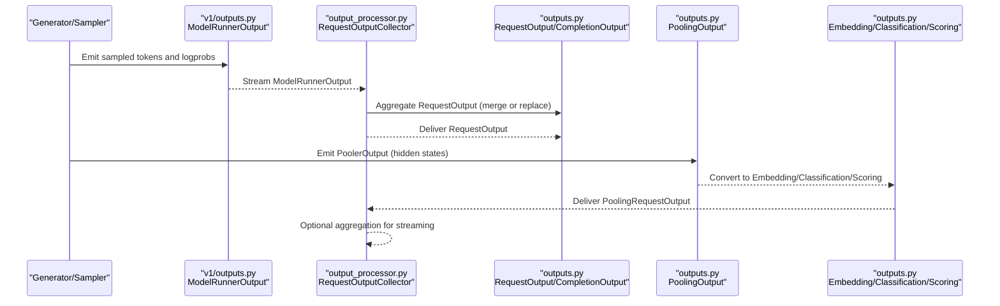
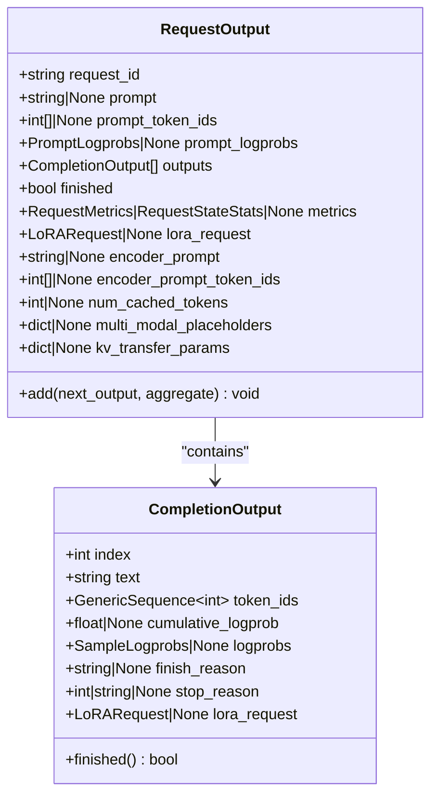
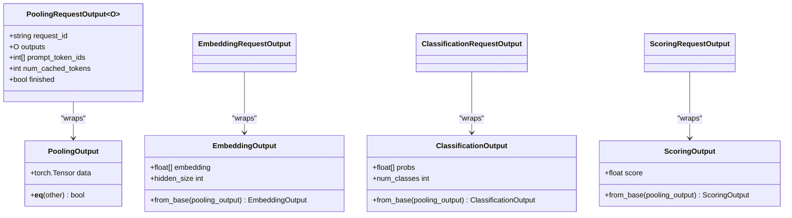
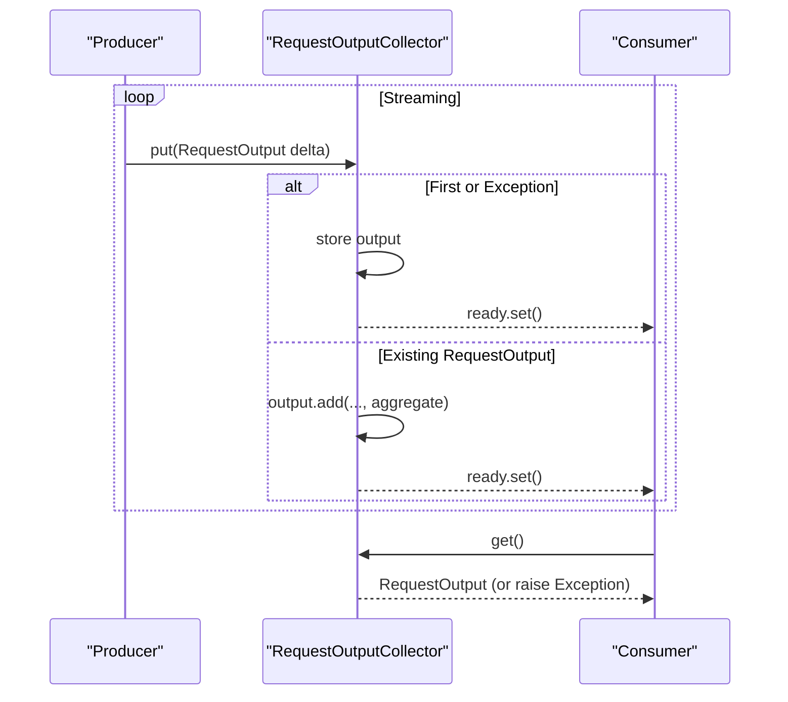
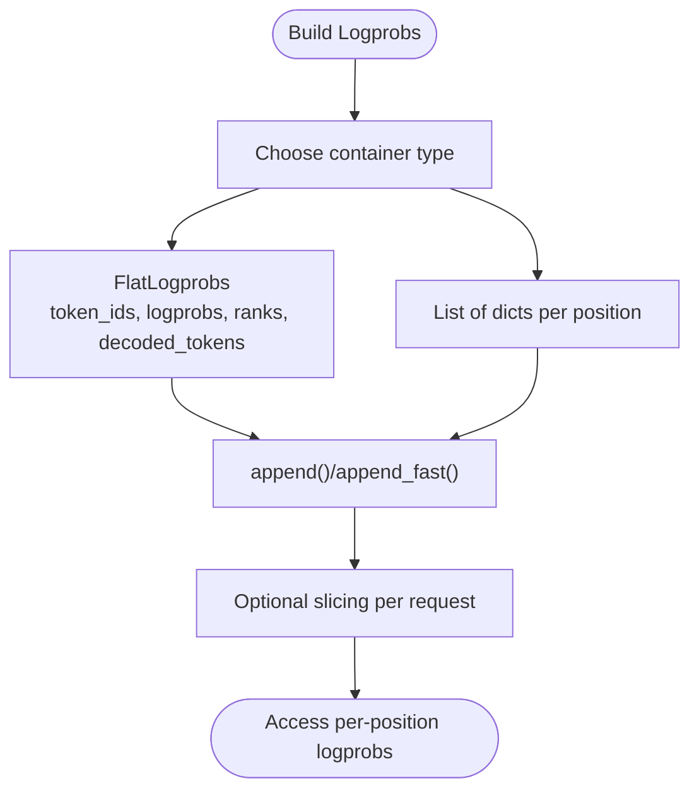
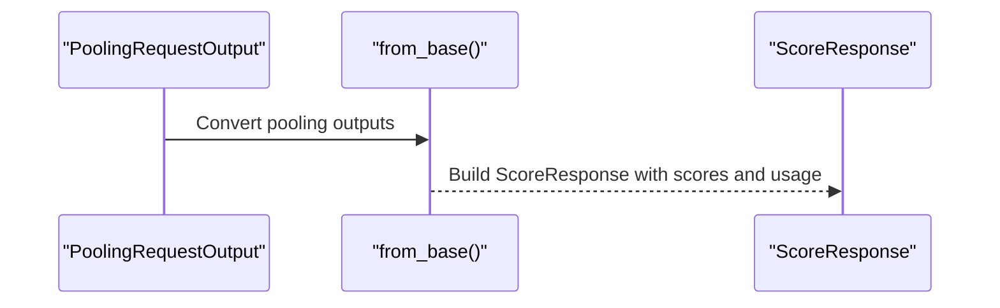
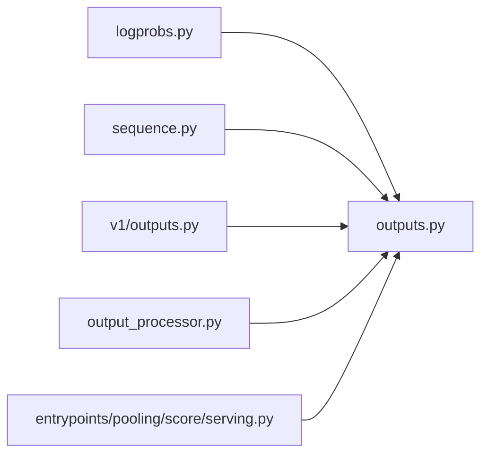

# Output Classes and Results

<cite>
**Referenced Files in This Document**
- [outputs.py](file://vllm/outputs.py)
- [v1/outputs.py](file://vllm/v1/outputs.py)
- [logprobs.py](file://vllm/logprobs.py)
- [sequence.py](file://vllm/sequence.py)
- [output_processor.py](file://vllm/v1/engine/output_processor.py)
- [serving.py](file://vllm/entrypoints/pooling/score/serving.py)
- [mem_utils.py](file://vllm/utils/mem_utils.py)
- [batch_llm_inference.py](file://examples/offline_inference/batch_llm_inference.py)
</cite>

## Table of Contents
1. [Introduction](#introduction)
2. [Project Structure](#project-structure)
3. [Core Components](#core-components)
4. [Architecture Overview](#architecture-overview)
5. [Detailed Component Analysis](#detailed-component-analysis)
6. [Dependency Analysis](#dependency-analysis)
7. [Performance Considerations](#performance-considerations)
8. [Troubleshooting Guide](#troubleshooting-guide)
9. [Conclusion](#conclusion)
10. [Appendices](#appendices)

## Introduction
This document explains vLLM’s output classes and result structures used across generation, pooling, and structured output tasks. It covers:
- Output data models: RequestOutput, CompletionOutput, PoolingOutput, EmbeddingOutput, ClassificationOutput, ScoringOutput
- Properties such as generated text, token IDs, log probabilities, finish reasons, usage statistics, and metadata
- Synchronous vs asynchronous handling, streaming vs non-streaming responses, and batch processing
- Serialization and conversion helpers for downstream integration
- Practical guidance for accessing outputs, handling different output types, and building custom processors
- Performance and memory management strategies for large result sets

## Project Structure
The output-related models live primarily in the core outputs module, with specialized v1 streaming and aggregation structures, log probability containers, and metrics/metadata types. Downstream entrypoints convert pooling outputs into structured responses.

**Diagram sources**
- [outputs.py](file://vllm/outputs.py#L22-L346)
- [v1/outputs.py](file://vllm/v1/outputs.py#L1-L246)
- [logprobs.py](file://vllm/logprobs.py#L1-L200)
- [sequence.py](file://vllm/sequence.py#L1-L99)
- [output_processor.py](file://vllm/v1/engine/output_processor.py#L39-L88)
- [serving.py](file://vllm/entrypoints/pooling/score/serving.py#L434-L467)
- [batch_llm_inference.py](file://examples/offline_inference/batch_llm_inference.py#L1-L94)

**Section sources**
- [outputs.py](file://vllm/outputs.py#L22-L346)
- [v1/outputs.py](file://vllm/v1/outputs.py#L1-L246)
- [logprobs.py](file://vllm/logprobs.py#L1-L200)
- [sequence.py](file://vllm/sequence.py#L1-L99)
- [output_processor.py](file://vllm/v1/engine/output_processor.py#L39-L88)
- [serving.py](file://vllm/entrypoints/pooling/score/serving.py#L434-L467)
- [batch_llm_inference.py](file://examples/offline_inference/batch_llm_inference.py#L1-L94)

## Core Components
- CompletionOutput: per-completion segment for generation requests, including index, text, token IDs, cumulative log probability, optional per-position log probabilities, finish reason, stop reason, and optional LoRA context.
- RequestOutput: top-level container for a single request’s completions, including prompt, prompt token IDs, prompt log probabilities, a list of CompletionOutput entries, finished flag, metrics, optional encoder prompt for encoder-decoder models, cached token counts, and optional multi-modal placeholders and KV transfer parameters.
- PoolingOutput: raw tensor output from pooling heads used by embedding/classification/scoring tasks.
- EmbeddingOutput: normalized embedding vector derived from PoolingOutput.
- ClassificationOutput: probability vector derived from PoolingOutput.
- ScoringOutput: scalar score derived from PoolingOutput.
- PoolingRequestOutput: generic pooling container with request_id, prompt_token_ids, finished flag, num_cached_tokens, and typed outputs (EmbeddingOutput, ClassificationOutput, ScoringOutput).

Key relationships:
- EmbeddingRequestOutput, ClassificationRequestOutput, ScoringRequestOutput are thin wrappers around PoolingRequestOutput that convert PoolingOutput into the respective typed outputs.
- RequestOutput.add merges or aggregates multiple RequestOutput instances during streaming, depending on the output kind.

**Section sources**
- [outputs.py](file://vllm/outputs.py#L22-L346)

## Architecture Overview
The output pipeline integrates generation sampling, log probability computation, pooling, and structured response conversion.

**Diagram sources**
- [v1/outputs.py](file://vllm/v1/outputs.py#L141-L246)
- [output_processor.py](file://vllm/v1/engine/output_processor.py#L39-L88)
- [outputs.py](file://vllm/outputs.py#L84-L346)

## Detailed Component Analysis

### CompletionOutput
- Purpose: Represents a single generated output segment within a request.
- Fields:
  - index: output index within the request
  - text: generated text
  - token_ids: sequence of token IDs
  - cumulative_logprob: cumulative log probability of the output
  - logprobs: optional per-position log probabilities (SampleLogprobs)
  - finish_reason: reason for finishing (e.g., stop token, length)
  - stop_reason: stop string or token ID that caused stopping
  - lora_request: optional LoRA context used
- Methods:
  - finished(): convenience to check if finished
- Notes:
  - logprobs can be represented as a flat structure or a list of dictionaries depending on configuration.

**Section sources**
- [outputs.py](file://vllm/outputs.py#L22-L63)
- [logprobs.py](file://vllm/logprobs.py#L1-L200)

### RequestOutput
- Purpose: Top-level container for a single request’s completions.
- Fields:
  - request_id, prompt, prompt_token_ids, prompt_logprobs
  - outputs: list of CompletionOutput
  - finished: overall completion status
  - metrics: RequestMetrics or stats
  - lora_request, encoder_prompt, encoder_prompt_token_ids
  - num_cached_tokens, multi_modal_placeholders, kv_transfer_params
- Behavior:
  - add(next_output, aggregate): merges subsequent RequestOutput into this one; either concatenates text/token_ids/logprobs and updates cumulative stats (aggregate) or replaces outputs (replace mode)
- Notes:
  - Supports encoder/decoder prompts for encoder-decoder models.
  - Extra kwargs are warned and ignored for forward compatibility.

**Diagram sources**
- [outputs.py](file://vllm/outputs.py#L84-L191)

**Section sources**
- [outputs.py](file://vllm/outputs.py#L84-L191)

### PoolingOutput and Structured Outputs
- PoolingOutput: raw tensor data from pooling heads.
- EmbeddingOutput: derived from PoolingOutput; validates 1-D shape and exposes hidden_size.
- ClassificationOutput: derived from PoolingOutput; validates 1-D shape and exposes num_classes.
- ScoringOutput: derived from PoolingOutput; validates scalar squeeze and exposes score.
- PoolingRequestOutput: generic pooling container with typed outputs.

**Diagram sources**
- [outputs.py](file://vllm/outputs.py#L65-L346)

**Section sources**
- [outputs.py](file://vllm/outputs.py#L65-L346)

### v1 Streaming and Aggregation
- LogprobsTensors and LogprobsLists: efficient containers for storing per-token log probabilities and ranks, with CPU conversion and slicing helpers.
- ModelRunnerOutput: serialized container for per-request token ids, prompt logprobs, pooler outputs, and connector outputs.
- RequestOutputCollector: async collector that merges RequestOutput deltas when producers get ahead of consumers, controlled by output kind.

**Diagram sources**
- [v1/outputs.py](file://vllm/v1/outputs.py#L141-L246)
- [output_processor.py](file://vllm/v1/engine/output_processor.py#L39-L88)

**Section sources**
- [v1/outputs.py](file://vllm/v1/outputs.py#L1-L246)
- [output_processor.py](file://vllm/v1/engine/output_processor.py#L39-L88)

### Log Probability Containers
- PromptLogprobs and SampleLogprobs: flexible containers for prompt and sample log probabilities, supporting both flat arrays and list-of-dictionaries forms.
- FlatLogprobs: optimized structure reducing GC overhead by flattening token_ids, logprobs, ranks, and decoded tokens with index slices.

**Diagram sources**
- [logprobs.py](file://vllm/logprobs.py#L1-L200)

**Section sources**
- [logprobs.py](file://vllm/logprobs.py#L1-L200)

### Metrics and Metadata
- RequestMetrics: timing and execution metrics for a request.
- num_cached_tokens: indicates prefix cache hits.
- multi_modal_placeholders: placeholder metadata for multi-modal inputs.
- kv_transfer_params: parameters for remote KV transfer in distributed scenarios.

**Section sources**
- [sequence.py](file://vllm/sequence.py#L20-L48)
- [outputs.py](file://vllm/outputs.py#L108-L145)

### Conversion to Downstream Responses
- ScoringRequestOutput.from_base converts PoolingRequestOutput into a scoring response-compatible structure.
- Entry point serving converts final results into structured responses (e.g., scoring) with usage accounting.

**Diagram sources**
- [outputs.py](file://vllm/outputs.py#L336-L346)
- [serving.py](file://vllm/entrypoints/pooling/score/serving.py#L434-L467)

**Section sources**
- [outputs.py](file://vllm/outputs.py#L336-L346)
- [serving.py](file://vllm/entrypoints/pooling/score/serving.py#L434-L467)

## Dependency Analysis
- Core outputs depend on logprobs containers and metrics types.
- v1 streaming depends on ModelRunnerOutput and RequestOutputCollector for async aggregation.
- Entry points depend on pooling output converters to produce structured responses.

**Diagram sources**
- [outputs.py](file://vllm/outputs.py#L22-L346)
- [v1/outputs.py](file://vllm/v1/outputs.py#L141-L246)
- [logprobs.py](file://vllm/logprobs.py#L1-L200)
- [sequence.py](file://vllm/sequence.py#L1-L99)
- [output_processor.py](file://vllm/v1/engine/output_processor.py#L39-L88)
- [serving.py](file://vllm/entrypoints/pooling/score/serving.py#L434-L467)

**Section sources**
- [outputs.py](file://vllm/outputs.py#L22-L346)
- [v1/outputs.py](file://vllm/v1/outputs.py#L141-L246)
- [logprobs.py](file://vllm/logprobs.py#L1-L200)
- [sequence.py](file://vllm/sequence.py#L1-L99)
- [output_processor.py](file://vllm/v1/engine/output_processor.py#L39-L88)
- [serving.py](file://vllm/entrypoints/pooling/score/serving.py#L434-L467)

## Performance Considerations
- Streaming aggregation:
  - RequestOutputCollector merges deltas to avoid overwhelming consumers; choose aggregation vs replacement based on output kind.
  - ModelRunnerOutput uses lists for tensors to reduce serialization overhead for torch.Tensor.
- Log probability storage:
  - FlatLogprobs minimizes GC pressure by flattening per-position logprobs into primitive arrays.
  - LogprobsTensors supports non-blocking CPU transfers and empty CPU allocations for efficient reuse.
- Memory profiling:
  - DeviceMemoryProfiler and MemorySnapshot help track CUDA and non-CUDA memory usage and torch peak memory increases.
- Batch processing:
  - Examples demonstrate continuous batching and chunked prefill to maximize GPU utilization and manage memory footprint.

Practical tips:
- Prefer flat logprobs when requesting many top-k logprobs to reduce memory churn.
- Use aggregation mode for streaming deltas to coalesce partial outputs.
- Monitor memory with memory profiling utilities and adjust batch sizes accordingly.

**Section sources**
- [output_processor.py](file://vllm/v1/engine/output_processor.py#L39-L88)
- [v1/outputs.py](file://vllm/v1/outputs.py#L141-L246)
- [logprobs.py](file://vllm/logprobs.py#L1-L200)
- [mem_utils.py](file://vllm/utils/mem_utils.py#L1-L200)
- [batch_llm_inference.py](file://examples/offline_inference/batch_llm_inference.py#L1-L94)

## Troubleshooting Guide
Common issues and remedies:
- Unexpected finish or stop reasons:
  - Inspect CompletionOutput.finish_reason and stop_reason to diagnose early termination or EOS encounters.
- Mismatched shapes in pooling conversions:
  - EmbeddingOutput, ClassificationOutput, and ScoringOutput enforce dimensional checks; ensure pooler outputs match expected shapes.
- Streaming gaps or late deltas:
  - Verify RequestOutputCollector is configured with the correct output kind; aggregation merges deltas while replacement discards prior segments.
- Excessive memory usage:
  - Switch to flat logprobs, reduce top-logprobs count, or enable memory profiling to identify hotspots.

**Section sources**
- [outputs.py](file://vllm/outputs.py#L22-L346)
- [output_processor.py](file://vllm/v1/engine/output_processor.py#L39-L88)
- [logprobs.py](file://vllm/logprobs.py#L1-L200)
- [mem_utils.py](file://vllm/utils/mem_utils.py#L1-L200)

## Conclusion
vLLM’s output classes provide a cohesive, extensible foundation for generation and structured pooling tasks. Core models encapsulate essential data and metadata, while v1 streaming and aggregation structures enable efficient asynchronous processing. Log probability containers and memory profiling utilities support performance-sensitive deployments. Downstream entry points convert pooling outputs into structured responses, enabling seamless integration with clients and pipelines.

## Appendices

### Accessing Output Data
- Generated text and tokens:
  - Iterate RequestOutput.outputs and read CompletionOutput.text and token_ids.
- Log probabilities:
  - Access CompletionOutput.logprobs or prompt_logprobs via the appropriate container type.
- Finish conditions:
  - Use CompletionOutput.finished() or inspect finish_reason.
- Metrics:
  - Read RequestOutput.metrics for timing and execution statistics.

**Section sources**
- [outputs.py](file://vllm/outputs.py#L22-L191)
- [logprobs.py](file://vllm/logprobs.py#L1-L200)
- [sequence.py](file://vllm/sequence.py#L20-L48)

### Handling Different Output Types
- Embedding:
  - Convert PoolingOutput to EmbeddingOutput using EmbeddingOutput.from_base; access embedding and hidden_size.
- Classification:
  - Convert PoolingOutput to ClassificationOutput using ClassificationOutput.from_base; access probs and num_classes.
- Scoring:
  - Convert PoolingOutput to ScoringOutput using ScoringOutput.from_base; access score.

**Section sources**
- [outputs.py](file://vllm/outputs.py#L232-L346)

### Implementing Custom Result Processing
- For streaming:
  - Use RequestOutputCollector to merge deltas; decide between aggregation and replacement modes.
- For pooling:
  - Wrap PoolingOutput in EmbeddingRequestOutput, ClassificationRequestOutput, or ScoringRequestOutput as needed.
- For structured responses:
  - Follow the pattern in entry point serving to construct response objects with usage accounting.

**Section sources**
- [output_processor.py](file://vllm/v1/engine/output_processor.py#L39-L88)
- [outputs.py](file://vllm/outputs.py#L232-L346)
- [serving.py](file://vllm/entrypoints/pooling/score/serving.py#L434-L467)