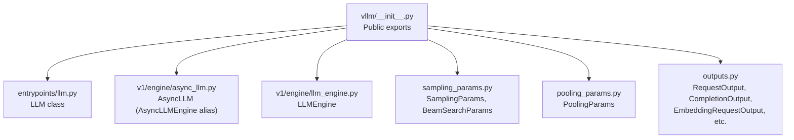
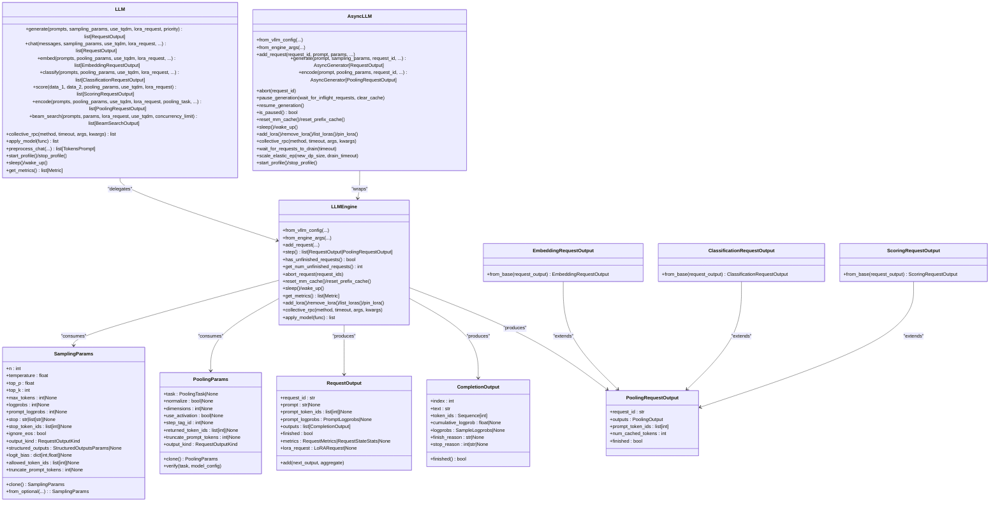
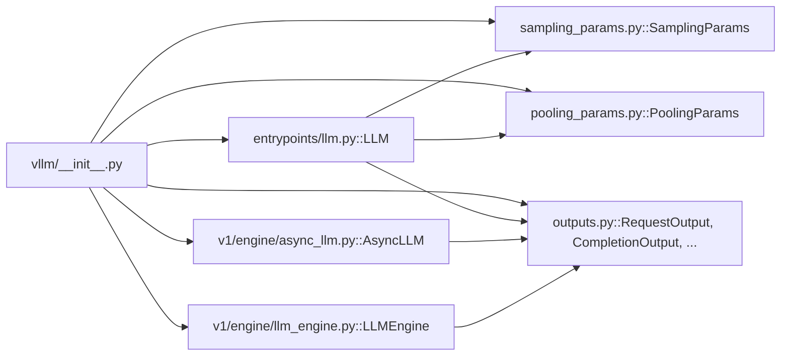

# Python API Reference

<cite>
**Referenced Files in This Document**
- [__init__.py](file://vllm/__init__.py)
- [llm.py](file://vllm/entrypoints/llm.py)
- [async_llm.py](file://vllm/v1/engine/async_llm.py)
- [llm_engine.py](file://vllm/v1/engine/llm_engine.py)
- [sampling_params.py](file://vllm/sampling_params.py)
- [pooling_params.py](file://vllm/pooling_params.py)
- [outputs.py](file://vllm/outputs.py)
</cite>

## Table of Contents
1. [Introduction](#introduction)
2. [Project Structure](#project-structure)
3. [Core Components](#core-components)
4. [Architecture Overview](#architecture-overview)
5. [Detailed Component Analysis](#detailed-component-analysis)
6. [Dependency Analysis](#dependency-analysis)
7. [Performance Considerations](#performance-considerations)
8. [Troubleshooting Guide](#troubleshooting-guide)
9. [Conclusion](#conclusion)

## Introduction
This document provides comprehensive Python API documentation for vLLM’s core inference classes and functions. It focuses on:
- LLM: a high-level class for simple offline inference and batch operations
- AsyncLLMEngine (alias AsyncLLM): asynchronous engine for streaming and advanced usage
- LLMEngine: synchronous engine for batch-style control loops
- SamplingParams and PoolingParams: configuration containers for generation and pooling
- Output classes: RequestOutput, CompletionOutput, EmbeddingRequestOutput, ClassificationRequestOutput, ScoringRequestOutput, and related pooling outputs

It covers initialization parameters, method signatures, threading considerations, performance characteristics, memory management, and practical usage patterns.

## Project Structure
The vLLM package exposes a concise public API surface via the top-level module, which re-exports key classes and types. The core runtime engines live under v1, while the high-level LLM convenience class lives under entrypoints.

**Diagram sources**
- [__init__.py](file://vllm/__init__.py#L16-L108)
- [llm.py](file://vllm/entrypoints/llm.py#L93-L1775)
- [async_llm.py](file://vllm/v1/engine/async_llm.py#L1-L867)
- [llm_engine.py](file://vllm/v1/engine/llm_engine.py#L1-L415)
- [sampling_params.py](file://vllm/sampling_params.py#L1-L598)
- [pooling_params.py](file://vllm/pooling_params.py#L1-L231)
- [outputs.py](file://vllm/outputs.py#L1-L346)

**Section sources**
- [__init__.py](file://vllm/__init__.py#L16-L108)

## Core Components
- LLM: High-level interface for offline inference, supporting generate(), chat(), embed(), classify(), score(), and encode(). Handles batching, tokenization, LoRA integration, and progress reporting.
- AsyncLLM (AsyncLLMEngine): Asynchronous engine optimized for streaming and server-side usage. Provides async generate() and encode() returning async generators, plus pause/resume and scaling controls.
- LLMEngine: Synchronous engine for building custom control loops. Exposes add_request(), step(), and lifecycle controls.
- SamplingParams: Configuration for text generation (sampling, stopping, logprobs, structured outputs).
- PoolingParams: Configuration for pooling tasks (embeddings, classification, scoring).
- Output classes: Typed request outputs for generation and pooling tasks.

**Section sources**
- [llm.py](file://vllm/entrypoints/llm.py#L93-L1775)
- [async_llm.py](file://vllm/v1/engine/async_llm.py#L54-L867)
- [llm_engine.py](file://vllm/v1/engine/llm_engine.py#L46-L415)
- [sampling_params.py](file://vllm/sampling_params.py#L111-L598)
- [pooling_params.py](file://vllm/pooling_params.py#L15-L231)
- [outputs.py](file://vllm/outputs.py#L22-L346)

## Architecture Overview
The high-level LLM orchestrates tokenization, request batching, and delegates to the underlying engine. AsyncLLM and LLMEngine encapsulate the core execution loop, input/output processing, and metrics/logging.

**Diagram sources**
- [llm.py](file://vllm/entrypoints/llm.py#L93-L1775)
- [async_llm.py](file://vllm/v1/engine/async_llm.py#L54-L867)
- [llm_engine.py](file://vllm/v1/engine/llm_engine.py#L46-L415)
- [sampling_params.py](file://vllm/sampling_params.py#L111-L598)
- [pooling_params.py](file://vllm/pooling_params.py#L15-L231)
- [outputs.py](file://vllm/outputs.py#L22-L346)

## Detailed Component Analysis

### LLM (High-level Offline Inference)
- Purpose: Simplifies common inference tasks with automatic batching, tokenization, and progress reporting.
- Key methods:
  - generate(): Text generation for prompts; supports LoRA and priority.
  - chat(): Converts chat messages to prompts and generates responses.
  - embed()/classify()/score(): Pooling-based APIs for embeddings, classification logits, and similarity scoring.
  - encode(): General pooling entrypoint with task-specific verification.
  - beam_search(): Implements beam search using multiple generate() steps.
  - preprocess_chat(): Pre-tokenizes chat prompts for downstream use.
  - collective_rpc()/apply_model(): Control-plane helpers for worker coordination.
  - start_profile()/stop_profile(): Profiling toggles.
  - sleep()/wake_up(): Memory-conserving sleep modes.
  - get_metrics(): Aggregated metrics snapshot.
- Threading and concurrency:
  - Uses a background loop to step the engine and collect outputs.
  - Progress bars are optional and can be disabled or customized.
- Error handling:
  - Validates prompt and parameter lengths.
  - Aborts partially added requests on failures.
  - Raises explicit errors for unsupported tasks or invalid configurations.

Usage examples (paths only):
- Basic generation: [llm.py](file://vllm/entrypoints/llm.py#L365-L435)
- Chat generation: [llm.py](file://vllm/entrypoints/llm.py#L865-L948)
- Embedding: [llm.py](file://vllm/entrypoints/llm.py#L1100-L1150)
- Classification: [llm.py](file://vllm/entrypoints/llm.py#L1151-L1198)
- Scoring: [llm.py](file://vllm/entrypoints/llm.py#L1340-L1489)
- Pooling encode: [llm.py](file://vllm/entrypoints/llm.py#L949-L1099)
- Beam search: [llm.py](file://vllm/entrypoints/llm.py#L586-L768)

Initialization parameters (selected highlights):
- model, tokenizer, tokenizer_mode, skip_tokenizer_init, trust_remote_code
- tensor_parallel_size, dtype, quantization, revision, tokenizer_revision
- seed, gpu_memory_utilization, swap_space, cpu_offload_gb, enforce_eager
- disable_custom_all_reduce, hf_token, hf_overrides, mm_processor_kwargs
- pooler_config, structured_outputs_config, profiler_config, attention_config
- kv_cache_memory_bytes, compilation_config, logits_processors
- Data parallel restriction and warnings for single-process usage.

**Section sources**
- [llm.py](file://vllm/entrypoints/llm.py#L93-L1775)

### AsyncLLM (AsyncLLMEngine)
- Purpose: Asynchronous engine optimized for streaming and server-side scenarios.
- Key methods:
  - from_vllm_config()/from_engine_args(): Construct from configuration or EngineArgs.
  - add_request(): Adds a request with optional LoRA and priority.
  - generate(): Async generator yielding RequestOutput as tokens are produced.
  - encode(): Async generator for pooling tasks.
  - abort(): Cancels one or more requests.
  - pause_generation()/resume_generation(): Pause/resume with optional cache clearing.
  - reset_mm_cache()/reset_prefix_cache(): Cache management.
  - sleep()/wake_up(): Sleep modes for memory savings.
  - add_lora()/remove_lora()/list_loras()/pin_lora(): LoRA adapter management.
  - collective_rpc(): Distributed RPC across workers.
  - wait_for_requests_to_drain(): Graceful shutdown helper.
  - scale_elastic_ep(): Dynamic scaling of data-parallel workers.
  - start_profile()/stop_profile(): Profiling toggles.
- Threading and concurrency:
  - Single-threaded event loop with background output handler.
  - Non-blocking queue consumption with chunked processing to avoid event loop stalls.
  - Pausing uses condition variables to block new requests until resumed.
- Error handling:
  - Propagates engine-dead and generation errors.
  - Cancels in-flight requests on generator exit or cancellation.

Usage examples (paths only):
- Async generation: [async_llm.py](file://vllm/v1/engine/async_llm.py#L360-L472)
- Async encoding: [async_llm.py](file://vllm/v1/engine/async_llm.py#L607-L699)
- Pause/resume: [async_llm.py](file://vllm/v1/engine/async_llm.py#L555-L606)
- Scaling: [async_llm.py](file://vllm/v1/engine/async_llm.py#L809-L867)

**Section sources**
- [async_llm.py](file://vllm/v1/engine/async_llm.py#L54-L867)

### LLMEngine (Synchronous Engine)
- Purpose: Low-level synchronous engine for custom control loops and deterministic stepping.
- Key methods:
  - from_vllm_config()/from_engine_args(): Construct from configuration.
  - add_request(): Adds a request with optional LoRA and priority.
  - step(): Processes one iteration, returns RequestOutput or PoolingRequestOutput.
  - has_unfinished_requests()/get_num_unfinished_requests(): Loop control helpers.
  - abort_request(): Cancels requests.
  - reset_mm_cache()/reset_prefix_cache(): Cache management.
  - sleep()/wake_up(): Sleep modes.
  - get_metrics(): Snapshot of aggregated metrics.
  - add_lora()/remove_lora()/list_loras()/pin_lora(): LoRA management.
  - collective_rpc()/apply_model(): Control-plane helpers.
- Threading and concurrency:
  - Single-threaded execution model.
  - Dummy batch handling for distributed parity.
- Error handling:
  - Validates request IDs and aborts on errors.

Usage examples (paths only):
- Synchronous loop: [llm_engine.py](file://vllm/v1/engine/llm_engine.py#L285-L320)
- Request addition and fan-out: [llm_engine.py](file://vllm/v1/engine/llm_engine.py#L222-L284)

**Section sources**
- [llm_engine.py](file://vllm/v1/engine/llm_engine.py#L46-L415)

### SamplingParams
- Purpose: Encapsulates generation configuration.
- Key fields:
  - n, presence_penalty, frequency_penalty, repetition_penalty
  - temperature, top_p, top_k, min_p
  - seed, stop, stop_token_ids, ignore_eos
  - max_tokens, min_tokens, logprobs, prompt_logprobs, flat_logprobs
  - detokenize, skip_special_tokens, spaces_between_special_tokens
  - logits_processors, include_stop_str_in_output, truncate_prompt_tokens
  - output_kind (CUMULATIVE, DELTA, FINAL_ONLY)
  - structured_outputs, logit_bias, allowed_token_ids, extra_args
  - bad_words, allowed_token_ids, skip_reading_prefix_cache
- Validation:
  - Enforces ranges and mutual exclusivity (e.g., greedy disables top-p/top-k).
  - Normalizes stop strings and EOS handling.
  - Converts tokenization artifacts (bad words) to token IDs.
- Methods:
  - clone(): Safe deep copy with optional processor cloning.
  - from_optional(): Convenience builder with defaults.

Usage examples (paths only):
- Defaults and normalization: [sampling_params.py](file://vllm/sampling_params.py#L315-L368)
- Validation: [sampling_params.py](file://vllm/sampling_params.py#L369-L448)
- Greedy constraints: [sampling_params.py](file://vllm/sampling_params.py#L449-L453)
- Bad words to token IDs: [sampling_params.py](file://vllm/sampling_params.py#L480-L518)
- Clone and repr: [sampling_params.py](file://vllm/sampling_params.py#L536-L582)

**Section sources**
- [sampling_params.py](file://vllm/sampling_params.py#L111-L598)

### PoolingParams
- Purpose: Encapsulates pooling configuration for embeddings, classification, scoring, and token-level pooling.
- Key fields:
  - truncate_prompt_tokens, dimensions, normalize
  - use_activation (and deprecated softmax/activation)
  - step_tag_id, returned_token_ids
  - task, requires_token_ids, skip_reading_prefix_cache, extra_kwargs
  - output_kind (FINAL_ONLY)
- Validation:
  - verify(task, model_config): Enforces task-specific parameters and merges defaults from model config.
  - Step pooling validation and default merging.
  - Matryoshka dimension checks for embeddings.
- Methods:
  - clone(): Deep copy.
  - verify(): Runtime validation and defaults.

Usage examples (paths only):
- Parameter verification and defaults: [pooling_params.py](file://vllm/pooling_params.py#L82-L176)
- Step pooling enforcement: [pooling_params.py](file://vllm/pooling_params.py#L139-L162)
- Matryoshka and activation defaults: [pooling_params.py](file://vllm/pooling_params.py#L163-L193)
- Final-only output_kind: [pooling_params.py](file://vllm/pooling_params.py#L227-L231)

**Section sources**
- [pooling_params.py](file://vllm/pooling_params.py#L15-L231)

### Output Classes
- RequestOutput: Container for generation outputs; supports aggregation across steps.
- CompletionOutput: Per-output generation data (text, tokens, logprobs, finish reasons).
- PoolingRequestOutput: Container for pooling outputs; generic over PoolingOutput.
- EmbeddingRequestOutput: Embedding vector extraction from pooling outputs.
- ClassificationRequestOutput: Probability vector extraction from pooling outputs.
- ScoringRequestOutput: Scalar score extraction from pooling outputs.

Usage examples (paths only):
- RequestOutput construction and aggregation: [outputs.py](file://vllm/outputs.py#L84-L191)
- Embedding conversion: [outputs.py](file://vllm/outputs.py#L232-L257)
- Classification conversion: [outputs.py](file://vllm/outputs.py#L271-L297)
- Scoring conversion: [outputs.py](file://vllm/outputs.py#L311-L346)

**Section sources**
- [outputs.py](file://vllm/outputs.py#L22-L346)

## Dependency Analysis
- Public exports: The top-level module re-exports LLM, AsyncLLMEngine, LLMEngine, SamplingParams, PoolingParams, and output types.
- LLM depends on:
  - EngineArgs and Engine creation
  - Input processors and tokenizers
  - SamplingParams and PoolingParams
  - Output types for return values
- AsyncLLM and LLMEngine share the same underlying engine core and processors, differing in threading model and API shape.
- Outputs are typed and derived from pooling outputs for specialized tasks.

**Diagram sources**
- [__init__.py](file://vllm/__init__.py#L16-L108)
- [llm.py](file://vllm/entrypoints/llm.py#L93-L1775)
- [async_llm.py](file://vllm/v1/engine/async_llm.py#L54-L867)
- [llm_engine.py](file://vllm/v1/engine/llm_engine.py#L46-L415)
- [sampling_params.py](file://vllm/sampling_params.py#L111-L598)
- [pooling_params.py](file://vllm/pooling_params.py#L15-L231)
- [outputs.py](file://vllm/outputs.py#L22-L346)

**Section sources**
- [__init__.py](file://vllm/__init__.py#L16-L108)

## Performance Considerations
- Batch sizing: Prefer larger batches to amortize overhead; LLM batches automatically but grouping related prompts improves throughput.
- KV cache and prefix caching: Configure gpu_memory_utilization or kv_cache_memory_bytes; prefix caching reduces recomputation.
- CUDA graphs and eager execution: enforce_eager disables CUDA graphs; hybrid mode often optimal.
- Streaming vs. final-only: For AsyncLLM, choose RequestOutputKind to balance latency and memory.
- LoRA and adapters: Loading/unloading adapters introduces overhead; pin adapters when frequently reused.
- Profiling: Use start_profile()/stop_profile() to capture CPU/GPU traces.
- Data parallel scaling: Use scale_elastic_ep() for dynamic scaling; drain requests before scaling.

[No sources needed since this section provides general guidance]

## Troubleshooting Guide
Common issues and remedies:
- Unsupported task errors:
  - LLM.generate() requires generative runner; LLM.embed()/classify()/score() require pooling runner.
  - Use the appropriate runner or convert the model accordingly.
- Invalid parameter combinations:
  - SamplingParams enforces strict ranges and mutual exclusivity (e.g., greedy disables top-k/top-p).
  - PoolingParams validates task-specific parameters and raises on misuse.
- OOM and memory pressure:
  - Reduce batch size, lower max_tokens, adjust gpu_memory_utilization, enable CPU offload.
  - Use sleep()/wake_up() to free/reclaim memory.
- Stalled or hanging requests:
  - Use abort() for AsyncLLM or abort_request() for LLMEngine.
  - For AsyncLLM, wait_for_requests_to_drain() before shutdown or scaling.
- Prefix cache inconsistencies:
  - Reset prefix cache via reset_prefix_cache() when switching modes or models.

**Section sources**
- [llm.py](file://vllm/entrypoints/llm.py#L409-L435)
- [sampling_params.py](file://vllm/sampling_params.py#L369-L448)
- [pooling_params.py](file://vllm/pooling_params.py#L163-L193)
- [async_llm.py](file://vllm/v1/engine/async_llm.py#L543-L554)
- [llm_engine.py](file://vllm/v1/engine/llm_engine.py#L216-L221)

## Conclusion
vLLM provides a cohesive Python API spanning simple offline inference (LLM), asynchronous streaming (AsyncLLM), and synchronous control loops (LLMEngine). SamplingParams and PoolingParams offer robust configuration for generation and pooling tasks, while strongly-typed output classes simplify result handling. Proper configuration of memory, batching, and threading yields high throughput and low latency across diverse workloads.

[No sources needed since this section summarizes without analyzing specific files]