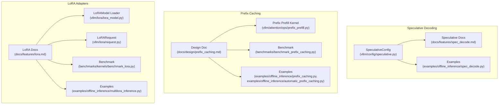
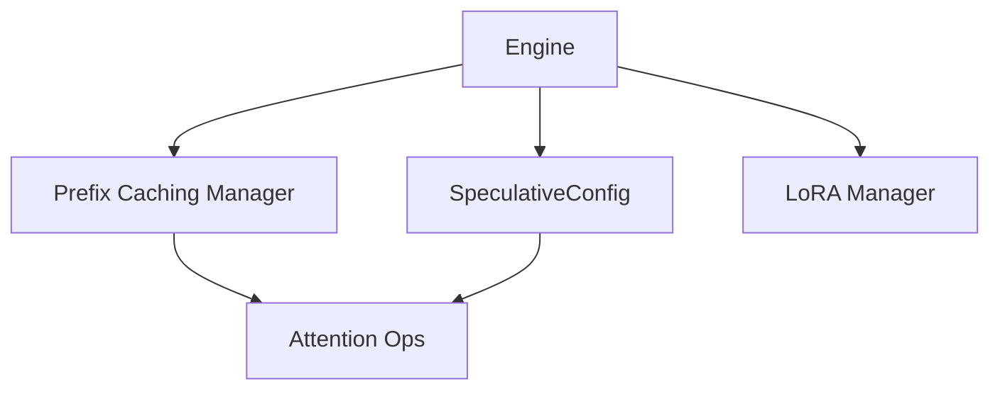
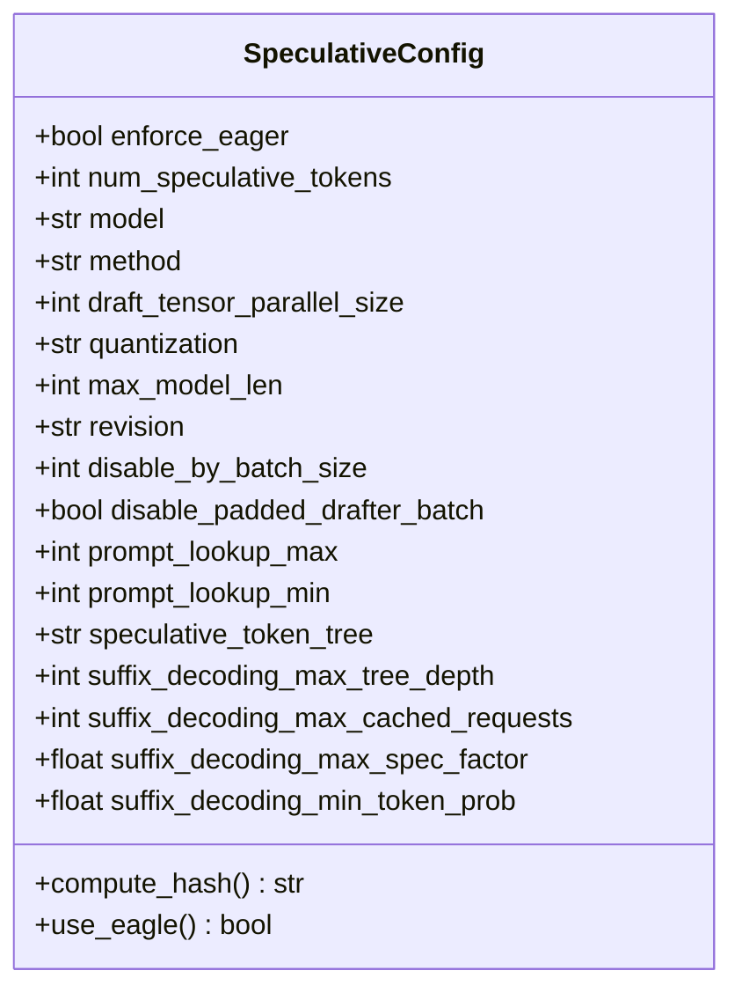
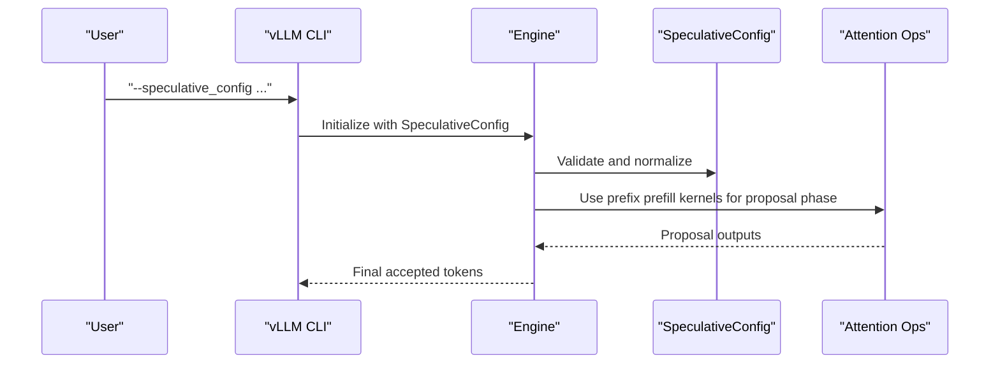
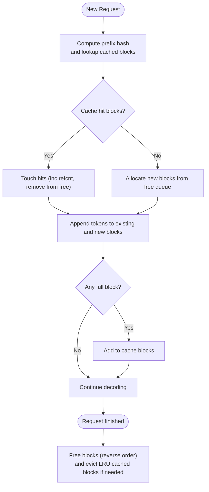
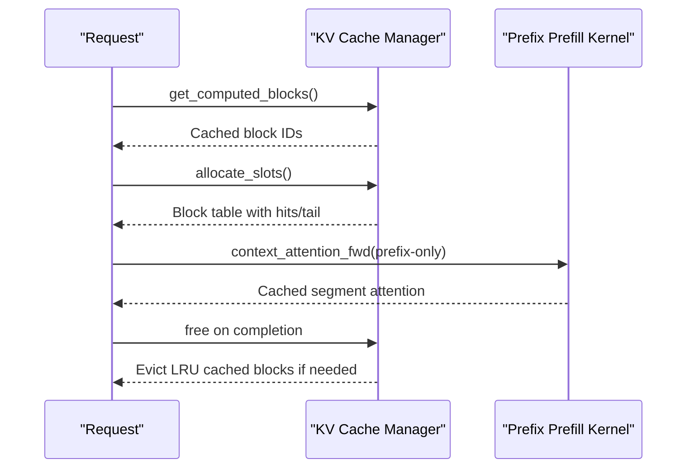
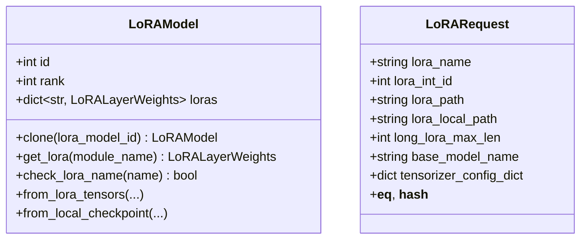
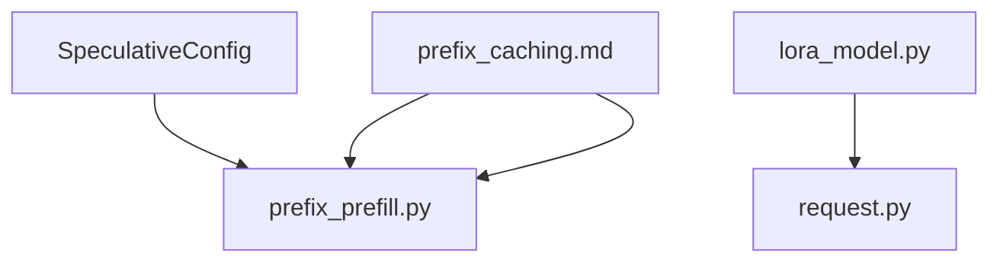

# Advanced Features

<cite>
**Referenced Files in This Document**
- [speculative.py](file://vllm/config/speculative.py)
- [spec_decode.md](file://docs/features/spec_decode.md)
- [prefix_caching.md](file://docs/design/prefix_caching.md)
- [prefix_prefill.py](file://vllm/attention/ops/prefix_prefill.py)
- [lora.md](file://docs/features/lora.md)
- [lora_model.py](file://vllm/lora/lora_model.py)
- [request.py](file://vllm/lora/request.py)
- [benchmark_prefix_caching.py](file://benchmarks/benchmark_prefix_caching.py)
- [benchmark_ngram_proposer.py](file://benchmarks/benchmark_ngram_proposer.py)
- [benchmark_lora.py](file://benchmarks/kernels/benchmark_lora.py)
- [multilora_inference.py](file://examples/offline_inference/multilora_inference.py)
- [prefix_caching.py](file://examples/offline_inference/prefix_caching.py)
- [automatic_prefix_caching.py](file://examples/offline_inference/automatic_prefix_caching.py)
- [spec_decode.py](file://examples/offline_inference/spec_decode.py)
</cite>

## Table of Contents
1. [Introduction](#introduction)
2. [Project Structure](#project-structure)
3. [Core Components](#core-components)
4. [Architecture Overview](#architecture-overview)
5. [Detailed Component Analysis](#detailed-component-analysis)
6. [Dependency Analysis](#dependency-analysis)
7. [Performance Considerations](#performance-considerations)
8. [Troubleshooting Guide](#troubleshooting-guide)
9. [Conclusion](#conclusion)
10. [Appendices](#appendices)

## Introduction
This document covers vLLM’s advanced features: speculative decoding, prefix caching, and LoRA adapters. It explains implementation details, configuration options, performance characteristics, memory optimization strategies, and practical integration patterns. It also highlights trade-offs, optimal use cases, and troubleshooting guidance grounded in the repository’s documentation and source files.

## Project Structure
The advanced features span configuration models, attention kernels, documentation, examples, and benchmarks:
- Speculative decoding: configuration model, CLI usage, and end-to-end examples
- Prefix caching: design documentation, attention kernels for prefix prefill, and examples
- LoRA adapters: feature docs, model loader, request model, and examples

**Diagram sources**
- [speculative.py](file://vllm/config/speculative.py#L1-L645)
- [spec_decode.md](file://docs/features/spec_decode.md#L1-L333)
- [prefix_caching.md](file://docs/design/prefix_caching.md#L1-L232)
- [prefix_prefill.py](file://vllm/attention/ops/prefix_prefill.py#L1-L815)
- [lora.md](file://docs/features/lora.md#L1-L370)
- [lora_model.py](file://vllm/lora/lora_model.py#L1-L247)
- [request.py](file://vllm/lora/request.py#L1-L96)

**Section sources**
- [speculative.py](file://vllm/config/speculative.py#L1-L645)
- [spec_decode.md](file://docs/features/spec_decode.md#L1-L333)
- [prefix_caching.md](file://docs/design/prefix_caching.md#L1-L232)
- [prefix_prefill.py](file://vllm/attention/ops/prefix_prefill.py#L1-L815)
- [lora.md](file://docs/features/lora.md#L1-L370)
- [lora_model.py](file://vllm/lora/lora_model.py#L1-L247)
- [request.py](file://vllm/lora/request.py#L1-L96)

## Core Components
- SpeculativeConfig: central configuration for speculative decoding, including method selection, draft model parameters, and advanced controls
- Prefix caching design: hashing scheme, block lifecycle, and cache isolation
- LoRA model loader and request model: adapter loading, validation, and runtime request representation

Key implementation anchors:
- SpeculativeConfig fields and validators define supported methods, draft model constraints, and runtime safeguards
- Prefix caching design documents hashing, eviction, and multi-modal handling
- LoRA loader validates modules and constructs adapter weights

**Section sources**
- [speculative.py](file://vllm/config/speculative.py#L52-L167)
- [speculative.py](file://vllm/config/speculative.py#L235-L462)
- [speculative.py](file://vllm/config/speculative.py#L464-L645)
- [prefix_caching.md](file://docs/design/prefix_caching.md#L1-L232)
- [lora_model.py](file://vllm/lora/lora_model.py#L66-L111)
- [lora_model.py](file://vllm/lora/lora_model.py#L112-L247)
- [request.py](file://vllm/lora/request.py#L9-L96)

## Architecture Overview
The advanced features integrate with the engine and attention subsystems:
- Speculative decoding: configuration drives draft model instantiation and method-specific logic; attention kernels adapt to prefix-only prefill
- Prefix caching: KV cache manager computes block hashes and manages allocation/eviction; attention kernels support efficient prefix prefill
- LoRA adapters: model loader parses and validates adapter tensors; request model carries adapter identity and path

**Diagram sources**
- [speculative.py](file://vllm/config/speculative.py#L52-L167)
- [prefix_caching.md](file://docs/design/prefix_caching.md#L97-L131)
- [prefix_prefill.py](file://vllm/attention/ops/prefix_prefill.py#L618-L815)
- [lora_model.py](file://vllm/lora/lora_model.py#L66-L111)

## Detailed Component Analysis

### Speculative Decoding
Speculative decoding accelerates memory-bound inference by generating candidate tokens ahead of acceptance. vLLM supports multiple proposal strategies and draft models.

Implementation highlights:
- Configuration model defines method selection, draft model parameters, and advanced toggles (e.g., disabling by batch size, padded drafter batching)
- Method detection supports n-gram, suffix decoding, Medusa, MLP speculator, EAGLE, and MTP variants
- Validation ensures compatibility with tensor parallel sizes and model types
- Suffix decoding requires an external dependency and exposes tunable parameters for tree depth, cache size, and token probability thresholds

Performance and trade-offs:
- Inter-token latency improvements depend on dataset and sampling parameters; ongoing optimization is noted in the documentation
- Pipeline parallelism is currently incompatible with speculative decoding
- Draft models often run without tensor parallelism to achieve speedups despite smaller size constraints

Practical configuration examples:
- Offline and online usage with various methods and draft models
- Suffix decoding with dynamic speculation and recommended defaults
- EAGLE-based speculators with method-specific constraints

**Diagram sources**
- [speculative.py](file://vllm/config/speculative.py#L52-L167)
- [speculative.py](file://vllm/config/speculative.py#L168-L234)
- [speculative.py](file://vllm/config/speculative.py#L235-L462)
- [speculative.py](file://vllm/config/speculative.py#L464-L645)

**Diagram sources**
- [spec_decode.md](file://docs/features/spec_decode.md#L1-L172)
- [prefix_prefill.py](file://vllm/attention/ops/prefix_prefill.py#L618-L815)
- [speculative.py](file://vllm/config/speculative.py#L235-L462)

Configuration and usage references:
- Offline and online examples for n-gram, suffix decoding, MLP speculators, and EAGLE
- Compatibility notes and limitations

**Section sources**
- [speculative.py](file://vllm/config/speculative.py#L52-L167)
- [speculative.py](file://vllm/config/speculative.py#L235-L462)
- [speculative.py](file://vllm/config/speculative.py#L464-L645)
- [spec_decode.md](file://docs/features/spec_decode.md#L1-L333)
- [spec_decode.py](file://examples/offline_inference/spec_decode.py#L1-L200)

### Prefix Caching
Prefix caching reduces redundant prompt computations by reusing KV-cache blocks across requests with shared prefixes. vLLM uses a hash-based scheme to uniquely identify blocks and supports multi-modal inputs and cache isolation.

Key mechanisms:
- Hash composition includes parent hash, block tokens, and extras (e.g., LoRA IDs, multi-modality hashes, cache salts)
- Block lifecycle: allocate, touch (when reused), append, cache when full, free, and LRU eviction
- Attention kernels support prefix-only prefill to accelerate cached segments

Memory optimization and throughput:
- Full blocks are cached; duplicates are resolved upon freeing
- LRU eviction prioritizes blocks least likely to be reused
- Multi-modal hashing ensures correctness across heterogeneous inputs

**Diagram sources**
- [prefix_caching.md](file://docs/design/prefix_caching.md#L132-L205)
- [prefix_caching.md](file://docs/design/prefix_caching.md#L206-L232)

**Diagram sources**
- [prefix_caching.md](file://docs/design/prefix_caching.md#L132-L205)
- [prefix_prefill.py](file://vllm/attention/ops/prefix_prefill.py#L618-L815)

Practical examples:
- Manual and automatic prefix caching usage
- Benchmark scripts for measuring caching effects

**Section sources**
- [prefix_caching.md](file://docs/design/prefix_caching.md#L1-L232)
- [prefix_prefill.py](file://vllm/attention/ops/prefix_prefill.py#L1-L815)
- [prefix_caching.py](file://examples/offline_inference/prefix_caching.py#L1-L200)
- [automatic_prefix_caching.py](file://examples/offline_inference/automatic_prefix_caching.py#L1-L200)
- [benchmark_prefix_caching.py](file://benchmarks/benchmark_prefix_caching.py#L1-L200)

### LoRA Adapters
LoRA enables parameter-efficient fine-tuning and dynamic adapter switching. vLLM supports single and multi-adapter serving, runtime loading/unloading, and multimodal default adapters.

Implementation:
- LoRAModel loads and validates adapter tensors, mapping PEFT keys to model modules
- LoRARequest carries adapter identity, path, and optional base model linkage
- Feature docs describe server-side configuration, runtime updates, and default multimodal adapters

Performance and memory tuning:
- max_lora_rank should match the maximum rank among adapters to avoid unnecessary allocations
- Tensorizer support reduces I/O overhead for large adapters

**Diagram sources**
- [lora_model.py](file://vllm/lora/lora_model.py#L25-L111)
- [lora_model.py](file://vllm/lora/lora_model.py#L112-L247)
- [request.py](file://vllm/lora/request.py#L9-L96)

Operational patterns:
- Offline generation with per-request adapters
- Server-side adapter modules and runtime load/unload APIs
- Default multimodal adapters for automatic application

**Section sources**
- [lora_model.py](file://vllm/lora/lora_model.py#L66-L111)
- [lora_model.py](file://vllm/lora/lora_model.py#L112-L247)
- [request.py](file://vllm/lora/request.py#L9-L96)
- [lora.md](file://docs/features/lora.md#L1-L370)
- [multilora_inference.py](file://examples/offline_inference/multilora_inference.py#L1-L200)
- [benchmark_lora.py](file://benchmarks/kernels/benchmark_lora.py#L1-L200)

## Dependency Analysis
- Speculative decoding depends on attention kernels for prefix prefill and draft model configuration
- Prefix caching relies on KV cache manager and attention kernels for efficient reuse
- LoRA depends on model loader and request model for adapter resolution and validation

**Diagram sources**
- [speculative.py](file://vllm/config/speculative.py#L235-L462)
- [prefix_caching.md](file://docs/design/prefix_caching.md#L97-L131)
- [prefix_prefill.py](file://vllm/attention/ops/prefix_prefill.py#L618-L815)
- [lora_model.py](file://vllm/lora/lora_model.py#L66-L111)
- [request.py](file://vllm/lora/request.py#L9-L96)

**Section sources**
- [speculative.py](file://vllm/config/speculative.py#L235-L462)
- [prefix_caching.md](file://docs/design/prefix_caching.md#L97-L131)
- [prefix_prefill.py](file://vllm/attention/ops/prefix_prefill.py#L618-L815)
- [lora_model.py](file://vllm/lora/lora_model.py#L66-L111)
- [request.py](file://vllm/lora/request.py#L9-L96)

## Performance Considerations
- Speculative decoding
  - Inter-token latency gains vary by workload; pipeline parallelism is incompatible
  - Draft model TP size constraints and method-specific validations affect throughput
- Prefix caching
  - Hashing overhead is low; focus on block reuse and LRU eviction policies
  - Multi-modal hashing adds deterministic cache differentiation
- LoRA
  - Rank selection impacts memory footprint; align max_lora_rank with deployed adapters
  - Tensorizer can reduce load times for large adapters

[No sources needed since this section provides general guidance]

## Troubleshooting Guide
- Speculative decoding
  - Ensure method and draft model compatibility; validate tensor parallel sizes
  - For suffix decoding, confirm the external dependency is installed
  - Disable speculation under high backlog using the batch-size threshold option
- Prefix caching
  - Verify block hashing and multi-modal inputs; use cache salts for isolation
  - Monitor eviction behavior and adjust block size or cache capacity
- LoRA
  - Validate target modules and ranks; ensure vocabulary consistency for embedding LoRA
  - Use runtime load/unload APIs carefully and confirm adapter paths

**Section sources**
- [speculative.py](file://vllm/config/speculative.py#L464-L645)
- [prefix_caching.md](file://docs/design/prefix_caching.md#L81-L105)
- [lora_model.py](file://vllm/lora/lora_model.py#L148-L207)

## Conclusion
vLLM’s advanced features—speculative decoding, prefix caching, and LoRA adapters—offer substantial performance and operational benefits. Speculative decoding accelerates inference with multiple proposal strategies; prefix caching minimizes redundant computations through robust hashing and efficient kernels; LoRA enables flexible, parameter-efficient adaptation with dynamic management. Proper configuration, awareness of trade-offs, and alignment with workload characteristics are essential for optimal outcomes.

[No sources needed since this section summarizes without analyzing specific files]

## Appendices
- Practical examples and benchmarks are available under examples and benchmarks directories for hands-on experimentation.

**Section sources**
- [spec_decode.py](file://examples/offline_inference/spec_decode.py#L1-L200)
- [prefix_caching.py](file://examples/offline_inference/prefix_caching.py#L1-L200)
- [automatic_prefix_caching.py](file://examples/offline_inference/automatic_prefix_caching.py#L1-L200)
- [multilora_inference.py](file://examples/offline_inference/multilora_inference.py#L1-L200)
- [benchmark_prefix_caching.py](file://benchmarks/benchmark_prefix_caching.py#L1-L200)
- [benchmark_ngram_proposer.py](file://benchmarks/benchmark_ngram_proposer.py#L1-L200)
- [benchmark_lora.py](file://benchmarks/kernels/benchmark_lora.py#L1-L200)