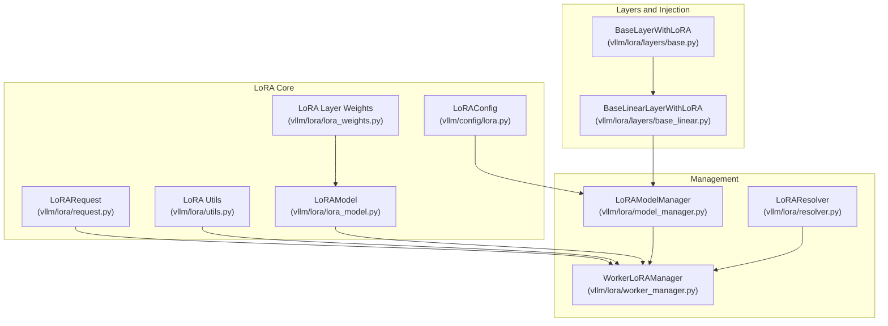
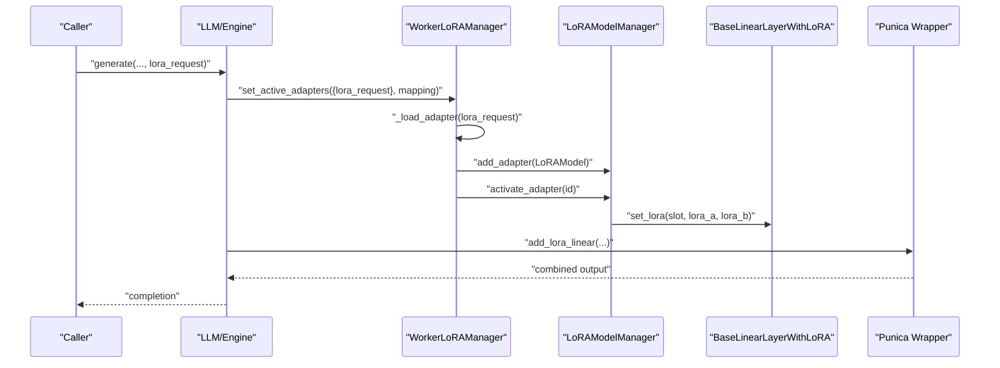
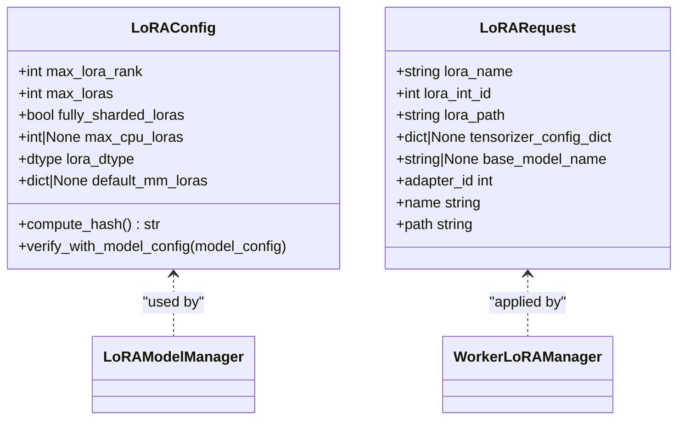
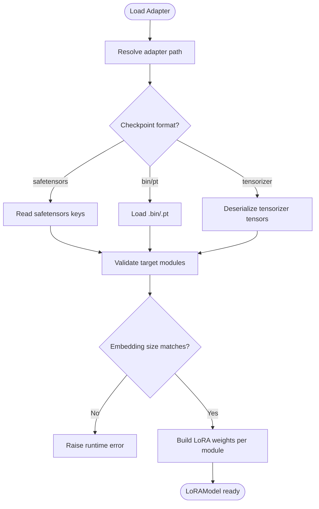
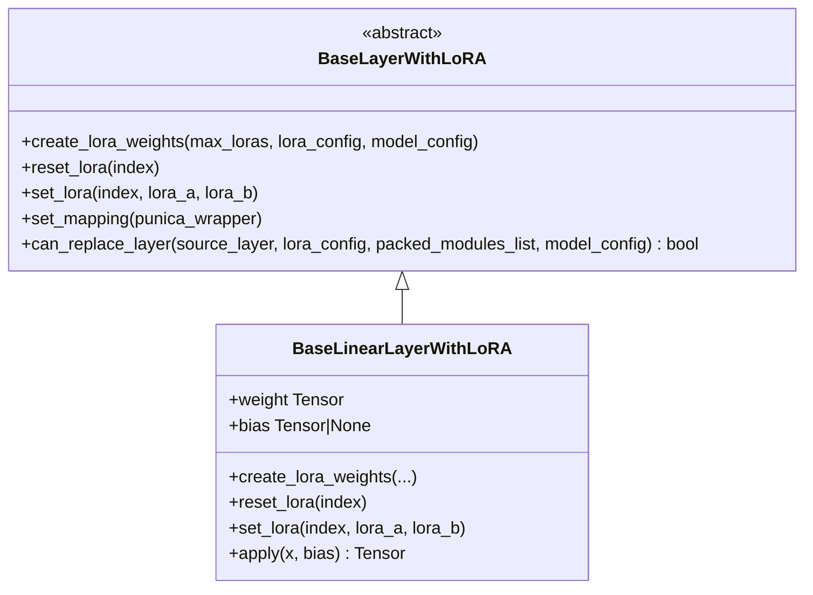
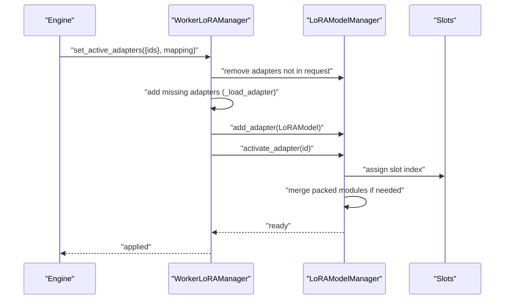
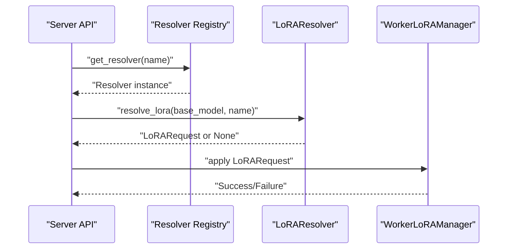
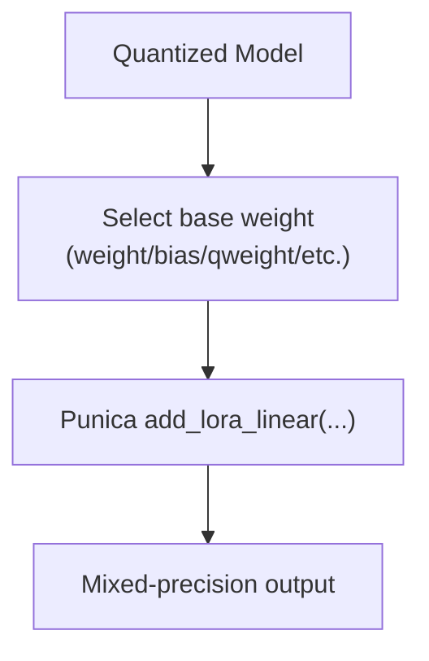
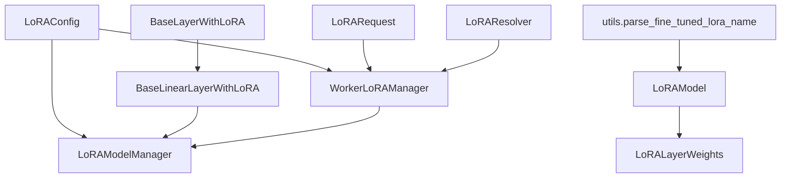

# LoRA Adapters

<cite>
**Referenced Files in This Document**
- [docs/features/lora.md](file://docs/features/lora.md)
- [vllm/config/lora.py](file://vllm/config/lora.py)
- [vllm/lora/request.py](file://vllm/lora/request.py)
- [vllm/lora/utils.py](file://vllm/lora/utils.py)
- [vllm/lora/lora_model.py](file://vllm/lora/lora_model.py)
- [vllm/lora/lora_weights.py](file://vllm/lora/lora_weights.py)
- [vllm/lora/layers/base.py](file://vllm/lora/layers/base.py)
- [vllm/lora/layers/base_linear.py](file://vllm/lora/layers/base_linear.py)
- [vllm/lora/model_manager.py](file://vllm/lora/model_manager.py)
- [vllm/lora/worker_manager.py](file://vllm/lora/worker_manager.py)
- [vllm/lora/resolver.py](file://vllm/lora/resolver.py)
- [examples/offline_inference/multilora_inference.py](file://examples/offline_inference/multilora_inference.py)
- [examples/offline_inference/lora_with_quantization_inference.py](file://examples/offline_inference/lora_with_quantization_inference.py)
- [benchmarks/kernels/benchmark_lora.py](file://benchmarks/kernels/benchmark_lora.py)
</cite>

## Table of Contents
1. [Introduction](#introduction)
2. [Project Structure](#project-structure)
3. [Core Components](#core-components)
4. [Architecture Overview](#architecture-overview)
5. [Detailed Component Analysis](#detailed-component-analysis)
6. [Dependency Analysis](#dependency-analysis)
7. [Performance Considerations](#performance-considerations)
8. [Troubleshooting Guide](#troubleshooting-guide)
9. [Conclusion](#conclusion)
10. [Appendices](#appendices)

## Introduction
This document explains LoRA (Low-Rank Adaptation) adapter support in vLLM. LoRA enables parameter-efficient fine-tuning by injecting low-rank matrices into pre-trained transformer layers, allowing rapid adaptation to new tasks or domains without retraining the full model. vLLM integrates LoRA into its execution engine to support per-request adapter activation, multi-LoRA batching, and efficient inference with quantized and mixed-precision models. The documentation covers adapter loading, activation, management, multi-LoRA usage, quantization integration, performance tuning, troubleshooting, and best practices.

## Project Structure
The LoRA implementation spans configuration, request handling, model loading, adapter management, layer injection, and worker orchestration. The following diagram maps the primary LoRA-related modules and their roles.

**Diagram sources**
- [vllm/config/lora.py](file://vllm/config/lora.py#L1-L97)
- [vllm/lora/request.py](file://vllm/lora/request.py#L1-L96)
- [vllm/lora/utils.py](file://vllm/lora/utils.py#L1-L316)
- [vllm/lora/lora_model.py](file://vllm/lora/lora_model.py#L1-L247)
- [vllm/lora/lora_weights.py](file://vllm/lora/lora_weights.py#L1-L228)
- [vllm/lora/layers/base.py](file://vllm/lora/layers/base.py#L1-L67)
- [vllm/lora/layers/base_linear.py](file://vllm/lora/layers/base_linear.py#L1-L166)
- [vllm/lora/model_manager.py](file://vllm/lora/model_manager.py#L1-L691)
- [vllm/lora/worker_manager.py](file://vllm/lora/worker_manager.py#L1-L269)
- [vllm/lora/resolver.py](file://vllm/lora/resolver.py#L1-L89)

**Section sources**
- [vllm/config/lora.py](file://vllm/config/lora.py#L1-L97)
- [vllm/lora/request.py](file://vllm/lora/request.py#L1-L96)
- [vllm/lora/utils.py](file://vllm/lora/utils.py#L1-L316)
- [vllm/lora/lora_model.py](file://vllm/lora/lora_model.py#L1-L247)
- [vllm/lora/lora_weights.py](file://vllm/lora/lora_weights.py#L1-L228)
- [vllm/lora/layers/base.py](file://vllm/lora/layers/base.py#L1-L67)
- [vllm/lora/layers/base_linear.py](file://vllm/lora/layers/base_linear.py#L1-L166)
- [vllm/lora/model_manager.py](file://vllm/lora/model_manager.py#L1-L691)
- [vllm/lora/worker_manager.py](file://vllm/lora/worker_manager.py#L1-L269)
- [vllm/lora/resolver.py](file://vllm/lora/resolver.py#L1-L89)

## Core Components
- LoRAConfig: Defines adapter capacity, ranks, sharding, dtype, and multimodal defaults.
- LoRARequest: Encapsulates adapter identity, path, and metadata for per-request activation.
- LoRAModel: Loads and validates adapter weights from local checkpoints and constructs per-layer LoRA weights.
- LoRALayerWeights/PackedLoRALayerWeights: Stores LoRA pairs (A/B) with scaling and supports packing for merged/packed modules.
- BaseLayerWithLoRA/BaseLinearLayerWithLoRA: Abstractions for injecting LoRA into linear layers and computing output with low-rank updates.
- LoRAModelManager/LRUCacheLoRAModelManager: Manages adapter registration, activation, mapping, and GPU/CPU caching.
- WorkerLoRAManager: Orchestrates adapter loading, activation, and per-request application on workers.
- LoRAResolver: Plugin interface for dynamic resolution of adapters from local or remote sources.

**Section sources**
- [vllm/config/lora.py](file://vllm/config/lora.py#L1-L97)
- [vllm/lora/request.py](file://vllm/lora/request.py#L1-L96)
- [vllm/lora/lora_model.py](file://vllm/lora/lora_model.py#L1-L247)
- [vllm/lora/lora_weights.py](file://vllm/lora/lora_weights.py#L1-L228)
- [vllm/lora/layers/base.py](file://vllm/lora/layers/base.py#L1-L67)
- [vllm/lora/layers/base_linear.py](file://vllm/lora/layers/base_linear.py#L1-L166)
- [vllm/lora/model_manager.py](file://vllm/lora/model_manager.py#L1-L691)
- [vllm/lora/worker_manager.py](file://vllm/lora/worker_manager.py#L1-L269)
- [vllm/lora/resolver.py](file://vllm/lora/resolver.py#L1-L89)

## Architecture Overview
The LoRA pipeline integrates with vLLM’s model executor and scheduler. Adapters are loaded once, cached, and activated per request. The model manager injects LoRA-capable layers into the base model and coordinates mapping between request adapters and GPU buffers. Quantized and mixed-precision models are supported through the base layer abstractions.

**Diagram sources**
- [vllm/lora/worker_manager.py](file://vllm/lora/worker_manager.py#L159-L200)
- [vllm/lora/model_manager.py](file://vllm/lora/model_manager.py#L129-L219)
- [vllm/lora/layers/base_linear.py](file://vllm/lora/layers/base_linear.py#L122-L139)
- [vllm/lora/lora_model.py](file://vllm/lora/lora_model.py#L112-L147)

**Section sources**
- [vllm/lora/worker_manager.py](file://vllm/lora/worker_manager.py#L159-L200)
- [vllm/lora/model_manager.py](file://vllm/lora/model_manager.py#L129-L219)
- [vllm/lora/layers/base_linear.py](file://vllm/lora/layers/base_linear.py#L122-L139)
- [vllm/lora/lora_model.py](file://vllm/lora/lora_model.py#L112-L147)

## Detailed Component Analysis

### LoRA Configuration and Requests
- LoRAConfig controls max ranks, number of adapters per batch, CPU cache size, dtype, and multimodal defaults.
- LoRARequest carries adapter identity, path, optional tensorizer config, and base model linkage for model cards.

**Diagram sources**
- [vllm/config/lora.py](file://vllm/config/lora.py#L1-L97)
- [vllm/lora/request.py](file://vllm/lora/request.py#L1-L96)

**Section sources**
- [vllm/config/lora.py](file://vllm/config/lora.py#L1-L97)
- [vllm/lora/request.py](file://vllm/lora/request.py#L1-L96)

### Adapter Loading and Validation
- LoRAModel loads adapters from safetensors/bin/pt/tensorizer-backed checkpoints, validates target modules, and enforces vocabulary consistency for embeddings.
- PEFTHelper is used to validate adapter legality against LoRAConfig and to map names when needed.

**Diagram sources**
- [vllm/lora/lora_model.py](file://vllm/lora/lora_model.py#L112-L147)
- [vllm/lora/lora_model.py](file://vllm/lora/lora_model.py#L148-L247)

**Section sources**
- [vllm/lora/lora_model.py](file://vllm/lora/lora_model.py#L112-L147)
- [vllm/lora/lora_model.py](file://vllm/lora/lora_model.py#L148-L247)

### Layer Injection and Low-Rank Computation
- BaseLayerWithLoRA defines the contract for LoRA-enabled layers.
- BaseLinearLayerWithLoRA allocates per-slot LoRA buffers, slices weights for tensor-parallel splits, and applies LoRA updates via Punica wrapper.

**Diagram sources**
- [vllm/lora/layers/base.py](file://vllm/lora/layers/base.py#L1-L67)
- [vllm/lora/layers/base_linear.py](file://vllm/lora/layers/base_linear.py#L1-L166)

**Section sources**
- [vllm/lora/layers/base.py](file://vllm/lora/layers/base.py#L1-L67)
- [vllm/lora/layers/base_linear.py](file://vllm/lora/layers/base_linear.py#L1-L166)

### Adapter Management and Multi-LoRA
- LoRAModelManager creates LoRA-capable layers, registers modules, merges packed modules, and activates adapters into GPU slots.
- LRUCacheLoRAModelManager adds CPU/GPU LRU caching and pinning for hot adapters.
- WorkerLoRAManager coordinates per-request adapter activation, mapping, and eviction.

**Diagram sources**
- [vllm/lora/worker_manager.py](file://vllm/lora/worker_manager.py#L159-L200)
- [vllm/lora/model_manager.py](file://vllm/lora/model_manager.py#L248-L334)
- [vllm/lora/model_manager.py](file://vllm/lora/model_manager.py#L469-L531)

**Section sources**
- [vllm/lora/model_manager.py](file://vllm/lora/model_manager.py#L129-L219)
- [vllm/lora/model_manager.py](file://vllm/lora/model_manager.py#L248-L334)
- [vllm/lora/model_manager.py](file://vllm/lora/model_manager.py#L469-L531)
- [vllm/lora/worker_manager.py](file://vllm/lora/worker_manager.py#L159-L200)

### Dynamic Resolution and Runtime Updates
- LoRAResolver defines an interface for resolving adapters from arbitrary sources (e.g., filesystem, S3).
- The server supports runtime loading/unloading via API endpoints and resolver plugins when enabled.

**Diagram sources**
- [vllm/lora/resolver.py](file://vllm/lora/resolver.py#L1-L89)
- [vllm/lora/worker_manager.py](file://vllm/lora/worker_manager.py#L159-L200)

**Section sources**
- [vllm/lora/resolver.py](file://vllm/lora/resolver.py#L1-L89)
- [vllm/lora/worker_manager.py](file://vllm/lora/worker_manager.py#L159-L200)

### Quantization and Mixed Precision Integration
- LoRA integrates with quantized backends via base layer weight property resolution and dtype selection from LoRAConfig.
- Examples demonstrate LoRA with QLoRA, AWQ, and GPTQ models.

**Diagram sources**
- [vllm/lora/layers/base_linear.py](file://vllm/lora/layers/base_linear.py#L140-L166)
- [vllm/config/lora.py](file://vllm/config/lora.py#L92-L97)

**Section sources**
- [vllm/lora/layers/base_linear.py](file://vllm/lora/layers/base_linear.py#L140-L166)
- [vllm/config/lora.py](file://vllm/config/lora.py#L92-L97)
- [examples/offline_inference/lora_with_quantization_inference.py](file://examples/offline_inference/lora_with_quantization_inference.py#L1-L128)

### Multi-LoRA Support and Examples
- vLLM supports multiple adapters per batch up to max_loras, with careful memory planning for slots and ranks.
- Examples show multi-LoRA usage in offline inference and quantized settings.

**Section sources**
- [vllm/config/lora.py](file://vllm/config/lora.py#L34-L57)
- [vllm/lora/model_manager.py](file://vllm/lora/model_manager.py#L180-L219)
- [examples/offline_inference/multilora_inference.py](file://examples/offline_inference/multilora_inference.py#L1-L107)

## Dependency Analysis
The LoRA subsystem depends on:
- Model executor layers and quantization backends (for weight access and dtype).
- Scheduler configuration for batch sizing and token budgets.
- Platform utilities for pinning and device selection.
- Resolver registry for dynamic adapter resolution.

**Diagram sources**
- [vllm/config/lora.py](file://vllm/config/lora.py#L1-L97)
- [vllm/lora/request.py](file://vllm/lora/request.py#L1-L96)
- [vllm/lora/utils.py](file://vllm/lora/utils.py#L136-L178)
- [vllm/lora/lora_model.py](file://vllm/lora/lora_model.py#L112-L147)
- [vllm/lora/lora_weights.py](file://vllm/lora/lora_weights.py#L1-L120)
- [vllm/lora/layers/base.py](file://vllm/lora/layers/base.py#L1-L67)
- [vllm/lora/layers/base_linear.py](file://vllm/lora/layers/base_linear.py#L1-L166)
- [vllm/lora/model_manager.py](file://vllm/lora/model_manager.py#L1-L120)
- [vllm/lora/worker_manager.py](file://vllm/lora/worker_manager.py#L1-L120)
- [vllm/lora/resolver.py](file://vllm/lora/resolver.py#L1-L89)

**Section sources**
- [vllm/config/lora.py](file://vllm/config/lora.py#L1-L97)
- [vllm/lora/utils.py](file://vllm/lora/utils.py#L136-L178)
- [vllm/lora/lora_model.py](file://vllm/lora/lora_model.py#L112-L147)
- [vllm/lora/layers/base_linear.py](file://vllm/lora/layers/base_linear.py#L122-L139)
- [vllm/lora/model_manager.py](file://vllm/lora/model_manager.py#L1-L120)
- [vllm/lora/worker_manager.py](file://vllm/lora/worker_manager.py#L1-L120)
- [vllm/lora/resolver.py](file://vllm/lora/resolver.py#L1-L89)

## Performance Considerations
- Rank and slot sizing: Set max_lora_rank to the highest observed rank and max_loras to the concurrency level. Excessively high ranks increase memory and reduce throughput.
- Fully-sharded LoRAs: Enable fully_sharded_loras for large ranks or TP sizes to improve performance.
- CPU cache: Configure max_cpu_loras to balance cold-start latency vs. memory footprint.
- Quantization dtype: Align lora_dtype with base model dtype to minimize conversions.
- Benchmarking: Use the LoRA kernel benchmark to measure impact on your workload.

[No sources needed since this section provides general guidance]

## Troubleshooting Guide
Common issues and resolutions:
- Adapter not found or invalid path: Ensure lora_path resolves to a valid local directory or Hugging Face identifier. The loader attempts snapshot_download for identifiers and falls back to the provided path.
- Unexpected target modules: The loader validates that loaded LoRA target modules match expected names; mismatch raises an error. Verify adapter target_modules align with model structure.
- Embedding dimension mismatch: For embedding LoRA, the adapter’s input dimension must match base model vocab size; otherwise a runtime error is raised.
- Too many adapters requested: Number of requested adapters exceeds adapter_slots or CPU capacity; reduce concurrent adapters or increase limits.
- Dimension mismatches in packed modules: The manager merges packed modules; ensure all constituent LoRA shapes are consistent.
- Runtime updates disabled: Dynamic loading/unloading requires enabling runtime LoRA updating; verify environment configuration.

**Section sources**
- [vllm/lora/utils.py](file://vllm/lora/utils.py#L246-L289)
- [vllm/lora/lora_model.py](file://vllm/lora/lora_model.py#L148-L247)
- [vllm/lora/model_manager.py](file://vllm/lora/model_manager.py#L469-L531)
- [vllm/lora/worker_manager.py](file://vllm/lora/worker_manager.py#L171-L182)

## Conclusion
vLLM’s LoRA support provides efficient, parameter-efficient adaptation with flexible per-request activation, multi-LoRA batching, and integration with quantized and mixed-precision models. Proper configuration of ranks, slots, and caches, combined with dynamic resolution and robust validation, yields strong performance and reliability across diverse model families and deployment scenarios.

## Appendices

### Practical Usage Examples
- Basic LoRA usage and server-side serving with per-request adapter activation.
- Multi-LoRA offline inference with controlled concurrency and ranks.
- LoRA with quantized models (QLoRA, AWQ, GPTQ).

**Section sources**
- [docs/features/lora.md](file://docs/features/lora.md#L1-L120)
- [docs/features/lora.md](file://docs/features/lora.md#L120-L210)
- [examples/offline_inference/multilora_inference.py](file://examples/offline_inference/multilora_inference.py#L1-L107)
- [examples/offline_inference/lora_with_quantization_inference.py](file://examples/offline_inference/lora_with_quantization_inference.py#L1-L128)

### Kernel Benchmarking
- Use the LoRA kernel benchmark to evaluate performance characteristics on your hardware and configurations.

**Section sources**
- [benchmarks/kernels/benchmark_lora.py](file://benchmarks/kernels/benchmark_lora.py)