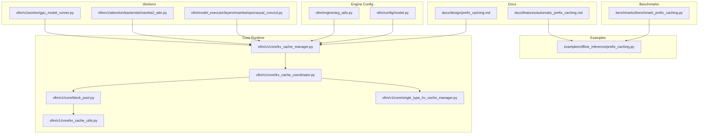
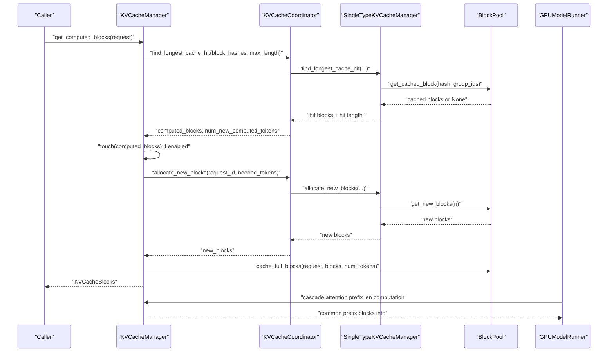
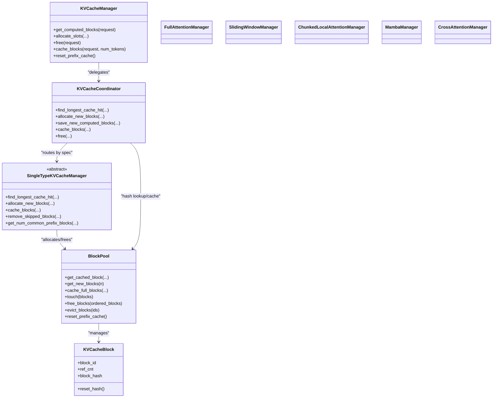

# Prefix Caching

<cite>
**Referenced Files in This Document**
- [prefix_caching.md](file://docs/design/prefix_caching.md)
- [automatic_prefix_caching.md](file://docs/features/automatic_prefix_caching.md)
- [prefix_caching.py](file://examples/offline_inference/prefix_caching.py)
- [benchmark_prefix_caching.py](file://benchmarks/benchmark_prefix_caching.py)
- [kv_cache_manager.py](file://vllm/v1/core/kv_cache_manager.py)
- [kv_cache_coordinator.py](file://vllm/v1/core/kv_cache_coordinator.py)
- [single_type_kv_cache_manager.py](file://vllm/v1/core/single_type_kv_cache_manager.py)
- [block_pool.py](file://vllm/v1/core/block_pool.py)
- [kv_cache_utils.py](file://vllm/v1/core/kv_cache_utils.py)
- [test_prefix_caching.py](file://tests/v1/core/test_prefix_caching.py)
- [test_engine_args.py](file://tests/v1/engine/test_engine_args.py)
- [arg_utils.py](file://vllm/engine/arg_utils.py)
- [model.py](file://vllm/config/model.py)
- [gpu_model_runner.py](file://vllm/v1/worker/gpu_model_runner.py)
- [mamba2_attn.py](file://vllm/v1/attention/backends/mamba2_attn.py)
- [causal_conv1d.py](file://vllm/model_executor/layers/mamba/ops/causal_conv1d.py)
</cite>

## Table of Contents
1. [Introduction](#introduction)
2. [Project Structure](#project-structure)
3. [Core Components](#core-components)
4. [Architecture Overview](#architecture-overview)
5. [Detailed Component Analysis](#detailed-component-analysis)
6. [Dependency Analysis](#dependency-analysis)
7. [Performance Considerations](#performance-considerations)
8. [Troubleshooting Guide](#troubleshooting-guide)
9. [Conclusion](#conclusion)
10. [Appendices](#appendices)

## Introduction
Prefix caching in vLLM accelerates LLM inference by recognizing and reusing computed KV-cache blocks from previously processed prompts that share a common prefix. This avoids redundant prefill computations for repeated or similar inputs, improving both throughput and memory efficiency. vLLM implements a hash-based approach that uniquely identifies full KV-cache blocks using a composite key derived from parent block hashes, block token IDs, and optional extra identifiers (e.g., LoRA adapter, multimodal features, cache salt). The system maintains a block pool, a free-block queue (LRU-ordered), and a cache mapping from block hash to cached blocks. It supports multiple attention types (full attention, sliding window, chunked local attention, Mamba) and integrates with PagedAttention-style block allocation.

Key benefits:
- Reduces prefill latency for repeated prefixes.
- Improves throughput by avoiding recomputation.
- Supports multi-modal and LoRA-aware hashing for safe reuse.
- Provides isolation via cache salt for multi-tenant deployments.

## Project Structure
This section highlights the files implementing prefix caching and related features.

**Diagram sources**
- [prefix_caching.md](file://docs/design/prefix_caching.md#L1-L232)
- [automatic_prefix_caching.md](file://docs/features/automatic_prefix_caching.md#L1-L26)
- [prefix_caching.py](file://examples/offline_inference/prefix_caching.py#L1-L99)
- [benchmark_prefix_caching.py](file://benchmarks/benchmark_prefix_caching.py#L1-L278)
- [kv_cache_manager.py](file://vllm/v1/core/kv_cache_manager.py#L1-L420)
- [kv_cache_coordinator.py](file://vllm/v1/core/kv_cache_coordinator.py#L1-L571)
- [single_type_kv_cache_manager.py](file://vllm/v1/core/single_type_kv_cache_manager.py#L1-L800)
- [block_pool.py](file://vllm/v1/core/block_pool.py#L1-L486)
- [kv_cache_utils.py](file://vllm/v1/core/kv_cache_utils.py#L1-L800)
- [arg_utils.py](file://vllm/engine/arg_utils.py#L1906-L1923)
- [model.py](file://vllm/config/model.py#L1721-L1753)
- [gpu_model_runner.py](file://vllm/v1/worker/gpu_model_runner.py#L1777-L1850)
- [mamba2_attn.py](file://vllm/v1/attention/backends/mamba2_attn.py#L206-L240)
- [causal_conv1d.py](file://vllm/model_executor/layers/mamba/ops/causal_conv1d.py#L71-L98)

**Section sources**
- [prefix_caching.md](file://docs/design/prefix_caching.md#L1-L232)
- [kv_cache_manager.py](file://vllm/v1/core/kv_cache_manager.py#L1-L420)

## Core Components
- KVCacheManager: Orchestrates prefix caching lifecycle: computing cache hits, allocating slots, caching newly computed full blocks, freeing blocks, and eviction control. It delegates attention-type-specific logic to coordinators/managers and interacts with the block pool.
- KVCacheCoordinator: Coordinates across KV cache groups. It routes operations to single-type managers and implements find_longest_cache_hit for unitary and hybrid configurations.
- SingleTypeKVCacheManager family: Implements attention-type-specific logic (full attention, sliding window, chunked local attention, Mamba, cross-attention). Handles block allocation, cache hit detection, skipped-token removal, and common prefix counting.
- BlockPool: Central pool of KVCacheBlock objects. Maintains free-block LRU queue, cache mapping from block hash to block(s), and eviction semantics. Supports touch, free, and reset operations.
- KVCacheUtils: Defines block hash types, packing/unpacking helpers, block hash generation, and extra-key derivation for LoRA, multimodal, prompt embeds, and cache salt.

Key responsibilities:
- Hash-based cache hit detection across attention types.
- LRU eviction policy for cached blocks.
- Append-only block-table semantics with reference counting to prevent premature reuse.
- Integration with PagedAttention-style block allocation and attention metadata builders.

**Section sources**
- [kv_cache_manager.py](file://vllm/v1/core/kv_cache_manager.py#L164-L420)
- [kv_cache_coordinator.py](file://vllm/v1/core/kv_cache_coordinator.py#L1-L571)
- [single_type_kv_cache_manager.py](file://vllm/v1/core/single_type_kv_cache_manager.py#L1-L800)
- [block_pool.py](file://vllm/v1/core/block_pool.py#L1-L486)
- [kv_cache_utils.py](file://vllm/v1/core/kv_cache_utils.py#L1-L800)

## Architecture Overview
The prefix caching pipeline connects request scheduling, hash computation, cache lookup, block allocation, and attention metadata construction.

**Diagram sources**
- [kv_cache_manager.py](file://vllm/v1/core/kv_cache_manager.py#L164-L325)
- [kv_cache_coordinator.py](file://vllm/v1/core/kv_cache_coordinator.py#L209-L214)
- [single_type_kv_cache_manager.py](file://vllm/v1/core/single_type_kv_cache_manager.py#L304-L462)
- [block_pool.py](file://vllm/v1/core/block_pool.py#L182-L210)
- [gpu_model_runner.py](file://vllm/v1/worker/gpu_model_runner.py#L1777-L1850)

## Detailed Component Analysis

### Hash-Based Prefix Caching
- Block hash composition: parent block hash, current block token IDs, and optional extra keys (LoRA, multimodal, cache salt, prompt embeds). The design ensures uniqueness and supports collision mitigation via configurable hash functions.
- Extra keys: Automatically included for multimodal inputs, LoRA adapters, cache salt, and prompt embeddings to prevent unintended cross-request reuse.
- Hash function selection: Default SHA-256 for deterministic, reproducible hashing; optional xxHash variants supported. Environment warnings are emitted when reproducibility requires a fixed seed.

Practical implications:
- Enables safe reuse across diverse inputs (multimodal, adapters).
- Supports multi-tenant isolation via cache salt injection into the first block’s hash.
- Hash computation is cached internally to avoid recomputation.

**Section sources**
- [kv_cache_utils.py](file://vllm/v1/core/kv_cache_utils.py#L367-L523)
- [kv_cache_utils.py](file://vllm/v1/core/kv_cache_utils.py#L525-L607)
- [kv_cache_utils.py](file://vllm/v1/core/kv_cache_utils.py#L609-L721)

### Cache Management Strategies
- Block pool initialization: Preallocates all blocks and maintains a doubly-linked free-block queue for O(1) insertion/removal and LRU ordering.
- Computed block touch: Increases reference counts and removes blocks from the free queue to prevent eviction during reuse.
- Cached block insertion: When a block becomes full, it is hashed and inserted into the cache map keyed by block hash with group ID. Duplicate hashes map to a list of blocks to avoid replacing active cached blocks.
- Eviction policy: LRU eviction of the head of the free queue. If a cached block is selected for eviction, its hash is removed from the cache and the block’s metadata is reset. Events can be emitted for monitoring.
- Reset: Entire prefix cache can be cleared atomically, invalidating all hashes and resetting metrics.

**Section sources**
- [block_pool.py](file://vllm/v1/core/block_pool.py#L128-L179)
- [block_pool.py](file://vllm/v1/core/block_pool.py#L182-L210)
- [block_pool.py](file://vllm/v1/core/block_pool.py#L209-L293)
- [block_pool.py](file://vllm/v1/core/block_pool.py#L326-L365)
- [block_pool.py](file://vllm/v1/core/block_pool.py#L366-L400)
- [block_pool.py](file://vllm/v1/core/block_pool.py#L419-L453)

### Allocation and Free Semantics
- Allocation: Computes required blocks considering existing computed blocks and lookahead tokens. Allocates from the free pool, touching cached hits to avoid eviction. Newly computed full blocks are cached.
- Free: Blocks are freed in reverse order to prioritize eviction of tail blocks (less likely to be reused). Freed blocks whose reference count reaches zero are appended to the free queue.
- Hybrid attention: For models with mixed attention types, cache hit length must be aligned to the LCM of block sizes across groups.

**Section sources**
- [kv_cache_manager.py](file://vllm/v1/core/kv_cache_manager.py#L206-L325)
- [kv_cache_coordinator.py](file://vllm/v1/core/kv_cache_coordinator.py#L70-L104)
- [single_type_kv_cache_manager.py](file://vllm/v1/core/single_type_kv_cache_manager.py#L122-L146)
- [single_type_kv_cache_manager.py](file://vllm/v1/core/single_type_kv_cache_manager.py#L173-L189)
- [kv_cache_coordinator.py](file://vllm/v1/core/kv_cache_coordinator.py#L330-L524)

### Attention-Type-Specific Behavior
- Full attention: Straightforward longest cache hit by scanning block hashes; optional dropping of the last matched block when speculative decoding is enabled.
- Sliding window: Matches blocks within the sliding window boundary; marks skipped prefix blocks as null; computes skipped tokens accordingly.
- Chunked local attention: Marks blocks outside the current chunk as computed (null) and finds cache hits within the local window.
- Mamba: Aligns block sizes across attention types to ensure consistent prefix hit lengths; inserts dummy null blocks to maintain alignment.
- Cross-attention: Encoder-decoder states are request-specific and not cached for reuse.

**Section sources**
- [single_type_kv_cache_manager.py](file://vllm/v1/core/single_type_kv_cache_manager.py#L304-L363)
- [single_type_kv_cache_manager.py](file://vllm/v1/core/single_type_kv_cache_manager.py#L365-L462)
- [single_type_kv_cache_manager.py](file://vllm/v1/core/single_type_kv_cache_manager.py#L501-L652)
- [single_type_kv_cache_manager.py](file://vllm/v1/core/single_type_kv_cache_manager.py#L654-L740)
- [single_type_kv_cache_manager.py](file://vllm/v1/core/single_type_kv_cache_manager.py#L741-L793)

### Cascade Attention and Common Prefix Blocks
- The runner computes cascade attention prefix lengths by leveraging common prefix blocks across running requests. This enables efficient bi-directional attention windows without violating masking constraints.

**Section sources**
- [gpu_model_runner.py](file://vllm/v1/worker/gpu_model_runner.py#L1777-L1850)

### Relationship with PagedAttention
- Prefix caching complements PagedAttention-style block allocation. The block pool acts as a bounded, LRU-managed page store; cache hits reuse full blocks, reducing the number of pages requiring computation. The attention metadata builders consume the computed block tables and cascade attention hints.

**Section sources**
- [kv_cache_manager.py](file://vllm/v1/core/kv_cache_manager.py#L206-L325)
- [kv_cache_coordinator.py](file://vllm/v1/core/kv_cache_coordinator.py#L120-L146)

### Configuration Options
- CLI flags and defaults:
  - Enable/disable prefix caching via CLI arguments; default is enabled in v1.
  - Select hash algorithm for block hashing (e.g., sha256, sha256_cbor, xxhash).
- Model support:
  - Some pooling models restrict prefix caching depending on attention type and pooling mode.
- Engine integration:
  - EngineArgs sets default behavior and logs warnings for unsupported models when enabling prefix caching.

**Section sources**
- [test_engine_args.py](file://tests/v1/engine/test_engine_args.py#L1-L59)
- [arg_utils.py](file://vllm/engine/arg_utils.py#L1906-L1923)
- [model.py](file://vllm/config/model.py#L1721-L1753)

### Practical Examples
- Example usage: Demonstrates enabling prefix caching and comparing outputs with and without caching for repeated prompts.
- Benchmarking: Script to measure throughput differences with and without prefix caching across fixed prompts or ShareGPT-derived datasets, supporting repetition and sorting options.

**Section sources**
- [prefix_caching.py](file://examples/offline_inference/prefix_caching.py#L1-L99)
- [benchmark_prefix_caching.py](file://benchmarks/benchmark_prefix_caching.py#L1-L278)

### Performance Benchmarks and Measurement
- Benchmark script supports:
  - Fixed prompts and ShareGPT sampling.
  - Configurable input length ranges and output lengths.
  - Repeat counts to amplify cache hit probability.
  - Detokenization toggle to isolate tokenization cost from latency measurements.
- Typical scenarios:
  - Long document queries with repeated prefixes.
  - Multi-turn conversations sharing historical context.

**Section sources**
- [benchmark_prefix_caching.py](file://benchmarks/benchmark_prefix_caching.py#L1-L278)

### Trade-offs: Memory vs Throughput
- Memory footprint:
  - Prefix cache consumes GPU memory proportional to the number of cached full blocks and their metadata.
  - LRU eviction prevents unbounded growth; however, very large caches increase contention and hash table overhead.
- Throughput gains:
  - Significant reduction in prefill latency when cache hits are frequent.
  - Minimal decoding overhead; gains primarily occur in the prefill stage.
- Tuning levers:
  - Increase block size to reduce hash computation overhead per token but raise memory pressure.
  - Adjust free-block queue ordering and eviction thresholds to balance reuse and memory usage.

[No sources needed since this section provides general guidance]

## Dependency Analysis
The following diagram shows key dependencies among core components.

**Diagram sources**
- [kv_cache_manager.py](file://vllm/v1/core/kv_cache_manager.py#L164-L420)
- [kv_cache_coordinator.py](file://vllm/v1/core/kv_cache_coordinator.py#L1-L216)
- [single_type_kv_cache_manager.py](file://vllm/v1/core/single_type_kv_cache_manager.py#L1-L200)
- [block_pool.py](file://vllm/v1/core/block_pool.py#L128-L210)

**Section sources**
- [kv_cache_manager.py](file://vllm/v1/core/kv_cache_manager.py#L164-L420)
- [kv_cache_coordinator.py](file://vllm/v1/core/kv_cache_coordinator.py#L1-L216)
- [single_type_kv_cache_manager.py](file://vllm/v1/core/single_type_kv_cache_manager.py#L1-L200)
- [block_pool.py](file://vllm/v1/core/block_pool.py#L128-L210)

## Performance Considerations
- Hash computation cost: Minimal overhead; negligible impact for typical token counts.
- Block size tuning: Larger blocks reduce hash computations and improve cache hit rates but increase memory usage.
- Attention-type alignment: Hybrid models require block-size alignment to ensure consistent cache-hit lengths across groups.
- Cascade attention: Leverages common prefix blocks to reduce attention window overlap and improve prefill efficiency.
- Mamba integration: Ensures block-size alignment across attention types to maintain consistent prefix caching behavior.

[No sources needed since this section provides general guidance]

## Troubleshooting Guide
Common issues and resolutions:
- Unexpected outputs or crashes when enabling prefix caching on unsupported models:
  - Some pooling models restrict prefix caching by attention type and pooling mode. Verify model support before enabling.
- Incorrect reuse across tenants:
  - Use cache salt to isolate caches per tenant; ensure the salt is consistently applied to the first block’s hash.
- Memory leaks or degraded performance:
  - Ensure requests are properly freed; verify that blocks are appended to the free queue in reverse order and reference counts are decremented correctly.
  - If encountering persistent cache bloat, reset the prefix cache and warm up with representative workloads.
- Hash collisions:
  - Default to SHA-256 hashing for deterministic behavior; ensure reproducibility by setting a fixed hash seed when using CBOR-based hash functions.

**Section sources**
- [model.py](file://vllm/config/model.py#L1721-L1753)
- [kv_cache_utils.py](file://vllm/v1/core/kv_cache_utils.py#L367-L400)
- [block_pool.py](file://vllm/v1/core/block_pool.py#L384-L399)
- [kv_cache_manager.py](file://vllm/v1/core/kv_cache_manager.py#L326-L359)

## Conclusion
Prefix caching in vLLM provides a robust, hash-based mechanism to accelerate repeated inference workloads by reusing computed KV-cache blocks. Its design balances memory efficiency with throughput improvements through careful allocation, LRU eviction, and attention-type-aware logic. With proper configuration (hash algorithm, block size, and cache salt), and by aligning with attention backends (including Mamba), prefix caching delivers significant prefill gains across long documents and multi-turn conversations. Careful monitoring and reset capabilities ensure stable operation under varying workloads.

[No sources needed since this section summarizes without analyzing specific files]

## Appendices

### Appendix A: Configuration Options
- CLI flags:
  - Enable/disable prefix caching.
  - Choose hash algorithm for block hashing.
- Engine defaults:
  - Prefix caching enabled by default in v1.
  - Warnings logged for unsupported model types when enabling prefix caching.

**Section sources**
- [test_engine_args.py](file://tests/v1/engine/test_engine_args.py#L1-L59)
- [arg_utils.py](file://vllm/engine/arg_utils.py#L1906-L1923)

### Appendix B: Example Workflows
- Repeated prompts with a shared prefix:
  - Warm-up with a representative prompt; subsequent runs reuse computed blocks.
- Multi-turn conversations:
  - Historical context reused across turns to reduce prefill time.

**Section sources**
- [prefix_caching.py](file://examples/offline_inference/prefix_caching.py#L1-L99)

### Appendix C: Related Attention Integrations
- Mamba attention:
  - Prefix caching enabled conditionally; block-size alignment enforced across attention types.
- APC-enabled Triton programs:
  - Kernel-level handling when prefix caching is enabled to manage cache state indices.

**Section sources**
- [mamba2_attn.py](file://vllm/v1/attention/backends/mamba2_attn.py#L206-L240)
- [causal_conv1d.py](file://vllm/model_executor/layers/mamba/ops/causal_conv1d.py#L71-L98)