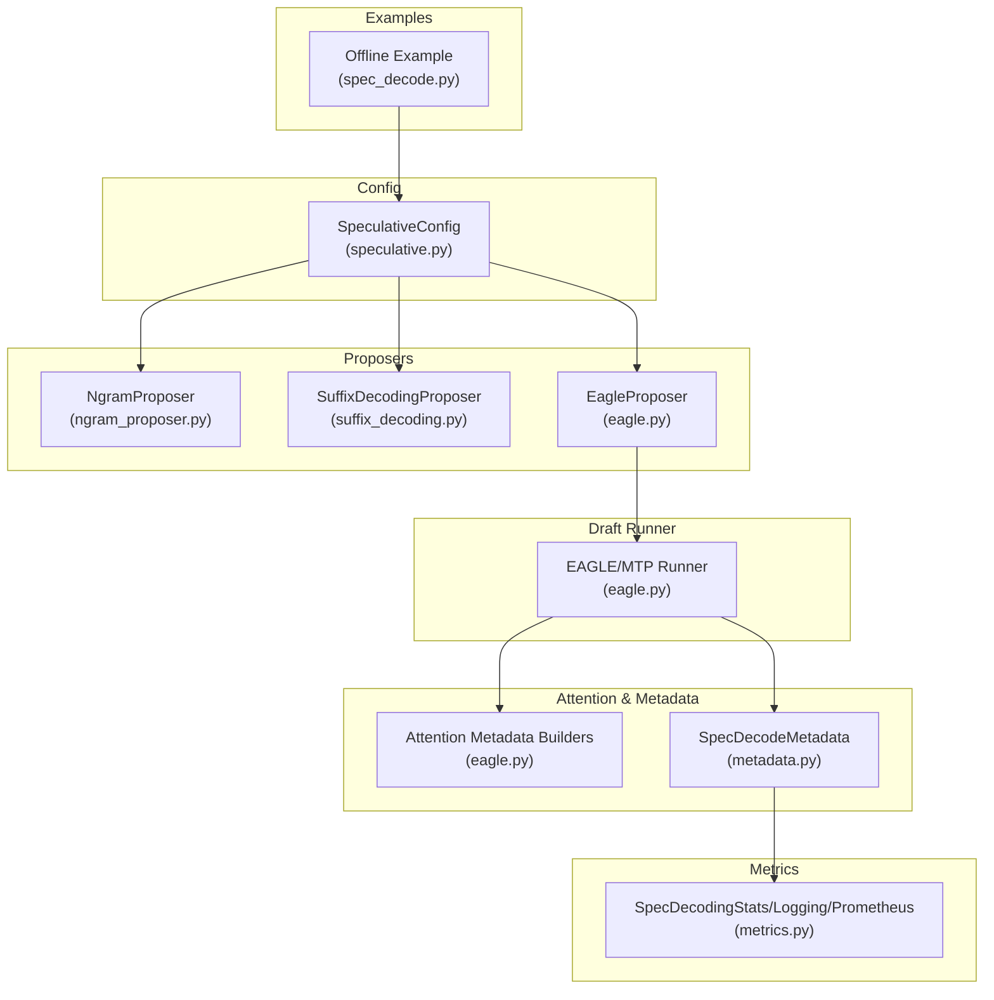
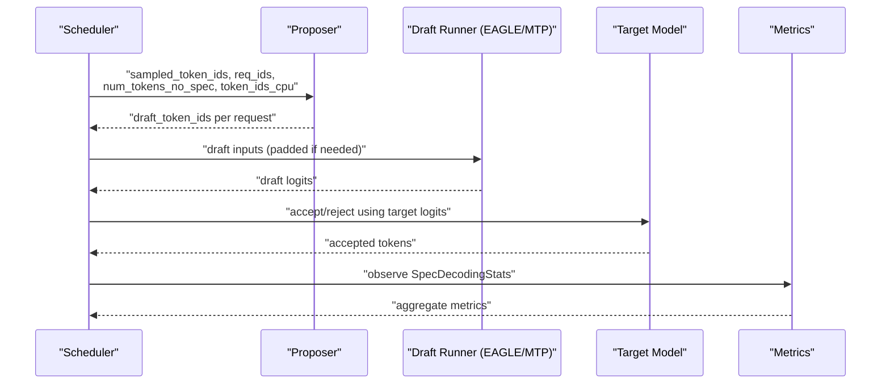
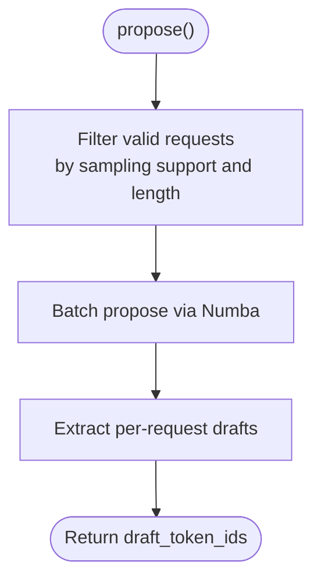
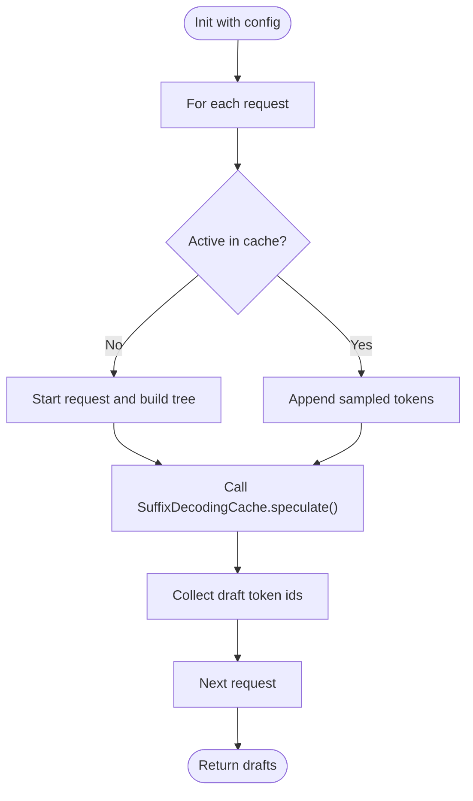
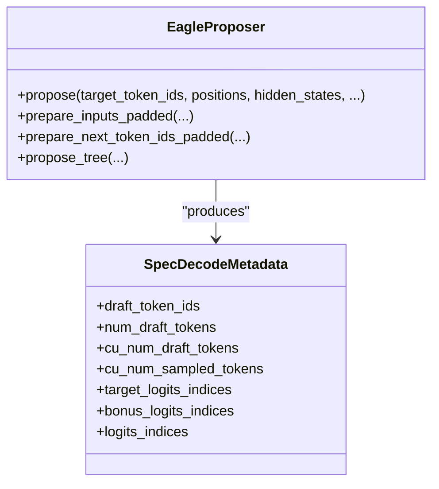
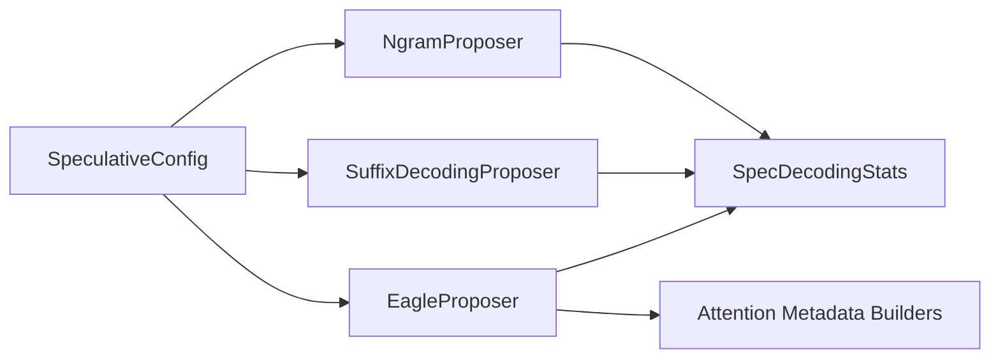

# Speculative Decoding

<cite>
**Referenced Files in This Document**
- [spec_decode.md](file://docs/features/spec_decode.md)
- [speculative.py](file://vllm/config/speculative.py)
- [ngram_proposer.py](file://vllm/v1/spec_decode/ngram_proposer.py)
- [eagle.py](file://vllm/v1/spec_decode/eagle.py)
- [suffix_decoding.py](file://vllm/v1/spec_decode/suffix_decoding.py)
- [metrics.py](file://vllm/v1/spec_decode/metrics.py)
- [utils.py](file://vllm/v1/spec_decode/utils.py)
- [metadata.py](file://vllm/v1/spec_decode/metadata.py)
- [spec_decode.py](file://examples/offline_inference/spec_decode.py)
- [eagle.py (transformers config)](file://vllm/transformers_utils/configs/eagle.py)
</cite>

## Table of Contents
1. [Introduction](#introduction)
2. [Project Structure](#project-structure)
3. [Core Components](#core-components)
4. [Architecture Overview](#architecture-overview)
5. [Detailed Component Analysis](#detailed-component-analysis)
6. [Dependency Analysis](#dependency-analysis)
7. [Performance Considerations](#performance-considerations)
8. [Troubleshooting Guide](#troubleshooting-guide)
9. [Conclusion](#conclusion)
10. [Appendices](#appendices)

## Introduction
Speculative decoding accelerates LLM inference by generating candidate tokens (drafts) ahead of time and accepting or rejecting them based on a fast draft model or pattern heuristics. In vLLM, speculative decoding maintains correctness (lossless guarantees) while enabling higher throughput. The implementation supports multiple methods:
- n-gram proposer: proposes tokens by matching n-grams in the prompt/history.
- Suffix Decoding: uses a suffix tree and frequency counts to propose adaptive numbers of tokens.
- Draft model-based speculators: EAGLE, EAGLE3, Medusa, MLP Speculator, and Mixture-of-Processors (MTP) variants.
This document explains the theory, implementation, configuration, metrics, and optimization strategies for each method.

## Project Structure
The speculative decoding feature spans configuration, proposers, draft model runners, attention metadata builders, and metrics/logging.

**Diagram sources**
- [speculative.py](file://vllm/config/speculative.py#L52-L121)
- [ngram_proposer.py](file://vllm/v1/spec_decode/ngram_proposer.py#L11-L31)
- [suffix_decoding.py](file://vllm/v1/spec_decode/suffix_decoding.py#L7-L21)
- [eagle.py](file://vllm/v1/spec_decode/eagle.py#L57-L118)
- [metadata.py](file://vllm/v1/spec_decode/metadata.py#L9-L25)
- [metrics.py](file://vllm/v1/spec_decode/metrics.py#L16-L37)
- [spec_decode.py](file://examples/offline_inference/spec_decode.py#L103-L129)

**Section sources**
- [speculative.py](file://vllm/config/speculative.py#L52-L121)
- [ngram_proposer.py](file://vllm/v1/spec_decode/ngram_proposer.py#L11-L31)
- [suffix_decoding.py](file://vllm/v1/spec_decode/suffix_decoding.py#L7-L21)
- [eagle.py](file://vllm/v1/spec_decode/eagle.py#L57-L118)
- [metadata.py](file://vllm/v1/spec_decode/metadata.py#L9-L25)
- [metrics.py](file://vllm/v1/spec_decode/metrics.py#L16-L37)
- [spec_decode.py](file://examples/offline_inference/spec_decode.py#L103-L129)

## Core Components
- SpeculativeConfig: central configuration for method selection, draft model, parallelism, and advanced controls.
- NgramProposer: n-gram pattern matcher that proposes fixed-length drafts.
- SuffixDecodingProposer: uses Arctic Inference’s suffix decoding with dynamic speculation.
- EagleProposer: draft model runner supporting EAGLE, EAGLE3, and MTP families; builds attention metadata and prepares padded inputs.
- SpecDecodeMetadata: flattens and indexes draft/target logits for efficient acceptance/rejection.
- Metrics: aggregates acceptance rates, per-position acceptance, and throughput; exposes Prometheus counters.

**Section sources**
- [speculative.py](file://vllm/config/speculative.py#L52-L121)
- [ngram_proposer.py](file://vllm/v1/spec_decode/ngram_proposer.py#L132-L169)
- [suffix_decoding.py](file://vllm/v1/spec_decode/suffix_decoding.py#L32-L98)
- [eagle.py](file://vllm/v1/spec_decode/eagle.py#L225-L380)
- [metadata.py](file://vllm/v1/spec_decode/metadata.py#L9-L25)
- [metrics.py](file://vllm/v1/spec_decode/metrics.py#L16-L37)

## Architecture Overview
End-to-end speculative decoding flow:
1. Scheduler collects sampled tokens and determines which requests can speculate.
2. A proposer generates draft tokens (fixed-length n-gram or dynamic Suffix Decoding; or draft model outputs).
3. Draft tokens are sent to the draft model (EAGLE/MTP/MLP/…), producing candidate logits.
4. Target model accepts or rejects drafts; acceptance is determined by comparing draft logits with target logits.
5. Metrics are recorded per step and periodically logged.

**Diagram sources**
- [ngram_proposer.py](file://vllm/v1/spec_decode/ngram_proposer.py#L132-L169)
- [suffix_decoding.py](file://vllm/v1/spec_decode/suffix_decoding.py#L32-L98)
- [eagle.py](file://vllm/v1/spec_decode/eagle.py#L225-L380)
- [metrics.py](file://vllm/v1/spec_decode/metrics.py#L38-L118)

## Detailed Component Analysis

### SpeculativeConfig: Method Selection and Validation
- Supports methods: ngram, suffix, draft_model, medusa, mlp_speculator, eagle, eagle3, plus MTP family aliases.
- Automatically detects method from draft model config when model path is provided.
- Validates tensor-parallel constraints for draft models and enforces Eagle3 model-type restrictions.
- Provides defaults for n-gram window sizes and suffix decoding parameters.
- Computes a hash for computation graph stability and supports draft model parallel config creation.

Key behaviors:
- If method is not provided and model is a known draft type, method is inferred.
- For MTP-like models, enforces num_speculative_tokens divisibility rules and warns about reuse implications.
- For Eagle/Eagle3, wraps the underlying model config to match expected architectures.

**Section sources**
- [speculative.py](file://vllm/config/speculative.py#L41-L67)
- [speculative.py](file://vllm/config/speculative.py#L235-L386)
- [speculative.py](file://vllm/config/speculative.py#L387-L440)
- [speculative.py](file://vllm/config/speculative.py#L441-L462)
- [speculative.py](file://vllm/config/speculative.py#L594-L636)

### N-gram Proposer
- Uses a batched Numba kernel to scan the rightmost context and propose up to k tokens following the longest matching n-gram in [min_n, max_n].
- Skips requests unsupported by sampling parameters or exceeding max model length.
- Pre-allocates buffers and adapts thread count based on batch token volume.

**Diagram sources**
- [ngram_proposer.py](file://vllm/v1/spec_decode/ngram_proposer.py#L132-L169)
- [ngram_proposer.py](file://vllm/v1/spec_decode/ngram_proposer.py#L64-L129)
- [ngram_proposer.py](file://vllm/v1/spec_decode/ngram_proposer.py#L175-L203)

**Section sources**
- [ngram_proposer.py](file://vllm/v1/spec_decode/ngram_proposer.py#L11-L31)
- [ngram_proposer.py](file://vllm/v1/spec_decode/ngram_proposer.py#L132-L169)
- [ngram_proposer.py](file://vllm/v1/spec_decode/ngram_proposer.py#L175-L203)
- [ngram_proposer.py](file://vllm/v1/spec_decode/ngram_proposer.py#L204-L292)

### Suffix Decoding Proposer
- Integrates with Arctic Inference’s suffix decoding to build per-request suffix trees and caches.
- Proposes a dynamic number of tokens per step based on frequency counts and configured factors.
- Respects max_tree_depth, max_cached_requests, and min_token_prob thresholds.

**Diagram sources**
- [suffix_decoding.py](file://vllm/v1/spec_decode/suffix_decoding.py#L7-L21)
- [suffix_decoding.py](file://vllm/v1/spec_decode/suffix_decoding.py#L32-L98)

**Section sources**
- [suffix_decoding.py](file://vllm/v1/spec_decode/suffix_decoding.py#L7-L21)
- [suffix_decoding.py](file://vllm/v1/spec_decode/suffix_decoding.py#L32-L98)

### Eagle/EAGLE3/MTP Draft Runner
- Builds attention metadata for drafting and supports tree attention for MTP/EAGLE families.
- Prepares padded inputs for draft tokens and computes next-token indices accounting for rejections.
- Supports CUDA Graph capture in piecewise mode when enabled and within limits.
- Handles multi-modal inputs and M-RoPE position encodings.

**Diagram sources**
- [eagle.py](file://vllm/v1/spec_decode/eagle.py#L225-L380)
- [eagle.py](file://vllm/v1/spec_decode/eagle.py#L626-L678)
- [eagle.py](file://vllm/v1/spec_decode/eagle.py#L679-L800)
- [metadata.py](file://vllm/v1/spec_decode/metadata.py#L9-L25)

**Section sources**
- [eagle.py](file://vllm/v1/spec_decode/eagle.py#L57-L118)
- [eagle.py](file://vllm/v1/spec_decode/eagle.py#L225-L380)
- [eagle.py](file://vllm/v1/spec_decode/eagle.py#L626-L678)
- [eagle.py](file://vllm/v1/spec_decode/eagle.py#L679-L800)
- [utils.py](file://vllm/v1/spec_decode/utils.py#L20-L122)
- [eagle.py (transformers config)](file://vllm/transformers_utils/configs/eagle.py#L9-L66)

### Acceptance Criteria and Metadata
- Drafts are accepted/rejected by comparing draft logits with target logits at the appropriate indices.
- SpecDecodeMetadata flattens draft sequences and accumulates cumulative counts for efficient indexing.
- Triton kernels compute next-token indices and valid counts for padded batches.

**Section sources**
- [metadata.py](file://vllm/v1/spec_decode/metadata.py#L9-L25)
- [metadata.py](file://vllm/v1/spec_decode/metadata.py#L30-L67)
- [utils.py](file://vllm/v1/spec_decode/utils.py#L20-L122)

## Dependency Analysis
- SpeculativeConfig depends on ModelConfig/ParallelConfig to construct draft model configs and validates tensor-parallel sizes.
- EagleProposer depends on attention metadata builders and draft model architectures; integrates with CUDA Graph modes.
- SuffixDecodingProposer depends on Arctic Inference library availability and configuration.
- Metrics depend on Prometheus client and accumulate per-step statistics.

**Diagram sources**
- [speculative.py](file://vllm/config/speculative.py#L321-L462)
- [eagle.py](file://vllm/v1/spec_decode/eagle.py#L169-L190)
- [metrics.py](file://vllm/v1/spec_decode/metrics.py#L16-L37)

**Section sources**
- [speculative.py](file://vllm/config/speculative.py#L321-L462)
- [eagle.py](file://vllm/v1/spec_decode/eagle.py#L169-L190)
- [metrics.py](file://vllm/v1/spec_decode/metrics.py#L16-L37)

## Performance Considerations
- Throughput gains come from overlapping draft generation and target model acceptance; however, vLLM notes that speculative decoding is not yet optimized for all datasets and sampling parameters.
- Acceptance rate and mean acceptance length are primary indicators of effectiveness:
  - Mean acceptance length includes the bonus token and reflects how many draft tokens are effectively retained.
  - Per-position acceptance rates reveal positional bias (early positions often have higher acceptance).
- Recommendations:
  - Prefer higher acceptance rates by tuning num_speculative_tokens and method-specific parameters.
  - For EAGLE/EAGLE3/MTP, ensure draft model parallel size constraints and consider enforce_eager when needed.
  - For suffix decoding, increase max_tree_depth and max_spec_factor cautiously; tune min_token_prob to balance speculation vs. accuracy.

[No sources needed since this section provides general guidance]

## Troubleshooting Guide
Common issues and remedies:
- Low acceptance rates:
  - Reduce num_speculative_tokens or switch to n-gram with tighter n-gram windows.
  - For suffix decoding, increase max_spec_factor or adjust min_token_prob.
  - Verify sampling parameters are supported; requests with unsupported penalties/logprobs are skipped.
- Memory usage spikes:
  - Disable padded drafter batch for EAGLE when attention backends support ragged batching.
  - Limit max_cached_requests for suffix decoding to reduce cache overhead.
- Model compatibility:
  - Ensure draft model architecture matches expected Eagle/Eagle3/MTP wrappers; mismatches raise errors.
  - For MTP models, ensure num_speculative_tokens divides n_predict cleanly.
- Pipeline parallelism:
  - Speculative decoding is currently not compatible with pipeline parallelism.

**Section sources**
- [spec_decode.md](file://docs/features/spec_decode.md#L1-L10)
- [speculative.py](file://vllm/config/speculative.py#L594-L636)
- [utils.py](file://vllm/v1/spec_decode/utils.py#L9-L18)
- [spec_decode.md](file://docs/features/spec_decode.md#L293-L333)

## Conclusion
vLLM’s speculative decoding integrates multiple strategies—n-gram, suffix decoding, and draft-model-based speculators—to accelerate inference while preserving correctness. Proper configuration of SpeculativeConfig, understanding of acceptance metrics, and method-specific tuning are essential for achieving speedups without sacrificing quality. Monitor acceptance rates and per-position acceptance to guide optimization.

[No sources needed since this section summarizes without analyzing specific files]

## Appendices

### Configuration Examples
- Enable n-gram with fixed-length speculation:
  - method=ngram, num_speculative_tokens=N, prompt_lookup_min=Lmin, prompt_lookup_max=Lmax
- Enable Suffix Decoding:
  - method=suffix, num_speculative_tokens=max allowed, suffix_decoding_max_tree_depth=D, suffix_decoding_max_spec_factor=f, suffix_decoding_min_token_prob=p
- Enable EAGLE/EAGLE3/MTP draft models:
  - method=eagle/eagle3/mtp, model=path-or-hub-name, num_speculative_tokens=N, draft_tensor_parallel_size=1 or target TP size
- Offline example usage:
  - See example script for constructing LLM with speculative_config and extracting metrics.

**Section sources**
- [spec_decode.md](file://docs/features/spec_decode.md#L101-L172)
- [spec_decode.md](file://docs/features/spec_decode.md#L173-L223)
- [spec_decode.md](file://docs/features/spec_decode.md#L223-L292)
- [spec_decode.py](file://examples/offline_inference/spec_decode.py#L103-L129)
- [spec_decode.py](file://examples/offline_inference/spec_decode.py#L130-L142)

### Metrics Interpretation
- Mean acceptance length: reflects average retained draft tokens plus the bonus token.
- Per-position acceptance rate: indicates positional acceptance bias; early positions typically higher.
- Throughput metrics: drafted vs. accepted token throughput help quantify speculative efficiency.

**Section sources**
- [metrics.py](file://vllm/v1/spec_decode/metrics.py#L82-L118)
- [metrics.py](file://vllm/v1/spec_decode/metrics.py#L120-L160)