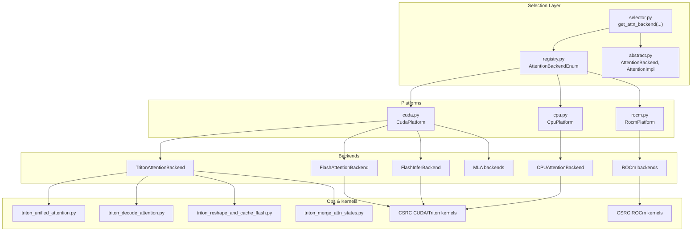
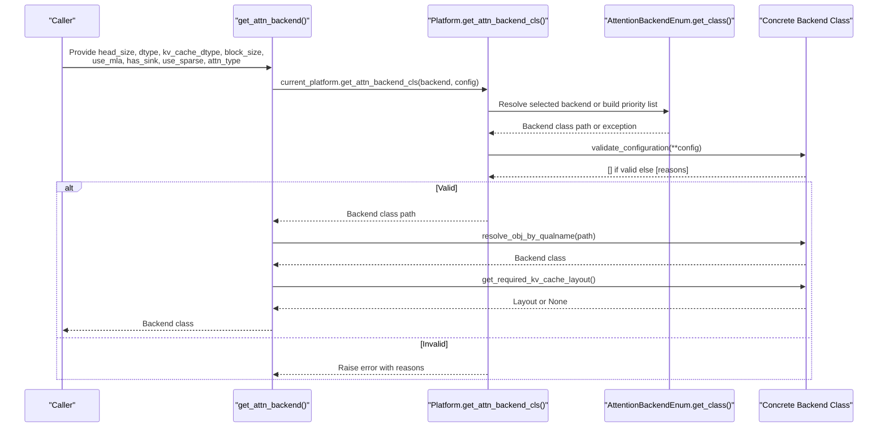
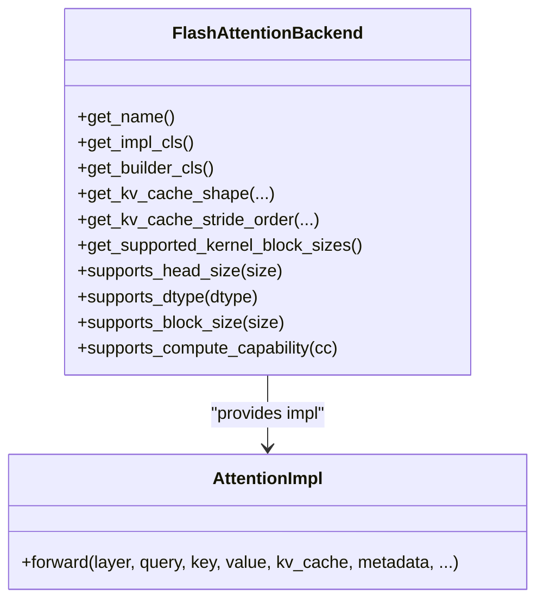
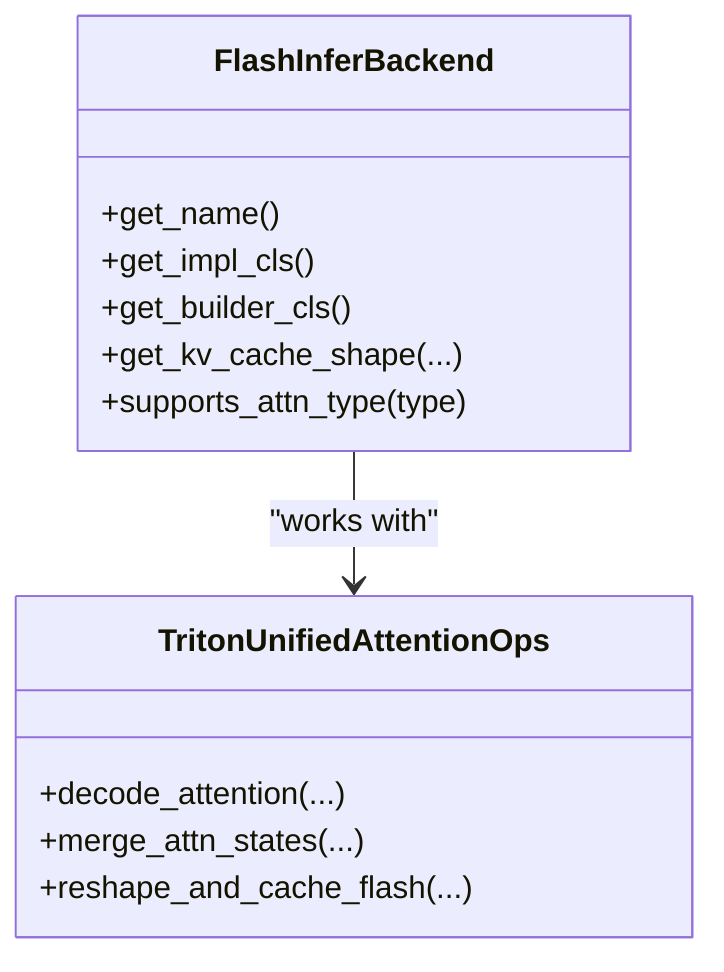
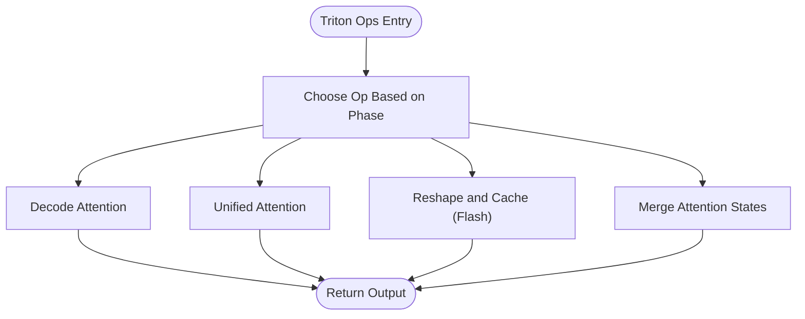
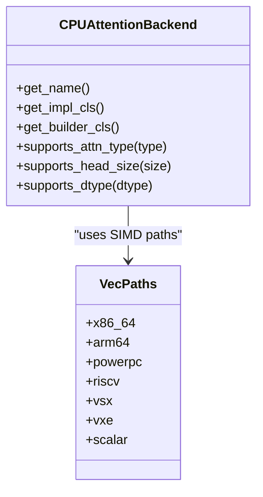
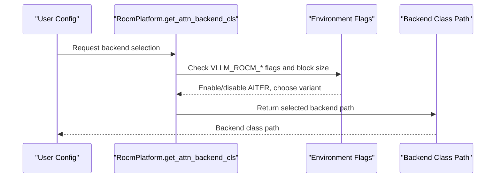
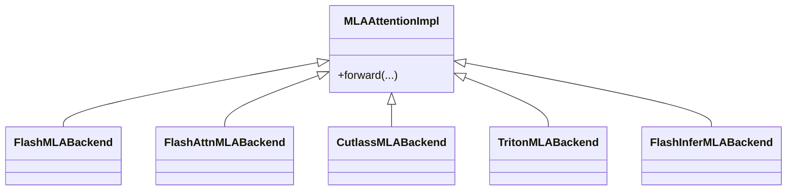
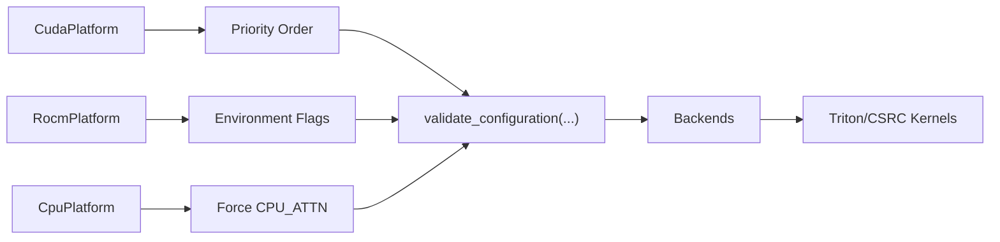

# Attention Backends

<cite>
**Referenced Files in This Document**
- [selector.py](file://vllm/attention/selector.py)
- [abstract.py](file://vllm/attention/backends/abstract.py)
- [registry.py](file://vllm/attention/backends/registry.py)
- [cuda.py](file://vllm/platforms/cuda.py)
- [rocm.py](file://vllm/platforms/rocm.py)
- [cpu.py](file://vllm/platforms/cpu.py)
- [triton_unified_attention.py](file://vllm/attention/ops/triton_unified_attention.py)
- [triton_decode_attention.py](file://vllm/attention/ops/triton_decode_attention.py)
- [triton_reshape_and_cache_flash.py](file://vllm/attention/ops/triton_reshape_and_cache_flash.py)
- [triton_merge_attn_states.py](file://vllm/attention/ops/triton_merge_attn_states.py)
- [flashmla.py](file://vllm/attention/ops/flashmla.py)
- [fa_utils.py](file://vllm/attention/utils/fa_utils.py)
- [vllm_flash_attn.cmake](file://cmake/external_projects/vllm_flash_attn.cmake)
- [triton_kernels.cmake](file://cmake/external_projects/triton_kernels.cmake)
- [flashinfer.cmake](file://cmake/external_projects/flashinfer.cmake)
- [flashinfer.py](file://vllm/attention/ops/flashinfer.py)
- [rocm_aiter_unified_attn.py](file://vllm/v1/attention/backends/rocm_aiter_unified_attn.py)
- [rocm_aiter_mla_sparse.py](file://vllm/attention/ops/rocm_aiter_mla_sparse.py)
- [cpu_attn.cpp](file://csrc/cpu/cpu_attn.cpp)
- [cpu_attn_impl.hpp](file://csrc/cpu/cpu_attn_impl.hpp)
- [cpu_attn_vec.hpp](file://csrc/cpu/cpu_attn_vec.hpp)
- [cpu_attn_neon.hpp](file://csrc/cpu/cpu_attn_neon.hpp)
- [cpu_attn_amx.hpp](file://csrc/cpu/cpu_attn_amx.hpp)
- [cpu_attn_vec16.hpp](file://csrc/cpu/cpu_attn_vec16.hpp)
- [cpu_attn_x86.hpp](file://csrc/cpu/cpu_types_x86.hpp)
- [cpu_attn_arm.hpp](file://csrc/cpu/cpu_types_arm.hpp)
- [cpu_attn_vsx.hpp](file://csrc/cpu/cpu_types_vsx.hpp)
- [cpu_attn_vxe.hpp](file://csrc/cpu/cpu_types_vxe.hpp)
- [cpu_attn_scalar.hpp](file://csrc/cpu/cpu_types_scalar.hpp)
- [attention_kernels.cuh](file://csrc/attention/attention_kernels.cuh)
- [attention_generic.cuh](file://csrc/attention/attention_generic.cuh)
- [attention_utils.cuh](file://csrc/attention/attention_utils.cuh)
- [attention_dtypes.h](file://csrc/attention/attention_dtypes.h)
- [dtype_float16.cuh](file://csrc/attention/dtype_float16.cuh)
- [dtype_float32.cuh](file://csrc/attention/dtype_float32.cuh)
- [dtype_bfloat16.cuh](file://csrc/attention/dtype_bfloat16.cuh)
- [dtype_fp8.cuh](file://csrc/attention/dtype_fp8.cuh)
- [paged_attention_v1.cu](file://csrc/attention/paged_attention_v1.cu)
- [paged_attention_v2.cu](file://csrc/attention/paged_attention_v2.cu)
- [attention.cu](file://csrc/rocm/attention.cu)
- [ops.h](file://csrc/rocm/ops.h)
- [skinny_gemms.cu](file://csrc/rocm/skinny_gemms.cu)
- [torch_bindings.cpp](file://csrc/rocm/torch_bindings.cpp)
</cite>

## Table of Contents
1. [Introduction](#introduction)
2. [Project Structure](#project-structure)
3. [Core Components](#core-components)
4. [Architecture Overview](#architecture-overview)
5. [Detailed Component Analysis](#detailed-component-analysis)
6. [Dependency Analysis](#dependency-analysis)
7. [Performance Considerations](#performance-considerations)
8. [Troubleshooting Guide](#troubleshooting-guide)
9. [Conclusion](#conclusion)
10. [Appendices](#appendices)

## Introduction
This document explains the attention backends in vLLM, covering all available implementations and how they are selected and configured. It focuses on:
- FlashAttention backend and its optimized kernels, memory bandwidth utilization, and hardware-specific optimizations
- FlashInfer backend and its batch processing capabilities integrated with the unified attention interface
- Triton-based attention implementations, including custom kernels, memory layout optimizations, and performance characteristics
- CPU attention backend for non-GPU deployments, including SIMD optimizations and multi-threading strategies
- ROCm-specific attention implementations for AMD GPU support
- Backend selection criteria, performance comparisons, configuration options, and troubleshooting guidance

## Project Structure
The attention subsystem is organized around a unified backend abstraction, a platform-aware selector, and per-platform backend implementations. Supporting ops and kernels live under attention ops and CSRC directories, with build integration via CMake.

**Diagram sources**
- [selector.py](file://vllm/attention/selector.py#L46-L118)
- [registry.py](file://vllm/attention/backends/registry.py#L44-L112)
- [abstract.py](file://vllm/attention/backends/abstract.py#L40-L120)
- [cuda.py](file://vllm/platforms/cuda.py#L290-L359)
- [rocm.py](file://vllm/platforms/rocm.py#L189-L299)
- [cpu.py](file://vllm/platforms/cpu.py#L127-L140)
- [triton_unified_attention.py](file://vllm/attention/ops/triton_unified_attention.py)
- [triton_decode_attention.py](file://vllm/attention/ops/triton_decode_attention.py)
- [triton_reshape_and_cache_flash.py](file://vllm/attention/ops/triton_reshape_and_cache_flash.py)
- [triton_merge_attn_states.py](file://vllm/attention/ops/triton_merge_attn_states.py)
- [attention_kernels.cuh](file://csrc/attention/attention_kernels.cuh)
- [attention_generic.cuh](file://csrc/attention/attention_generic.cuh)
- [attention_utils.cuh](file://csrc/attention/attention_utils.cuh)
- [attention_dtypes.h](file://csrc/attention/attention_dtypes.h)
- [dtype_float16.cuh](file://csrc/attention/dtype_float16.cuh)
- [dtype_float32.cuh](file://csrc/attention/dtype_float32.cuh)
- [dtype_bfloat16.cuh](file://csrc/attention/dtype_bfloat16.cuh)
- [dtype_fp8.cuh](file://csrc/attention/dtype_fp8.cuh)
- [paged_attention_v1.cu](file://csrc/attention/paged_attention_v1.cu)
- [paged_attention_v2.cu](file://csrc/attention/paged_attention_v2.cu)
- [attention.cu](file://csrc/rocm/attention.cu)
- [ops.h](file://csrc/rocm/ops.h)
- [skinny_gemms.cu](file://csrc/rocm/skinny_gemms.cu)
- [torch_bindings.cpp](file://csrc/rocm/torch_bindings.cpp)

**Section sources**
- [selector.py](file://vllm/attention/selector.py#L46-L118)
- [registry.py](file://vllm/attention/backends/registry.py#L44-L112)
- [abstract.py](file://vllm/attention/backends/abstract.py#L40-L120)
- [cuda.py](file://vllm/platforms/cuda.py#L290-L359)
- [rocm.py](file://vllm/platforms/rocm.py#L189-L299)
- [cpu.py](file://vllm/platforms/cpu.py#L127-L140)

## Core Components
- Unified backend interface: The abstract backend defines capabilities, supported dtypes, block sizes, and metadata builders. Concrete backends implement the interface and expose their builder and implementation classes.
- Backend registry: Enumerates built-in backends and allows runtime overrides. It resolves the fully qualified class path for a backend and supports custom registration.
- Platform selector: The platform classes (CUDA, ROCm, CPU) implement backend selection logic, priority ordering, and validation against device capability and configuration constraints.
- Selection entry point: The selector composes platform-provided priorities and validates configurations to pick the best backend.

Key responsibilities:
- Validation: Each backend class validates head sizes, dtypes, block sizes, MLA/sparse flags, attention type, and compute capability.
- Layout negotiation: Some backends require specific KV cache layouts; the selector adjusts layout accordingly.
- Priority and fallback: Platforms define backend preference order and fallback mechanisms.

**Section sources**
- [abstract.py](file://vllm/attention/backends/abstract.py#L40-L120)
- [registry.py](file://vllm/attention/backends/registry.py#L44-L112)
- [selector.py](file://vllm/attention/selector.py#L46-L118)
- [cuda.py](file://vllm/platforms/cuda.py#L44-L83)
- [rocm.py](file://vllm/platforms/rocm.py#L189-L299)
- [cpu.py](file://vllm/platforms/cpu.py#L127-L140)

## Architecture Overview
The backend selection pipeline:

**Diagram sources**
- [selector.py](file://vllm/attention/selector.py#L46-L118)
- [registry.py](file://vllm/attention/backends/registry.py#L101-L112)
- [cuda.py](file://vllm/platforms/cuda.py#L290-L359)
- [rocm.py](file://vllm/platforms/rocm.py#L189-L299)
- [cpu.py](file://vllm/platforms/cpu.py#L127-L140)

## Detailed Component Analysis

### FlashAttention Backend (CUDA)
- Purpose: High-throughput attention using optimized CUDA kernels. Supports multiple compute capabilities and integrates with FP8 KV cache where applicable.
- Optimizations:
  - Kernel variants tuned for different architectures (e.g., compute capability families).
  - Memory bandwidth optimization via tiled access patterns and shared memory reuse.
  - Hardware-specific tuning for modern NVIDIA GPUs (e.g., Hopper, Ada).
- Build integration: Exposed via CMake external project for FlashAttention kernels.
- Selection behavior:
  - CUDA platform defines backend priority order and validates dtypes/head sizes.
  - For MLA-enabled models on specific architectures, block size constraints are enforced.

**Diagram sources**
- [registry.py](file://vllm/attention/backends/registry.py#L44-L60)
- [abstract.py](file://vllm/attention/backends/abstract.py#L292-L395)
- [vllm_flash_attn.cmake](file://cmake/external_projects/vllm_flash_attn.cmake)

**Section sources**
- [registry.py](file://vllm/attention/backends/registry.py#L44-L60)
- [abstract.py](file://vllm/attention/backends/abstract.py#L40-L120)
- [cuda.py](file://vllm/platforms/cuda.py#L44-L83)
- [vllm_flash_attn.cmake](file://cmake/external_projects/vllm_flash_attn.cmake)

### FlashInfer Backend (CUDA)
- Purpose: Efficient attention computation with strong batch processing capabilities. Integrates with the unified attention interface for consistent behavior.
- Batch processing: Designed to maximize throughput across variable-length sequences and heterogeneous batches.
- Integration: Uses the unified attention interface to maintain compatibility with vLLM’s scheduling and KV cache management.
- Build integration: Exposed via CMake external project for FlashInfer.

**Diagram sources**
- [registry.py](file://vllm/attention/backends/registry.py#L58-L61)
- [triton_unified_attention.py](file://vllm/attention/ops/triton_unified_attention.py)
- [triton_merge_attn_states.py](file://vllm/attention/ops/triton_merge_attn_states.py)
- [triton_reshape_and_cache_flash.py](file://vllm/attention/ops/triton_reshape_and_cache_flash.py)
- [flashinfer.cmake](file://cmake/external_projects/flashinfer.cmake)

**Section sources**
- [registry.py](file://vllm/attention/backends/registry.py#L58-L61)
- [triton_unified_attention.py](file://vllm/attention/ops/triton_unified_attention.py)
- [triton_merge_attn_states.py](file://vllm/attention/ops/triton_merge_attn_states.py)
- [triton_reshape_and_cache_flash.py](file://vllm/attention/ops/triton_reshape_and_cache_flash.py)
- [flashinfer.cmake](file://cmake/external_projects/flashinfer.cmake)

### Triton-Based Attention Implementations
- Decode attention: Triton kernel for efficient decode-phase attention.
- Unified attention: Shared implementation across prefill/decode with consistent memory layouts.
- Reshape and cache (Flash): Optimized path for Flash-style reshape and KV cache updates.
- Merge attention states: Utility for combining attention outputs efficiently.

**Diagram sources**
- [triton_decode_attention.py](file://vllm/attention/ops/triton_decode_attention.py)
- [triton_unified_attention.py](file://vllm/attention/ops/triton_unified_attention.py)
- [triton_reshape_and_cache_flash.py](file://vllm/attention/ops/triton_reshape_and_cache_flash.py)
- [triton_merge_attn_states.py](file://vllm/attention/ops/triton_merge_attn_states.py)

**Section sources**
- [triton_decode_attention.py](file://vllm/attention/ops/triton_decode_attention.py)
- [triton_unified_attention.py](file://vllm/attention/ops/triton_unified_attention.py)
- [triton_reshape_and_cache_flash.py](file://vllm/attention/ops/triton_reshape_and_cache_flash.py)
- [triton_merge_attn_states.py](file://vllm/attention/ops/triton_merge_attn_states.py)
- [triton_kernels.cmake](file://cmake/external_projects/triton_kernels.cmake)

### CPU Attention Backend
- Purpose: Non-GPU inference with attention computation on CPU.
- SIMD optimizations: Vectorization paths for multiple architectures (x86, ARM, POWERPC, RISCV, VSX, VXE, scalar).
- Multi-threading: Tunable OpenMP and thread binding strategies; environment controls for optimal performance.
- Constraints: MLA and sparse attention are not supported on CPU; KV cache quantization is not supported; block size preferences apply.

**Diagram sources**
- [cpu.py](file://vllm/platforms/cpu.py#L127-L140)
- [cpu_attn.cpp](file://csrc/cpu/cpu_attn.cpp)
- [cpu_attn_impl.hpp](file://csrc/cpu/cpu_attn_impl.hpp)
- [cpu_attn_vec.hpp](file://csrc/cpu/cpu_attn_vec.hpp)
- [cpu_attn_neon.hpp](file://csrc/cpu/cpu_attn_neon.hpp)
- [cpu_attn_amx.hpp](file://csrc/cpu/cpu_attn_amx.hpp)
- [cpu_attn_vec16.hpp](file://csrc/cpu/cpu_attn_vec16.hpp)
- [cpu_attn_x86.hpp](file://csrc/cpu/cpu_types_x86.hpp)
- [cpu_attn_arm.hpp](file://csrc/cpu/cpu_types_arm.hpp)
- [cpu_attn_vsx.hpp](file://csrc/cpu/cpu_types_vsx.hpp)
- [cpu_attn_vxe.hpp](file://csrc/cpu/cpu_types_vxe.hpp)
- [cpu_attn_scalar.hpp](file://csrc/cpu/cpu_types_scalar.hpp)

**Section sources**
- [cpu.py](file://vllm/platforms/cpu.py#L127-L140)
- [cpu_attn.cpp](file://csrc/cpu/cpu_attn.cpp)
- [cpu_attn_impl.hpp](file://csrc/cpu/cpu_attn_impl.hpp)
- [cpu_attn_vec.hpp](file://csrc/cpu/cpu_attn_vec.hpp)
- [cpu_attn_neon.hpp](file://csrc/cpu/cpu_attn_neon.hpp)
- [cpu_attn_amx.hpp](file://csrc/cpu/cpu_attn_amx.hpp)
- [cpu_attn_vec16.hpp](file://csrc/cpu/cpu_attn_vec16.hpp)
- [cpu_attn_x86.hpp](file://csrc/cpu/cpu_types_x86.hpp)
- [cpu_attn_arm.hpp](file://csrc/cpu/cpu_types_arm.hpp)
- [cpu_attn_vsx.hpp](file://csrc/cpu/cpu_types_vsx.hpp)
- [cpu_attn_vxe.hpp](file://csrc/cpu/cpu_types_vxe.hpp)
- [cpu_attn_scalar.hpp](file://csrc/cpu/cpu_types_scalar.hpp)

### ROCm-Specific Attention Implementations
- AITER backends: Unified attention and Flash Attention variants tailored for AMD GPUs, with environment-driven selection logic.
- Sparse MLA: Specialized sparse MLA backend for ROCm with constraints on block size and KV cache dtype.
- Custom paged attention: Conditional support based on architecture, dtype, head size, block size, and other parameters.
- ROCm kernels: Dedicated CUDA-like kernels compiled for AMD targets.

**Diagram sources**
- [rocm.py](file://vllm/platforms/rocm.py#L189-L299)
- [rocm_aiter_mla_sparse.py](file://vllm/attention/ops/rocm_aiter_mla_sparse.py)
- [rocm_aiter_unified_attn.py](file://vllm/v1/attention/backends/rocm_aiter_unified_attn.py)
- [attention.cu](file://csrc/rocm/attention.cu)
- [ops.h](file://csrc/rocm/ops.h)
- [skinny_gemms.cu](file://csrc/rocm/skinny_gemms.cu)
- [torch_bindings.cpp](file://csrc/rocm/torch_bindings.cpp)

**Section sources**
- [rocm.py](file://vllm/platforms/rocm.py#L189-L299)
- [rocm_aiter_mla_sparse.py](file://vllm/attention/ops/rocm_aiter_mla_sparse.py)
- [rocm_aiter_unified_attn.py](file://vllm/v1/attention/backends/rocm_aiter_unified_attn.py)
- [attention.cu](file://csrc/rocm/attention.cu)
- [ops.h](file://csrc/rocm/ops.h)
- [skinny_gemms.cu](file://csrc/rocm/skinny_gemms.cu)
- [torch_bindings.cpp](file://csrc/rocm/torch_bindings.cpp)

### MLA (Multi-Head Latent Attention) Backends
- FlashMLA: Dense and sparse variants optimized for specific block sizes and architectures.
- FlashAttnMLA: MLA variant leveraging FlashAttention kernels.
- CutlassMLA: CUTLASS-based MLA for supported architectures.
- TritonMLA: Triton-based MLA implementation.
- FlashInferMLA: MLA variant integrated with FlashInfer.

**Diagram sources**
- [abstract.py](file://vllm/attention/backends/abstract.py#L400-L444)
- [registry.py](file://vllm/attention/backends/registry.py#L59-L67)
- [flashmla.py](file://vllm/attention/ops/flashmla.py)
- [fa_utils.py](file://vllm/attention/utils/fa_utils.py)

**Section sources**
- [abstract.py](file://vllm/attention/backends/abstract.py#L400-L444)
- [registry.py](file://vllm/attention/backends/registry.py#L59-L67)
- [flashmla.py](file://vllm/attention/ops/flashmla.py)
- [fa_utils.py](file://vllm/attention/utils/fa_utils.py)

## Dependency Analysis
- Platform-to-backend mapping: Each platform enumerates supported backends and defines priority order. The CUDA platform prioritizes FlashAttention, FlashInfer, Triton, and FlexAttention depending on compute capability and MLA usage. The ROCm platform selects AITER variants or Triton based on environment flags and architecture. The CPU platform forces CPUAttention.
- Validation chain: Backends validate dtype/head size/block size/MLA/sparse flags and compute capability. Invalid reasons are aggregated and logged.
- Build-time dependencies: FlashAttention, FlashInfer, and Triton kernels are integrated via CMake external projects.

**Diagram sources**
- [cuda.py](file://vllm/platforms/cuda.py#L44-L83)
- [rocm.py](file://vllm/platforms/rocm.py#L189-L299)
- [cpu.py](file://vllm/platforms/cpu.py#L127-L140)
- [abstract.py](file://vllm/attention/backends/abstract.py#L205-L259)
- [vllm_flash_attn.cmake](file://cmake/external_projects/vllm_flash_attn.cmake)
- [flashinfer.cmake](file://cmake/external_projects/flashinfer.cmake)
- [triton_kernels.cmake](file://cmake/external_projects/triton_kernels.cmake)

**Section sources**
- [cuda.py](file://vllm/platforms/cuda.py#L44-L83)
- [rocm.py](file://vllm/platforms/rocm.py#L189-L299)
- [cpu.py](file://vllm/platforms/cpu.py#L127-L140)
- [abstract.py](file://vllm/attention/backends/abstract.py#L205-L259)

## Performance Considerations
- FlashAttention:
  - Prefer block sizes aligned with kernel requirements for optimal occupancy and memory throughput.
  - On newer architectures, FP8 KV cache can reduce memory bandwidth pressure; ensure dtype/head size compatibility.
- FlashInfer:
  - Strong batch throughput; tune block size to match workload distribution.
  - Unified attention interface reduces overhead across prefill/decode.
- Triton:
  - Memory layout optimizations and coalesced access patterns improve bandwidth utilization.
  - Decode attention and unified attention share common infrastructure for reduced duplication.
- CPU:
  - Use appropriate SIMD paths for the target architecture; bind threads to cores for NUMA locality.
  - Avoid FP8 KV cache on CPU; prefer block sizes divisible by 32 for optimal performance.
- ROCm:
  - AITER backends offer performance gains on supported architectures; ensure environment flags align with model and hardware.
  - Custom paged attention has strict constraints; verify parameters before enabling.

[No sources needed since this section provides general guidance]

## Troubleshooting Guide
Common issues and resolutions:
- Selected backend invalid for configuration:
  - The platform logs invalid reasons and raises an error. Review dtype/head size/block size/MLA/sparse flags and compute capability.
- Unsupported attention type or feature:
  - Some backends restrict attention types or features (e.g., MLA/sparse on CPU). Switch to a compatible backend or disable the feature.
- Block size mismatch:
  - Certain backends require specific block sizes (e.g., FlashMLA/CutlassMLA). The platform may force block size; adjust cache configuration accordingly.
- ROCm environment constraints:
  - Sparse MLA backend on ROCm requires specific KV cache dtype and block size. Adjust flags or select a different backend.
- CPU limitations:
  - MLA and sparse attention are not supported on CPU. Disable these features or switch to GPU backends.
- Logging and warnings:
  - The selector and platform modules log detailed reasons for backend selection and configuration adjustments.

**Section sources**
- [selector.py](file://vllm/attention/selector.py#L89-L118)
- [abstract.py](file://vllm/attention/backends/abstract.py#L205-L259)
- [cuda.py](file://vllm/platforms/cuda.py#L170-L235)
- [rocm.py](file://vllm/platforms/rocm.py#L199-L236)
- [cpu.py](file://vllm/platforms/cpu.py#L132-L140)

## Conclusion
vLLM’s attention backends provide a flexible, platform-aware selection mechanism that balances performance, compatibility, and ease of use. CUDA backends leverage highly optimized kernels and FP8 support, while FlashInfer offers strong batch throughput. Triton-based implementations deliver portable, efficient attention with unified interfaces. CPU backends utilize SIMD and threading strategies for non-GPU deployments. ROCm backends integrate AITER and specialized kernels for AMD GPUs. Proper configuration and backend selection ensure peak performance across diverse hardware and model types.

[No sources needed since this section summarizes without analyzing specific files]

## Appendices

### Backend Selection Criteria and Configuration Options
- Selection criteria:
  - Head size, dtype, KV cache dtype, block size, MLA flag, sink support, sparse attention, attention type, compute capability.
- Configuration options:
  - Attention backend selection via platform APIs.
  - Environment flags for ROCm (e.g., AITER enablement).
  - CPU-specific environment variables for threading and memory allocation.

**Section sources**
- [abstract.py](file://vllm/attention/backends/abstract.py#L115-L189)
- [rocm.py](file://vllm/platforms/rocm.py#L263-L299)
- [cpu.py](file://vllm/platforms/cpu.py#L272-L342)