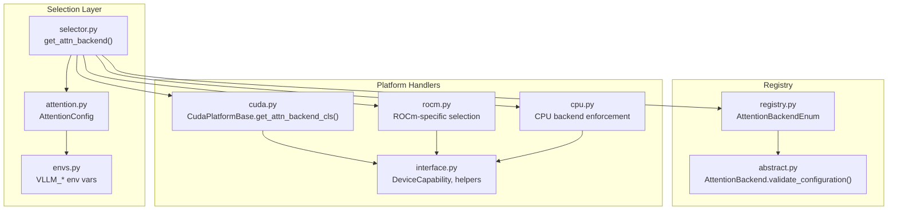
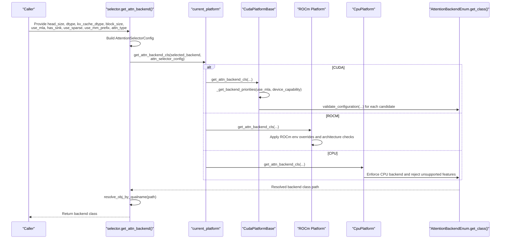
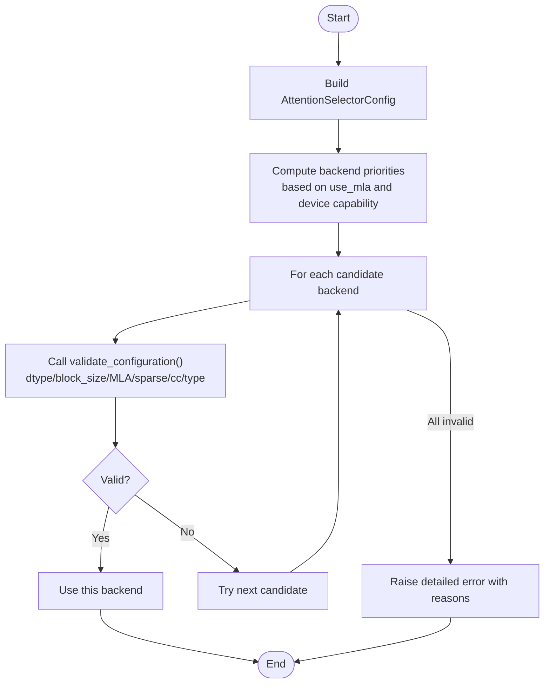
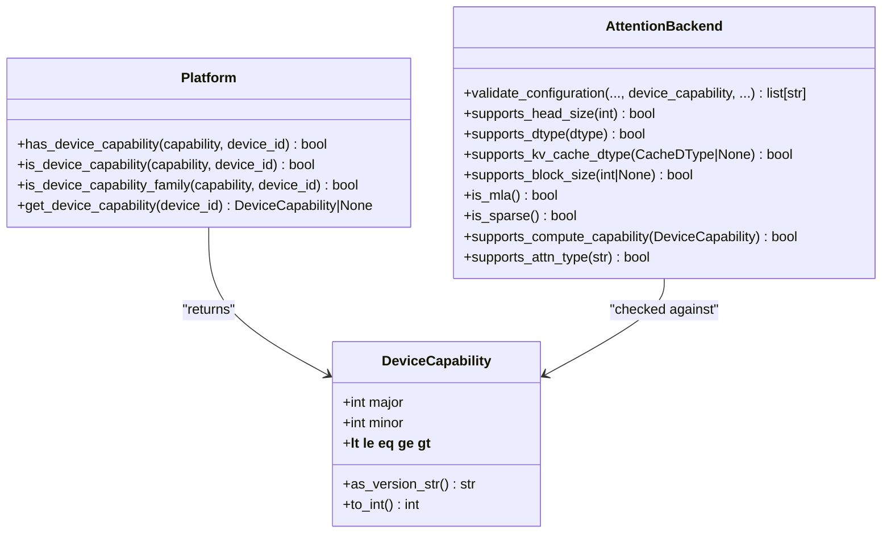
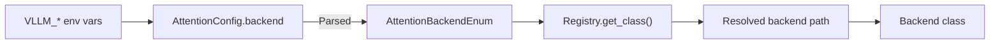
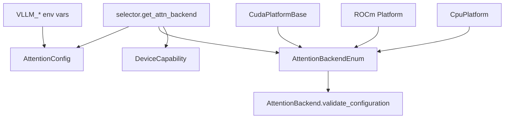

# Backend Selection and Configuration

<cite>
**Referenced Files in This Document**
- [selector.py](file://vllm/attention/selector.py)
- [registry.py](file://vllm/attention/backends/registry.py)
- [abstract.py](file://vllm/attention/backends/abstract.py)
- [attention.py](file://vllm/config/attention.py)
- [envs.py](file://vllm/envs.py)
- [cuda.py](file://vllm/platforms/cuda.py)
- [rocm.py](file://vllm/platforms/rocm.py)
- [cpu.py](file://vllm/platforms/cpu.py)
- [interface.py](file://vllm/platforms/interface.py)
</cite>

## Table of Contents
1. [Introduction](#introduction)
2. [Project Structure](#project-structure)
3. [Core Components](#core-components)
4. [Architecture Overview](#architecture-overview)
5. [Detailed Component Analysis](#detailed-component-analysis)
6. [Dependency Analysis](#dependency-analysis)
7. [Performance Considerations](#performance-considerations)
8. [Troubleshooting Guide](#troubleshooting-guide)
9. [Conclusion](#conclusion)
10. [Appendices](#appendices)

## Introduction
This document explains how vLLM selects attention backends, validates configurations, and manages runtime behavior across platforms. It covers:
- Automatic backend selection algorithm and priority ordering
- Hardware capability detection and compatibility checks
- Manual selection via configuration and environment variables
- Validation and fallback mechanisms
- Performance benchmarking guidance and hardware-specific recommendations
- Troubleshooting backend selection issues
- Best practices for different deployment scenarios

## Project Structure
The attention backend selection pipeline spans several modules:
- Selector: orchestrates backend selection and caches results
- Registry: enumerates and resolves backend implementations
- Backends abstract: defines validation and compatibility interfaces
- Platform-specific handlers: implement selection logic per device family
- Configuration: exposes AttentionConfig and environment variable mapping
- Environment variables: define runtime toggles and platform-specific flags

**Diagram sources**
- [selector.py](file://vllm/attention/selector.py#L46-L119)
- [registry.py](file://vllm/attention/backends/registry.py#L34-L124)
- [abstract.py](file://vllm/attention/backends/abstract.py#L204-L259)
- [attention.py](file://vllm/config/attention.py#L16-L115)
- [envs.py](file://vllm/envs.py#L49-L120)
- [cuda.py](file://vllm/platforms/cuda.py#L44-L83)
- [rocm.py](file://vllm/platforms/rocm.py#L237-L279)
- [cpu.py](file://vllm/platforms/cpu.py#L122-L141)
- [interface.py](file://vllm/platforms/interface.py#L58-L99)

**Section sources**
- [selector.py](file://vllm/attention/selector.py#L46-L119)
- [registry.py](file://vllm/attention/backends/registry.py#L34-L124)
- [abstract.py](file://vllm/attention/backends/abstract.py#L204-L259)
- [attention.py](file://vllm/config/attention.py#L16-L115)
- [envs.py](file://vllm/envs.py#L49-L120)
- [cuda.py](file://vllm/platforms/cuda.py#L44-L83)
- [rocm.py](file://vllm/platforms/rocm.py#L237-L279)
- [cpu.py](file://vllm/platforms/cpu.py#L122-L141)
- [interface.py](file://vllm/platforms/interface.py#L58-L99)

## Core Components
- AttentionSelectorConfig: encapsulates selection criteria (head size, dtype, kv cache dtype, block size, MLA flag, sink tokens, sparsity, multimodal prefix, attention type).
- AttentionBackend.validate_configuration: central compatibility checker across dtype, block size, MLA/sparse flags, compute capability, and attention type.
- AttentionBackendEnum: registry of backends with runtime override capability.
- Platform-specific get_attn_backend_cls: applies platform-specific priorities and environment-driven overrides.
- AttentionConfig: configuration container with environment variable mapping for attention-related toggles.

**Section sources**
- [selector.py](file://vllm/attention/selector.py#L21-L44)
- [abstract.py](file://vllm/attention/backends/abstract.py#L204-L259)
- [registry.py](file://vllm/attention/backends/registry.py#L34-L124)
- [attention.py](file://vllm/config/attention.py#L16-L115)

## Architecture Overview
Automatic backend selection proceeds in stages:
1. Build AttentionSelectorConfig from runtime arguments and VllmConfig.
2. Resolve platform-specific backend selection method.
3. Compute backend priorities based on flags (e.g., MLA) and device capability.
4. Validate each candidate against backend-specific constraints.
5. Choose the first valid backend or raise a detailed error if none are valid.
6. Optionally adjust KV cache layout based on backend requirements.

**Diagram sources**
- [selector.py](file://vllm/attention/selector.py#L46-L119)
- [cuda.py](file://vllm/platforms/cuda.py#L44-L83)
- [cuda.py](file://vllm/platforms/cuda.py#L259-L341)
- [rocm.py](file://vllm/platforms/rocm.py#L237-L279)
- [cpu.py](file://vllm/platforms/cpu.py#L122-L141)
- [registry.py](file://vllm/attention/backends/registry.py#L90-L112)

## Detailed Component Analysis

### Automatic Backend Selection Algorithm
- Priority generation:
  - CUDA: prioritizes backends differently for MLA vs non-MLA and for compute capability families (e.g., Blackwell).
  - ROCm: applies environment-driven overrides and architecture checks (e.g., gfx9-only backends).
  - CPU: enforces CPU backend and rejects unsupported features (MLA, sparse).
- Validation loop:
  - For each candidate, call backend.validate_configuration with the AttentionSelectorConfig and device capability.
  - Collect invalid reasons and prune incompatible backends.
  - Select the first valid backend; otherwise raise a detailed error listing reasons.

**Diagram sources**
- [cuda.py](file://vllm/platforms/cuda.py#L44-L83)
- [cuda.py](file://vllm/platforms/cuda.py#L259-L341)
- [abstract.py](file://vllm/attention/backends/abstract.py#L204-L259)

**Section sources**
- [cuda.py](file://vllm/platforms/cuda.py#L44-L83)
- [cuda.py](file://vllm/platforms/cuda.py#L259-L341)
- [abstract.py](file://vllm/attention/backends/abstract.py#L204-L259)

### Hardware Capability Detection and Compatibility Checks
- DeviceCapability: typed representation of compute capability (major, minor) with comparison helpers.
- Platform helpers:
  - has_device_capability/is_device_capability/is_device_capability_family for capability checks.
- Backend compatibility:
  - validate_configuration aggregates failures for head size, dtype, kv cache dtype, block size, MLA/sparse flags, compute capability, attention type, and custom combination checks.

**Diagram sources**
- [interface.py](file://vllm/platforms/interface.py#L58-L99)
- [interface.py](file://vllm/platforms/interface.py#L279-L359)
- [abstract.py](file://vllm/attention/backends/abstract.py#L187-L259)

**Section sources**
- [interface.py](file://vllm/platforms/interface.py#L58-L99)
- [interface.py](file://vllm/platforms/interface.py#L279-L359)
- [abstract.py](file://vllm/attention/backends/abstract.py#L187-L259)

### Manual Backend Selection, Environment Variables, and Runtime Switching
- Manual selection:
  - AttentionConfig.backend allows specifying a backend by enum or string.
- Environment variables:
  - AttentionConfig maps multiple VLLM_* environment variables to fields (e.g., VLLM_ATTENTION_BACKEND, VLLM_FLASH_ATTN_VERSION).
  - Platform-specific toggles (e.g., VLLM_V1_USE_PREFILL_DECODE_ATTENTION, VLLM_ROCM_USE_AITER_*).
- Runtime switching:
  - AttentionBackendEnum supports registration of custom backends; overrides are resolved at runtime via get_path/get_class.
  - Environment caching is supported post-initialization to avoid repeated reads.

**Diagram sources**
- [attention.py](file://vllm/config/attention.py#L16-L115)
- [envs.py](file://vllm/envs.py#L49-L120)
- [registry.py](file://vllm/attention/backends/registry.py#L90-L112)

**Section sources**
- [attention.py](file://vllm/config/attention.py#L16-L115)
- [envs.py](file://vllm/envs.py#L49-L120)
- [registry.py](file://vllm/attention/backends/registry.py#L90-L112)

### Platform-Specific Selection Details
- CUDA:
  - Prioritizes backends by compute capability family and MLA flag.
  - Validates candidates via backend.validate_configuration.
- ROCm:
  - Applies environment-driven overrides (e.g., Aiter unified attention, Aiter MHA, prefill-decode attention).
  - Enforces architecture-specific constraints (e.g., certain backends only on gfx9).
- CPU:
  - Enforces CPU backend and rejects unsupported features (MLA, sparse).
  - Provides CPU-specific defaults and warnings for block sizes.

**Section sources**
- [cuda.py](file://vllm/platforms/cuda.py#L44-L83)
- [cuda.py](file://vllm/platforms/cuda.py#L259-L341)
- [rocm.py](file://vllm/platforms/rocm.py#L237-L279)
- [cpu.py](file://vllm/platforms/cpu.py#L122-L141)

### Backend Validation and Fallback Mechanisms
- Validation collects reasons for rejection (dtype, block size, MLA/sparse, compute capability, attention type, combination-specific constraints).
- If a selected backend fails validation, an error is raised immediately.
- If no backends are valid, a detailed error lists all invalid reasons.

**Section sources**
- [abstract.py](file://vllm/attention/backends/abstract.py#L204-L259)
- [cuda.py](file://vllm/platforms/cuda.py#L259-L341)

## Dependency Analysis
The selection pipeline depends on:
- Selector depends on AttentionConfig and AttentionSelectorConfig.
- Platform handlers depend on AttentionBackendEnum and DeviceCapability.
- Backend registry resolves backend classes and supports overrides.
- Environment variables feed AttentionConfig and influence platform selection.

**Diagram sources**
- [selector.py](file://vllm/attention/selector.py#L46-L119)
- [registry.py](file://vllm/attention/backends/registry.py#L34-L124)
- [abstract.py](file://vllm/attention/backends/abstract.py#L204-L259)
- [interface.py](file://vllm/platforms/interface.py#L58-L99)
- [attention.py](file://vllm/config/attention.py#L16-L115)
- [envs.py](file://vllm/envs.py#L49-L120)

**Section sources**
- [selector.py](file://vllm/attention/selector.py#L46-L119)
- [registry.py](file://vllm/attention/backends/registry.py#L34-L124)
- [abstract.py](file://vllm/attention/backends/abstract.py#L204-L259)
- [interface.py](file://vllm/platforms/interface.py#L58-L99)
- [attention.py](file://vllm/config/attention.py#L16-L115)
- [envs.py](file://vllm/envs.py#L49-L120)

## Performance Considerations
- Benchmarking during initialization:
  - The codebase does not implement automatic performance benchmarking at selection time. Selection relies on capability checks and priority ordering.
- Guidance for performance tuning:
  - Prefer backends aligned with compute capability and feature flags (MLA, sparse).
  - Ensure block_size satisfies backend requirements (some backends require multiples).
  - On CUDA, MLA backends may be preferred on newer architectures; on ROCm, Aiter variants may offer benefits depending on architecture.
  - Use environment variables to enable platform-specific optimizations where applicable.

[No sources needed since this section provides general guidance]

## Troubleshooting Guide
Common issues and resolutions:
- Selected backend invalid:
  - Symptom: error indicating selected backend is not valid for the configuration.
  - Action: review dtype, kv cache dtype, block size, MLA/sparse flags, compute capability, and attention type; adjust accordingly.
- No valid backend found:
  - Symptom: error listing reasons for all backends being invalid.
  - Action: relax constraints (e.g., disable MLA or sparse), change dtype, or select a compatible backend manually.
- ROCm-specific errors:
  - Symptom: selecting an Aiter backend on unsupported architecture (e.g., non-gfx9).
  - Action: unset or adjust ROCm environment toggles to choose a supported backend.
- CPU backend limitations:
  - Symptom: MLA or sparse features not supported on CPU.
  - Action: disable MLA/sparse or switch to a GPU platform.

**Section sources**
- [cuda.py](file://vllm/platforms/cuda.py#L259-L341)
- [abstract.py](file://vllm/attention/backends/abstract.py#L204-L259)
- [rocm.py](file://vllm/platforms/rocm.py#L237-L279)
- [cpu.py](file://vllm/platforms/cpu.py#L122-L141)

## Conclusion
vLLM’s attention backend selection combines platform-aware priorities, robust compatibility validation, and environment-driven overrides. While no automatic benchmarking is performed at selection time, the system provides clear diagnostics and flexible configuration options to achieve optimal performance across diverse hardware and deployment scenarios.

[No sources needed since this section summarizes without analyzing specific files]

## Appendices

### Configuration Options and Environment Variables
- AttentionConfig fields and environment mapping:
  - backend → VLLM_ATTENTION_BACKEND
  - flash_attn_version → VLLM_FLASH_ATTN_VERSION
  - use_prefill_decode_attention → VLLM_V1_USE_PREFILL_DECODE_ATTENTION
  - flash_attn_max_num_splits_for_cuda_graph → VLLM_FLASH_ATTN_MAX_NUM_SPLITS_FOR_CUDA_GRAPH
  - use_cudnn_prefill → VLLM_USE_CUDNN_PREFILL
  - use_trtllm_ragged_deepseek_prefill → VLLM_USE_TRTLLM_RAGGED_DEEPSEEK_PREFILL
  - use_trtllm_attention → VLLM_USE_TRTLLM_ATTENTION
  - disable_flashinfer_prefill → VLLM_DISABLE_FLASHINFER_PREFILL
  - disable_flashinfer_q_quantization → VLLM_FLASHINFER_DISABLE_Q_QUANTIZATION

- Platform-specific ROCm environment toggles:
  - VLLM_ROCM_USE_AITER, VLLM_ROCM_USE_AITER_PAGED_ATTN, VLLM_ROCM_USE_AITER_LINEAR, VLLM_ROCM_USE_AITER_MOE, VLLM_ROCM_USE_AITER_RMSNORM, VLLM_ROCM_USE_AITER_MLA, VLLM_ROCM_USE_AITER_MHA, VLLM_ROCM_USE_AITER_FP4_ASM_GEMM, VLLM_ROCM_USE_AITER_TRITON_ROPE, VLLM_ROCM_USE_AITER_FP8BMM, VLLM_ROCM_USE_AITER_UNIFIED_ATTENTION, VLLM_ROCM_USE_AITER_FUSION_SHARED_EXPERTS, VLLM_ROCM_USE_AITER_TRITON_GEMM, VLLM_ROCM_USE_SKINNY_GEMM, VLLM_ROCM_FP8_PADDING, VLLM_ROCM_MOE_PADDING, VLLM_ROCM_CUSTOM_PAGED_ATTN

**Section sources**
- [attention.py](file://vllm/config/attention.py#L16-L115)
- [envs.py](file://vllm/envs.py#L49-L120)
- [envs.py](file://vllm/envs.py#L113-L130)

### Hardware-Specific Recommendations
- CUDA:
  - On modern architectures, prefer MLA backends when appropriate; otherwise Flash-Attn, FlashInfer, Triton, or FlexAttention are commonly effective.
- ROCm:
  - On gfx9, Aiter variants may be beneficial; otherwise fall back to ROCm attention or unified attention as configured by environment variables.
- CPU:
  - Use CPU backend; avoid MLA and sparse features; prefer block sizes that are multiples of 32 for optimal performance.

**Section sources**
- [cuda.py](file://vllm/platforms/cuda.py#L44-L83)
- [rocm.py](file://vllm/platforms/rocm.py#L237-L279)
- [cpu.py](file://vllm/platforms/cpu.py#L186-L200)