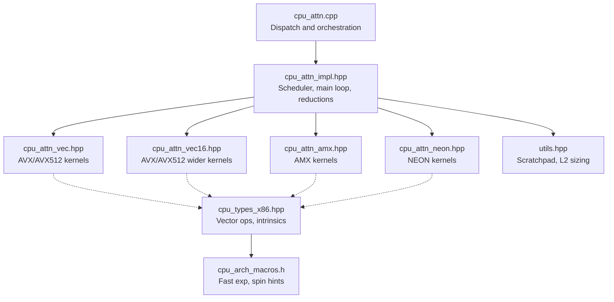
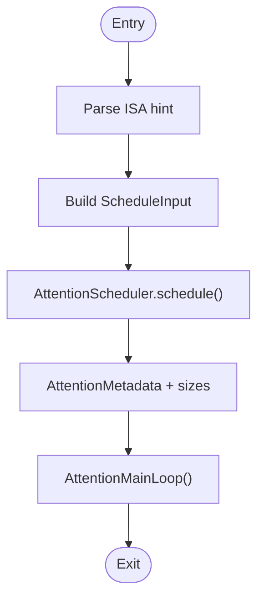
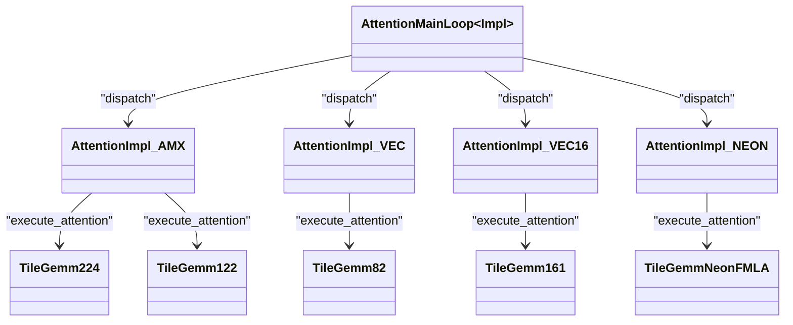

# CPU Attention Backend

<cite>
**Referenced Files in This Document**
- [cpu_attn.cpp](file://csrc/cpu/cpu_attn.cpp)
- [cpu_attn_impl.hpp](file://csrc/cpu/cpu_attn_impl.hpp)
- [cpu_attn_amx.hpp](file://csrc/cpu/cpu_attn_amx.hpp)
- [cpu_attn_vec.hpp](file://csrc/cpu/cpu_attn_vec.hpp)
- [cpu_attn_vec16.hpp](file://csrc/cpu/cpu_attn_vec16.hpp)
- [cpu_attn_neon.hpp](file://csrc/cpu/cpu_attn_neon.hpp)
- [cpu_arch_macros.h](file://csrc/cpu/cpu_arch_macros.h)
- [cpu_types_x86.hpp](file://csrc/cpu/cpu_types_x86.hpp)
- [utils.hpp](file://csrc/cpu/utils.hpp)
</cite>

## Table of Contents
1. [Introduction](#introduction)
2. [Project Structure](#project-structure)
3. [Core Components](#core-components)
4. [Architecture Overview](#architecture-overview)
5. [Detailed Component Analysis](#detailed-component-analysis)
6. [Dependency Analysis](#dependency-analysis)
7. [Performance Considerations](#performance-considerations)
8. [Troubleshooting Guide](#troubleshooting-guide)
9. [Conclusion](#conclusion)

## Introduction
This document explains the CPU attention backend in vLLM, focusing on CPU-side attention computation, SIMD/vectorization strategies, and multi-threading orchestration. It covers:
- Dispatch and scheduling for different instruction sets (AMX, AVX/AVX512, NEON).
- Attention kernel execution pipeline: QK matmul, masking, softmax, PV matmul, and reductions.
- Memory layouts and access patterns optimized for cache locality.
- Fallback mechanisms when GPU acceleration is unavailable.
- Configuration options for thread counts, memory allocation, and performance tuning.
- Troubleshooting guidance for CPU-specific performance issues.

## Project Structure
The CPU attention backend is implemented under the CPU source tree with modular dispatch and ISA-specific kernels:
- Dispatch and orchestration: cpu_attn.cpp
- Attention scheduler, main loop, and reduction logic: cpu_attn_impl.hpp
- ISA-specific implementations:
  - AMX: cpu_attn_amx.hpp
  - AVX/AVX512 vectorization: cpu_attn_vec.hpp and cpu_attn_vec16.hpp
  - NEON (ARM): cpu_attn_neon.hpp
- Vectorization primitives and intrinsics: cpu_types_x86.hpp and cpu_arch_macros.h
- Utilities and scratchpad memory management: utils.hpp



**Diagram sources**
- [cpu_attn.cpp](file://csrc/cpu/cpu_attn.cpp#L1-L266)
- [cpu_attn_impl.hpp](file://csrc/cpu/cpu_attn_impl.hpp#L1-L200)
- [cpu_attn_amx.hpp](file://csrc/cpu/cpu_attn_amx.hpp#L1-L120)
- [cpu_attn_vec.hpp](file://csrc/cpu/cpu_attn_vec.hpp#L1-L120)
- [cpu_attn_vec16.hpp](file://csrc/cpu/cpu_attn_vec16.hpp#L1-L120)
- [cpu_attn_neon.hpp](file://csrc/cpu/cpu_attn_neon.hpp#L1-L120)
- [cpu_types_x86.hpp](file://csrc/cpu/cpu_types_x86.hpp#L1-L120)
- [cpu_arch_macros.h](file://csrc/cpu/cpu_arch_macros.h#L1-L114)
- [utils.hpp](file://csrc/cpu/utils.hpp#L1-L119)

**Section sources**
- [cpu_attn.cpp](file://csrc/cpu/cpu_attn.cpp#L1-L138)
- [cpu_attn_impl.hpp](file://csrc/cpu/cpu_attn_impl.hpp#L1-L200)
- [cpu_attn_amx.hpp](file://csrc/cpu/cpu_attn_amx.hpp#L1-L120)
- [cpu_attn_vec.hpp](file://csrc/cpu/cpu_attn_vec.hpp#L1-L120)
- [cpu_attn_vec16.hpp](file://csrc/cpu/cpu_attn_vec16.hpp#L1-L120)
- [cpu_attn_neon.hpp](file://csrc/cpu/cpu_attn_neon.hpp#L1-L120)
- [cpu_types_x86.hpp](file://csrc/cpu/cpu_types_x86.hpp#L1-L120)
- [cpu_arch_macros.h](file://csrc/cpu/cpu_arch_macros.h#L1-L114)
- [utils.hpp](file://csrc/cpu/utils.hpp#L1-L119)

## Core Components
- Dispatch and metadata generation:
  - get_scheduler_metadata: builds AttentionMetadata with ISA, alignments, and per-thread scratch sizes.
  - cpu_attention_with_kv_cache: main entry to run attention with scheduled work items.
- Attention scheduler:
  - Splits KV context into tiles respecting sliding windows and cache alignment.
  - Distributes work across threads and computes per-thread scratchpad sizes.
- Main loop and reductions:
  - AttentionMainLoop orchestrates QK/PV matmul, masking, softmax, and accumulation across KV splits.
  - Reduction phase merges partial outputs from splits into final outputs.

Key responsibilities:
- ISA dispatch via macro-driven templates.
- Buffer management via AttentionScratchPad and shared scratchpad.
- Multi-threading with OpenMP and atomic counters.

**Section sources**
- [cpu_attn.cpp](file://csrc/cpu/cpu_attn.cpp#L75-L138)
- [cpu_attn.cpp](file://csrc/cpu/cpu_attn.cpp#L200-L266)
- [cpu_attn_impl.hpp](file://csrc/cpu/cpu_attn_impl.hpp#L355-L750)
- [cpu_attn_impl.hpp](file://csrc/cpu/cpu_attn_impl.hpp#L852-L1200)
- [cpu_attn_impl.hpp](file://csrc/cpu/cpu_attn_impl.hpp#L1200-L1600)
- [cpu_attn_impl.hpp](file://csrc/cpu/cpu_attn_impl.hpp#L1600-L1978)

## Architecture Overview
The CPU attention pipeline:
1. Build AttentionMetadata (ISA, alignments, thread counts, scratch sizes).
2. For each request/token head group:
   - Copy Q tile into a register-friendly buffer.
   - Loop over KV tiles:
     - QK matmul (logits buffer) with optional scaling.
     - Optional softcapping, ALiBi slopes, and masking.
     - Softmax with numerical stability (max subtraction, sum re-scale).
     - PV matmul (partial outputs) accumulating across head-dim groups.
   - Finalize per-token outputs (divide by sum) or stage for reduction.
3. Reduce KV-split outputs into final outputs.

```mermaid
sequenceDiagram
participant Host as "Host"
participant Dispatch as "cpu_attn.cpp"
participant Scheduler as "AttentionScheduler"
participant Loop as "AttentionMainLoop"
participant Impl as "ISA Impl"
participant Kernels as "TileGEMM"
participant Mem as "ScratchPad"
Host->>Dispatch : get_scheduler_metadata(...)
Dispatch->>Scheduler : schedule(input)
Scheduler-->>Dispatch : AttentionMetadata + per-thread sizes
Host->>Dispatch : cpu_attention_with_kv_cache(...)
Dispatch->>Loop : operator()(input)
Loop->>Mem : allocate per-thread buffers
Loop->>Impl : copy_q_heads_tile(...)
Loop->>Kernels : QK GEMM (logits)
Loop->>Loop : apply_softcap / alibi / mask
Loop->>Loop : softmax (max, sum, rescale)
Loop->>Kernels : PV GEMM (partial outputs)
alt Split exists
Loop->>Mem : partial_output -> split buffers
else Final output
Loop->>Host : final_output (write to output)
end
```

**Diagram sources**
- [cpu_attn.cpp](file://csrc/cpu/cpu_attn.cpp#L75-L138)
- [cpu_attn.cpp](file://csrc/cpu/cpu_attn.cpp#L200-L266)
- [cpu_attn_impl.hpp](file://csrc/cpu/cpu_attn_impl.hpp#L852-L1200)
- [cpu_attn_impl.hpp](file://csrc/cpu/cpu_attn_impl.hpp#L1200-L1600)
- [cpu_attn_impl.hpp](file://csrc/cpu/cpu_attn_impl.hpp#L1600-L1978)

## Detailed Component Analysis

### Dispatch and Metadata Generation
- get_scheduler_metadata:
  - Parses ISA hint ("amx", "vec", "vec16", "neon").
  - Computes buffer sizes per ISA and alignment requirements.
  - Builds AttentionMetadata tensor with workitem groups, reduction items, and per-thread scratch sizes.
- cpu_attention_with_kv_cache:
  - Validates shapes and strides.
  - Executes AttentionMainLoop with ISA determined by metadata.



**Diagram sources**
- [cpu_attn.cpp](file://csrc/cpu/cpu_attn.cpp#L75-L138)
- [cpu_attn_impl.hpp](file://csrc/cpu/cpu_attn_impl.hpp#L355-L750)

**Section sources**
- [cpu_attn.cpp](file://csrc/cpu/cpu_attn.cpp#L75-L138)
- [cpu_attn.cpp](file://csrc/cpu/cpu_attn.cpp#L200-L266)
- [cpu_attn_impl.hpp](file://csrc/cpu/cpu_attn_impl.hpp#L355-L750)

### Attention Scheduler and Work Distribution
- Determines KV tile boundaries respecting sliding windows and alignment.
- Balances workload across threads and computes per-thread scratchpad sizes.
- Supports KV splitting for long sequences and GQA-aware head grouping.

Key behaviors:
- Uses available L2 cache size to estimate tile sizes.
- Aligns KV tiles to BlockSizeAlignment and HeadDimAlignment.
- Tracks reduction splits and flags for merging.

**Section sources**
- [cpu_attn_impl.hpp](file://csrc/cpu/cpu_attn_impl.hpp#L355-L750)

### Main Attention Loop and Softmax
- AttentionMainLoop orchestrates:
  - Q copy to q_buffer (casting and scaling).
  - QK matmul into logits buffer.
  - Optional softcapping (tanh-based) and ALiBi slopes.
  - Masking (sliding window, causal).
  - Softmax with max-subtraction and sum-based rescaling.
  - PV matmul into partial outputs, accumulating across head-dim groups.
- Reduction phase merges split outputs using max-sum recombination.

ISA-specific differences:
- AMX: uses 2x2 and 1x2 tiling patterns with tile config and bf16 dot product.
- AVX/AVX512: uses 8x2 and 16x1 micro-kernels with vectorized loads/stores.
- NEON: uses 8-row micro-kernels with NEON FMLA.

**Section sources**
- [cpu_attn_impl.hpp](file://csrc/cpu/cpu_attn_impl.hpp#L852-L1200)
- [cpu_attn_impl.hpp](file://csrc/cpu/cpu_attn_impl.hpp#L1200-L1600)
- [cpu_attn_impl.hpp](file://csrc/cpu/cpu_attn_impl.hpp#L1600-L1978)

### AMX (Intel Advanced Matrix Extensions)
Highlights:
- TileGemm224 and TileGemm122 implement 2-2-4 and 1-2-2 tiling patterns for bf16 matmul.
- Uses AMX tile configuration and dpbf16ps for bf16 dot products.
- Reshapes KV caches to AMX-friendly layouts (quadword-aligned).
- Supports head counts up to 32 per iteration.

Memory access patterns:
- Key reshaping groups tokens by 64-byte rows and stores head elements in token groups.
- Value reshaping packs block_size dimension into quadwords and head_dim into 16-float groups.

Multi-threading:
- Uses OpenMP to parallelize across requests and threads.
- Scratchpad managed globally and per-thread.

**Section sources**
- [cpu_attn_amx.hpp](file://csrc/cpu/cpu_attn_amx.hpp#L1-L120)
- [cpu_attn_amx.hpp](file://csrc/cpu/cpu_attn_amx.hpp#L120-L260)
- [cpu_attn_amx.hpp](file://csrc/cpu/cpu_attn_amx.hpp#L260-L512)

### AVX/AVX512 Vectorization (VEC and VEC16)
Highlights:
- TileGemm82 (VEC) and TileGemm161 (VEC16) implement micro-kernels for float/bf16/half.
- Uses vectorized loads/stores and FMA-like operations via FP32Vec16/FP16Vec16/BF16Vec16.
- VEC16 doubles the M-dimension for higher occupancy.

Memory layouts:
- K cache column-major within tiles; V cache row-major.
- Head-dimension aligned to 32 elements for optimal vectorization.

**Section sources**
- [cpu_attn_vec.hpp](file://csrc/cpu/cpu_attn_vec.hpp#L1-L120)
- [cpu_attn_vec.hpp](file://csrc/cpu/cpu_attn_vec.hpp#L120-L249)
- [cpu_attn_vec16.hpp](file://csrc/cpu/cpu_attn_vec16.hpp#L1-L172)
- [cpu_types_x86.hpp](file://csrc/cpu/cpu_types_x86.hpp#L1-L200)
- [cpu_types_x86.hpp](file://csrc/cpu/cpu_types_x86.hpp#L200-L600)
- [cpu_types_x86.hpp](file://csrc/cpu/cpu_types_x86.hpp#L600-L800)

### NEON (ARM) Support
Highlights:
- TileGemmNeonFMLA implements 8-row micro-kernel with NEON FMLA.
- Supports float, half, and bf16 with runtime conversions.
- Uses 32-aligned blocks and 32-element head-dimension groups.

**Section sources**
- [cpu_attn_neon.hpp](file://csrc/cpu/cpu_attn_neon.hpp#L1-L200)
- [cpu_attn_neon.hpp](file://csrc/cpu/cpu_attn_neon.hpp#L200-L387)

### Vectorization Primitives and Intrinsics
- Vector types and operations:
  - FP32Vec16, FP16Vec16, BF16Vec16, INT8Vec64, etc.
  - Load/store, masked stores, non-temporal stores, interleaved saves.
- Fast math:
  - Optional fast exp/tanh/tanh-based softcapping via DEFINE_FAST_EXP macros.
- Prefetch and barriers:
  - Prefetch and memory fence helpers.

**Section sources**
- [cpu_types_x86.hpp](file://csrc/cpu/cpu_types_x86.hpp#L1-L200)
- [cpu_types_x86.hpp](file://csrc/cpu/cpu_types_x86.hpp#L200-L600)
- [cpu_types_x86.hpp](file://csrc/cpu/cpu_types_x86.hpp#L600-L800)
- [cpu_arch_macros.h](file://csrc/cpu/cpu_arch_macros.h#L1-L114)

### Memory Management and Scratchpad
- AttentionScratchPad computes offsets for:
  - Q buffer, logits buffer, partial outputs, max/sum buffers.
  - Reduction buffers per KV head and split.
- ScratchPadManager allocates a contiguous buffer sized by thread_num × per-thread size plus reduction buffers.

**Section sources**
- [cpu_attn_impl.hpp](file://csrc/cpu/cpu_attn_impl.hpp#L180-L354)
- [utils.hpp](file://csrc/cpu/utils.hpp#L93-L119)

## Dependency Analysis
ISA selection and dispatch:
- cpu_attn.cpp chooses ISA based on hints and forwards to AttentionMainLoop.
- AttentionMainLoop selects AttentionImpl specialization (AMX/VEC/VEC16/NEON).
- AttentionImpl provides:
  - Alignment constants (BlockSizeAlignment, HeadDimAlignment).
  - copy_q_heads_tile and reshape_and_cache routines.
  - execute_attention which invokes TileGemm micro-kernels.



**Diagram sources**
- [cpu_attn.cpp](file://csrc/cpu/cpu_attn.cpp#L1-L138)
- [cpu_attn_impl.hpp](file://csrc/cpu/cpu_attn_impl.hpp#L852-L1200)
- [cpu_attn_amx.hpp](file://csrc/cpu/cpu_attn_amx.hpp#L300-L512)
- [cpu_attn_vec.hpp](file://csrc/cpu/cpu_attn_vec.hpp#L1-L120)
- [cpu_attn_vec16.hpp](file://csrc/cpu/cpu_attn_vec16.hpp#L1-L120)
- [cpu_attn_neon.hpp](file://csrc/cpu/cpu_attn_neon.hpp#L220-L387)

**Section sources**
- [cpu_attn.cpp](file://csrc/cpu/cpu_attn.cpp#L1-L138)
- [cpu_attn_impl.hpp](file://csrc/cpu/cpu_attn_impl.hpp#L852-L1200)
- [cpu_attn_amx.hpp](file://csrc/cpu/cpu_attn_amx.hpp#L300-L512)
- [cpu_attn_vec.hpp](file://csrc/cpu/cpu_attn_vec.hpp#L1-L120)
- [cpu_attn_vec16.hpp](file://csrc/cpu/cpu_attn_vec16.hpp#L1-L120)
- [cpu_attn_neon.hpp](file://csrc/cpu/cpu_attn_neon.hpp#L220-L387)

## Performance Considerations
- Instruction set selection:
  - Prefer AMX on supported Intel CPUs for bf16 matmul throughput.
  - Use VEC16 on AVX-512 systems for wider vector lanes.
  - Fallback to VEC on AVX2-only systems; NEON on ARM.
- Cache-aware tiling:
  - KV tiles aligned to BlockSizeAlignment and HeadDimAlignment to maximize reuse.
  - Softmax uses max-sum re-scaling to avoid overflow and reduce recomputation.
- Vectorization:
  - Use FP32Vec16/FP16Vec16/BF16Vec16 loads/stores; non-temporal stores for large writes.
  - Optional fast math reduces transcendental cost.
- Multi-threading:
  - OpenMP parallelism across threads; atomic counters coordinate work distribution.
  - Reduction phase uses flags and fences to minimize contention.
- Memory:
  - Global scratchpad minimizes per-task allocations; round sizes to 64-byte alignment.

[No sources needed since this section provides general guidance]

## Troubleshooting Guide
Common issues and remedies:
- Invalid ISA hint:
  - Symptom: assertion failure during metadata generation.
  - Fix: choose "amx", "vec", "vec16", or "neon".
- Unsupported head_dim or alignment:
  - Symptom: assertion failures in dispatch or alignment checks.
  - Fix: ensure head_dim matches supported values and block_size/head_dim are divisible by alignment factors.
- Out-of-memory errors:
  - Symptom: large scratchpad allocation fails.
  - Fix: reduce thread count or enable KV splitting; verify available L2 cache estimation.
- Poor performance on ARM without native BF16:
  - Symptom: slower bf16 conversion paths.
  - Fix: use FP32 or FP16 where appropriate; ensure compiler intrinsics are enabled.
- Softmax instability:
  - Symptom: NaN/infs in logits.
  - Fix: verify scale and softcap values; ensure max-subtraction is applied before exp.

**Section sources**
- [cpu_attn.cpp](file://csrc/cpu/cpu_attn.cpp#L75-L138)
- [cpu_attn_impl.hpp](file://csrc/cpu/cpu_attn_impl.hpp#L1200-L1600)
- [utils.hpp](file://csrc/cpu/utils.hpp#L56-L92)

## Conclusion
The CPU attention backend provides a flexible, cache-conscious, and SIMD-accelerated implementation across multiple ISAs. It leverages tiling, vectorization, and multi-threading to deliver efficient attention on CPUs, with robust fallbacks and careful memory management. Proper ISA selection, alignment, and thread configuration yield significant performance gains, particularly on modern x86 and ARM platforms.