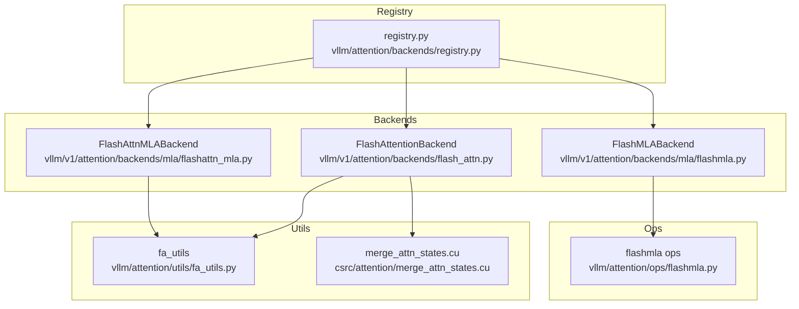
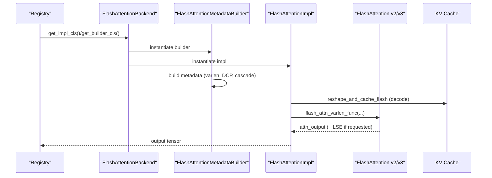
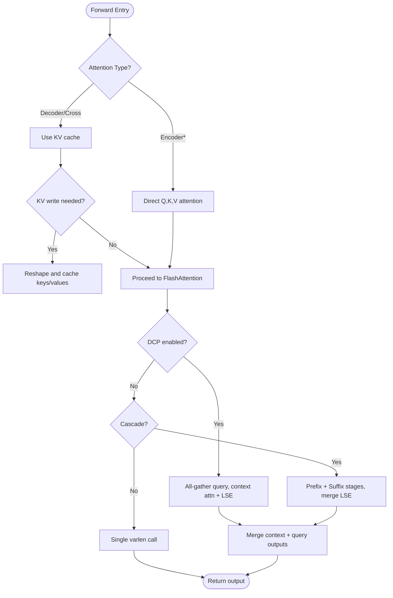
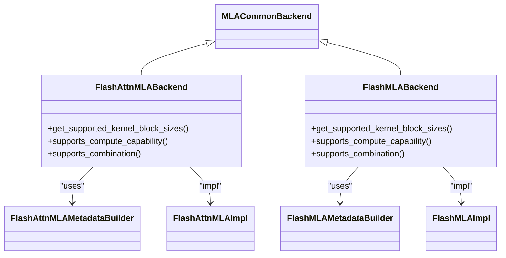
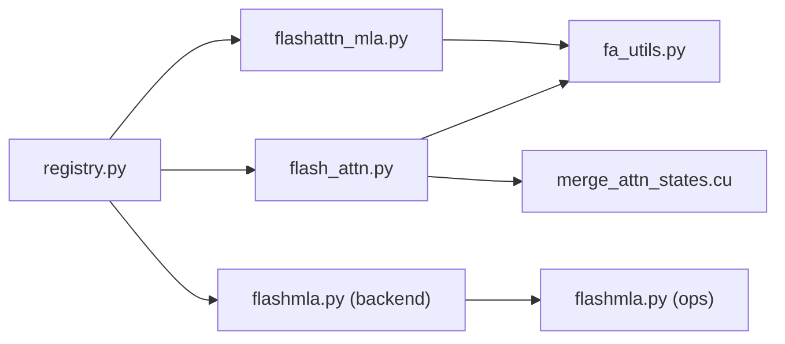

# FlashAttention Backend

<cite>
**Referenced Files in This Document**
- [flash_attn.py](file://vllm/v1/attention/backends/flash_attn.py)
- [abstract.py](file://vllm/attention/backends/abstract.py)
- [registry.py](file://vllm/attention/backends/registry.py)
- [flashmla.py](file://vllm/attention/ops/flashmla.py)
- [flashmla_backend.py](file://vllm/v1/attention/backends/mla/flashmla.py)
- [flashattn_mla_backend.py](file://vllm/v1/attention/backends/mla/flashattn_mla.py)
- [fa_utils.py](file://vllm/attention/utils/fa_utils.py)
- [merge_attn_states.cu](file://csrc/attention/merge_attn_states.cu)
- [flashinfer_cutedsl_moe.py](file://vllm/model_executor/layers/fused_moe/flashinfer_cutedsl_moe.py)
- [flashinfer_cutlass_moe.py](file://vllm/model_executor/layers/fused_moe/flashinfer_cutlass_moe.py)
- [test_flashmla.py](file://tests/kernels/attention/test_flashmla.py)
- [test_flashmla_sparse.py](file://tests/kernels/attention/test_flashmla_sparse.py)
- [test_flash_attn.py](file://tests/kernels/attention/test_flash_attn.py)
- [test_flashinfer.py](file://tests/kernels/attention/test_flashinfer.py)
- [test_flashinfer_mla_decode.py](file://tests/kernels/attention/test_flashinfer_mla_decode.py)
- [test_flashinfer_trtllm_attention.py](file://tests/kernels/attention/test_flashinfer_trtllm_attention.py)
- [CMakeLists.txt](file://CMakeLists.txt)
- [vllm_flash_attn.cmake](file://cmake/external_projects/vllm_flash_attn.cmake)
- [flashmla.cmake](file://cmake/external_projects/flashmla.cmake)
</cite>

## Table of Contents
1. [Introduction](#introduction)
2. [Project Structure](#project-structure)
3. [Core Components](#core-components)
4. [Architecture Overview](#architecture-overview)
5. [Detailed Component Analysis](#detailed-component-analysis)
6. [Dependency Analysis](#dependency-analysis)
7. [Performance Considerations](#performance-considerations)
8. [Troubleshooting Guide](#troubleshooting-guide)
9. [Conclusion](#conclusion)
10. [Appendices](#appendices)

## Introduction
This document explains the FlashAttention backend implementation in vLLM, covering both FlashAttention v2 and v3, their memory bandwidth optimizations, and hardware-specific constraints for NVIDIA GPUs. It documents the attention algorithm, softmax scaling, memory layout requirements, block size constraints, and the MLA (Multi-Head Linear Attention) variants, including specialized kernels for Qwen models. It also provides performance characteristics, supported configurations, memory usage patterns, and troubleshooting guidance for common issues such as out-of-memory errors and numerical stability.

## Project Structure
The FlashAttention backend is implemented as part of the v1 attention backends and integrates with the broader attention subsystem. Key locations:
- FlashAttention v1 backend: vllm/v1/attention/backends/flash_attn.py
- MLA backends: vllm/v1/attention/backends/mla/*
- MLA ops: vllm/attention/ops/flashmla.py
- Backend registry: vllm/attention/backends/registry.py
- FlashAttention utilities: vllm/attention/utils/fa_utils.py
- CUDA merge kernel for attention states: csrc/attention/merge_attn_states.cu
- Tests and benchmarks: tests/kernels/attention/*

**Diagram sources**
- [flash_attn.py](file://vllm/v1/attention/backends/flash_attn.py#L1-L120)
- [flashattn_mla_backend.py](file://vllm/v1/attention/backends/mla/flashattn_mla.py#L1-L120)
- [flashmla_backend.py](file://vllm/v1/attention/backends/mla/flashmla.py#L1-L120)
- [flashmla.py](file://vllm/attention/ops/flashmla.py#L1-L120)
- [fa_utils.py](file://vllm/attention/utils/fa_utils.py#L1-L120)
- [merge_attn_states.cu](file://csrc/attention/merge_attn_states.cu#L1-L120)
- [registry.py](file://vllm/attention/backends/registry.py#L1-L120)

**Section sources**
- [flash_attn.py](file://vllm/v1/attention/backends/flash_attn.py#L1-L120)
- [flashmla_backend.py](file://vllm/v1/attention/backends/mla/flashmla.py#L1-L120)
- [flashattn_mla_backend.py](file://vllm/v1/attention/backends/mla/flashattn_mla.py#L1-L120)
- [flashmla.py](file://vllm/attention/ops/flashmla.py#L1-L120)
- [fa_utils.py](file://vllm/attention/utils/fa_utils.py#L1-L120)
- [merge_attn_states.cu](file://csrc/attention/merge_attn_states.cu#L1-L120)
- [registry.py](file://vllm/attention/backends/registry.py#L1-L120)

## Core Components
- FlashAttentionBackend: Implements decoder, encoder, and encoder-decoder attention using FlashAttention v2/v3. Handles KV cache storage, reshape-and-cache, varlen attention, DCP, and cascade attention.
- MLA backends:
  - FlashAttnMLABackend: Uses FlashAttention v3 to compute MLA attention by splitting Q into nope/pe and routing PE through FlashAttention while KV is projected into combined V space.
  - FlashMLABackend: Uses dedicated FlashMLA kernels for dense and sparse MLA decoding on Hopper/Blackwell.
- FlashMLA ops: Exposes metadata computation and kernel calls for FlashMLA dense/sparse decoding and sparse prefill.

Key capabilities:
- Softmax scaling via configurable scale factor.
- Sliding window and ALiBi slopes support (configuration-dependent).
- FP8 KV cache support for FlashAttention (device-dependent).
- CUDA graph and AOT scheduling integration for v3.
- DCP-aware attention with LSE aggregation and merging.

**Section sources**
- [flash_attn.py](file://vllm/v1/attention/backends/flash_attn.py#L56-L180)
- [flashmla_backend.py](file://vllm/v1/attention/backends/mla/flashmla.py#L40-L120)
- [flashattn_mla_backend.py](file://vllm/v1/attention/backends/mla/flashattn_mla.py#L41-L120)
- [flashmla.py](file://vllm/attention/ops/flashmla.py#L1-L120)

## Architecture Overview
The FlashAttention backend architecture integrates with the v1 attention pipeline:
- Backend selection via registry.
- Metadata builders construct attention metadata for varlen execution, DCP, and cascade attention.
- Impl forwards call into FlashAttention v2/v3 APIs or FlashMLA ops.
- KV cache is stored in a contiguous layout with optional FP8 view casting.
- For encoder attention, direct Q,K,V computation is used without KV cache.

**Diagram sources**
- [registry.py](file://vllm/attention/backends/registry.py#L43-L68)
- [flash_attn.py](file://vllm/v1/attention/backends/flash_attn.py#L98-L180)
- [flash_attn.py](file://vllm/v1/attention/backends/flash_attn.py#L230-L496)
- [flash_attn.py](file://vllm/v1/attention/backends/flash_attn.py#L574-L752)

## Detailed Component Analysis

### FlashAttention v2 vs v3 Kernel Implementations
- Version detection and selection:
  - The backend detects FlashAttention version and sets CUDA graph support accordingly.
  - v3 enables full CUDA graph capture and AOT scheduling metadata.
- Varlen execution:
  - Uses cu_seqlens_q, max_seqlen_q, seqused_k, and block_table for variable-length sequences.
  - Supports scheduler_metadata for AOT scheduling in v3.
- FP8 KV cache:
  - When enabled, key/value caches are viewed as FP8 dtypes for efficient storage and computation.
- DCP (Prefill Context Parallelism):
  - Gathers query across ranks, runs context attention with LSE, then merges with local query attention.
- Cascade attention:
  - Splits computation into a shared prefix stage and a suffix stage, reducing redundant KV reads.

**Diagram sources**
- [flash_attn.py](file://vllm/v1/attention/backends/flash_attn.py#L574-L891)
- [flash_attn.py](file://vllm/v1/attention/backends/flash_attn.py#L895-L1065)
- [merge_attn_states.cu](file://csrc/attention/merge_attn_states.cu#L1-L120)

**Section sources**
- [flash_attn.py](file://vllm/v1/attention/backends/flash_attn.py#L230-L496)
- [flash_attn.py](file://vllm/v1/attention/backends/flash_attn.py#L574-L891)
- [flash_attn.py](file://vllm/v1/attention/backends/flash_attn.py#L895-L1065)

### Memory Bandwidth Optimization Techniques
- Contiguous KV cache layout:
  - Backend defines KV cache shape and stride order to minimize pointer chasing and improve coalesced access.
  - Supports NHD/HND layouts with explicit stride permutations.
- FP8 KV cache:
  - Reduces memory footprint and increases effective memory bandwidth utilization.
- AOT scheduling and CUDA graphs:
  - v3 AOT metadata reduces kernel launch overhead and improves temporal locality.
  - Full CUDA graphs reduce fragmentation and enable aggressive scheduling.
- Split-K and num_splits:
  - Controlled splitting reduces intermediate buffer allocations and memory pressure under CUDA graphs.
- Cascade attention:
  - Reuses KV tiles for shared prefix, reducing DRAM bandwidth by avoiding repeated KV loads.

**Section sources**
- [flash_attn.py](file://vllm/v1/attention/backends/flash_attn.py#L102-L134)
- [flash_attn.py](file://vllm/v1/attention/backends/flash_attn.py#L356-L394)
- [flash_attn.py](file://vllm/v1/attention/backends/flash_attn.py#L574-L752)

### Hardware-Specific Optimizations for NVIDIA GPUs
- Compute Capability:
  - FlashAttentionBackend requires compute capability 8.0+.
  - MLA backends restrict to Hopper (9.x) and Blackwell (10.x) for dense/sparse variants.
- FP8 support:
  - FP8 KV cache is supported conditionally on device capability and FlashAttention version.
- DCP and CP interleave:
  - Backend accounts for CP interleave size affecting DCP distribution and max context length per rank.
- Triton decode attention:
  - Separate Triton kernels optimize decode-time attention with grouped KV access and staged computation.

**Section sources**
- [flash_attn.py](file://vllm/v1/attention/backends/flash_attn.py#L160-L179)
- [flashmla.py](file://vllm/attention/ops/flashmla.py#L51-L76)
- [flashmla_backend.py](file://vllm/v1/attention/backends/mla/flashmla.py#L64-L88)
- [flashattn_mla_backend.py](file://vllm/v1/attention/backends/mla/flashattn_mla.py#L61-L80)

### Attention Computation Algorithm and Scaling
- Softmax scaling:
  - Scale factor is configurable and applied to QK^T before softmax.
- Sliding window:
  - Configurable window bounds; encoder-only uses symmetric windowing.
- ALiBi slopes:
  - Supported via backend configuration; not used in all paths (e.g., MLA).
- Logits soft-capping:
  - Optional logits soft cap to stabilize gradients and reduce extreme values.
- Numerical stability:
  - LSE (log-sum-exp) is optionally returned and merged for DCP to avoid precision loss.

**Section sources**
- [flash_attn.py](file://vllm/v1/attention/backends/flash_attn.py#L516-L573)
- [flash_attn.py](file://vllm/v1/attention/backends/flash_attn.py#L700-L752)
- [flash_attn.py](file://vllm/v1/attention/backends/flash_attn.py#L804-L833)

### Memory Layout Requirements and Block Size Constraints
- KV cache shape:
  - Fixed layout with leading dimension indicating separate K/V caches.
- Stride order:
  - Backend exposes stride_order to map logical shape to physical memory layout (NHD or HND).
- Block size:
  - FlashAttention enforces block-size multiples (16 for standard, or 16/32/64 for hybrid hybrid blocks).
  - MLA backends enforce 64 for kernel compatibility.
- Head size:
  - Head sizes must be multiples of 8 and not exceed 256 for FlashAttention.
- FP8 KV cache dtype:
  - Requires FP8-compatible FlashAttention and device support.

**Section sources**
- [flash_attn.py](file://vllm/v1/attention/backends/flash_attn.py#L102-L134)
- [flash_attn.py](file://vllm/v1/attention/backends/flash_attn.py#L143-L153)
- [flashmla_backend.py](file://vllm/v1/attention/backends/mla/flashmla.py#L48-L51)

### MLA (Multi-Head Linear Attention) Variants
- FlashAttnMLA:
  - Splits Q into nope/pe parts; routes PE through FlashAttention v3 while KV is projected into combined V space.
  - Uses varlen execution with AOT scheduler metadata for CUDA graphs.
  - Not supported with FP8 KV cache in current implementation.
- FlashMLA:
  - Dedicated dense and sparse kernels for Hopper/Blackwell.
  - Computes decode metadata (tile_scheduler_metadata, num_splits) and invokes specialized ops.
  - Supports sparse attention with top-k indices and FP8 KV cache for dense path.

**Diagram sources**
- [flashattn_mla_backend.py](file://vllm/v1/attention/backends/mla/flashattn_mla.py#L41-L120)
- [flashmla_backend.py](file://vllm/v1/attention/backends/mla/flashmla.py#L40-L120)

**Section sources**
- [flashattn_mla_backend.py](file://vllm/v1/attention/backends/mla/flashattn_mla.py#L120-L343)
- [flashmla_backend.py](file://vllm/v1/attention/backends/mla/flashmla.py#L120-L318)
- [flashmla.py](file://vllm/attention/ops/flashmla.py#L120-L252)

### Qwen Model Specialized Kernels
- FlashMLA dense/sparse decoding:
  - Dense path supported on Hopper; sparse path supported on Hopper/Blackwell.
  - FP8 KV cache supported for dense decoding path.
- Sparse prefill kernel:
  - Provides specialized prefill kernel for sparse MLA with top-k indices.

**Section sources**
- [flashmla.py](file://vllm/attention/ops/flashmla.py#L51-L76)
- [flashmla.py](file://vllm/attention/ops/flashmla.py#L211-L239)

## Dependency Analysis
- Backend registry maps backend names to implementation classes.
- FlashAttentionBackend depends on:
  - fa_utils for version detection, FP8 support, and scheduler metadata.
  - merge_attn_states CUDA kernel for DCP merging.
- MLA backends depend on:
  - FlashMLA ops for dense/sparse decoding and metadata computation.
  - FlashAttention v3 for FlashAttnMLA decode path.

**Diagram sources**
- [registry.py](file://vllm/attention/backends/registry.py#L43-L68)
- [flash_attn.py](file://vllm/v1/attention/backends/flash_attn.py#L1-L120)
- [flashattn_mla_backend.py](file://vllm/v1/attention/backends/mla/flashattn_mla.py#L1-L120)
- [flashmla_backend.py](file://vllm/v1/attention/backends/mla/flashmla.py#L1-L120)
- [fa_utils.py](file://vllm/attention/utils/fa_utils.py#L1-L120)
- [flashmla.py](file://vllm/attention/ops/flashmla.py#L1-L120)
- [merge_attn_states.cu](file://csrc/attention/merge_attn_states.cu#L1-L120)

**Section sources**
- [registry.py](file://vllm/attention/backends/registry.py#L43-L68)
- [flash_attn.py](file://vllm/v1/attention/backends/flash_attn.py#L1-L120)
- [flashattn_mla_backend.py](file://vllm/v1/attention/backends/mla/flashattn_mla.py#L1-L120)
- [flashmla_backend.py](file://vllm/v1/attention/backends/mla/flashmla.py#L1-L120)

## Performance Considerations
- Head size and block size:
  - Head sizes must be multiples of 8 and ≤ 256 for FlashAttention.
  - Block sizes must be multiples of 16 (or 16/32/64 for hybrid blocks).
- FP8 KV cache:
  - Improves memory bandwidth; requires device support and compatible FlashAttention version.
- CUDA graphs and AOT:
  - v3 AOT metadata and full CUDA graphs reduce overhead and improve throughput.
- Split-K and num_splits:
  - Controlled splitting reduces intermediate memory usage under CUDA graphs.
- MLA decode:
  - FlashMLA dense/sparse decoding leverages device-specific kernels for Hopper/Blackwell.
- Triton decode:
  - Grouped KV access and staged computation reduce register pressure and improve occupancy.

[No sources needed since this section provides general guidance]

## Troubleshooting Guide
- Out-of-memory errors:
  - Reduce batch size or max_num_seqs; adjust max_num_splits for CUDA graphs.
  - Use FP8 KV cache to halve KV memory footprint.
  - Enable cascade attention for long prefixes to reuse KV tiles.
- Numerical instability:
  - Apply logits soft cap to bound logits.
  - Ensure proper softmax scale; mismatched scales cause overflow/underflow.
  - For DCP, verify LSE merging correctness and transpose shapes.
- Unsupported configurations:
  - FlashAttention requires compute capability ≥ 8.0; MLA requires 9.x/10.x.
  - FP8 KV cache requires FlashAttention FP8 support.
  - MLA FlashAttnMLA does not support FP8 KV cache in current implementation.
- Device capability mismatches:
  - Verify device compute capability and backend selection.
  - For sparse MLA, ensure device is Hopper or Blackwell.

**Section sources**
- [flash_attn.py](file://vllm/v1/attention/backends/flash_attn.py#L143-L179)
- [flashmla_backend.py](file://vllm/v1/attention/backends/mla/flashmla.py#L64-L88)
- [flashmla.py](file://vllm/attention/ops/flashmla.py#L51-L76)
- [flashattn_mla_backend.py](file://vllm/v1/attention/backends/mla/flashattn_mla.py#L282-L306)

## Conclusion
The FlashAttention backend in vLLM provides robust, high-performance attention computation across decoder, encoder, and cross-attention scenarios. It leverages FlashAttention v2/v3 features, including AOT scheduling, CUDA graphs, FP8 KV cache, DCP, and cascade attention, to achieve strong performance and memory efficiency. The MLA variants offer specialized kernels for Qwen models, with dense and sparse decoding paths optimized for Hopper/Blackwell. Proper configuration of head sizes, block sizes, and FP8 support ensures optimal performance while avoiding common pitfalls like out-of-memory errors and numerical instability.

[No sources needed since this section summarizes without analyzing specific files]

## Appendices

### Supported Configurations and Feature Matrix
- FlashAttentionBackend:
  - Compute capability: ≥ 8.0
  - Head size: multiple of 8, ≤ 256
  - Block size: multiple of 16 (or 16/32/64 for hybrid)
  - FP8 KV cache: device/version dependent
  - DCP: supported; returns LSE for merging
  - Cascade: supported under heuristics
- FlashAttnMLABackend:
  - Compute capability: 9.x
  - FP8 KV cache: not supported
  - MLA dims: qk_rope, qk_nope, v_head_dim, kv_lora_rank
- FlashMLABackend:
  - Compute capability: 9.x/10.x
  - Dense: Hopper+
  - Sparse: Hopper/Blackwell
  - FP8 KV cache: dense path supported

**Section sources**
- [flash_attn.py](file://vllm/v1/attention/backends/flash_attn.py#L143-L179)
- [flashmla_backend.py](file://vllm/v1/attention/backends/mla/flashmla.py#L64-L88)
- [flashmla.py](file://vllm/attention/ops/flashmla.py#L51-L76)
- [flashattn_mla_backend.py](file://vllm/v1/attention/backends/mla/flashattn_mla.py#L61-L80)

### Build and Integration Notes
- External projects:
  - vllm_flash_attn.cmake integrates FlashAttention.
  - flashmla.cmake integrates FlashMLA.
- Tests and benchmarks:
  - Kernel tests cover FlashAttention, FlashMLA, FlashInfer, and related variants.

**Section sources**
- [CMakeLists.txt](file://CMakeLists.txt#L1-L120)
- [vllm_flash_attn.cmake](file://cmake/external_projects/vllm_flash_attn.cmake#L1-L120)
- [flashmla.cmake](file://cmake/external_projects/flashmla.cmake#L1-L120)
- [test_flash_attn.py](file://tests/kernels/attention/test_flash_attn.py#L1-L120)
- [test_flashmla.py](file://tests/kernels/attention/test_flashmla.py#L1-L120)
- [test_flashmla_sparse.py](file://tests/kernels/attention/test_flashmla_sparse.py#L1-L120)
- [test_flashinfer.py](file://tests/kernels/attention/test_flashinfer.py#L1-L120)
- [test_flashinfer_mla_decode.py](file://tests/kernels/attention/test_flashinfer_mla_decode.py#L1-L120)
- [test_flashinfer_trtllm_attention.py](file://tests/kernels/attention/test_flashinfer_trtllm_attention.py#L1-L120)