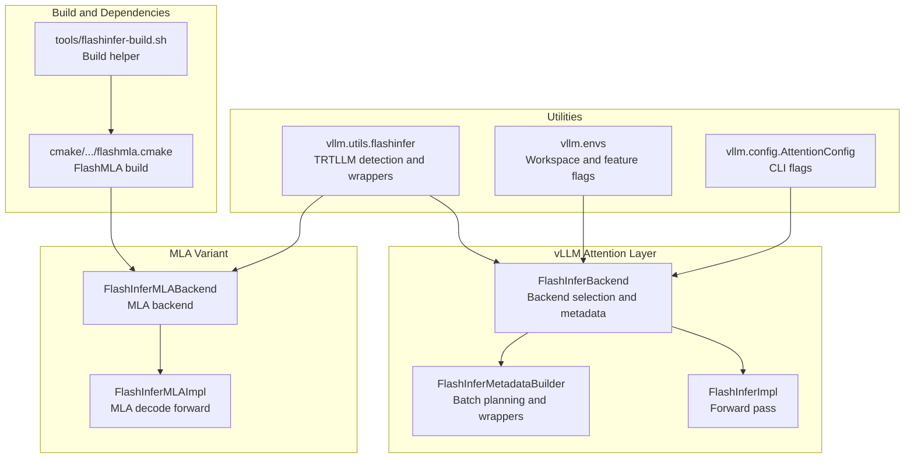
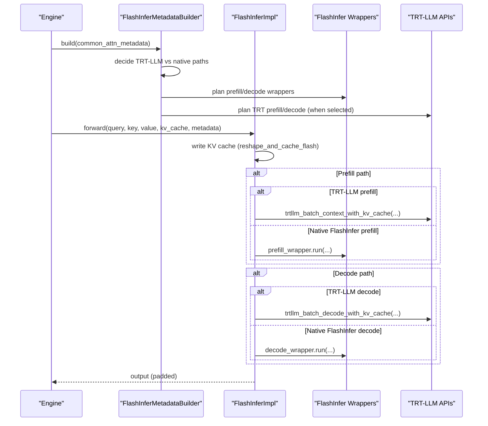
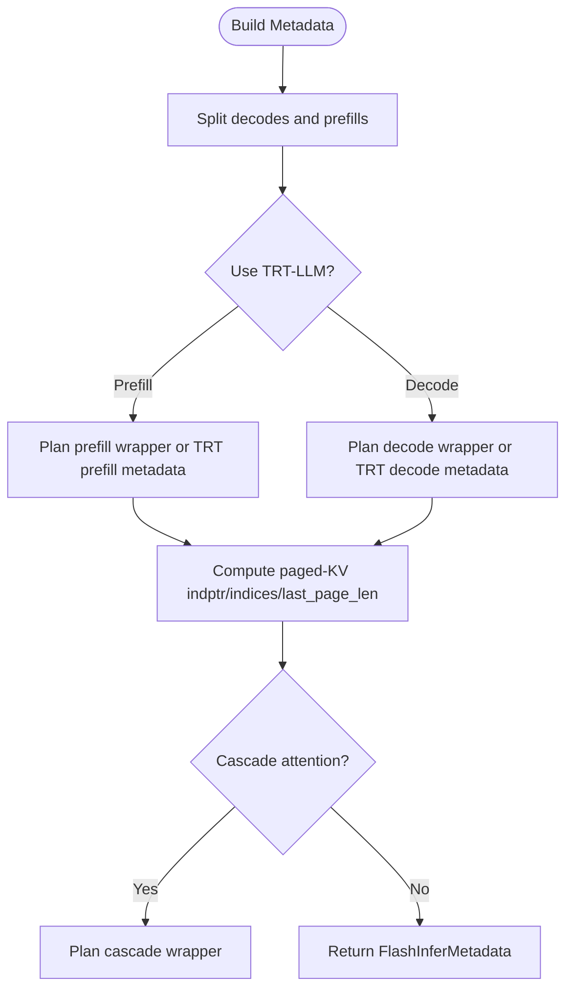
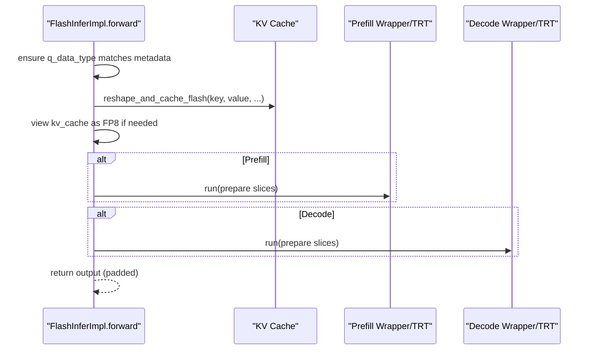
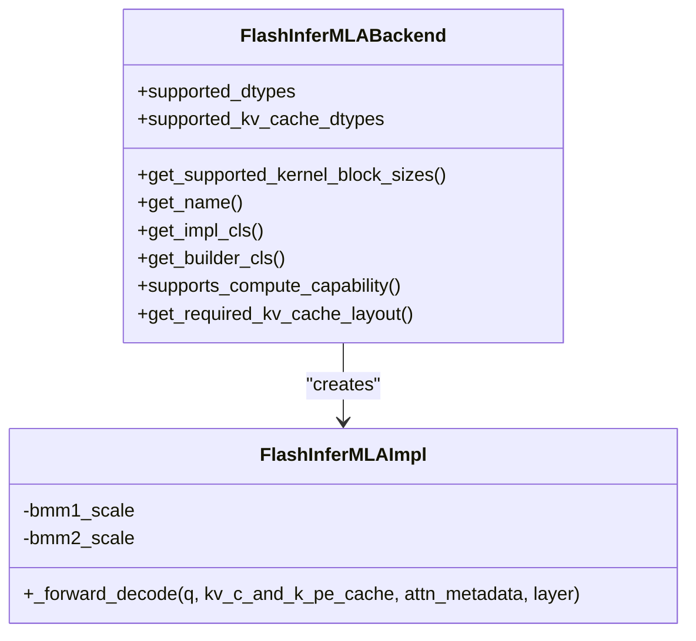
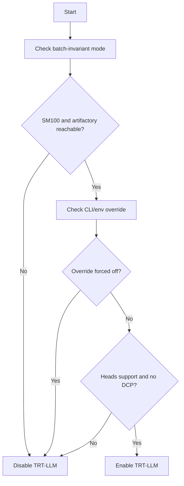
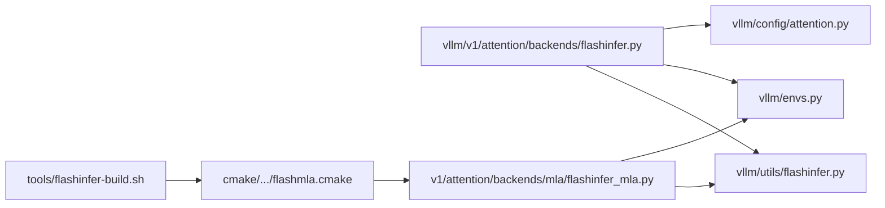

# FlashInfer Backend

<cite>
**Referenced Files in This Document**
- [flashinfer.py](file://vllm/v1/attention/backends/flashinfer.py)
- [flashinfer_mla.py](file://vllm/v1/attention/backends/mla/flashinfer_mla.py)
- [flashinfer.py](file://vllm/utils/flashinfer.py)
- [flashmla.cmake](file://cmake/external_projects/flashmla.cmake)
- [envs.py](file://vllm/envs.py)
- [attention.py](file://vllm/config/attention.py)
- [attn_utils.py](file://vllm/v1/worker/gpu/attn_utils.py)
- [flashinfer_utils.py](file://vllm/model_executor/layers/quantization/utils/flashinfer_utils.py)
- [flashinfer-build.sh](file://tools/flashinfer-build.sh)
</cite>

## Table of Contents
1. [Introduction](#introduction)
2. [Project Structure](#project-structure)
3. [Core Components](#core-components)
4. [Architecture Overview](#architecture-overview)
5. [Detailed Component Analysis](#detailed-component-analysis)
6. [Dependency Analysis](#dependency-analysis)
7. [Performance Considerations](#performance-considerations)
8. [Troubleshooting Guide](#troubleshooting-guide)
9. [Conclusion](#conclusion)
10. [Appendices](#appendices)

## Introduction
This document explains the FlashInfer backend implementation in vLLM. It covers how FlashInfer integrates with vLLM’s attention stack, the efficient attention computation algorithms used, batch processing capabilities, precomputation and state management, memory optimization strategies, and the MLA variant for multi-head linear attention. It also documents configuration options, supported data types, batch size constraints, and integration considerations, including dependency requirements and troubleshooting steps.

## Project Structure
The FlashInfer backend spans several modules:
- Attention backend and metadata builder for FlashInfer
- MLA backend for multi-head linear attention
- Utility helpers for FlashInfer availability and TRT-LLM attention selection
- Environment variables and attention configuration
- Build-time integration for FlashMLA kernels
- Quantization utilities for fused MoE with FlashInfer

**Diagram sources**
- [flashinfer.py](file://vllm/v1/attention/backends/flashinfer.py#L278-L382)
- [flashinfer_mla.py](file://vllm/v1/attention/backends/mla/flashinfer_mla.py#L31-L119)
- [flashinfer.py](file://vllm/utils/flashinfer.py#L273-L413)
- [envs.py](file://vllm/envs.py#L1299-L1303)
- [attention.py](file://vllm/config/attention.py#L40-L50)
- [flashmla.cmake](file://cmake/external_projects/flashmla.cmake#L1-L140)
- [flashinfer-build.sh](file://tools/flashinfer-build.sh)

**Section sources**
- [flashinfer.py](file://vllm/v1/attention/backends/flashinfer.py#L278-L382)
- [flashinfer_mla.py](file://vllm/v1/attention/backends/mla/flashinfer_mla.py#L31-L119)
- [flashinfer.py](file://vllm/utils/flashinfer.py#L273-L413)
- [envs.py](file://vllm/envs.py#L1299-L1303)
- [attention.py](file://vllm/config/attention.py#L40-L50)
- [flashmla.cmake](file://cmake/external_projects/flashmla.cmake#L1-L140)
- [flashinfer-build.sh](file://tools/flashinfer-build.sh)

## Core Components
- FlashInferBackend: Declares supported dtypes, KV cache dtypes, kernel block sizes, KV cache shape/strides, and compute capability support. It selects between native FlashInfer and TRT-LLM attention paths.
- FlashInferMetadataBuilder: Builds attention metadata for batches, decides TRT-LLM vs native FlashInfer prefill/decode, manages workspace buffers, and prepares paged-KV indices and indptr arrays.
- FlashInferImpl: Executes the forward pass, writes KV cache, reshapes KV cache for FlashInfer, and invokes either native FlashInfer wrappers or TRT-LLM APIs depending on configuration and capabilities.
- FlashInferMLABackend/Impl: Implements multi-head linear attention decode path using TRT-LLM APIs with FlashInfer workspace buffers.
- vllm.utils.flashinfer: Provides lazy availability checks, TRT-LLM support detection, and helper functions for attention selection and quantized matmul wrappers.
- Environment and configuration: Workspace sizing, TRT-LLM enablement, and disabling FlashInfer Q quantization.

**Section sources**
- [flashinfer.py](file://vllm/v1/attention/backends/flashinfer.py#L278-L382)
- [flashinfer.py](file://vllm/v1/attention/backends/flashinfer.py#L483-L713)
- [flashinfer.py](file://vllm/v1/attention/backends/flashinfer.py#L1114-L1543)
- [flashinfer_mla.py](file://vllm/v1/attention/backends/mla/flashinfer_mla.py#L31-L119)
- [flashinfer.py](file://vllm/utils/flashinfer.py#L273-L413)
- [envs.py](file://vllm/envs.py#L1299-L1303)
- [attention.py](file://vllm/config/attention.py#L40-L50)

## Architecture Overview
The FlashInfer backend orchestrates attention computation across prefill and decode phases. It dynamically chooses between:
- Native FlashInfer (prefill/decode) for broad compatibility
- TRT-LLM attention for latency-optimized decode and prefill on supported devices

**Diagram sources**
- [flashinfer.py](file://vllm/v1/attention/backends/flashinfer.py#L775-L1102)
- [flashinfer.py](file://vllm/v1/attention/backends/flashinfer.py#L1191-L1543)

## Detailed Component Analysis

### FlashInferBackend and Metadata Builder
- Backend capabilities:
  - Supported dtypes: float16 and bfloat16
  - KV cache dtypes: auto, fp8, fp8_e4m3, fp8_e5m2
  - Head sizes: 64, 128, 256
  - Compute capability: 7.5 to 12.1
  - Required KV cache layout on SM100: HND
- Metadata builder:
  - Manages workspace buffer reuse across layers
  - Builds paged-KV indptr/indices/last-page-len buffers
  - Plans prefill/decode wrappers with fixed split sizes and split-KV disabled in batch-invariant mode
  - Supports DCP-aware prefill planning and uniform decode batching when TRT-LLM is available

**Diagram sources**
- [flashinfer.py](file://vllm/v1/attention/backends/flashinfer.py#L775-L1102)

**Section sources**
- [flashinfer.py](file://vllm/v1/attention/backends/flashinfer.py#L278-L382)
- [flashinfer.py](file://vllm/v1/attention/backends/flashinfer.py#L483-L713)
- [flashinfer.py](file://vllm/v1/attention/backends/flashinfer.py#L775-L1102)

### FlashInferImpl Forward Pass
- Writes KV cache into the paged layout using a dedicated op
- Converts KV cache to FP8 dtype when KV cache is FP8 for FlashInfer consumption
- Chooses TRT-LLM or native FlashInfer based on metadata flags
- Handles DCP gather and LSE aggregation for decode when using native FlashInfer
- Supports fused attention + quantization when TRT-LLM is used with FP8/BF16 queries and appropriate output dtypes

**Diagram sources**
- [flashinfer.py](file://vllm/v1/attention/backends/flashinfer.py#L1191-L1543)

**Section sources**
- [flashinfer.py](file://vllm/v1/attention/backends/flashinfer.py#L1114-L1543)

### MLA Variant (Multi-Head Linear Attention)
- FlashInferMLABackend:
  - Supports float16/bfloat16
  - KV cache dtypes: auto, fp8, fp8_e4m3
  - Block sizes: 32, 64
  - Compute capability: SM100 only
  - Required KV cache layout: HND
- FlashInferMLAImpl:
  - Decode-only path using TRT-LLM decode API with FlashInfer workspace
  - Concatenates peephole and rope components for query
  - Computes per-stage scales for bmm1/bmm2 and output scaling
  - Enforces uniform query lengths per request for TRT-LLM

**Diagram sources**
- [flashinfer_mla.py](file://vllm/v1/attention/backends/mla/flashinfer_mla.py#L31-L119)

**Section sources**
- [flashinfer_mla.py](file://vllm/v1/attention/backends/mla/flashinfer_mla.py#L31-L119)

### TRT-LLM Attention Selection and Availability
- Auto-detection considers device capability (SM100), NVIDIA artifactory accessibility, and environment flags
- CLI flags and environment variables can force or disable TRT-LLM usage
- Certain configurations (e.g., num_kv_heads=1) are not supported by TRT-LLM and fall back to native FlashInfer

**Diagram sources**
- [flashinfer.py](file://vllm/utils/flashinfer.py#L273-L413)
- [attention.py](file://vllm/config/attention.py#L40-L50)
- [envs.py](file://vllm/envs.py#L1388-L1399)

**Section sources**
- [flashinfer.py](file://vllm/utils/flashinfer.py#L273-L413)
- [attention.py](file://vllm/config/attention.py#L40-L50)
- [envs.py](file://vllm/envs.py#L1388-L1399)

### Memory Optimization and Workspace Management
- Persistent workspace buffer reused across layers to reduce allocation overhead
- Batch-invariant mode increases workspace size to accommodate worst-case scenarios
- Pinned memory buffers for indptr and last-page-len to minimize host-device synchronization
- Fast decode planning avoids unnecessary device-to-device copies when capturing CUDA graphs

**Section sources**
- [flashinfer.py](file://vllm/v1/attention/backends/flashinfer.py#L61-L82)
- [flashinfer.py](file://vllm/v1/attention/backends/flashinfer.py#L632-L662)
- [flashinfer.py](file://vllm/v1/attention/backends/flashinfer.py#L663-L713)
- [flashinfer.py](file://vllm/v1/attention/backends/flashinfer.py#L1546-L1710)
- [envs.py](file://vllm/envs.py#L1299-L1303)

### Quantized Attention and Fused Operations
- FlashInfer-backed quantized matmul wrappers for FP4 and FP8 are exposed via custom Torch ops
- Fused MoE kernels leverage FlashInfer backends (CUTLASS, TRT-LLM, CUTEDSL) depending on environment and device capability
- Scaling factors for FP8 MoE are computed and registered as parameters

**Section sources**
- [flashinfer.py](file://vllm/utils/flashinfer.py#L415-L565)
- [flashinfer_utils.py](file://vllm/model_executor/layers/quantization/utils/flashinfer_utils.py#L1-L313)

## Dependency Analysis
- External libraries:
  - flashinfer Python package and optional flashinfer-cubin for JIT kernels
  - Optional FlashMLA extension for Hopper-family devices
- Internal dependencies:
  - Attention metadata builders depend on KV cache layout and device capability
  - TRT-LLM selection depends on environment variables and platform checks
  - MLA variant requires SM100 and HND layout

**Diagram sources**
- [flashinfer.py](file://vllm/v1/attention/backends/flashinfer.py#L1-L120)
- [flashinfer.py](file://vllm/utils/flashinfer.py#L1-L120)
- [flashinfer_mla.py](file://vllm/v1/attention/backends/mla/flashinfer_mla.py#L1-L40)
- [flashmla.cmake](file://cmake/external_projects/flashmla.cmake#L1-L60)
- [flashinfer-build.sh](file://tools/flashinfer-build.sh)

**Section sources**
- [flashinfer.py](file://vllm/v1/attention/backends/flashinfer.py#L1-L120)
- [flashinfer.py](file://vllm/utils/flashinfer.py#L1-L120)
- [flashinfer_mla.py](file://vllm/v1/attention/backends/mla/flashinfer_mla.py#L1-L40)
- [flashmla.cmake](file://cmake/external_projects/flashmla.cmake#L1-L60)
- [flashinfer-build.sh](file://tools/flashinfer-build.sh)

## Performance Considerations
- TRT-LLM attention is preferred for latency-sensitive decode and prefill on supported devices (SM100) and when conditions permit
- Native FlashInfer offers broader compatibility and can be tuned with fixed split sizes and split-KV disabling in batch-invariant mode
- Workspace buffer sizing impacts memory footprint; adjust via environment variable for large batches
- Head size 256 with block size 16 is not supported on SM100; choose block sizes accordingly
- Uniform query lengths are required for TRT-LLM decode; otherwise native FlashInfer is used

[No sources needed since this section provides general guidance]

## Troubleshooting Guide
- FlashInfer not available:
  - Ensure the flashinfer Python package is installed and nvcc is present or pre-downloaded cubins are configured
- TRT-LLM not used:
  - Verify SM100 device, NVIDIA artifactory accessibility, and environment flags
  - Check that num_kv_heads > 1 and not in DCP mode
- MLA decode fails:
  - Ensure SM100 device and HND KV cache layout
  - Uniform query lengths per request are required
- Workspace OOM:
  - Increase workspace buffer size via environment variable
- Unexpected dtype or layout:
  - Confirm KV cache dtype and layout settings; native FlashInfer expects specific layouts on SM100

**Section sources**
- [flashinfer.py](file://vllm/utils/flashinfer.py#L49-L110)
- [flashinfer.py](file://vllm/utils/flashinfer.py#L273-L413)
- [flashinfer_mla.py](file://vllm/v1/attention/backends/mla/flashinfer_mla.py#L61-L119)
- [envs.py](file://vllm/envs.py#L1299-L1303)

## Conclusion
The FlashInfer backend in vLLM provides a flexible, high-performance attention stack that leverages native FlashInfer and TRT-LLM kernels. It supports diverse data types, batch processing, and memory optimization strategies. The MLA variant extends support to multi-head linear attention on SM100 with HND layout. Proper configuration of environment variables and attention settings ensures optimal performance and compatibility across devices.

[No sources needed since this section summarizes without analyzing specific files]

## Appendices

### Configuration Options
- Attention backend selection and TRT-LLM toggles
- FlashInfer workspace buffer size
- Disabling FlashInfer Q quantization when using FP8 KV cache
- MoE backend selection for FlashInfer

**Section sources**
- [attention.py](file://vllm/config/attention.py#L40-L50)
- [envs.py](file://vllm/envs.py#L1299-L1303)
- [envs.py](file://vllm/envs.py#L1388-L1399)
- [envs.py](file://vllm/envs.py#L1288-L1299)
- [flashinfer_utils.py](file://vllm/model_executor/layers/quantization/utils/flashinfer_utils.py#L277-L313)

### Supported Data Types and Layouts
- Query dtypes: float16, bfloat16
- KV cache dtypes: auto, fp8, fp8_e4m3, fp8_e5m2
- Head sizes: 64, 128, 256
- Required KV cache layout on SM100: HND
- MLA variant: SM100 only

**Section sources**
- [flashinfer.py](file://vllm/v1/attention/backends/flashinfer.py#L278-L382)
- [flashinfer_mla.py](file://vllm/v1/attention/backends/mla/flashinfer_mla.py#L31-L119)

### Batch Size and Page Size Constraints
- Supported kernel block sizes: 16, 32, 64 (with caveats)
- Head size 256 with block size 16 is not supported on SM100
- Uniform query lengths required for TRT-LLM decode

**Section sources**
- [flashinfer.py](file://vllm/v1/attention/backends/flashinfer.py#L288-L293)
- [flashinfer.py](file://vllm/v1/attention/backends/flashinfer.py#L612-L620)
- [flashinfer.py](file://vllm/v1/attention/backends/flashinfer.py#L1056-L1066)

### Integration and Build Notes
- FlashMLA kernels are built conditionally for supported CUDA architectures and require specific environment variables
- Build helper script supports local development builds

**Section sources**
- [flashmla.cmake](file://cmake/external_projects/flashmla.cmake#L1-L140)
- [flashinfer-build.sh](file://tools/flashinfer-build.sh)