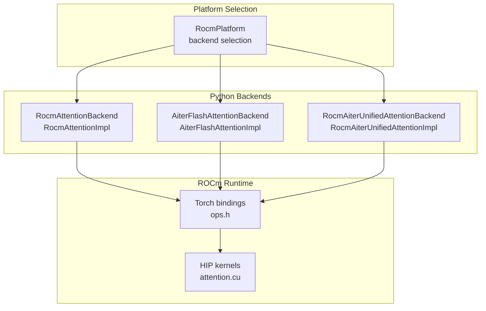
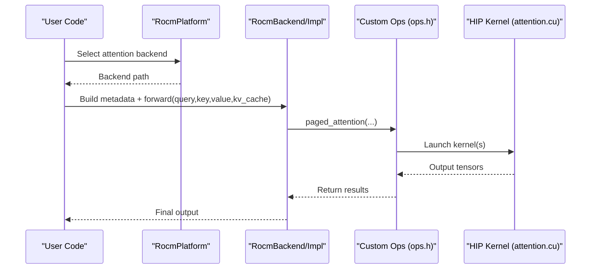
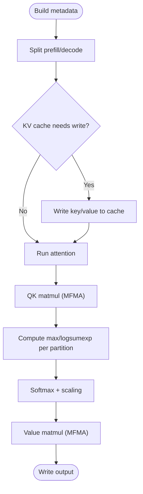
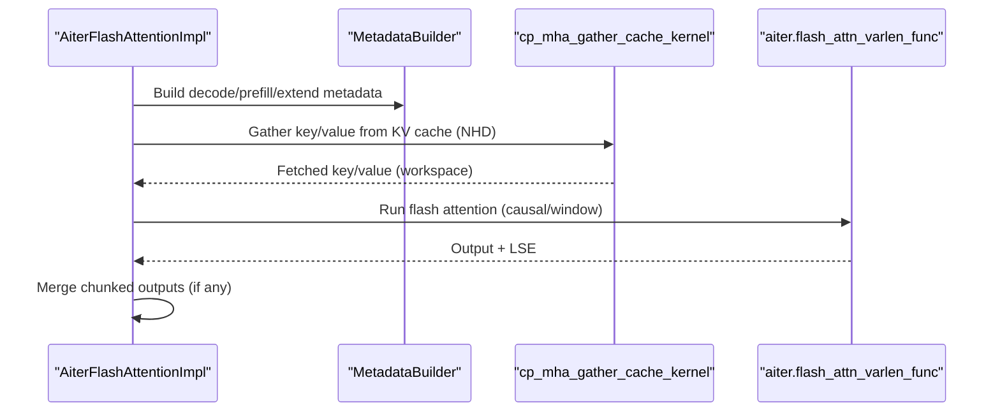
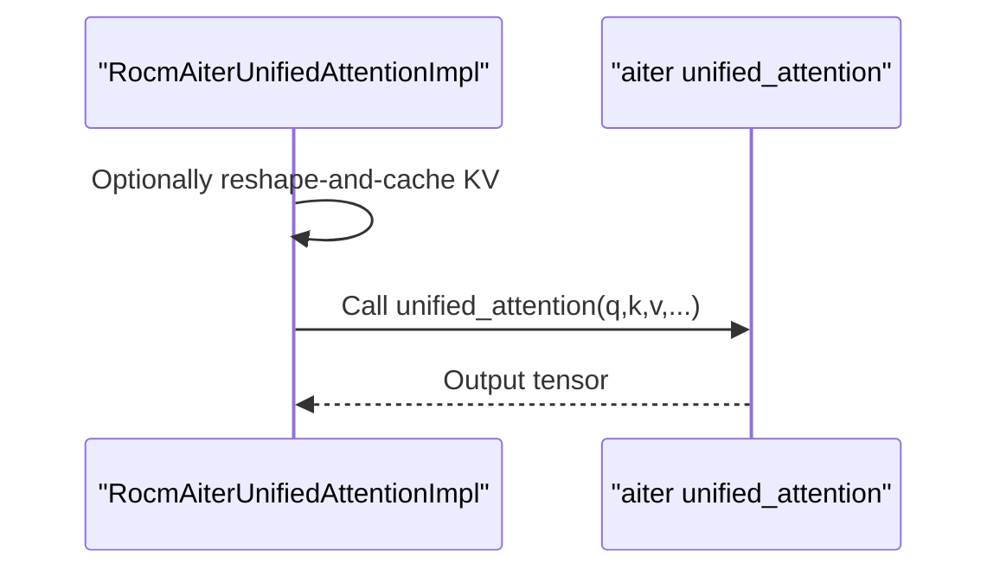
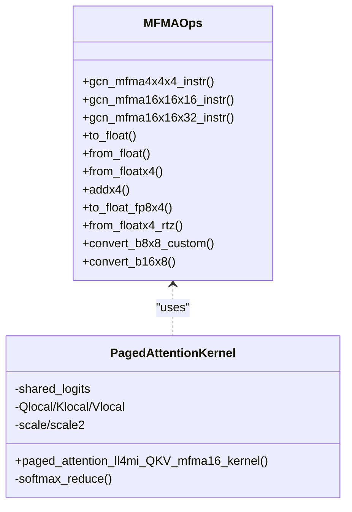
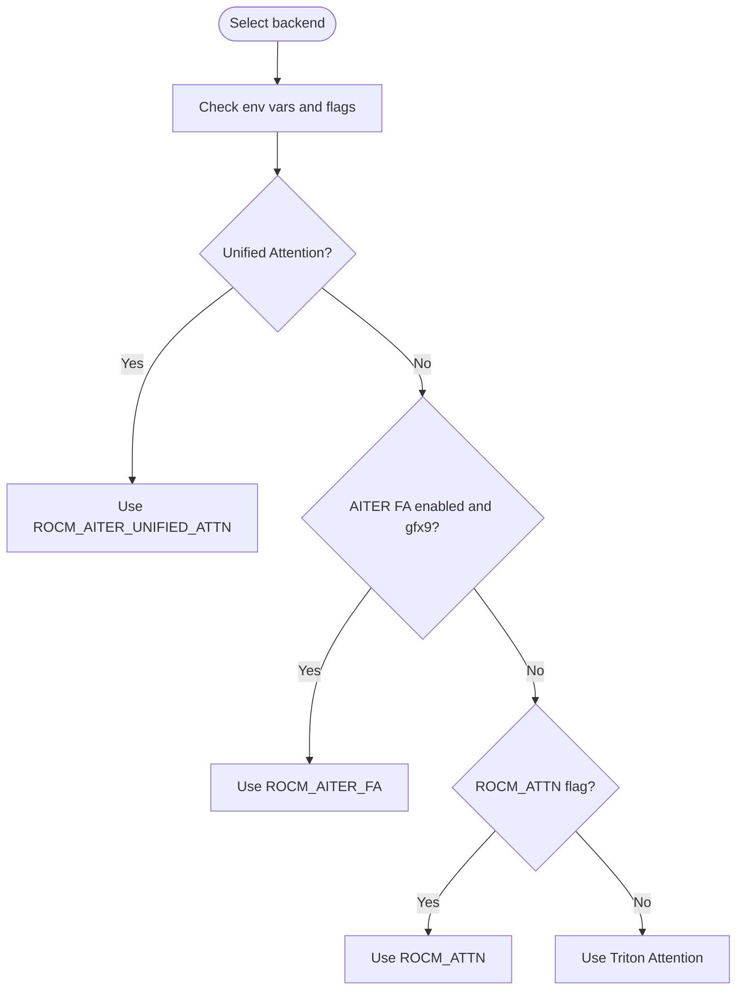
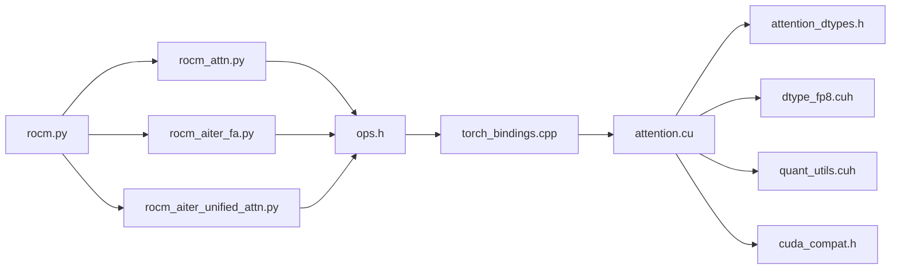

# ROCm Attention Backend

<cite>
**Referenced Files in This Document**
- [attention.cu](file://csrc/rocm/attention.cu)
- [ops.h](file://csrc/rocm/ops.h)
- [torch_bindings.cpp](file://csrc/rocm/torch_bindings.cpp)
- [rocm_attn.py](file://vllm/v1/attention/backends/rocm_attn.py)
- [rocm_aiter_fa.py](file://vllm/v1/attention/backends/rocm_aiter_fa.py)
- [rocm_aiter_unified_attn.py](file://vllm/v1/attention/backends/rocm_aiter_unified_attn.py)
- [rocm.py](file://vllm/platforms/rocm.py)
- [attention_dtypes.h](file://csrc/attention/attention_dtypes.h)
- [attention_kernels.cuh](file://csrc/attention/attention_kernels.cuh)
- [attention_utils.cuh](file://csrc/attention/attention_utils.cuh)
- [dtype_fp8.cuh](file://csrc/attention/dtype_fp8.cuh)
- [quant_utils.cuh](file://csrc/quantization/w8a8/fp8/amd/quant_utils.cuh)
- [cuda_compat.h](file://csrc/cuda_compat.h)
</cite>

## Table of Contents
1. [Introduction](#introduction)
2. [Project Structure](#project-structure)
3. [Core Components](#core-components)
4. [Architecture Overview](#architecture-overview)
5. [Detailed Component Analysis](#detailed-component-analysis)
6. [Dependency Analysis](#dependency-analysis)
7. [Performance Considerations](#performance-considerations)
8. [Troubleshooting Guide](#troubleshooting-guide)
9. [Conclusion](#conclusion)

## Introduction
This document explains the ROCm (AMD GPU) attention backend implementation in vLLM, focusing on HIP adaptations for attention kernels, the aiter FlashAttention (FA) and unified attention variants, AMD-specific optimizations, memory coalescing strategies, compute unit utilization, ROCm runtime integration, supported architectures, and performance characteristics. It also provides troubleshooting guidance and optimization tips for different AMD GPU families.

## Project Structure
The ROCm attention backend spans Python backend adapters and C++/HIP kernels:
- Python backends define attention implementations and metadata builders for ROCm, including Prefill-Decoding split attention and aiter FA/unified attention.
- C++/HIP kernels implement the core attention computation on ROCm devices, including FP8-aware MFMA paths and ROCm 6.x compatibility.
- Platform logic selects appropriate backends based on environment variables and GPU architecture.

**Diagram sources**
- [rocm_attn.py](file://vllm/v1/attention/backends/rocm_attn.py#L153-L203)
- [rocm_aiter_fa.py](file://vllm/v1/attention/backends/rocm_aiter_fa.py#L517-L554)
- [rocm_aiter_unified_attn.py](file://vllm/v1/attention/backends/rocm_aiter_unified_attn.py#L24-L54)
- [ops.h](file://csrc/rocm/ops.h#L17-L27)
- [attention.cu](file://csrc/rocm/attention.cu#L1-L80)
- [rocm.py](file://vllm/platforms/rocm.py#L189-L298)

**Section sources**
- [rocm_attn.py](file://vllm/v1/attention/backends/rocm_attn.py#L153-L203)
- [rocm_aiter_fa.py](file://vllm/v1/attention/backends/rocm_aiter_fa.py#L517-L554)
- [rocm_aiter_unified_attn.py](file://vllm/v1/attention/backends/rocm_aiter_unified_attn.py#L24-L54)
- [ops.h](file://csrc/rocm/ops.h#L17-L27)
- [attention.cu](file://csrc/rocm/attention.cu#L1-L80)
- [rocm.py](file://vllm/platforms/rocm.py#L189-L298)

## Core Components
- Prefill-Decoding Split Attention (ROCM_ATTN): Python-side builder and impl orchestrate PagedAttention with a custom ROCm paged_attention operator backed by HIP kernels. Supports head sizes 32–256 and multiple dtypes.
- Aiter FlashAttention (ROCM_AITER_FA): Uses aiter flash attention with chunked prefill and gather-cache kernels, supporting sliding window and variable-length sequences.
- Aiter Unified Attention (ROCM_AITER_UNIFIED_ATTN): Delegates to aiter unified attention for decoder attention with KV cache support and optional FP8 scales.
- ROCm Platform Selection: Environment-driven selection among ROCm backends, with GFX9 vs GFX11/GFX12 constraints and FP8 dtype selection.

**Section sources**
- [rocm_attn.py](file://vllm/v1/attention/backends/rocm_attn.py#L153-L203)
- [rocm_aiter_fa.py](file://vllm/v1/attention/backends/rocm_aiter_fa.py#L517-L554)
- [rocm_aiter_unified_attn.py](file://vllm/v1/attention/backends/rocm_aiter_unified_attn.py#L24-L54)
- [rocm.py](file://vllm/platforms/rocm.py#L189-L298)

## Architecture Overview
The ROCm attention pipeline integrates Python backends with HIP kernels via a custom Torch extension. The platform module chooses the backend based on environment variables and GPU architecture.

**Diagram sources**
- [rocm.py](file://vllm/platforms/rocm.py#L189-L298)
- [rocm_attn.py](file://vllm/v1/attention/backends/rocm_attn.py#L205-L364)
- [ops.h](file://csrc/rocm/ops.h#L17-L27)
- [attention.cu](file://csrc/rocm/attention.cu#L323-L414)

## Detailed Component Analysis

### Prefill-Decoding Split Attention (ROCM_ATTN)
- Backend and Impl: Define supported head sizes, dtype support, KV cache shape, and metadata builder. The impl writes KV cache when needed, applies scales for FP8, and invokes chunked prefill-decode logic.
- HIP Kernel: Implements a MFMA-based PagedAttention kernel for QK matmul and softmax, with optional FP8 scaling and logits casting. It uses ROCm 6.x FP8 compatibility macros and architecture-specific defines (__HIP__GFX9__, __HIP__FP8MFMA__, __HIP__GFX11__, __HIP__GFX12__).

**Diagram sources**
- [rocm_attn.py](file://vllm/v1/attention/backends/rocm_attn.py#L205-L364)
- [attention.cu](file://csrc/rocm/attention.cu#L323-L800)

**Section sources**
- [rocm_attn.py](file://vllm/v1/attention/backends/rocm_attn.py#L153-L203)
- [rocm_attn.py](file://vllm/v1/attention/backends/rocm_attn.py#L205-L364)
- [attention.cu](file://csrc/rocm/attention.cu#L323-L800)

### Aiter FlashAttention (ROCM_AITER_FA)
- Backend and Impl: Provide metadata builders for decode, prefill, and chunked extend contexts. The impl gathers KV cache into workspace buffers, optionally applies sliding window, and runs aiter flash attention with chunk merging.
- ROCm-Specific: Enforces NHD KV cache layout, uses Triton JIT kernels for cache gathering, and supports FP8 scales via expand semantics.

**Diagram sources**
- [rocm_aiter_fa.py](file://vllm/v1/attention/backends/rocm_aiter_fa.py#L1-L200)
- [rocm_aiter_fa.py](file://vllm/v1/attention/backends/rocm_aiter_fa.py#L555-L800)

**Section sources**
- [rocm_aiter_fa.py](file://vllm/v1/attention/backends/rocm_aiter_fa.py#L1-L200)
- [rocm_aiter_fa.py](file://vllm/v1/attention/backends/rocm_aiter_fa.py#L555-L800)

### Aiter Unified Attention (ROCM_AITER_UNIFIED_ATTN)
- Backend and Impl: Reuse ROCm metadata builder and impl base, delegating to aiter unified attention. Handles FP8 KV cache views and scale expansion for dequantization.

**Diagram sources**
- [rocm_aiter_unified_attn.py](file://vllm/v1/attention/backends/rocm_aiter_unified_attn.py#L56-L207)

**Section sources**
- [rocm_aiter_unified_attn.py](file://vllm/v1/attention/backends/rocm_aiter_unified_attn.py#L24-L54)
- [rocm_aiter_unified_attn.py](file://vllm/v1/attention/backends/rocm_aiter_unified_attn.py#L56-L207)

### HIP Kernel Internals (attention.cu)
- Architecture detection and compatibility: Defines __HIP__GFX9__, __HIP__FP8MFMA__, __HIP__GFX11__, __HIP__GFX12__ based on GPU target macros. Includes ROCm 6.2 FP8 type mapping for OCP absence.
- MFMA intrinsics and vector types: Provides GCN MFMA intrinsics for f16/bf16/fp8, vectorized types for 16B/8B packing, and conversions between FP8 and FP32.
- PagedAttention kernel: Template kernel paged_attention_ll4mi_QKV_mfma16_kernel orchestrates:
  - Shared memory layout for logits and register tiling across warps.
  - Coalesced 16-byte loads for cache types and head-size packing.
  - QK matmul with MFMA16x16x16/FMA16x16x32 depending on dtype and architecture.
  - Alibi slopes application and softmax with log-sum-exp reduction.
  - V matmul with MFMA and output writeback, with optional FP8 logits packing.

**Diagram sources**
- [attention.cu](file://csrc/rocm/attention.cu#L65-L170)
- [attention.cu](file://csrc/rocm/attention.cu#L323-L800)

**Section sources**
- [attention.cu](file://csrc/rocm/attention.cu#L1-L80)
- [attention.cu](file://csrc/rocm/attention.cu#L65-L170)
- [attention.cu](file://csrc/rocm/attention.cu#L323-L800)

### ROCm Platform Selection and Environment
- Backend selection: Automatic selection prioritizes Aiter Unified Attention, Aiter FA (gfx9 only), ROCm ATTN, then falls back to Triton Attention. Explicit flags control behavior.
- Architecture checks: on_gfx9/on_gfx1x/on_mi3xx determine backend eligibility and constraints.
- FP8 support: fp8_dtype selects e4m3fnuz vs e4m3fn based on device generation; supports FP8 linear and RMSNorm when enabled.

**Diagram sources**
- [rocm.py](file://vllm/platforms/rocm.py#L263-L298)
- [rocm.py](file://vllm/platforms/rocm.py#L490-L510)

**Section sources**
- [rocm.py](file://vllm/platforms/rocm.py#L189-L298)
- [rocm.py](file://vllm/platforms/rocm.py#L490-L510)

## Dependency Analysis
- Python backends depend on:
  - PagedAttention utilities and chunked prefill-decode orchestration.
  - Custom ops exposed via ops.h and registered in torch_bindings.cpp.
- HIP kernels depend on:
  - Attention dtypes and utilities (attention_dtypes.h, dtype_fp8.cuh, quant_utils.cuh).
  - CUDA compatibility shims (cuda_compat.h) for HIP portability.
- Platform module depends on:
  - Environment variables and device properties to select backends and adjust configurations.

**Diagram sources**
- [rocm_attn.py](file://vllm/v1/attention/backends/rocm_attn.py#L205-L364)
- [rocm_aiter_fa.py](file://vllm/v1/attention/backends/rocm_aiter_fa.py#L555-L800)
- [rocm_aiter_unified_attn.py](file://vllm/v1/attention/backends/rocm_aiter_unified_attn.py#L56-L207)
- [ops.h](file://csrc/rocm/ops.h#L17-L27)
- [torch_bindings.cpp](file://csrc/rocm/torch_bindings.cpp#L36-L57)
- [attention.cu](file://csrc/rocm/attention.cu#L1-L80)
- [attention_dtypes.h](file://csrc/attention/attention_dtypes.h#L1-L7)
- [dtype_fp8.cuh](file://csrc/attention/dtype_fp8.cuh)
- [quant_utils.cuh](file://csrc/quantization/w8a8/fp8/amd/quant_utils.cuh)
- [cuda_compat.h](file://csrc/cuda_compat.h)

**Section sources**
- [rocm_attn.py](file://vllm/v1/attention/backends/rocm_attn.py#L205-L364)
- [rocm_aiter_fa.py](file://vllm/v1/attention/backends/rocm_aiter_fa.py#L555-L800)
- [rocm_aiter_unified_attn.py](file://vllm/v1/attention/backends/rocm_aiter_unified_attn.py#L56-L207)
- [ops.h](file://csrc/rocm/ops.h#L17-L27)
- [torch_bindings.cpp](file://csrc/rocm/torch_bindings.cpp#L36-L57)
- [attention.cu](file://csrc/rocm/attention.cu#L1-L80)

## Performance Considerations
- Memory coalescing:
  - 16-byte aligned loads for cache types and head-size packing reduce bank conflicts and improve bandwidth.
  - Shared memory logits layout is tiled to maximize warp-level coalesced access.
- Compute unit utilization:
  - MFMA16x16x16 and MFMA16x16x32 paths exploit AMD matrix cores; FP8 paths use packed conversions and scaled vector ops on supported architectures.
  - Warp-level reductions and shuffles minimize global synchronization overhead.
- FP8 optimizations:
  - ROCm 6.2 FP8 type mapping ensures compatibility; FP8 MFMA path enables higher throughput on gfx94x/gfx95x/gfx12x.
  - Optional per-tensor scaling for Q reduces overflow risk and improves numeric stability.
- Backend selection:
  - Prefer Aiter FA on gfx9 for variable-length sequences and chunked prefill.
  - Prefer ROCm ATTN for simpler prefill-decode split scenarios with strict head sizes and block sizes.

[No sources needed since this section provides general guidance]

## Troubleshooting Guide
- Backend selection issues:
  - Ensure environment flags align with GPU architecture (e.g., Aiter FA is gfx9-only).
  - Verify VLLM_V1_USE_PREFILL_DECODE_ATTENTION for ROCm ATTN.
- Block size constraints:
  - KV cache block size must be a multiple of 16 for ROCm backends.
- Dtype and head size:
  - ROCm ATTN supports head sizes 32–256; Aiter FA supports 64, 128, 256.
  - FP8 KV cache requires compatible FP8 dtype selection (e4m3fnuz on gfx94x, e4m3fn elsewhere).
- ROCm runtime:
  - Ensure vllm._rocm_C is importable and HIP_VISIBLE_DEVICES matches CUDA_VISIBLE_DEVICES if used.
- Numerical discrepancies:
  - Some backends disable sliding window in custom paged attention on ROCm to avoid numerical differences.

**Section sources**
- [rocm_attn.py](file://vllm/v1/attention/backends/rocm_attn.py#L184-L195)
- [rocm.py](file://vllm/platforms/rocm.py#L127-L159)
- [rocm.py](file://vllm/platforms/rocm.py#L490-L510)

## Conclusion
The ROCm attention backend integrates Python backends with HIP kernels to deliver high-performance attention on AMD GPUs. It leverages MFMA-based kernels, FP8 optimizations, and ROCm 6.x compatibility to achieve strong performance across GFX9 and GFX11/GFX12 generations. Backend selection logic and environment flags enable flexible deployment, while platform utilities ensure dtype and architecture correctness.