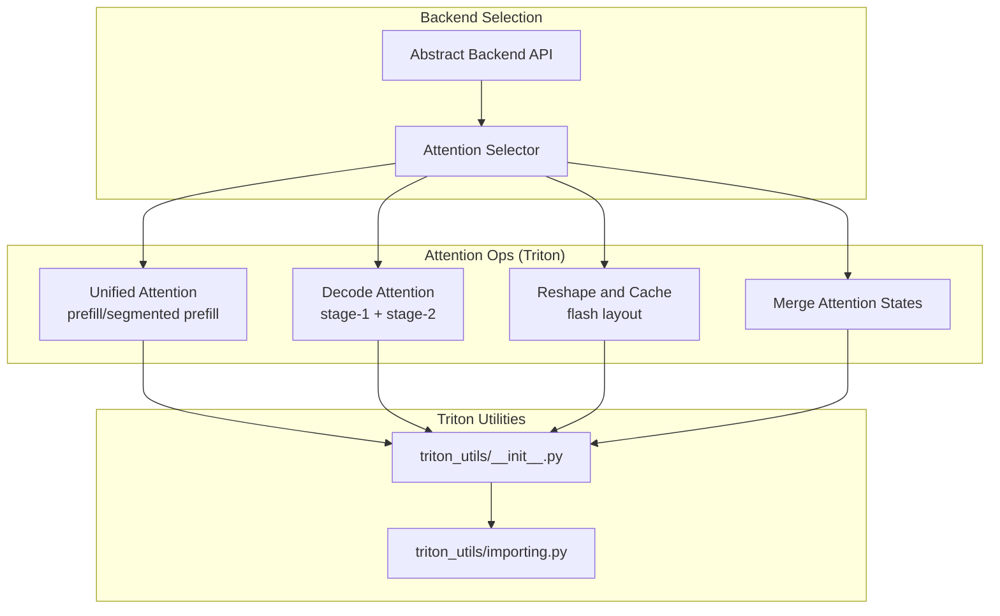
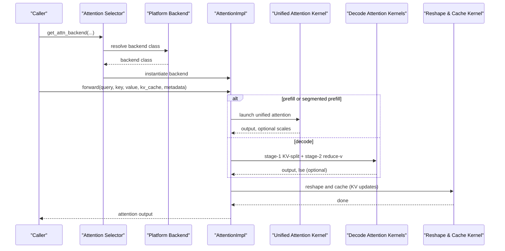
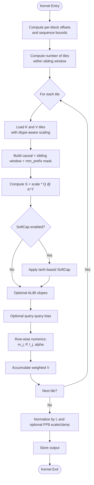
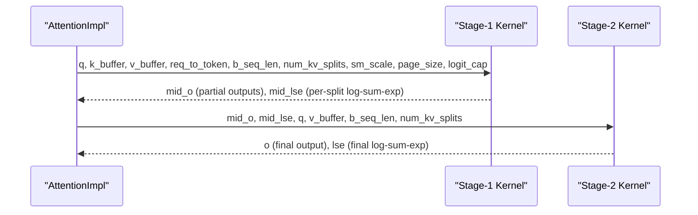
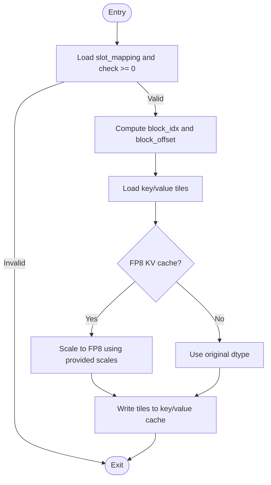
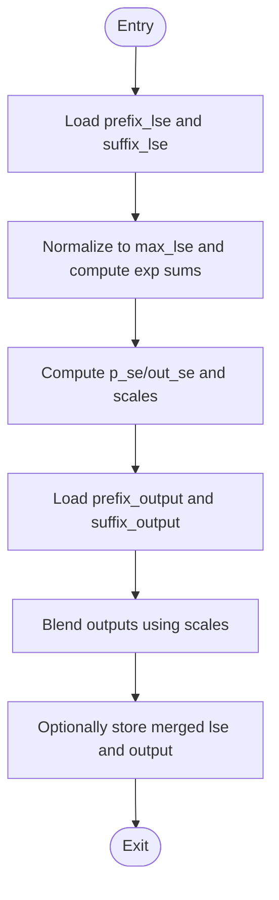
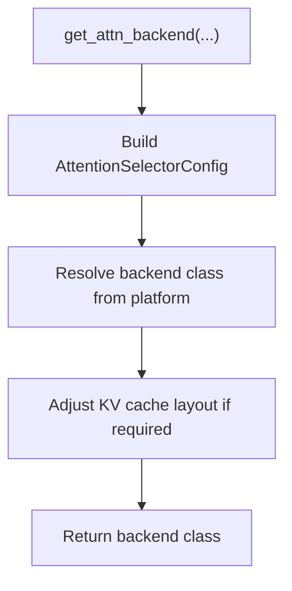
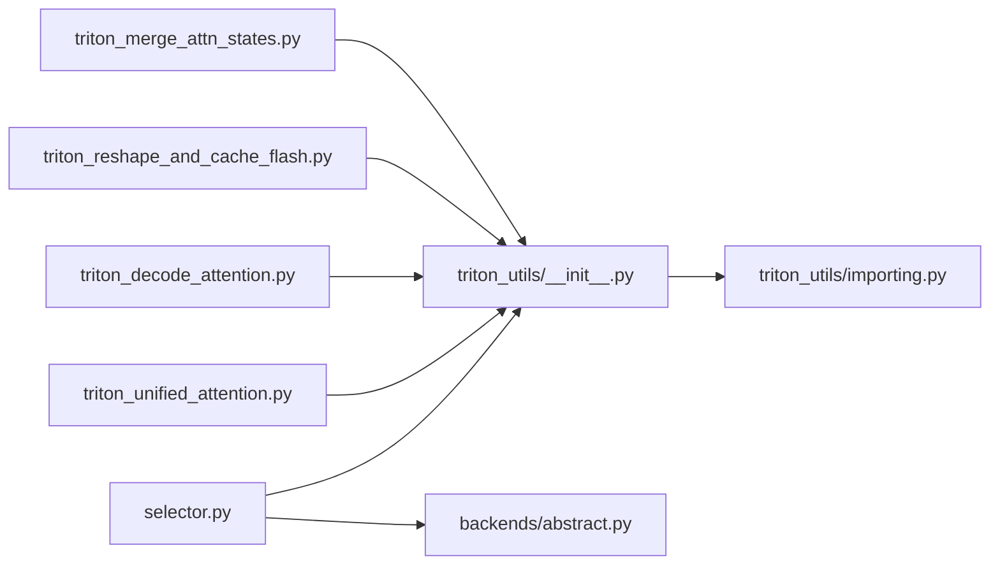

# Triton Attention Backend

<cite>
**Referenced Files in This Document**
- [triton_unified_attention.py](file://vllm/attention/ops/triton_unified_attention.py)
- [triton_decode_attention.py](file://vllm/attention/ops/triton_decode_attention.py)
- [triton_merge_attn_states.py](file://vllm/attention/ops/triton_merge_attn_states.py)
- [triton_reshape_and_cache_flash.py](file://vllm/attention/ops/triton_reshape_and_cache_flash.py)
- [selector.py](file://vllm/attention/selector.py)
- [abstract.py](file://vllm/attention/backends/abstract.py)
- [utils.py](file://vllm/attention/backends/utils.py)
- [__init__.py](file://vllm/triton_utils/__init__.py)
- [importing.py](file://vllm/triton_utils/importing.py)
</cite>

## Table of Contents
1. [Introduction](#introduction)
2. [Project Structure](#project-structure)
3. [Core Components](#core-components)
4. [Architecture Overview](#architecture-overview)
5. [Detailed Component Analysis](#detailed-component-analysis)
6. [Dependency Analysis](#dependency-analysis)
7. [Performance Considerations](#performance-considerations)
8. [Troubleshooting Guide](#troubleshooting-guide)
9. [Conclusion](#conclusion)

## Introduction
This document explains the Triton-based attention backend in vLLM, focusing on the unified attention implementation that covers both prefill and decode phases, along with supporting kernels for KV-cache reshaping, FP8 scaling, and attention state merging. It details kernel fusion strategies, memory layout optimizations, performance characteristics, and Triton-specific tuning parameters. The goal is to help users and developers understand how attention is computed efficiently on GPUs using Triton, and how to configure and optimize it for different hardware and model setups.

## Project Structure
The Triton attention backend is organized around several key modules:
- Unified attention kernels for prefill and optional segmented prefill
- Decode-time attention with stage-1 KV-split and stage-2 reduction
- KV-cache reshape-and-cache with FP8 scaling
- Attention state merging for multi-step workflows
- Backend selection and configuration utilities
- Triton language and driver compatibility wrappers

**Diagram sources**
- [triton_unified_attention.py](file://vllm/attention/ops/triton_unified_attention.py#L1-L120)
- [triton_decode_attention.py](file://vllm/attention/ops/triton_decode_attention.py#L1-L120)
- [triton_reshape_and_cache_flash.py](file://vllm/attention/ops/triton_reshape_and_cache_flash.py#L1-L80)
- [triton_merge_attn_states.py](file://vllm/attention/ops/triton_merge_attn_states.py#L1-L60)
- [selector.py](file://vllm/attention/selector.py#L1-L120)
- [abstract.py](file://vllm/attention/backends/abstract.py#L1-L120)
- [__init__.py](file://vllm/triton_utils/__init__.py#L1-L21)
- [importing.py](file://vllm/triton_utils/importing.py#L1-L66)

**Section sources**
- [triton_unified_attention.py](file://vllm/attention/ops/triton_unified_attention.py#L1-L120)
- [triton_decode_attention.py](file://vllm/attention/ops/triton_decode_attention.py#L1-L120)
- [triton_reshape_and_cache_flash.py](file://vllm/attention/ops/triton_reshape_and_cache_flash.py#L1-L80)
- [triton_merge_attn_states.py](file://vllm/attention/ops/triton_merge_attn_states.py#L1-L60)
- [selector.py](file://vllm/attention/selector.py#L1-L120)
- [abstract.py](file://vllm/attention/backends/abstract.py#L1-L120)
- [__init__.py](file://vllm/triton_utils/__init__.py#L1-L21)
- [importing.py](file://vllm/triton_utils/importing.py#L1-L66)

## Core Components
- Unified attention kernel for prefill and segmented prefill:
  - Supports sliding window, ALiBi slopes, SoftCap, multimodal token prefix ranges, sinks, and optional FP8 output scaling.
  - Uses blocked tiling and tile-pruning to reduce unnecessary work.
- Decode attention:
  - Two-stage pipeline: KV-split stage-1 with per-sequence KV splits and per-head reductions, followed by stage-2 softmax and reduce-v.
  - Supports grouped/merged head layouts and optional logit cap.
- Reshape and cache:
  - Flash-style KV-cache layout with tile-based writes and optional FP8 scaling.
- Merge attention states:
  - Numerically stable merging of prefix and suffix attention outputs using log-sum-exp blending.
- Backend selection and configuration:
  - Selects backend based on dtype, head size, block size, KV-cache dtype, and flags; adjusts KV-cache layout if required.

**Section sources**
- [triton_unified_attention.py](file://vllm/attention/ops/triton_unified_attention.py#L120-L380)
- [triton_decode_attention.py](file://vllm/attention/ops/triton_decode_attention.py#L120-L260)
- [triton_reshape_and_cache_flash.py](file://vllm/attention/ops/triton_reshape_and_cache_flash.py#L80-L185)
- [triton_merge_attn_states.py](file://vllm/attention/ops/triton_merge_attn_states.py#L1-L117)
- [selector.py](file://vllm/attention/selector.py#L46-L118)
- [abstract.py](file://vllm/attention/backends/abstract.py#L40-L120)

## Architecture Overview
The Triton attention backend integrates with the broader attention subsystem via a selection mechanism that chooses a backend implementation depending on model and runtime configuration. The selected backend exposes an implementation class that orchestrates the appropriate Triton kernels for prefill and decode, and may also adjust KV-cache layout.

**Diagram sources**
- [selector.py](file://vllm/attention/selector.py#L46-L118)
- [abstract.py](file://vllm/attention/backends/abstract.py#L292-L383)
- [triton_unified_attention.py](file://vllm/attention/ops/triton_unified_attention.py#L120-L380)
- [triton_decode_attention.py](file://vllm/attention/ops/triton_decode_attention.py#L600-L713)
- [triton_reshape_and_cache_flash.py](file://vllm/attention/ops/triton_reshape_and_cache_flash.py#L88-L185)

## Detailed Component Analysis

### Unified Attention (Prefill and Segmented Prefill)
The unified attention kernel computes attention over cached KV blocks with optional segmentation and advanced masking features. It supports:
- Blocked tiling and tile pruning based on sliding window and causal masking
- Per-sequence batching via offsets and lengths
- Optional ALiBi slopes, SoftCap, multimodal token prefix ranges, sinks
- FP8 output scaling and clamping
- Segment reduction for segmented prefill

**Diagram sources**
- [triton_unified_attention.py](file://vllm/attention/ops/triton_unified_attention.py#L120-L380)
- [triton_unified_attention.py](file://vllm/attention/ops/triton_unified_attention.py#L382-L697)
- [triton_unified_attention.py](file://vllm/attention/ops/triton_unified_attention.py#L699-L788)

**Section sources**
- [triton_unified_attention.py](file://vllm/attention/ops/triton_unified_attention.py#L120-L380)
- [triton_unified_attention.py](file://vllm/attention/ops/triton_unified_attention.py#L382-L697)
- [triton_unified_attention.py](file://vllm/attention/ops/triton_unified_attention.py#L699-L788)

### Decode Attention (Stage-1 KV-Split + Stage-2 Reduce-V)
The decode path uses a two-stage design:
- Stage-1: Split KV by sequence length into NUM_KV_SPLITS chunks and compute per-chunk partial attention, storing intermediate outputs and log-sum-exp terms.
- Stage-2: Combine partial results across KV splits with a second-pass softmax and reduce-v.

**Diagram sources**
- [triton_decode_attention.py](file://vllm/attention/ops/triton_decode_attention.py#L186-L246)
- [triton_decode_attention.py](file://vllm/attention/ops/triton_decode_attention.py#L248-L495)
- [triton_decode_attention.py](file://vllm/attention/ops/triton_decode_attention.py#L497-L600)
- [triton_decode_attention.py](file://vllm/attention/ops/triton_decode_attention.py#L600-L713)

**Section sources**
- [triton_decode_attention.py](file://vllm/attention/ops/triton_decode_attention.py#L186-L246)
- [triton_decode_attention.py](file://vllm/attention/ops/triton_decode_attention.py#L248-L495)
- [triton_decode_attention.py](file://vllm/attention/ops/triton_decode_attention.py#L497-L600)
- [triton_decode_attention.py](file://vllm/attention/ops/triton_decode_attention.py#L600-L713)

### Reshape and Cache (Flash Layout)
This kernel writes newly generated key/value tiles into the KV-cache using a flash-style layout. It supports:
- Tile-based writes to improve coalescing
- Optional FP8 scaling and implicit casting
- Page/block addressing via slot mapping

**Diagram sources**
- [triton_reshape_and_cache_flash.py](file://vllm/attention/ops/triton_reshape_and_cache_flash.py#L1-L86)
- [triton_reshape_and_cache_flash.py](file://vllm/attention/ops/triton_reshape_and_cache_flash.py#L88-L185)

**Section sources**
- [triton_reshape_and_cache_flash.py](file://vllm/attention/ops/triton_reshape_and_cache_flash.py#L1-L86)
- [triton_reshape_and_cache_flash.py](file://vllm/attention/ops/triton_reshape_and_cache_flash.py#L88-L185)

### Merge Attention States (Multi-step Workflows)
When attention is split across steps (e.g., prefix and suffix), this kernel merges the outputs and log-sum-exp terms in a numerically stable way, optionally writing the merged lse.

**Diagram sources**
- [triton_merge_attn_states.py](file://vllm/attention/ops/triton_merge_attn_states.py#L1-L42)
- [triton_merge_attn_states.py](file://vllm/attention/ops/triton_merge_attn_states.py#L44-L117)

**Section sources**
- [triton_merge_attn_states.py](file://vllm/attention/ops/triton_merge_attn_states.py#L1-L42)
- [triton_merge_attn_states.py](file://vllm/attention/ops/triton_merge_attn_states.py#L44-L117)

### Backend Selection and Configuration
The selector resolves the attention backend based on model and runtime configuration, and may adjust the KV-cache layout if the chosen backend requires a specific layout.

**Diagram sources**
- [selector.py](file://vllm/attention/selector.py#L46-L118)
- [abstract.py](file://vllm/attention/backends/abstract.py#L262-L264)

**Section sources**
- [selector.py](file://vllm/attention/selector.py#L46-L118)
- [abstract.py](file://vllm/attention/backends/abstract.py#L262-L264)

## Dependency Analysis
- Triton language and runtime:
  - The backend conditionally imports Triton and provides placeholders when unavailable.
  - Driver checks ensure a single active driver in non-distributed contexts.
- Backend contract:
  - The backend API defines capabilities, supported dtypes, block sizes, and layout requirements.
- Backend selection:
  - The selector uses platform-provided backend classes and enforces layout adjustments.

**Diagram sources**
- [__init__.py](file://vllm/triton_utils/__init__.py#L1-L21)
- [importing.py](file://vllm/triton_utils/importing.py#L1-L66)
- [selector.py](file://vllm/attention/selector.py#L46-L118)
- [abstract.py](file://vllm/attention/backends/abstract.py#L40-L120)
- [triton_unified_attention.py](file://vllm/attention/ops/triton_unified_attention.py#L1-L40)
- [triton_decode_attention.py](file://vllm/attention/ops/triton_decode_attention.py#L1-L40)
- [triton_reshape_and_cache_flash.py](file://vllm/attention/ops/triton_reshape_and_cache_flash.py#L1-L20)
- [triton_merge_attn_states.py](file://vllm/attention/ops/triton_merge_attn_states.py#L1-L10)

**Section sources**
- [__init__.py](file://vllm/triton_utils/__init__.py#L1-L21)
- [importing.py](file://vllm/triton_utils/importing.py#L1-L66)
- [selector.py](file://vllm/attention/selector.py#L46-L118)
- [abstract.py](file://vllm/attention/backends/abstract.py#L40-L120)
- [triton_unified_attention.py](file://vllm/attention/ops/triton_unified_attention.py#L1-L40)
- [triton_decode_attention.py](file://vllm/attention/ops/triton_decode_attention.py#L1-L40)
- [triton_reshape_and_cache_flash.py](file://vllm/attention/ops/triton_reshape_and_cache_flash.py#L1-L20)
- [triton_merge_attn_states.py](file://vllm/attention/ops/triton_merge_attn_states.py#L1-L10)

## Performance Considerations
- Unified attention:
  - Blocked tiling and tile pruning reduce redundant reads/writes under sliding window and causal masking.
  - Head-size padding to powers of two improves memory coalescing.
  - Optional FP8 output scaling/clamping reduces bandwidth and maintains precision.
- Decode attention:
  - KV splitting reduces register pressure and improves occupancy for long sequences.
  - Stage-2 softmax and reduce-v are designed to be lightweight after stage-1 partial results.
  - ROCm/XPU-specific tuning parameters (e.g., waves_per_eu, matrix instruction dims) are applied automatically.
- Reshape and cache:
  - Tile size heuristic adapts to head dimension and device.
  - Many stages and warps are used on CUDA to hide latency; ROCm/XPU use different heuristics.
  - FP8 scaling avoids explicit casts in kernels for supported dtypes.
- Triton tuning parameters:
  - num_stages and num_warps are tuned per device family.
  - TILE_SIZE is chosen heuristically and adjusted for older CUDA architectures.
- Memory layout:
  - Flash-style KV-cache layout enables coalesced access patterns.
  - Backend selection may enforce a specific KV-cache layout for optimal performance.

[No sources needed since this section provides general guidance]

## Troubleshooting Guide
- Triton not available or incompatible:
  - The import wrapper disables Triton if driver conditions are not met, falling back to placeholders.
- Decode warning on older Triton:
  - A benign warning about “operation scheduled before its operands” may appear on older versions; it does not affect correctness.
- KV-cache dtype constraints:
  - FP8 KV-cache requires specific supported dtypes; explicit uint8 casting is not supported in the flash reshape kernel.
- Backend layout mismatch:
  - If a backend requires a specific KV-cache layout, the selector adjusts it automatically; mismatches can lead to errors if not handled.

**Section sources**
- [importing.py](file://vllm/triton_utils/importing.py#L1-L66)
- [triton_decode_attention.py](file://vllm/attention/ops/triton_decode_attention.py#L43-L50)
- [triton_reshape_and_cache_flash.py](file://vllm/attention/ops/triton_reshape_and_cache_flash.py#L120-L143)
- [selector.py](file://vllm/attention/selector.py#L106-L117)

## Conclusion
The Triton-based attention backend in vLLM provides a unified, efficient implementation for both prefill and decode phases, with strong support for modern attention features such as sliding window, ALiBi, SoftCap, multimodal token ranges, and sinks. Its kernels are optimized for memory coalescing, device-specific tuning, and FP8 KV-cache workflows. The backend selection mechanism ensures the correct implementation is used based on configuration, and optional layout adjustments further enhance performance. Together, these components enable high-throughput, low-latency attention inference across diverse hardware platforms.