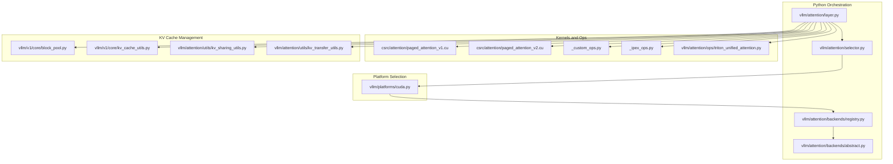
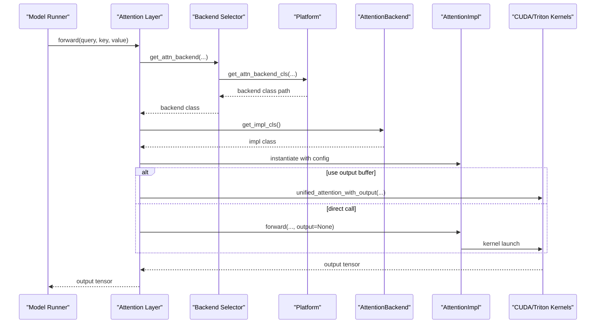
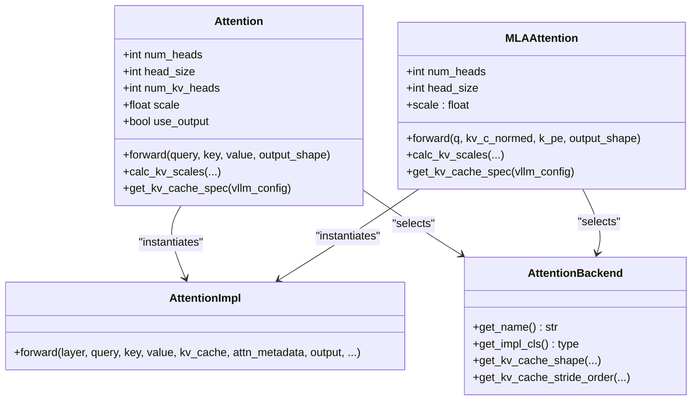
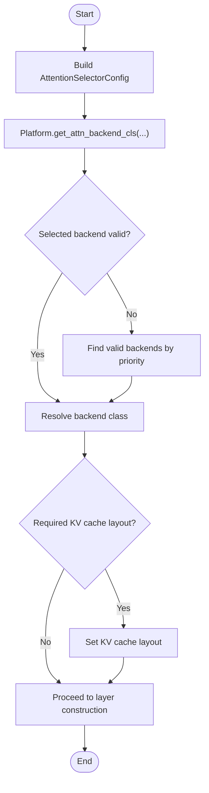
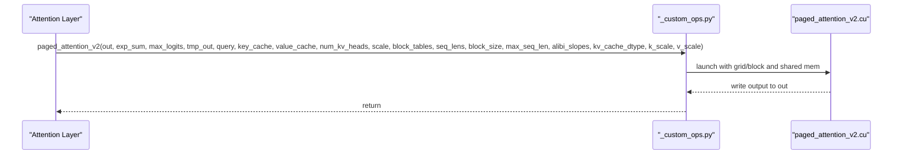
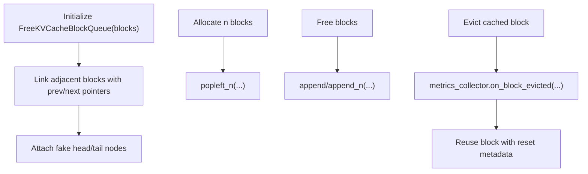
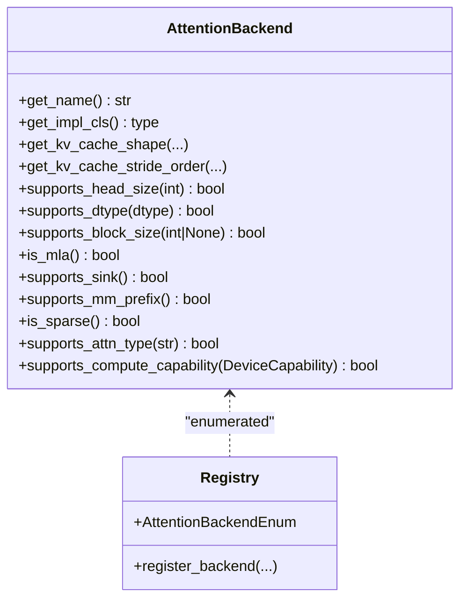
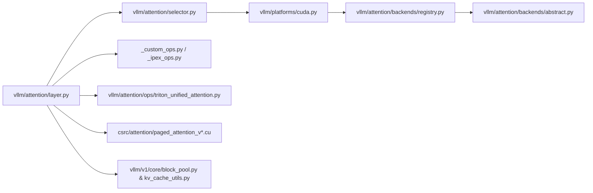

# Attention System

<cite>
**Referenced Files in This Document**
- [vllm/attention/layer.py](file://vllm/attention/layer.py)
- [vllm/attention/selector.py](file://vllm/attention/selector.py)
- [vllm/attention/backends/abstract.py](file://vllm/attention/backends/abstract.py)
- [vllm/attention/backends/registry.py](file://vllm/attention/backends/registry.py)
- [vllm/platforms/cuda.py](file://vllm/platforms/cuda.py)
- [vllm/_custom_ops.py](file://vllm/_custom_ops.py)
- [vllm/_ipex_ops.py](file://vllm/_ipex_ops.py)
- [csrc/attention/paged_attention_v2.cu](file://csrc/attention/paged_attention_v2.cu)
- [csrc/attention/paged_attention_v1.cu](file://csrc/attention/paged_attention_v1.cu)
- [vllm/v1/core/block_pool.py](file://vllm/v1/core/block_pool.py)
- [vllm/v1/core/kv_cache_utils.py](file://vllm/v1/core/kv_cache_utils.py)
- [vllm/attention/utils/kv_sharing_utils.py](file://vllm/attention/utils/kv_sharing_utils.py)
- [vllm/attention/utils/kv_transfer_utils.py](file://vllm/attention/utils/kv_transfer_utils.py)
- [vllm/attention/ops/paged_attn.py](file://vllm/attention/ops/paged_attn.py)
- [vllm/attention/ops/triton_unified_attention.py](file://vllm/attention/ops/triton_unified_attention.py)
- [vllm/attention/ops/triton_decode_attention.py](file://vllm/attention/ops/triton_decode_attention.py)
- [vllm/attention/ops/triton_reshape_and_cache_flash.py](file://vllm/attention/ops/triton_reshape_and_cache_flash.py)
- [vllm/attention/ops/triton_merge_attn_states.py](file://vllm/attention/ops/triton_merge_attn_states.py)
- [vllm/attention/ops/flashmla.py](file://vllm/attention/ops/flashmla.py)
- [vllm/attention/ops/merge_attn_states.py](file://vllm/attention/ops/merge_attn_states.py)
- [vllm/attention/ops/chunked_prefill_paged_decode.py](file://vllm/attention/ops/chunked_prefill_paged_decode.py)
- [vllm/attention/ops/prefix_prefill.py](file://vllm/attention/ops/prefix_prefill.py)
- [vllm/attention/ops/pallas_kv_cache_update.py](file://vllm/attention/ops/pallas_kv_cache_update.py)
- [vllm/attention/ops/rocm_aiter_mla_sparse.py](file://vllm/attention/ops/rocm_aiter_mla_sparse.py)
- [vllm/attention/ops/vit_attn_wrappers.py](file://vllm/attention/ops/vit_attn_wrappers.py)
- [vllm/attention/layers/chunked_local_attention.py](file://vllm/attention/layers/chunked_local_attention.py)
- [vllm/attention/layers/cross_attention.py](file://vllm/attention/layers/cross_attention.py)
- [vllm/attention/layers/encoder_only_attention.py](file://vllm/attention/layers/encoder_only_attention.py)
- [vllm/attention/layers/mm_encoder_attention.py](file://vllm/attention/layers/mm_encoder_attention.py)
- [vllm/attention/utils/fa_utils.py](file://vllm/attention/utils/fa_utils.py)
- [vllm/attention/utils/kv_sharing_utils.py](file://vllm/attention/utils/kv_sharing_utils.py)
- [vllm/attention/utils/kv_transfer_utils.py](file://vllm/attention/utils/kv_transfer_utils.py)
- [vllm/v1/attention/backends/utils.py](file://vllm/v1/attention/backends/utils.py)
</cite>

## Table of Contents
1. [Introduction](#introduction)
2. [Project Structure](#project-structure)
3. [Core Components](#core-components)
4. [Architecture Overview](#architecture-overview)
5. [Detailed Component Analysis](#detailed-component-analysis)
6. [Dependency Analysis](#dependency-analysis)
7. [Performance Considerations](#performance-considerations)
8. [Troubleshooting Guide](#troubleshooting-guide)
9. [Conclusion](#conclusion)
10. [Appendices](#appendices)

## Introduction
This document explains vLLM’s attention system with a focus on PagedAttention, attention backend selection, and KV cache management. It covers how attention backends (FlashAttention, FlashInfer, Triton, ROCm, and others) are chosen and integrated, how KV caches are laid out and managed, and how memory optimization and block management contribute to performance. Practical guidance is provided for configuration, tuning, and troubleshooting memory-related issues.

## Project Structure
The attention system spans Python orchestration, backend abstraction, platform-specific selection, and CUDA/Triton kernels. Key areas:
- Orchestration and layer wiring: attention layer wrappers and unified ops
- Backend selection: platform-aware prioritization and validation
- Backends: abstract classes and concrete implementations
- Kernels: CUDA PagedAttention variants and Triton ops
- KV cache: block pool, free queues, and transfer utilities
- Utilities: FA helpers, prefix caching, and chunked prefill

**Diagram sources**
- [vllm/attention/layer.py](file://vllm/attention/layer.py#L1-L200)
- [vllm/attention/selector.py](file://vllm/attention/selector.py#L1-L146)
- [vllm/attention/backends/registry.py](file://vllm/attention/backends/registry.py#L1-L120)
- [vllm/attention/backends/abstract.py](file://vllm/attention/backends/abstract.py#L1-L120)
- [vllm/platforms/cuda.py](file://vllm/platforms/cuda.py#L44-L120)
- [csrc/attention/paged_attention_v1.cu](file://csrc/attention/paged_attention_v1.cu#L86-L125)
- [csrc/attention/paged_attention_v2.cu](file://csrc/attention/paged_attention_v2.cu#L69-L131)
- [vllm/_custom_ops.py](file://vllm/_custom_ops.py#L73-L120)
- [vllm/_ipex_ops.py](file://vllm/_ipex_ops.py#L94-L134)
- [vllm/attention/ops/triton_unified_attention.py](file://vllm/attention/ops/triton_unified_attention.py)
- [vllm/v1/core/block_pool.py](file://vllm/v1/core/block_pool.py#L308-L344)
- [vllm/v1/core/kv_cache_utils.py](file://vllm/v1/core/kv_cache_utils.py#L165-L209)
- [vllm/attention/utils/kv_sharing_utils.py](file://vllm/attention/utils/kv_sharing_utils.py)
- [vllm/attention/utils/kv_transfer_utils.py](file://vllm/attention/utils/kv_transfer_utils.py)

**Section sources**
- [vllm/attention/layer.py](file://vllm/attention/layer.py#L1-L200)
- [vllm/attention/selector.py](file://vllm/attention/selector.py#L1-L146)
- [vllm/platforms/cuda.py](file://vllm/platforms/cuda.py#L44-L120)

## Core Components
- Attention layer wrapper: orchestrates KV cache storage, backend instantiation, and forward execution with optional output buffer and query quantization.
- Backend selection: platform-aware prioritization and validation of backends against head size, dtype, KV cache dtype, block size, and feature flags.
- Abstract backend and implementation: defines capabilities, memory layout, and forward contract for attention implementations.
- Unified ops: custom Torch ops for direct kernel invocation and fused output quantization.
- CUDA/Triton kernels: PagedAttention v1/v2 and Triton-based attention and reshape-and-cache ops.
- KV cache management: block pool and free queues for efficient allocation and eviction; utilities for KV sharing and transfer.

**Section sources**
- [vllm/attention/layer.py](file://vllm/attention/layer.py#L112-L200)
- [vllm/attention/backends/abstract.py](file://vllm/attention/backends/abstract.py#L40-L120)
- [vllm/attention/backends/registry.py](file://vllm/attention/backends/registry.py#L44-L120)
- [vllm/platforms/cuda.py](file://vllm/platforms/cuda.py#L250-L359)
- [vllm/_custom_ops.py](file://vllm/_custom_ops.py#L73-L120)
- [csrc/attention/paged_attention_v2.cu](file://csrc/attention/paged_attention_v2.cu#L69-L131)

## Architecture Overview
The attention pipeline integrates layer orchestration, backend selection, and kernel execution. The layer selects a backend based on platform and configuration, constructs an implementation, and executes attention with optional fused output buffers and query quantization. KV cache is managed separately by block pools and free queues.

**Diagram sources**
- [vllm/attention/layer.py](file://vllm/attention/layer.py#L284-L380)
- [vllm/attention/selector.py](file://vllm/attention/selector.py#L46-L119)
- [vllm/platforms/cuda.py](file://vllm/platforms/cuda.py#L290-L359)
- [vllm/_custom_ops.py](file://vllm/_custom_ops.py#L73-L120)

## Detailed Component Analysis

### Attention Layer and Unified Ops
- Initializes KV cache quantization scales and optional query quantization for FP8 KV cache scenarios.
- Selects backend via selector and constructs implementation class.
- Supports unified ops for direct kernel invocation with optional pre-allocated output buffer.
- Handles prefix caching and batch invariance constraints for specific backends.

**Diagram sources**
- [vllm/attention/layer.py](file://vllm/attention/layer.py#L112-L200)
- [vllm/attention/layer.py](file://vllm/attention/layer.py#L409-L520)
- [vllm/attention/backends/abstract.py](file://vllm/attention/backends/abstract.py#L292-L399)

**Section sources**
- [vllm/attention/layer.py](file://vllm/attention/layer.py#L112-L200)
- [vllm/attention/layer.py](file://vllm/attention/layer.py#L284-L380)
- [vllm/attention/layer.py](file://vllm/attention/layer.py#L409-L520)

### Backend Selection and Platform Integration
- Platform determines backend priorities and validates configurations.
- For MLA models, priorities differ and block size constraints are enforced.
- Selected backend may adjust KV cache layout prior to kernel execution.

**Diagram sources**
- [vllm/attention/selector.py](file://vllm/attention/selector.py#L46-L119)
- [vllm/platforms/cuda.py](file://vllm/platforms/cuda.py#L250-L359)
- [vllm/v1/attention/backends/utils.py](file://vllm/v1/attention/backends/utils.py)

**Section sources**
- [vllm/attention/selector.py](file://vllm/attention/selector.py#L46-L119)
- [vllm/platforms/cuda.py](file://vllm/platforms/cuda.py#L44-L120)
- [vllm/platforms/cuda.py](file://vllm/platforms/cuda.py#L150-L249)

### PagedAttention Implementation and Memory Layout
- CUDA kernels implement PagedAttention v1 and v2 with partitioned reduction and shared memory optimization.
- Unified ops expose paged attention to Python/Torch, passing block tables, sequence lengths, and KV cache dtype.
- KV cache shape and stride order are backend-defined to optimize memory access.

**Diagram sources**
- [vllm/_custom_ops.py](file://vllm/_custom_ops.py#L73-L120)
- [csrc/attention/paged_attention_v2.cu](file://csrc/attention/paged_attention_v2.cu#L69-L131)

**Section sources**
- [vllm/_custom_ops.py](file://vllm/_custom_ops.py#L73-L120)
- [csrc/attention/paged_attention_v2.cu](file://csrc/attention/paged_attention_v2.cu#L69-L131)
- [csrc/attention/paged_attention_v1.cu](file://csrc/attention/paged_attention_v1.cu#L86-L125)

### KV Cache Management and Block Pool
- Free block queue maintains LRU order and fast append/remove operations for efficient allocation and eviction.
- Block pool manages cached blocks and metrics collection for allocation/eviction events.

**Diagram sources**
- [vllm/v1/core/kv_cache_utils.py](file://vllm/v1/core/kv_cache_utils.py#L165-L209)
- [vllm/v1/core/block_pool.py](file://vllm/v1/core/block_pool.py#L308-L344)

**Section sources**
- [vllm/v1/core/kv_cache_utils.py](file://vllm/v1/core/kv_cache_utils.py#L165-L209)
- [vllm/v1/core/block_pool.py](file://vllm/v1/core/block_pool.py#L308-L344)

### Attention Backends: FlashAttention, FlashInfer, Triton, ROCm
- Registry enumerates supported backends including FlashAttention, FlashInfer, Triton, ROCm variants, and MLA backends.
- Abstract backend defines capabilities such as supported dtypes, head sizes, block sizes, and memory layout requirements.
- Platform-specific priorities influence selection; some backends require specific block sizes or compute capability.

**Diagram sources**
- [vllm/attention/backends/registry.py](file://vllm/attention/backends/registry.py#L44-L120)
- [vllm/attention/backends/abstract.py](file://vllm/attention/backends/abstract.py#L40-L120)
- [vllm/platforms/cuda.py](file://vllm/platforms/cuda.py#L44-L120)

**Section sources**
- [vllm/attention/backends/registry.py](file://vllm/attention/backends/registry.py#L44-L120)
- [vllm/attention/backends/abstract.py](file://vllm/attention/backends/abstract.py#L40-L120)
- [vllm/platforms/cuda.py](file://vllm/platforms/cuda.py#L44-L120)

### Triton-Based Attention and Utilities
- Triton ops provide unified attention, decode attention, reshape-and-cache for Flash, and merging of attention states.
- Useful for environments where Triton kernels are preferred or required.

**Section sources**
- [vllm/attention/ops/triton_unified_attention.py](file://vllm/attention/ops/triton_unified_attention.py)
- [vllm/attention/ops/triton_decode_attention.py](file://vllm/attention/ops/triton_decode_attention.py)
- [vllm/attention/ops/triton_reshape_and_cache_flash.py](file://vllm/attention/ops/triton_reshape_and_cache_flash.py)
- [vllm/attention/ops/triton_merge_attn_states.py](file://vllm/attention/ops/triton_merge_attn_states.py)

### MLA Attention and Sparse Variants
- MLA backends enable latent attention with compressed KV representations and optional sparsity.
- FlashMLA and FlashInfer MLA backends are registered and selected depending on platform and model configuration.

**Section sources**
- [vllm/attention/ops/flashmla.py](file://vllm/attention/ops/flashmla.py)
- [vllm/attention/backends/registry.py](file://vllm/attention/backends/registry.py#L57-L70)
- [vllm/attention/ops/rocm_aiter_mla_sparse.py](file://vllm/attention/ops/rocm_aiter_mla_sparse.py)

### Prefix Caching and Chunked Prefill
- Utilities support chunked prefill with paged decode and prefix prefill to improve throughput and reduce memory pressure.

**Section sources**
- [vllm/attention/ops/chunked_prefill_paged_decode.py](file://vllm/attention/ops/chunked_prefill_paged_decode.py)
- [vllm/attention/ops/prefix_prefill.py](file://vllm/attention/ops/prefix_prefill.py)

### KV Sharing and Transfer Utilities
- Utilities validate KV sharing targets and support transferring KV layers between contexts.

**Section sources**
- [vllm/attention/utils/kv_sharing_utils.py](file://vllm/attention/utils/kv_sharing_utils.py)
- [vllm/attention/utils/kv_transfer_utils.py](file://vllm/attention/utils/kv_transfer_utils.py)

## Dependency Analysis
The attention system exhibits layered dependencies:
- Layer depends on selector and platform for backend resolution.
- Selector depends on platform priorities and backend registry.
- Backends define capabilities consumed by layer and kernels.
- Kernels depend on unified ops and PyTorch/CUDA/Triton.

**Diagram sources**
- [vllm/attention/layer.py](file://vllm/attention/layer.py#L112-L200)
- [vllm/attention/selector.py](file://vllm/attention/selector.py#L46-L119)
- [vllm/platforms/cuda.py](file://vllm/platforms/cuda.py#L250-L359)
- [vllm/attention/backends/registry.py](file://vllm/attention/backends/registry.py#L44-L120)
- [vllm/attention/backends/abstract.py](file://vllm/attention/backends/abstract.py#L40-L120)
- [vllm/_custom_ops.py](file://vllm/_custom_ops.py#L73-L120)
- [vllm/_ipex_ops.py](file://vllm/_ipex_ops.py#L94-L134)
- [vllm/attention/ops/triton_unified_attention.py](file://vllm/attention/ops/triton_unified_attention.py)
- [csrc/attention/paged_attention_v2.cu](file://csrc/attention/paged_attention_v2.cu#L69-L131)
- [vllm/v1/core/block_pool.py](file://vllm/v1/core/block_pool.py#L308-L344)
- [vllm/v1/core/kv_cache_utils.py](file://vllm/v1/core/kv_cache_utils.py#L165-L209)

**Section sources**
- [vllm/attention/layer.py](file://vllm/attention/layer.py#L112-L200)
- [vllm/attention/selector.py](file://vllm/attention/selector.py#L46-L119)
- [vllm/platforms/cuda.py](file://vllm/platforms/cuda.py#L250-L359)
- [vllm/attention/backends/registry.py](file://vllm/attention/backends/registry.py#L44-L120)
- [vllm/attention/backends/abstract.py](file://vllm/attention/backends/abstract.py#L40-L120)

## Performance Considerations
- Backend selection prioritizes performance-sensitive backends (e.g., FlashAttention, FlashInfer) on capable GPUs; platform checks ensure compatibility.
- Head size and block size constraints affect kernel availability and performance; platform logic enforces required block sizes for specific backends (e.g., FlashMLA, CutlassMLA).
- Unified ops and output buffers reduce CPU overheads and enable fusion with upstream ops.
- Triton kernels offer flexibility and portability; FlashInfer and Triton backends may disable certain features (e.g., prefix caching with batch invariance) pending support.
- KV cache layout adjustments can improve memory coalescing; backends declare required layouts and the system applies them.

[No sources needed since this section provides general guidance]

## Troubleshooting Guide
- Backend not valid for configuration: platform validation returns reasons; adjust head size, dtype, block size, or backend selection accordingly.
- Prefix caching disabled warning: some backends (e.g., FlashInfer, Triton MLA) disable prefix caching under batch invariance constraints.
- MLA-specific constraints: ensure block size meets backend requirements (e.g., multiples of 64 or 128) and that sparse vs dense modes align with backend support.
- Memory issues: verify block pool capacity and free queue behavior; confirm KV cache dtype and scales are configured appropriately for FP8 scenarios.

**Section sources**
- [vllm/platforms/cuda.py](file://vllm/platforms/cuda.py#L250-L359)
- [vllm/attention/layer.py](file://vllm/attention/layer.py#L205-L222)

## Conclusion
vLLM’s attention system combines flexible backend selection, robust KV cache management, and high-performance kernels to deliver efficient inference. The layer abstraction cleanly integrates backend-specific implementations while exposing unified ops and optional fused output buffers. Platform-aware priorities and validation ensure backends are selected appropriately, and block management and layout choices optimize memory usage and throughput.

[No sources needed since this section summarizes without analyzing specific files]

## Appendices

### Practical Configuration and Tuning
- Backend selection: rely on platform priorities; override only when necessary and ensure compatibility.
- Block size: adhere to backend requirements (e.g., multiples of 64/128 for specific MLA backends).
- KV cache dtype and scales: configure for FP8 scenarios and enable dynamic scale calculation when needed.
- Unified ops: use when direct kernel invocation with output buffers is desired to reduce overheads.

**Section sources**
- [vllm/platforms/cuda.py](file://vllm/platforms/cuda.py#L150-L249)
- [vllm/attention/layer.py](file://vllm/attention/layer.py#L303-L380)