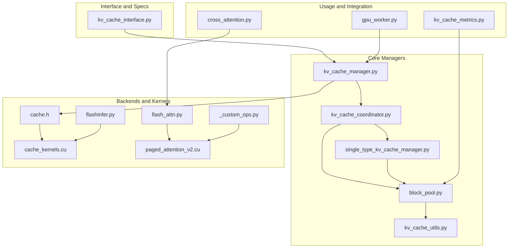
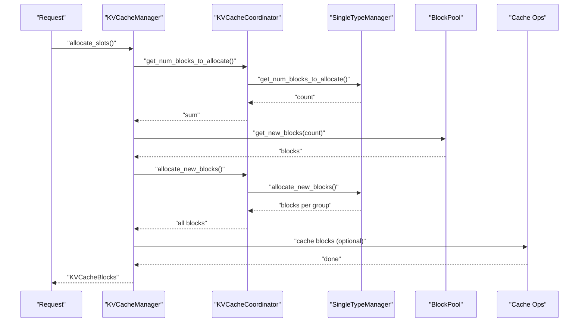
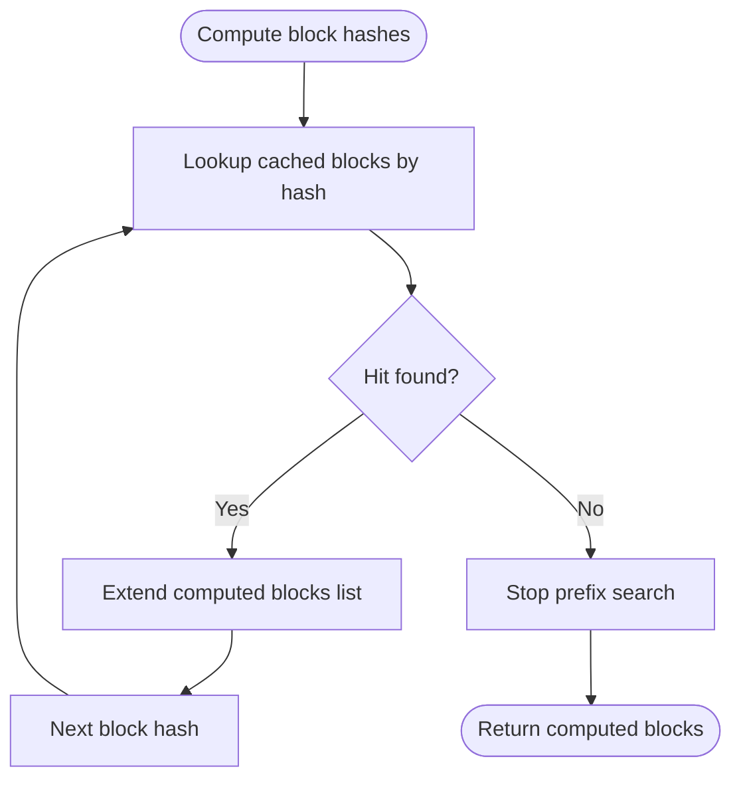
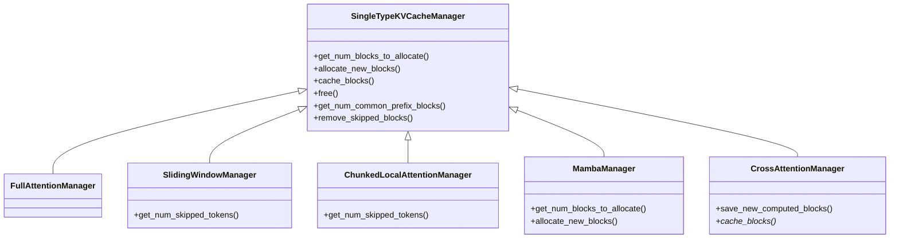
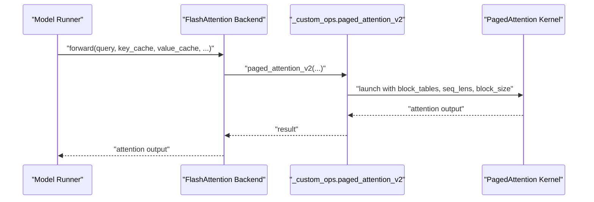
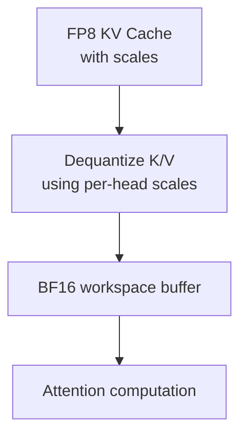
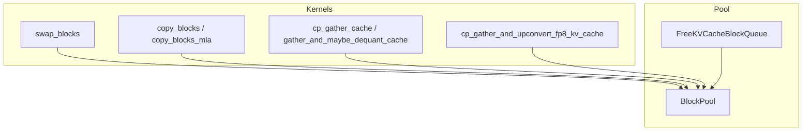
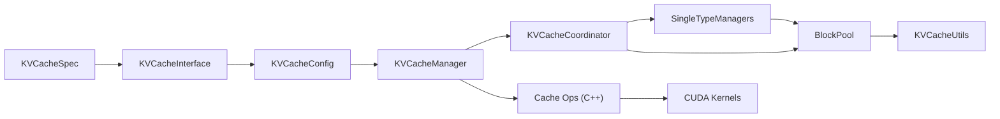

# KV Cache Management

<cite>
**Referenced Files in This Document**
- [kv_cache_interface.py](file://vllm/v1/kv_cache_interface.py)
- [kv_cache_utils.py](file://vllm/v1/core/kv_cache_utils.py)
- [block_pool.py](file://vllm/v1/core/block_pool.py)
- [single_type_kv_cache_manager.py](file://vllm/v1/core/single_type_kv_cache_manager.py)
- [kv_cache_coordinator.py](file://vllm/v1/core/kv_cache_coordinator.py)
- [kv_cache_manager.py](file://vllm/v1/core/kv_cache_manager.py)
- [cache.h](file://csrc/cache.h)
- [cache_kernels.cu](file://csrc/cache_kernels.cu)
- [flashinfer.py](file://vllm/v1/attention/backends/flashinfer.py)
- [flash_attn.py](file://vllm/v1/attention/backends/flash_attn.py)
- [cross_attention.py](file://vllm/attention/layers/cross_attention.py)
- [paged_attention_v2.cu](file://csrc/attention/paged_attention_v2.cu)
- [_custom_ops.py](file://vllm/_custom_ops.py)
- [test_cache.py](file://tests/kernels/attention/test_cache.py)
- [kv_cache_metrics.py](file://vllm/v1/core/kv_cache_metrics.py)
- [gpu_worker.py](file://vllm/v1/worker/gpu_worker.py)
- [test_prefix_caching.py](file://tests/v1/core/test_prefix_caching.py)
</cite>

## Table of Contents
1. [Introduction](#introduction)
2. [Project Structure](#project-structure)
3. [Core Components](#core-components)
4. [Architecture Overview](#architecture-overview)
5. [Detailed Component Analysis](#detailed-component-analysis)
6. [Dependency Analysis](#dependency-analysis)
7. [Performance Considerations](#performance-considerations)
8. [Troubleshooting Guide](#troubleshooting-guide)
9. [Conclusion](#conclusion)
10. [Appendices](#appendices)

## Introduction
This document explains the KV cache management subsystem in vLLM with a focus on memory optimization and cache efficiency. It covers data structures, memory layout, storage formats (including FP8 quantization), cache sharing across attention layers, encoder-decoder cache handling, cache transfer operations, memory pooling, garbage collection, integration with PagedAttention, block allocation and eviction, and practical configuration guidance. It also provides performance tuning tips and troubleshooting strategies.

## Project Structure
The KV cache system spans several modules:
- Interface and specs define cache formats and memory sizing.
- Core managers coordinate allocation, caching, and eviction across groups.
- Block pool maintains free lists, prefix caching, and metrics.
- Backends integrate with attention kernels and FP8 dequantization.
- C++/CUDA kernels implement efficient cache transfers and gathers/copies.

**Diagram sources**
- [kv_cache_interface.py](file://vllm/v1/kv_cache_interface.py#L1-L405)
- [kv_cache_manager.py](file://vllm/v1/core/kv_cache_manager.py#L1-L420)
- [kv_cache_coordinator.py](file://vllm/v1/core/kv_cache_coordinator.py#L1-L571)
- [single_type_kv_cache_manager.py](file://vllm/v1/core/single_type_kv_cache_manager.py#L1-L800)
- [block_pool.py](file://vllm/v1/core/block_pool.py#L1-L486)
- [kv_cache_utils.py](file://vllm/v1/core/kv_cache_utils.py#L1-L800)
- [flash_attn.py](file://vllm/v1/attention/backends/flash_attn.py#L608-L665)
- [flashinfer.py](file://vllm/v1/attention/backends/flashinfer.py#L104-L128)
- [cache.h](file://csrc/cache.h#L1-L86)
- [cache_kernels.cu](file://csrc/cache_kernels.cu#L1166-L1206)
- [paged_attention_v2.cu](file://csrc/attention/paged_attention_v2.cu#L43-L67)
- [_custom_ops.py](file://vllm/_custom_ops.py#L73-L120)
- [cross_attention.py](file://vllm/attention/layers/cross_attention.py#L102-L143)
- [gpu_worker.py](file://vllm/v1/worker/gpu_worker.py#L330-L347)
- [kv_cache_metrics.py](file://vllm/v1/core/kv_cache_metrics.py#L1-L97)

**Section sources**
- [kv_cache_interface.py](file://vllm/v1/kv_cache_interface.py#L1-L405)
- [kv_cache_manager.py](file://vllm/v1/core/kv_cache_manager.py#L1-L420)
- [kv_cache_coordinator.py](file://vllm/v1/core/kv_cache_coordinator.py#L1-L571)
- [single_type_kv_cache_manager.py](file://vllm/v1/core/single_type_kv_cache_manager.py#L1-L800)
- [block_pool.py](file://vllm/v1/core/block_pool.py#L1-L486)
- [kv_cache_utils.py](file://vllm/v1/core/kv_cache_utils.py#L1-L800)

## Core Components
- KVCacheSpec family defines cache format per layer type, including page size and maximum memory usage.
- KVCacheManager orchestrates prefix caching, allocation, and freeing across groups.
- KVCacheCoordinator coordinates multiple groups and integrates with SingleType managers.
- BlockPool manages free blocks, prefix caching, and eviction with reference counts and metrics.
- SingleType managers implement attention-type-specific logic (full, sliding window, chunked local, Mamba, cross-attention).
- Backends and kernels handle FP8 quantization/dequantization and efficient cache operations.

Key responsibilities:
- Memory sizing and allocation: KVCacheSpec.page_size_bytes and max_memory_usage_bytes.
- Prefix caching: BlockPool caching and retrieval keyed by block hashes.
- Attention integration: Storing and gathering K/V states for PagedAttention.
- Encoder-decoder: Cross-attention cache handling and slot mapping.

**Section sources**
- [kv_cache_interface.py](file://vllm/v1/kv_cache_interface.py#L19-L405)
- [kv_cache_manager.py](file://vllm/v1/core/kv_cache_manager.py#L94-L420)
- [kv_cache_coordinator.py](file://vllm/v1/core/kv_cache_coordinator.py#L1-L571)
- [single_type_kv_cache_manager.py](file://vllm/v1/core/single_type_kv_cache_manager.py#L1-L800)
- [block_pool.py](file://vllm/v1/core/block_pool.py#L1-L486)

## Architecture Overview
The system separates concerns across specs, managers, pools, and backends. Requests compute block hashes for prefix caching, managers query the coordinator, which delegates to single-type managers. Allocation uses a free-block queue with LRU-like eviction ordering. Kernels efficiently copy/gather cache entries and support FP8 quantization.

**Diagram sources**
- [kv_cache_manager.py](file://vllm/v1/core/kv_cache_manager.py#L206-L325)
- [kv_cache_coordinator.py](file://vllm/v1/core/kv_cache_coordinator.py#L70-L146)
- [single_type_kv_cache_manager.py](file://vllm/v1/core/single_type_kv_cache_manager.py#L122-L146)
- [block_pool.py](file://vllm/v1/core/block_pool.py#L294-L324)
- [cache.h](file://csrc/cache.h#L1-L86)

## Detailed Component Analysis

### KV Cache Data Structures and Memory Layout
- KVCacheSpec subclasses define:
  - AttentionSpec: number of KV heads, head size, dtype.
  - FullAttentionSpec: includes sliding window and chunked local attention variants.
  - MLAAttentionSpec: specialized for MLA with optional quantization string.
  - SlidingWindowSpec and ChunkedLocalAttentionSpec: attention window constraints.
  - CrossAttentionSpec: encoder-decoder cross-attention cache sizing.
  - UniformTypeKVCacheSpecs: aggregates multiple layers’ specs into a single footprint.
- Page size and max memory usage:
  - page_size_bytes computed per spec; max_memory_usage_bytes accounts for model length and context parallelism factors.
- Memory layout:
  - Key/value tensors per layer arranged as [num_blocks, block_size, num_heads, head_dim] (or similar depending on spec).
  - FP8 quantization uses separate scales per head/channel and stores quantized values.

Practical implications:
- Larger block_size reduces fragmentation but increases worst-case memory overhead.
- UniformTypeKVCacheSpecs enables shared tensors across layers when compatible.

**Section sources**
- [kv_cache_interface.py](file://vllm/v1/kv_cache_interface.py#L19-L405)

### Prefix Caching and Hash-Based Sharing
- Block hashing:
  - BlockHash is derived from parent block hash, token IDs, and optional extras (LoRA, multimodal, prompt embeds).
  - Hash chain ensures continuity; parent hash is combined with current block content.
- Prefix caching:
  - Full blocks are cached in BlockPool with BlockHashToBlockMap.
  - Retrieval finds longest prefix hit across groups; optional Eagle integration drops last block to force recomputation for draft heads.
- Eviction:
  - LRU-like ordering via FreeKVCacheBlockQueue; blocks with ref_cnt==0 are eligible for eviction.
  - Metrics tracked for sampled blocks to analyze residency.

**Diagram sources**
- [kv_cache_utils.py](file://vllm/v1/core/kv_cache_utils.py#L525-L607)
- [block_pool.py](file://vllm/v1/core/block_pool.py#L182-L217)
- [single_type_kv_cache_manager.py](file://vllm/v1/core/single_type_kv_cache_manager.py#L304-L353)

**Section sources**
- [kv_cache_utils.py](file://vllm/v1/core/kv_cache_utils.py#L1-L200)
- [block_pool.py](file://vllm/v1/core/block_pool.py#L1-L200)
- [single_type_kv_cache_manager.py](file://vllm/v1/core/single_type_kv_cache_manager.py#L304-L353)
- [test_prefix_caching.py](file://tests/v1/core/test_prefix_caching.py#L520-L777)

### Attention Types and Multi-Type Cache Handling
- Full attention and chunked local attention:
  - Use standard prefix caching; compute blocks aligned to block_size.
- Sliding window attention:
  - Skips tokens outside the window; marks earlier blocks as “null” placeholders.
- Mamba:
  - Uses specialized manager; may add speculative blocks for EAGLE/Mamba linear attention.
- Cross-attention (encoder-decoder):
  - Encoder states are request-specific; no prefix caching across requests.
  - Slot mapping adjusted to encoder sequence lengths.

**Diagram sources**
- [single_type_kv_cache_manager.py](file://vllm/v1/core/single_type_kv_cache_manager.py#L1-L800)

**Section sources**
- [single_type_kv_cache_manager.py](file://vllm/v1/core/single_type_kv_cache_manager.py#L1-L800)
- [cross_attention.py](file://vllm/attention/layers/cross_attention.py#L102-L143)

### Encoder-Decoder Cache Management
- Cross-attention caches encoder outputs per request; no inter-request sharing.
- Slot mapping is rebuilt to reflect encoder sequence lengths for attention metadata.
- Decoder attention writes K/V via reshape-and-cache ops; cross-attention reads from cached encoder states.

**Section sources**
- [cross_attention.py](file://vllm/attention/layers/cross_attention.py#L102-L143)
- [flash_attn.py](file://vllm/v1/attention/backends/flash_attn.py#L608-L665)

### PagedAttention Integration and Block Allocation
- PagedAttention uses block tables and sequence lengths to gather K/V from cache.
- v1 backend exposes paged_attention_v2 with explicit block_size and kv_cache_dtype.
- CUDA kernels implement efficient gather/copy for cache-to-workspace transfers.

**Diagram sources**
- [_custom_ops.py](file://vllm/_custom_ops.py#L73-L120)
- [paged_attention_v2.cu](file://csrc/attention/paged_attention_v2.cu#L43-L67)

**Section sources**
- [_custom_ops.py](file://vllm/_custom_ops.py#L73-L120)
- [paged_attention_v2.cu](file://csrc/attention/paged_attention_v2.cu#L43-L67)

### FP8 Quantization Support and Dequantization
- Storage formats:
  - FP8 KV cache stored alongside scales; gather/dequantization performed in backends.
- FlashInfer backend dequantizes FP8 K/V using per-head scales and writes to a dequantized workspace.
- FP8 gather and upconvert kernels support conversion to higher precision workspaces.

**Diagram sources**
- [flashinfer.py](file://vllm/v1/attention/backends/flashinfer.py#L104-L128)
- [cache.h](file://csrc/cache.h#L62-L86)

**Section sources**
- [flashinfer.py](file://vllm/v1/attention/backends/flashinfer.py#L104-L128)
- [cache.h](file://csrc/cache.h#L62-L86)

### Cache Transfer Operations and Memory Pooling
- Swap and copy blocks:
  - swap_blocks and copy_blocks move cached data between regions or devices.
  - copy_blocks_mla handles MLA-specific layouts.
- Gather and scatter:
  - cp_gather_cache copies token slices by block_table indices.
  - cp_gather_and_upconvert_fp8_kv_cache converts FP8 to BF16 workspace.
- Memory pooling:
  - FreeKVCacheBlockQueue implements O(1) removal/appending for LRU ordering.
  - BlockPool tracks ref_counts and evicts eligible blocks; metrics sampling records residency.

**Diagram sources**
- [cache.h](file://csrc/cache.h#L1-L86)
- [cache_kernels.cu](file://csrc/cache_kernels.cu#L1166-L1206)
- [block_pool.py](file://vllm/v1/core/block_pool.py#L156-L206)

**Section sources**
- [cache.h](file://csrc/cache.h#L1-L86)
- [cache_kernels.cu](file://csrc/cache_kernels.cu#L1166-L1206)
- [block_pool.py](file://vllm/v1/core/block_pool.py#L156-L206)
- [test_cache.py](file://tests/kernels/attention/test_cache.py#L865-L1080)

### Garbage Collection and Eviction Policies
- Reference counting:
  - Blocks with ref_cnt==0 are eligible for eviction; touch() increments ref_cnt and removes from free list.
- Eviction:
  - LRU ordering via FreeKVCacheBlockQueue; evict_blocks() removes cached hashes and resets block metadata.
- Metrics:
  - KVCacheMetricsCollector samples blocks and records lifetime/idle/reuse gaps; drains eviction events.

**Section sources**
- [block_pool.py](file://vllm/v1/core/block_pool.py#L366-L486)
- [kv_cache_metrics.py](file://vllm/v1/core/kv_cache_metrics.py#L1-L97)

## Dependency Analysis
The following diagram shows key dependencies among core components:

**Diagram sources**
- [kv_cache_interface.py](file://vllm/v1/kv_cache_interface.py#L387-L405)
- [kv_cache_manager.py](file://vllm/v1/core/kv_cache_manager.py#L94-L142)
- [kv_cache_coordinator.py](file://vllm/v1/core/kv_cache_coordinator.py#L28-L104)
- [single_type_kv_cache_manager.py](file://vllm/v1/core/single_type_kv_cache_manager.py#L1-L120)
- [block_pool.py](file://vllm/v1/core/block_pool.py#L147-L206)
- [kv_cache_utils.py](file://vllm/v1/core/kv_cache_utils.py#L723-L751)
- [cache.h](file://csrc/cache.h#L1-L86)

**Section sources**
- [kv_cache_interface.py](file://vllm/v1/kv_cache_interface.py#L387-L405)
- [kv_cache_manager.py](file://vllm/v1/core/kv_cache_manager.py#L94-L142)
- [kv_cache_coordinator.py](file://vllm/v1/core/kv_cache_coordinator.py#L28-L104)
- [single_type_kv_cache_manager.py](file://vllm/v1/core/single_type_kv_cache_manager.py#L1-L120)
- [block_pool.py](file://vllm/v1/core/block_pool.py#L147-L206)
- [kv_cache_utils.py](file://vllm/v1/core/kv_cache_utils.py#L723-L751)
- [cache.h](file://csrc/cache.h#L1-L86)

## Performance Considerations
- Memory sizing:
  - Use UniformTypeKVCacheSpecs to minimize tensor duplication and maximize shared allocations.
  - Estimate max_model_len fitting available memory using provided helpers.
- Block size tuning:
  - Larger block_size reduces overhead but increases worst-case memory; choose based on model and workload.
- Attention window constraints:
  - Sliding window and chunked local attention reduce KV footprint by skipping older tokens; leverage these where applicable.
- FP8 quantization:
  - Store FP8 KV cache with per-head scales; use dequantization kernels only when necessary to reduce bandwidth.
- Prefetch and alignment:
  - Ensure cache hit lengths align to LCM of block sizes in hybrid setups to avoid partial block penalties.
- Metrics-driven eviction:
  - Monitor residency metrics to tune cache sizes and detect hotspots.

[No sources needed since this section provides general guidance]

## Troubleshooting Guide
Common issues and remedies:
- Out-of-memory during initialization:
  - The worker estimates available KV cache memory post-profiling; ensure sufficient gpu_memory_utilization or reduce max_model_len.
- Insufficient free blocks:
  - Allocation returns None when free blocks are unavailable; free or evict blocks and retry.
- Prefix caching not helping:
  - Disable caching for specific requests or flows; verify block hashes and enable events for diagnostics.
- Cross-attention not benefiting from caching:
  - Expected behavior; encoder states are request-specific.
- FP8 dequantization artifacts:
  - Verify per-head scales and ensure dequantization is applied before attention.

**Section sources**
- [gpu_worker.py](file://vllm/v1/worker/gpu_worker.py#L330-L347)
- [kv_cache_manager.py](file://vllm/v1/core/kv_cache_manager.py#L287-L309)
- [kv_cache_utils.py](file://vllm/v1/core/kv_cache_utils.py#L664-L721)
- [cross_attention.py](file://vllm/attention/layers/cross_attention.py#L102-L143)

## Conclusion
The vLLM KV cache system provides a flexible, efficient framework for managing attention state across diverse architectures. Its modular design supports multiple attention types, FP8 quantization, and robust prefix caching. By tuning block sizes, leveraging attention windows, and monitoring residency metrics, users can achieve significant memory savings and throughput improvements.

[No sources needed since this section summarizes without analyzing specific files]

## Appendices

### Practical Configuration Examples
- Small model with constrained GPU memory:
  - Reduce block_size and enable sliding window where appropriate; use FP8 KV cache.
- Large context decoding:
  - Increase block_size moderately; rely on prefix caching; monitor residency metrics.
- Encoder-decoder serving:
  - Expect cross-attention to not benefit from prefix caching; size encoder cache according to scheduler’s max_encoder_input_tokens.

[No sources needed since this section provides general guidance]