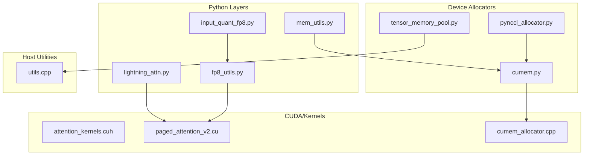
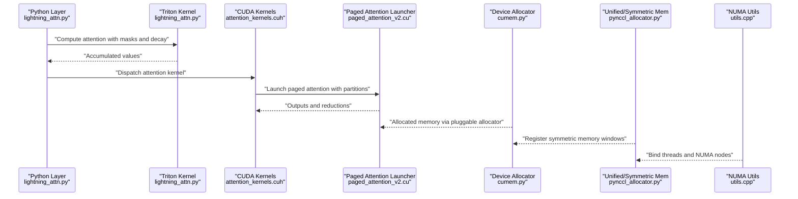
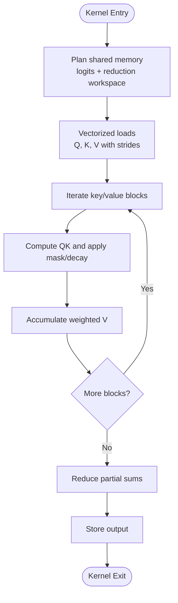
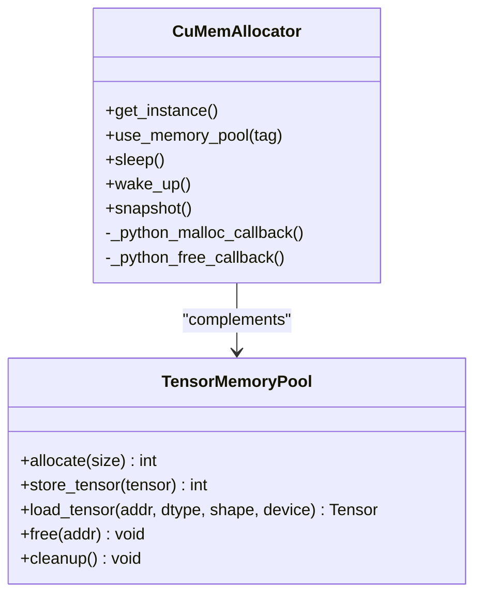
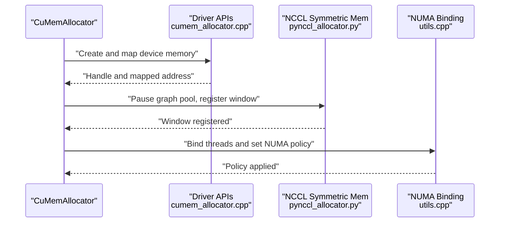
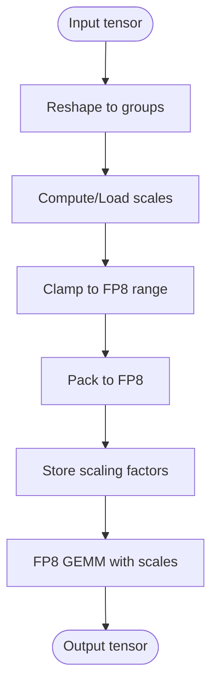
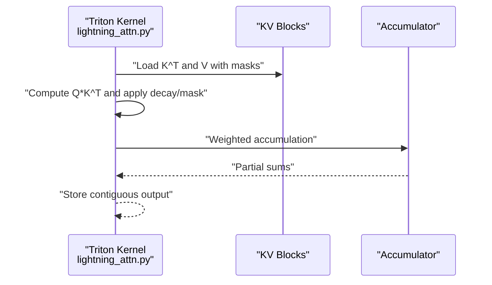
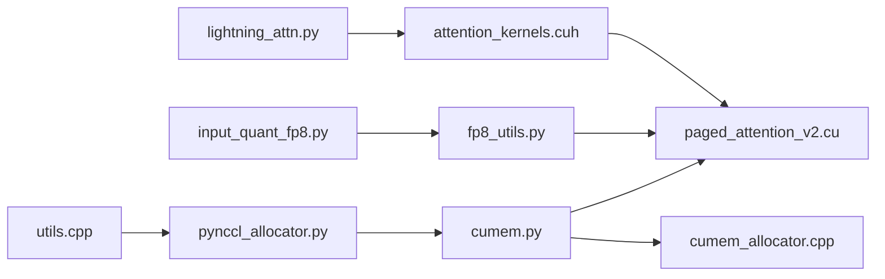

# Memory Optimization Techniques

<cite>
**Referenced Files in This Document**
- [attention_kernels.cuh](file://csrc/attention/attention_kernels.cuh)
- [paged_attention_v2.cu](file://csrc/attention/paged_attention_v2.cu)
- [lightning_attn.py](file://vllm/model_executor/layers/lightning_attn.py)
- [input_quant_fp8.py](file://vllm/model_executor/layers/quantization/input_quant_fp8.py)
- [fp8_utils.py](file://vllm/model_executor/layers/quantization/utils/fp8_utils.py)
- [tensor_memory_pool.py](file://vllm/distributed/kv_transfer/kv_connector/v1/p2p/tensor_memory_pool.py)
- [cumem.py](file://vllm/device_allocator/cumem.py)
- [cumem_allocator.cpp](file://csrc/cumem_allocator.cpp)
- [pynccl_allocator.py](file://vllm/distributed/device_communicators/pynccl_allocator.py)
- [utils.cpp](file://csrc/cpu/utils.cpp)
- [mem_utils.py](file://vllm/utils/mem_utils.py)
- [test_mem_utils.py](file://tests/utils_/test_mem_utils.py)
- [gpu_worker.py](file://vllm/v1/worker/gpu_worker.py)
- [pynvml.py](file://vllm/third_party/pynvml.py)
- [test_cumem.py](file://tests/basic_correctness/test_cumem.py)
</cite>

## Table of Contents
1. [Introduction](#introduction)
2. [Project Structure](#project-structure)
3. [Core Components](#core-components)
4. [Architecture Overview](#architecture-overview)
5. [Detailed Component Analysis](#detailed-component-analysis)
6. [Dependency Analysis](#dependency-analysis)
7. [Performance Considerations](#performance-considerations)
8. [Troubleshooting Guide](#troubleshooting-guide)
9. [Conclusion](#conclusion)
10. [Appendices](#appendices)

## Introduction
This document presents a comprehensive guide to memory optimization techniques in the attention system of the repository. It focuses on:
- Memory layout optimizations: tensor reshaping, contiguous memory access patterns, and cache-friendly data structures
- Block pooling mechanisms, memory pre-allocation strategies, and dynamic memory management
- Hardware-specific optimizations: CUDA memory pools, unified memory access, and NUMA-aware allocations
- Quantization-aware memory optimization: FP8 scaling factor management and memory bandwidth reduction
- Practical examples of memory profiling, bottleneck identification, and optimization strategies across deployment scenarios
- Memory leak prevention, resource cleanup procedures, and monitoring tools for memory usage tracking

## Project Structure
The attention system spans both Python and C++/CUDA layers:
- Python attention layers and quantization utilities
- Triton kernels for specialized attention patterns
- CUDA kernels implementing paged attention with block-wise processing
- Device allocators and memory pools for GPU memory lifecycle management
- CPU-side NUMA utilities for host memory binding
- Memory profiling and monitoring utilities

**Diagram sources**
- [lightning_attn.py](file://vllm/model_executor/layers/lightning_attn.py#L96-L136)
- [input_quant_fp8.py](file://vllm/model_executor/layers/quantization/input_quant_fp8.py#L188-L202)
- [fp8_utils.py](file://vllm/model_executor/layers/quantization/utils/fp8_utils.py#L1-L200)
- [attention_kernels.cuh](file://csrc/attention/attention_kernels.cuh#L1-L200)
- [paged_attention_v2.cu](file://csrc/attention/paged_attention_v2.cu#L1-L197)
- [cumem.py](file://vllm/device_allocator/cumem.py#L1-L200)
- [cumem_allocator.cpp](file://csrc/cumem_allocator.cpp#L120-L351)
- [tensor_memory_pool.py](file://vllm/distributed/kv_transfer/kv_connector/v1/p2p/tensor_memory_pool.py#L43-L273)
- [pynccl_allocator.py](file://vllm/distributed/device_communicators/pynccl_allocator.py#L156-L191)
- [utils.cpp](file://csrc/cpu/utils.cpp#L45-L108)
- [mem_utils.py](file://vllm/utils/mem_utils.py#L127-L161)

**Section sources**
- [attention_kernels.cuh](file://csrc/attention/attention_kernels.cuh#L1-L200)
- [paged_attention_v2.cu](file://csrc/attention/paged_attention_v2.cu#L1-L197)
- [lightning_attn.py](file://vllm/model_executor/layers/lightning_attn.py#L96-L136)
- [input_quant_fp8.py](file://vllm/model_executor/layers/quantization/input_quant_fp8.py#L188-L202)
- [fp8_utils.py](file://vllm/model_executor/layers/quantization/utils/fp8_utils.py#L1-L200)
- [tensor_memory_pool.py](file://vllm/distributed/kv_transfer/kv_connector/v1/p2p/tensor_memory_pool.py#L43-L273)
- [cumem.py](file://vllm/device_allocator/cumem.py#L1-L200)
- [cumem_allocator.cpp](file://csrc/cumem_allocator.cpp#L120-L351)
- [pynccl_allocator.py](file://vllm/distributed/device_communicators/pynccl_allocator.py#L156-L191)
- [utils.cpp](file://csrc/cpu/utils.cpp#L45-L108)
- [mem_utils.py](file://vllm/utils/mem_utils.py#L127-L161)

## Core Components
- Paged attention CUDA kernels: block-wise processing with partitioning, shared memory planning, and vectorized loads for cache-friendly access
- Triton-based attention: masked causal attention with block pointers and contiguous accumulation
- Quantization-aware FP8 utilities: per-token/group quantization, scaling factor management, and GEMM integration
- Device memory pools: pluggable allocator with sleep/wake semantics, tag-based allocation, and explicit cleanup
- Unified memory and symmetric memory windows for device communication
- NUMA-aware CPU memory binding and migration
- Memory profiling utilities and monitoring for non-Torch and Torch memory

**Section sources**
- [attention_kernels.cuh](file://csrc/attention/attention_kernels.cuh#L1-L200)
- [paged_attention_v2.cu](file://csrc/attention/paged_attention_v2.cu#L1-L197)
- [lightning_attn.py](file://vllm/model_executor/layers/lightning_attn.py#L96-L136)
- [input_quant_fp8.py](file://vllm/model_executor/layers/quantization/input_quant_fp8.py#L188-L202)
- [fp8_utils.py](file://vllm/model_executor/layers/quantization/utils/fp8_utils.py#L1-L200)
- [tensor_memory_pool.py](file://vllm/distributed/kv_transfer/kv_connector/v1/p2p/tensor_memory_pool.py#L43-L273)
- [cumem.py](file://vllm/device_allocator/cumem.py#L1-L200)
- [cumem_allocator.cpp](file://csrc/cumem_allocator.cpp#L120-L351)
- [pynccl_allocator.py](file://vllm/distributed/device_communicators/pynccl_allocator.py#L156-L191)
- [utils.cpp](file://csrc/cpu/utils.cpp#L45-L108)
- [mem_utils.py](file://vllm/utils/mem_utils.py#L127-L161)

## Architecture Overview
The attention pipeline integrates Python layers, Triton kernels, and CUDA kernels with device memory management and profiling:

**Diagram sources**
- [lightning_attn.py](file://vllm/model_executor/layers/lightning_attn.py#L96-L136)
- [attention_kernels.cuh](file://csrc/attention/attention_kernels.cuh#L1-L200)
- [paged_attention_v2.cu](file://csrc/attention/paged_attention_v2.cu#L1-L197)
- [cumem.py](file://vllm/device_allocator/cumem.py#L1-L200)
- [pynccl_allocator.py](file://vllm/distributed/device_communicators/pynccl_allocator.py#L156-L191)
- [utils.cpp](file://csrc/cpu/utils.cpp#L45-L108)

## Detailed Component Analysis

### Memory Layout Optimizations in Attention Kernels
Key strategies:
- Vectorized loads and cache-friendly access: vector types align with 16-byte fetch granularity to maximize coalesced access
- Shared memory planning: logits and reduction buffers are allocated contiguously in shared memory to minimize bank conflicts
- Partitioned processing: sequences are processed in partitions to fit within shared memory limits and reduce register pressure
- Stride-aware indexing: strides for queries and KV caches are used to support non-contiguous layouts without extra copies

**Diagram sources**
- [attention_kernels.cuh](file://csrc/attention/attention_kernels.cuh#L1-L200)
- [paged_attention_v2.cu](file://csrc/attention/paged_attention_v2.cu#L1-L197)

**Section sources**
- [attention_kernels.cuh](file://csrc/attention/attention_kernels.cuh#L1-L200)
- [paged_attention_v2.cu](file://csrc/attention/paged_attention_v2.cu#L1-L197)

### Block Pooling Mechanisms and Dynamic Memory Management
- Pluggable CUDA allocator: wraps driver APIs to provide a custom memory pool with tag-based allocation and explicit lifecycle control
- Sleep/wake semantics: offloads tagged allocations to CPU and discards others; restores on wake-up
- Snapshot-based cleanup: enumerates unused allocations and releases them to prevent leaks
- Symmetric memory windows: registers memory segments with NCCL for efficient device-to-device transfers under graph capture

**Diagram sources**
- [cumem.py](file://vllm/device_allocator/cumem.py#L1-L200)
- [tensor_memory_pool.py](file://vllm/distributed/kv_transfer/kv_connector/v1/p2p/tensor_memory_pool.py#L43-L273)

**Section sources**
- [cumem.py](file://vllm/device_allocator/cumem.py#L1-L200)
- [tensor_memory_pool.py](file://vllm/distributed/kv_transfer/kv_connector/v1/p2p/tensor_memory_pool.py#L43-L273)
- [pynccl_allocator.py](file://vllm/distributed/device_communicators/pynccl_allocator.py#L156-L191)

### Hardware-Specific Optimizations
- Unified memory and symmetric memory windows: registers memory segments with NCCL to enable zero-copy-like transfers under graph capture
- NUMA-aware CPU memory binding: migrates process pages to target NUMA nodes and sets strict memory bindings to reduce cross-NUMA traffic
- Driver-level allocation: uses CUDA driver APIs to create and map generic allocations with device access descriptors

**Diagram sources**
- [cumem.py](file://vllm/device_allocator/cumem.py#L1-L200)
- [cumem_allocator.cpp](file://csrc/cumem_allocator.cpp#L120-L351)
- [pynccl_allocator.py](file://vllm/distributed/device_communicators/pynccl_allocator.py#L156-L191)
- [utils.cpp](file://csrc/cpu/utils.cpp#L45-L108)

**Section sources**
- [cumem_allocator.cpp](file://csrc/cumem_allocator.cpp#L120-L351)
- [pynccl_allocator.py](file://vllm/distributed/device_communicators/pynccl_allocator.py#L156-L191)
- [utils.cpp](file://csrc/cpu/utils.cpp#L45-L108)

### Quantization-Aware Memory Optimization (FP8)
- Per-token/group quantization: reshapes inputs to group-aligned shapes, clamps to FP8 ranges, and stores scaling factors
- Scaling factor management: scales are stored and transposed when needed for column-major layouts
- Quantized GEMM integration: FP8 GEMM operations leverage block-wise scaling and optimized layouts to reduce memory bandwidth

**Diagram sources**
- [input_quant_fp8.py](file://vllm/model_executor/layers/quantization/input_quant_fp8.py#L188-L202)
- [fp8_utils.py](file://vllm/model_executor/layers/quantization/utils/fp8_utils.py#L1-L200)

**Section sources**
- [input_quant_fp8.py](file://vllm/model_executor/layers/quantization/input_quant_fp8.py#L188-L202)
- [fp8_utils.py](file://vllm/model_executor/layers/quantization/utils/fp8_utils.py#L1-L200)

### Triton-Based Attention with Contiguous Accumulation
- Masked causal attention with decay and block pointers
- Contiguous accumulation of weighted values into registers and stores
- Efficient masking and boundary checks to avoid out-of-range loads

**Diagram sources**
- [lightning_attn.py](file://vllm/model_executor/layers/lightning_attn.py#L96-L136)

**Section sources**
- [lightning_attn.py](file://vllm/model_executor/layers/lightning_attn.py#L96-L136)

## Dependency Analysis
Attention and memory optimization components depend on:
- CUDA kernels for block-wise attention computation
- Quantization utilities for FP8 scaling and packing
- Device allocator for memory lifecycle management
- NCCL for symmetric memory windows
- NUMA utilities for CPU memory binding

**Diagram sources**
- [lightning_attn.py](file://vllm/model_executor/layers/lightning_attn.py#L96-L136)
- [attention_kernels.cuh](file://csrc/attention/attention_kernels.cuh#L1-L200)
- [paged_attention_v2.cu](file://csrc/attention/paged_attention_v2.cu#L1-L197)
- [input_quant_fp8.py](file://vllm/model_executor/layers/quantization/input_quant_fp8.py#L188-L202)
- [fp8_utils.py](file://vllm/model_executor/layers/quantization/utils/fp8_utils.py#L1-L200)
- [cumem.py](file://vllm/device_allocator/cumem.py#L1-L200)
- [cumem_allocator.cpp](file://csrc/cumem_allocator.cpp#L120-L351)
- [pynccl_allocator.py](file://vllm/distributed/device_communicators/pynccl_allocator.py#L156-L191)
- [utils.cpp](file://csrc/cpu/utils.cpp#L45-L108)

**Section sources**
- [attention_kernels.cuh](file://csrc/attention/attention_kernels.cuh#L1-L200)
- [paged_attention_v2.cu](file://csrc/attention/paged_attention_v2.cu#L1-L197)
- [lightning_attn.py](file://vllm/model_executor/layers/lightning_attn.py#L96-L136)
- [input_quant_fp8.py](file://vllm/model_executor/layers/quantization/input_quant_fp8.py#L188-L202)
- [fp8_utils.py](file://vllm/model_executor/layers/quantization/utils/fp8_utils.py#L1-L200)
- [cumem.py](file://vllm/device_allocator/cumem.py#L1-L200)
- [cumem_allocator.cpp](file://csrc/cumem_allocator.cpp#L120-L351)
- [pynccl_allocator.py](file://vllm/distributed/device_communicators/pynccl_allocator.py#L156-L191)
- [utils.cpp](file://csrc/cpu/utils.cpp#L45-L108)

## Performance Considerations
- Prefer vectorized loads and contiguous memory layouts to improve cache locality and reduce bank conflicts
- Use partitioned processing to fit intermediate buffers in shared memory and reduce register pressure
- Employ FP8 quantization to halve activation and KV-cache sizes, reducing memory bandwidth and storage requirements
- Utilize unified/symmetric memory windows for device-to-device transfers under CUDA graphs to avoid staging overhead
- Apply NUMA-aware CPU memory binding to minimize cross-node memory traffic during host-device transfers
- Monitor memory usage with profiling utilities and ensure proper cleanup to prevent leaks and fragmentation

[No sources needed since this section provides general guidance]

## Troubleshooting Guide
Common issues and remedies:
- Memory leaks after quantization or graph capture: use snapshot-based cleanup to manually release unused allocations
- Non-Torch memory increases: measure and validate with memory profiling utilities; ensure external allocations are tracked
- Cross-process memory interference: isolate profiling runs and verify free memory deltas remain consistent
- NCCL symmetric memory registration failures: confirm NCCL version and graph capture compatibility; pause/resume graph pool around registration

**Section sources**
- [cumem.py](file://vllm/device_allocator/cumem.py#L290-L317)
- [test_mem_utils.py](file://tests/utils_/test_mem_utils.py#L36-L63)
- [gpu_worker.py](file://vllm/v1/worker/gpu_worker.py#L330-L347)
- [pynccl_allocator.py](file://vllm/distributed/device_communicators/pynccl_allocator.py#L156-L191)
- [test_cumem.py](file://tests/basic_correctness/test_cumem.py#L43-L87)

## Conclusion
The attention system leverages a combination of vectorized CUDA kernels, partitioned processing, FP8 quantization, and advanced device memory management to achieve high throughput with reduced memory footprint. By applying cache-friendly layouts, unified memory windows, and robust profiling/cleanup procedures, deployments can maintain stability and performance across diverse hardware configurations.

[No sources needed since this section summarizes without analyzing specific files]

## Appendices

### Practical Memory Profiling Workflow
- Baseline snapshot before workload
- Measure Torch and non-Torch memory increases
- Validate against expected spikes (e.g., 1 GiB)
- Compare ratios with tolerances for CUDA runtime variance
- Track peak activation and non-KV cache memory post-profiling

**Section sources**
- [mem_utils.py](file://vllm/utils/mem_utils.py#L127-L161)
- [test_mem_utils.py](file://tests/utils_/test_mem_utils.py#L36-L63)
- [gpu_worker.py](file://vllm/v1/worker/gpu_worker.py#L330-L347)

### Monitoring Tools and Metrics
- NVML-based retirement and page status for hardware diagnostics
- Memory profiling utilities for Torch and non-Torch memory deltas
- Worker-level reporting of peak activation and available KV cache memory

**Section sources**
- [pynvml.py](file://vllm/third_party/pynvml.py#L3870-L3938)
- [mem_utils.py](file://vllm/utils/mem_utils.py#L127-L161)
- [gpu_worker.py](file://vllm/v1/worker/gpu_worker.py#L330-L347)