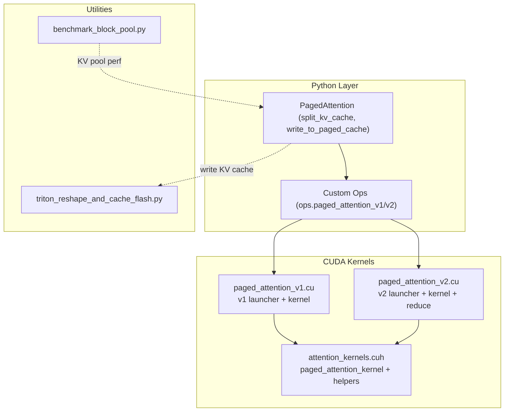
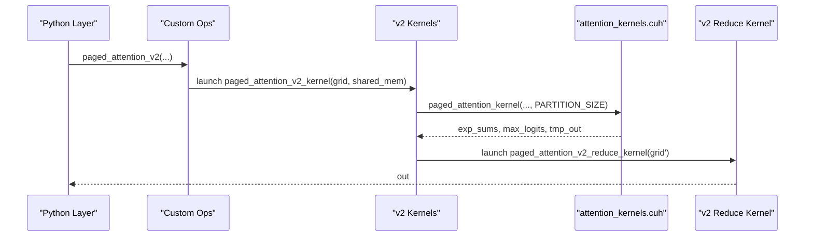
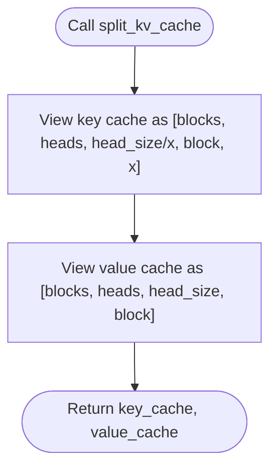
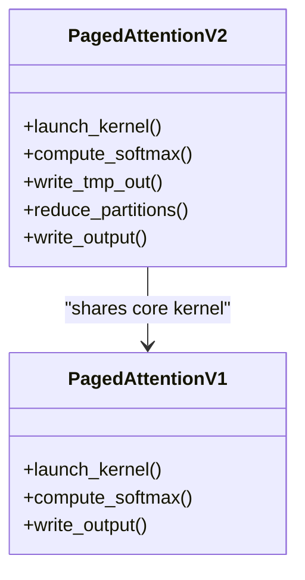
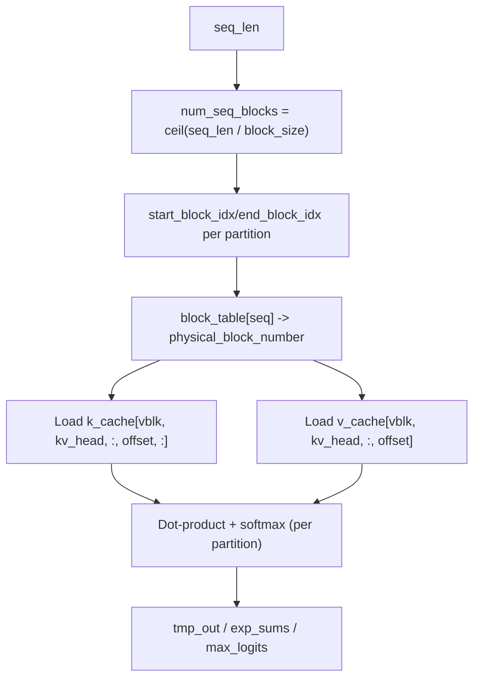
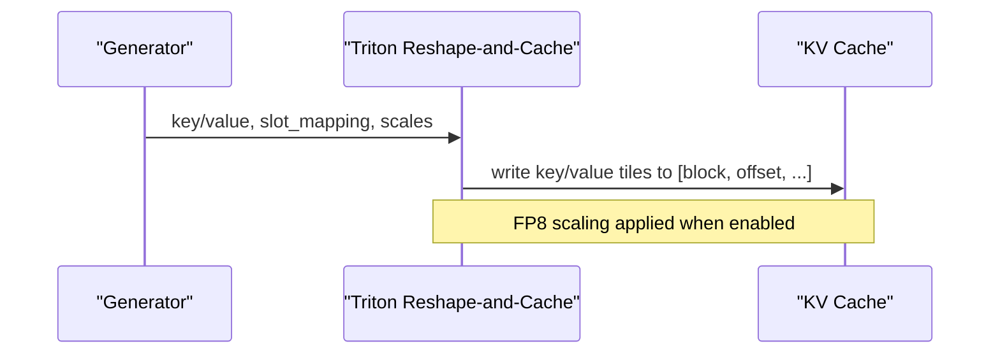
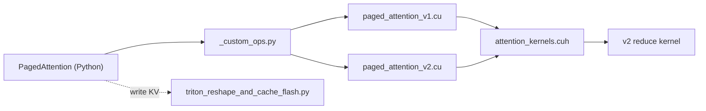

# PagedAttention Implementation

<cite>
**Referenced Files in This Document**
- [paged_attn.py](file://vllm/attention/ops/paged_attn.py)
- [_custom_ops.py](file://vllm/_custom_ops.py)
- [paged_attention_v1.cu](file://csrc/attention/paged_attention_v1.cu)
- [paged_attention_v2.cu](file://csrc/attention/paged_attention_v2.cu)
- [attention_kernels.cuh](file://csrc/attention/attention_kernels.cuh)
- [benchmark_paged_attention.py](file://benchmarks/kernels/benchmark_paged_attention.py)
- [test_attention.py](file://tests/kernels/attention/test_attention.py)
- [triton_reshape_and_cache_flash.py](file://vllm/attention/ops/triton_reshape_and_cache_flash.py)
- [prefix_caching.md](file://docs/design/prefix_caching.md)
- [test_prefix_caching.py](file://tests/v1/core/test_prefix_caching.py)
- [benchmark_block_pool.py](file://benchmarks/benchmark_block_pool.py)
</cite>

## Table of Contents
1. [Introduction](#introduction)
2. [Project Structure](#project-structure)
3. [Core Components](#core-components)
4. [Architecture Overview](#architecture-overview)
5. [Detailed Component Analysis](#detailed-component-analysis)
6. [Dependency Analysis](#dependency-analysis)
7. [Performance Considerations](#performance-considerations)
8. [Troubleshooting Guide](#troubleshooting-guide)
9. [Conclusion](#conclusion)
10. [Appendices](#appendices)

## Introduction
This document explains the PagedAttention implementation in vLLM, focusing on page-based memory management for attention computation. It covers:
- Page-based memory layout and block allocation strategies
- Page table management and how sequences map to cached blocks
- Differences between PagedAttention v1 and v2, including performance improvements and architectural changes
- Block size configuration, memory pooling mechanisms, and cache efficiency optimizations
- Practical configuration examples for different workloads and memory constraints
- Integration with KV cache management, sliding window attention, and prefix caching
- Troubleshooting memory-related issues, performance tuning, and memory leak prevention

## Project Structure
PagedAttention spans both Python bindings and CUDA kernels:
- Python interface for KV cache splitting and write-to-cache operations
- C++/CUDA kernels implementing attention with page tables and block-based layouts
- Triton-based utilities for efficient KV cache writes
- Tests and benchmarks validating correctness and performance

**Diagram sources**
- [paged_attn.py](file://vllm/attention/ops/paged_attn.py#L15-L52)
- [_custom_ops.py](file://vllm/_custom_ops.py#L73-L120)
- [paged_attention_v1.cu](file://csrc/attention/paged_attention_v1.cu#L160-L187)
- [paged_attention_v2.cu](file://csrc/attention/paged_attention_v2.cu#L167-L197)
- [attention_kernels.cuh](file://csrc/attention/attention_kernels.cuh#L80-L120)
- [triton_reshape_and_cache_flash.py](file://vllm/attention/ops/triton_reshape_and_cache_flash.py#L88-L185)
- [benchmark_block_pool.py](file://benchmarks/benchmark_block_pool.py#L51-L74)

**Section sources**
- [paged_attn.py](file://vllm/attention/ops/paged_attn.py#L15-L52)
- [_custom_ops.py](file://vllm/_custom_ops.py#L73-L120)
- [paged_attention_v1.cu](file://csrc/attention/paged_attention_v1.cu#L160-L187)
- [paged_attention_v2.cu](file://csrc/attention/paged_attention_v2.cu#L167-L197)
- [attention_kernels.cuh](file://csrc/attention/attention_kernels.cuh#L80-L120)
- [triton_reshape_and_cache_flash.py](file://vllm/attention/ops/triton_reshape_and_cache_flash.py#L88-L185)
- [benchmark_block_pool.py](file://benchmarks/benchmark_block_pool.py#L51-L74)

## Core Components
- PagedAttention Python wrapper:
  - Split KV cache into separate key and value views for page-based access
  - Write new tokens into KV cache via reshape-and-cache operation
- Custom ops:
  - Expose paged_attention_v1 and paged_attention_v2 to Python
- CUDA kernels:
  - v1: compute attention in one pass per head/sequence
  - v2: partitioned computation with intermediate buffers and a reduce step
- Utilities:
  - Triton-based reshape-and-cache for efficient KV writes
  - Benchmarks and tests for correctness and performance

Key responsibilities:
- Memory layout: key cache stored as [num_blocks, num_kv_heads, head_size/x, block_size, x]; value cache as [num_blocks, num_kv_heads, head_size, block_size]
- Block table: per-sequence mapping from logical block index to physical block index
- Partitioning: v2 introduces partitioned attention to reduce shared memory pressure

**Section sources**
- [paged_attn.py](file://vllm/attention/ops/paged_attn.py#L15-L52)
- [_custom_ops.py](file://vllm/_custom_ops.py#L73-L120)
- [attention_kernels.cuh](file://csrc/attention/attention_kernels.cuh#L80-L120)

## Architecture Overview
The PagedAttention pipeline:
- Input: queries, KV cache (key/value), block tables, sequence lengths, scaling factors
- v1: compute softmax-normalized attention directly to output
- v2: compute per-partition exp_sums/max_logits/tmp_out, then reduce partitions into final output
- KV cache write path: reshape-and-cache writes new tokens into page-aligned blocks

**Diagram sources**
- [_custom_ops.py](file://vllm/_custom_ops.py#L73-L120)
- [paged_attention_v2.cu](file://csrc/attention/paged_attention_v2.cu#L167-L197)
- [attention_kernels.cuh](file://csrc/attention/attention_kernels.cuh#L524-L665)

## Detailed Component Analysis

### PagedAttention Python Wrapper
- split_kv_cache: converts unified KV cache into separate key and value views optimized for page access
- write_to_paged_cache: writes new key/value tokens into page-aligned blocks using reshape-and-cache

**Diagram sources**
- [paged_attn.py](file://vllm/attention/ops/paged_attn.py#L15-L30)

**Section sources**
- [paged_attn.py](file://vllm/attention/ops/paged_attn.py#L15-L52)

### PagedAttention v1 vs v2: Architectural Differences
- v1:
  - Single kernel invocation per head/sequence
  - Computes softmax and output in-place
  - Shared memory usage proportional to max_seq_len
- v2:
  - Introduces partitioning: compute partial results per partition
  - Produces per-partition exp_sums, max_logits, and tmp_out
  - A separate reduce kernel aggregates partitions into final output
  - Better shared memory utilization and scalability for long contexts

**Diagram sources**
- [paged_attention_v1.cu](file://csrc/attention/paged_attention_v1.cu#L160-L187)
- [paged_attention_v2.cu](file://csrc/attention/paged_attention_v2.cu#L167-L197)
- [attention_kernels.cuh](file://csrc/attention/attention_kernels.cuh#L524-L665)

**Section sources**
- [paged_attention_v1.cu](file://csrc/attention/paged_attention_v1.cu#L160-L187)
- [paged_attention_v2.cu](file://csrc/attention/paged_attention_v2.cu#L167-L197)
- [attention_kernels.cuh](file://csrc/attention/attention_kernels.cuh#L524-L665)

### Memory Layout and Page Table Management
- Key cache layout: [num_blocks, num_kv_heads, head_size/x, block_size, x]
- Value cache layout: [num_blocks, num_kv_heads, head_size, block_size]
- Block tables: [num_seqs, max_num_blocks_per_seq] maps logical block indices to physical block indices
- Head mapping: num_queries_per_kv = num_heads / num_kv_heads; kv_head_idx = head_idx / num_queries_per_kv
- Partitioning: v2 divides sequence into partitions of size PARTITION_SIZE; each partition processes a subset of blocks

**Diagram sources**
- [attention_kernels.cuh](file://csrc/attention/attention_kernels.cuh#L110-L132)
- [attention_kernels.cuh](file://csrc/attention/attention_kernels.cuh#L198-L251)
- [attention_kernels.cuh](file://csrc/attention/attention_kernels.cuh#L373-L429)

**Section sources**
- [attention_kernels.cuh](file://csrc/attention/attention_kernels.cuh#L80-L120)
- [attention_kernels.cuh](file://csrc/attention/attention_kernels.cuh#L110-L132)
- [attention_kernels.cuh](file://csrc/attention/attention_kernels.cuh#L198-L251)
- [attention_kernels.cuh](file://csrc/attention/attention_kernels.cuh#L373-L429)

### Block Size Configuration and Memory Pooling
- Supported block sizes in v1/v2 launchers: 8, 16, 32
- Head sizes compiled into kernels: 32, 64, 80, 96, 112, 120, 128, 192, 256
- Shared memory sizing depends on partition size and head size
- Memory pooling:
  - BlockPool manages free blocks and reuses them across requests
  - Prefix caching reduces KV recomputation by reusing cached blocks

Practical guidance:
- Choose block_size based on GPU memory budget and typical sequence lengths
- Larger block_size reduces block table overhead but increases internal fragmentation
- Use partitioning (v2) for very long sequences to fit softmax logits in shared memory

**Section sources**
- [paged_attention_v1.cu](file://csrc/attention/paged_attention_v1.cu#L142-L165)
- [paged_attention_v2.cu](file://csrc/attention/paged_attention_v2.cu#L149-L170)
- [attention_kernels.cuh](file://csrc/attention/attention_kernels.cuh#L80-L120)
- [benchmark_block_pool.py](file://benchmarks/benchmark_block_pool.py#L51-L74)

### Integration with KV Cache Management, Sliding Window, and Prefix Caching
- KV cache write path:
  - reshape-and-cache writes new tokens into page-aligned blocks
  - Supports FP8 KV cache scaling via k_scale/v_scale
- Sliding window:
  - KV length windows can be enforced in CPU attention reference and tiling logic
- Prefix caching:
  - Hash-based caching of KV blocks to avoid recomputation for shared prefixes
  - Tests demonstrate cache hits and reference count behavior

**Diagram sources**
- [triton_reshape_and_cache_flash.py](file://vllm/attention/ops/triton_reshape_and_cache_flash.py#L88-L185)

**Section sources**
- [triton_reshape_and_cache_flash.py](file://vllm/attention/ops/triton_reshape_and_cache_flash.py#L88-L185)
- [prefix_caching.md](file://docs/design/prefix_caching.md#L1-L15)
- [test_prefix_caching.py](file://tests/v1/core/test_prefix_caching.py#L140-L200)

### Practical Configuration Examples
- Short sequences with tight memory:
  - block_size = 16
  - Prefer v1 for simplicity; ensure shared memory fits logits
- Long sequences with moderate memory:
  - block_size = 32
  - Use v2 with PARTITION_SIZE tuned to GPU shared memory limits
- Very long sequences:
  - Increase PARTITION_SIZE proportionally to sequence length
  - Ensure PARTITION_SIZE is divisible by block_size
- Mixed workloads:
  - Enable prefix caching to reduce KV recomputation
  - Adjust sliding window to cap KV growth for streaming scenarios

Validation:
- Benchmark script compares v1 and v2 performance
- Test harness validates partitioning assumptions and buffer shapes

**Section sources**
- [benchmark_paged_attention.py](file://benchmarks/kernels/benchmark_paged_attention.py#L113-L154)
- [test_attention.py](file://tests/kernels/attention/test_attention.py#L245-L280)

## Dependency Analysis
PagedAttention depends on:
- Python ops binding to CUDA kernels
- CUDA kernels implementing attention logic and reductions
- Triton utilities for efficient KV writes
- Tests and benchmarks for correctness and performance

**Diagram sources**
- [paged_attn.py](file://vllm/attention/ops/paged_attn.py#L15-L52)
- [_custom_ops.py](file://vllm/_custom_ops.py#L73-L120)
- [paged_attention_v1.cu](file://csrc/attention/paged_attention_v1.cu#L160-L187)
- [paged_attention_v2.cu](file://csrc/attention/paged_attention_v2.cu#L167-L197)
- [attention_kernels.cuh](file://csrc/attention/attention_kernels.cuh#L524-L665)
- [triton_reshape_and_cache_flash.py](file://vllm/attention/ops/triton_reshape_and_cache_flash.py#L88-L185)

**Section sources**
- [paged_attn.py](file://vllm/attention/ops/paged_attn.py#L15-L52)
- [_custom_ops.py](file://vllm/_custom_ops.py#L73-L120)
- [paged_attention_v1.cu](file://csrc/attention/paged_attention_v1.cu#L160-L187)
- [paged_attention_v2.cu](file://csrc/attention/paged_attention_v2.cu#L167-L197)
- [attention_kernels.cuh](file://csrc/attention/attention_kernels.cuh#L524-L665)
- [triton_reshape_and_cache_flash.py](file://vllm/attention/ops/triton_reshape_and_cache_flash.py#L88-L185)

## Performance Considerations
- Head size and block size selection:
  - Kernels compile specialized paths for common head sizes and block sizes
  - Larger head sizes increase register and shared memory pressure
- Partitioning trade-offs:
  - v2 reduces shared memory pressure by splitting computation
  - Overhead of extra buffers and reduction step; beneficial for long sequences
- Shared memory sizing:
  - Proportional to max(PARTITION_SIZE, (NUM_WARPS/2)*head_size)
  - Ensure PARTITION_SIZE and head_size align with GPU capabilities
- Memory bandwidth:
  - Page-aligned access improves coalescing; avoid straddling blocks unnecessarily
- FP8 KV cache:
  - Scaling factors reduce precision loss; adds small compute overhead
- Block pool performance:
  - Frequent allocation/free cycles impact latency; tune pool size and reuse policies

[No sources needed since this section provides general guidance]

## Troubleshooting Guide
Common issues and remedies:
- Incorrect block_size/head_size:
  - Symptom: runtime assertion or unsupported configuration
  - Fix: choose supported block sizes (8/16/32) and head sizes compiled into kernels
- Shared memory overflow:
  - Symptom: kernel launch failure or incorrect results
  - Fix: reduce head_size or increase PARTITION_SIZE; ensure PARTITION_SIZE divisible by block_size
- Mismatched partitioning assumptions:
  - Symptom: shape errors in v2 buffers
  - Fix: verify num_partitions = ceil(max_seq_len / PARTITION_SIZE) matches kernel expectations
- Out-of-bounds access:
  - Symptom: NaNs or infinities in output
  - Fix: ensure seq_lens and block_tables are correct; mask logits beyond seq_len
- Prefix caching inconsistencies:
  - Symptom: unexpected recomputation
  - Fix: verify hash computation and block reference counts; ensure consistent block_size across runs
- Memory leaks:
  - Symptom: growing memory usage over time
  - Fix: ensure proper free of KV blocks; confirm BlockPool frees unreferenced blocks

**Section sources**
- [attention_kernels.cuh](file://csrc/attention/attention_kernels.cuh#L110-L132)
- [attention_kernels.cuh](file://csrc/attention/attention_kernels.cuh#L292-L303)
- [attention_kernels.cuh](file://csrc/attention/attention_kernels.cuh#L415-L429)
- [test_prefix_caching.py](file://tests/v1/core/test_prefix_caching.py#L140-L200)

## Conclusion
PagedAttention enables efficient attention computation for long sequences by organizing KV cache into page-aligned blocks and using page tables to map logical to physical storage. v2 improves scalability through partitioning and a reduce step, while maintaining compatibility with v1. Proper configuration of block size, partition size, and head size, combined with prefix caching and efficient KV write paths, yields significant performance gains with controlled memory usage.

[No sources needed since this section summarizes without analyzing specific files]

## Appendices

### API Surface and Call Sites
- Python ops:
  - paged_attention_v1/out, paged_attention_v2/out/exp_sums/max_logits/tmp_out
- Tests/benchmarks:
  - Validate v1/v2 shapes and correctness
  - Benchmark performance across configurations

**Section sources**
- [_custom_ops.py](file://vllm/_custom_ops.py#L73-L120)
- [benchmark_paged_attention.py](file://benchmarks/kernels/benchmark_paged_attention.py#L113-L154)
- [test_attention.py](file://tests/kernels/attention/test_attention.py#L245-L280)