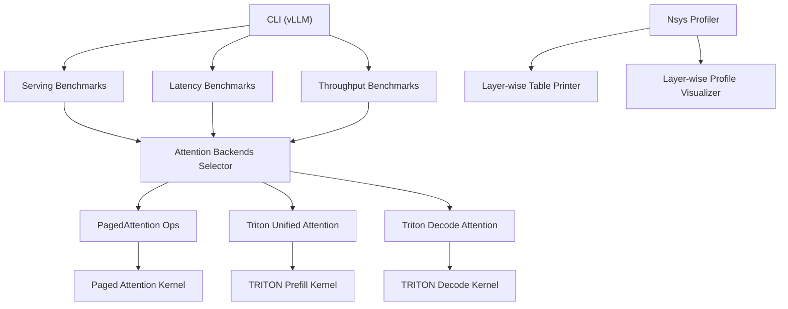
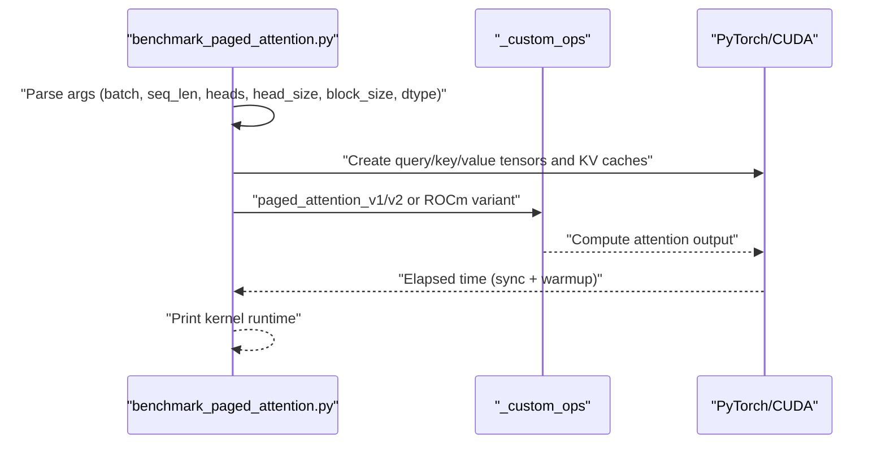
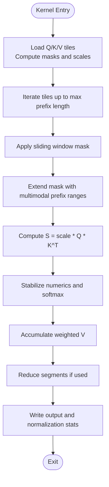
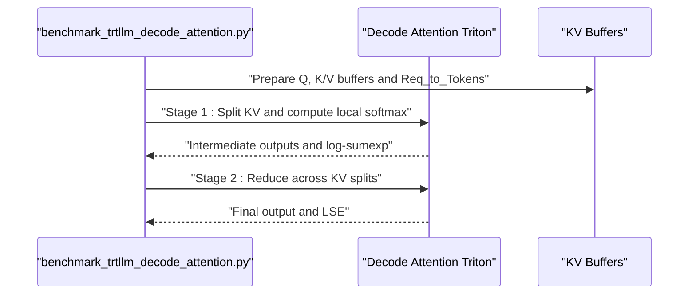
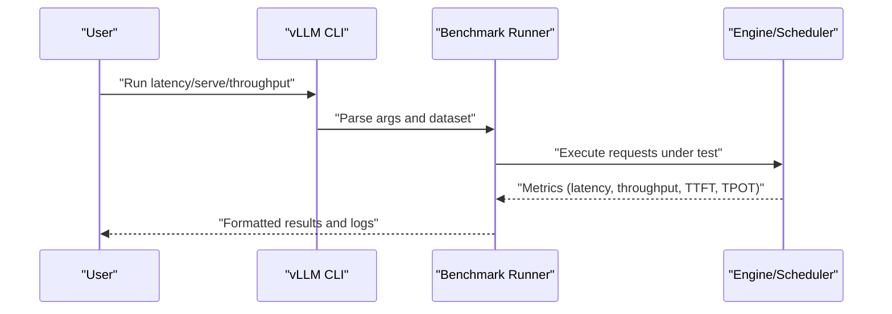
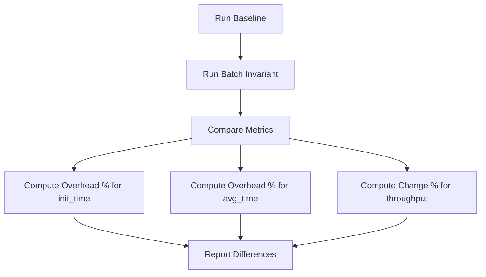
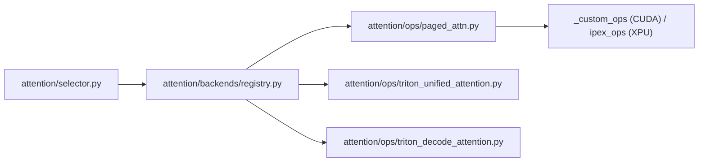

# Performance Tuning and Benchmarking

<cite>
**Referenced Files in This Document**
- [benchmarks/README.md](file://benchmarks/README.md)
- [benchmarks/benchmark_latency.py](file://benchmarks/benchmark_latency.py)
- [benchmarks/benchmark_throughput.py](file://benchmarks/benchmark_throughput.py)
- [benchmarks/benchmark_serving.py](file://benchmarks/benchmark_serving.py)
- [benchmarks/benchmark_batch_invariance.py](file://benchmarks/benchmark_batch_invariance.py)
- [benchmarks/benchmark_utils.py](file://benchmarks/benchmark_utils.py)
- [benchmarks/kernels/benchmark_paged_attention.py](file://benchmarks/kernels/benchmark_paged_attention.py)
- [benchmarks/kernels/benchmark_trtllm_decode_attention.py](file://benchmarks/kernels/benchmark_trtllm_decode_attention.py)
- [benchmarks/kernels/benchmark_trtllm_prefill_attention.py](file://benchmarks/kernels/benchmark_trtllm_prefill_attention.py)
- [vllm/attention/ops/paged_attn.py](file://vllm/attention/ops/paged_attn.py)
- [vllm/attention/ops/triton_unified_attention.py](file://vllm/attention/ops/triton_unified_attention.py)
- [vllm/attention/ops/triton_decode_attention.py](file://vllm/attention/ops/triton_decode_attention.py)
- [vllm/attention/selector.py](file://vllm/attention/selector.py)
- [vllm/attention/backends/registry.py](file://vllm/attention/backends/registry.py)
- [vllm/attention/utils/fa_utils.py](file://vllm/attention/utils/fa_utils.py)
- [tools/profiler/nsys_profile_tools/print_layerwise_table.py](file://tools/profiler/nsys_profile_tools/print_layerwise_table.py)
- [tools/profiler/nsys_profile_tools/visualize_layerwise_profile.py](file://tools/profiler/nsys_profile_tools/visualize_layerwise_profile.py)
- [docs/benchmarking/README.md](file://docs/benchmarking/README.md)
- [docs/benchmarking/cli.md](file://docs/benchmarking/cli.md)
- [docs/benchmarking/dashboard.md](file://docs/benchmarking/dashboard.md)
- [docs/benchmarking/sweeps.md](file://docs/benchmarking/sweeps.md)
- [docs/configuration/optimization.md](file://docs/configuration/optimization.md)
- [docs/design/paged_attention.md](file://docs/design/paged_attention.md)
- [docs/contributing/profiling.md](file://docs/contributing/profiling.md)
</cite>

## Table of Contents
1. [Introduction](#introduction)
2. [Project Structure](#project-structure)
3. [Core Components](#core-components)
4. [Architecture Overview](#architecture-overview)
5. [Detailed Component Analysis](#detailed-component-analysis)
6. [Dependency Analysis](#dependency-analysis)
7. [Performance Considerations](#performance-considerations)
8. [Troubleshooting Guide](#troubleshooting-guide)
9. [Conclusion](#conclusion)
10. [Appendices](#appendices)

## Introduction
This document provides a comprehensive guide to performance tuning and benchmarking of the attention system in the repository. It covers measurement methodologies (latency profiling, throughput analysis, memory bandwidth metrics), benchmarking tools and scripts, configuration parameters impacting performance (block sizes, batch sizes, sequence lengths, dtype and cache dtype), performance regression detection, baseline establishment, comparative analysis across implementations, and practical optimization workflows. It also addresses continuous performance monitoring, automated benchmarking pipelines, and validation procedures.

## Project Structure
The repository organizes performance-related code across:
- Benchmarks: CLI-deprecated scripts migrated to the CLI, plus kernel and serving benchmarks.
- Attention Ops: Triton kernels and Python wrappers for paged attention and decode attention.
- Tools: Profiling helpers for Nsys-based layer-wise analysis.
- Docs: Benchmarking documentation covering CLI, dashboard, and sweep utilities.

```mermaid
graph TB
subgraph "Benchmarks"
BENCH_README["benchmarks/README.md"]
BENCH_LAT["benchmarks/benchmark_latency.py"]
BENCH_THR["benchmarks/benchmark_throughput.py"]
BENCH_SERV["benchmarks/benchmark_serving.py"]
BENCH_BATCH_INV["benchmarks/benchmark_batch_invariance.py"]
BENCH_UTILS["benchmarks/benchmark_utils.py"]
BENCH_PAGED["benchmarks/kernels/benchmark_paged_attention.py"]
BENCH_TRIT_DECODE["benchmarks/kernels/benchmark_trtllm_decode_attention.py"]
BENCH_TRIT_PREFILL["benchmarks/kernels/benchmark_trtllm_prefill_attention.py"]
end
subgraph "Attention Ops"
OPS_PAGED["vllm/attention/ops/paged_attn.py"]
OPS_UNIFIED["vllm/attention/ops/triton_unified_attention.py"]
OPS_DECODE["vllm/attention/ops/triton_decode_attention.py"]
end
subgraph "Tools"
PROF_PRINT["tools/profiler/nsys_profile_tools/print_layerwise_table.py"]
PROF_VIS["tools/profiler/nsys_profile_tools/visualize_layerwise_profile.py"]
end
subgraph "Docs"
DOC_BENCH_README["docs/benchmarking/README.md"]
DOC_CLI["docs/benchmarking/cli.md"]
DOC_DASH["docs/benchmarking/dashboard.md"]
DOC_SWEEP["docs/benchmarking/sweeps.md"]
DOC_PROF["docs/contributing/profiling.md"]
end
BENCH_LAT --> DOC_CLI
BENCH_THR --> DOC_CLI
BENCH_SERV --> DOC_CLI
BENCH_BATCH_INV --> DOC_SWEEP
BENCH_PAGED --> OPS_PAGED
BENCH_TRIT_DECODE --> OPS_DECODE
BENCH_TRIT_PREFILL --> OPS_UNIFIED
PROF_PRINT --> DOC_PROF
PROF_VIS --> DOC_PROF
```

**Diagram sources**
- [benchmarks/README.md](file://benchmarks/README.md#L1-L21)
- [benchmarks/benchmark_latency.py](file://benchmarks/benchmark_latency.py#L1-L18)
- [benchmarks/benchmark_throughput.py](file://benchmarks/benchmark_throughput.py#L1-L18)
- [benchmarks/benchmark_serving.py](file://benchmarks/benchmark_serving.py#L1-L18)
- [benchmarks/benchmark_batch_invariance.py](file://benchmarks/benchmark_batch_invariance.py#L288-L331)
- [benchmarks/benchmark_utils.py](file://benchmarks/benchmark_utils.py#L1-L126)
- [benchmarks/kernels/benchmark_paged_attention.py](file://benchmarks/kernels/benchmark_paged_attention.py#L1-L251)
- [benchmarks/kernels/benchmark_trtllm_decode_attention.py](file://benchmarks/kernels/benchmark_trtllm_decode_attention.py#L1-L713)
- [benchmarks/kernels/benchmark_trtllm_prefill_attention.py](file://benchmarks/kernels/benchmark_trtllm_prefill_attention.py)
- [vllm/attention/ops/paged_attn.py](file://vllm/attention/ops/paged_attn.py#L1-L52)
- [vllm/attention/ops/triton_unified_attention.py](file://vllm/attention/ops/triton_unified_attention.py#L1-L800)
- [vllm/attention/ops/triton_decode_attention.py](file://vllm/attention/ops/triton_decode_attention.py#L1-L713)
- [tools/profiler/nsys_profile_tools/print_layerwise_table.py](file://tools/profiler/nsys_profile_tools/print_layerwise_table.py)
- [tools/profiler/nsys_profile_tools/visualize_layerwise_profile.py](file://tools/profiler/nsys_profile_tools/visualize_layerwise_profile.py)
- [docs/benchmarking/README.md](file://docs/benchmarking/README.md)
- [docs/benchmarking/cli.md](file://docs/benchmarking/cli.md)
- [docs/benchmarking/dashboard.md](file://docs/benchmarking/dashboard.md)
- [docs/benchmarking/sweeps.md](file://docs/benchmarking/sweeps.md)
- [docs/contributing/profiling.md](file://docs/contributing/profiling.md)

**Section sources**
- [benchmarks/README.md](file://benchmarks/README.md#L1-L21)
- [docs/benchmarking/README.md](file://docs/benchmarking/README.md)

## Core Components
- Attention kernels and backends:
  - Paged attention wrapper and cache write operations.
  - Unified Triton attention kernel supporting prefill/decode and advanced features.
  - Decode attention Triton kernel optimized for decoding with KV splits.
- Benchmarking scripts:
  - Serving, latency, and throughput scripts (deprecated in favor of CLI).
  - Kernel benchmarks for paged attention and TRT-style decode/prefill.
  - Utilities for standardized JSON output and timing collection.
- Profiling tools:
  - Nsys-based layer-wise profile printing and visualization.

Key performance-critical areas:
- Block size and partition sizing for paged attention.
- Head size, dtype, and KV cache dtype choices.
- Sequence length scaling and batch size effects.
- Hardware-specific optimizations (e.g., ROCm partition size, Triton kernel parameters).

**Section sources**
- [vllm/attention/ops/paged_attn.py](file://vllm/attention/ops/paged_attn.py#L1-L52)
- [vllm/attention/ops/triton_unified_attention.py](file://vllm/attention/ops/triton_unified_attention.py#L1-L800)
- [vllm/attention/ops/triton_decode_attention.py](file://vllm/attention/ops/triton_decode_attention.py#L1-L713)
- [benchmarks/kernels/benchmark_paged_attention.py](file://benchmarks/kernels/benchmark_paged_attention.py#L1-L251)
- [benchmarks/benchmark_utils.py](file://benchmarks/benchmark_utils.py#L1-L126)
- [tools/profiler/nsys_profile_tools/print_layerwise_table.py](file://tools/profiler/nsys_profile_tools/print_layerwise_table.py)
- [tools/profiler/nsys_profile_tools/visualize_layerwise_profile.py](file://tools/profiler/nsys_profile_tools/visualize_layerwise_profile.py)

## Architecture Overview
The attention performance pipeline integrates CLI-driven benchmarking, kernel-level implementations, and profiling tools.

**Diagram sources**
- [docs/benchmarking/cli.md](file://docs/benchmarking/cli.md)
- [vllm/attention/selector.py](file://vllm/attention/selector.py)
- [vllm/attention/backends/registry.py](file://vllm/attention/backends/registry.py)
- [vllm/attention/ops/paged_attn.py](file://vllm/attention/ops/paged_attn.py#L1-L52)
- [vllm/attention/ops/triton_unified_attention.py](file://vllm/attention/ops/triton_unified_attention.py#L1-L800)
- [vllm/attention/ops/triton_decode_attention.py](file://vllm/attention/ops/triton_decode_attention.py#L1-L713)
- [tools/profiler/nsys_profile_tools/print_layerwise_table.py](file://tools/profiler/nsys_profile_tools/print_layerwise_table.py)
- [tools/profiler/nsys_profile_tools/visualize_layerwise_profile.py](file://tools/profiler/nsys_profile_tools/visualize_layerwise_profile.py)

## Detailed Component Analysis

### Paged Attention Benchmark
This kernel benchmark evaluates paged attention performance across versions, block sizes, dtypes, and KV cache dtypes. It measures kernel runtime and supports profiling.

**Diagram sources**
- [benchmarks/kernels/benchmark_paged_attention.py](file://benchmarks/kernels/benchmark_paged_attention.py#L1-L251)

**Section sources**
- [benchmarks/kernels/benchmark_paged_attention.py](file://benchmarks/kernels/benchmark_paged_attention.py#L1-L251)

### Triton Unified Attention Kernel
The unified kernel implements prefill-time attention with support for sliding window, ALiBi slopes, query-query bias, and optional sinks. It exposes tunable parameters such as BLOCK_M, TILE_SIZE, HEAD_SIZE, and BLOCK_SIZE.

**Diagram sources**
- [vllm/attention/ops/triton_unified_attention.py](file://vllm/attention/ops/triton_unified_attention.py#L1-L800)

**Section sources**
- [vllm/attention/ops/triton_unified_attention.py](file://vllm/attention/ops/triton_unified_attention.py#L1-L800)

### Triton Decode Attention Kernel
The decode kernel performs memory-efficient decoding with KV buffer access, optional grouped GQA/MQA/MLA support, KV splits, and logit cap.

**Diagram sources**
- [benchmarks/kernels/benchmark_trtllm_decode_attention.py](file://benchmarks/kernels/benchmark_trtllm_decode_attention.py#L1-L713)
- [vllm/attention/ops/triton_decode_attention.py](file://vllm/attention/ops/triton_decode_attention.py#L1-L713)

**Section sources**
- [benchmarks/kernels/benchmark_trtllm_decode_attention.py](file://benchmarks/kernels/benchmark_trtllm_decode_attention.py#L1-L713)
- [vllm/attention/ops/triton_decode_attention.py](file://vllm/attention/ops/triton_decode_attention.py#L1-L713)

### Serving, Latency, and Throughput Benchmarks
Legacy scripts are deprecated in favor of the CLI. The CLI provides commands for latency, serving, and throughput benchmarking with consistent argument sets and output formats.

**Diagram sources**
- [benchmarks/benchmark_latency.py](file://benchmarks/benchmark_latency.py#L1-L18)
- [benchmarks/benchmark_throughput.py](file://benchmarks/benchmark_throughput.py#L1-L18)
- [benchmarks/benchmark_serving.py](file://benchmarks/benchmark_serving.py#L1-L18)
- [docs/benchmarking/cli.md](file://docs/benchmarking/cli.md)

**Section sources**
- [benchmarks/benchmark_latency.py](file://benchmarks/benchmark_latency.py#L1-L18)
- [benchmarks/benchmark_throughput.py](file://benchmarks/benchmark_throughput.py#L1-L18)
- [benchmarks/benchmark_serving.py](file://benchmarks/benchmark_serving.py#L1-L18)
- [docs/benchmarking/cli.md](file://docs/benchmarking/cli.md)

### Batch Invariance Benchmark and Comparative Analysis
Batch invariance compares baseline performance against a batch-invariant configuration, computing percentage changes in initialization time, average time, and throughput.

**Diagram sources**
- [benchmarks/benchmark_batch_invariance.py](file://benchmarks/benchmark_batch_invariance.py#L288-L331)

**Section sources**
- [benchmarks/benchmark_batch_invariance.py](file://benchmarks/benchmark_batch_invariance.py#L288-L331)

### Benchmark Utilities and Standardized Output
Utilities provide:
- PyTorch OSS benchmark-compatible JSON serialization.
- TimeCollector for measuring elapsed time with average/max aggregation.
- Helpers for converting results and handling infinities.

**Section sources**
- [benchmarks/benchmark_utils.py](file://benchmarks/benchmark_utils.py#L1-L126)

## Dependency Analysis
Attention backends selection and registry integrate platform-specific ops and Triton kernels.

**Diagram sources**
- [vllm/attention/selector.py](file://vllm/attention/selector.py)
- [vllm/attention/backends/registry.py](file://vllm/attention/backends/registry.py)
- [vllm/attention/ops/paged_attn.py](file://vllm/attention/ops/paged_attn.py#L1-L52)
- [vllm/attention/ops/triton_unified_attention.py](file://vllm/attention/ops/triton_unified_attention.py#L1-L800)
- [vllm/attention/ops/triton_decode_attention.py](file://vllm/attention/ops/triton_decode_attention.py#L1-L713)

**Section sources**
- [vllm/attention/selector.py](file://vllm/attention/selector.py)
- [vllm/attention/backends/registry.py](file://vllm/attention/backends/registry.py)
- [vllm/attention/ops/paged_attn.py](file://vllm/attention/ops/paged_attn.py#L1-L52)
- [vllm/attention/ops/triton_unified_attention.py](file://vllm/attention/ops/triton_unified_attention.py#L1-L800)
- [vllm/attention/ops/triton_decode_attention.py](file://vllm/attention/ops/triton_decode_attention.py#L1-L713)

## Performance Considerations
- Measurement methodologies:
  - Latency profiling: Use Nsys-based profiling tools and layer-wise visualization to isolate kernel hotspots.
  - Throughput analysis: Measure request throughput, output throughput, and token throughput under varying batch sizes and sequence lengths.
  - Memory bandwidth: Track memory bandwidth utilization during prefill and decode phases; correlate with head size, block size, and dtype choices.
- Configuration parameters:
  - Block size and partition size: Tune for occupancy and coalesced access; ROCm may require different partition sizing.
  - Batch size and sequence length: Sweep across realistic ranges to identify saturation and fragmentation.
  - Head size and dtype: Larger head sizes increase arithmetic intensity; mixed-precision dtypes and FP8 KV cache can improve throughput.
  - KV cache dtype: FP8 KV cache reduces memory bandwidth and improves sustained throughput.
- Hardware-specific optimizations:
  - Triton kernel parameters (BLOCK_M, TILE_SIZE, HEAD_SIZE) influence occupancy and register pressure.
  - ROCm-specific adjustments (e.g., partition size, kernel launch parameters) can improve performance.
- Regression detection and baselines:
  - Establish baselines with batch invariance comparisons and sweep studies.
  - Track metrics over time using the benchmarking dashboard and CLI.
- Automated pipelines:
  - Use CLI benchmark commands and sweep utilities to automate runs across configurations.
  - Integrate standardized JSON output for downstream analysis.

[No sources needed since this section provides general guidance]

## Troubleshooting Guide
- Deprecated scripts:
  - Legacy latency/throughput/serve scripts are deprecated; migrate to the CLI commands documented in the benchmarking docs.
- Profiling:
  - Use Nsys tools and layer-wise printers to identify kernel-level bottlenecks and validate performance regressions.
- Validation:
  - Ensure dtype and KV cache dtype compatibility with hardware capabilities.
  - Verify block size alignment and partition sizing for optimal occupancy.

**Section sources**
- [benchmarks/benchmark_latency.py](file://benchmarks/benchmark_latency.py#L1-L18)
- [benchmarks/benchmark_throughput.py](file://benchmarks/benchmark_throughput.py#L1-L18)
- [benchmarks/benchmark_serving.py](file://benchmarks/benchmark_serving.py#L1-L18)
- [tools/profiler/nsys_profile_tools/print_layerwise_table.py](file://tools/profiler/nsys_profile_tools/print_layerwise_table.py)
- [tools/profiler/nsys_profile_tools/visualize_layerwise_profile.py](file://tools/profiler/nsys_profile_tools/visualize_layerwise_profile.py)

## Conclusion
Performance tuning of the attention system requires a combination of kernel-level benchmarking, robust measurement methodologies, and automated pipelines. By leveraging the provided scripts, Triton kernels, and profiling tools, teams can establish baselines, detect regressions, and iteratively optimize configurations for block size, batch size, sequence length, dtype, and hardware-specific parameters.

[No sources needed since this section summarizes without analyzing specific files]

## Appendices

### Appendix A: Benchmarking CLI and Dashboard
- CLI commands for latency, serving, and throughput benchmarking.
- Dashboard for visualizing historical performance trends.
- Sweep utilities for parameter sweeps and comparative analysis.

**Section sources**
- [docs/benchmarking/cli.md](file://docs/benchmarking/cli.md)
- [docs/benchmarking/dashboard.md](file://docs/benchmarking/dashboard.md)
- [docs/benchmarking/sweeps.md](file://docs/benchmarking/sweeps.md)

### Appendix B: Design Notes on Paged Attention
- Paged attention design and block management.
- Implications for memory layout and cache performance.

**Section sources**
- [docs/design/paged_attention.md](file://docs/design/paged_attention.md)

### Appendix C: Optimization and Configuration Guidance
- General optimization tips and configuration knobs.
- Practical steps for establishing baselines and detecting regressions.

**Section sources**
- [docs/configuration/optimization.md](file://docs/configuration/optimization.md)