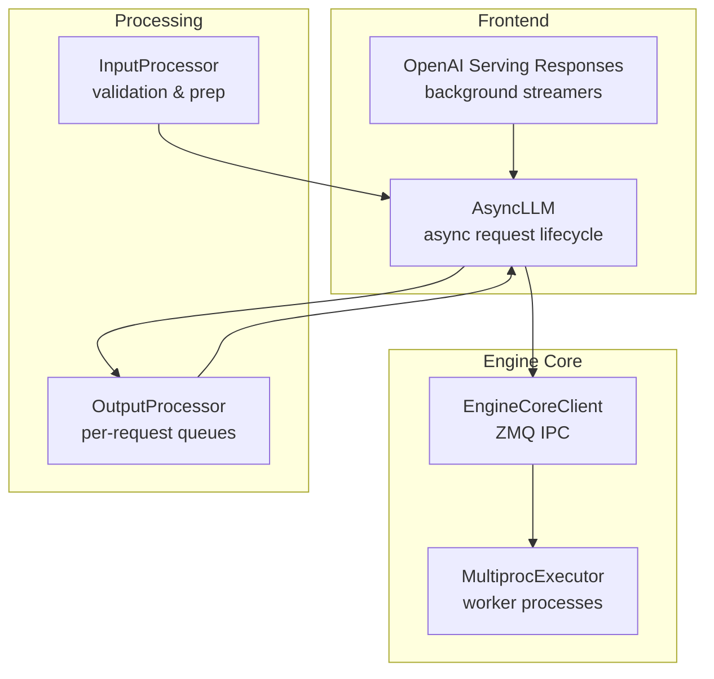
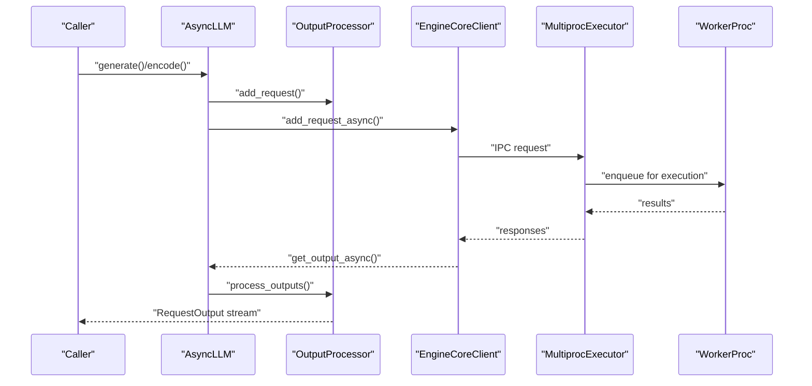
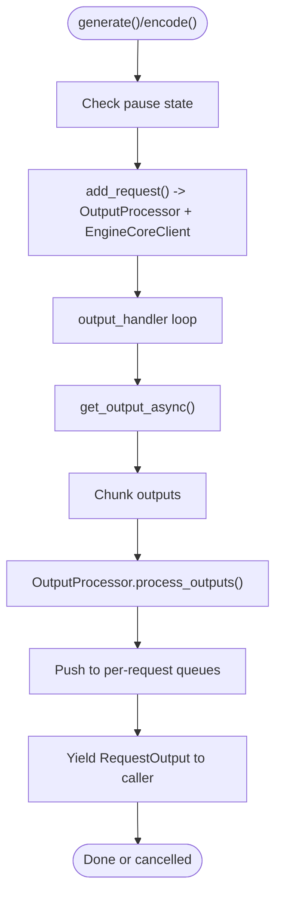
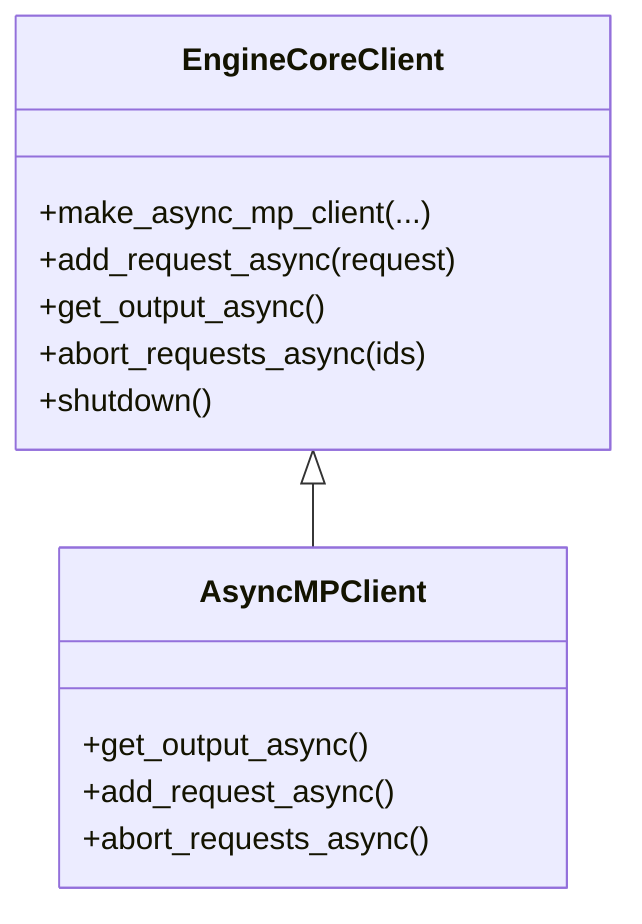
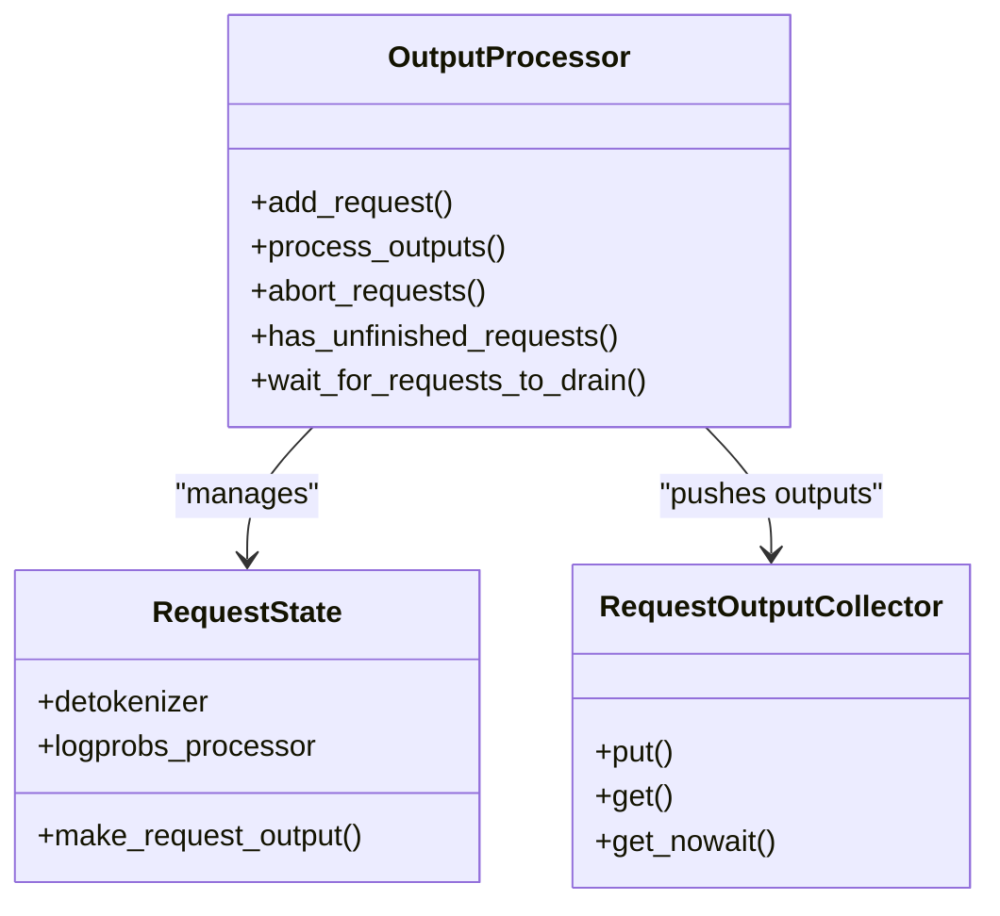
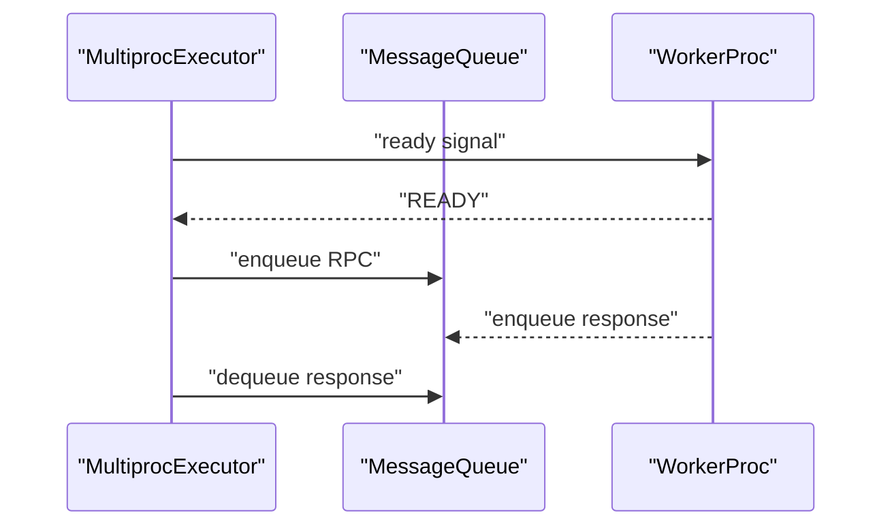
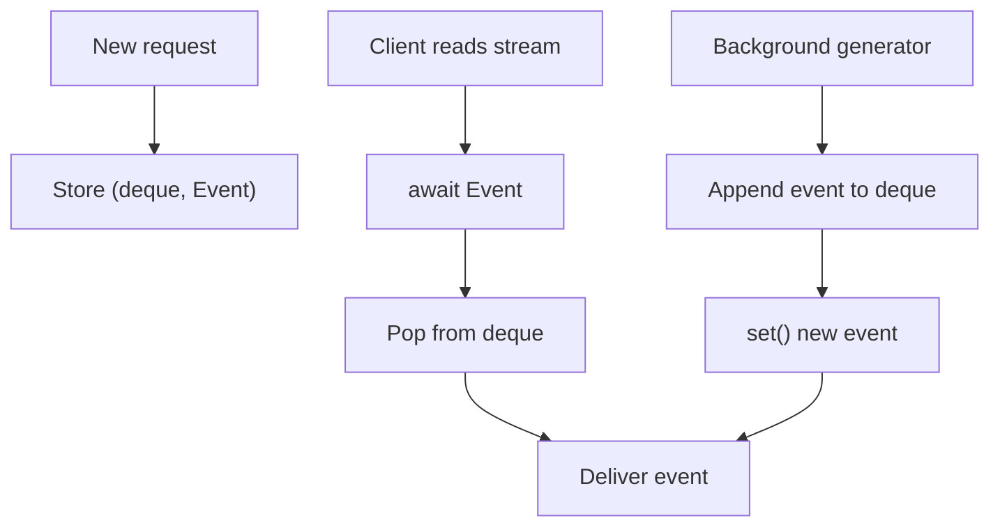
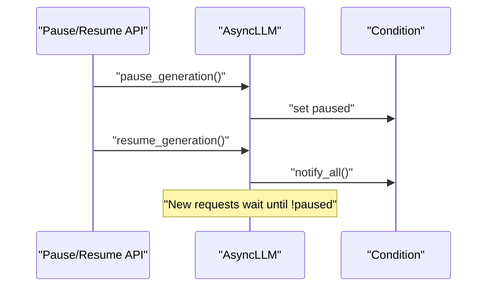
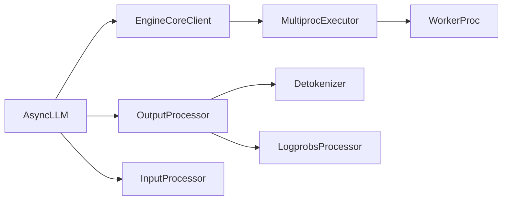

# Async Engine Design

<cite>
**Referenced Files in This Document**
- [async_llm.py](file://vllm/v1/engine/async_llm.py)
- [core_client.py](file://vllm/v1/engine/core_client.py)
- [output_processor.py](file://vllm/v1/engine/output_processor.py)
- [input_processor.py](file://vllm/v1/engine/input_processor.py)
- [multiproc_executor.py](file://vllm/v1/executor/multiproc_executor.py)
- [async_utils.py](file://vllm/utils/async_utils.py)
- [serving_responses.py](file://vllm/entrypoints/openai/serving_responses.py)
- [api_router.py](file://vllm/entrypoints/serve/api_router.py)
- [mooncake_connector.py](file://vllm/distributed/kv_transfer/kv_connector/v1/mooncake_connector.py)
</cite>

## Table of Contents
1. [Introduction](#introduction)
2. [Project Structure](#project-structure)
3. [Core Components](#core-components)
4. [Architecture Overview](#architecture-overview)
5. [Detailed Component Analysis](#detailed-component-analysis)
6. [Dependency Analysis](#dependency-analysis)
7. [Performance Considerations](#performance-considerations)
8. [Troubleshooting Guide](#troubleshooting-guide)
9. [Conclusion](#conclusion)
10. [Appendices](#appendices)

## Introduction
This document explains vLLM’s asynchronous engine design with a focus on the event-driven architecture, asyncio integration, and non-blocking I/O. It covers concurrency models, task scheduling, resource sharing across asyncio tasks and background processes, the output handler pattern, request queuing, and streaming response generation. It also documents pause/resume functionality, graceful degradation, and fault tolerance mechanisms, along with practical guidance for configuration, monitoring, and debugging.

## Project Structure
The async engine spans several modules:
- Frontend async orchestration and request lifecycle: [async_llm.py](file://vllm/v1/engine/async_llm.py)
- Engine-core IPC and clients: [core_client.py](file://vllm/v1/engine/core_client.py)
- Output processing and per-request queues: [output_processor.py](file://vllm/v1/engine/output_processor.py)
- Input preprocessing and validation: [input_processor.py](file://vllm/v1/engine/input_processor.py)
- Multiprocess execution and worker coordination: [multiproc_executor.py](file://vllm/v1/executor/multiproc_executor.py)
- Async utilities and micro-batching: [async_utils.py](file://vllm/utils/async_utils.py)
- Streaming responses and background generators: [serving_responses.py](file://vllm/entrypoints/openai/serving_responses.py)
- Pause/resume API endpoints: [api_router.py](file://vllm/entrypoints/serve/api_router.py)
- KV connector async coordination: [mooncake_connector.py](file://vllm/distributed/kv_transfer/kv_connector/v1/mooncake_connector.py)

**Diagram sources**
- [async_llm.py](file://vllm/v1/engine/async_llm.py#L1-L200)
- [core_client.py](file://vllm/v1/engine/core_client.py#L1-L200)
- [output_processor.py](file://vllm/v1/engine/output_processor.py#L1-L120)
- [input_processor.py](file://vllm/v1/engine/input_processor.py#L1-L120)
- [multiproc_executor.py](file://vllm/v1/executor/multiproc_executor.py#L1-L120)
- [serving_responses.py](file://vllm/entrypoints/openai/serving_responses.py#L1000-L1200)

**Section sources**
- [async_llm.py](file://vllm/v1/engine/async_llm.py#L1-L200)
- [core_client.py](file://vllm/v1/engine/core_client.py#L1-L200)
- [output_processor.py](file://vllm/v1/engine/output_processor.py#L1-L120)
- [input_processor.py](file://vllm/v1/engine/input_processor.py#L1-L120)
- [multiproc_executor.py](file://vllm/v1/executor/multiproc_executor.py#L1-L120)
- [serving_responses.py](file://vllm/entrypoints/openai/serving_responses.py#L1000-L1200)

## Core Components
- AsyncLLM: Orchestrates requests, coordinates pause/resume, drives the output handler, and exposes async APIs for generate/encode.
- EngineCoreClient: Provides async IPC to the engine core via ZMQ; manages background resources and monitors engine liveness.
- OutputProcessor: Converts raw outputs into RequestOutput/PoolingRequestOutput, manages per-request queues, and tracks request lifecycles.
- InputProcessor: Validates and prepares inputs, including multimodal and structured outputs, and computes derived parameters.
- MultiprocExecutor: Manages worker processes, message queues, and RPC coordination; includes worker health monitoring and graceful shutdown.
- Async utilities: Provide async wrappers, micro-batching tokenizers, merging async iterators, and safe task cancellation.
- OpenAI serving responses: Implements background streaming and response composition with asyncio events and queues.
- Pause/resume endpoints: Expose HTTP endpoints to pause and resume generation and query pause status.

**Section sources**
- [async_llm.py](file://vllm/v1/engine/async_llm.py#L1-L200)
- [core_client.py](file://vllm/v1/engine/core_client.py#L1-L200)
- [output_processor.py](file://vllm/v1/engine/output_processor.py#L1-L120)
- [input_processor.py](file://vllm/v1/engine/input_processor.py#L1-L120)
- [multiproc_executor.py](file://vllm/v1/executor/multiproc_executor.py#L1-L120)
- [async_utils.py](file://vllm/utils/async_utils.py#L1-L120)
- [serving_responses.py](file://vllm/entrypoints/openai/serving_responses.py#L1000-L1200)
- [api_router.py](file://vllm/entrypoints/serve/api_router.py#L50-L102)

## Architecture Overview
The async engine uses an event-driven design:
- An asyncio event loop runs in the frontend process.
- Requests are validated and prepared by InputProcessor.
- Requests are enqueued in OutputProcessor and sent to EngineCoreClient.
- EngineCoreClient communicates with the engine core via ZMQ; outputs are pulled asynchronously and processed by OutputProcessor.
- OutputProcessor pushes RequestOutput items into per-request asyncio queues; the caller consumes these via async generators.
- Background tasks handle output aggregation, stats logging, and periodic maintenance.

**Diagram sources**
- [async_llm.py](file://vllm/v1/engine/async_llm.py#L360-L472)
- [output_processor.py](file://vllm/v1/engine/output_processor.py#L414-L547)
- [core_client.py](file://vllm/v1/engine/core_client.py#L580-L722)
- [multiproc_executor.py](file://vllm/v1/executor/multiproc_executor.py#L287-L360)

**Section sources**
- [async_llm.py](file://vllm/v1/engine/async_llm.py#L360-L472)
- [output_processor.py](file://vllm/v1/engine/output_processor.py#L414-L547)
- [core_client.py](file://vllm/v1/engine/core_client.py#L580-L722)
- [multiproc_executor.py](file://vllm/v1/executor/multiproc_executor.py#L287-L360)

## Detailed Component Analysis

### AsyncLLM: Event-driven orchestration and output handler
- Maintains an asyncio Condition for pause/resume gating and an asyncio Task for the output handler loop.
- The output handler pulls EngineCoreOutputs, splits into chunks, processes via OutputProcessor, and propagates errors to all active requests.
- Exposes generate() and encode() returning async generators; integrates with InputProcessor and OutputProcessor.
- Supports abort, pause/resume, and cache reset operations; integrates with metrics and tracing.

**Diagram sources**
- [async_llm.py](file://vllm/v1/engine/async_llm.py#L360-L472)
- [output_processor.py](file://vllm/v1/engine/output_processor.py#L414-L547)

**Section sources**
- [async_llm.py](file://vllm/v1/engine/async_llm.py#L360-L472)
- [output_processor.py](file://vllm/v1/engine/output_processor.py#L414-L547)

### EngineCoreClient: Async IPC and resource management
- Creates ZMQ sockets and manages engine core processes; supports monitoring via a background thread.
- Uses asyncio-friendly sockets and tracks pending messages to avoid premature buffer reuse.
- Provides async methods for add_request_async, get_output_async, abort_requests_async, and lifecycle controls.

**Diagram sources**
- [core_client.py](file://vllm/v1/engine/core_client.py#L98-L122)
- [core_client.py](file://vllm/v1/engine/core_client.py#L580-L722)

**Section sources**
- [core_client.py](file://vllm/v1/engine/core_client.py#L98-L122)
- [core_client.py](file://vllm/v1/engine/core_client.py#L580-L722)

### OutputProcessor: Per-request queues and streaming
- Tracks per-request state, detokenization, and logprobs computation.
- Uses RequestOutputCollector with asyncio Events to decouple producers (engine core) and consumers (caller).
- Supports stream intervals and delta mode; merges outputs when producer outpaces consumer.

**Diagram sources**
- [output_processor.py](file://vllm/v1/engine/output_processor.py#L341-L547)
- [output_processor.py](file://vllm/v1/engine/output_processor.py#L34-L83)

**Section sources**
- [output_processor.py](file://vllm/v1/engine/output_processor.py#L34-L83)
- [output_processor.py](file://vllm/v1/engine/output_processor.py#L341-L547)

### InputProcessor: Validation and preparation
- Validates sampling and structured output parameters, multimodal UUIDs, and tokenizer boundaries.
- Prepares EngineCoreRequest with prompt token ids/embeddings, multimodal features, and derived parameters.

**Section sources**
- [input_processor.py](file://vllm/v1/engine/input_processor.py#L1-L120)
- [input_processor.py](file://vllm/v1/engine/input_processor.py#L409-L548)

### MultiprocExecutor: Worker processes and RPC
- Manages worker processes, message queues, and RPC; includes worker health monitoring and graceful shutdown.
- Supports async scheduling with a dedicated thread copying outputs to a queue.

**Diagram sources**
- [multiproc_executor.py](file://vllm/v1/executor/multiproc_executor.py#L136-L202)
- [multiproc_executor.py](file://vllm/v1/executor/multiproc_executor.py#L287-L360)
- [multiproc_executor.py](file://vllm/v1/executor/multiproc_executor.py#L762-L798)

**Section sources**
- [multiproc_executor.py](file://vllm/v1/executor/multiproc_executor.py#L136-L202)
- [multiproc_executor.py](file://vllm/v1/executor/multiproc_executor.py#L287-L360)
- [multiproc_executor.py](file://vllm/v1/executor/multiproc_executor.py#L762-L798)

### Streaming Responses: Background generators and event stores
- OpenAI serving uses background asyncio tasks to stream responses; maintains per-response event stores and signals.
- Streams are produced by a generator and finalized with a completion event.

**Diagram sources**
- [serving_responses.py](file://vllm/entrypoints/openai/serving_responses.py#L1058-L1120)
- [serving_responses.py](file://vllm/entrypoints/openai/serving_responses.py#L2032-L2074)

**Section sources**
- [serving_responses.py](file://vllm/entrypoints/openai/serving_responses.py#L1058-L1120)
- [serving_responses.py](file://vllm/entrypoints/openai/serving_responses.py#L2032-L2074)

### Pause/Resume and Graceful Degradation
- AsyncLLM uses an asyncio Condition to gate new requests during pause; optional immediate abort of inflight requests.
- After draining, caches can be reset; resume clears the pause condition and wakes waiting tasks.
- EngineCoreClient monitors engine liveness and raises EngineDeadError; MultiprocExecutor monitors worker liveness and triggers shutdown callbacks.

**Diagram sources**
- [async_llm.py](file://vllm/v1/engine/async_llm.py#L555-L605)
- [api_router.py](file://vllm/entrypoints/serve/api_router.py#L50-L102)

**Section sources**
- [async_llm.py](file://vllm/v1/engine/async_llm.py#L555-L605)
- [api_router.py](file://vllm/entrypoints/serve/api_router.py#L50-L102)
- [core_client.py](file://vllm/v1/engine/core_client.py#L580-L619)
- [multiproc_executor.py](file://vllm/v1/executor/multiproc_executor.py#L216-L247)

### IPC Communication and Background Processes
- ZMQ ROUTER/PULL sockets carry EngineCoreRequest and EngineCoreOutputs between frontend and engine core.
- Pending message tracking ensures buffers remain alive until ZMQ finishes sending.
- Worker processes are signaled via pipes and can self-terminate on parent death.

**Section sources**
- [core_client.py](file://vllm/v1/engine/core_client.py#L495-L540)
- [core_client.py](file://vllm/v1/engine/core_client.py#L723-L744)
- [multiproc_executor.py](file://vllm/v1/executor/multiproc_executor.py#L568-L607)

## Dependency Analysis
- AsyncLLM depends on OutputProcessor for per-request queues and InputProcessor for request preparation.
- EngineCoreClient encapsulates IPC and interacts with MultiprocExecutor for worker coordination.
- OutputProcessor depends on detokenizer and logprobs processors to assemble RequestOutput.
- Async utilities support micro-batching and safe task cancellation.

**Diagram sources**
- [async_llm.py](file://vllm/v1/engine/async_llm.py#L1-L120)
- [output_processor.py](file://vllm/v1/engine/output_processor.py#L1-L120)
- [core_client.py](file://vllm/v1/engine/core_client.py#L1-L120)
- [multiproc_executor.py](file://vllm/v1/executor/multiproc_executor.py#L1-L120)

**Section sources**
- [async_llm.py](file://vllm/v1/engine/async_llm.py#L1-L120)
- [output_processor.py](file://vllm/v1/engine/output_processor.py#L1-L120)
- [core_client.py](file://vllm/v1/engine/core_client.py#L1-L120)
- [multiproc_executor.py](file://vllm/v1/executor/multiproc_executor.py#L1-L120)

## Performance Considerations
- Chunked output processing: The output handler splits EngineCoreOutputs into chunks to avoid blocking the event loop for extended periods.
- Non-blocking I/O: ZMQ sockets are used with non-copy semantics and pending message tracking to minimize CPU and memory overhead.
- Micro-batching tokenizers: AsyncMicrobatchTokenizer reduces tokenizer overhead by batching requests in a single-thread executor.
- Stream intervals: OutputProcessor supports configurable stream intervals to balance latency and throughput.
- Async scheduling: MultiprocExecutor can offload output copying to a dedicated thread when async scheduling is enabled.

**Section sources**
- [async_llm.py](file://vllm/v1/engine/async_llm.py#L497-L520)
- [core_client.py](file://vllm/v1/engine/core_client.py#L723-L744)
- [async_utils.py](file://vllm/utils/async_utils.py#L1-L120)
- [output_processor.py](file://vllm/v1/engine/output_processor.py#L214-L239)
- [multiproc_executor.py](file://vllm/v1/executor/multiproc_executor.py#L540-L560)

## Troubleshooting Guide
- Engine dead or worker failure: EngineCoreClient sets an engine_dead flag and raises EngineDeadError; MultiprocExecutor monitors worker liveness and triggers shutdown callbacks.
- Graceful shutdown: Background tasks and sockets are canceled or closed safely; finalizers ensure cleanup.
- Aborting inflight requests: OutputProcessor and EngineCoreClient both abort requests; AsyncLLM propagates errors to callers.
- Pause/resume issues: Ensure the pause condition is cleared on resume and that inflight requests are handled according to wait_for_inflight_requests.

**Section sources**
- [core_client.py](file://vllm/v1/engine/core_client.py#L363-L429)
- [core_client.py](file://vllm/v1/engine/core_client.py#L580-L619)
- [multiproc_executor.py](file://vllm/v1/executor/multiproc_executor.py#L216-L247)
- [async_llm.py](file://vllm/v1/engine/async_llm.py#L543-L605)

## Conclusion
vLLM’s async engine combines an event-driven frontend with robust IPC and worker coordination. The design emphasizes non-blocking I/O, efficient chunked processing, and clear separation of concerns across input processing, output assembly, and streaming delivery. Pause/resume and graceful degradation mechanisms ensure operational resilience, while utilities and patterns promote performance and scalability.

## Appendices

### Practical Configuration and Monitoring
- AsyncLLM creation: Configure executor class, logging, and stat loggers; optionally aggregate engine logging and specify client addresses for multi-client deployments.
- Streaming: Use the async generator returned by generate() to stream RequestOutput items; adjust stream_interval for throughput tuning.
- Metrics: Enable stat loggers and Prometheus integration; use do_log_stats() to emit periodic metrics.
- Profiling: Start/stop profiling concurrently with engine core profiling.

**Section sources**
- [async_llm.py](file://vllm/v1/engine/async_llm.py#L200-L253)
- [async_llm.py](file://vllm/v1/engine/async_llm.py#L715-L735)

### KV Connector Coordination
- The KV connector coordinates sender/receiver loops across ranks; uses asyncio.run_coroutine_threadsafe to synchronize between threads and asyncio event loops.

**Section sources**
- [mooncake_connector.py](file://vllm/distributed/kv_transfer/kv_connector/v1/mooncake_connector.py#L747-L781)