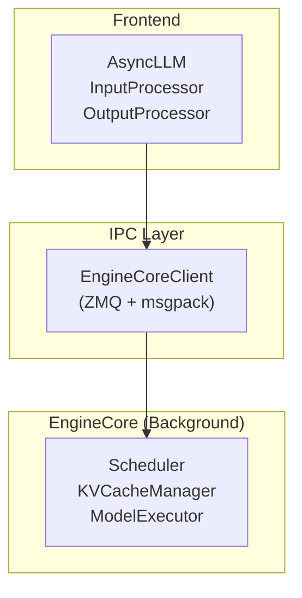
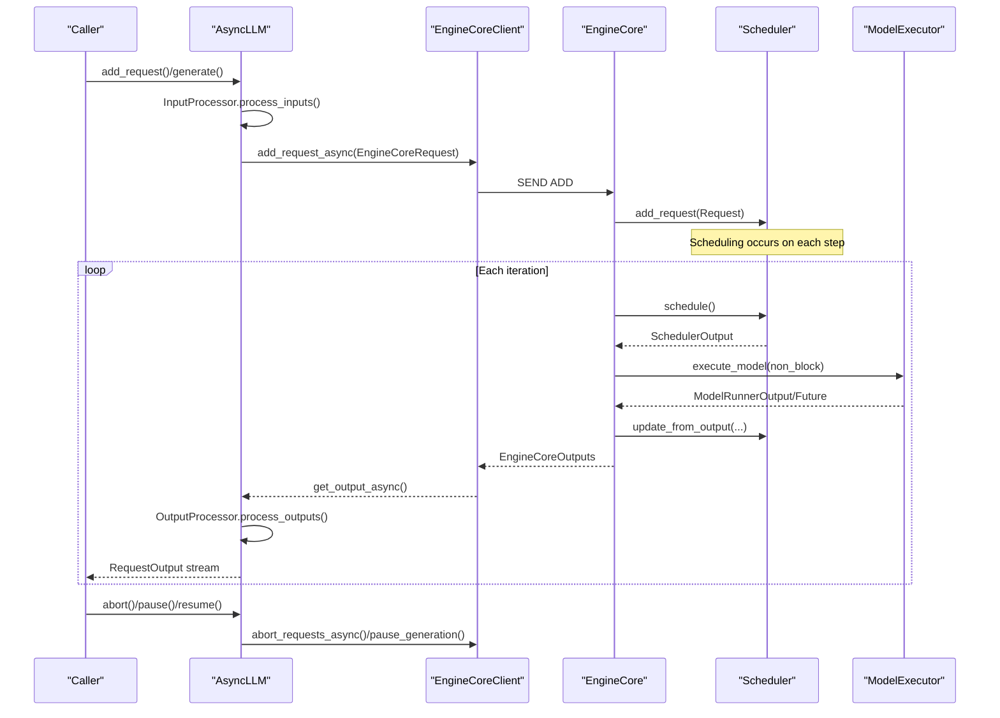
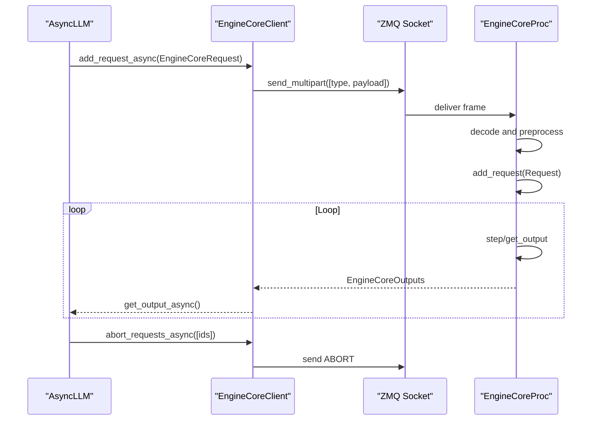
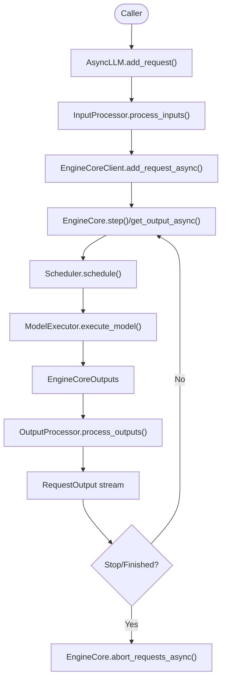
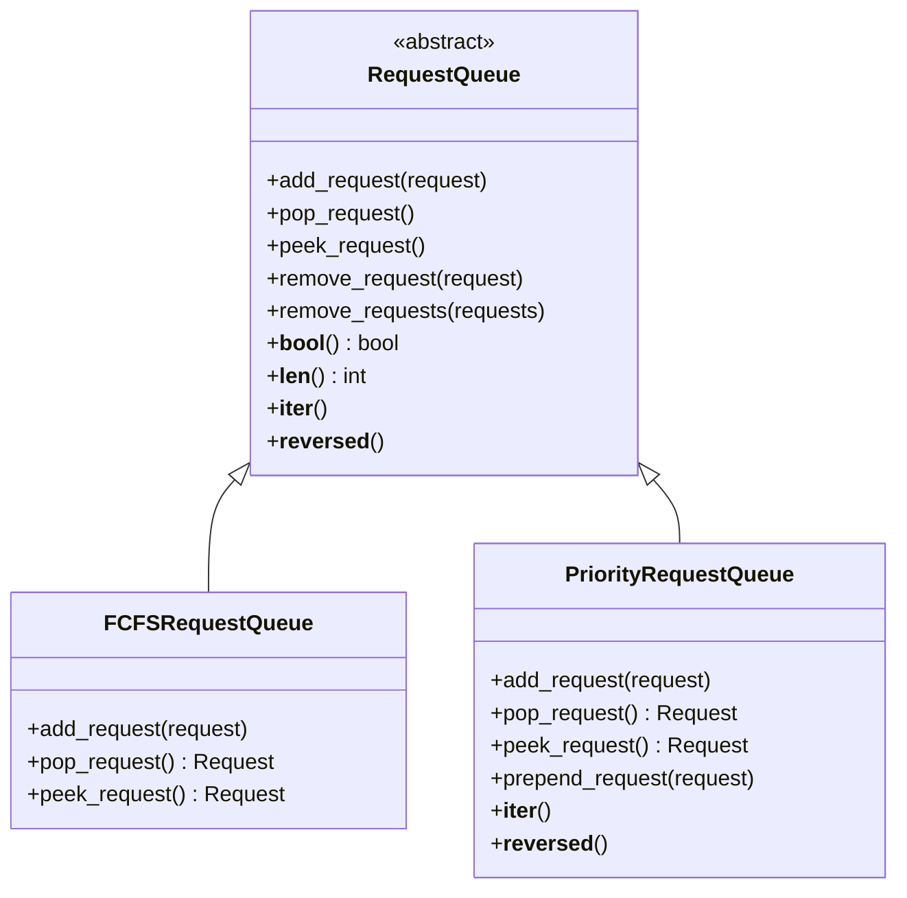
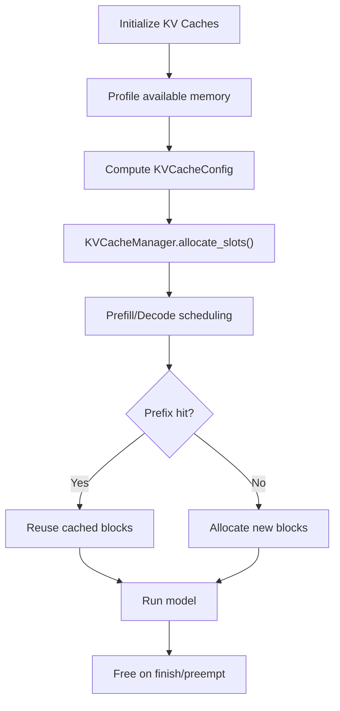
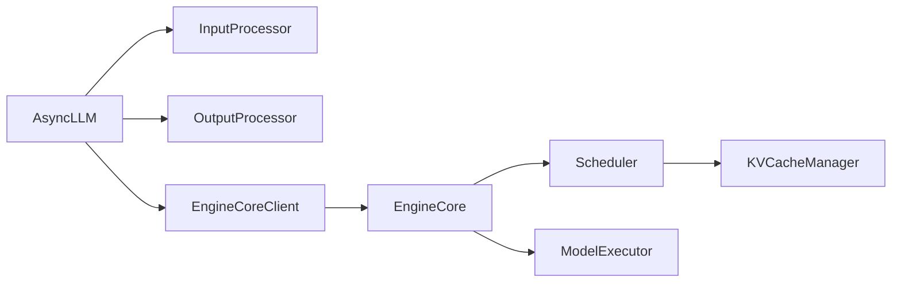

# Core Engine Architecture

<cite>
**Referenced Files in This Document**
- [async_llm.py](file://vllm/v1/engine/async_llm.py)
- [core.py](file://vllm/v1/engine/core.py)
- [core_client.py](file://vllm/v1/engine/core_client.py)
- [input_processor.py](file://vllm/v1/engine/input_processor.py)
- [output_processor.py](file://vllm/v1/engine/output_processor.py)
- [scheduler.py](file://vllm/v1/core/sched/scheduler.py)
- [request_queue.py](file://vllm/v1/core/sched/request_queue.py)
- [llm_engine.py](file://vllm/engine/llm_engine.py)
- [async_llm_engine.py](file://vllm/engine/async_llm_engine.py)
- [llm_engine_example.py](file://examples/offline_inference/llm_engine_example.py)
- [throughput.py](file://vllm/benchmarks/throughput.py)
- [test_scheduler.py](file://tests/v1/core/test_scheduler.py)
- [test_engine_core_client.py](file://tests/v1/engine/test_engine_core_client.py)
</cite>

## Table of Contents
1. [Introduction](#introduction)
2. [Project Structure](#project-structure)
3. [Core Components](#core-components)
4. [Architecture Overview](#architecture-overview)
5. [Detailed Component Analysis](#detailed-component-analysis)
6. [Dependency Analysis](#dependency-analysis)
7. [Performance Considerations](#performance-considerations)
8. [Troubleshooting Guide](#troubleshooting-guide)
9. [Conclusion](#conclusion)
10. [Appendices](#appendices)

## Introduction
This document explains the core engine architecture of vLLM’s AsyncLLM Engine, focusing on the AsyncLLM Engine design, EngineCore communication patterns, and the end-to-end request processing pipeline. It covers how the engine manages model execution, handles concurrent requests, schedules work, coordinates responses, integrates memory management (prefix caching and KV blocks), and applies performance optimizations. Practical guidance is provided for configuration, monitoring, and troubleshooting, along with scalability and deployment considerations.

## Project Structure
At a high level, the AsyncLLM Engine consists of:
- Frontend client (AsyncLLM) that validates inputs, streams outputs, and coordinates lifecycle.
- EngineCore (background process) that performs scheduling, model execution, and KV cache management.
- IPC layer (EngineCoreClient) that communicates via ZeroMQ and msgpack-encoded frames.
- InputProcessor and OutputProcessor that transform raw requests into EngineCoreRequests and produce RequestOutput.
- Scheduler and KV cache managers that implement request queuing, allocation, and prefix caching.

**Diagram sources**
- [async_llm.py](file://vllm/v1/engine/async_llm.py#L1-L200)
- [core_client.py](file://vllm/v1/engine/core_client.py#L260-L320)
- [core.py](file://vllm/v1/engine/core.py#L78-L160)
- [scheduler.py](file://vllm/v1/core/sched/scheduler.py#L60-L120)

**Section sources**
- [async_llm.py](file://vllm/v1/engine/async_llm.py#L1-L200)
- [core.py](file://vllm/v1/engine/core.py#L78-L160)

## Core Components
- AsyncLLM: Orchestrates request ingestion, input preprocessing, output streaming, and lifecycle control (pause/resume, abort, reset caches).
- EngineCoreClient: Manages ZMQ sockets and IPC to the EngineCore process, sending requests and receiving EngineCoreOutputs.
- EngineCore: Initializes KV caches, constructs the Scheduler, executes model batches, and updates state.
- InputProcessor: Validates and converts user prompts into EngineCoreRequest, including multimodal and structured output handling.
- OutputProcessor: Converts EngineCoreOutput into RequestOutput/PoolingRequestOutput, manages per-request queues, and tracks stats/tracing.
- Scheduler: Implements request scheduling policies (priority/FCFS), allocates KV blocks, handles preemption, and builds SchedulerOutput.
- RequestQueues: Provide priority and FCFS queues for waiting requests.

**Section sources**
- [async_llm.py](file://vllm/v1/engine/async_llm.py#L200-L540)
- [core_client.py](file://vllm/v1/engine/core_client.py#L700-L985)
- [core.py](file://vllm/v1/engine/core.py#L268-L365)
- [input_processor.py](file://vllm/v1/engine/input_processor.py#L409-L549)
- [output_processor.py](file://vllm/v1/engine/output_processor.py#L341-L550)
- [scheduler.py](file://vllm/v1/core/sched/scheduler.py#L227-L762)
- [request_queue.py](file://vllm/v1/core/sched/request_queue.py#L49-L217)

## Architecture Overview
The AsyncLLM Engine uses a strict separation of concerns:
- AsyncLLM lives in the frontend process and handles user-facing concerns (validation, streaming, tracing).
- EngineCore runs in a dedicated process and encapsulates scheduling, execution, and KV cache management.
- EngineCoreClient bridges the two via ZMQ DEALER/ROUTER semantics and msgpack encoding.

**Diagram sources**
- [async_llm.py](file://vllm/v1/engine/async_llm.py#L360-L540)
- [core_client.py](file://vllm/v1/engine/core_client.py#L888-L985)
- [core.py](file://vllm/v1/engine/core.py#L338-L473)
- [scheduler.py](file://vllm/v1/core/sched/scheduler.py#L227-L762)

## Detailed Component Analysis

### AsyncLLM Engine
Responsibilities:
- Validate and prepare inputs via InputProcessor.
- Manage per-request output queues and stream RequestOutput to callers.
- Coordinate lifecycle operations: abort, pause/resume, reset caches, profiling, and sleep/wake.
- Run a background output handler that pulls EngineCoreOutputs, processes them, and forwards to per-request collectors.

Key behaviors:
- Asynchronous generation and encoding APIs.
- Backpressure-aware output chunking and throttling.
- Propagation of errors to all active request streams.

**Section sources**
- [async_llm.py](file://vllm/v1/engine/async_llm.py#L272-L540)
- [async_llm.py](file://vllm/v1/engine/async_llm.py#L540-L800)

### EngineCore Communication Patterns
- IPC uses ZMQ DEALER sockets with identity routing and msgpack frames.
- Requests are serialized and sent to EngineCore; EngineCore responds with EngineCoreOutputs.
- EngineCoreClient exposes async methods for add_request, get_output, abort, and utility RPCs.
- EngineCoreProc manages input/output threads, handshake, and DP coordination.

**Diagram sources**
- [core_client.py](file://vllm/v1/engine/core_client.py#L709-L985)
- [core.py](file://vllm/v1/engine/core.py#L1046-L1069)

**Section sources**
- [core_client.py](file://vllm/v1/engine/core_client.py#L263-L320)
- [core_client.py](file://vllm/v1/engine/core_client.py#L859-L985)
- [core.py](file://vllm/v1/engine/core.py#L586-L759)
- [core.py](file://vllm/v1/engine/core.py#L1046-L1069)

### Request Processing Pipeline
End-to-end flow:
- Caller invokes AsyncLLM.add_request()/generate().
- InputProcessor validates and constructs EngineCoreRequest.
- AsyncLLM registers a RequestOutputCollector and sends the request to EngineCore via EngineCoreClient.
- EngineCore adds the Request to the Scheduler and executes model batches.
- EngineCoreOutputs are produced and processed by OutputProcessor to emit RequestOutput.
- On stop conditions, OutputProcessor signals EngineCore to abort the request.

**Diagram sources**
- [async_llm.py](file://vllm/v1/engine/async_llm.py#L360-L540)
- [core.py](file://vllm/v1/engine/core.py#L338-L473)
- [output_processor.py](file://vllm/v1/engine/output_processor.py#L442-L550)

**Section sources**
- [async_llm.py](file://vllm/v1/engine/async_llm.py#L360-L540)
- [output_processor.py](file://vllm/v1/engine/output_processor.py#L442-L550)

### Scheduling Algorithms and Request Queuing
- Policies: Priority and FCFS queues backed by heap/deque.
- Priority queue orders by priority and arrival time; FCFS queue uses FIFO.
- Scheduler computes token budgets, allocates KV blocks, handles preemption, and builds SchedulerOutput.

**Diagram sources**
- [request_queue.py](file://vllm/v1/core/sched/request_queue.py#L49-L217)

**Section sources**
- [request_queue.py](file://vllm/v1/core/sched/request_queue.py#L49-L217)
- [scheduler.py](file://vllm/v1/core/sched/scheduler.py#L227-L762)
- [test_scheduler.py](file://tests/v1/core/test_scheduler.py#L1908-L2125)

### Memory Management Integration (Prefix Caching and KV Blocks)
- KV cache initialization profiles available memory and configures GPU/CPU blocks.
- KVCacheManager allocates slots per request, supports prefix caching, and frees on preemption or finish.
- Prefix caching reduces recomputation by sharing KV blocks across requests with common prefixes.

**Diagram sources**
- [core.py](file://vllm/v1/engine/core.py#L220-L267)
- [scheduler.py](file://vllm/v1/core/sched/scheduler.py#L227-L762)

**Section sources**
- [core.py](file://vllm/v1/engine/core.py#L220-L267)
- [scheduler.py](file://vllm/v1/core/sched/scheduler.py#L227-L762)

### Asynchronous Processing Model
- AsyncLLM uses asyncio tasks for output handling and per-request collectors.
- OutputProcessor merges deltas and streams RequestOutput to callers.
- EngineCoreClient uses asyncio queues and background tasks to process outputs.

**Section sources**
- [async_llm.py](file://vllm/v1/engine/async_llm.py#L472-L541)
- [output_processor.py](file://vllm/v1/engine/output_processor.py#L341-L440)

### EngineCore Busy Loop and Data Parallel Coordination
- EngineCoreProc runs a polling loop to handle input frames, preprocess requests, and drive scheduling.
- For data parallel deployments, EngineCore publishes request counts and coordinates readiness with a DP coordinator.

**Section sources**
- [core.py](file://vllm/v1/engine/core.py#L1046-L1069)
- [core.py](file://vllm/v1/engine/core.py#L1247-L1278)

### Practical Examples and Workflows
- Offline inference example demonstrates initializing LLMEngine and iterating over RequestOutput.
- Benchmark script shows adding multiple requests and streaming outputs.

**Section sources**
- [llm_engine_example.py](file://examples/offline_inference/llm_engine_example.py#L43-L74)
- [throughput.py](file://vllm/benchmarks/throughput.py#L187-L214)

## Dependency Analysis
High-level dependencies:
- AsyncLLM depends on InputProcessor, OutputProcessor, and EngineCoreClient.
- EngineCore depends on Scheduler, KVCacheManager, and ModelExecutor.
- EngineCoreClient depends on ZMQ and msgpack encoders/decoders.
- Scheduler depends on KVCacheManager and structured output manager.

**Diagram sources**
- [async_llm.py](file://vllm/v1/engine/async_llm.py#L1-L120)
- [core.py](file://vllm/v1/engine/core.py#L78-L160)
- [scheduler.py](file://vllm/v1/core/sched/scheduler.py#L60-L120)

**Section sources**
- [async_llm.py](file://vllm/v1/engine/async_llm.py#L1-L120)
- [core.py](file://vllm/v1/engine/core.py#L78-L160)
- [scheduler.py](file://vllm/v1/core/sched/scheduler.py#L60-L120)

## Performance Considerations
- Batch queue and pipeline parallelism: EngineCore supports a batch queue to overlap scheduling and execution, reducing pipeline bubbles.
- Chunked prefill and long prefill thresholds: Scheduler caps per-step token allocations to balance latency and throughput.
- Prefix caching and KV block reuse: Significantly reduce recomputation and memory footprint.
- Async scheduling and speculative decoding: Adjust scheduling and lookahead token handling to improve throughput.
- Output chunking: OutputProcessor splits EngineCoreOutputs into chunks to avoid blocking the event loop.

**Section sources**
- [core.py](file://vllm/v1/engine/core.py#L175-L207)
- [scheduler.py](file://vllm/v1/core/sched/scheduler.py#L227-L762)
- [async_llm.py](file://vllm/v1/engine/async_llm.py#L486-L541)

## Troubleshooting Guide
Common scenarios:
- Engine dead or connection failures: AsyncLLM propagates EngineDeadError; output handler logs failures and propagates errors to request streams.
- Aborted requests: OutputProcessor and EngineCore both clean up request state; abort_requests_async ensures coordinated cleanup.
- Pause/resume: AsyncLLM supports pausing generation and resetting caches; ensure draining before clearing caches.
- Profiling and diagnostics: AsyncLLM supports torch profiler and EngineCoreClient profile RPCs.

Operational tips:
- Use AsyncLLM.check_health() to detect dead engines.
- Inspect scheduler stats and iteration stats via stat loggers.
- Reset prefix cache and multimodal caches when needed using reset APIs.

**Section sources**
- [async_llm.py](file://vllm/v1/engine/async_llm.py#L540-L800)
- [output_processor.py](file://vllm/v1/engine/output_processor.py#L371-L413)
- [test_engine_core_client.py](file://tests/v1/engine/test_engine_core_client.py#L93-L132)

## Conclusion
The AsyncLLM Engine separates frontend orchestration from backend execution via a robust IPC layer. EngineCore centralizes scheduling, execution, and memory management, while InputProcessor and OutputProcessor handle request transformation and response emission. The design emphasizes asynchronous processing, efficient memory reuse, and scalable deployment patterns, enabling high-throughput, low-latency serving.

## Appendices

### Engine Initialization and Lifecycle
- LLMEngine aliases v1 LLMEngine for backward compatibility.
- AsyncLLMEngine is an alias for AsyncLLM.

**Section sources**
- [llm_engine.py](file://vllm/engine/llm_engine.py#L1-L7)
- [async_llm_engine.py](file://vllm/engine/async_llm_engine.py#L1-L7)