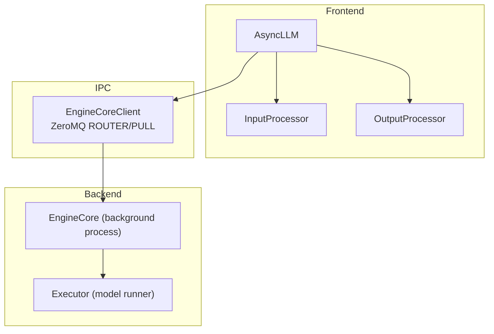
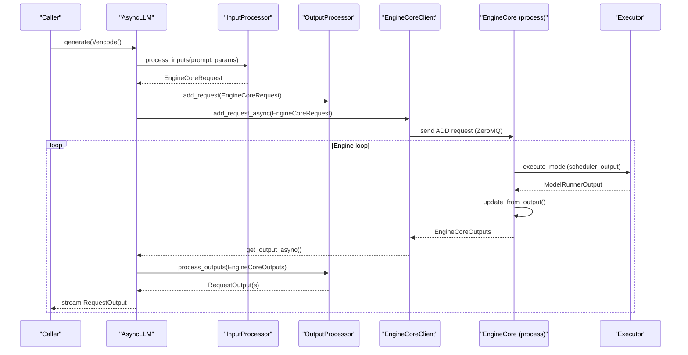
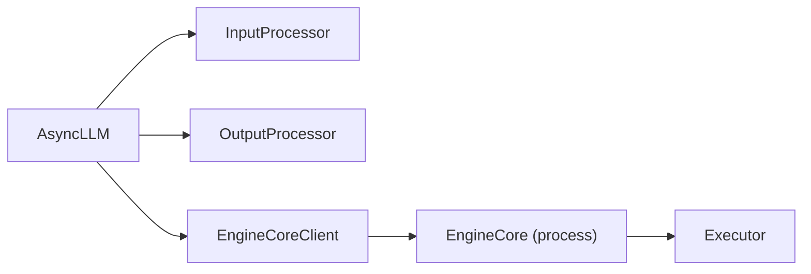

# Engine Components Overview

<cite>
**Referenced Files in This Document**
- [async_llm.py](file://vllm/v1/engine/async_llm.py)
- [core.py](file://vllm/v1/engine/core.py)
- [input_processor.py](file://vllm/v1/engine/input_processor.py)
- [output_processor.py](file://vllm/v1/engine/output_processor.py)
- [core_client.py](file://vllm/v1/engine/core_client.py)
- [utils.py](file://vllm/v1/engine/utils.py)
- [arg_utils.py](file://vllm/engine/arg_utils.py)
- [llm.py](file://vllm/entrypoints/llm.py)
</cite>

## Table of Contents
1. [Introduction](#introduction)
2. [Project Structure](#project-structure)
3. [Core Components](#core-components)
4. [Architecture Overview](#architecture-overview)
5. [Detailed Component Analysis](#detailed-component-analysis)
6. [Dependency Analysis](#dependency-analysis)
7. [Performance Considerations](#performance-considerations)
8. [Troubleshooting Guide](#troubleshooting-guide)
9. [Conclusion](#conclusion)

## Introduction
This document explains the core engine architecture components in vLLM v1, focusing on AsyncLLM, EngineCore, InputProcessor, OutputProcessor, and the Executor subsystem. It describes how these components interact via inter-process communication (IPC) using ZeroMQ, how responsibilities are separated, and how the system supports modular design and extensibility. Practical examples show component initialization, configuration, and monitoring, along with lifecycle and resource management strategies.

## Project Structure
The engine components are organized around a frontend/backend split:
- Frontend (AsyncLLM) manages request ingestion, input preprocessing, output postprocessing, and orchestrates IPC with the backend.
- Backend (EngineCore) runs in a dedicated process, schedules requests, executes model steps, and emits outputs.
- InputProcessor validates and transforms raw prompts into EngineCoreRequest objects.
- OutputProcessor converts EngineCoreOutputs into RequestOutput objects for clients.
- EngineCoreClient abstracts IPC and provides both synchronous and asynchronous clients for multiprocessing scenarios.
- Executor encapsulates model execution and is selected based on configuration.

**Diagram sources**
- [async_llm.py](file://vllm/v1/engine/async_llm.py#L120-L170)
- [core.py](file://vllm/v1/engine/core.py#L78-L120)
- [core_client.py](file://vllm/v1/engine/core_client.py#L430-L550)

**Section sources**
- [async_llm.py](file://vllm/v1/engine/async_llm.py#L120-L170)
- [core.py](file://vllm/v1/engine/core.py#L78-L120)
- [core_client.py](file://vllm/v1/engine/core_client.py#L430-L550)

## Core Components
- AsyncLLM: Orchestrates the engine lifecycle, initializes InputProcessor, OutputProcessor, and EngineCoreClient, and coordinates output handling via an asyncio background task. It exposes APIs for adding requests, generating streams, aborting, and lifecycle controls (pause/resume, sleep/wake).
- EngineCore: The backend engine loop that schedules, executes, and samples tokens. It manages KV caches, structured outputs, and distributed coordination. It exposes methods for add/abort requests, cache resets, LoRA management, and RPC-like utilities.
- InputProcessor: Validates and normalizes inputs (text, multimodal, embeddings), tokenization, and constructs EngineCoreRequest objects. It also manages multimodal caches and validates structured output configurations.
- OutputProcessor: Converts EngineCoreOutputs into RequestOutput or PoolingRequestOutput, handles detokenization, log probability computation, stop-string detection, and tracing. It maintains per-request state and supports streaming intervals and parent-child sampling.
- EngineCoreClient: Provides IPC abstraction for multiprocessing. It supports in-process, synchronous, and asynchronous clients. It manages ZeroMQ sockets, request serialization, and utility RPC calls to the backend.

**Section sources**
- [async_llm.py](file://vllm/v1/engine/async_llm.py#L120-L170)
- [core.py](file://vllm/v1/engine/core.py#L78-L120)
- [input_processor.py](file://vllm/v1/engine/input_processor.py#L42-L120)
- [output_processor.py](file://vllm/v1/engine/output_processor.py#L341-L420)
- [core_client.py](file://vllm/v1/engine/core_client.py#L61-L122)

## Architecture Overview
The AsyncLLM frontend communicates with EngineCore via EngineCoreClient using ZeroMQ. Requests flow from AsyncLLM to EngineCore through serialized EngineCoreRequest messages. Outputs flow back asynchronously to AsyncLLM, which delegates postprocessing to OutputProcessor and streams results to callers.

**Diagram sources**
- [async_llm.py](file://vllm/v1/engine/async_llm.py#L360-L470)
- [core_client.py](file://vllm/v1/engine/core_client.py#L723-L756)
- [core.py](file://vllm/v1/engine/core.py#L338-L365)
- [output_processor.py](file://vllm/v1/engine/output_processor.py#L442-L546)

## Detailed Component Analysis

### AsyncLLM
Responsibilities:
- Initialize InputProcessor, OutputProcessor, and EngineCoreClient.
- Manage asyncio output handler that continuously pulls EngineCoreOutputs and feeds them to OutputProcessor.
- Expose request APIs (generate, encode), abort, pause/resume, sleep/wake, LoRA management, and RPC utilities.
- Coordinate logging and observability (tracing, stats).

Key behaviors:
- Lazily starts the output handler on first generate/encode call.
- Uses RequestOutputCollector per request to decouple producer/consumer.
- Supports multiprocess and asyncio modes via EngineCoreClient factory.

Practical examples:
- Initialization from V1 config or CLI args.
- Adding a request and streaming outputs.
- Aborting requests and pausing generation.

**Section sources**
- [async_llm.py](file://vllm/v1/engine/async_llm.py#L120-L170)
- [async_llm.py](file://vllm/v1/engine/async_llm.py#L200-L252)
- [async_llm.py](file://vllm/v1/engine/async_llm.py#L360-L470)
- [async_llm.py](file://vllm/v1/engine/async_llm.py#L543-L554)
- [async_llm.py](file://vllm/v1/engine/async_llm.py#L555-L606)
- [async_llm.py](file://vllm/v1/engine/async_llm.py#L747-L762)

### EngineCore
Responsibilities:
- Initialize model executor, KV caches, scheduler, structured output manager, and multimodal receiver cache.
- Schedule requests, execute model steps, and produce EngineCoreOutputs.
- Support aborts, cache resets, LoRA operations, profiling, and RPC utilities.
- Manage DP coordination and readiness handshakes.

Key behaviors:
- Busy loop polls input queue and steps the engine when work is available.
- Supports batch queue for pipeline parallelism.
- Preprocesses EngineCoreRequest into internal Request objects and handles structured output grammar initialization.

Practical examples:
- Step scheduling and execution.
- Resetting caches and managing LoRA adapters.
- Handshakes and DP coordination.

**Section sources**
- [core.py](file://vllm/v1/engine/core.py#L78-L120)
- [core.py](file://vllm/v1/engine/core.py#L268-L303)
- [core.py](file://vllm/v1/engine/core.py#L338-L365)
- [core.py](file://vllm/v1/engine/core.py#L861-L891)
- [core.py](file://vllm/v1/engine/core.py#L890-L926)

### InputProcessor
Responsibilities:
- Validate SamplingParams and PoolingParams.
- Tokenize prompts, preprocess multimodal inputs, and construct EngineCoreRequest.
- Manage multimodal caches and validate structured output grammar backends.
- Enforce model input constraints and vocab boundaries.

Key behaviors:
- Validates logprobs, penalties, structured outputs, and tokenizer compatibility.
- Builds multimodal UUIDs for cache reuse when configured.
- Normalizes prompt token ids/embeddings and EOS handling.

Practical examples:
- Processing a text prompt into EngineCoreRequest.
- Handling multimodal prompts and structured outputs.

**Section sources**
- [input_processor.py](file://vllm/v1/engine/input_processor.py#L101-L183)
- [input_processor.py](file://vllm/v1/engine/input_processor.py#L184-L370)
- [input_processor.py](file://vllm/v1/engine/input_processor.py#L409-L548)

### OutputProcessor
Responsibilities:
- Convert EngineCoreOutputs to RequestOutput or PoolingRequestOutput.
- Detokenize tokens, compute log probabilities, and detect stop conditions.
- Maintain per-request state, handle parent/child sampling, and manage tracing.
- Aggregate and stream outputs according to output kinds and stream intervals.

Key behaviors:
- Tracks request states and removes finished requests.
- Propagates errors to all active generators.
- Updates iteration and request-level statistics.

Practical examples:
- Processing EngineCoreOutputs into RequestOutput stream.
- Handling parent/child sampling and stop-string aborts.

**Section sources**
- [output_processor.py](file://vllm/v1/engine/output_processor.py#L341-L420)
- [output_processor.py](file://vllm/v1/engine/output_processor.py#L442-L546)
- [output_processor.py](file://vllm/v1/engine/output_processor.py#L548-L661)

### EngineCoreClient and IPC
Responsibilities:
- Provide unified interface for in-process, synchronous, and asynchronous multiprocessing clients.
- Manage ZeroMQ sockets for input/output and utility RPC.
- Serialize/deserialize EngineCoreRequest and EngineCoreOutputs.
- Monitor engine liveness and propagate failures.

Key behaviors:
- Factory selects AsyncMPClient for AsyncLLM and SyncMPClient for synchronous usage.
- AsyncMPClient uses asyncio tasks to receive outputs and utility results.
- Supports DP modes (internal/external/hybrid) and engine manager orchestration.

Practical examples:
- Creating an async multiprocessing client.
- Sending ADD and ABORT requests and receiving EngineCoreOutputs.
- Utility RPC for supported tasks and cache operations.

**Section sources**
- [core_client.py](file://vllm/v1/engine/core_client.py#L61-L122)
- [core_client.py](file://vllm/v1/engine/core_client.py#L430-L550)
- [core_client.py](file://vllm/v1/engine/core_client.py#L709-L756)
- [core_client.py](file://vllm/v1/engine/core_client.py#L888-L952)

### Executor and Lifecycle Management
- Executor is selected based on V1 configuration and encapsulates model execution.
- EngineCore initializes the Executor and manages KV cache allocation and warmup.
- EngineCoreProc performs handshake with frontends, sets up input/output threads, and runs the busy loop.
- Utils module launches EngineCore processes and manages DP ranks.

Lifecycle and resource allocation:
- Startup: handshake, KV cache profiling, executor initialization, scheduler setup.
- Runtime: busy loop, input queue polling, step execution, output emission.
- Shutdown: graceful shutdown of executor and scheduler, socket cleanup.

**Section sources**
- [core.py](file://vllm/v1/engine/core.py#L103-L148)
- [core.py](file://vllm/v1/engine/core.py#L220-L266)
- [core.py](file://vllm/v1/engine/core.py#L586-L709)
- [utils.py](file://vllm/v1/engine/utils.py#L87-L130)

## Dependency Analysis
The frontend-backend boundary is enforced by EngineCoreClient and EngineCoreRequest/Outputs serialization. InputProcessor and OutputProcessor are tightly coupled to AsyncLLM, while EngineCore is isolated behind IPC.

**Diagram sources**
- [async_llm.py](file://vllm/v1/engine/async_llm.py#L120-L170)
- [core_client.py](file://vllm/v1/engine/core_client.py#L430-L550)
- [core.py](file://vllm/v1/engine/core.py#L78-L120)

**Section sources**
- [async_llm.py](file://vllm/v1/engine/async_llm.py#L120-L170)
- [core_client.py](file://vllm/v1/engine/core_client.py#L430-L550)
- [core.py](file://vllm/v1/engine/core.py#L78-L120)

## Performance Considerations
- Asynchronous output processing: OutputProcessor slices EngineCoreOutputs to avoid blocking the event loop for extended periods.
- Streaming intervals: OutputProcessor supports configurable stream intervals to balance latency and throughput.
- IPC batching: EngineCoreClient tracks pending ZMQ messages and frees auxiliary buffers promptly to reduce memory pressure.
- Batch queue: EngineCore supports a batch queue for pipeline parallelism to overlap scheduling and execution.
- Profiling and tracing: Optional Torch profiler and OTLP tracing are integrated for observability.

[No sources needed since this section provides general guidance]

## Troubleshooting Guide
Common issues and diagnostics:
- Engine dead: EngineCoreClient raises EngineDeadError when backend dies; AsyncLLM surfaces this to callers.
- Output handler failures: Exceptions in the output handler are propagated to all active generators.
- Abort semantics: OutputProcessor and EngineCore both handle aborts; ensure stop-string detections trigger aborts when needed.
- Health checks: AsyncLLM exposes check_health to surface engine status.

Monitoring and utilities:
- Stats logging: StatLoggerManager records iteration and scheduler stats.
- Prometheus: Prometheus metrics are managed and can be shut down gracefully.
- Utility RPC: Use collective RPC to invoke backend utilities.

**Section sources**
- [async_llm.py](file://vllm/v1/engine/async_llm.py#L538-L541)
- [async_llm.py](file://vllm/v1/engine/async_llm.py#L719-L735)
- [core_client.py](file://vllm/v1/engine/core_client.py#L712-L722)
- [core_client.py](file://vllm/v1/engine/core_client.py#L888-L952)

## Conclusion
The vLLM v1 engine employs a clean frontend/backend separation with AsyncLLM coordinating request lifecycle and IPC, while EngineCore executes model steps in a dedicated process. InputProcessor and OutputProcessor encapsulate request normalization and response shaping, respectively. EngineCoreClient provides robust IPC abstractions for multiprocessing and asyncio environments. The modular design enables easy extension, strong separation of concerns, and scalable runtime behavior.