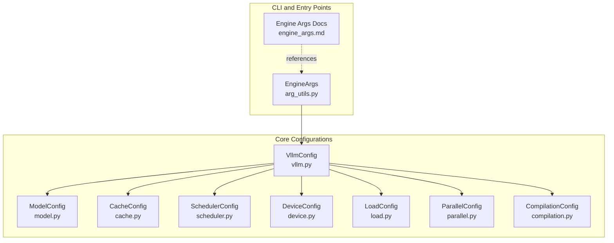
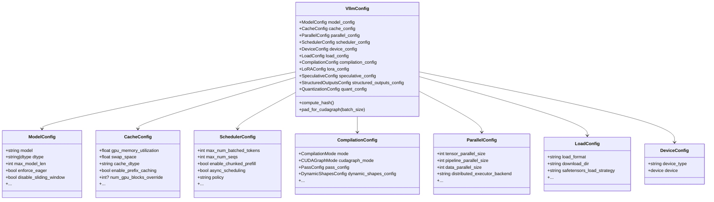
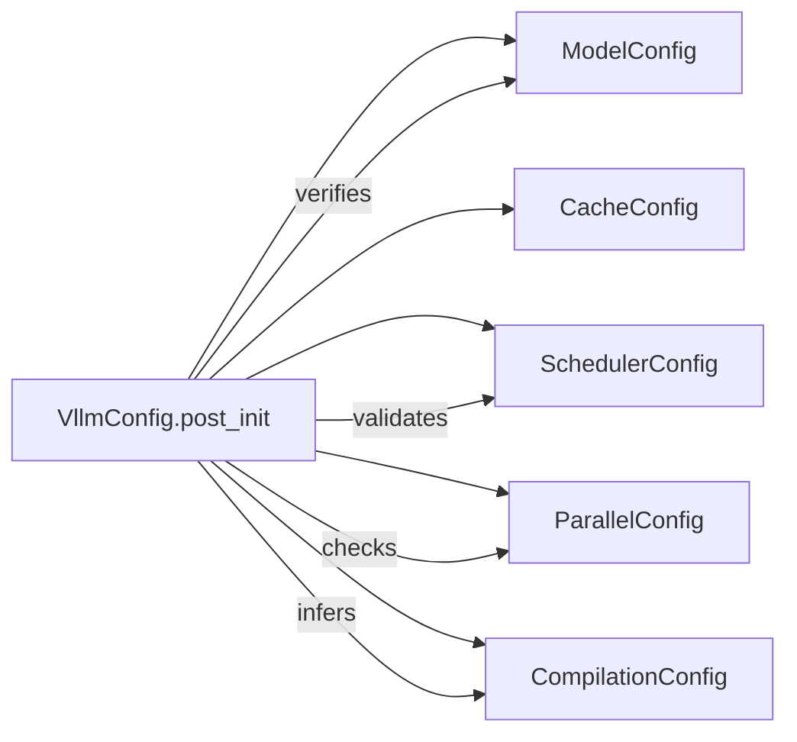

# Engine Configuration

<cite>
**Referenced Files in This Document**
- [vllm.py](file://vllm/config/vllm.py)
- [model.py](file://vllm/config/model.py)
- [scheduler.py](file://vllm/config/scheduler.py)
- [cache.py](file://vllm/config/cache.py)
- [device.py](file://vllm/config/device.py)
- [compilation.py](file://vllm/config/compilation.py)
- [load.py](file://vllm/config/load.py)
- [parallel.py](file://vllm/config/parallel.py)
- [arg_utils.py](file://vllm/engine/arg_utils.py)
- [engine_args.md](file://docs/configuration/engine_args.md)
- [json_tip.inc.md](file://docs/cli/json_tip.inc.md)
- [argparse_utils.py](file://vllm/utils/argparse_utils.py)
- [utils.py](file://vllm/config/utils.py)
- [validate_config.py](file://tools/pre_commit/validate_config.py)
</cite>

## Table of Contents
1. [Introduction](#introduction)
2. [Project Structure](#project-structure)
3. [Core Components](#core-components)
4. [Architecture Overview](#architecture-overview)
5. [Detailed Component Analysis](#detailed-component-analysis)
6. [Dependency Analysis](#dependency-analysis)
7. [Performance Considerations](#performance-considerations)
8. [Troubleshooting Guide](#troubleshooting-guide)
9. [Conclusion](#conclusion)
10. [Appendices](#appendices)

## Introduction
This document explains how to configure and tune the vLLM engine for optimal performance and behavior. It covers the engine configuration surface area, including model parameters, scheduler settings, memory management, compilation and CUDA graph options, parallel execution, and hardware-specific considerations. It also documents configuration validation, defaults, best practices, and common pitfalls, with practical examples and troubleshooting guidance.

## Project Structure
The engine configuration is modeled as a set of strongly typed configuration classes, orchestrated by a central VllmConfig that aggregates model, cache, scheduler, compilation, parallel, and other subsystems. Users typically interact with these configurations via CLI arguments or programmatic construction.

**Diagram sources**
- [arg_utils.py](file://vllm/engine/arg_utils.py#L1-L200)
- [engine_args.md](file://docs/configuration/engine_args.md#L1-L23)
- [vllm.py](file://vllm/config/vllm.py#L174-L244)
- [model.py](file://vllm/config/model.py#L96-L170)
- [cache.py](file://vllm/config/cache.py#L37-L120)
- [scheduler.py](file://vllm/config/scheduler.py#L26-L120)
- [device.py](file://vllm/config/device.py#L17-L50)
- [load.py](file://vllm/config/load.py#L23-L70)
- [parallel.py](file://vllm/config/parallel.py#L81-L120)
- [compilation.py](file://vllm/config/compilation.py#L292-L360)

**Section sources**
- [arg_utils.py](file://vllm/engine/arg_utils.py#L1-L200)
- [engine_args.md](file://docs/configuration/engine_args.md#L1-L23)

## Core Components
- VllmConfig: Central aggregation of all engine configuration pieces. It defines defaults, computes a stable hash for caching compiled graphs, and performs cross-config validation and normalization.
- ModelConfig: Controls model resolution, dtype selection, tokenizer configuration, multimodal settings, and generation behavior.
- CacheConfig: Governs KV cache sizing, dtype, prefix caching, CPU offload, and Mamba-specific cache settings.
- SchedulerConfig: Controls batching budgets, chunked prefill, scheduling policy, and async scheduling behavior.
- CompilationConfig: Controls torch.compile mode, cudagraph capture, inductor passes, and dynamic shapes.
- ParallelConfig: Controls tensor/pipeline/expert/data parallelism, all-to-all backends, and distributed execution backend.
- LoadConfig: Controls weight loading format, download directory, safetensors loading strategy, and device mapping.
- DeviceConfig: Selects device type and validates platform compatibility.

**Section sources**
- [vllm.py](file://vllm/config/vllm.py#L174-L244)
- [model.py](file://vllm/config/model.py#L96-L170)
- [cache.py](file://vllm/config/cache.py#L37-L120)
- [scheduler.py](file://vllm/config/scheduler.py#L26-L120)
- [compilation.py](file://vllm/config/compilation.py#L292-L360)
- [parallel.py](file://vllm/config/parallel.py#L81-L120)
- [load.py](file://vllm/config/load.py#L23-L70)
- [device.py](file://vllm/config/device.py#L17-L50)

## Architecture Overview
The engine composes multiple configuration objects into a single VllmConfig. During initialization, VllmConfig validates and normalizes settings, infers defaults, and enforces compatibility across components (e.g., scheduler constraints with model dtype, parallel constraints with cudagraph modes).

**Diagram sources**
- [vllm.py](file://vllm/config/vllm.py#L174-L244)
- [model.py](file://vllm/config/model.py#L96-L170)
- [cache.py](file://vllm/config/cache.py#L37-L120)
- [scheduler.py](file://vllm/config/scheduler.py#L26-L120)
- [compilation.py](file://vllm/config/compilation.py#L292-L360)
- [parallel.py](file://vllm/config/parallel.py#L81-L120)
- [load.py](file://vllm/config/load.py#L23-L70)
- [device.py](file://vllm/config/device.py#L17-L50)

## Detailed Component Analysis

### VllmConfig: Central Orchestration and Validation
- Aggregates all sub-configs and provides a unified compute_hash for caching compiled graphs.
- Applies optimization-level defaults (O0–O3) and normalizes compilation and cudagraph modes.
- Validates cross-config compatibility (e.g., async scheduling constraints, encoder-decoder limitations, eager mode overrides).
- Infers quantization configuration and custom op defaults based on model and platform.

Key behaviors:
- Optimization levels map to pass and cudagraph defaults.
- Enforces that cudagraph mode is compatible with compilation mode.
- Ensures async scheduling is only enabled when supported by backend and compatible with speculative decoding and pipeline parallelism.
- Adjusts sequence parallelism and custom ops when fusion passes are enabled.

**Section sources**
- [vllm.py](file://vllm/config/vllm.py#L105-L171)
- [vllm.py](file://vllm/config/vllm.py#L442-L470)
- [vllm.py](file://vllm/config/vllm.py#L513-L603)
- [vllm.py](file://vllm/config/vllm.py#L603-L733)
- [vllm.py](file://vllm/config/vllm.py#L733-L800)

### ModelConfig: Model Parameters and Behavior
- Model resolution: model name/path, tokenizer, tokenizer_mode, trust_remote_code, revision, code_revision, tokenizer_revision.
- Precision and dtype: dtype selection, enforce_eager, override_attention_dtype.
- Generation and sampling: max_model_len, logprobs_mode, max_logprobs, disable_sliding_window, logits_processors, generation_config, override_generation_config.
- Multimodal: multimodal_config, media handling, encoder attention backend, and cache settings.
- Pooling: pooler_config for pooling runners.
- Quantization: quantization method and dtype constraints are validated against platform capabilities.

Best practices:
- Use “auto” dtype unless you have specific memory/performance goals.
- Disable sliding window only when necessary; it may limit effective context.
- For encoder-decoder models, avoid chunked prefill and prefix caching (handled by scheduler).

**Section sources**
- [model.py](file://vllm/config/model.py#L96-L170)
- [model.py](file://vllm/config/model.py#L170-L260)
- [model.py](file://vllm/config/model.py#L260-L360)
- [model.py](file://vllm/config/model.py#L360-L480)
- [model.py](file://vllm/config/model.py#L480-L620)
- [model.py](file://vllm/config/model.py#L620-L720)

### CacheConfig: Memory Management Options
- GPU memory utilization and swap space for CPU offload.
- KV cache dtype choices (auto, bfloat16, fp8 variants) with platform-specific support.
- Prefix caching and hash algorithm selection.
- KV offloading buffer size and backend (“native”, “lmcache”) with per-rank allocation.
- Mamba-specific cache dtype and page/block sizing.
- Runtime verification of swap space feasibility.

Guidelines:
- Prefer fp8 cache dtype on supported GPUs to reduce memory footprint.
- Use prefix caching for long-lived sessions to amortize KV compute.
- Tune gpu_memory_utilization and kv_cache_memory_bytes for deterministic sizing.

**Section sources**
- [cache.py](file://vllm/config/cache.py#L37-L120)
- [cache.py](file://vllm/config/cache.py#L120-L200)
- [cache.py](file://vllm/config/cache.py#L200-L233)

### SchedulerConfig: Batching and Prefill Strategy
- Budgets: max_num_batched_tokens, max_num_seqs, max_num_partial_prefills, long_prefill_token_threshold.
- Chunked prefill: enable_chunked_prefill, max_long_partial_prefills, long_prefill_token_threshold.
- Policy: fcfs or priority scheduling.
- Async scheduling: async_scheduling with compatibility constraints.
- Streaming: stream_interval for host-side batching.

Validation:
- Enforces max_num_batched_tokens ≥ max_num_seqs and reasonable ratios.
- Disables chunked prefill and prefix caching for encoder-decoder models.

**Section sources**
- [scheduler.py](file://vllm/config/scheduler.py#L26-L120)
- [scheduler.py](file://vllm/config/scheduler.py#L146-L178)
- [scheduler.py](file://vllm/config/scheduler.py#L215-L300)

### CompilationConfig: torch.compile and CUDA Graphs
- CompilationMode: NONE, STOCK_TORCH_COMPILE, DYNAMO_TRACE_ONCE, VLLM_COMPILE.
- CUDAGraphMode: NONE, PIECEWISE, FULL, FULL_DECODE_ONLY, FULL_AND_PIECEWISE.
- PassConfig: fusion toggles (norm, act, attn, allreduce, qk_norm_rope), sequence parallelism, async TP.
- DynamicShapesConfig: backed/unbacked/backed_size_oblivious modes and guard evaluation.
- Splitting ops and cudagraph capture sizes; warmups; LoRA specialization.

Defaults and normalization:
- Optimization level selects pass and cudagraph defaults.
- Mode defaults to VLLM_COMPILE for O1+; eager disables optimizations.
- Piecewise cudagraphs require appropriate splitting ops and inductor partitioning.

**Section sources**
- [compilation.py](file://vllm/config/compilation.py#L36-L96)
- [compilation.py](file://vllm/config/compilation.py#L100-L188)
- [compilation.py](file://vllm/config/compilation.py#L253-L360)
- [compilation.py](file://vllm/config/compilation.py#L360-L570)
- [compilation.py](file://vllm/config/compilation.py#L570-L800)

### ParallelConfig: Distributed Execution
- Tensor, pipeline, prefill context, and data parallel sizes.
- Data parallel backends and external/hybrid load balancing modes.
- Expert parallelism and EPLB configuration.
- All2All backends for MoE communication.
- Distributed executor backend selection and validation.

Constraints:
- Validates DP rank ranges and backend combinations.
- Disables custom allreduce on multi-node or unsupported platforms.
- Computes world_size and default backends based on environment.

**Section sources**
- [parallel.py](file://vllm/config/parallel.py#L81-L120)
- [parallel.py](file://vllm/config/parallel.py#L277-L321)
- [parallel.py](file://vllm/config/parallel.py#L498-L551)
- [parallel.py](file://vllm/config/parallel.py#L552-L666)

### LoadConfig: Weight Loading
- Load formats: auto, safetensors, pt, npcache, dummy, tensorizer, runai_streamer, bitsandbytes, sharded_state, gguf, mistral.
- Download directory and safetensors loading strategy (lazy, eager, torchao).
- Device mapping and ignore patterns for checkpoint hygiene.
- Progress bar toggle.

**Section sources**
- [load.py](file://vllm/config/load.py#L23-L70)
- [load.py](file://vllm/config/load.py#L70-L125)

### DeviceConfig: Hardware Selection
- device_type is auto-detected from the current platform; device is set accordingly except for TPU where inputs are processed on CPU.
- Validates platform availability and logs helpful diagnostics.

**Section sources**
- [device.py](file://vllm/config/device.py#L17-L50)
- [device.py](file://vllm/config/device.py#L51-L76)

### Engine Arguments and CLI Interaction
- EngineArgs and AsyncEngineArgs expose VllmConfig fields as CLI options.
- JSON-style CLI supports nested objects and lists; flexible argument parsing converts underscores/dashes and -O flags.
- JSON tip shows equivalent forms for nested structures and list elements.

**Section sources**
- [engine_args.md](file://docs/configuration/engine_args.md#L1-L23)
- [arg_utils.py](file://vllm/engine/arg_utils.py#L1125-L1160)
- [argparse_utils.py](file://vllm/utils/argparse_utils.py#L230-L260)
- [json_tip.inc.md](file://docs/cli/json_tip.inc.md#L1-L9)

## Dependency Analysis
VllmConfig orchestrates subsystems and enforces compatibility. The following diagram highlights key dependencies and validations.

**Diagram sources**
- [vllm.py](file://vllm/config/vllm.py#L513-L603)
- [vllm.py](file://vllm/config/vllm.py#L603-L733)

**Section sources**
- [vllm.py](file://vllm/config/vllm.py#L513-L603)
- [vllm.py](file://vllm/config/vllm.py#L603-L733)

## Performance Considerations
- Startup vs throughput trade-offs:
  - O0 minimizes startup time; O2/O3 maximize throughput with compilation and cudagraphs.
  - enforce_eager disables cudagraphs and compilation for predictable startup.
- CUDAGraph capture:
  - Prefer FULL_AND_PIECEWISE for most models; FULL_DECODE_ONLY for decode-heavy workloads.
  - Warmup runs reduce first-run overhead; tune cudagraph_num_of_warmups.
- Fusion and passes:
  - Enable fuse_norm_quant, fuse_act_quant, fuse_attn_quant when using FP8 quantization.
  - Sequence parallelism and async TP require compatible custom ops and passes.
- Memory:
  - Use fp8 cache dtype on supported GPUs; adjust gpu_memory_utilization and kv_cache_memory_bytes.
  - Prefix caching reduces KV compute; choose appropriate hash algorithm.
- Scheduler:
  - Increase max_num_batched_tokens and max_num_seqs to improve throughput; ensure they exceed model length constraints.
  - Enable chunked prefill for long prompts; tune thresholds for latency/throughput balance.
- Parallelism:
  - Choose appropriate TP/PP/DP sizes; ensure world_size fits available GPUs.
  - Use expert parallelism with EPLB for MoE models; select all2all backend carefully.

[No sources needed since this section provides general guidance]

## Troubleshooting Guide
Common issues and resolutions:
- Async scheduling disabled:
  - Cause: Pipeline parallelism > 1 or speculative decoding enabled; unsupported backend.
  - Fix: Disable pipeline parallelism or speculative decoding; use supported backend.
- Encoder-decoder model limitations:
  - Symptom: Chunked prefill and prefix caching disabled.
  - Fix: Accept reduced prefill throughput; focus on decode performance.
- FP8 cache dtype warnings:
  - Cause: Using fp8 cache without proper scaling or unsupported platform.
  - Fix: Verify platform support and consider bfloat16 cache dtype.
- Swap space too large:
  - Cause: Excessive CPU swap space allocation.
  - Fix: Reduce swap_space or ensure adequate CPU memory.
- Cudagraph and eager mode conflict:
  - Cause: enforce_eager disables cudagraphs.
  - Fix: Remove enforce_eager or lower optimization level.
- Quantization incompatibility:
  - Cause: Selected quantization method not supported by GPU capability or dtype.
  - Fix: Change quantization method or dtype; verify minimum capability.

**Section sources**
- [vllm.py](file://vllm/config/vllm.py#L571-L603)
- [cache.py](file://vllm/config/cache.py#L213-L233)
- [compilation.py](file://vllm/config/compilation.py#L737-L800)

## Conclusion
Effective engine configuration requires balancing startup time, memory footprint, and throughput. Use VllmConfig’s defaults as a baseline, then iterate on scheduler budgets, memory settings, compilation modes, and parallelism to match your workload. Validate configurations using the provided CLI and ensure platform compatibility.

[No sources needed since this section summarizes without analyzing specific files]

## Appendices

### Configuration Scenarios and Effects
- Low-latency interactive serving:
  - Use O1–O2, enable prefix caching, tune max_num_batched_tokens and stream_interval, keep cudagraph warmups minimal.
- High-throughput offline inference:
  - Use O2–O3, FULL_AND_PIECEWISE cudagraphs, fp8 cache dtype, increase max_num_batched_tokens and max_num_seqs.
- Memory-constrained deployments:
  - Reduce gpu_memory_utilization, enable CPU swap space cautiously, consider encoder-decoder decode-only mode.
- Multi-node or heterogeneous clusters:
  - Use mp or external_launcher backends; disable custom allreduce; validate world_size and node counts.

[No sources needed since this section provides general guidance]

### Configuration Validation and Best Practices
- Validation pipeline:
  - Pre-commit validator enforces @config/@dataclass usage, default presence, docstrings, and Literal constraints.
  - Runtime validators in configs check ranges, platform support, and cross-field consistency.
- Best practices:
  - Start with defaults; adjust incrementally; monitor metrics and latency/throughput trade-offs.
  - Use JSON CLI forms for complex nested structures; leverage -O flags for quick optimization toggles.
  - Keep quantization and dtype aligned with model and platform capabilities.

**Section sources**
- [validate_config.py](file://tools/pre_commit/validate_config.py#L53-L111)
- [utils.py](file://vllm/config/utils.py#L166-L201)
- [argparse_utils.py](file://vllm/utils/argparse_utils.py#L230-L260)
- [json_tip.inc.md](file://docs/cli/json_tip.inc.md#L1-L9)