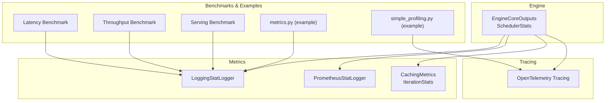
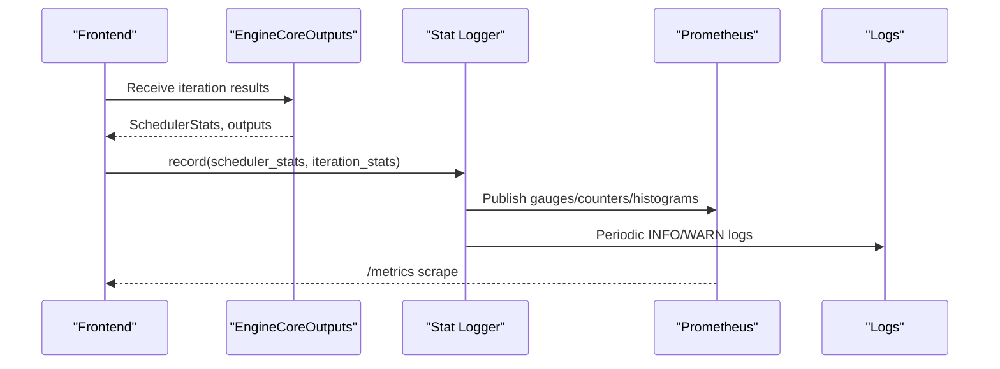
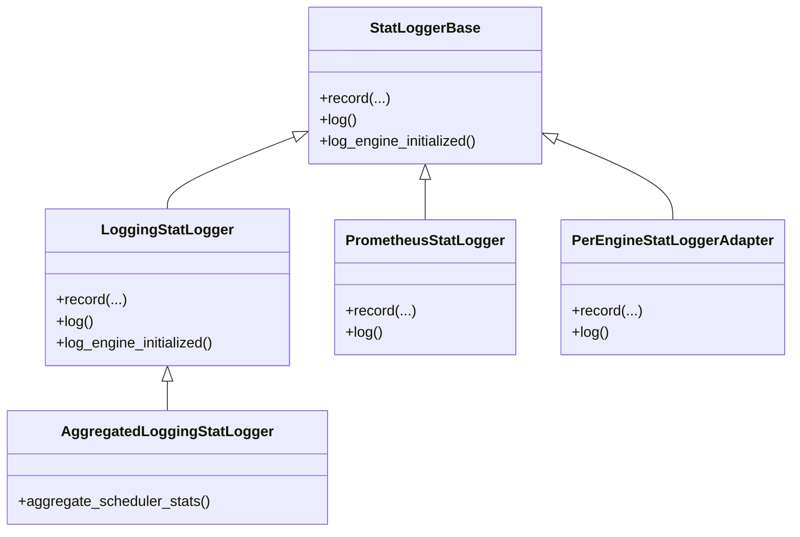
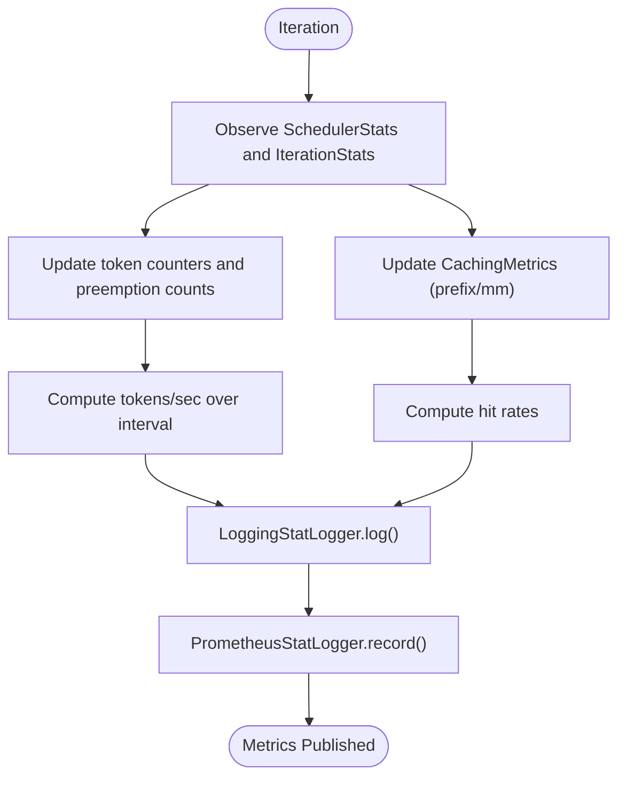
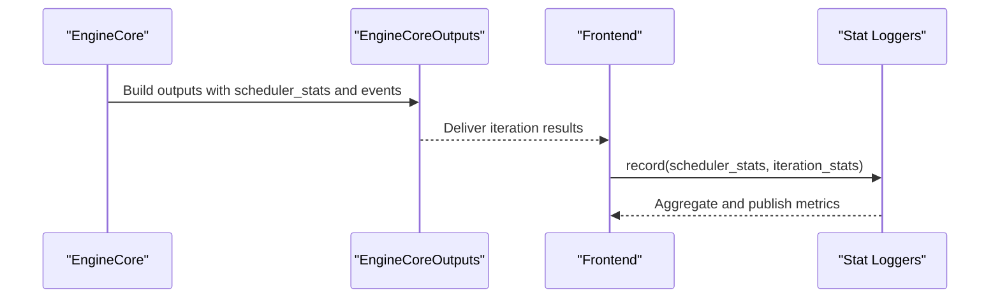
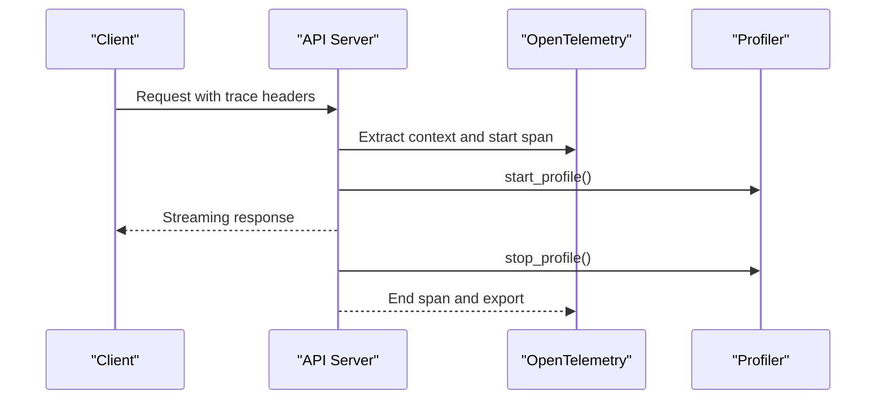
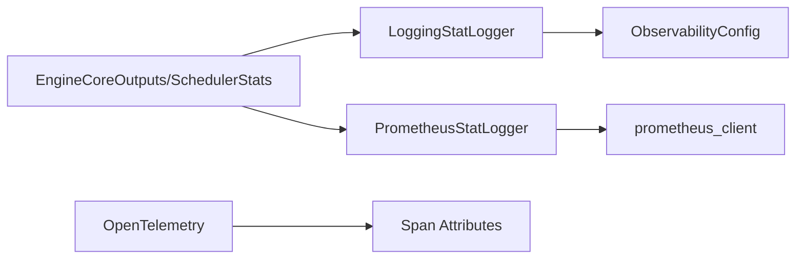

# Performance Monitoring and Metrics

<cite>
**Referenced Files in This Document**
- [metrics.md](file://docs/design/metrics.md)
- [metrics.py](file://examples/offline_inference/metrics.py)
- [simple_profiling.py](file://examples/offline_inference/simple_profiling.py)
- [loggers.py](file://vllm/v1/metrics/loggers.py)
- [stats.py](file://vllm/v1/metrics/stats.py)
- [prometheus.py](file://vllm/v1/metrics/prometheus.py)
- [observability.py](file://vllm/config/observability.py)
- [tracing.py](file://vllm/tracing.py)
- [coordinator.py](file://vllm/v1/engine/coordinator.py)
- [__init__.py](file://vllm/v1/engine/__init__.py)
- [latency.py](file://vllm/benchmarks/latency.py)
- [throughput.py](file://vllm/benchmarks/throughput.py)
- [serve.py](file://vllm/benchmarks/serve.py)
- [benchmark_serving_structured_output.py](file://benchmarks/benchmark_serving_structured_output.py)
- [generate_metrics.py](file://docs/mkdocs/hooks/generate_metrics.py)
</cite>

## Table of Contents
1. [Introduction](#introduction)
2. [Project Structure](#project-structure)
3. [Core Components](#core-components)
4. [Architecture Overview](#architecture-overview)
5. [Detailed Component Analysis](#detailed-component-analysis)
6. [Dependency Analysis](#dependency-analysis)
7. [Performance Considerations](#performance-considerations)
8. [Troubleshooting Guide](#troubleshooting-guide)
9. [Conclusion](#conclusion)
10. [Appendices](#appendices)

## Introduction
This document explains vLLM’s performance monitoring and metrics system for the V1 engine. It covers how metrics are collected, aggregated, and published; the available metrics (throughput, latency, memory usage, and resource utilization); logging and Prometheus publishing; stat loggers and custom metric collection; performance profiling and tracing integration; and practical guidance for visualization, alerting, and capacity planning. It also details the relationship between engine components and monitoring data, and how to integrate with external observability platforms.

## Project Structure
The observability stack spans several modules:
- Metrics definition and publication: PrometheusStatLogger, LoggingStatLogger, and supporting stat types
- Engine integration: EngineCoreOutputs and SchedulerStats propagate timing and state for metrics
- Tracing: OpenTelemetry integration for request-level tracing
- Benchmarks and examples: Scripts to collect and visualize metrics and profiles
- Configuration: ObservabilityConfig toggles for tracing, KV cache residency metrics, CUDA graph metrics, and MFU

**Diagram sources**
- [loggers.py](file://vllm/v1/metrics/loggers.py#L94-L268)
- [prometheus.py](file://vllm/v1/metrics/prometheus.py#L1-L83)
- [stats.py](file://vllm/v1/metrics/stats.py#L180-L383)
- [tracing.py](file://vllm/tracing.py#L55-L101)
- [latency.py](file://vllm/benchmarks/latency.py)
- [throughput.py](file://vllm/benchmarks/throughput.py)
- [serve.py](file://vllm/benchmarks/serve.py#L860-L897)
- [benchmark_serving_structured_output.py](file://benchmarks/benchmark_serving_structured_output.py#L607-L644)
- [metrics.py](file://examples/offline_inference/metrics.py#L1-L51)
- [simple_profiling.py](file://examples/offline_inference/simple_profiling.py#L1-L53)

**Section sources**
- [metrics.md](file://docs/design/metrics.md#L1-L120)
- [loggers.py](file://vllm/v1/metrics/loggers.py#L94-L268)
- [stats.py](file://vllm/v1/metrics/stats.py#L180-L383)
- [prometheus.py](file://vllm/v1/metrics/prometheus.py#L1-L83)
- [observability.py](file://vllm/config/observability.py#L1-L144)
- [tracing.py](file://vllm/tracing.py#L55-L101)
- [latency.py](file://vllm/benchmarks/latency.py)
- [throughput.py](file://vllm/benchmarks/throughput.py)
- [serve.py](file://vllm/benchmarks/serve.py#L860-L897)
- [benchmark_serving_structured_output.py](file://benchmarks/benchmark_serving_structured_output.py#L607-L644)
- [metrics.py](file://examples/offline_inference/metrics.py#L1-L51)
- [simple_profiling.py](file://examples/offline_inference/simple_profiling.py#L1-L53)

## Core Components
- Stat loggers:
  - LoggingStatLogger: prints periodic summaries to logs (tokens per second, running/waiting requests, KV cache usage, prefix cache hit rate)
  - PrometheusStatLogger: publishes Prometheus metrics via a /metrics endpoint
  - Aggregated and per-engine adapters for multi-engine deployments
- Metrics data models:
  - SchedulerStats: request counts, KV cache usage, prefix cache stats, spec decode stats, KV connector stats, CUDA graph stats, perf stats
  - IterationStats: per-iteration token counts, preemption counts, finished requests, TTFT, inter-token latencies
  - CachingMetrics: sliding-window hit rate over recent requests
- Observability configuration:
  - Enable/disable KV cache residency metrics, CUDA graph metrics, MFU metrics, and detailed tracing
- Tracing:
  - OpenTelemetry integration for request spans and attributes aligned with GenAI semantic conventions

**Section sources**
- [loggers.py](file://vllm/v1/metrics/loggers.py#L94-L268)
- [loggers.py](file://vllm/v1/metrics/loggers.py#L279-L345)
- [loggers.py](file://vllm/v1/metrics/loggers.py#L347-L386)
- [loggers.py](file://vllm/v1/metrics/loggers.py#L387-L800)
- [stats.py](file://vllm/v1/metrics/stats.py#L180-L383)
- [observability.py](file://vllm/config/observability.py#L1-L144)
- [tracing.py](file://vllm/tracing.py#L55-L101)

## Architecture Overview
The V1 engine emits timing and state information in EngineCoreOutputs and SchedulerStats. The frontend aggregates per-iteration metrics (token counts, TTFT, inter-token latency) and publishes them via stat loggers. PrometheusStatLogger registers gauges/counters/histograms and exposes them at /metrics. LoggingStatLogger periodically logs human-readable summaries. Tracing integrates with OpenTelemetry to capture request-level spans.

**Diagram sources**
- [loggers.py](file://vllm/v1/metrics/loggers.py#L155-L268)
- [prometheus.py](file://vllm/v1/metrics/prometheus.py#L1-L83)
- [stats.py](file://vllm/v1/metrics/stats.py#L233-L383)

**Section sources**
- [loggers.py](file://vllm/v1/metrics/loggers.py#L155-L268)
- [prometheus.py](file://vllm/v1/metrics/prometheus.py#L1-L83)
- [stats.py](file://vllm/v1/metrics/stats.py#L233-L383)

## Detailed Component Analysis

### Metrics Collection and Publishing
- LoggingStatLogger:
  - Tracks prompt and generation tokens over a logging interval and computes tokens-per-second averages
  - Logs running/waiting requests, KV cache usage percentage, prefix cache hit rate, and optionally multi-modal cache hit rate and corrupted request counts
  - Suppresses noisy logs when idle
- PrometheusStatLogger:
  - Registers gauges for running/waiting requests and engine sleep state
  - Registers counters for preemptions, prompt tokens, generation tokens, and request success by finish reason
  - Registers histograms for request sizes, iteration token totals, inter-token latency, and time-to-first-token
  - Exposes metrics with labels including model_name and engine index
- Aggregation:
  - AggregatedLoggingStatLogger averages KV cache usage across engines and disables per-GPU perf stats aggregation
  - PerEngineStatLoggerAdapter delegates to per-engine loggers

**Diagram sources**
- [loggers.py](file://vllm/v1/metrics/loggers.py#L39-L83)
- [loggers.py](file://vllm/v1/metrics/loggers.py#L94-L268)
- [loggers.py](file://vllm/v1/metrics/loggers.py#L279-L345)
- [loggers.py](file://vllm/v1/metrics/loggers.py#L347-L386)

**Section sources**
- [loggers.py](file://vllm/v1/metrics/loggers.py#L94-L268)
- [loggers.py](file://vllm/v1/metrics/loggers.py#L279-L345)
- [loggers.py](file://vllm/v1/metrics/loggers.py#L347-L386)

### Statistics Tracking and Data Models
- SchedulerStats:
  - Tracks request counts, KV cache usage, prefix cache stats, optional connector prefix cache stats, spec-decoding stats, KV connector stats, CUDA graph stats, and perf stats
- IterationStats:
  - Aggregates per-iteration token counts, preemption counts, finished request stats (e2e latency, queued/prefill/decode/inference times, mean time per output token), and inter-token latencies
- CachingMetrics:
  - Maintains a sliding window of recent requests to compute hit rates for prefix and multi-modal caches

**Diagram sources**
- [stats.py](file://vllm/v1/metrics/stats.py#L180-L383)
- [loggers.py](file://vllm/v1/metrics/loggers.py#L155-L268)

**Section sources**
- [stats.py](file://vllm/v1/metrics/stats.py#L180-L383)

### Engine Components and Monitoring Data
- EngineCoreOutputs:
  - Carries scheduler_stats and per-request outputs; includes monotonic timestamps for event intervals
- EngineCoreEvent types:
  - QUEUED, SCHEDULED, PREEMPTED, NEW_TOKENS; used to compute queue, prefill, decode, inference, and inter-token latencies
- EngineState and coordinator:
  - Coordinates stats publishing across distributed engines and ensures minimal publish intervals

**Diagram sources**
- [__init__.py](file://vllm/v1/engine/__init__.#.L146-L188)
- [coordinator.py](file://vllm/v1/engine/coordinator.py#L191-L266)

**Section sources**
- [__init__.py](file://vllm/v1/engine/__init__.#L146-L188)
- [coordinator.py](file://vllm/v1/engine/coordinator.py#L191-L266)

### Available Metrics
- Throughput:
  - Prompt tokens and generation tokens counters
  - Tokens-per-second computed locally by the logger over short intervals
- Latency:
  - Time-to-first-token (TTFT) histogram
  - Inter-token latency histogram
  - End-to-end latency histogram (via finished request stats)
  - Request-level queue, prefill, decode, and inference time histograms
- Memory and Resource:
  - KV cache usage gauge
  - Engine sleep state gauges (awake, weights offloaded, discard all)
  - Optional KV cache residency histograms (lifetime, idle, reuse gaps) controlled by observability config
- Cache:
  - Prefix cache queries and hits counters
  - Multi-modal cache queries and hits counters
- Request outcomes:
  - Request success counter labeled by finish reason
- Counters and histograms:
  - Request prompt tokens, request generation tokens, request max generation tokens
  - Iteration tokens total histogram

For a comprehensive list and descriptions, refer to the design documentation.

**Section sources**
- [metrics.md](file://docs/design/metrics.md#L20-L70)
- [loggers.py](file://vllm/v1/metrics/loggers.py#L387-L800)
- [stats.py](file://vllm/v1/metrics/stats.py#L233-L383)
- [observability.py](file://vllm/config/observability.py#L50-L70)

### Logging Infrastructure and Stat Loggers
- LoggingStatLogger:
  - Periodic INFO/WARN logs with throughput, request counts, KV cache usage, and cache hit rates
  - Conditional logging of corrupted request counts and special features (CUDA graphs, perf stats)
- PrometheusStatLogger:
  - Multiprocess-safe setup via prometheus_client multiprocess collector
  - Unregister and shutdown helpers to prevent stale metrics
- Aggregation and per-engine logging:
  - AggregatedLoggingStatLogger computes averaged metrics across engines
  - PerEngineStatLoggerAdapter routes records per engine index

**Section sources**
- [loggers.py](file://vllm/v1/metrics/loggers.py#L94-L268)
- [loggers.py](file://vllm/v1/metrics/loggers.py#L279-L345)
- [loggers.py](file://vllm/v1/metrics/loggers.py#L347-L386)
- [prometheus.py](file://vllm/v1/metrics/prometheus.py#L1-L83)

### Custom Metric Collection and Plugins
- Plugin loading:
  - Stat logger plugins can be loaded and validated against the StatLoggerBase interface
- Metric extraction:
  - A documentation hook parses Python source to extract metric definitions and types for generating documentation tables

**Section sources**
- [loggers.py](file://vllm/v1/metrics/loggers.py#L69-L84)
- [generate_metrics.py](file://docs/mkdocs/hooks/generate_metrics.py#L41-L122)

### Performance Profiling and Tracing Integration
- OpenTelemetry tracing:
  - Initialize tracer provider and exporter; extract and propagate trace context
  - Expose latency attributes aligned with GenAI semantic conventions
  - Detailed tracing can be enabled selectively for model forward or worker execute time
- Torch profiler example:
  - Start/stop profiling around generation calls and persist artifacts to disk

**Diagram sources**
- [tracing.py](file://vllm/tracing.py#L55-L101)
- [simple_profiling.py](file://examples/offline_inference/simple_profiling.py#L1-L53)

**Section sources**
- [tracing.py](file://vllm/tracing.py#L55-L101)
- [observability.py](file://vllm/config/observability.py#L38-L85)
- [simple_profiling.py](file://examples/offline_inference/simple_profiling.py#L1-L53)

### Diagnostic Tools and Benchmarks
- Benchmarks:
  - Latency and throughput benchmarks compute and print percentile metrics for TTFT and inter-token latency
  - Serving benchmark prints mean, median, and standard deviation for selected metrics
- Example scripts:
  - metrics.py demonstrates retrieving metrics via LLM.get_metrics()
  - simple_profiling.py demonstrates enabling and collecting Torch profiler traces

**Section sources**
- [latency.py](file://vllm/benchmarks/latency.py)
- [throughput.py](file://vllm/benchmarks/throughput.py)
- [serve.py](file://vllm/benchmarks/serve.py#L860-L897)
- [benchmark_serving_structured_output.py](file://benchmarks/benchmark_serving_structured_output.py#L607-L644)
- [metrics.py](file://examples/offline_inference/metrics.py#L1-L51)
- [simple_profiling.py](file://examples/offline_inference/simple_profiling.py#L1-L53)

## Dependency Analysis
- PrometheusStatLogger depends on prometheus_client and multiprocess registry management
- LoggingStatLogger depends on environment flags and observability config for perf stats
- EngineCoreOutputs and SchedulerStats flow from the engine core to the frontend for metrics computation
- Tracing depends on OpenTelemetry availability and configuration

**Diagram sources**
- [prometheus.py](file://vllm/v1/metrics/prometheus.py#L1-L83)
- [loggers.py](file://vllm/v1/metrics/loggers.py#L94-L268)
- [observability.py](file://vllm/config/observability.py#L1-L144)
- [tracing.py](file://vllm/tracing.py#L102-L135)

**Section sources**
- [prometheus.py](file://vllm/v1/metrics/prometheus.py#L1-L83)
- [loggers.py](file://vllm/v1/metrics/loggers.py#L94-L268)
- [observability.py](file://vllm/config/observability.py#L1-L144)
- [tracing.py](file://vllm/tracing.py#L102-L135)

## Performance Considerations
- Prefer Prometheus histograms for latency and request sizes to capture distribution tails
- Use labels (model_name, engine, finished_reason) to segment metrics for multi-tenant or multi-model deployments
- Enable KV cache residency metrics and CUDA graph metrics selectively due to sampling and overhead controls
- Keep logging intervals reasonable to avoid log noise; LoggingStatLogger suppresses idle logs
- For multi-process deployments, rely on Prometheus multiprocess collector and clean up dead processes on shutdown

[No sources needed since this section provides general guidance]

## Troubleshooting Guide
- Prometheus multiprocess directory:
  - Ensure PROMETHEUS_MULTIPROC_DIR is set appropriately; the library can create it automatically or warn if user-managed
  - Mark dead processes on shutdown to avoid stale metrics
- Tracing disabled warnings:
  - If trace headers are present but tracing is not configured, a warning is logged once
- Hidden metrics:
  - Hidden metrics can be temporarily exposed via a version flag in observability config

**Section sources**
- [prometheus.py](file://vllm/v1/metrics/prometheus.py#L1-L83)
- [tracing.py](file://vllm/tracing.py#L129-L135)
- [observability.py](file://vllm/config/observability.py#L23-L37)

## Conclusion
vLLM’s observability stack provides comprehensive metrics for throughput, latency, cache efficiency, and resource utilization, with both logging and Prometheus publishing. Engine components feed timing and state data that the frontend aggregates and publishes. OpenTelemetry tracing complements metrics for request-level diagnostics. With careful configuration and labeling, operators can visualize trends, set alerts, and plan capacity effectively.

[No sources needed since this section summarizes without analyzing specific files]

## Appendices

### Practical Examples: Metrics Configuration, Visualization, and Alerting
- Metrics retrieval:
  - Use the example script to iterate over LLM.get_metrics() and print gauges, counters, vectors, and histograms
- Prometheus/Grafana:
  - Reference the design documentation for a curated set of metrics suitable for dashboards
- Benchmarks:
  - Use latency and throughput benchmarks to compute percentiles and visualize distributions
- Tracing:
  - Configure OTLP endpoint and collect detailed traces for model forward or worker execute time when needed

**Section sources**
- [metrics.py](file://examples/offline_inference/metrics.py#L1-L51)
- [metrics.md](file://docs/design/metrics.md#L43-L65)
- [latency.py](file://vllm/benchmarks/latency.py)
- [throughput.py](file://vllm/benchmarks/throughput.py)
- [observability.py](file://vllm/config/observability.py#L38-L85)