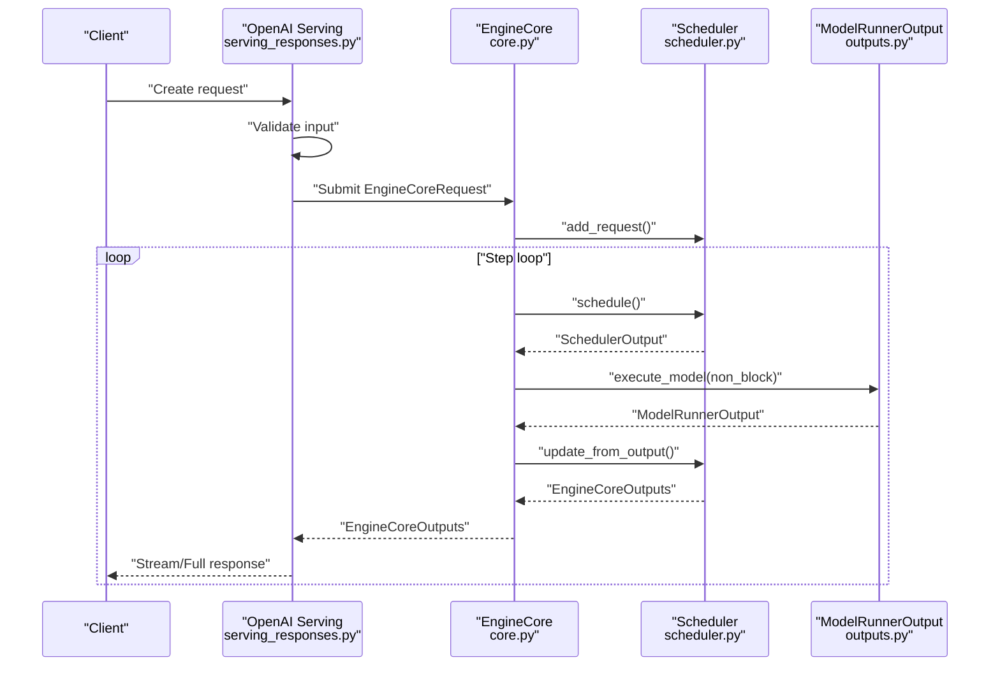
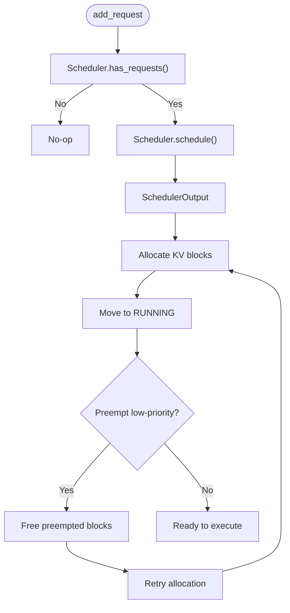
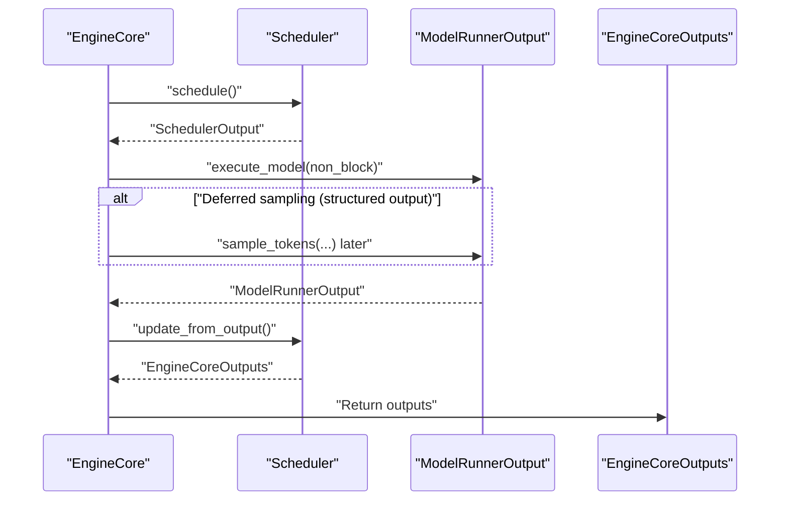
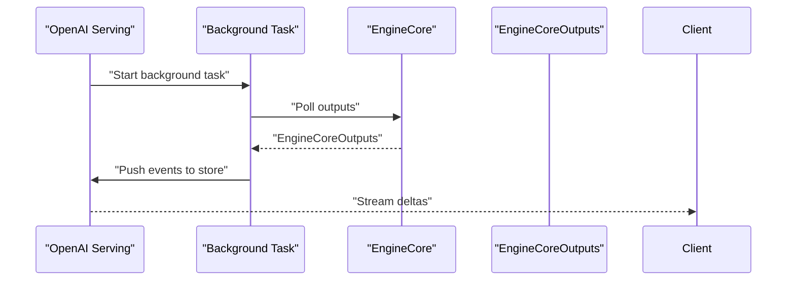
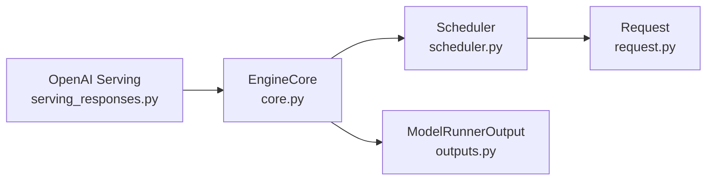

# Request Processing Pipeline

<cite>
**Referenced Files in This Document**
- [core.py](file://vllm/v1/engine/core.py)
- [scheduler.py](file://vllm/v1/core/sched/scheduler.py)
- [serving_responses.py](file://vllm/entrypoints/openai/serving_responses.py)
- [outputs.py](file://vllm/v1/outputs.py)
- [request.py](file://vllm/v1/request.py)
- [io_processor_plugins.md](file://docs/design/io_processor_plugins.md)
- [serve.py](file://vllm/benchmarks/serve.py)
- [test_engine_core.py](file://tests/v1/engine/test_engine_core.py)
- [test_abort_final_step.py](file://tests/v1/engine/test_abort_final_step.py)
</cite>

## Table of Contents
1. [Introduction](#introduction)
2. [Project Structure](#project-structure)
3. [Core Components](#core-components)
4. [Architecture Overview](#architecture-overview)
5. [Detailed Component Analysis](#detailed-component-analysis)
6. [Dependency Analysis](#dependency-analysis)
7. [Performance Considerations](#performance-considerations)
8. [Troubleshooting Guide](#troubleshooting-guide)
9. [Conclusion](#conclusion)

## Introduction
This document explains the end-to-end request processing pipeline in vLLM’s v1 engine. It covers the complete lifecycle from input reception and validation, tokenization, request queuing and scheduling, model execution, and output generation. It also documents the asynchronous processing model, concurrent request handling, backpressure mechanisms, configuration options, error handling strategies, and performance optimization techniques. Finally, it clarifies the relationships between InputProcessor, EngineCore, and OutputProcessor in the request flow, and addresses common issues such as timeouts, cancellation, and resource contention.

## Project Structure
The request processing pipeline spans several modules:
- Entrypoints: receive and validate incoming requests, tokenize prompts, and manage streaming/background tasks.
- EngineCore: orchestrates scheduling, execution, and output processing.
- Scheduler: decides which requests to run, allocates KV cache blocks, and handles preemption.
- Outputs: defines model runner output structures and sampling/logprob formats.
- Request: encapsulates per-request state and status transitions.
- Benchmarks: demonstrate concurrency control and backpressure via semaphores.

```mermaid
graph TB
subgraph "Entry Points"
EP["OpenAI Serving<br/>serving_responses.py"]
end
subgraph "Engine Core"
EC["EngineCore<br/>core.py"]
SCH["Scheduler<br/>scheduler.py"]
end
subgraph "Execution"
MR["Model Runner Output<br/>outputs.py"]
end
subgraph "Request State"
REQ["Request<br/>request.py"]
end
EP --> EC
EC --> SCH
SCH --> EC
EC --> MR
REQ <-- SCH
REQ <-- EC
```

**Diagram sources**
- [core.py](file://vllm/v1/engine/core.py#L338-L472)
- [scheduler.py](file://vllm/v1/core/sched/scheduler.py#L227-L762)
- [outputs.py](file://vllm/v1/outputs.py#L144-L246)
- [request.py](file://vllm/v1/request.py#L30-L162)
- [serving_responses.py](file://vllm/entrypoints/openai/serving_responses.py#L307-L337)

**Section sources**
- [core.py](file://vllm/v1/engine/core.py#L338-L472)
- [scheduler.py](file://vllm/v1/core/sched/scheduler.py#L227-L762)
- [outputs.py](file://vllm/v1/outputs.py#L144-L246)
- [request.py](file://vllm/v1/request.py#L30-L162)
- [serving_responses.py](file://vllm/entrypoints/openai/serving_responses.py#L307-L337)

## Core Components
- InputProcessor (plugin-based): Converts user-provided inputs into tokenized prompts and attaches sampling/params. See the plugin interface definition.
- EngineCore: Central loop that schedules, executes, and updates state. It supports synchronous and batch-queued asynchronous scheduling.
- Scheduler: Implements request scheduling, KV cache allocation, preemption, and structured output gating.
- ModelRunnerOutput: Serialized output container passed from execution to the scheduler.
- Request: Tracks per-request state, status, and token accounting.

Key responsibilities:
- Input validation and tokenization are handled by the entrypoint and InputProcessor plugin.
- EngineCore coordinates scheduling and execution, processes aborts, and updates outputs.
- Scheduler manages queues, KV blocks, and preemption.
- Outputs define the wire format for model results.

**Section sources**
- [io_processor_plugins.md](file://docs/design/io_processor_plugins.md#L1-L74)
- [core.py](file://vllm/v1/engine/core.py#L338-L472)
- [scheduler.py](file://vllm/v1/core/sched/scheduler.py#L227-L762)
- [outputs.py](file://vllm/v1/outputs.py#L144-L246)
- [request.py](file://vllm/v1/request.py#L30-L162)

## Architecture Overview
The pipeline is asynchronous and multi-threaded:
- Entry points validate and tokenize requests, then submit them to EngineCore via EngineClient.
- EngineCore’s scheduling loop selects eligible requests, allocates KV blocks, and executes the model.
- Results are processed by the scheduler to update request state and emit outputs.
- Streaming and background modes are supported with event stores and background tasks.



**Diagram sources**
- [serving_responses.py](file://vllm/entrypoints/openai/serving_responses.py#L307-L337)
- [core.py](file://vllm/v1/engine/core.py#L338-L472)
- [scheduler.py](file://vllm/v1/core/sched/scheduler.py#L227-L762)
- [outputs.py](file://vllm/v1/outputs.py#L144-L246)

## Detailed Component Analysis

### Input Validation and Tokenization
- Entry point validates model availability, request parameters, and prompt length constraints.
- Tokenization and prompt assembly are delegated to the InputProcessor plugin interface.
- Structured output constraints are validated and prepared for grammar initialization.

Concrete references:
- Input validation and request creation flow: [serving_responses.py](file://vllm/entrypoints/openai/serving_responses.py#L307-L337)
- Plugin interface for pre/post processing: [io_processor_plugins.md](file://docs/design/io_processor_plugins.md#L1-L74)

**Section sources**
- [serving_responses.py](file://vllm/entrypoints/openai/serving_responses.py#L307-L337)
- [io_processor_plugins.md](file://docs/design/io_processor_plugins.md#L1-L74)

### Request Queuing and Scheduling
- EngineCore receives requests and forwards them to the Scheduler.
- Scheduler maintains waiting and running queues, allocates KV cache blocks, and handles preemption.
- Long-prefill thresholds and speculative decoding influence scheduling decisions.



**Diagram sources**
- [core.py](file://vllm/v1/engine/core.py#L271-L303)
- [scheduler.py](file://vllm/v1/core/sched/scheduler.py#L227-L762)

**Section sources**
- [core.py](file://vllm/v1/engine/core.py#L271-L303)
- [scheduler.py](file://vllm/v1/core/sched/scheduler.py#L227-L762)

### Model Execution and Sampling
- EngineCore executes the model asynchronously and samples tokens when applicable.
- For batch-queued execution, EngineCore prioritizes filling the batch queue before retrieving results.
- Aborts are processed before updating outputs to ensure correctness.



**Diagram sources**
- [core.py](file://vllm/v1/engine/core.py#L338-L472)
- [outputs.py](file://vllm/v1/outputs.py#L144-L246)

**Section sources**
- [core.py](file://vllm/v1/engine/core.py#L338-L472)
- [outputs.py](file://vllm/v1/outputs.py#L144-L246)

### Output Generation and Streaming
- Entry points assemble responses, manage background tasks, and stream deltas.
- For structured outputs, grammar compilation is awaited before scheduling.
- Background requests are tracked with event stores and completion signals.



**Diagram sources**
- [serving_responses.py](file://vllm/entrypoints/openai/serving_responses.py#L1058-L1088)
- [core.py](file://vllm/v1/engine/core.py#L918-L926)

**Section sources**
- [serving_responses.py](file://vllm/entrypoints/openai/serving_responses.py#L1058-L1088)
- [core.py](file://vllm/v1/engine/core.py#L918-L926)

### Relationship Between InputProcessor, EngineCore, and OutputProcessor
- InputProcessor (plugin interface) converts user input into tokenized prompts and attaches sampling parameters.
- EngineCore receives EngineCoreRequest, preprocesses it (including structured output grammar initialization), and schedules execution.
- OutputProcessor (when used) transforms EngineCoreOutputs into response formats; however, in OpenAI serving, responses are built directly in the entrypoint.

References:
- Plugin interface: [io_processor_plugins.md](file://docs/design/io_processor_plugins.md#L1-L74)
- Preprocessing and grammar init: [core.py](file://vllm/v1/engine/core.py#L561-L583)
- Output construction in serving: [serving_responses.py](file://vllm/entrypoints/openai/serving_responses.py#L611-L738)

**Section sources**
- [io_processor_plugins.md](file://docs/design/io_processor_plugins.md#L1-L74)
- [core.py](file://vllm/v1/engine/core.py#L561-L583)
- [serving_responses.py](file://vllm/entrypoints/openai/serving_responses.py#L611-L738)

## Dependency Analysis
- EngineCore depends on Scheduler for queue management and KV allocation.
- Scheduler depends on KV cache managers and connectors for block allocation and remote KV transfers.
- ModelRunnerOutput is the contract between execution and scheduling.
- Request encapsulates state transitions and token accounting.



**Diagram sources**
- [core.py](file://vllm/v1/engine/core.py#L338-L472)
- [scheduler.py](file://vllm/v1/core/sched/scheduler.py#L227-L762)
- [outputs.py](file://vllm/v1/outputs.py#L144-L246)
- [request.py](file://vllm/v1/request.py#L30-L162)
- [serving_responses.py](file://vllm/entrypoints/openai/serving_responses.py#L307-L337)

**Section sources**
- [core.py](file://vllm/v1/engine/core.py#L338-L472)
- [scheduler.py](file://vllm/v1/core/sched/scheduler.py#L227-L762)
- [outputs.py](file://vllm/v1/outputs.py#L144-L246)
- [request.py](file://vllm/v1/request.py#L30-L162)
- [serving_responses.py](file://vllm/entrypoints/openai/serving_responses.py#L307-L337)

## Performance Considerations
- Asynchronous scheduling and batch queue:
  - EngineCore can fill a batch queue before retrieving results, reducing pipeline bubbles under pipeline parallelism.
  - Deferred sampling is used when structured output requires grammar bitmasks computed from prior steps.
- Concurrency and backpressure:
  - Benchmarks demonstrate concurrency control via semaphores to limit concurrent requests.
- Structured outputs:
  - Grammar compilation is performed asynchronously; requests wait for FSM readiness before scheduling.

References:
- Batch queue and deferred sampling: [core.py](file://vllm/v1/engine/core.py#L376-L472)
- Concurrency control: [serve.py](file://vllm/benchmarks/serve.py#L679-L708)
- Structured output gating: [scheduler.py](file://vllm/v1/core/sched/scheduler.py#L458-L467)

**Section sources**
- [core.py](file://vllm/v1/engine/core.py#L376-L472)
- [serve.py](file://vllm/benchmarks/serve.py#L679-L708)
- [scheduler.py](file://vllm/v1/core/sched/scheduler.py#L458-L467)

## Troubleshooting Guide
Common issues and mitigations:
- Request timeouts and cancellations:
  - Streaming handlers detect client disconnects and surface appropriate errors.
  - Background tasks are tracked and cleaned up; failures update response status to “failed”.
- Cancellation handling:
  - Abort requests are batched and applied before processing model outputs to avoid inconsistent state.
  - Tests demonstrate aborts interrupting long-running model execution.
- Resource contention:
  - Preemption frees blocks and moves requests back to waiting; long-prefill thresholds cap per-step scheduling.
  - KV connectors coordinate remote loads and retries on failures.

Concrete references:
- Background request failure handling: [serving_responses.py](file://vllm/entrypoints/openai/serving_responses.py#L1058-L1088)
- Abort batching and ordering: [core.py](file://vllm/v1/engine/core.py#L474-L485)
- Preemption and KV allocation: [scheduler.py](file://vllm/v1/core/sched/scheduler.py#L764-L800)
- Abort interruption test: [test_abort_final_step.py](file://tests/v1/engine/test_abort_final_step.py#L238-L266)

**Section sources**
- [serving_responses.py](file://vllm/entrypoints/openai/serving_responses.py#L1058-L1088)
- [core.py](file://vllm/v1/engine/core.py#L474-L485)
- [scheduler.py](file://vllm/v1/core/sched/scheduler.py#L764-L800)
- [test_abort_final_step.py](file://tests/v1/engine/test_abort_final_step.py#L238-L266)

## Conclusion
The vLLM v1 request processing pipeline integrates robust asynchronous scheduling, batch-queued execution, and structured output support. EngineCore coordinates scheduling and execution, while the Scheduler manages queues, KV allocation, and preemption. Entry points validate inputs, tokenize prompts, and deliver responses with streaming and background modes. Backpressure and concurrency are controlled via semaphores and abort batching. The design emphasizes correctness under cancellation and resource contention, with clear separation between input processing, scheduling, execution, and output generation.