# Container Deployment

<cite>
**Referenced Files in This Document**
- [docker/Dockerfile](file://docker/Dockerfile)
- [docker/Dockerfile.cpu](file://docker/Dockerfile.cpu)
- [docker/Dockerfile.rocm](file://docker/Dockerfile.rocm)
- [docker/Dockerfile.rocm_base](file://docker/Dockerfile.rocm_base)
- [docker/Dockerfile.ppc64le](file://docker/Dockerfile.ppc64le)
- [docker/Dockerfile.s390x](file://docker/Dockerfile.s390x)
- [docker/Dockerfile.tpu](file://docker/Dockerfile.tpu)
- [docker/Dockerfile.xpu](file://docker/Dockerfile.xpu)
- [docs/deployment/docker.md](file://docs/deployment/docker.md)
- [docs/configuration/env_vars.md](file://docs/configuration/env_vars.md)
- [vllm/envs.py](file://vllm/envs.py)
- [vllm/env_override.py](file://vllm/env_override.py)
- [requirements/cuda.txt](file://requirements/cuda.txt)
- [requirements/cpu.txt](file://requirements/cpu.txt)
- [requirements/rocm.txt](file://requirements/rocm.txt)
- [requirements/tpu.txt](file://requirements/tpu.txt)
- [requirements/xpu.txt](file://requirements/xpu.txt)
</cite>

## Table of Contents
1. [Introduction](#introduction)
2. [Project Structure](#project-structure)
3. [Core Components](#core-components)
4. [Architecture Overview](#architecture-overview)
5. [Detailed Component Analysis](#detailed-component-analysis)
6. [Dependency Analysis](#dependency-analysis)
7. [Performance Considerations](#performance-considerations)
8. [Troubleshooting Guide](#troubleshooting-guide)
9. [Conclusion](#conclusion)
10. [Appendices](#appendices)

## Introduction
This document provides a comprehensive guide to deploying vLLM using Docker-based strategies. It covers official vLLM Docker images available on Docker Hub, including the vllm/vllm-openai variants for different hardware backends (NVIDIA CUDA, AMD ROCm, Intel XPU, Google TPU, and CPU). It also documents container runtime requirements, GPU access configuration, shared memory settings, and both official image usage and custom Docker image building from source. Practical examples of Docker run commands are provided for NVIDIA GPUs, AMD ROCm, Intel XPU, Google TPU, and CPU-only deployments. Environment variable configuration, volume mounting for model caches, networking setup, orchestration considerations, resource limits, and security configurations are addressed. Platform-specific deployment for Arm64/aarch64 and cross-compilation setup are included.

## Project Structure
The repository organizes container deployment assets primarily under the docker/ directory and complementary deployment and configuration documentation under docs/. The Dockerfiles target different hardware backends and platforms, while requirements/ files define runtime dependencies per target. The vLLM environment variable definitions and overrides live under vllm/.

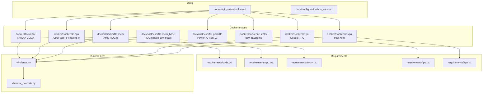

**Diagram sources**
- [docker/Dockerfile](file://docker/Dockerfile#L1-L640)
- [docker/Dockerfile.cpu](file://docker/Dockerfile.cpu#L1-L204)
- [docker/Dockerfile.rocm](file://docker/Dockerfile.rocm#L1-L148)
- [docker/Dockerfile.rocm_base](file://docker/Dockerfile.rocm_base#L1-L165)
- [docker/Dockerfile.ppc64le](file://docker/Dockerfile.ppc64le#L1-L349)
- [docker/Dockerfile.s390x](file://docker/Dockerfile.s390x#L1-L267)
- [docker/Dockerfile.tpu](file://docker/Dockerfile.tpu#L1-L37)
- [docker/Dockerfile.xpu](file://docker/Dockerfile.xpu#L1-L87)
- [docs/deployment/docker.md](file://docs/deployment/docker.md#L1-L153)
- [docs/configuration/env_vars.md](file://docs/configuration/env_vars.md#L1-L13)
- [vllm/envs.py](file://vllm/envs.py#L448-L800)
- [vllm/env_override.py](file://vllm/env_override.py#L1-L379)

**Section sources**
- [docker/Dockerfile](file://docker/Dockerfile#L1-L640)
- [docker/Dockerfile.cpu](file://docker/Dockerfile.cpu#L1-L204)
- [docker/Dockerfile.rocm](file://docker/Dockerfile.rocm#L1-L148)
- [docker/Dockerfile.rocm_base](file://docker/Dockerfile.rocm_base#L1-L165)
- [docker/Dockerfile.ppc64le](file://docker/Dockerfile.ppc64le#L1-L349)
- [docker/Dockerfile.s390x](file://docker/Dockerfile.s390x#L1-L267)
- [docker/Dockerfile.tpu](file://docker/Dockerfile.tpu#L1-L37)
- [docker/Dockerfile.xpu](file://docker/Dockerfile.xpu#L1-L87)
- [docs/deployment/docker.md](file://docs/deployment/docker.md#L1-L153)
- [docs/configuration/env_vars.md](file://docs/configuration/env_vars.md#L1-L13)
- [vllm/envs.py](file://vllm/envs.py#L448-L800)
- [vllm/env_override.py](file://vllm/env_override.py#L1-L379)

## Core Components
- Official vLLM Docker image on Docker Hub: vllm/vllm-openai, used to run the OpenAI-compatible server. See usage examples and notes in the deployment guide.
- Hardware-targeted Dockerfiles:
  - NVIDIA CUDA: docker/Dockerfile produces vllm/vllm-openai for CUDA GPUs.
  - CPU (x86_64/aarch64): docker/Dockerfile.cpu builds CPU images for both architectures.
  - AMD ROCm: docker/Dockerfile.rocm builds ROCm images; docker/Dockerfile.rocm_base provides a ROCm dev base image.
  - Intel XPU: docker/Dockerfile.xpu builds XPU images.
  - Google TPU: docker/Dockerfile.tpu builds TPU images.
  - IBM Power (ppc64le) and IBM zSystems (s390x): specialized Dockerfiles for those platforms.
- Environment variables: vLLM exposes a comprehensive set of environment variables for configuration, including device selection, cache roots, logging, attention backends, and platform-specific toggles. See environment variable documentation and the environment definitions.

Key runtime and build-time environment variables include:
- Device selection and precision: VLLM_TARGET_DEVICE, VLLM_MAIN_CUDA_VERSION, VLLM_FLOAT32_MATMUL_PRECISION
- Build controls: MAX_JOBS, NVCC_THREADS, VLLM_USE_PRECOMPILED, VLLM_SKIP_PRECOMPILED_VERSION_SUFFIX, VLLM_DOCKER_BUILD_CONTEXT
- Paths and caches: VLLM_CACHE_ROOT, VLLM_CONFIG_ROOT, VLLM_XLA_CACHE_PATH
- Networking and IPC: VLLM_HOST_IP, VLLM_PORT, VLLM_RPC_BASE_PATH, IPC/host/shared memory usage
- Attention and kernels: VLLM_ATTENTION_BACKEND, VLLM_USE_FLASHINFER_SAMPLER, VLLM_FLASH_ATTN_VERSION
- Logging and telemetry: VLLM_LOGGING_LEVEL, VLLM_USAGE_SOURCE, VLLM_NO_USAGE_STATS, VLLM_DO_NOT_TRACK
- Distributed and multi-GPU: CUDA_VISIBLE_DEVICES, LOCAL_RANK, VLLM_ENGINE_ITERATION_TIMEOUT_S

**Section sources**
- [docs/deployment/docker.md](file://docs/deployment/docker.md#L1-L153)
- [vllm/envs.py](file://vllm/envs.py#L448-L800)
- [docs/configuration/env_vars.md](file://docs/configuration/env_vars.md#L1-L13)

## Architecture Overview
The container deployment architecture centers on official images and custom-built images tailored to specific hardware backends. The official vllm/vllm-openai image runs the OpenAI-compatible server entrypoint. Custom images are built from Dockerfiles that install platform-specific dependencies and runtime wheels. Environment variables control device selection, performance tuning, and operational behavior.

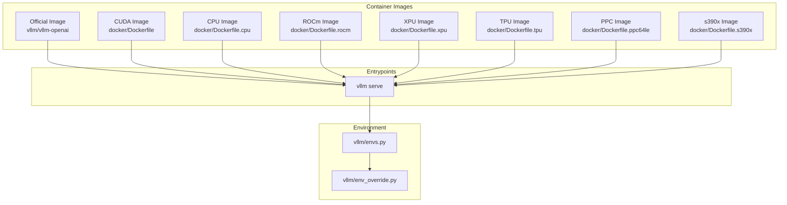

**Diagram sources**
- [docker/Dockerfile](file://docker/Dockerfile#L608-L640)
- [docker/Dockerfile.cpu](file://docker/Dockerfile.cpu#L194-L204)
- [docker/Dockerfile.rocm](file://docker/Dockerfile.rocm#L1-L148)
- [docker/Dockerfile.xpu](file://docker/Dockerfile.xpu#L66-L87)
- [docker/Dockerfile.tpu](file://docker/Dockerfile.tpu#L1-L37)
- [docker/Dockerfile.ppc64le](file://docker/Dockerfile.ppc64le#L335-L349)
- [docker/Dockerfile.s390x](file://docker/Dockerfile.s390x#L253-L267)
- [vllm/envs.py](file://vllm/envs.py#L448-L800)
- [vllm/env_override.py](file://vllm/env_override.py#L1-L379)

## Detailed Component Analysis

### Official vLLM Docker Image (vllm/vllm-openai)
- Purpose: Run the OpenAI-compatible server directly from Docker Hub.
- Usage: The deployment guide provides docker and podman examples, including GPU access, shared memory via IPC, and model cache mounting.
- Optional dependencies: Not included by default due to licensing; users can extend the base image to add optional dependencies if acceptable.

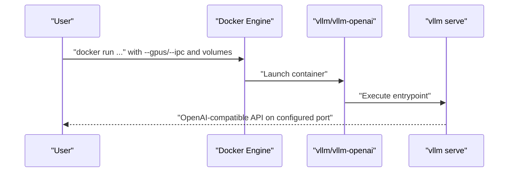

**Diagram sources**
- [docs/deployment/docker.md](file://docs/deployment/docker.md#L1-L153)
- [docker/Dockerfile](file://docker/Dockerfile#L608-L640)

**Section sources**
- [docs/deployment/docker.md](file://docs/deployment/docker.md#L1-L153)
- [docker/Dockerfile](file://docker/Dockerfile#L608-L640)

### NVIDIA CUDA Image (docker/Dockerfile)
- Targets: NVIDIA CUDA GPUs.
- Build-time controls: CUDA version, Python version, Torch CUDA arch list, parallel build jobs, NVCC threads, precompiled wheels, and wheel size checks.
- Runtime dependencies: PyTorch CUDA, FlashInfer, optional connectors, and development tools for JIT compilation.
- Entrypoint: vllm serve.

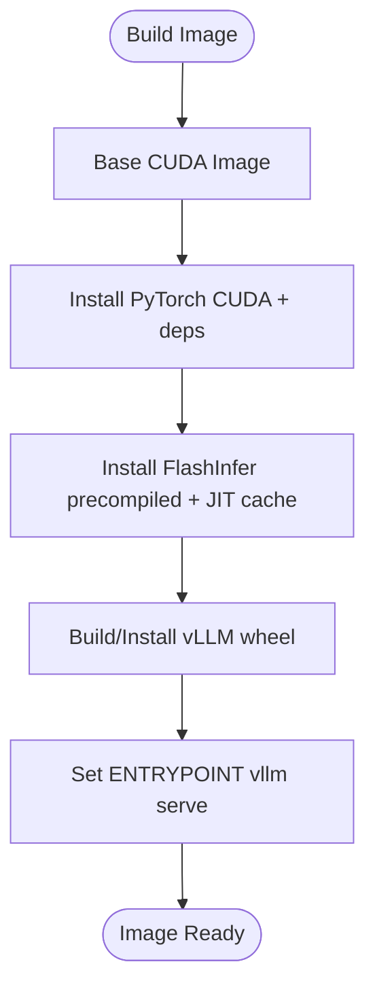

**Diagram sources**
- [docker/Dockerfile](file://docker/Dockerfile#L120-L550)
- [requirements/cuda.txt](file://requirements/cuda.txt#L1-L14)

**Section sources**
- [docker/Dockerfile](file://docker/Dockerfile#L1-L640)
- [requirements/cuda.txt](file://requirements/cuda.txt#L1-L14)

### CPU Image (docker/Dockerfile.cpu)
- Targets: x86_64 and aarch64 CPUs.
- Build-time controls: Python version, CPU ISA flags (AVX512, BF16, VNNI, AMX), parallel jobs, and platform-specific runtime libraries.
- Entrypoint: vllm serve.

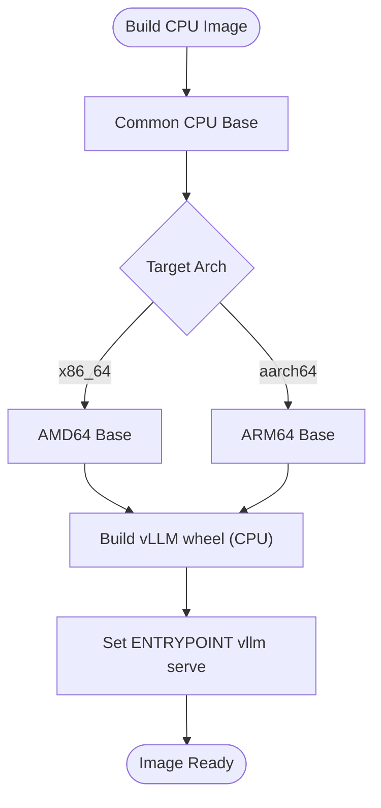

**Diagram sources**
- [docker/Dockerfile.cpu](file://docker/Dockerfile.cpu#L1-L204)

**Section sources**
- [docker/Dockerfile.cpu](file://docker/Dockerfile.cpu#L1-L204)

### AMD ROCm Image (docker/Dockerfile.rocm)
- Targets: AMD GPUs via ROCm.
- Base: Uses a ROCm base image and installs ROCm-specific PyTorch and kernels.
- Environment: ROCm-specific environment variables and performance toggles.

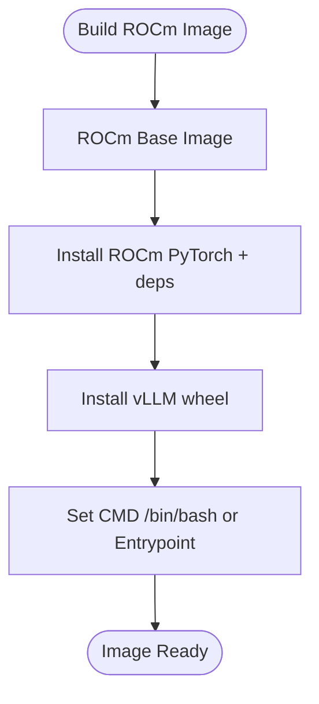

**Diagram sources**
- [docker/Dockerfile.rocm](file://docker/Dockerfile.rocm#L1-L148)
- [docker/Dockerfile.rocm_base](file://docker/Dockerfile.rocm_base#L1-L165)
- [requirements/rocm.txt](file://requirements/rocm.txt#L1-L19)

**Section sources**
- [docker/Dockerfile.rocm](file://docker/Dockerfile.rocm#L1-L148)
- [docker/Dockerfile.rocm_base](file://docker/Dockerfile.rocm_base#L1-L165)
- [requirements/rocm.txt](file://requirements/rocm.txt#L1-L19)

### Intel XPU Image (docker/Dockerfile.xpu)
- Targets: Intel XPU devices.
- Base: Intel Deep Learning Essentials base image.
- Dependencies: Torch XPU, Intel extensions, oneCCL, and related libraries.

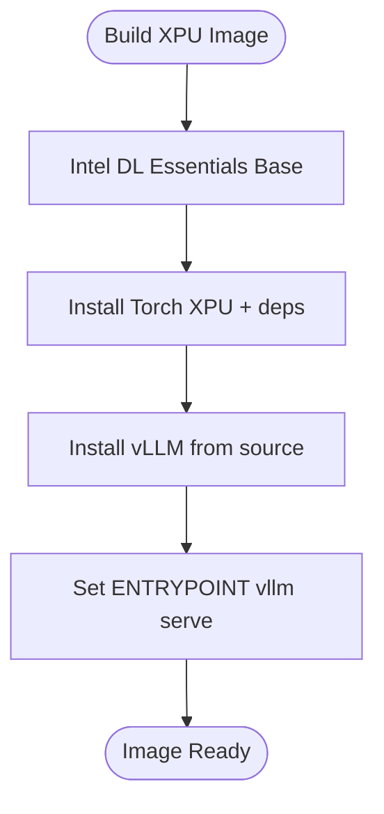

**Diagram sources**
- [docker/Dockerfile.xpu](file://docker/Dockerfile.xpu#L1-L87)
- [requirements/xpu.txt](file://requirements/xpu.txt#L1-L19)

**Section sources**
- [docker/Dockerfile.xpu](file://docker/Dockerfile.xpu#L1-L87)
- [requirements/xpu.txt](file://requirements/xpu.txt#L1-L19)

### Google TPU Image (docker/Dockerfile.tpu)
- Targets: Google TPU devices.
- Base: Nightly TPU XLA base image.
- Dependencies: TPU-specific inference libraries and build from source.

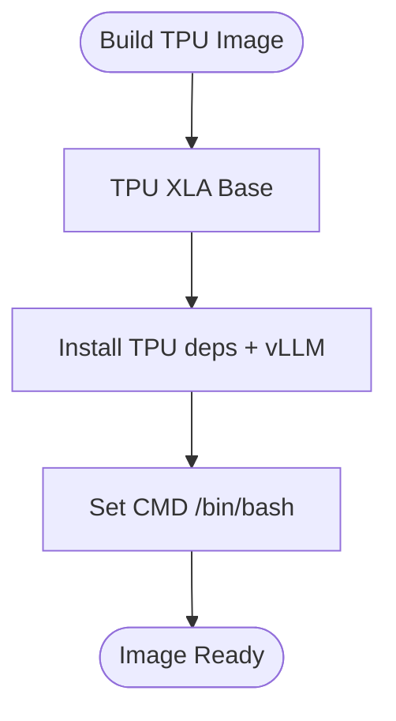

**Diagram sources**
- [docker/Dockerfile.tpu](file://docker/Dockerfile.tpu#L1-L37)
- [requirements/tpu.txt](file://requirements/tpu.txt#L1-L15)

**Section sources**
- [docker/Dockerfile.tpu](file://docker/Dockerfile.tpu#L1-L37)
- [requirements/tpu.txt](file://requirements/tpu.txt#L1-L15)

### IBM Power and IBM z Systems Images
- PowerPC (ppc64le): Multi-stage build with custom Torch family wheels, OpenBLAS, NumPy, and other dependencies.
- IBM zSystems (s390x): Multi-stage build with Rust, LLVM, PyArrow, NumPy, and platform-specific libraries.

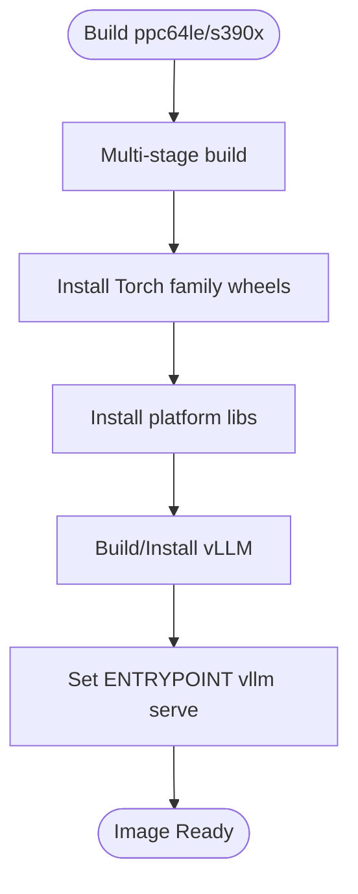

**Diagram sources**
- [docker/Dockerfile.ppc64le](file://docker/Dockerfile.ppc64le#L1-L349)
- [docker/Dockerfile.s390x](file://docker/Dockerfile.s390x#L1-L267)

**Section sources**
- [docker/Dockerfile.ppc64le](file://docker/Dockerfile.ppc64le#L1-L349)
- [docker/Dockerfile.s390x](file://docker/Dockerfile.s390x#L1-L267)

### Environment Variable Configuration
- Device and performance:
  - VLLM_TARGET_DEVICE: cuda, rocm, cpu, tpu, xpu
  - VLLM_MAIN_CUDA_VERSION: main CUDA version for wheels
  - VLLM_FLOAT32_MATMUL_PRECISION: ieee or tf32
  - MAX_JOBS, NVCC_THREADS: build-time parallelism
  - VLLM_USE_PRECOMPILED, VLLM_SKIP_PRECOMPILED_VERSION_SUFFIX, VLLM_DOCKER_BUILD_CONTEXT: build/install behavior
- Paths and caches:
  - VLLM_CACHE_ROOT, VLLM_CONFIG_ROOT, VLLM_XLA_CACHE_PATH
- Networking and IPC:
  - VLLM_HOST_IP, VLLM_PORT, VLLM_RPC_BASE_PATH
  - Shared memory: use --ipc=host or --shm-size as documented
- Attention and kernels:
  - VLLM_ATTENTION_BACKEND, VLLM_USE_FLASHINFER_SAMPLER, VLLM_FLASH_ATTN_VERSION
- Logging and telemetry:
  - VLLM_LOGGING_LEVEL, VLLM_USAGE_SOURCE, VLLM_NO_USAGE_STATS, VLLM_DO_NOT_TRACK
- Distributed and multi-GPU:
  - CUDA_VISIBLE_DEVICES, LOCAL_RANK, VLLM_ENGINE_ITERATION_TIMEOUT_S

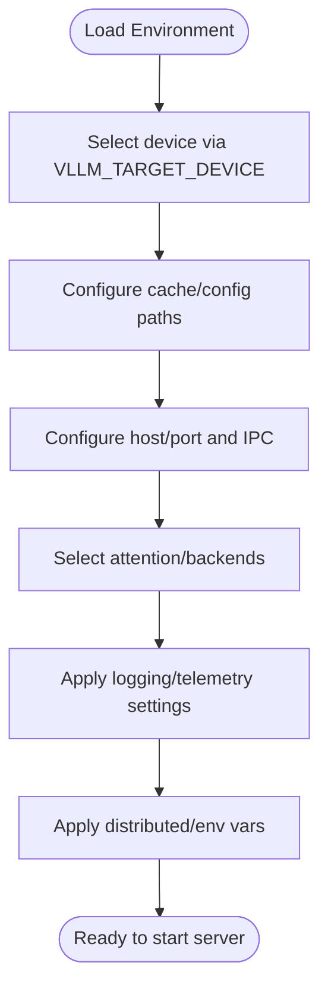

**Diagram sources**
- [vllm/envs.py](file://vllm/envs.py#L448-L800)
- [docs/configuration/env_vars.md](file://docs/configuration/env_vars.md#L1-L13)

**Section sources**
- [vllm/envs.py](file://vllm/envs.py#L448-L800)
- [docs/configuration/env_vars.md](file://docs/configuration/env_vars.md#L1-L13)

## Dependency Analysis
- CUDA image depends on:
  - PyTorch CUDA, torchaudio, torchvision, FlashInfer, Ray Compiled Graph
  - Build-time variables controlling CUDA arch list and parallelism
- CPU image depends on:
  - Torch CPU, platform-specific packages, OpenMP, CPU info gathering
- ROCm image depends on:
  - ROCm Torch, Triton kernels, fastsafetensors, runai-model-streamer
- XPU image depends on:
  - Torch XPU, Intel extensions, oneCCL
- TPU image depends on:
  - TPU inference libraries and Ray data/graph
- Platform-specific images (ppc64le, s390x) depend on:
  - Custom-built Torch wheels, OpenBLAS, NumPy, PyArrow, and platform toolchains

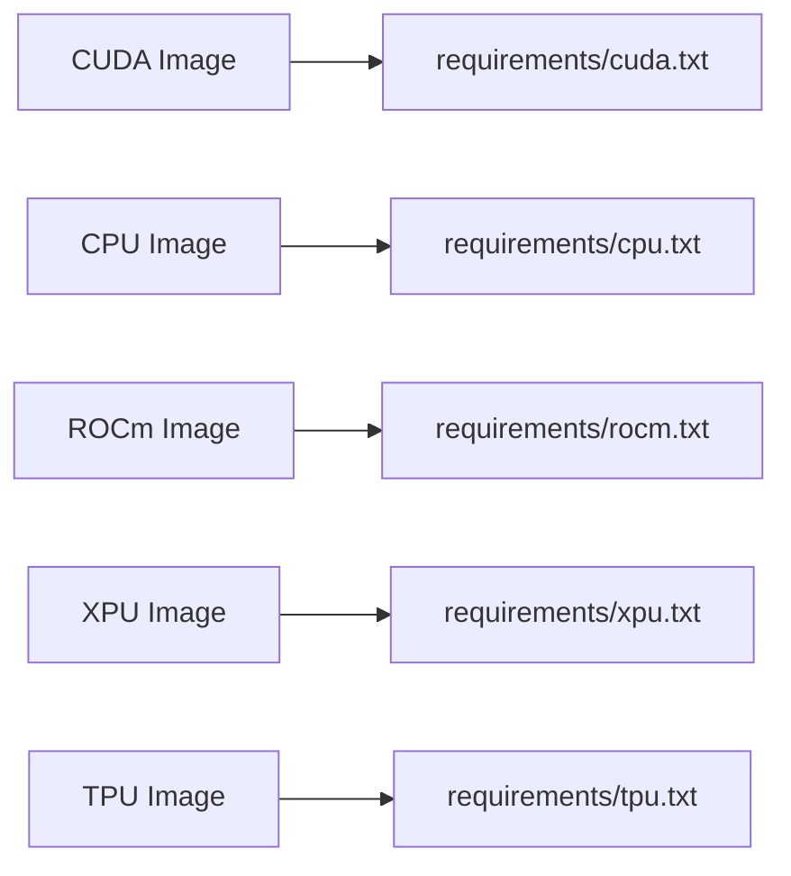

**Diagram sources**
- [requirements/cuda.txt](file://requirements/cuda.txt#L1-L14)
- [requirements/cpu.txt](file://requirements/cpu.txt#L1-L23)
- [requirements/rocm.txt](file://requirements/rocm.txt#L1-L19)
- [requirements/xpu.txt](file://requirements/xpu.txt#L1-L19)
- [requirements/tpu.txt](file://requirements/tpu.txt#L1-L15)

**Section sources**
- [requirements/cuda.txt](file://requirements/cuda.txt#L1-L14)
- [requirements/cpu.txt](file://requirements/cpu.txt#L1-L23)
- [requirements/rocm.txt](file://requirements/rocm.txt#L1-L19)
- [requirements/xpu.txt](file://requirements/xpu.txt#L1-L19)
- [requirements/tpu.txt](file://requirements/tpu.txt#L1-L15)

## Performance Considerations
- Build parallelism: Tune MAX_JOBS and NVCC_THREADS for optimal build throughput; ensure MAX_JOBS >> NVCC_THREADS to avoid CPU oversubscription.
- CUDA arch targeting: Limit TORCH_CUDA_ARCH_LIST to reduce wheel size and improve compatibility when building for a specific GPU family.
- Precompiled wheels: Enable VLLM_USE_PRECOMPILED to skip native compilation and speed up builds/launches.
- Attention backends: Choose VLLM_ATTENTION_BACKEND and related toggles to match workload characteristics.
- Logging and telemetry: Adjust VLLM_LOGGING_LEVEL and telemetry flags to balance observability and overhead.
- IPC/shm: Use --ipc=host or --shm-size to prevent shared memory contention in multi-GPU or tensor-parallel setups.

[No sources needed since this section provides general guidance]

## Troubleshooting Guide
- Shared memory issues: Ensure --ipc=host or --shm-size is set; vLLM relies on shared memory for inter-process data sharing.
- GPU visibility: For multi-GPU containers, set CUDA_VISIBLE_DEVICES and verify LOCAL_RANK alignment with container GPU mapping.
- NCCL library path: On older versions, VLLM_NCCL_SO_PATH may need to be set if the NCCL library is not found in LD_LIBRARY_PATH.
- Kubernetes environment variables: Avoid naming services “vllm” to prevent collisions with injected environment variables from the platform.
- Optional dependencies: If optional dependencies are required, extend the base image and install them explicitly.

**Section sources**
- [docs/deployment/docker.md](file://docs/deployment/docker.md#L30-L62)
- [vllm/envs.py](file://vllm/envs.py#L512-L560)
- [docs/configuration/env_vars.md](file://docs/configuration/env_vars.md#L1-L13)

## Conclusion
vLLM’s container deployment strategy leverages official images for quick start and custom Dockerfiles for specialized hardware backends. The official vllm/vllm-openai image simplifies running the OpenAI-compatible server with GPU access and shared memory configuration. Custom images target NVIDIA CUDA, AMD ROCm, Intel XPU, Google TPU, and IBM Power/s390x platforms. Environment variables provide fine-grained control over device selection, performance, and operational behavior. Following the guidelines in this document ensures reliable, secure, and performant deployments across diverse environments.

[No sources needed since this section summarizes without analyzing specific files]

## Appendices

### Appendix A: Example Docker Run Commands
- NVIDIA GPUs (Docker):
  - docker run --runtime nvidia --gpus all -v ~/.cache/huggingface:/root/.cache/huggingface --env "HF_TOKEN=$HF_TOKEN" -p 8000:8000 --ipc=host vllm/vllm-openai:latest --model <model>
- NVIDIA GPUs (Podman):
  - podman run --device nvidia.com/gpu=all -v ~/.cache/huggingface:/root/.cache/huggingface --env "HF_TOKEN=$HF_TOKEN" -p 8000:8000 --ipc=host docker.io/vllm/vllm-openai:latest --model <model>
- CPU-only:
  - docker run -v ~/.cache/huggingface:/root/.cache/huggingface -p 8000:8000 vllm/vllm-openai:latest --host 0.0.0.0 --port 8000 --model <model>
- AMD ROCm:
  - docker run --device /dev/kfd --device /dev/dri --group-add video -v ~/.cache/huggingface:/root/.cache/huggingface -p 8000:8000 --ipc=host vllm/vllm-openai:latest --model <model>
- Intel XPU:
  - docker run --device /dev/dri renderD128 -v ~/.cache/huggingface:/root/.cache/huggingface -p 8000:8000 --ipc=host vllm/vllm-openai:latest --model <model>
- Google TPU:
  - docker run -v ~/.cache/huggingface:/root/.cache/huggingface -p 8000:8000 --ipc=host vllm/vllm-openai:latest --model <model>

Notes:
- Replace <model> with the desired model identifier.
- Add any engine arguments after the image tag as needed.
- Use --shm-size if --ipc=host is unavailable.

**Section sources**
- [docs/deployment/docker.md](file://docs/deployment/docker.md#L1-L153)

### Appendix B: Environment Variables Reference
- Device and build:
  - VLLM_TARGET_DEVICE, VLLM_MAIN_CUDA_VERSION, VLLM_FLOAT32_MATMUL_PRECISION, MAX_JOBS, NVCC_THREADS, VLLM_USE_PRECOMPILED, VLLM_SKIP_PRECOMPILED_VERSION_SUFFIX, VLLM_DOCKER_BUILD_CONTEXT
- Paths and caches:
  - VLLM_CACHE_ROOT, VLLM_CONFIG_ROOT, VLLM_XLA_CACHE_PATH
- Networking and IPC:
  - VLLM_HOST_IP, VLLM_PORT, VLLM_RPC_BASE_PATH, --ipc=host or --shm-size
- Attention and kernels:
  - VLLM_ATTENTION_BACKEND, VLLM_USE_FLASHINFER_SAMPLER, VLLM_FLASH_ATTN_VERSION
- Logging and telemetry:
  - VLLM_LOGGING_LEVEL, VLLM_USAGE_SOURCE, VLLM_NO_USAGE_STATS, VLLM_DO_NOT_TRACK
- Distributed and multi-GPU:
  - CUDA_VISIBLE_DEVICES, LOCAL_RANK, VLLM_ENGINE_ITERATION_TIMEOUT_S

**Section sources**
- [vllm/envs.py](file://vllm/envs.py#L448-L800)
- [docs/configuration/env_vars.md](file://docs/configuration/env_vars.md#L1-L13)

### Appendix C: Custom Image Building from Source
- Build the official CUDA image from source:
  - docker build . --target vllm-openai --tag vllm/vllm-openai --file docker/Dockerfile
- Build CPU image for aarch64:
  - docker buildx build --platform linux/arm64 --target vllm-openai -t vllm/vllm-openai -f docker/Dockerfile.cpu .
- Cross-compilation for aarch64:
  - Register QEMU user static handlers and use --platform linux/arm64 with buildx.

**Section sources**
- [docs/deployment/docker.md](file://docs/deployment/docker.md#L63-L153)
- [docker/Dockerfile.cpu](file://docker/Dockerfile.cpu#L1-L204)