# Custom Image Building

<cite>
**Referenced Files in This Document**
- [docker/Dockerfile](file://docker/Dockerfile)
- [docker/Dockerfile.cpu](file://docker/Dockerfile.cpu)
- [docker/Dockerfile.rocm](file://docker/Dockerfile.rocm)
- [docker/Dockerfile.ppc64le](file://docker/Dockerfile.ppc64le)
- [docker/Dockerfile.s390x](file://docker/Dockerfile.s390x)
- [docker/Dockerfile.tpu](file://docker/Dockerfile.tpu)
- [docker/Dockerfile.xpu](file://docker/Dockerfile.xpu)
- [docker/Dockerfile.nightly_torch](file://docker/Dockerfile.nightly_torch)
- [docker/Dockerfile.rocm_base](file://docker/Dockerfile.rocm_base)
- [requirements/cuda.txt](file://requirements/cuda.txt)
- [requirements/common.txt](file://requirements/common.txt)
- [requirements/build.txt](file://requirements/build.txt)
- [requirements/cpu.txt](file://requirements/cpu.txt)
- [setup.py](file://setup.py)
- [vllm/envs.py](file://vllm/envs.py)
- [tools/install_deepgemm.sh](file://tools/install_deepgemm.sh)
- [tools/ep_kernels/install_python_libraries.sh](file://tools/ep_kernels/install_python_libraries.sh)
</cite>

## Table of Contents
1. [Introduction](#introduction)
2. [Project Structure](#project-structure)
3. [Core Components](#core-components)
4. [Architecture Overview](#architecture-overview)
5. [Detailed Component Analysis](#detailed-component-analysis)
6. [Dependency Analysis](#dependency-analysis)
7. [Performance Considerations](#performance-considerations)
8. [Troubleshooting Guide](#troubleshooting-guide)
9. [Conclusion](#conclusion)
10. [Appendices](#appendices)

## Introduction
This document explains how to build custom Docker images for vLLM from source, focusing on the multi-stage build process, build arguments, optional components, cross-platform support, and operational best practices. It covers:
- How the CUDA-based, CPU-only, ROCm, POWER/PPC64LE, IBM s390x, TPU, and XPU Dockerfiles are structured and how to customize them.
- How to tune build arguments for CUDA versions, Python versions, optional components, and private registries.
- How to optimize caching, parallelism, and dependency injection for hermetic and secure builds.
- How to troubleshoot common compilation and dependency issues.
- How to manage build artifacts and image sizes, and apply security hardening.

## Project Structure
The repository provides multiple Dockerfiles tailored to different platforms and hardware backends. The primary CUDA-based multi-stage build is defined in the main Dockerfile, while specialized Dockerfiles target CPU-only, ROCm, POWER, IBM s390x, TPU, and XPU environments. Supporting scripts handle optional kernel extensions and nightly Torch builds.

```mermaid
graph TB
A["docker/Dockerfile<br/>CUDA multi-stage build"] --> B["base<br/>Build base image"]
A --> C["csrc-build<br/>Prebuild native extensions"]
A --> D["extensions-build<br/>DeepGEMM/pplx-kernels/DeepEP"]
A --> E["build<br/>Wheel build with precompiled csrc"]
A --> F["vllm-base<br/>Final runtime image"]
A --> G["test<br/>Unit test image"]
A --> H["vllm-openai<br/>Server entrypoint"]
A --> I["vllm-sagemaker<br/>SageMaker entrypoint"]
J["docker/Dockerfile.cpu<br/>CPU-only multi-stage"] --> K["vllm-openai (CPU)"]
L["docker/Dockerfile.rocm<br/>ROCm build"] --> M["ROCm final image"]
N["docker/Dockerfile.ppc64le<br/>PowerPC build"] --> O["vllm-openai (PPC64LE)"]
P["docker/Dockerfile.s390x<br/>IBM s390x build"] --> Q["vllm (s390x)"]
R["docker/Dockerfile.tpu<br/>TPU build"] --> S["TPU image"]
T["docker/Dockerfile.xpu<br/>Intel XPU build"] --> U["vllm-openai (XPU)"]
V["docker/Dockerfile.nightly_torch<br/>Nightly Torch"] --> W["Nightly build image"]
X["docker/Dockerfile.rocm_base<br/>ROCm base"] --> Y["ROCm base image"]
```

**Diagram sources**
- [docker/Dockerfile](file://docker/Dockerfile#L1-L640)
- [docker/Dockerfile.cpu](file://docker/Dockerfile.cpu#L1-L204)
- [docker/Dockerfile.rocm](file://docker/Dockerfile.rocm#L1-L148)
- [docker/Dockerfile.ppc64le](file://docker/Dockerfile.ppc64le#L1-L349)
- [docker/Dockerfile.s390x](file://docker/Dockerfile.s390x#L1-L267)
- [docker/Dockerfile.tpu](file://docker/Dockerfile.tpu#L1-L37)
- [docker/Dockerfile.xpu](file://docker/Dockerfile.xpu#L1-L87)
- [docker/Dockerfile.nightly_torch](file://docker/Dockerfile.nightly_torch#L1-L283)
- [docker/Dockerfile.rocm_base](file://docker/Dockerfile.rocm_base#L1-L165)

**Section sources**
- [docker/Dockerfile](file://docker/Dockerfile#L1-L640)
- [docker/Dockerfile.cpu](file://docker/Dockerfile.cpu#L1-L204)
- [docker/Dockerfile.rocm](file://docker/Dockerfile.rocm#L1-L148)
- [docker/Dockerfile.ppc64le](file://docker/Dockerfile.ppc64le#L1-L349)
- [docker/Dockerfile.s390x](file://docker/Dockerfile.s390x#L1-L267)
- [docker/Dockerfile.tpu](file://docker/Dockerfile.tpu#L1-L37)
- [docker/Dockerfile.xpu](file://docker/Dockerfile.xpu#L1-L87)
- [docker/Dockerfile.nightly_torch](file://docker/Dockerfile.nightly_torch#L1-L283)
- [docker/Dockerfile.rocm_base](file://docker/Dockerfile.rocm_base#L1-L165)

## Core Components
- Multi-stage CUDA build:
  - Base image selection via build args for hermetic base images and private registries.
  - Dependency installation using uv with configurable indexes and authentication.
  - Native extension build with optional sccache/ccache and Ninja.
  - Optional extension wheels (DeepGEMM, pplx-kernels, DeepEP) built in parallel.
  - Final runtime image with preinstalled wheels and optional connectors.
- CPU-only build:
  - Cross-architecture support (x86_64, aarch64) with build-time ISA toggles.
  - Separate build and runtime images with optional dev/test stages.
- ROCm build:
  - Staged builds for Triton, PyTorch, FlashAttention, and aiter with pinned branches.
  - Final image with ROCm-specific environment variables and libraries.
- PowerPC (ppc64le) build:
  - Multi-stage build of OpenBLAS, PyTorch family, PyArrow, OpenCV, numactl, and Numba.
  - Final image with collected wheels and runtime dependencies.
- IBM s390x build:
  - Multi-stage build of PyArrow, OpenBLAS/LAPACK, Rust toolchain, Numba, and optional packages.
  - Final image with tuned library paths and entrypoint.
- TPU build:
  - Nightly Torch base image, removal of conflicting packages, and installation of TPU-specific requirements.
- XPU build:
  - Intel oneAPI base image, oneCCL setup, and XPU-specific runtime configuration.
- Nightly Torch build:
  - Specialized Dockerfile to build against PyTorch nightly with pinned Torch versions and AOT FlashInfer.

Key build arguments and environment variables:
- CUDA versions, Python versions, Torch index base URL, uv index URLs, keyring provider, and optional components (e.g., KV connectors).
- Device selection (cuda/cpu/rocm/tpu/xpu), parallelism controls (MAX_JOBS, NVCC_THREADS), and precompiled wheel toggles.

**Section sources**
- [docker/Dockerfile](file://docker/Dockerfile#L1-L640)
- [docker/Dockerfile.cpu](file://docker/Dockerfile.cpu#L1-L204)
- [docker/Dockerfile.rocm](file://docker/Dockerfile.rocm#L1-L148)
- [docker/Dockerfile.ppc64le](file://docker/Dockerfile.ppc64le#L1-L349)
- [docker/Dockerfile.s390x](file://docker/Dockerfile.s390x#L1-L267)
- [docker/Dockerfile.tpu](file://docker/Dockerfile.tpu#L1-L37)
- [docker/Dockerfile.xpu](file://docker/Dockerfile.xpu#L1-L87)
- [docker/Dockerfile.nightly_torch](file://docker/Dockerfile.nightly_torch#L1-L283)
- [setup.py](file://setup.py#L1-L200)
- [vllm/envs.py](file://vllm/envs.py#L450-L520)

## Architecture Overview
The CUDA multi-stage build is composed of distinct stages that isolate build-time dependencies from runtime, enabling smaller and more secure final images. Optional native extensions are built in parallel to reduce total build time.

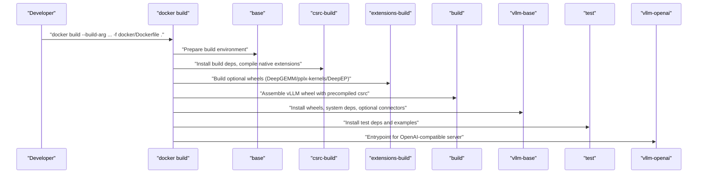

**Diagram sources**
- [docker/Dockerfile](file://docker/Dockerfile#L1-L640)

**Section sources**
- [docker/Dockerfile](file://docker/Dockerfile#L1-L640)

## Detailed Component Analysis

### CUDA Multi-Stage Build
- Base image selection:
  - Build base image and final base image are controlled via build args for hermetic builds and private registries.
  - Python installation uses Deadsnakes PPA with optional mirror and GPG key URL.
- Dependency installation:
  - uv is installed and used for fast dependency resolution and caching.
  - Private package indexes and authentication are configurable via environment variables.
- Native extensions:
  - CMake/Ninja-based build with optional sccache/ccache and parallelism controls.
  - Precompiled wheel extraction and reuse to avoid rebuilding native code.
- Optional extensions:
  - DeepGEMM built conditionally based on CUDA version.
  - pplx-kernels and DeepEP built as wheels and later installed.
- Final image:
  - Runtime dependencies installed, optional connectors, and entrypoints configured.

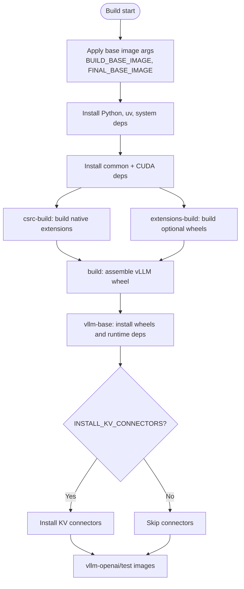

**Diagram sources**
- [docker/Dockerfile](file://docker/Dockerfile#L1-L640)
- [tools/install_deepgemm.sh](file://tools/install_deepgemm.sh#L1-L125)
- [tools/ep_kernels/install_python_libraries.sh](file://tools/ep_kernels/install_python_libraries.sh#L1-L191)

**Section sources**
- [docker/Dockerfile](file://docker/Dockerfile#L1-L640)
- [requirements/cuda.txt](file://requirements/cuda.txt#L1-L14)
- [requirements/common.txt](file://requirements/common.txt#L1-L55)
- [requirements/build.txt](file://requirements/build.txt#L1-L12)
- [tools/install_deepgemm.sh](file://tools/install_deepgemm.sh#L1-L125)
- [tools/ep_kernels/install_python_libraries.sh](file://tools/ep_kernels/install_python_libraries.sh#L1-L191)

### CPU-Only Build (x86_64, aarch64)
- Cross-architecture base images selected by TARGETARCH.
- ISA toggles for CPU builds (AVX512 variants, AMX BF16) via build args.
- Separate dev/test stages with optional package filtering for unsupported architectures.

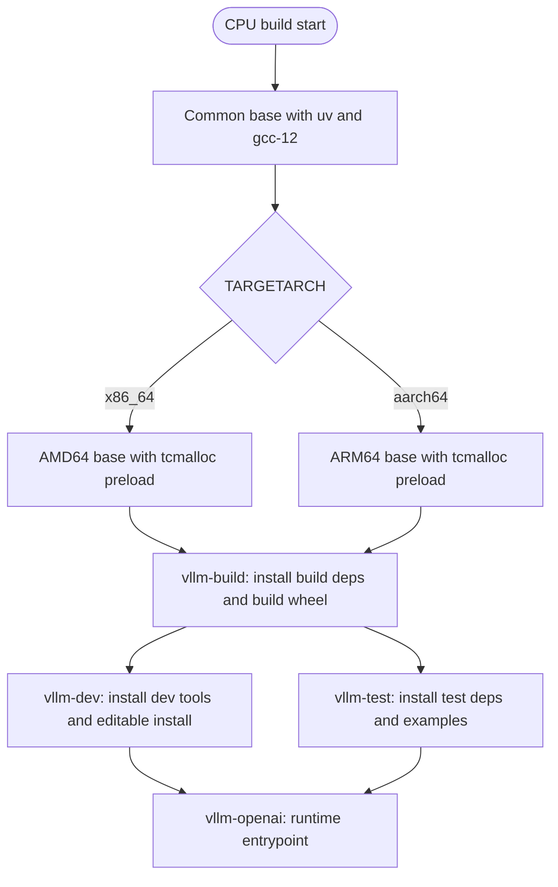

**Diagram sources**
- [docker/Dockerfile.cpu](file://docker/Dockerfile.cpu#L1-L204)

**Section sources**
- [docker/Dockerfile.cpu](file://docker/Dockerfile.cpu#L1-L204)
- [requirements/cpu.txt](file://requirements/cpu.txt#L1-L23)
- [requirements/common.txt](file://requirements/common.txt#L1-L55)

### ROCm Build
- Staged builds for Triton, PyTorch, Vision, Audio, FlashAttention, and aiter with pinned branches.
- Final image installs collected wheels and sets ROCm-specific environment variables.

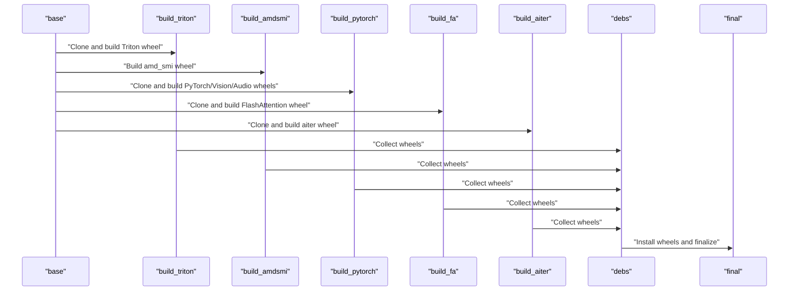

**Diagram sources**
- [docker/Dockerfile.rocm_base](file://docker/Dockerfile.rocm_base#L1-L165)

**Section sources**
- [docker/Dockerfile.rocm](file://docker/Dockerfile.rocm#L1-L148)
- [docker/Dockerfile.rocm_base](file://docker/Dockerfile.rocm_base#L1-L165)

### POWER/PPC64LE Build
- Multi-stage build of OpenBLAS, PyTorch family, PyArrow, OpenCV, numactl, and Numba.
- Final image installs collected wheels and sets library paths.

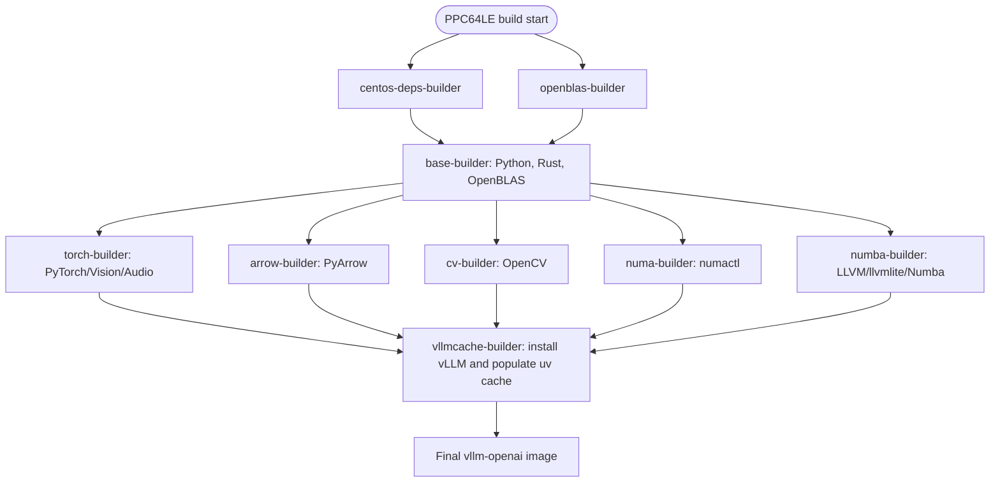

**Diagram sources**
- [docker/Dockerfile.ppc64le](file://docker/Dockerfile.ppc64le#L1-L349)

**Section sources**
- [docker/Dockerfile.ppc64le](file://docker/Dockerfile.ppc64le#L1-L349)

### IBM s390x Build
- Multi-stage build of PyArrow, OpenBLAS/LAPACK, Rust toolchain, Numba, and optional packages.
- Final image sets library paths and entrypoint.

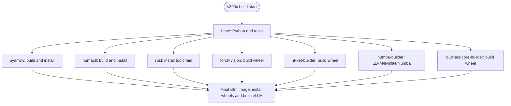

**Diagram sources**
- [docker/Dockerfile.s390x](file://docker/Dockerfile.s390x#L1-L267)

**Section sources**
- [docker/Dockerfile.s390x](file://docker/Dockerfile.s390x#L1-L267)

### TPU Build
- Uses a nightly Torch base image, removes conflicting packages, installs TPU-specific requirements, and builds vLLM in editable mode.

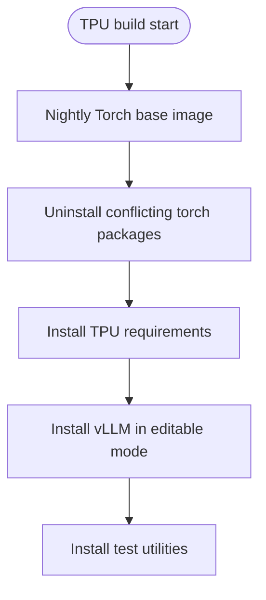

**Diagram sources**
- [docker/Dockerfile.tpu](file://docker/Dockerfile.tpu#L1-L37)

**Section sources**
- [docker/Dockerfile.tpu](file://docker/Dockerfile.tpu#L1-L37)

### XPU Build
- Intel oneAPI base image, oneCCL setup, and XPU-specific runtime configuration.

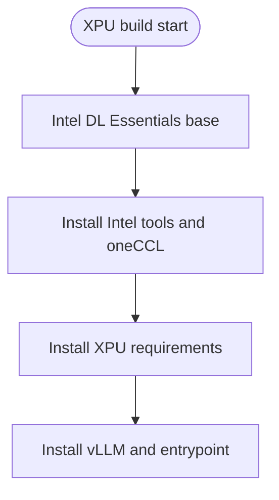

**Diagram sources**
- [docker/Dockerfile.xpu](file://docker/Dockerfile.xpu#L1-L87)

**Section sources**
- [docker/Dockerfile.xpu](file://docker/Dockerfile.xpu#L1-L87)

### Nightly Torch Build
- Builds against PyTorch nightly with pinned versions and AOT FlashInfer.

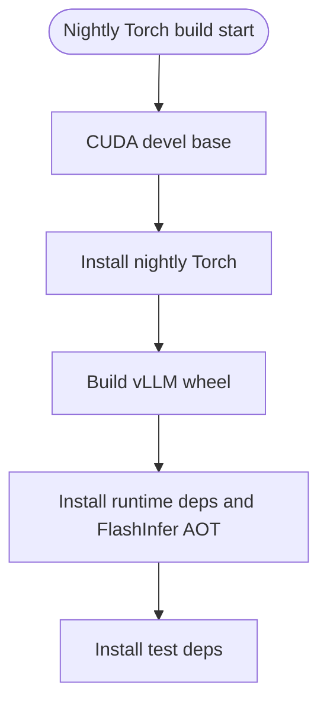

**Diagram sources**
- [docker/Dockerfile.nightly_torch](file://docker/Dockerfile.nightly_torch#L1-L283)

**Section sources**
- [docker/Dockerfile.nightly_torch](file://docker/Dockerfile.nightly_torch#L1-L283)

## Dependency Analysis
- Build-time dependencies:
  - CUDA: Torch, torchaudio, torchvision, FlashInfer, numba, and build tools.
  - CPU: Torch (CPU), optional Intel OpenMP, py-cpuinfo, and build tools.
  - ROCm: Triton, PyTorch stack, FlashAttention, aiter, and AMD SMI.
  - PPC64LE: OpenBLAS, PyTorch stack, PyArrow, OpenCV, numactl, Numba.
  - s390x: PyArrow, OpenBLAS/LAPACK, Rust, Numba, and optional packages.
  - TPU/XPU: Platform-specific requirements and runtime configuration.
- Runtime dependencies:
  - Common Python packages, OpenAI-compatible server dependencies, and optional connectors.

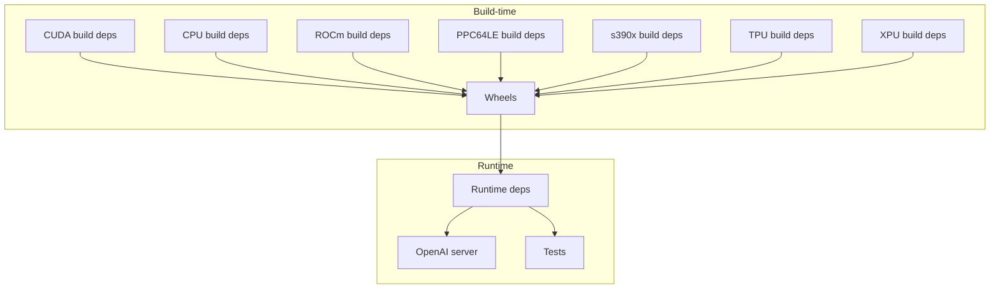

**Diagram sources**
- [requirements/cuda.txt](file://requirements/cuda.txt#L1-L14)
- [requirements/common.txt](file://requirements/common.txt#L1-L55)
- [requirements/build.txt](file://requirements/build.txt#L1-L12)
- [requirements/cpu.txt](file://requirements/cpu.txt#L1-L23)
- [docker/Dockerfile.rocm_base](file://docker/Dockerfile.rocm_base#L1-L165)
- [docker/Dockerfile.ppc64le](file://docker/Dockerfile.ppc64le#L1-L349)
- [docker/Dockerfile.s390x](file://docker/Dockerfile.s390x#L1-L267)
- [docker/Dockerfile.tpu](file://docker/Dockerfile.tpu#L1-L37)
- [docker/Dockerfile.xpu](file://docker/Dockerfile.xpu#L1-L87)

**Section sources**
- [requirements/cuda.txt](file://requirements/cuda.txt#L1-L14)
- [requirements/common.txt](file://requirements/common.txt#L1-L55)
- [requirements/build.txt](file://requirements/build.txt#L1-L12)
- [requirements/cpu.txt](file://requirements/cpu.txt#L1-L23)
- [docker/Dockerfile.rocm_base](file://docker/Dockerfile.rocm_base#L1-L165)
- [docker/Dockerfile.ppc64le](file://docker/Dockerfile.ppc64le#L1-L349)
- [docker/Dockerfile.s390x](file://docker/Dockerfile.s390x#L1-L267)
- [docker/Dockerfile.tpu](file://docker/Dockerfile.tpu#L1-L37)
- [docker/Dockerfile.xpu](file://docker/Dockerfile.xpu#L1-L87)

## Performance Considerations
- Parallelism:
  - MAX_JOBS and NVCC_THREADS control Ninja job count and nvcc threads respectively.
  - sccache/ccache can be enabled via build args to speed up repeated builds.
- Caching:
  - uv cache mounts and ccache directories are used across stages to speed up installs and compiles.
  - Precompiled wheels for native extensions reduce rebuild time.
- Index and authentication:
  - Configure PIP_INDEX_URL/UV_INDEX_URL and PIP_KEYRING_PROVIDER for private indexes and authentication.
- Cross-platform:
  - Use TARGETPLATFORM/TARGETARCH to select appropriate base images and runtime libraries.
- Image size:
  - Keep final images minimal by avoiding unnecessary system packages and copying only required wheels and examples.

[No sources needed since this section provides general guidance]

## Troubleshooting Guide
- Compilation errors:
  - Ensure GCC alternatives are set and compatible with CUDA toolkit.
  - Verify NVCC threads and MAX_JOBS are set appropriately for the host CPU.
  - Confirm sccache/ccache availability and credentials when using remote caches.
- Dependency conflicts:
  - For TPU/XPU builds, remove conflicting packages before installing platform-specific requirements.
  - On s390x, ensure library paths include OpenBLAS/LAPACK and Numba dependencies.
- Nightly Torch builds:
  - Pin Torch versions to match the nightly base image to avoid ABI mismatches.
- Optional components:
  - DeepGEMM is built conditionally based on CUDA version; ensure CUDA version meets minimum requirements.
  - pplx-kernels/DeepEP require NVSHMEM; ensure correct CUDA major version and architecture detection.

**Section sources**
- [docker/Dockerfile](file://docker/Dockerfile#L1-L640)
- [docker/Dockerfile.tpu](file://docker/Dockerfile.tpu#L1-L37)
- [docker/Dockerfile.xpu](file://docker/Dockerfile.xpu#L1-L87)
- [docker/Dockerfile.nightly_torch](file://docker/Dockerfile.nightly_torch#L1-L283)
- [tools/install_deepgemm.sh](file://tools/install_deepgemm.sh#L1-L125)
- [tools/ep_kernels/install_python_libraries.sh](file://tools/ep_kernels/install_python_libraries.sh#L1-L191)

## Conclusion
The vLLM repository provides robust, multi-platform Docker build configurations that support custom base images, private registries, and optional components. By leveraging multi-stage builds, parallel extension builds, and caching strategies, teams can produce efficient, secure, and reproducible images tailored to their infrastructure and hardware backends.

[No sources needed since this section summarizes without analyzing specific files]

## Appendices

### Build Arguments and Environment Variables
- CUDA-based build:
  - BUILD_BASE_IMAGE, FINAL_BASE_IMAGE, CUDA_VERSION, PYTHON_VERSION, DEADSNAKES_MIRROR_URL, DEADSNAKES_GPGKEY_URL, GET_PIP_URL, PIP_INDEX_URL, PIP_EXTRA_INDEX_URL, UV_INDEX_URL, UV_EXTRA_INDEX_URL, PYTORCH_CUDA_INDEX_BASE_URL, PIP_KEYRING_PROVIDER, UV_KEYRING_PROVIDER, INSTALL_KV_CONNECTORS, USE_SCCACHE, SCCACHE_* (endpoint, bucket, region, credentials), VLLM_USE_PRECOMPILED, VLLM_MERGE_BASE_COMMIT, VLLM_MAIN_CUDA_VERSION, MAX_JOBS, NVCC_THREADS, VLLM_TARGET_DEVICE.
- CPU-only build:
  - PYTHON_VERSION, VLLM_CPU_DISABLE_AVX512, VLLM_CPU_AVX512BF16, VLLM_CPU_AVX512VNNI, VLLM_CPU_AMXBF16.
- ROCm build:
  - BASE_IMAGE, TRITON_* branches/repos, PYTORCH_* branches/repos, FA_* branches/repos, AITER_* branches/repos, PYTORCH_ROCM_ARCH.
- Nightly Torch build:
  - CUDA_VERSION, PINNED_TORCH_VERSION.
- TPU/XPU builds:
  - Platform-specific environment variables and runtime configuration.

**Section sources**
- [docker/Dockerfile](file://docker/Dockerfile#L1-L640)
- [docker/Dockerfile.cpu](file://docker/Dockerfile.cpu#L1-L204)
- [docker/Dockerfile.rocm_base](file://docker/Dockerfile.rocm_base#L1-L165)
- [docker/Dockerfile.nightly_torch](file://docker/Dockerfile.nightly_torch#L1-L283)
- [vllm/envs.py](file://vllm/envs.py#L450-L520)

### Example docker build Commands
- CUDA with custom base image and Python version:
  - docker build --build-arg BUILD_BASE_IMAGE=registry.example.com/base:tag --build-arg FINAL_BASE_IMAGE=registry.example.com/runtime:tag --build-arg PYTHON_VERSION=3.12 -f docker/Dockerfile -t vllm-cuda .
- CPU with specific ISA flags:
  - docker buildx build --platform linux/arm64 --build-arg VLLM_CPU_DISABLE_AVX512=true -f docker/Dockerfile.cpu -t vllm-cpu-aarch64 .
- ROCm with custom base:
  - docker build --build-arg BASE_IMAGE=rocm/my-base:7.1 -f docker/Dockerfile.rocm -t vllm-rocm .
- Nightly Torch:
  - docker build --build-arg PINNED_TORCH_VERSION=torch==2.9.0+nightly -f docker/Dockerfile.nightly_torch -t vllm-nightly .

**Section sources**
- [docker/Dockerfile](file://docker/Dockerfile#L1-L640)
- [docker/Dockerfile.cpu](file://docker/Dockerfile.cpu#L1-L204)
- [docker/Dockerfile.rocm](file://docker/Dockerfile.rocm#L1-L148)
- [docker/Dockerfile.nightly_torch](file://docker/Dockerfile.nightly_torch#L1-L283)

### Custom Dependency Injection and Private Indexes
- Use PIP_INDEX_URL/UV_INDEX_URL and PIP_EXTRA_INDEX_URL/UV_EXTRA_INDEX_URL to point to private indexes.
- Configure PIP_KEYRING_PROVIDER/UV_KEYRING_PROVIDER for authentication with private registries.
- For CPU builds, override PIP_EXTRA_INDEX_URL to point to CPU Torch index.

**Section sources**
- [docker/Dockerfile](file://docker/Dockerfile#L1-L640)
- [docker/Dockerfile.cpu](file://docker/Dockerfile.cpu#L1-L204)

### Cross-Platform and Container Runtime Compatibility
- Use docker buildx with --platform to target specific architectures (e.g., linux/arm64, linux/amd64).
- Ensure base images are compatible with the target runtime (containerd, CRI-O, etc.) and that required system libraries are present.

**Section sources**
- [docker/Dockerfile.cpu](file://docker/Dockerfile.cpu#L1-L204)
- [docker/Dockerfile.ppc64le](file://docker/Dockerfile.ppc64le#L1-L349)
- [docker/Dockerfile.s390x](file://docker/Dockerfile.s390x#L1-L267)

### Build Artifact Management and Security Hardening
- Artifacts:
  - Precompiled wheels are cached and reused to reduce build time.
  - Optional extension wheels are built and installed separately.
- Security:
  - Prefer minimal base images and remove unused packages in final stages.
  - Use private registries and authenticated indexes.
  - Avoid embedding secrets in images; pass credentials via build args or secret mounts when supported.

**Section sources**
- [docker/Dockerfile](file://docker/Dockerfile#L1-L640)
- [docker/Dockerfile.ppc64le](file://docker/Dockerfile.ppc64le#L1-L349)
- [docker/Dockerfile.s390x](file://docker/Dockerfile.s390x#L1-L267)